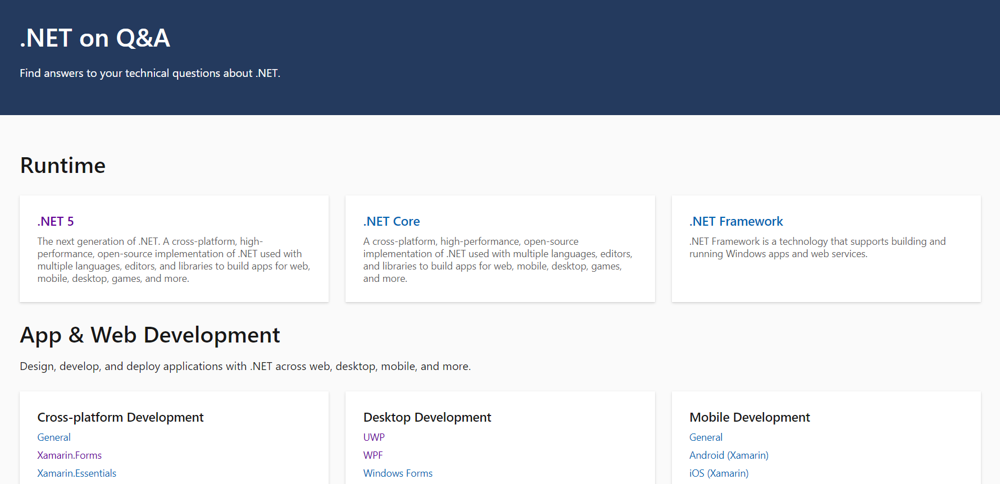
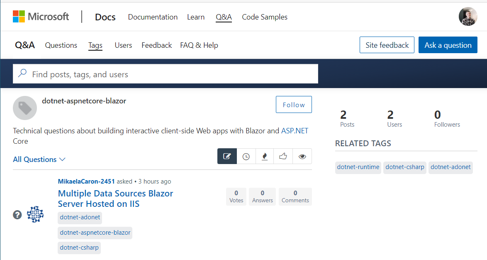

Have you ever been working on some code and ran into an issue and needed to ask someone for help? Maybe you are looking for assistanct on how to start your next app or perhaps you are seeking some architecture guidance? What is there was one place where you could go to get your technical questions answered by experts from Microsoft and the community? Well there is with the launch of [Microsoft Q&A for .NET](https://docs.microsoft.com/answers/products/dotnet?WT.mc_id=friends-0000-jamont)! 

Microsoft Q&A is the home for technical questions and answers at Microsoft. If you are looking for help on [any Microsoft product](https://docs.microsoft.com/answers/products/?WT.mc_id=friends-0000-jamont) you are sure to find it on Microsoft Q&A. Join the community of growing experts who are here to help developers get the help and answers they need on their projects. When you head to Microsoft Q&A for .NET you will find a wide range of .NET topics including runtime, app & web development, langauges, data, and more. Pick one that you need help with or are interested in helping out on and browse questions from the community.

Ask a question, follow the topic, or pick out a question that you know the answer to. Your Microsoft Q&A profile is linked to your [Microsoft Learn](https://docs.microsoft.com/learn/dotnet/?WT.mc_id=friends-0000-jamont) and you can get gain reputation points by being active.

As you can see I just started my journey on [Microsoft Q&A](https://docs.microsoft.com/answers/products/dotnet?WT.mc_id=friends-0000-jamont), and I hope that you will join me!

### What about existing forums?
There are many forums around .NET topics including MSDN, ASP.NET, IIS.NET, and Xamarin. It has been amazing to see the forums thrive over the years and we we are always looking for ways to engage deeper with the community. Microsoft Q&A brings together not only all topics on .NET into a single platform, but for all Microsoft products that developers use. Over time each of the forums will migrate fully to the Microsoft Q&A platform so we encourage you to start posting new questions on Q&A today. Look for notification on each forum for more information when the time comes for migration.
