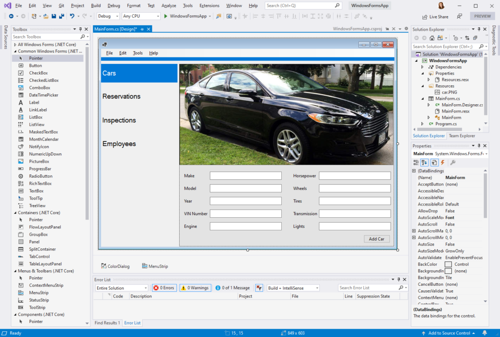
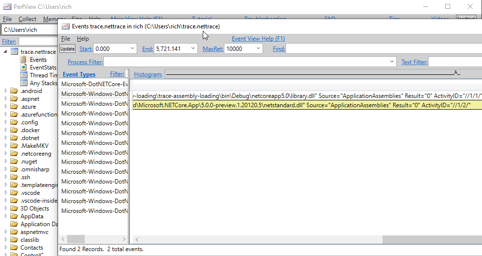
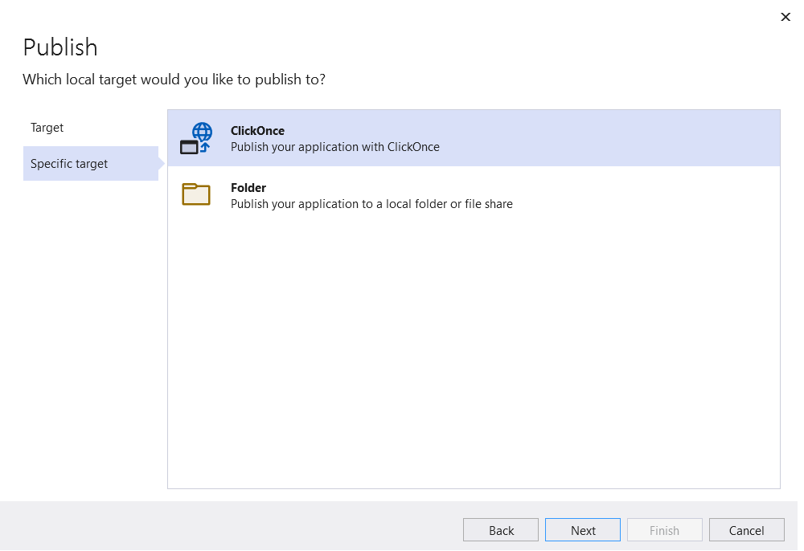

We're excited to release .NET 5.0 today and for you to start using it. It's a major release -- including C# 9 and F# 5 -- with a broad set of new features and compelling improvements. It's already in active use by teams at Microsoft and other companies, in production and for performance testing. Those teams are showing us great results that demonstrate performance gains and/or opportunities to reduce hosting costs for their web applications. We've been running [our own website on 5.0 starting with Preview 1](https://devblogs.microsoft.com/dotnet/announcing-net-5-0-preview-2/#closing). From what we've seen and heard so far, .NET 5.0 delivers significant value without much effort to upgrade. It's a great choice for your next app, and a straightforward upgrade from earlier .NET Core versions. We hope you enjoy using it, on your desktop, laptop, and cloud instances.

ASP.NET Core and EF Core are also being released today.

You can [download .NET 5.0](https://dotnet.microsoft.com/download/dotnet/5.0), for Windows, macOS, and Linux, for x86, x64, Arm32, Arm64.

* [Installers and binaries](https://dotnet.microsoft.com/download/dotnet/5.0)
* [Container images](https://hub.docker.com/_/microsoft-dotnet)
* [Linux packages](https://github.com/dotnet/core/blob/master/release-notes/5.0/preview/5.0.0-rc.2-install-instructions.md)
* [Release notes](https://github.com/dotnet/core/tree/master/release-notes/5.0)
* [Known issues](https://github.com/dotnet/core/blob/master/release-notes/5.0/5.0-known-issues.md)
* [GitHub issue tracker](https://github.com/dotnet/core/issues)

For Visual Studio users, you need [Visual Studio 16.8](https://visualstudio.microsoft.com) or later to use .NET 5.0 on Windows and the latest version of [Visual Studio for Mac)](https://visualstudio.microsoft.com/vs/mac/) on macOS. The [C# extension](https://code.visualstudio.com/docs/languages/dotnet) for [Visual Studio Code](https://code.visualstudio.com/) already supports .NET 5.0 and C# 9.

.NET 5.0 is the first release in our .NET unification journey. We built .NET 5.0 to enable a much larger group of developers to migrate their .NET Framework code and apps to .NET 5.0. We've also done much of the early work in 5.0 so that Xamarin developers can use the unified .NET platform when we release .NET 6.0. There is more on .NET unification, later in the post.

Now is a good time to call out the incredible collaboration with everyone contributing to the .NET project. This release marks the fifth major .NET version as an open source project. There is now a large mix of individuals and small and large companies (including the [.NET Foundation corporate sponsors](https://dotnetfoundation.org/member/corporate-sponsors)) working together as a large community on various aspects of .NET in the [dotnet org on GitHub](https://github.com/dotnet/). The improvements in .NET 5.0 are the result of many people, their effort, smart ideas, and their care and love for the platform, all above and beyond Microsoft's stewardship of the project. From the core team working on .NET every day, we extend a very large "thank you" to everyone that contributed to .NET 5.0 (and previous releases)!

We [introduced .NET 5.0](https://devblogs.microsoft.com/dotnet/introducing-net-5/) way back in May 2019, and even set the November 2020 release date at that time. From that post: "we will ship .NET Core 3.0 this September, .NET 5 in November 2020, and then we intend to ship a major version of .NET once a year, every November". You'd think that "November 2020" was a cheque that could not be cashed given all the challenges this year, however, .NET 5.0 has been released on time. Thanks to everyone on the team that made that happen! I know it has not been easy. Looking forward, you should expect .NET 6.0 in November 2021. We intend to release new .NET versions every November.

The rest of the blog is dedicated to highlighting and detailing most of the improvements in .NET 5.0. There is also an update on our .NET unification vision.

## .NET 5.0 Highlights

There are many [important improvements in .NET 5.0](https://github.com/dotnet/runtime/issues/37269):

* **.NET 5.0 is already battle-tested** by being hosted for months at [dot.net](https://dot.net/) and [Bing.com](https://www.bing.com/version).
* **Performance is greatly improved** across many components and is described in detail at [Performance Improvements in .NET 5.0](https://devblogs.microsoft.com/dotnet/performance-improvements-in-net-5/), [Arm64 Performance in .NET 5.0](https://devblogs.microsoft.com/dotnet/Arm64-performance-in-net-5/), and [gRPC](https://devblogs.microsoft.com/aspnet/grpc-performance-improvements-in-net-5/).
* **C# 9 and F# 5 offer new language improvements** such as top-level programs and records for C# 9, while F# 5 offers interactive programming and a performance boost for functional programming on .NET.
* **.NET libraries have enhanced performance for** Json serialization, [regular expressions](https://devblogs.microsoft.com/dotnet/regex-performance-improvements-in-net-5/), and HTTP ([HTTP 1.1](https://github.com/dotnet/corefx/pull/41640), [HTTP/2](https://github.com/dotnet/runtime/pull/35694)). They are also are now completely annotated for nullability.
* **P95 latency has dropped** due to refinements in the [GC](https://github.com/dotnet/coreclr/pull/27578), [tiered compilation](https://github.com/dotnet/runtime/pull/32250), and [other areas](https://github.com/dotnet/runtime/issues/37534).
* **Application deployment options are better**, with [single-file apps](https://github.com/dotnet/runtime/issues/36590), [reduced container image size](https://github.com/dotnet/dotnet-docker/issues/1814#issuecomment-625294750), and ClickOnce client app publishing.
* **Platform scope expanded** with [Windows Arm64](https://github.com/dotnet/runtime/issues/36699) and [WebAssembly](https://github.com/dotnet/runtime/issues/38367).

I've written many samples for the .NET 5.0 preview posts. You might want to take a look at [.NET 5.0 Examples](https://gist.github.com/richlander/50c34a8714eb3436e5d9d4d5d420776e) to learn more about new C# 9 and libraries features.

## Platform and Microsoft Support

.NET 5.0 has a nearly identical [platform support matrix](https://github.com/dotnet/core/blob/master/release-notes/5.0/5.0-supported-os.md) as [.NET Core 3.1](https://github.com/dotnet/core/blob/master/release-notes/3.1/3.1-supported-os.md), for Windows, macOS, and Linux. If you are using .NET Core 3.1 on a supported operating system, you should be able to adopt .NET 5.0 on that same operating system version for the most part. The most significant addition for .NET 5.0 is Windows Arm64.

.NET 5.0 is a [current release](https://github.com/dotnet/core/blob/master/microsoft-support.md#current-releases). That means that it will be supported for three months after .NET 6.0 is released. As a result, we expect to support .NET 5.0 through the middle of February 2022. .NET 6.0 will be an LTS release and will be supported for three years, just like .NET Core 3.1.

## Unified platform vision

Last year, we shared a [vision of a unified .NET stack and ecosystem](https://devblogs.microsoft.com/dotnet/introducing-net-5/). The value to you is that you will be able to use a single set of APIs, languages, and tools to target a broad set of application types, including mobile, cloud, desktop, and IoT. You might realize that you can already target a broad set of platforms with .NET today, however, the tools and APIs are not always the same across Web and Mobile, for example, or released at the same time. As part of .NET 5.0 and 6.0, we are unifying .NET into a single product experience, while enabling you to pick just the parts of the .NET platform that you want to use. If you want to target Mobile and not WebAssembly, you don't need to download the WebAssembly tools, and vice versa. Same with ASP.NET Core and WPF. You'll also have a much easier way to acquire all the .NET tools and build and runtime packs that you need from the command line. We're enabling a  package manager experience (including using existing package managers) for .NET platform components. That will be great for many scenarios. Quick construction of a development environment and CI/CD will probably be the biggest beneficiaries.

We had intended to deliver the entirety of the unification vision with .NET 5.0, but in the wake of the global pandemic, we had to adapt to the changing needs of our customers. We've been working with teams from companies from around the world that have needed help to speed up their adoption of cloud technologies. They, too, have had adapt to the changing needs of their customers. As a result, we are delivering the vision across two releases.

The first step towards this vision was [consolidating .NET repos](https://github.com/dotnet/announcements/issues/119), including a large subset of Mono. Having one repo for the runtime and libraries for .NET is a precondition to delivering the same product everywhere. It also helps with making broad changes that affect runtime and libraries, where there were previously repo boundaries. Some people were worried that a large repo would be harder to manage. That hasn't proven to be the case.

In the .NET 5.0 release, Blazor is best example of taking advantage of repo consolidation and .NET unification. The runtime and libraries for [Blazor WebAssembly](https://devblogs.microsoft.com/aspnet/asp-net-core-updates-in-net-5-preview-7/#blazor-webassembly-apps-now-target-net-5) are now built from the consolidated [dotnet/runtime](https://github.com/dotnet/runtime) repo. That means Blazor WebAssembly and Blazor on the server use the exact same code for `List<T>`, for example. That wasn't the case for Blazor prior to .NET 5.0. The approach we took for Blazor WebAssembly is very similar to what we'll do with Xamarin in .NET 6.0.

The .NET Framework remains a supported Microsoft product and will continue to be supported with each new version of Windows. We announced last year that we had [stopped adding new features to .NET Framework](https://devblogs.microsoft.com/dotnet/net-core-is-the-future-of-net/) and [finished adding .NET Framework APIs to .NET Core](https://github.com/dotnet/announcements/issues/130). That means that now is a great time to consider moving your .NET Framework apps to .NET Core. For .NET Framework client developers, Windows Forms and WPF are supported with .NET 5.0. We've heard from many developers that porting from .NET Framework is straightforward. For .NET Framework server developers, you need to adopt ASP.NET Core to use .NET 5.0. For Web Forms developers, we believe that [Blazor](https://devblogs.microsoft.com/aspnet/asp-net-core-updates-in-net-5-preview-7/) provides a similar developer experience with an efficient and much more modern implementation. WCF server and Workflow users can look to [community projects that are supporting those frameworks](https://devblogs.microsoft.com/dotnet/supporting-the-community-with-wf-and-wcf-oss-projects/). The [porting from .NET Framework to .NET Core](https://docs.microsoft.com/dotnet/core/porting/) doc is a good place to start. That all said, keeping your app on .NET Framework is a fine approach if you are happy with your experience.

The Windows team is working on [Project Reunion](https://github.com/microsoft/ProjectReunion) as the next step forward for UWP and related technologies. We've been collaborating with the Reunion team to ensure that .NET 5.0 and later versions will work well with WinUI and WebView2. The Project Reunion repo is the best place to stay up to date with progress.

Let's switch to looking at what's new in the 5.0 release.

## Languages

C# 9 and F# 5 are part of the .NET 5.0 release and included in the .NET 5.0 SDK. Visual Basic is also included in the 5.0 SDK. It does not include language changes, but has improvements to support the Visual Basic Application Framework on .NET Core.

[C# Source Generators](https://devblogs.microsoft.com/dotnet/introducing-c-source-generators/) are an important new C# compiler feature. They are not technically part of C# 9 since it doesn't have any language syntax. See [New C# Source Generator Samples](https://devblogs.microsoft.com/dotnet/new-c-source-generator-samples/) to help you get started using this new feature. We expect to make more use of [source generators within the .NET product](https://github.com/dotnet/runtime/issues/43545) in .NET 6.0 and beyond.

As a way to try out the new release ourselves, a few of us decided to update the [dotnet/iot](https://github.com/dotnet/iot/) repo to use new C# 9 syntax and target .NET 5.0. It uses top-level programs, records, patterns, and switch expressions. It has also been updated to take advantage of the complete set of nullable annotations in .NET libraries. We'll take a look at few examples from that repo to explore C# 9.

### Top-level programs

The [led-blink](https://github.com/dotnet/iot/blob/master/samples/led-blink/Program.cs) program is a nice compact top-level program example.

``` csharp
using System;
using System.Device.Gpio;
using System.Threading;

var pin = 18;
var lightTime = 1000;
var dimTime = 200;

Console.WriteLine($"Let's blink an LED!");
using GpioController controller = new ();
controller.OpenPin(pin, PinMode.Output);
Console.WriteLine($"GPIO pin enabled for use: {pin}");

// turn LED on and off
while (true)
{
    Console.WriteLine($"Light for {lightTime}ms");
    controller.Write(pin, PinValue.High);
    Thread.Sleep(lightTime);

    Console.WriteLine($"Dim for {dimTime}ms");
    controller.Write(pin, PinValue.Low);
    Thread.Sleep(dimTime);
}
```

You can also see the use of target-typed `new`, with the assignment to the `controller` variable. The `GpioController` type is only defined on the left-hand side of the assignment. The type is inferred on the right-hand side. This new syntax is an alternative to `var`, which has the type only showing on the right-hand side of the assignment and is inferred on the left-hand side with the `var` keyword.

Top-level programs can also grow in complexity, by defining methods and taking advantage of types defined in the same or other files. The [CharacterLcd](https://github.com/dotnet/iot/blob/master/src/devices/CharacterLcd/samples/Program.cs) sample demonstrates some of those capabilities.

### Logical and property patterns

C# 9 includes support for new patterns. You can see an example of a logical pattern in the [following code](https://github.com/dotnet/iot/blob/54469318f33124e3455bf974e6a75167dfb831e6/src/devices/Ccs811/samples/Program.cs#L109) from the [CCS811 Gas sensor](https://github.com/dotnet/iot/blob/master/src/devices/Ccs811/README.md).

```csharp
var threshChoice = Console.ReadKey();
Console.WriteLine();
if (threshChoice.KeyChar is 'Y' or 'y')
{
   TestThresholdAndInterrupt(ccs811);
}
```

Another new pattern is property patterns. You can see several properties checks in my [Mycroft information access 6.0](https://gist.github.com/richlander/c911b8e3a0aefcefee9e01ee338a5fdd#file-program-cs-L83) sample. The [following code](https://github.com/dotnet/iot/blob/0b7733e5580ad55fc80e76e0587740d95c5ea0c2/src/devices/Pn532/Pn532.cs#L813) is taken from the [PN532 RFID and NFC reader](https://github.com/dotnet/iot/blob/master/src/devices/Pn532/README.md) sample.

```csharp
if (pollingType is not { Length: >15 })
{
      return null;
}
```

This code tests that `pollingType` (which is typed as `byte[]`) is not null and does not contain >15 bytes.

Honorable mentions:

* [Logical pattern](https://github.com/dotnet/iot/blob/0b7733e5580ad55fc80e76e0587740d95c5ea0c2/src/devices/Mcp25xxx/Register/MessageReceive/RxBxDn.cs#L65-L66)
* [Logical pattern](https://github.com/dotnet/iot/blob/0b7733e5580ad55fc80e76e0587740d95c5ea0c2/src/devices/Buzzer/samples/MelodyPlayer.cs#L83)

## Records

C# 9 includes a new type of class called a record. It has a number of benefits compared to regular classes, half of which relate to more terse syntax. The [following record](https://github.com/dotnet/iot/blob/a0231d4397de913f328829cead587ca6ef355e27/src/devices/Bh1745/Bh1745.cs#L17) is taken from the [Bh1745 RGB Sensor](https://github.com/dotnet/iot/tree/master/src/devices/Bh1745) binding.

```csharp
public record ChannelCompensationMultipliers(double Red, double Green, double Blue, double Clear);
```

It is then used [a little later in the same file](https://github.com/dotnet/iot/blob/a0231d4397de913f328829cead587ca6ef355e27/src/devices/Bh1745/Bh1745.cs#L46), with familiar syntax:

```csharp
ChannelCompensationMultipliers = new (2.2, 1.0, 1.8, 10.0);
```

### Nullability annotation improvements

The .NET libraries are now completely annotated for [nullability](https://devblogs.microsoft.com/dotnet/embracing-nullable-reference-types/). That means if you [enable nullability](https://docs.microsoft.com/dotnet/csharp/nullable-references), you'll get more type information from the platform to direct your use of the feature. At present, the [.NET docs](https://docs.microsoft.com/dotnet/) have not been fully annotated. For example, [`String.IsNullOrEmpty(string)`](https://docs.microsoft.com/dotnet/api/system.string.isnullorempty?view=net-5.0) should be annotated to take a `string?`, while [String.Split(Char[])](https://docs.microsoft.com/dotnet/api/system.string.split?view=net-5.0#System_String_Split_System_Char___) has an annotation of `char[]?`. We hope that will get fixed soon. Complete information is available at [source.dot.net](https://source.dot.net/#System.Private.CoreLib/String.cs,492) and via F12 metadata lookups in Visual Studio.

The [System.Device.Gpio](https://www.nuget.org/packages/System.Device.Gpio) and [Iot.Device.Bindings](https://www.nuget.org/packages/Iot.Device.Bindings) packages (version 1.1.0 for both) have also been annotated as part of this release, using the updated .NET 5.0 annotations. Those libraries are both multi-targeted, however, we use the 5.0 view to produce annotations for all targets.

Note: Existing .NET Core 3.1 code might generate new diagnostics (if you have nullability enabled) when you retarget it to .NET 5.0, since there are new annotations.

We've also added new annotation types. It's common for large classes to instantiate object members in helper methods called from a constructor. The C# compiler can't follow the flow of calls to the object assignment. It will think that the member is null when exiting the constructor and will warn with `CS8618`. The [MemberNotNull](https://docs.microsoft.com/dotnet/api/system.diagnostics.codeanalysis.membernotnullattribute) attribute resolves this problem. You apply the attribute to the helper method. The compiler will then see that you set this value and realize that the method is called from a constructor. [MemberNotNullWhen](https://docs.microsoft.com/dotnet/api/system.diagnostics.codeanalysis.membernotnullwhenattribute) is similar.

You can see an example of `MemberNotNull` in the [BMxx80 temperature sensors](https://github.com/dotnet/iot/tree/master/src/devices/Bmxx80) with the [following code](https://github.com/dotnet/iot/blob/54469318f33124e3455bf974e6a75167dfb831e6/src/devices/Bmxx80/Bmxx80Base.cs#L311-L313).

```csharp
[MemberNotNull(nameof(_calibrationData))]
private void ReadCalibrationData()
{
   switch (this)
   {
         case Bme280 _:
            _calibrationData = new Bme280CalibrationData();
            _controlRegister = (byte)Bmx280Register.CTRL_MEAS;
            break;
         case Bmp280 _:
            _calibrationData = new Bmp280CalibrationData();
            _controlRegister = (byte)Bmx280Register.CTRL_MEAS;
            break;
         case Bme680 _:
            _calibrationData = new Bme680CalibrationData();
            _controlRegister = (byte)Bme680Register.CTRL_MEAS;
            break;
         default:
            throw new Exception("Bmxx80 device not correctly configured. Could not find calibraton data.");
   }

   _calibrationData.ReadFromDevice(this);
}
```

The [actual code](https://github.com/dotnet/iot/blob/54469318f33124e3455bf974e6a75167dfb831e6/src/devices/Bmxx80/Bmxx80Base.cs#L311-L313) uses conditional compilation. That's because the project is multi-targeted, and this attribute is only supported with .NET 5.0+ . The use of the attribute enables skipping runtime checks (in the constructor) that would otherwise be needed to satisfy nullability requirements, as [is the case for earlier .NET versions](https://github.com/dotnet/iot/blob/54469318f33124e3455bf974e6a75167dfb831e6/src/devices/Bmxx80/Bmxx80Base.cs#L90-L95).

## Tools

We've improved the Windows Forms designer, changed the way that target frameworks work for .NET 5.0 and beyond, changed the way that WinRT is supported, and made other improvements.

### Windows Forms designer

The Windows Forms designer (for .NET Core 3.1 and .NET 5.0) has been updated in Visual Studio 16.8, and now supports all Windows Forms controls. It also supports all of the Telerik controls. The designer includes all the designer functionality you would expect, including: drag-and-drop, selection, move and resize, cut/copy/paste/delete of controls, integration with the Properties Window, events generation and more. Data binding and support for a broader set of third party controls is coming soon.



Learn more in the [Windows Forms Designer for .NET Core Released](https://devblogs.microsoft.com/dotnet/windows-forms-designer-for-net-core-released/) post.

### .NET 5.0 Target Framework

We have changed the approach we use for [target frameworks with .NET 5.0](https://devblogs.microsoft.com/dotnet/the-future-of-net-standard/). The following project file demonstrate the new .NET 5.0 target framework.

```xml
<Project Sdk="Microsoft.NET.Sdk">

  <PropertyGroup>
    <OutputType>Exe</OutputType>
    <TargetFramework>net5.0</TargetFramework>
  </PropertyGroup>

</Project>
```

The new `net5.0` form is more compact and intuitive than the `netcoreapp3.1` style we've used until this point. In addition, we are extending the target framework to describe operating system dependencies. This change is motivated by our vision to enable targeting iOS and Android with Xamarin in .NET 6.0.

Windows desktop APIs (including Windows Forms, WPF, and WinRT) will only be available when targeting `net5.0-windows`. You can specify an operating system version, like `net5.0-windows7` or `net5.0-windows10.0.17763.0` ( for [Windows October 2018 Update](https://en.wikipedia.org/wiki/Windows_10_version_history)). You need to target a Windows 10 version if you want to use [WinRT APIs](https://github.com/dotnet/runtime/issues/35318).

Cross-platform scenarios can be a bit more challenging, when using the new `net5.0-windows` TFM. [System.Device.Gpio](https://www.nuget.org/packages/System.Device.Gpio) demonstrates [a pattern for managing the Windows target-framework](https://github.com/dotnet/iot/blob/54469318f33124e3455bf974e6a75167dfb831e6/src/System.Device.Gpio/System.Device.Gpio.csproj#L4) if you want to avoid building for Windows or avoid pulling Windows runtime packages on Linux, for example.

Summary of changes:

* `net5.0` is the new Target Framework Moniker (TFM) for .NET 5.0.
* `net5.0` combines and replaces `netcoreapp` and `netstandard` TFMs.
* `net5.0` supports [.NET Framework compatibility mode](https://docs.microsoft.com/dotnet/core/porting/third-party-deps#net-framework-compatibility-mode)
* `net5.0-windows` will be used to expose Windows-specific functionality, including Windows Forms, WPF and WinRT APIs.
* .NET 6.0 will use the same approach, with `net6.0`, and will add `net6.0-ios` and `net6.0-android`.
* The OS-specific TFMs can include [OS version numbers](https://github.com/dotnet/designs/blob/master/accepted/2020/minimum-os-version/minimum-os-version.md), like `net6.0-ios14`.
* Portable APIs, like ASP.NET Core will be usable with `net5.0`. The same will be true of Xamarin forms with `net6.0`.

The templates in Visual Studio 16.8 still target .NET Core 3.1, for console, WPF and Windows Forms apps. The ASP.NET templates have been updated to support .NET 5.0. We will update the templates in Visual Studio 16.9 for the remaining templates.

### WinRT Interop (Breaking Change)

On the topic of targeting Windows APIs, we have moved to a [new model for supporting WinRT APIs as part of .NET 5.0](https://github.com/dotnet/runtime/issues/35318). This includes calling APIs (in either direction; CLR <==> WinRT), marshaling of data between the two type systems, and unification of types that are intended to be treated the same across the type system or [ABI](https://en.wikipedia.org/wiki/Application_binary_interface) boundary (i.e. "projected types"; [`IEnumerable<T>`](https://docs.microsoft.com/dotnet/api/system.collections.generic.ienumerable-1) and [`IIterable<T>`](https://docs.microsoft.com/uwp/api/windows.foundation.collections.iiterable-1) are examples).

The [existing WinRT interop system has been removed](https://github.com/dotnet/runtime/issues/37672) from the .NET runtime as part of .NET 5.0. This is a breaking change. That means that apps and libraries using WinRT with .NET Core 3.x will need to be rebuilt and will not run on .NET 5.0 as-is. Libraries that use WinRT APIs will need to multi-target to manage this difference between .NET Core 3.1 and .NET 5.0.

Going forward, we will rely on the new [CsWinRT tool](https://github.com/microsoft/CsWinRT) provided by the WinRT team in Windows. It generates C#-based WinRT interop assemblies, which can be delivered via NuGet. That's exactly what the Windows team is doing, for the WinRT APIs in Windows. The tool can be used by anyone that wants to use WinRT (on Windows) as an interop system, to expose native APIs to .NET or .NET APIs to native code.

The CsWinRT tools is logically similar to tlbimp and tlbexp, although much better. The tlb tools relied on a lot of COM interop plumbing in the .NET runtime. The CsWinRT tool only relies on public .NET APIs. That said, the [function pointers](https://docs.microsoft.com/dotnet/csharp/language-reference/proposals/csharp-9.0/function-pointers) feature in C# 9 -- and partially implemented in the .NET 5.0 runtime -- was in part inspired by the needs of the CsWinRT tool.

There are several benefits to this new WinRT interop model:

* It can be developed and improved separate from the .NET runtime.
* It is symmetrical with the tool-based interop systems provided for other OSes, like iOS and Android.
* The tool can take advantage of other .NET features (AOT, C# features, IL linking), which was not an option for the previous system.
* Simplifies the [.NET runtime codebase](https://github.com/dotnet/runtime/pull/36715).

You don't need to add NuGet references to use WinRT APIs. Targeting a Windows 10 TFM -- just discussed in the .NET 5.0 TFM section earlier -- is enough. If you target .NET Core 3.1 or earlier, you need to reference WinRT packages. You can see this pattern in the [System.Device.Gpio project](https://github.com/dotnet/iot/blob/17d497e71147431e12784fcd15e6aaea37a409a3/src/System.Device.Gpio/System.Device.Gpio.csproj#L24-L40).

### Native exports

We've had requests to enable exports for native binaries that calls into .NET code for a long time. The building block for the scenario is [hosting API support](https://github.com/dotnet/runtime/blob/3247a54a4263dc2a492b740223b6f062672f70d7/src/installer/corehost/cli/coreclr_delegates.h#L22) for [UnmanagedCallersOnlyAttribute](https://github.com/dotnet/runtime/blob/master/src/libraries/System.Private.CoreLib/src/System/Runtime/InteropServices/UnmanagedCallersOnlyAttribute.cs).

This feature is a building-block for creating higher level experiences. [Aaron Robinson](https://github.com/AaronRobinsonMSFT), on our team, has been working on a [.NET Native Exports](https://github.com/AaronRobinsonMSFT/DNNE) project that provides a more complete experience for publishing .NET components as native libraries. We're looking for feedback on this capability to help decide if the approach should be included in the product.

The .NET Native exports project enables you to:

* Expose custom native exports.
* Doesn't require a higher-level interop technology like COM.
* Works cross-platform.

There are existing projects that enable similar scenarios, such as:

* [Unmanaged Exports](https://sites.google.com/site/robertgiesecke/Home/uploads/unmanagedexports)
* [DllExport](https://github.com/3F/DllExport)

Over the years, we've seen a variety of hosting models for .NET in native applications. [@rseanhall](https://github.com/rseanhall) proposed and implemented [a novel new model for doing that](https://github.com/dotnet/runtime/issues/35465), which takes advantage of all the built-in application functionality offered by the .NET application hosting layer (specifically loading dependencies), while enabling a custom entrypoint to be called from native code. That's perfect for a lot of scenarios, and that one can imagine becoming popular with developers that host .NET components from native applications. That didn't exist before. Thanks for the contribution, [@rseanhall](https://github.com/rseanhall).

Two primary PRs:

* [Enable calling get_runtime_delegate from app context](https://github.com/dotnet/runtime/pull/37473)
* [Implement hdt_get_function_pointer](https://github.com/dotnet/runtime/pull/37696)

### Event pipe

[Event pipe](https://devblogs.microsoft.com/dotnet/introducing-diagnostics-improvements-in-net-core-3-0/#tracing) is a new subsystem and API that we added in [.NET Core 2.2](https://devblogs.microsoft.com/dotnet/announcing-net-core-2-2/) to make it possible to perform [performance and other diagnostic investigations](https://github.com/dotnet/runtime/blob/master/docs/project/linux-performance-tracing.md) on any operating system. In .NET 5.0, the event pipe has been extended to enable profilers to write event pipe events. This scenario is critical for instrumenting profilers that previously relied on ETW (on Windows) to monitor application behavior and performance.

Assembly load information is now available via event pipe. This improvement is the start of making similar diagnostics functionality available as is part of .NET Framework, such as the [Fusion Log Viewer](https://docs.microsoft.com/dotnet/framework/tools/fuslogvw-exe-assembly-binding-log-viewer). You can now use [dotnet-trace]( https://docs.microsoft.com/dotnet/core/diagnostics/dotnet-trace) to collect this information, using the following command:

```console
dotnet-trace collect --providers Microsoft-Windows-DotNETRuntime:4:4 --process-id [process ID]
```

The workflow is described in [Trace Assembly Loading with Event Pipe](https://github.com/richlander/testapps/tree/master/trace-assembly-loading). You can see assembly loading information for a simple test app.



### `Microsoft.Extensions.Logging`

We've made improvements to the console log provider in the `Microsoft.Extensions.Logging` library. You can now implement a [custom `ConsoleFormatter`](https://github.com/dotnet/runtime/issues/34742) to exercise complete control over formatting and colorization of the console output. The formatter APIs allow for rich formatting by implementing a subset of the `VT-100` (supported by most modern terminals) escape sequences. The console logger can parse out escape sequences on unsupported terminals allowing you to author a single formatter for all terminals.

In addition to support for custom formatters, we've also added a built-in JSON formatter that emits structured JSON logs to the console.

### Dump debugging

Debugging managed code requires knowledge of managed objects and constructs. The Data Access Component (DAC) is a subset of the runtime execution engine that has knowledge of these constructs and can access these managed objects without a runtime. .NET Core process dumps collected on Linux can now be analyzed on Windows using WinDBG or `dotnet dump analyze`.

We've also added support for capturing ELF dumps from .NET processes running on macOS. Since ELF is not the native executable (native debuggers like `lldb` will not work with these dumps) file format on macOS, we have made this an opt-in feature. To enable support for dump collection on macOS, set the environment variable `COMPlus_DbgEnableElfDumpOnMacOS=1`. The resulting dumps can be analyzed using `dotnet dump analyze`.

### Printing environment information

As .NET has extended support for new operating systems and chip architectures, people sometimes want a way to print environment information. We created a simple .NET tool that does this, called [dotnet-runtimeinfo](https://www.nuget.org/packages/dotnet-runtimeinfo/).

You can install and run the tool with the following commands.

```console
dotnet tool install -f dotnet-runtimeinfo
dotnet-runtimeinfo
```

The tool produces output in the following form for your environment.

```console

[rich@taumarunui ~]$ dotnet-runtimeinfo
**.NET information
Version: 5.0.0
FrameworkDescription: .NET 5.0.0-preview.8
Libraries version: 5.0.0-preview.8
Libraries hash: 977a00fb9d587a6c1292fb3af3992038ddcd3016

**Environment information
OSDescription: Linux 5.8.3-2-MANJARO-ARM #1 SMP Sat Aug 22 21:00:07 CEST 2020
OSVersion: Unix 5.8.3.2
OSArchitecture: Arm64
ProcessorCount: 6

**CGroup info**
cfs_quota_us: -1
memory.limit_in_bytes: 9223372036854771712
memory.usage_in_bytes: 1199210496
```

## Runtime and Libraries

There were many improvements across the runtime and libraries.

### Code quality improvements in RyuJIT

There were a lot of improvements to the JIT this release, many of which I shared in previous .NET 5.0 preview posts. In this post, I'm elevating the changes that came from the community.

* [Use xmm for stack prolog - dotnet/runtime #32538](https://github.com/dotnet/runtime/pull/32538) -- Change to x86/x64 prolog zeroing code. Improvements: [Json](https://github.com/dotnet/runtime/pull/32538#issuecomment-595503265); [TechEmpower](https://github.com/dotnet/runtime/pull/32538#issuecomment-595619687/). Credit: [Ben Adams](https://github.com/benaadams).
* [Vectorise BitArray for Arm64 - dotnet/runtime #33749](https://github.com/dotnet/runtime/pull/33749) -- The [BitArray class](https://docs.microsoft.com/dotnet/api/system.collections.bitarray?view=netframework-4.8) was updated to include a [hardware-accelerated implementation for Arm64](https://github.com/dotnet/runtime/blob/8511b5b9cc957ce824fc88c0780249fc0edbef15/src/libraries/System.Collections/src/System/Collections/BitArray.cs#L181) using [Arm64 intrinisics](https://github.com/dotnet/runtime/tree/master/src/libraries/System.Private.CoreLib/src/System/Runtime/Intrinsics/Arm). The [performance improvements](https://github.com/dotnet/runtime/pull/33749#issuecomment-603597689) for BitArray are very significant. Credit to [@Gnbrkm41](https://github.com/Gnbrkm41).
* [Dynamic generic dictionary expansion feature dotnet/runtime #32270](https://github.com/dotnet/runtime/pull/32270) - Some (maybe most?) uses of generics now have better performance ([initial performance findings](https://github.com/dotnet/runtime/pull/32270#issuecomment-586459130)), based on improving the implementation of low-level (native code) dictionaries used by the runtime to store information about generic types and methods. See [Perf: Collection Count() is Slower in Core than the CLR](https://github.com/dotnet/runtime/issues/11971#issuecomment-462183168) for more information. Credit to [@RealDotNetDave](https://github.com/RealDotNetDave) for the bug report.
* [Implement Vector.Ceiling / Vector.Floor dotnet/runtime #31993](https://github.com/dotnet/runtime/pull/31993) -  Implement Vector.Ceiling / Vector.Floor using x64 and Arm64 intrinsics, per [API proposal](https://github.com/dotnet/runtime/issues/20509). Credit to [@Gnbrkm41](https://github.com/Gnbrkm41).
* [New, much faster, portable implementation of tailcall helpers](https://github.com/dotnet/runtime/pull/341). Credit: [Jakob Botsch Nielsen](https://github.com/jakobbotsch) (.NET team intern). [Reaction from @dsymetweets](https://twitter.com/dsymetweets/status/1255077752149094400).
* [Add VectorTableList and TableVectorExtension intrinsics](https://github.com/dotnet/runtime/pull/35600) -- Credit: [@TamarChristinaArm](https://github.com/TamarChristinaArm) (ARM Holdings)
* [Improved Intel architecture performance using new hardware intrinsics BSF/BSR](https://github.com/dotnet/runtime/pull/34550) -- Credit [@saucecontrol](https://github.com/saucecontrol)
* [Implement Vector{Size}<T>.AllBitsSet](https://github.com/dotnet/runtime/pull/33924)  -- Credit [@Gnbrkm41](https://github.com/Gnbrkm41)
* [Enable eliding some bounds checks](https://github.com/dotnet/runtime/pull/36263) -- Credit [@nathan-moore](https://github.com/nathan-moore)

## Garbage Collector

The following improvements were made in the GC.

* [Card mark stealing - dotnet/coreclr #25986](https://github.com/dotnet/coreclr/pull/25986) -- Server GC (on different threads) can now work-steal while marking gen0/1 objects held live by older generation objects. This means that ephemeral GC pauses are shorter for scenarios where some GC threads took much longer to mark than others.
* [Introducing Pinned Object Heap - dotnet/runtime #32283](https://github.com/dotnet/runtime/pull/32283) -- Adds the Pinned Object Heap (POH). This new heap (a peer to the Large Object Heap (LOH)) will allow the GC to manage pinned objects separately, and as a result avoid the negative effects of pinned objects on the generational heaps.
* [Allow allocating large object from free list while background sweeping SOH](https://github.com/dotnet/runtime/pull/2103) -- Enabled LOH allocations using the free list while BGC is sweeping SOH. Previously this was only using end of segment space on LOH. This allowed for better heap usage.
* [Background GC suspension fixes - dotnet/coreclr #27729](https://github.com/dotnet/coreclr/pull/27729) --	Suspension fixes to reduce time for both BGC and user threads to be suspended. This reduces the total time it takes to suspend managed threads before a GC can happen. [dotnet/coreclr #27578](https://github.com/dotnet/coreclr/pull/27578) also contributes to the same outcome.
* [Fix named cgroup handling in docker](https://github.com/dotnet/runtime/pull/980) -- Added support to read limits from named cgroups. Previously we only read from the global one.
* [Optimize vectorized sorting - dotnet/runtime #37159](https://github.com/dotnet/runtime/pull/37159) -- vectorized mark list sorting in GC which reduces the ephemeral GC pause time (also [dotnet/runtime #40613](https://github.com/dotnet/runtime/pull/40613)).
* [Generational aware analysis - dotnet/runtime #40322](https://github.com/dotnet/runtime/pull/40332) -- generational aware analysis that allows you to determine what old generation objects hold on to younger generation objects thus making them survive and contribute to ephemeral GC pause time.
* [Optimize decommitting GC heap memory pages - dotnet/runtime #35896](https://github.com/dotnet/runtime/pull/35896) -- optimized decommit, much better decommit logic and for Server GC took decommit completely out of the "stop the world" phase which reduced blocking GC pause time.

The GC now exposes detailed information of the most recent collection, via the [GC.GetGCMemoryInfo](https://github.com/dotnet/runtime/blob/6a8fd0bec119d4cb36ad40a5d2242ed7f781dd60/src/coreclr/src/System.Private.CoreLib/src/System/GC.cs#L59-L75) method. The [GCMemoryInfo](https://github.com/dotnet/runtime/blob/6072e4d3a7a2a1493f514cdf4be75a3d56580e84/src/libraries/System.Private.CoreLib/src/System/GCMemoryInfo.cs#L97) struct provides information about machine memory, heap memory and the most recent collection, or most recent collection of the kind of GC you specify - ephemeral, full blocking or background GC.

The most likely use cases for using this new API are for logging/monitoring or to indicate to a loader balancer that a machine should be taken out of rotation to request a full GC. It could also be used to avoid container hard-limits by reducing the size of caches.

Another, small but impactful change, was made to [defer the expensive `reset memory` operation to low-memory situations](https://github.com/dotnet/runtime/pull/37894). We expect these changes in policy to lower the GC latency (and GC CPU usage in general).

### Windows Arm64

.NET apps can now run natively on Windows Arm64. This follows the support we added for Linux Arm64 (support for glibc and musl) with .NET Core 3.0. With .NET 5.0, you can develop and run apps on Windows Arm64 devices, such as [Surface Pro X](https://www.microsoft.com/en-us/p/surface-pro-x/8VDNRP2M6HHC). You can already run .NET Core and .NET Framework apps on Windows Arm64, but via x86 emulation. It's workable, but native Arm64 execution has much better performance.

MSI installers for Arm64 were one of the final changes this release. You can see the .NET 5.0 SDK installer in the following image.


The .NET 5.0 SDK does not currently contain the Windows Desktop components -- Windows Forms and WPF -- on Windows Arm64. This change was initially shared in the [.NET 5.0 Preview 8 post](https://devblogs.microsoft.com/dotnet/announcing-net-5-0-preview-8/#windows-Arm64). We are hoping to add the Windows desktop pack for Windows Arm64 in a 5.0 servicing update. We don't currently have a date to share. Until then, the SDK, console and ASP.NET Core applications are supported on Windows Arm64, but not Windows Desktop components.

### Arm64 Performance

We've been investing significantly in improving Arm64 performance, for over a year. We're committed to making Arm64 a high-performance platform with .NET. These improvements apply equally to Windows and Linux. Platform portability and consistency have always been compelling characteristics of .NET. This includes offering great performance wherever you use .NET. With .NET Core 3.x, Arm64 has functionality parity with x64 but is missing some key performance features and investments. We've resolved that in .NET 5.0, as described in [Arm64 Performance in .NET 5.0](https://devblogs.microsoft.com/dotnet/arm64-performance-in-net-5/).

The improvements:

* Tune JIT optimizations for Arm64 ([example](https://github.com/dotnet/runtime/pull/35675))
* Enable and take advantage of Arm64 hardware intrinsics ([example](https://github.com/dotnet/runtime/pull/34486)).
* Adjust performance-critical algorithms in libraries for Arm64 ([example](https://github.com/dotnet/runtime/issues/34198)).

See [Improving Arm64 Performance in .NET 5.0](https://github.com/dotnet/runtime/issues/35853) for more details.

[Hardware intrinsics](https://devblogs.microsoft.com/dotnet/hardware-intrinsics-in-net-core/) are a [low-level performance feature](https://github.com/dotnet/designs/blob/master/accepted/2018/platform-intrinsics.md) we added in .NET Core 3.0. At the time, we added support for x86-64 instructions and chips. As part of .NET 5.0, we are extending the feature to support Arm64. Just creating the intrinsics doesn't help performance. They need to be used in performance-critical code. We've taken advantage of [Arm64 intrinsics extensively in .NET libraries](https://github.com/dotnet/runtime/issues/33308) in .NET 5.0. You can also do this in your own code, although you need to be familiar with CPU instructions to do so.

I'll explain how hardware intrinsics work with an analogy. For the most part, developers rely on types and APIs built into .NET, like `string.Split` or `HttpClient`. Those APIs often take advantage of native operating system APIs, via the [P/Invoke](https://docs.microsoft.com/dotnet/standard/native-interop/pinvoke) feature. P/Invoke enables high-performance native interop and is used extensively in the .NET libraries for that purpose.  You can use this same feature yourself to call native APIs. Hardware intrinsics are similar, except instead of calling operating system APIs, they enable you to directly use CPU instructions in your code. It's roughly equivalent to a .NET version of [C++ intrinsics](https://en.wikipedia.org/wiki/Intrinsic_function). Hardware intrinsics are best thought of as a CPU hardware-acceleration feature. They provide very tangible benefits and are now a key part of the performance substrate of the .NET libraries, and responsible for many of the benefits you can read about in the [.NET 5.0 performance ](https://devblogs.microsoft.com/dotnet/performance-improvements-in-net-5/#intrinsics) post. In terms of comparison to C++, when .NET intrinsics are AOT-compiled into Ready-To-Run files, the intrinsics have no runtime performance penalty.

Note: The Visual C++ compiler has an analogous [intrinsics feature](https://docs.microsoft.com/cpp/intrinsics/compiler-intrinsics). You can directly compare C++ to .NET hardware intrinsics, as you can see if you search for `_mm_i32gather_epi32` at [System.Runtime.Intrinsics.X86.Avx2](https://docs.microsoft.com/dotnet/api/system.runtime.intrinsics.x86.avx2), [x64 (amd64) intrinsics list](https://docs.microsoft.com/cpp/intrinsics/x64-amd64-intrinsics-list), and [Intel Intrinsics guide](https://software.intel.com/sites/landingpage/IntrinsicsGuide/#text=_mm_i32gather_epi32). You will see a lot of similarity.

We're making our first big investments in Arm64 performance in 5.0, and we'll continue this effort in subsequent releases. We work directly with engineers from [Arm Holdings](https://en.wikipedia.org/wiki/Arm_Holdings) to prioritize product improvements and to design algorithms that best take advantage of the [Armv8 ISA](https://en.wikipedia.org/wiki/ARM_architecture#ARMv8-A). Some of these improvements will accrue value to Arm32, however, we are not applying unique effort to Arm32. If you use a Raspberry Pi, you'll enjoy these improvements if you install the new Arm64 version of Raspberry Pi OS.

We expect that Apple will announce new Apple Silicon-based Mac computers any day now. We already have early builds of [.NET 6.0 for Apple Silicon](https://github.com/dotnet/runtime/issues/43313) and have been working with Apple engineers to help optimize .NET for that platform. We've also had some [early community engagement on Apple Silicon](https://github.com/dotnet/runtime/pull/43343) (Credit [@snickler](https://github.com/snickler)).

### P95+ Latency

We see an increasing number of large internet-facing sites and services being hosted on .NET. While there is a lot of legitimate focus on the [requests per second (RPS) metric](https://twitter.com/ben_a_adams/status/1260792649625280513), we find that no big site owners ask us about that or require millions of RPS. We hear a lot about latency, however, specifically about improving [P95 or P99 latency](https://docs.microsoft.com/en-us/azure/internet-analyzer/internet-analyzer-scorecard). Often, the number of machines or cores that are provisioned for (and biggest cost driver of) a site are chosen based on achieving a specific P95 metric, as opposed to say P50. We think of latency as being the true "money metric".

Our friends at Stack Overflow do a great job of sharing data on their service. One of their engineers, Nick Craver, recently shared [improvements they saw to latency](https://twitter.com/Nick_Craver/status/1205289893674573829), as a result of moving to .NET Core:

```html
<blockquote class="twitter-tweet"><p lang="en" dir="ltr">The median page render time for questions dropped from about 21 ms (we were up a bit lately due to GC) to ~15ms.<br><br>The 95th percentile dropped from ~40ms to ~30ms (same measurement). 99th dropped from ~60ms to ~45ms.<br><br>Not too shabby, given we haven&#39;t optimized anything at all yet. <a href="https://t.co/MMHjI9wkuL">pic.twitter.com/MMHjI9wkuL</a></p>&mdash; Nick Craver (@Nick_Craver) <a href="https://twitter.com/Nick_Craver/status/1245027999034023936?ref_src=twsrc%5Etfw">March 31, 2020</a></blockquote> <script async src="https://platform.twitter.com/widgets.js" charset="utf-8"></script>
```

Pinned objects have been a long-term challenge for GC performance, specifically because they accelerate (or cause) memory fragmentation. We've added a [new GC heap for pinned objects](https://github.com/dotnet/runtime/pull/32283). The [pinned object heap](https://github.com/dotnet/runtime/blob/master/docs/design/features/PinnedHeap.md) is based on the assumption that there are very few pinned objects in a process but that their presence causes disproportionate performance challenges. It makes sense to move pinned objects -- particularly those created by .NET libraries as an implementation detail -- to a unique area, leaving the generational GC heaps with few or no pinned objects, and with substantially higher performance as a result.

More recently, we've been attacking long-standing challenges in the GC. [dotnet/runtime #2795](https://github.com/dotnet/runtime/pull/32795) applies a new approach to GC statics scanning that avoids lock contention when it is determining liveness of GC heap objects. [dotnet/runtime #25986](https://github.com/dotnet/coreclr/pull/) uses a new algorithm for balancing GC work across cores during the mark phase of garbage collection, which should increase the throughput of garbage collection with large heaps, which in turn reduces latency.

### Improving tiered compilation performance

We've been working on improving [tiered compilation](https://devblogs.microsoft.com/dotnet/tiered-compilation-preview-in-net-core-2-1/) for multiple releases. We continue to see it as a critical performance feature, for both startup and steady-state performance. We've made two big improvements to tiered compilation this release.

The primary mechanism underlying tiered compilation is call counting. Once a method is called n times, the runtime asks the JIT to recompile the method at higher quality. From our earliest performance analyses, we knew that the call-counting mechanism was too slow, but didn't see a straightforward way to resolve that. As part of .NET 5.0, we've [improved the call counting mechanism](https://github.com/dotnet/runtime/pull/32250) used by tiered JIT compilation to smooth out performance during startup. In past releases, we've seen reports of unpredictable performance during the first 10-15s of process lifetime (mostly for web servers). That should now be resolved.

Another performance challenge we found was using tiered compilation for methods with loops. The fundamental problem is that you can have a cold method (only called once or a few times; $lt; n) with a loop that iterates many times. We call this pathological scenario "cold method; hot loop". It is easy to imagine this happening with the `Main` method of an application. As a result, we disabled tiered compilation for methods with loops by default. Instead, we enabled applications to opt into using tiered compilation with loops. PowerShell is an application that chose to do this, after seeing high single-digit performance improvements in some scenarios.

To address methods with loops better, we implemented [on-stack replacement (OSR)](https://github.com/dotnet/runtime/pull/32969). This is similar to a feature that the Java Virtual Machines has, of the same name. [OSR](https://github.com/dotnet/runtime/blob/master/docs/design/features/OnStackReplacement.md) enables code executed by a currently running method to be re-compiled in the middle of method execution, while those methods are active "on-stack". This feature is currently experimental and opt-in, and on x64 only.

To use OSR, multiple features must be enabled. The [PowerShell project file](https://github.com/PowerShell/PowerShell/blob/6a37eb9313077f726c4bca7902466a1f5a6a3f44/src/powershell-win-core/powershell-win-core.csproj#L10) is a good starting point. You will notice that tiered compilation and all quick-jit features are enabled. In addition, you need to set the `COMPlus_TC_OnStackReplacement` environment variable to `1`.

Alternatively, you can set the following two environment variables, assuming all other settings have their default values:

* `COMPlus_TC_QuickJitForLoops=1`
* `COMPlus_TC_OnStackReplacement=1`

We do not intend to enable OSR by default in .NET 5.0 and have not yet decided if we will support it in production.

### Support for ICU on Windows

We use the [ICU](http://site.icu-project.org/) library for Unicode and globalization support, previously only on Linux and macOS. We are now using [this same library on Windows 10](https://docs.microsoft.com/windows/win32/intl/international-components-for-unicode--icu-). [This change](https://github.com/dotnet/runtime/pull/34645) makes the behavior of globalization APIs such as culture-specific string comparison consistent between Windows 10, macOS, and Linux. We also use ICU with Blazor WebAssembly.

## Expanding System.DirectoryServices.Protocols to Linux and macOS

We've been adding cross-platform support for [System.DirectoryServices.Protocols](https://docs.microsoft.com/dotnet/api/system.directoryservices.protocols). This includes [support for Linux](https://github.com/dotnet/runtime/pull/35380) and [support for macOS](https://github.com/dotnet/runtime/pull/36669). Windows support was pre-existing.

[System.DirectoryServices.Protocols](https://docs.microsoft.com/dotnet/api/system.directoryservices.protocols) is a lower-level API than [System.DirectoryServices](https://docs.microsoft.com/dotnet/api/system.directoryservices), and enables (or can be used to enable) more scenarios. System.DirectoryServices includes Windows-only concepts/implementations, so it was not an obvious choice to make cross-platform. Both API-sets enable controlling and interacting with a directory service server, like [LDAP](https://en.wikipedia.org/wiki/Lightweight_Directory_Access_Protocol) or [Active Directory](https://en.wikipedia.org/wiki/Active_Directory).

## System.Text.Json

`System.Text.Json` has been [significantly improved in .NET 5.0](https://github.com/dotnet/runtime/issues/41313) to improve performance, reliability, and to make it easier for people to adopt that are familiar with [Newtonsoft.Json](https://www.nuget.org/packages/Newtonsoft.Json/). It also includes [support for deserializing JSON objects to records](https://github.com/dotnet/runtime/issues/38539).

If you are looking at using `System.Text.Json` as an alternative to `Newtonsoft.Json`, you should check out the [migration guide](https://docs.microsoft.com/dotnet/standard/serialization/system-text-json-migrate-from-newtonsoft-how-to). The guide clarifies the relationship between these two APIs. `System.Text.Json` is intended to cover many of the same scenarios as `Newtonsoft.Json`, but it's not intended to be a drop-in replacement for or achieve feature parity with the popular JSON library. We try to maintain a balance between performance and usability, and bias to performance in our design choices.

### `HttpClient` extension methods

[`JsonSerializer` extension methods](https://github.com/dotnet/runtime/issues/32937) are now exposed on [`HttpClient`](https://docs.microsoft.com/dotnet/api/system.net.http.httpclient?view=net-5.0) and greatly simplify using these two APIs together. These extension methods remove complexity and take care of a variety of scenarios for you, including handling the content stream and validating the content media type. Steve Gordon does a great job of explaining the benefits in [Sending and receiving JSON using HttpClient with System.Net.Http.Json](https://www.stevejgordon.co.uk/sending-and-receiving-json-using-httpclient-with-system-net-http-json).

The following example deserializes weather forecast JSON data into a `Forecast` record, using the new [`GetFromJsonAsync<T>()`](https://docs.microsoft.com/dotnet/api/system.net.http.json.httpclientjsonextensions.getfromjsonasync?view=net-5.0#System_Net_Http_Json_HttpClientJsonExtensions_GetFromJsonAsync__1_System_Net_Http_HttpClient_System_String_System_Threading_CancellationToken_) extension method.

```csharp
using System;
using System.Net.Http;
using System.Net.Http.Json;

string serviceURL = "https://localhost:5001/WeatherForecast";
HttpClient client = new();
Forecast[] forecasts = await client.GetFromJsonAsync<Forecast[]>(serviceURL);

foreach(Forecast forecast in forecasts)
{
    Console.WriteLine($"{forecast.Date}; {forecast.TemperatureC}C; {forecast.Summary}");
}

// {"date":"2020-09-06T11:31:01.923395-07:00","temperatureC":-1,"temperatureF":31,"summary":"Scorching"}
public record Forecast(DateTime Date, int TemperatureC, int TemperatureF, string Summary);
```

```html
<script src="https://gist.github.com/richlander/3b41d7496f2d8533b2d88896bd31e764.js"></script>
```

This code is compact! It is relying on top-level programs and records from C# 9 and the new `GetFromJsonAsync<T>()` extension method. The use of `foreach` and `await` in such close proximity might be make you wonder if we're going to [add support for streaming JSON objects](https://github.com/dotnet/runtime/issues/1570). I really hope so.

You can try this on your own machine. The following .NET SDK commands will create a weather forecast service using the WebAPI template. It will expose the service at the following URL by default: `https://localhost:5001/WeatherForecast`. This is the same URL used in the sample.

```console
rich@thundera ~ % dotnet new webapi -o webapi
rich@thundera ~ % cd webapi 
rich@thundera webapi % dotnet run
```

Make sure you've run `dotnet dev-certs https --trust` first or the handshake between client and server won't work. If you're having trouble, see [Trust the ASP.NET Core HTTPS development certificate](https://docs.microsoft.com/aspnet/core/security/enforcing-ssl?view=aspnetcore-5.0&tabs=visual-studio#trust-the-aspnet-core-https-development-certificate-on-windows-and-macos).

You can then run the previous sample.

```console
rich@thundera ~ % git clone https://gist.github.com/3b41d7496f2d8533b2d88896bd31e764.git weather-forecast
rich@thundera ~ % cd weather-forecast
rich@thundera weather-forecast % dotnet run
9/9/2020 12:09:19 PM; 24C; Chilly
9/10/2020 12:09:19 PM; 54C; Mild
9/11/2020 12:09:19 PM; -2C; Hot
9/12/2020 12:09:19 PM; 24C; Cool
9/13/2020 12:09:19 PM; 45C; Balmy
```

### Improved support for immutable types

There are multiple patterns for defining immutable types. Records are just the newest one. `JsonSerializer` now has support for immutable types.

In this example, you'll see the serialization with an immutable struct.

```csharp
using System;
using System.Text.Json;
using System.Text.Json.Serialization;

var json = "{\"date\":\"2020-09-06T11:31:01.923395-07:00\",\"temperatureC\":-1,\"temperatureF\":31,\"summary\":\"Scorching\"} ";           
var options = new JsonSerializerOptions()
{
    PropertyNameCaseInsensitive = true,
    IncludeFields = true,
    PropertyNamingPolicy = JsonNamingPolicy.CamelCase
};
var forecast = JsonSerializer.Deserialize<Forecast>(json, options);

Console.WriteLine(forecast.Date);
Console.WriteLine(forecast.TemperatureC);
Console.WriteLine(forecast.TemperatureF);
Console.WriteLine(forecast.Summary);

var roundTrippedJson = JsonSerializer.Serialize<Forecast>(forecast, options);

Console.WriteLine(roundTrippedJson);

public struct Forecast{
    public DateTime Date {get;}
    public int TemperatureC {get;}
    public int TemperatureF {get;}
    public string Summary {get;}
    [JsonConstructor]
    public Forecast(DateTime date, int temperatureC, int temperatureF, string summary) => (Date, TemperatureC, TemperatureF, Summary) = (date, temperatureC, temperatureF, summary);
}
```

Note: The `JsonConstructor` attribute is required to specify the constructor to use with structs. With classes, if there is only a single constructor, then the attribute is not required. Same with records.

It produces the following output:

```console
rich@thundera jsonserializerimmutabletypes % dotnet run
9/6/2020 11:31:01 AM
-1
31
Scorching
{"date":"2020-09-06T11:31:01.923395-07:00","temperatureC":-1,"temperatureF":31,"summary":"Scorching"}
```

### Support for records

`JsonSerializer` [support for records](https://github.com/dotnet/runtime/issues/38539) is almost the same as what I just showed you for immutable types. The difference I want to show here is deserializing a JSON object to a record that exposes a parameterized constructor and an optional init property.

Here's the program, including the record definition:

```csharp
using System;
using System.Text.Json;

Forecast forecast = new(DateTime.Now, 40)
{
    Summary = "Hot!"
};

string forecastJson = JsonSerializer.Serialize<Forecast>(forecast);
Console.WriteLine(forecastJson);
Forecast? forecastObj = JsonSerializer.Deserialize<Forecast>(forecastJson);
Console.Write(forecastObj);

public record Forecast (DateTime Date, int TemperatureC)
{
    public string? Summary {get; init;}
};
```

```html
<script src="https://gist.github.com/richlander/bcb881c897f65c3fd804499846fcdefc.js"></script>
```

It produces the following output:

```console
rich@thundera jsonserializerrecords % dotnet run
{"Date":"2020-09-12T18:24:47.053821-07:00","TemperatureC":40,"Summary":"Hot!"}
Forecast { Date = 9/12/2020 6:24:47 PM, TemperatureC = 40, Summary = Hot! }
```

### Improved `Dictionary<K,V>` support

`JsonSerializer` now [supports dictionaries with non-string keys](https://github.com/dotnet/runtime/issues/30618). You can see what this looks like in the following sample. With .NET Core 3.0, this code compiles but throws a `NotSupportedException`.

```csharp
using System;
using System.Collections.Generic;
using System.Text.Json;

Dictionary<int, string> numbers = new ()
{
    {0, "zero"},
    {1, "one"},
    {2, "two"},
    {3, "three"},
    {5, "five"},
    {8, "eight"},
    {13, "thirteen"},
    {21, "twenty one"},
    {34, "thirty four"},
    {55, "fifty five"},
};

var json = JsonSerializer.Serialize<Dictionary<int, string>>(numbers);

Console.WriteLine(json);

var dictionary = JsonSerializer.Deserialize<Dictionary<int, string>>(json);

Console.WriteLine(dictionary[55]);
```

```html
<script src="https://gist.github.com/richlander/622028863a10bd2051a5ba47b903d839.js"></script>
```

It produces the following output.

```console
rich@thundera jsondictionarykeys % dotnet run
{"0":"zero","1":"one","2":"two","3":"three","5":"five","8":"eight","13":"thirteen","21":"twenty one","34":"thirty four","55":"fifty five"}
fifty five
```

### Support for fields

`JsonSerializer` now [supports fields](https://github.com/dotnet/runtime/issues/876). This change was contributed by [@YohDeadfall](https://github.com/YohDeadfall). Thanks!

You can see what this looks like in the following sample. With .NET Core 3.0, `JsonSerializer` fails to serialize or deserialize with types that use fields. This is a problem for existing types that have fields and cannot be changed. With this change, that's no longer an issue.

```csharp
using System;
using System.Text.Json;

var json = "{\"date\":\"2020-09-06T11:31:01.923395-07:00\",\"temperatureC\":-1,\"temperatureF\":31,\"summary\":\"Scorching\"} ";           
var options = new JsonSerializerOptions()
{
    PropertyNameCaseInsensitive = true,
    IncludeFields = true,
    PropertyNamingPolicy = JsonNamingPolicy.CamelCase
};
var forecast = JsonSerializer.Deserialize<Forecast>(json, options);

Console.WriteLine(forecast.Date);
Console.WriteLine(forecast.TemperatureC);
Console.WriteLine(forecast.TemperatureF);
Console.WriteLine(forecast.Summary);

var roundTrippedJson = JsonSerializer.Serialize<Forecast>(forecast, options);

Console.WriteLine(roundTrippedJson);

public class Forecast{
    public DateTime Date;
    public int TemperatureC;
    public int TemperatureF;
    public string Summary;
}
```

```html
<script src="https://gist.github.com/richlander/ff14d3e4b78f110c3c72abe58d9b9716.js"></script>
```

Produces the following output:

```console
rich@thundera jsonserializerfields % dotnet run
9/6/2020 11:31:01 AM
-1
31
Scorching
{"date":"2020-09-06T11:31:01.923395-07:00","temperatureC":-1,"temperatureF":31,"summary":"Scorching"}
```

### Preserving references in JSON object graphs

`JsonSerializer` has added [support for preserving (circular) references](https://github.com/dotnet/runtime/issues/30820) within JSON object graphs. It does this by storing IDs that can be reconstituted when a JSON string is deserialized back to objects.

```csharp
using System;
using System.Collections.Generic;
using System.Text.Json;
using System.Text.Json.Serialization;

Employee janeEmployee = new()
{
    Name = "Jane Doe",
    YearsEmployed = 10
};

Employee johnEmployee = new()
{
    Name = "John Smith"
};

janeEmployee.Reports = new List<Employee> { johnEmployee };
johnEmployee.Manager = janeEmployee;

JsonSerializerOptions options = new()
{
    // NEW: globally ignore default values when writing null or default
    DefaultIgnoreCondition = JsonIgnoreCondition.WhenWritingDefault,
    // NEW: globally allow reading and writing numbers as JSON strings
    NumberHandling = JsonNumberHandling.AllowReadingFromString | JsonNumberHandling.WriteAsString,
    // NEW: globally support preserving object references when (de)serializing
    ReferenceHandler = ReferenceHandler.Preserve,
    IncludeFields = true, // NEW: globally include fields for (de)serialization
    WriteIndented = true
};

string serialized = JsonSerializer.Serialize(janeEmployee, options);
Console.WriteLine($"Jane serialized: {serialized}");

Employee janeDeserialized = JsonSerializer.Deserialize<Employee>(serialized, options);
Console.Write("Whether Jane's first report's manager is Jane: ");
Console.WriteLine(janeDeserialized.Reports[0].Manager == janeDeserialized);

public class Employee
{
    // NEW: Allows use of non-public property accessor.
    // Can also be used to include fields "per-field", rather than globally with JsonSerializerOptions.
    [JsonInclude]
    public string Name { get; internal set; }

    public Employee Manager { get; set; }

    public List<Employee> Reports;

    public int YearsEmployed { get; set; }

    // NEW: Always include when (de)serializing regardless of global options
    [JsonIgnore(Condition = JsonIgnoreCondition.Never)]
    public bool IsManager => Reports?.Count > 0;
}
```

```html
<script src="https://gist.github.com/richlander/4aac4e24b706f929bcd056e4d8b22d7b.js"></script>
```

### Performance

`JsonSerializer` performance is significantly improved in .NET 5.0. Stephen Toub covered some [`JsonSerializer` improvements](https://devblogs.microsoft.com/dotnet/performance-improvements-in-net-5/#json) in his [Performance Improvements in .NET 5](https://devblogs.microsoft.com/dotnet/performance-improvements-in-net-5) post. I also covered [Json Performance](https://devblogs.microsoft.com/dotnet/announcing-net-5-0-rc-1/#performance) in more detailed in the [.NET 5.0 RC1](https://devblogs.microsoft.com/dotnet/announcing-net-5-0-rc-1/) post.

## Application deployment

After writing or updating an application, you need to [deploy it](https://docs.microsoft.com/dotnet/core/deploying/) for your users to benefit. This might be to a web server, a cloud service, or client machine, and might be the result of a CI/CD flow using a service like [Azure DevOps](https://docs.microsoft.com/azure/devops/pipelines/ecosystems/dotnet-core) or [GitHub Actions](https://github.com/actions/setup-dotnet).

We strive to provide first-class deployment capabilities that naturally align with the application types. For .NET 5.0, we focused on improving single file applications, reducing container size for docker multi-stage builds, and providing better support for deploying ClickOnce applications with .NET Core.

### Containers

We consider containers to be the most important cloud trend and have been investing significantly in this modality. We're investing in containers in multiple ways, at multiple levels of the .NET software stack. The first is our investment in fundamentals, which is increasingly influenced by the container scenario and by developers who deploy containerized apps.

We're making it easier to work with container orchestrators. We've added [OpenTelemetry support](https://github.com/dotnet/runtime/issues/31372) so that you can [capture distributed traces and metrics from your application](https://opentelemetry.io/). [dotnet-monitor](https://devblogs.microsoft.com/dotnet/introducing-dotnet-monitor/) is a new tool that is intended as the primary way to access diagnostic information from a .NET process. In particular, we have started building a [container variant of dotnet-monitor](https://hub.docker.com/_/microsoft-dotnet-nightly-monitor/) that you can use as an [application sidecar](https://medium.com/bb-tutorials-and-thoughts/kubernetes-learn-sidecar-container-pattern-6d8c21f873d). Last, we are building [dotnet/tye](https://github.com/dotnet/tye) as way to improve microservices developer productivity, both for development and deploying to a Kubernetes environment.

The .NET runtime now has [support for cgroup v2](https://github.com/dotnet/runtime/pull/34334), which we expect will become an important container-related API beyond 2020. Docker currently uses cgroup v1 (which is already supported by .NET). In comparison, cgroup v2 is simpler, more efficient, and more secure than cgroup v1. You can learn more about [cgroup and Docker resource limits](https://devblogs.microsoft.com/dotnet/using-net-and-docker-together-dockercon-2019-update/) from our 2019 Docker update. Linux distros and containers runtimes are in the [process of adding support for cgroup v2](https://medium.com/nttlabs/cgroup-v2-596d035be4d7). .NET 5.0 will work correctly in cgroup v2 environments once they become more common. Credit to [Omair Majid](https://github.com/omajid), who supports .NET at Red Hat.

We're now [publishing Windows Server Core images](https://github.com/dotnet/dotnet-docker/issues/1852#issuecomment-710649760), in addition to Nano Server. We added Server Core because we heard feedback from customers who wanted a .NET image that was fully compatible with Windows Server. If you need that, then this new image is for you. It's supported for the combination of: Windows Server 2019 Long-Term Servicing Channel (LTSC), .NET 5.0, and x64.  We've made other changes that [reduce the size of Windows Server Core images](https://devblogs.microsoft.com/dotnet/we-made-windows-server-core-container-images-40-smaller/). Those improvements make a big difference but were made after Windows Server 2019 was released. They will, however, benefit the next Windows Server LTSC release.

As part of the move to ".NET" as the product name, we're now publishing .NET Core 2.1, 3.1 and .NET 5.0 images to the [`mcr.microsoft.com/dotnet`](https://hub.docker.com/_/microsoft-dotnet) family of repos, instead of [`mcr.microsoft.com/dotnet/core`](https://hub.docker.com/_/microsoft-dotnet-core). We will continue dual publishing .NET Core 2.1 and 3.1 to the previous location while those versions are supported. .NET 5.0 images will only be published to the new locations. Please update your `FROM` statements and scripts accordingly.

As part of .NET 5.0, we [re-based the SDK image on top of the ASP.NET image](https://github.com/dotnet/dotnet-docker/pull/1848) instead of [buildpack-deps](https://hub.docker.com/_/buildpack-deps) to dramatically reduces the size of the aggregate images you pull in multi-stage build scenarios.

This change has the following benefit for multi-stage builds, with a sample [Dockerfile](https://github.com/dotnet/dotnet-docker/blob/master/samples/aspnetapp/Dockerfile):

Multi-stage build costs with **Ubuntu 20.04 Focal**:

| Pull Image | Before | After |
| ---------- | ------ | ----- |
| `sdk:5.0-focal`        |  268 MB | 232 MB|
| `aspnet:5.0-focal`| 64 MB | 10 KB (manifest only) |

*Net download savings*: 100 MB (-30%)

Multi-stage build costs with **Debian 10 Buster**:

| Pull Image | Before | After |
| ---------- | ------ | ----- |
| `sdk:5.0`        |  280 MB | 218 MB|
| `aspnet:5.0`| 84 MB | 4 KB (manifest only) |

*Net download savings*: 146 MB (-40%)

See [dotnet/dotnet-docker #1814](https://github.com/dotnet/dotnet-docker/issues/1814#issuecomment-625294750) for more detailed information.

This change helps multi-stage builds, where the `sdk` and the `aspnet` or `runtime` image you are targeting are the same version (we expect that this is the common case). With this change, the `aspnet` pull (for example), will be a no-op, because you will have pulled the `aspnet` layers via the initial `sdk` pull.

We made similar changes for [Alpine and Nano Server](https://github.com/dotnet/dotnet-docker/pull/1832). There is no `buildpack-deps` image for either Alpine or Nano Server. However, the `sdk` images for Alpine and Nano Server were not previously built on top of the ASP.NET image. We fixed that. You will see significant size wins for Alpine and Nano Server as well with 5.0, for multi-stage builds.

### Single file applications

[Single file applications](https://github.com/dotnet/runtime/issues/36590) are published and deployed as a [single file](https://github.com/dotnet/designs/blob/main/accepted/2020/single-file/design.md). The app and its dependencies are all included within that file. When the app is run, the dependencies are loaded directly from that file into memory (with no performance penalty).

In .NET 5.0, single file apps are primarily focused on Linux (more on that later). They can be either framework-dependent or self-contained. Framework-dependent single file apps can be very small, by relying on a globally-installed .NET runtime. Self-contained single-file apps are larger (due to carrying the runtime), but do not require installation of the .NET runtime as an installation pre-step and will just work as a result. In general, framework-dependent is good for development and enterprise environments, while self-contained is often a better choice for ISVs.

We produced a version of single-file apps with .NET Core 3.1. It packages binaries into a single file for deployment and then unpacks those files to a temporary directory to load and execute them. There may be some scenarios where this approach is better, but we expect that the solution we've built for 5.0 will be preferred and a welcome improvement.

We had multiple hurdles to overcome to create a true single-file solution. Key tasks were creating a more sophisticated application bundler and teaching the runtime to load assemblies out of binary resources. We also ran into some hurdles that we could not clear.

On all platforms, we have a component called "apphost". This is the file that becomes your executable, for example `myapp.exe` on Windows or `./myapp` on Unix-based platforms. For single file apps we created a new apphost we call "superhost". It has the same role as the regular apphost, but also includes a statically-linked copy of the runtime. The superhost is a fundamental design point of our single file approach. This model is the one we use on Linux with .NET 5.0. We were not able to implement this approach on Windows or macOS, due to various operating system constraints. We do not have a superhost on Windows or macOS. On those operating systems, the native runtime binaries (~3 of them) sit beside the single file app (resulting in "not single file"). We'll revisit this situation in .NET 6.0, however, we expect the problems we ran into to remain challenging.

You can use the following commands to produce single-file apps.

- Framework-dependent single-file app: 
   - `dotnet publish -r linux-x64 --self-contained false /p:PublishSingleFile=true`
- Self-contained single-file app:
   - `dotnet publish -r linux-x64 --self-contained true /p:PublishSingleFile=true`

You can also configure single file publishing with a project file.

```xml
<Project Sdk="Microsoft.NET.Sdk">

  <PropertyGroup>
    <OutputType>Exe</OutputType>
    <TargetFramework>net5.0</TargetFramework>
    <!-- The OS and CPU type you are targeting -->
    <RuntimeIdentifier>linux-x64</RuntimeIdentifier>
    <!-- Determine self-contained or framework-dependent -->
    <SelfContained>true</SelfContained>
    <!-- Enable single file -->
    <PublishSingleFile>true</PublishSingleFile>
  </PropertyGroup>

</Project>
```

You can experiment with [assembly trimming](https://devblogs.microsoft.com/dotnet/app-trimming-in-net-5/) to reduce the size of your application. It can break apps, by over-trimming, so it is recommended to test your app thoroughly after using this feature. Assembly trimming also removes ahead-of-time-compiled read-to-run native code (for the assemblies that are trimmed), which is there primarily for performance. You will want to test your application for performance after trimming. You can ready-to-run-compile your app after trimmng by using `PublishReadyToRun` property (and setting to `true`).

Notes:

* Apps are OS and architecture-specific. You need to publish for each configuration (Linux x64, Linux Arm64, Windows x64, ...).
* Configuration files (like `*.runtimeconfig.json`) are included in the single file. You can place an additional config file beside the single file, if needed (possibly for testing).
* `.pdb` files are not included in the single file by default. You can enable PDB embedding with the `<DebugType>embed</DebugType>` property.
* The `IncludeNativeLibrariesForSelfExtract` property can be used to [embed native runtime binaries](https://github.com/dotnet/designs/blob/main/accepted/2020/single-file/design.md#optional-settings), on Windows and macOS, however, they have to be unpacked to temporary storage at runtime. This feature is not recommended for genereal use.

## ClickOnce

[ClickOnce](https://docs.microsoft.com/visualstudio/deployment/walkthrough-manually-deploying-a-clickonce-application) has been a popular .NET deployment option for many years. It's now supported for .NET Core 3.1 and .NET 5.0 Windows apps. We knew that many people would want to use ClickOnce for application deployment when we added Windows Forms and WPF support to .NET Core 3.0. In the past year, the .NET and Visual Studio teams worked together to enable ClickOnce publishing, both at the command line and in Visual Studio.

We had two goals from the start of the project:

* Enable a familiar experience for ClickOnce in Visual Studio.
* Enable a modern CI/CD for ClickOnce publishing with command-line flows, with either MSBuild or the Mage tool.

It's easiest to show you the experience in pictures.

Let's start with the Visual Studio experience, which is centered around project publishing.



The primary deployment model we're currently supporting  is [framework dependent apps](https://docs.microsoft.com/dotnet/core/deploying/). It is easy to take a dependency on the .NET Desktop Runtime (that's the one that contains WPF and Windows Forms). Your ClickOnce installer will install the .NET runtime on user machines if it is needed. We also intend to support self-contained and single file apps.


You might wonder if you can still be able to take advantage of ClickOnce offline and updating features. Yes, you can.


he big change with [Mage](https://docs.microsoft.com/dotnet/framework/tools/mage-exe-manifest-generation-and-editing-tool) is that it is now a .NET tool, distributed on NuGet. That means you don't need to install anything special on your machine. You just need the .NET 5.0 SDK and then you can install Mage as a .NET tool. You can use it to publish .NET Framework apps as well, however, SHA1 signing and partial trust support have been removed.

The Mage installation command follows:

```console
dotnet tool install -g Microsoft.DotNet.Mage
```

After you've produced and distributed your ClickOnce installer, your users will see the familiar ClickOnce installation dialogs.


Your users will see the update dialog when you make updates available.


## Closing

.NET 5.0 is another big release that should improve many aspects of your use with .NET. We have enabled a broad set of improvements, ranging from single file applications, to performance, to Json serialization usability to Arm64 enablement. While today may be your first day with .NET 5.0, we've been running .NET 5.0 in production at Microsoft for months. We have confidence that it is ready for you to use, to run your business and power your apps. The new language improvements in C# 9 and F# 5 should make your code more expressive and easier to write. .NET 5.0 is also a great choice for your existing apps. In many cases, you can upgrade without much effort.

If you're interested in performance, you may be interested in our progress with the [TechEmpower benchmarks](https://www.techempower.com/benchmarks/). Looking back, you can see that [.NET Core 3.1 is doing pretty well with round 19](https://www.techempower.com/benchmarks/#section=data-r19&hw=ph&test=composite), the latest round. We're looking forward to seeing [.NET 5.0 in the upcoming round 20](https://tfb-status.techempower.com/). The new ranking will be something to watch out for when round 20 is finalized and published.

The improvements in .NET 5.0 are the result of efforts by many people, working collaboratively across the world and in many time zones, on GitHub. Thanks to everyone who contributed to this release. And don't worry, there are lots of opportunities to contribute. The .NET 5.0 release has come to a close, but [the next release has already started](https://github.com/dotnet/core/labels/Theme).
