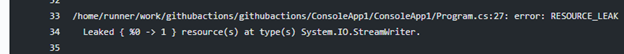
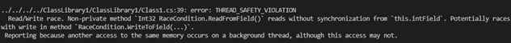

_“The refinement of techniques for the prompt discovery of error serves as well as any other as a hallmark of what we mean by science.”_
: -J. Robert Oppenheimer

We are excited to announce the public release of Infer#, which brings the interprocedural static analysis
capabilities of [Infer](https://fbinfer.com/) to the .NET community. Additionally, as part of our commitment to open-sourcing,
the project has been [released on GitHub](https://github.com/microsoft/infersharp) under an MIT license.

Static analysis is a technique commonly used in the developer workflow to validate the correctness of
source code without needing to execute it. Popular analyzers within the .NET ecosystem include FxCop
and the analysis API of Roslyn. Infer# complements these tools by detecting interprocedural memory
safety bugs such as null dereferences and resource leaks.

By integrating directly in the developer workflow to detect reliability and security bugs before they ship,
Infer# supports agile development for .NET. Indeed, we already are observing promising early results on
Microsoft software such as Roslyn, DotNET SDK, ASP.NET Core, and MSBuild.

We plan to continue expanding Infer#, with support for thread safety coming next.

## Interprocedural Memory Safety Validation For .NET

Infer# currently detects null dereferences and resource leaks, with race condition detection in
development. We illustrate each capability below with a buggy piece of code along with the
corresponding warning Infer# would report on it.

### Null Dereference
```csharp
    static void Main(string[]) args)
    {
        var returnNull = ReturnNull();
        _ = returnNull.Value;
    }

    private static NullObj ReturnNull()
    {
        return null;
    }

internal class NullObj
{
    internal string Value { get; set; }
}
```

The _returnNull_ variable is interprocedurally assigned null and is dereferenced via a read on the Value
field. This dereference is detected:


### Resource Leak
```csharp
public StreamWriter AllocatedStreamWriter()
{
    FileStream fs = File.Create("everwhat.txt");
    return new StreamWriter(fs);
}

public void ResourceLeakBad()
{
    StreamWriter stream = AllocateStreamWriter();
    // FIXME: should close the stream by calling stream.Close() if stream is not null.
}
```

The _stream_ StreamWriter variable is returned from AllocateStreamWriter but not
closed. Infer# reports the resulting resource leak, enabling the developer to fix the error:



To learn more about the technical implementation of Infer#, please see our [wiki](https://github.com/microsoft/infersharp/wiki/InferSharp:-A-Scalable-Code-Analytics-Tool-for-.NET).

## Trying Infer#

* To try Infer# in a docker container, simply pull it via the command below:
```shell
docker pull mcr.microsoft.com/infersharp:latest
```
Start a container in interactive mode, then run the following command in the container:
```shell
sh run_infersharp.sh Examples output
```
To view the bug report:
```shell
cat output/filtered_bugs.txt
```

* To try the C# plugin as a [Github Action](https://github.com/marketplace/actions/c-code-analyzer) directly in your build.

We welcome any feedback or feature requests at our [source code repository](https://github.com/microsoft/infersharp/issues).

## Coming next: Thread Safety Violations

Given the positive feedback we have already received on Infer#’s ability to catch null dereferences and
resource leaks, we’re working on additional defect detection scenarios. Thread safety violation is the
next scenario on the horizon, which we preview below:

```csharp
public class RaceCondition
{
    private readonly object __lockobj = new object();
    public int intField;
    public void WriteToField(int input)
    {
        lock (__lockObj)
        {
            intField = input;
        }
    }

    public int ReadFromField()
    {
        return intField;
    }
}
```

Although the feature is still in development, the warnings will appear analogously to how they do within
Java; lock() statement blocks will trigger the [RacerD](https://fbinfer.com/docs/all-issue-types/#thread_safety_violation) analysis just as synchronized() Java blocks do.

