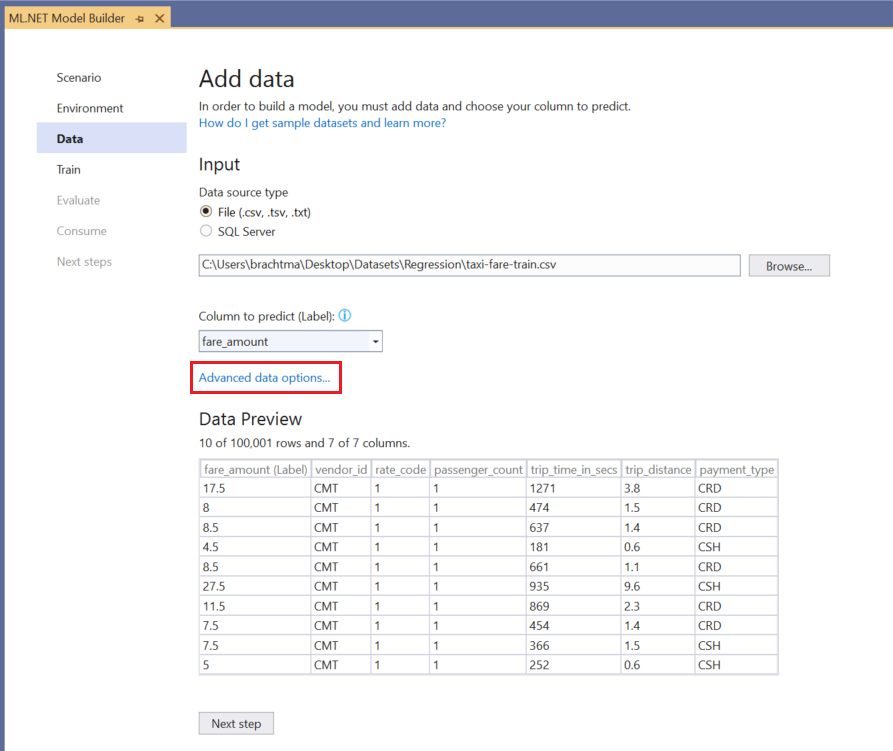
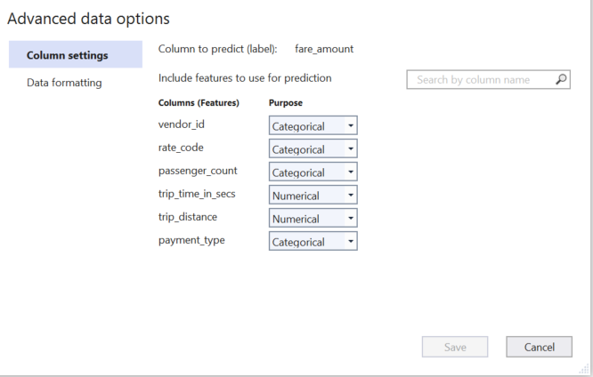
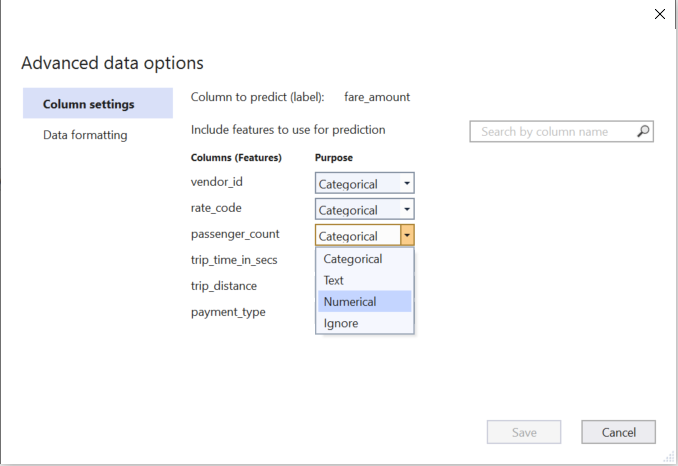
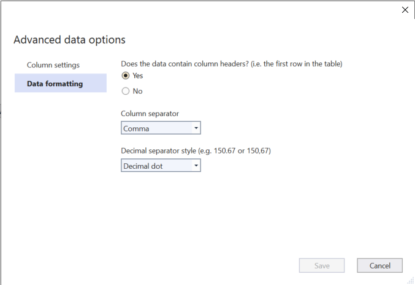

[ML.NET](https://dot.net/ml) is an open-source, cross-platform machine learning framework for .NET developers. It enables integrating machine learning into your .NET apps without requiring you to leave the .NET ecosystem or even have a background in ML or data science. ML.NET provides tooling (Model Builder UI in Visual Studio and the cross platform ML.NET CLI) that automatically trains custom machine learning models for you based on your scenario and data.

This release of ML.NET Model Builder brings numerous bug fixes and enhancements as well as new features, including advanced data loading options and streaming training data from SQL.

In this post, we’ll cover the following items:

1. [Advanced data loading options](#advanced-data-loading-options)
2. [Streaming from SQL with Database Loader](#streaming-from-sql-with-database-loader)
3. [Feedback](#feedback)
4. [Get started and resources](#get-started-and-resources)

## Advanced data loading options

Previously, Model Builder did not offer any data loading options, relying on AutoML to detect column purpose, header, and separator as well as decimal separator style.

Let’s take a look at the new advanced data loading options in Model Builder using the [taxi fare dataset](https://github.com/dotnet/machinelearning-samples/tree/master/samples/csharp/getting-started/Regression_TaxiFarePrediction). This is a regression problem where you predict the taxi fare amount based on several factors like distance traveled, payment type, and number of passengers.

In Model Builder, after selecting the **Value prediction** scenario and the local training environment, you’ll end up on the *Data* step. Choose **File** as the *Data source type*, browse for the taxi fare dataset, and once the dataset is selected, change the *Column to predict (Label)* to **fare_amount**.

Select **Advanced data options** to open the advanced data loading options dialog.

In this dialog, there are two sections- *Column settings* and *Data formatting*.

### Column settings

In the *Column settings* section, you can change the column purpose of each Feature column (columns which are used to predict the Label) to **Categorical**, **Text**, **Numerical**, or **Ignore**:

- **Categorical** columns contain data that is in a discrete number of labeled groups. For instance, Payment Type, which can be CSH (cash) or CRD (card) would be Categorical.
- **Text** columns contain strings in the form of free-form text. For example, if you had a model that predicted if reviews left by taxi passengers about their ride was positive or negative, the column which contains the free-form comments would have a column purpose of **Tex**.
- **Numerical** columns contain numbers only (floating point or integers). In the taxi fare example, trip distance and trip time are both **Numerical** columns.
- You can **Ignore** columns that you don’t want to use for training.

Normally, Model Builder does a suitable job of determining the column purpose, but there are cases where it might infer incorrectly or might choose a column purpose that gives slightly worse model performance. For instance, in the taxi fare example, Model Builder chooses **Categorical** for the passenger_count column, but this could also be a **Numerical** column.

You can try training with the default settings chosen by Model Builder and then try changing the Column purpose of passenger_count to Numerical to see how it affects the model’s performance.

### Data formatting

In the *Data formatting* section, you can override the following data loading options chosen by Model Builder:

- Whether the dataset has column headers or not
- The column separator (comma, semicolon, or tab)
- The decimal separator (decimal dot or comma)

As soon as you save the *Data formatting* options, you can see how it affects the dataset in th*Data Preview*.

## Streaming from SQL with Database Loader

Model Builder now takes advantage of the [Database Loader](https://docs.microsoft.com/dotnet/api/microsoft.ml.data.databaseloader?view=ml-dotnet)!

Previously, if your training data was stored in SQL, Model Builder would download the data locally and then train. Now, Model Builder will load and train data directly from SQL without needing to load all the data in-memory, so it can handle huge datasets up to terabytes in size.

## Feedback

We would love to hear your feedback!

If you run into any issues, please let us know by creating an issue in our GitHub repos (or use the new Feedback button in Model Builder!):

- [ML.NET API](https://github.com/dotnet/machinelearning)
- [ML.NET Tooling (Model Builder & ML.NET CLI)](https://github.com/dotnet/machinelearning-modelbuilder)

## Get started and resources

Get started with ML.NET in this [tutorial](https://dotnet.microsoft.com/learn/ml-dotnet/get-started-tutorial/intro).

Learn more about ML.NET and Model Builder in [Microsoft Docs](https://docs.microsoft.com/dotnet/machine-learning/).

Tune in to the [Machine Learning .NET Community Standup](https://dotnet.microsoft.com/platform/community/standup) every other Wednesday at 10am Pacific Time.
