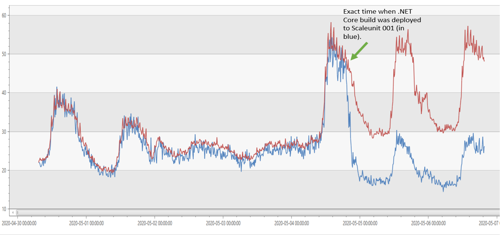

Azure Active Directory's gateway service is a reverse proxy that fronts hundreds of services that make up Azure Active Directory (Azure AD). If you've used services such as office.com, outlook.com, or xbox.live.com, then you've used Azure AD's gateway. The gateway provides features such as TLS termination, automatic failovers/retries, geo-proximity routing, throttling, and tarpitting to services in Azure AD. The gateway is present in more than 53 Azure datacenters worldwide and serves __~115 Billion__ requests each day. Up until recently, Azure AD's gateway was running on .NET Framework 4.6.2. As of September 2020, it's running on .NET Core 3.1.

## Motivation for Porting to .NET Core

The gateway's scale of execution results in significant consumption of compute resources, which in turn costs money. Finding ways to reduce the cost of executing the service has been a key goal for the team behind it. The buzz around .NET Core's focus on performance caught our attention, especially since [TechEmpower](https://www.techempower.com/benchmarks/#section=data-r19&hw=ph&test=plaintext) listed ASP.NET Core as one of the fastest web frameworks on the planet. We ran our own benchmarks on gateway prototypes on .NET Core and the results made the decision very easy: we __must__ port our service to .NET Core.

## Does .NET Core performance translate to real-life cost savings?

It *absolutely* does. In Azure AD gateway's case, we were able to cut our CPU costs by 50%. 

The gateway used to run on IIS with .NET Framework 4.6.2. Today, it runs on IIS with .NET Core 3.1. The image below shows that our CPU usage was reduced by half on .NET Core 3.1 compared to .NET Framework 4.6.2 (effectively doubling our throughput).



As a result of the gains in throughput, we were able to reduce our fleet size from ~40k cores to ~20k cores (50% reduction).


## How was the port to .NET Core achieved?

The porting consisted of 3 phases:

### Phase 1: Choosing an edge webserver.

When we started the porting effort, the first question we had to ask ourselves was which of the 3 webservers in .NET Core do we pick?   

We ran our production scenarios on all 3 webservers, and we realized it all came down to TLS support. Given the gateway is a reverse proxy, support for a wide range of TLS scenarios is critical.

**Kestrel:**

* When we started our migration (November 2019), [Kestrel](https://docs.microsoft.com/aspnet/core/fundamentals/servers/kestrel?view=aspnetcore-5.0) did not support client certificate negotiation nor revocation on a per-hostname basis. In .NET 5.0, support for these features was [added](https://github.com/dotnet/runtime/issues/31097).
* As for .NET 5.0, Kestrel (via its reliance on SslStream) does not support CTL stores on a per hostname basis. Support is [expected in .NET 6.0](https://github.com/dotnet/runtime/issues/45456).

**HTTP.sys:**

* [HTTP.sys server](https://docs.microsoft.com/aspnet/core/fundamentals/servers/httpsys?view=aspnetcore-5.0) had a disconnect between the TLS configuration at Http.Sys layer and the .NET implementation: Even when a binding is configured to not negotiate client certificates, accessing the Client certificate property in .NET Core triggers an unwanted TLS renegotiation.

For example, performing a simple null check in C# renegotiates the TLS handshake:

```csharp
if (HttpContext.Connection.ClientCertificate != null)
 ```
 
This has been addressed in: https://github.com/dotnet/aspnetcore/issues/14806 in ASP.NET Core 3.1. At the time, when we started the port in November 2019, we were on ASP.NET Core 2.2 and therefore did not pick this server.

**IIS:**

* [IIS](https://docs.microsoft.com/aspnet/core/host-and-deploy/iis/?view=aspnetcore-5.0) met all our requirements for TLS, so that's the webserver we chose.


### Phase 2: Migrating the application and dependencies.

As with many large services and applications, Azure AD's gateway has many dependencies. Some were written specifically for the service, and some written by others inside and outside of Microsoft. In some cases, those libraries were already targeting .NET Standard 2.0. For others, we updated them to support .NET Standard 2.0 or found alternative implementations, e.g. removing our legacy Dependency Injection library and instead using .NET Core's built-in support for dependency injection. The [.NET Portability Analyzer](https://docs.microsoft.com/dotnet/standard/analyzers/portability-analyzer) was of great help in this step.

For the application itself: 
* Azure AD's gateway used to have a dependency on `IHttpModule` and `IHttpHandler` from classic ASP.NET, which don't exist in ASP.NET Core. So, we re-wrote the application using the middleware constructs in ASP.NET Core.
* One of the things that really helped throughout the migration is Azure Profiler (a service that collects performance traces at runtime on Azure VMs). We deployed our nightly build to test beds, used wrk2 as a load agent to test the scenarios under stress and collect Azure Profiler traces. These traces would then inform us of the next tweak necessary to extract peak performance from our application.

### Phase 3: Rolling out gradually.

The philosophy we adopted during rollout was to discover as many issues as possible with little or no production impact.

* We deployed our initial builds to test, integration and DogFood environments. This led to __early__ discovery of bugs and helped in fixing them before hitting production.
	
* After code complete, we deployed the .NET Core build to a __single__ production machine in a scale unit. A scale unit is a load balanced pool of machines.
	* The scale unit had ~100 machines, where ~99 machines were still running our existing .NET Framework build and only 1 machine was running the new .NET Core build.
	*  All ~100 machines in this scale unit receive the exact type and amount of traffic. Then, we compared status codes, error rates, functional scenarios and performance of the single machine to the ~99 remaining machines to detect anomalies. 
	* We wanted this single machine to behave functionally the same as the remaining 99 machines, but have much better performance/throughput and that's what we observed.

* We also "forked" traffic from live production scale units (running .NET Framework build) to .NET Core scale units to compare and contrast as indicated above.
* Once we reached functional equivalence, we started expanding the number of Scale units running .NET Core and gradually expanded to an entire datacenter.
* Once an entire datacenter was migrated, the last step was to gradually expand worldwide to all the Azure datacenters where Azure AD's gateway service has a presence. __Migration done!__

## Learnings

* ASP.NET Core is strict about RFCs. This is a very good thing as it drives good practices across the board. However, classic ASP.NET and .NET Framework were quite a bit more lenient and that causes some backwards compatibility issues:

	* The Webserver by default allows only ASCII values in HTTP Headers. At our request, Latin1 support was added in IISHttpServer: https://github.com/dotnet/aspnetcore/pull/22798
	* `HttpClient` on .NET Core used to support only ASCII values in HTTP headers. 
		* .NET Core team has added Latin1 support in .NET Core 3.1: https://github.com/dotnet/corefx/pull/42978
		*  Ability to select encoding scheme added in .NET 5.0: https://github.com/dotnet/runtime/issues/38711
	* Forms and cookies that are not RFC compliant result in validation exceptions. So, we built "fallback" parsers using classic ASP.NET source code to maintain backward compatibility for customers.
	
* There was a performance bottleneck in `FileBufferingReadStream`'s `CopyToAsync()` method due to multiple 1 byte copies of a n byte stream. This has been addressed in .NET 5.0 by picking a default buffer size of 4K: https://github.com/dotnet/aspnetcore/issues/24032

* Be aware of classic ASP.NET quirks:

	* Trailing whitespace is auto-trimmed in the path: 
		* foo.com/oauth   &nbsp; ?client=abc is trimmed to foo.com/oauth?client=abc on classic ASP.NET. 
		* Over the years, customers/downstream services have taken a dependency on this path being trimmed and ASP.NET Core does not auto-trim the path. So, we had to trim trailing whitespace to mimic classic ASP.NET behavior.
	* `Content-Type` header is auto-generated if missing: 
		* When response is larger than zero bytes, but `Content-Type` header is missing, classic ASP.NET generates a default `Content-Type:text/html` header. ASP.NET Core does not force generate a default `Content-Type` header and clients who assume `Content-Type` header is always sent in the response start having issues. We mimicked the classic ASP.NET behavior by adding a default `Content-Type` when it is missing from downstream services.
		
## Future

Porting to .NET Core resulted in doubling the throughput for our service and it was a great decision to move.
Our .NET Core journey will not stop after the porting. For the future, we are looking at:

* Upgrading to .NET 5.0 for [better performance](https://devblogs.microsoft.com/dotnet/performance-improvements-in-net-5/).
* Porting to Kestrel so that we can intercept connections at the TLS layer for better resiliency.
* Leveraging components/best practices in YARP (https://microsoft.github.io/reverse-proxy/) in our own reverse proxy and also contribute back.  
