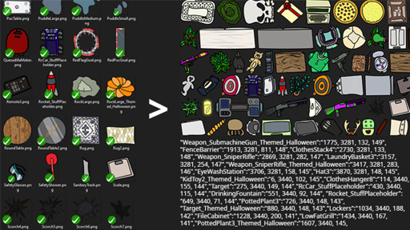

*This is a guest post by Sam Eddy, the programmer of Kelsam Games. Kelsam's games are written in C# using .NET and the MonoGame framework.*


Hello .NET community! I am Sam from [Kelsam Games](kelsam.net/)) and I have been using .NET to write software for over 10 years, since the XNA days. Nowadays, my wife Kelsie and I write our games using the [MonoGame framework](https://devblogs.microsoft.com/dotnet/tag/monogame/) (one of the spiritual successors of XNA). In this post I would like to share details of one of the tools we use in the development process of our newest game, and how .NET was instrumental in its creation.

When we started the newest version of our game [Cymatically Muffed](https://muffed.kelsam.net/), we knew we needed to create better development tools that could reduce, or even eliminate, the friction between the art development process and programming. We used to make art assets, then compile them into MonoGame-based assets using a content building tool included with MonoGame. Then, we would re-compile the game (sometimes, depending on changes needed), then pass it back to the designer to test and experiment with. This was the process for every little change, making it quite painful to iterate and improve art, levels, and other features.



Enter Art Factory! Art Factory is a simple tool that we built using .NET which removes pain points in the game art creation pipeline! Using Art Factory, Kelsie, our artist, can draw new assets, modify existing ones, and have them all appear in her working game environment without even needing to notify me - let alone wait on me. Using .NET, Art Factory takes all the assets she passes it and builds them into neatly organized sprite sheets, generates a simple DLL for the game engine, generates some dynamic JavaScript for the online level editor, and builds the generated sprite sheets for various platform targets. Art Factory then copies everything it generated into the artist’s environment and onto the server for the online level editor. Super slick! Now, with the aid of this simple tool, an artist can re-hash and iterate on levels, art, and other features quickly without the involvement of a programmer. .NET made making this tool super simple to pull off programmatically speaking, giving us all the functionality we needed to generate the sprite sheets, DLLs, and JavaScript text files. It also runs MonoGame content building commands and copies and uploads the built files. Using .NET, Art Factory was created in less than a day. (woop woop!)

Creating Dynamic Enums
----------------------
A super helpful part of Art Factory is that it creates a DLL with dynamically generated enums that I can use in-engine. Using .NET's System.Reflection, I can easily compile a simple DLL (see code snippet below) that the engine reads so I can enum-reference visual effects, stuff objects, and other data types in the code. This is super useful for keeping my code really readable and maintainable while allowing me to dynamically generate the data from the source files that the artist creates. Best of both worlds.

Generating a DLL in .NET is literally this simple (this is a snippet that generates a simple enum of our visual effects):

```csharp
int counter = 0;
AppDomain currDomain = AppDomain.CurrentDomain;
AssemblyName name = new AssemblyName("DynEnums");
string dllFile = name.Name + ".dll";
AssemblyBuilder assemblyBuilder = currDomain.DefineDynamicAssembly(name, AssemblyBuilderAccess.RunAndSave);
ModuleBuilder moduleBuilder = assemblyBuilder.DefineDynamicModule(name.Name, dllFile);

EnumBuilder vfxTypeEnum = moduleBuilder.DefineEnum("Muffed.VfxType", TypeAttributes.Public, typeof(int));
foreach (string vfxType in vfxTypes)
{
	vfxTypeEnum.DefineLiteral(vfxType, counter);
	counter++;
}
vfxTypeEnum.CreateType();

assemblyBuilder.Save(dllFile);
```
Creating Sprite Sheets
----------------------

Using System.Drawing, we can load up all our images and tile them into sprite sheets (or atlases) with just a few lines of C#. This way the script can take all the files from the artist and sort them into a performance-friendly atlas for the engine to parse. It can also generate some simple JSON for both the editor and the engine to parse for simple information like the locations and sizes of each object in the atlases. Using a few APIs in .NET, we can load up all the images, sort them by size, and place them all into a series of atlases (sprite sheets):

Here's how we can load all the images and sort them by size:
```csharp
ace(fileInfo.Extension, "");
	stuffImgs[stuffSlug] = Image.FromFile(file);
}
stuffImgs = stuffImgs.OrderByDescending(si => si.Value.Height).ThenByDescending(si => si.Value.Width).ToDictionary(si => si.Key, si => si.Value);
```
We can then loop through the images and place them in a series of atlases:
```csharp
graphics.DrawImage(
	image: image,
	destRect: destRect,
	srcX: srcRect.X,
	srcY: srcRect.Y,
	srcWidth: srcRect.Width,
	srcHeight: srcRect.Height,
	srcUnit: GraphicsUnit.Pixel,
	imageAttrs: imageAttrs
);
```
Once our atlas is ready, we trim it to the actual used size and export it:
```csharp
Rectangle furthestX = stuffRects.Values.OrderByDescending(r => r.X + r.Width).ToArray()[0];
Rectangle furthestY = stuffRects.Values.OrderByDescending(r => r.Y + r.Height).ToArray()[0];
bitmap = new Bitmap(furthestX.X + furthestX.Width + SPRITE_PADDING, furthestY.Y + furthestY.Height + SPRITE_PADDING);
graphics = Graphics.FromImage(bitmap);
DrawImage(atlases.Last(), destRect: new Rectangle(0, 0, bitmap.Width, bitmap.Height), srcRect: new Rectangle(0, 0, bitmap.Width, bitmap.Height));
graphics.Save();
```

Building MonoGame Assets From Sprite Sheets
-------------------------------------------
We can also use System.IO and System.Diagnostics to generate and process a MGCB (MonoGame Content Builder) file for our assets:
```csharp
static void BuildAssets()
{
	// create MGCB
	File.WriteAllText("assets.mgcb", GenFullMgcb());

	// clean/rebuild mgcb
	Console.WriteLine("\n\nBuilding generated assets...\n");
	ProcessStartInfo startInfo = new ProcessStartInfo
	{
		FileName = @"mgcb.exe",
		Arguments = @"/@:assets.mgcb /clean /rebuild",
		UseShellExecute = false,
	};
	Process process = Process.Start(startInfo);
	process.WaitForExit();
}
```
Using the Generated Files
--------------------------
Using System.Net, we can FTP into our VPS and upload the web assets:

```csharp
using (WebClient client = new WebClient())
{
	string baseFtpPath = @"ftp://domain.suf/path/to/upload/";
	client.Credentials = new NetworkCredential("USER", "PASS");

	Console.WriteLine("Uploading: dyn.css");
	client.UploadFile(baseFtpPath + "dyn.css", WebRequestMethods.Ftp.UploadFile, cssPath);
	Console.WriteLine("Uploading: dyn.js");
	client.UploadFile(baseFtpPath + "dyn.js", WebRequestMethods.Ftp.UploadFile, jsPath);
	
	foreach (string file in Directory.GetFiles(RESULTS_FOLDER + "web/stuffs/", "*.png"))
	{
		Console.WriteLine("Uploading: " + file);
		client.UploadFile(baseFtpPath + "images/stuffs/" + new FileInfo(file).Name, WebRequestMethods.Ftp.UploadFile, file);
	}
}
```
Using System.IO, we can also copy our assets over to the artist's working environment:

```csharp
File.Copy(RESULTS_FOLDER + "DynEnums.dll", "../../KelsEnv/DynEnums.dll", overwrite: true);
```

Check Out Cymatically Muffed
----------------------------
[Cymatically Muffed](https://muffed.kelsam.net/) is proudly created using MonoGame and .NET. It is available now for Windows PC via [Steam](https://store.steampowered.com/app/661200/Cymatically_Muffed/), and is coming soon to Xbox One, MacOS, and Linux! MacOS and Linux coming soon thanks to MonoGame 3.8 supporting .NET Core 3.1, which allows us to compile our engine for other platforms with a single command!


Game on!
