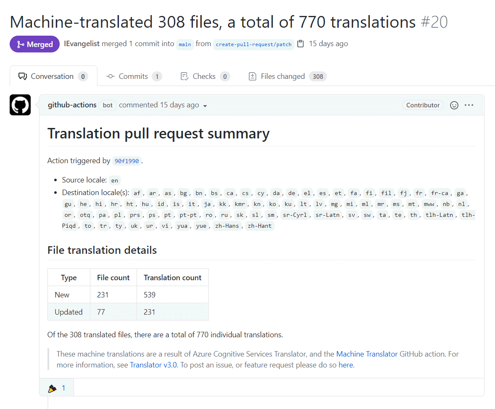

In this post, I'm going to introduce you to a GitHub Action that creates machine-translations for .NET localization. GitHub Actions allow you to build, test, and deploy your code right from GitHub, but they also allow for other workflows. You can perform nearly any action imaginable against your source code as it evolves. With the Machine Translator GitHub Action, you configure a workflow to automatically create pull requests as translation source file change.

You can use [localization with Blazor WebAssembly (Wasm)](https://docs.microsoft.com/aspnet/core/blazor/globalization-localization?view=aspnetcore-3.1#blazor-webassembly&WT.mc_id=dapine) to change the displayed language of a rendered website. Localization support in .NET is nothing new. It's possible with translation files, for example, _*.{locale}.resx_, _*.{locale}.xliff_, or _*.{locale}.restext_ to name a few. The `CultureInfo` class is used along with these translation files and various other .NET employed mechanics. However, maintaining translation files can be tedious and time-consuming. With GitHub Actions and [Azure Cognitive Services Translator](https://docs.microsoft.com/azure/cognitive-services/translator?WT.mc_id=dapine), you can set up a workflow to automatically create pull requests that provide machine-translated files.

## Azure Cognitive Services Translator

Cognitive Services Translator is a cloud-based machine translation service from Azure. It powers the GitHub Action, providing the root translation functionality. To use the action, you will need a [Cognitive Services Translator](https://docs.microsoft.com/azure/cognitive-services/translator?WT.mc_id=dapine) resource. You can use an existing one, or [create a new one](https://ms.portal.azure.com/#create/Microsoft.CognitiveServicesTextTranslation). If you do not have an Azure account, you can [create one for free](https://azure.microsoft.com/free/dotnet). This resource is used to perform the translations from the GitHub Action through the [Translator API v3](https://docs.microsoft.com/azure/cognitive-services/translator/reference/v3-0-reference?WT.mc_id=dapine). In other words, as you _push_ code changes to your GitHub repository that include _*.en.resx_ files, this action runs when correctly specified in the workflow.

For more information on filtering when actions run due to changes in specific files, see [Workflow syntax for GitHub Actions](https://docs.github.com/en/free-pro-team@latest/actions/reference/workflow-syntax-for-github-actions#onpushpull_requestpaths).

## Machine Translator GitHub Action

The Machine Translator GitHub Action is available on the [GitHub action marketplace](https://github.com/marketplace/actions/machine-translator). This GitHub Action does the work of marrying the functionality of the Cognitive Services Translator with your source files. To use this action, you'll need to [create a GitHub workflow](#create-workflow). There are a few required inputs (and some optional), most of which are from your [Azure Translator resource](#azure-cognitive-services-translator):

| Type | Input name | Example / Description |
|-:|:-|--|
| Required | `sourceLocale` | `'en'`<br>The source locale to translate from. |
| Required | `subscriptionKey` | `'c571d5d8xxxxxxxxxxxxxxxxxx56bac3'`<br>Cognitive Services Translator subscription key, ideally stored as [secret](https://docs.github.com/en/free-pro-team@latest/actions/reference/encrypted-secrets). |
| Required | `endpoint` | `'https://api.cognitive.microsofttranslator.com/'`<br>Cognitive Services Translator endpoint, ideally stored as [secret](https://docs.github.com/en/free-pro-team@latest/actions/reference/encrypted-secrets). |
| Optional | `region` | `'canadacentral'`<br>Cognitive Services Translator region, ideally stored as secret. Optional when using a global translator resource. |
| Optional | `toLocales` | `'"es,de,fr"'` or `'["es","de","fr"]'`<br>Limit the scope of the translation targets. If _not_ provided, uses all possible translation targets. |

Additionally, the action requires a `GITHUB_TOKEN` as an environment variable. GitHub automatically creates a `GITHUB_TOKEN` secret to use in your workflow as an encrypted secret. To define this environment variable, use the following YAML within your workflow (more on this later):

```yml
env:
  GITHUB_TOKEN: ${{ secrets.GITHUB_TOKEN }}
```

For more information, see [GitHub Actions: Authentication in a workflow
](https://docs.github.com/en/free-pro-team@latest/actions/reference/authentication-in-a-workflow#about-the-github_token-secret).

### Machine Translator design

The Machine Translator action is entirely open source. It is written in [TypeScript](https://github.com/actions/typescript-action), and designed to accomplish several key objectives:

- Determine which languages are available for translation from the translator API
- Read all translation files (_*.resx_ for example) as source inputs for translation
- Translate all inputs into the available languages, or configured targets
- Create (or update existing) translation files

To see how the action is actually implemented, feel free to view the source on the [GitHub repository](https://github.com/IEvangelist/resource-translator).

The scope of this action is limited to reading input translation files, translating new ones from these sources, and then writing the translation files back to the workspace. Part of the intended workflow composition is to pair this action with two others. The first is the [`actions/checkout@v2`](https://github.com/actions/checkout) action, which checks out your repository under the workspace so that the action can access it. The second is the [`peter-evans/create-pull-request@v3.4.1`](https://github.com/marketplace/actions/create-pull-request) action, which will create a pull request if files are changed. Special shout-out to [Peter Evans 🎉](https://github.com/peter-evans) for his work here!

### Open and active development

This action is actively being developed. It now has full support for the RESX, RESTEXT, and INI file formats, and basic support of XLIFF and PO file formats. XLIFF is another common industry-standard for resource management, while RESTEXT is a simpler INI-based key-value-pair alternative. The Machine Translator automatically handles batching of rate-limited API calls to Cognitive Services Translator. Many thanks to [Tim Heuer 🤘🏼](https://github.com/IEvangelist/resource-translator/issues?q=is%3Aissue+author%3Atimheuer+) for his collaboration and feedback! To propose ideas, feature requests, or post issues - please do so on the [GitHub repository](https://github.com/IEvangelist/resource-translator/issues).

## "Blazing Translations" demo app

This GitHub Action is based on the notion of resource files and localization in .NET. Any .NET application that follows this localization paradigm is free to use this action. In this way, the action is _not_ limited to just ASP.NET Core Blazor Wasm apps - that is just the demo app of choice for this post. The GitHub repository for the demo app is available at [IEvangelist/IEvangelist.BlazingTranslations](https://github.com/IEvangelist/IEvangelist.BlazingTranslations). The repository has several **Secrets**, which store encrypted values that can be accessed from a workflow. For more information, see [GitHub Action reference: Encrypted Secrets](https://docs.github.com/en/free-pro-team@latest/actions/reference/encrypted-secrets).

The demo app was inspired by [Pranav Krishnamoorthy's LocSample](https://github.com/pranavkm/LocSample) but adds a bit more exemplary source code. Some of the key components are:

- In the _Client_ project, call the `IServiceCollection.AddLocalization()` extension method to register localization services
- Using dependency injection, inject `IStringLocalizer<T>` where string literals are used
- Add resource files that shadow Razor components and pages. For example, _Index.razor_ should be accompanied by an _Index.en.resx_ file
- Replace string literals with resource key-value pairs

### Example Razor component

```html
@page "/"

<h1>@HelloWorld</h1>

@Greeting

<SurveyPrompt Title="@SurveyTitle" />
```

In the preceding Razor markup, there are a few `@` directives that call into the code-behind, which simply access their property values. Consider the following _Index.razor.cs_ file, which shadows the Razor component.

```csharp
using Microsoft.AspNetCore.Components;
using Microsoft.Extensions.Localization;

namespace IEvangelist.BlazingTranslations.Client.Pages
{
    public partial class Index
    {
        [Inject]
        public IStringLocalizer<Index> Localizer { get; set; }

        public string SurveyTitle => Localizer[nameof(SurveyTitle)];
        public string Greeting => Localizer[nameof(Greeting)];
        public string HelloWorld => Localizer[nameof(HelloWorld)];
    }
}
```

The `partial class` is shared with the `Index` Razor component's generated class. As such, this is thought of as the "code-behind". It uses the `[Inject]` attribute to inject the `IStringLocalizer<Index>`. There are three readonly properties which are expressed as localizer indexer accessors. In this example, the corresponding _Index.en.resx_ resource file is similar to the following:

```xml
<?xml version="1.0" encoding="UTF-8" standalone="yes"?>
<root>
  <data name="Greeting" xml:space="preserve">
    <value>Welcome to your new app.</value>
  </data>
  <data name="HelloWorld" xml:space="preserve">
    <value>Hello, world!</value>
  </data>
  <data name="SurveyTitle" xml:space="preserve">
    <value>How is Blazor working for you?</value>
  </data>
</root>
```

Now that you have your resource file, and Razor components defined, you need to create the workflow.

### Create workflow

Workflows are defined within the _.github/workflows_ directory from the root of the repository and are written as YAML files. Consider the following:

```yml
name: Create translation pull request
on:
  push:
    branches: [ main ]
    paths:
    - '**.en.resx' # only take action when *.en.resx files change

env:
  GITHUB_TOKEN: ${{ secrets.GITHUB_TOKEN }} # Available by default, contextual to the action

jobs:
  build:
    runs-on: ubuntu-latest
    steps:
      # Checks-out repository under the workspace, so that the action can access it
      - uses: actions/checkout@v2

      # Use the machine-translator to automatically translate resource files
      - name: Machine Translator
        id: translator
        uses: IEvangelist/resource-translator@v2.1.1
        with:
          subscriptionKey: ${{ secrets.AZURE_TRANSLATOR_SUBSCRIPTION_KEY }}
          endpoint: ${{ secrets.AZURE_TRANSLATOR_ENDPOINT }}
          region: ${{ secrets.AZURE_TRANSLATOR_REGION }}
          sourceLocale: 'en'

      # Creates a pull request of all translated resource files
      - name: Create pull request
        uses: peter-evans/create-pull-request@v3.4.1
        if: ${{ steps.resource-translator.outputs.has-new-translations }} == 'true'
        with:
          title: '${{ steps.resource-translator.outputs.summary-title }}'
          body: '${{ steps.resource-translator.outputs.summary-details }}'
```

The preceding workflow definition will run when any _*.en.resx_ file is either created or changed.

## Putting it all together

With all the moving pieces in place, you the developer, are empowered to develop as you normally would. As you create and update Razor components and corresponding resource files, pull requests are automatically created for your review with translated resource files. Since pull requests are created, they can be updated by translation specialists if need be - but this will serve as a great starting point nonetheless.

### Example pull request

Here is a link to an example automated [pull request](https://github.com/IEvangelist/IEvangelist.BlazingTranslations/pull/20). The automated pull request was [triggered by a commit](https://github.com/IEvangelist/IEvangelist.BlazingTranslations/commit/90f1990373f47a65ddc07ba43f0ce434e180ae11) that simply updated several _*.en.resx_ files. The pull request details a summary of translations.



## Summary

The Azure Cognitive Services Translator API serves as the backbone to the Machine Translator GitHub Action. With great power, comes great responsibility. As a developer, you must wear your ethics-hat at all times, especially when working with artificial intelligence (AI). It might seem as though this GitHub Action can easily elevate your .NET apps to be inclusive of nearly 80 languages, it is irresponsible to make such claims. These are machine translations and should be treated as such. Without direct intervention from a human review, the machine translations may not be conversationally accurate or culturally specific to what you are trying to convey in the text being translated.

While I'm hopeful that you will use this action, I encourage you to also consider limiting the scope of translations to known locales with the `toLocales` input. Work closely with the stakeholders during the app development, and incrementally solicit feedback on translations from those who are consuming that app.

### See also

- [Machine Translator GitHub repo](https://github.com/IEvangelist/resource-translator)
- [Machine Translator GitHub marketplace](https://github.com/marketplace/actions/machine-translator)
- [Blazing translations demo GitHub repo](https://github.com/IEvangelist/IEvangelist.BlazingTranslations)
- [.NET 5 WinForms localization app repo](https://github.com/timheuer/simple-loc-winforms)
- [Example successful automation run](https://github.com/IEvangelist/IEvangelist.BlazingTranslations/runs/1412742058)
