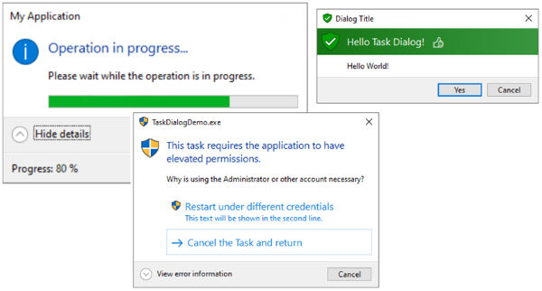
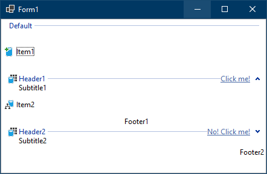
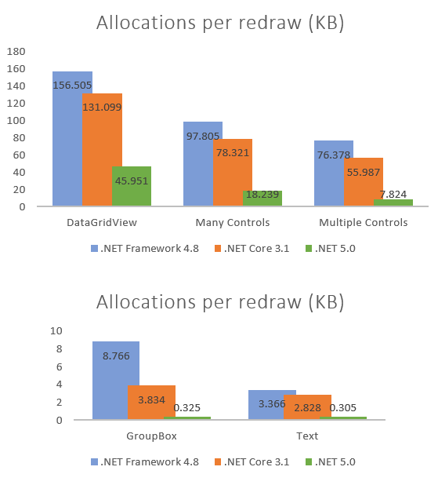
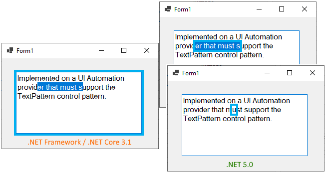

Since Windows Forms was open sourced in late 2018, and ported to .NET Core, both the team and our external contributors have been busy fixing old bugs and adding new features. In this post we are going to talk about what's new in Windows Forms runtime in .NET 5.0.

## Windows controls additions and enhancements

Perhaps the most exciting thing about Windows Forms today is the vibrant and engaged community we have on GitHub. Many of the new features and enhancements have been either suggested by, or even fully implemented by our community members. In the .NET 5.0 timeframe we have accepted and merged over 900 pull-request with over 70% of those PRs coming from our community. Massive shoutouts to [@hughbe](https://github.com/hughbe), [@gpetrou](https://github.com/gpetrou), [@weltkante](https://github.com/weltkante), [@kpreisser](https://github.com/kpreisser) and many, many others who helped us improve Windows Forms runtime.

Here are a few examples of the contributions we have received from the community.

### New TaskDialog control

Contributed by [@kpreisser](https://github.com/kpreisser) | [Documentation](https://docs.microsoft.com/dotnet/api/system.windows.forms.taskdialog) | [Task dialog sample](https://github.com/dotnet/samples/tree/master/windowsforms/TaskDialogDemo)

A task dialog is a dialog box that can be used to display information and receive simple input from the user, but  has more features than a message box. Like a message box, it's formatted by the operating system according to parameters you set. 

### ListView enhancements

Contributed by [@hughbe](https://github.com/hughbe) and [@lonitra](https://github.com/lonitra) | [Documentation](https://docs.microsoft.com/dotnet/api/system.windows.forms.listviewgroup)

The `ListView` control is quite familiar to the Windows Forms developers, yet it was lacking API for an easy access to several features that were added in Windows Vista, such as collapsible groups, groups tasks, subtitles, and footers.

In .NET 5.0 we bridged the API gap, and now the Windows Forms `ListView` is much closer to parity with the native Win32 control.

The new API include:
* [ListView group collapse/expand](https://docs.microsoft.com/dotnet/api/system.windows.forms.listviewgroup.collapsedstate)
* [ListView group footers](https://docs.microsoft.com/dotnet/api/system.windows.forms.listviewgroup.footer)
* [ListView group subtitles](https://docs.microsoft.com/dotnet/api/system.windows.forms.listviewgroup.subtitle)
* [ListView group tasks](https://docs.microsoft.com/dotnet/api/system.windows.forms.listviewgroup.tasklink)
* [ListView group title image](https://docs.microsoft.com/dotnet/api/system.windows.forms.listviewgroup.titleimageindex)

### FileDialog enhancement

Contributed by [@jnm2](https://github.com/jnm2) | [Documentation](https://docs.microsoft.com/dotnet/api/system.windows.forms.filedialog.clientguid#System_Windows_Forms_FileDialog_ClientGuid)

`FileDialog` has received a new API: `FileDialog.ClientGuid`. The Windows file dialog enables a calling application to associate a GUID with a dialog's persisted state. A dialog's state can include factors such as the last visited folder and the position and size of the dialog. Typically, this state is persisted based on the name of the executable file. By specifying a GUID, an application can have different persisted states for different versions of the dialog within the same application (for example, an import dialog and an open dialog).

## Performance improvements

Windows Forms has always been known as a managed wrapper around the Win32 API set. As such, Windows Forms has always depended heavily on an interop layer to communicate with the unmanaged Windows components. The top priority from the early days of .NET Core has been the optimising of our interop layer, making structs blittable, explicitly opting for more efficient ["W"-functions](https://docs.microsoft.com/windows/win32/intl/conventions-for-function-prototypes), and using "unsafe" code where possible. All these changes are what we call "peanut butter changes", in a sense that each of these are tiny and hardly observable, but over a lifetime of an application these changes add up to a substantial performance gains.
 
In .NET 5.0 we've lifted the bar higher and optimised several painting paths. Historically Windows Forms relied on GDI+ (and some GDI) for rendering operations. Whilst GDI+ is easier to use than GDI because it abstracts the device context (a structure with information about a particular display device, such as a monitor or a printer) via the `Graphics` object, it's also slow due to the additional overhead. In a number of situations where we deal with solid colours and brushes, we have opted to use GDI.
 
We have also extended a number rendering-related APIs (e.g. [`PaintEventArgs`](https://docs.microsoft.com/dotnet/api/system.windows.forms.painteventargs)) with `IDeviceContext` interface, which whilst may not be available to Windows Forms developers directly, allow us to bypass the GDI+ `Graphics` object, and thus reduce allocations and gain speed. 
These optimisations have shown a significant reduction in memory consumptions in redraw paths, in some cases saving x10 in memory allocations).

For a more technical dive you can watch the [API Review segment](https://youtu.be/7YpDyRMaDKE?t=880), or watch the [.NET Community Standup segment](https://youtu.be/m-NdyJVBf2Y?list=PLdo4fOcmZ0oX-DBuRG4u58ZTAJgBAeQ-t&t=189) where [Jeremy Kuhne](https://github.com/JeremyKuhne) talks about these optimisations.

You can grab the test project here: https://github.com/JeremyKuhne/RedrawPerformance, and verify the results yourself, just like one of our users - Jeremy Sinclair:

Last but not least, we have extended [`TextRenderer`](https://docs.microsoft.com/dotnet/api/system.windows.forms.textrenderer) API to accept `ReadOnlySpan<char>` overloads, because drawing and measuring text is a pretty common activity. This will allow significantly more efficient text rendering when new string allocations can be avoided (slicing other input, building off a stack-based character array, etc.). 

## Accessibility improvements and fixes

For the past several years the team has been updating the 20-year-old Windows Forms SDK to meet today's accessibility requirements and compliance. 

In .NET 5.0 we have delivered many improvements, including but not limited to the following:
 
* [UI Automation](https://docs.microsoft.com/dotnet/framework/ui-automation/ui-automation-overview) support for a number of controls including:
    * `Button`,
    * `ListView`,
    * `CheckBox`,
    * `RadioButton`, etc.
* [LegacyIAccessible Control Pattern](https://docs.microsoft.com/windows/win32/winauto/uiauto-implementinglegacyiaccessible) support enabling clients to better interact with UI controls, and allowing developers to set custom `AccessibleRole` properties for their controls.
* [Text and TextRange Control Patterns](https://docs.microsoft.com/windows/win32/winauto/uiauto-implementingtextandtextrange) support enabling clients to retrieve textual content, text attributes, and embedded objects from text-based controls.

We have also fixed several issues which impacted the UX under certain accessibility tools. For example, we have reworked the accessibility implementations in the way that accessing an `AccessibleObject` will no longer cause a premature control’s `Handle` creation, which in turn ensures more predictable control behaviors and avoids unexpected surprises in the UI.

We also improved and corrected behaviours in several controls (such as `PropertyGrid` and `MonthCalendar`) that could prevent accessibility tools from correctly navigate the UI or, in severe cases, crash applications.

## Visual Basic support

Visual Basic, along with its Application Framework, is supported in .NET 5 and Visual Studio 16.8! Visual Studio 16.8 includes the Windows Forms Designer, so Visual Basic is ready for you to migrate existing applications or create new applications.

For more information refer to [Visual Basic WinForms Apps in .NET 5 and Visual Studio 16.8 post](https://devblogs.microsoft.com/dotnet/visual-basic-winforms-apps-in-net-5-and-visual-studio-16-8/).
 
Kudos to [@paul1956](https://github.com/paul1956) for helping us with Visual Basic related issues.

## Breaking Changes

Whilst we intend to maintain backward compatibility with .NET Framework and .NET Core as much as possible, it is not always prudent. You can find the list of breaking changes here:

* [.NET Framework to .NET Core 3.1](https://docs.microsoft.com/dotnet/core/compatibility/winforms)
* [.NET Core 3.1 to .NET 5.0](https://docs.microsoft.com/dotnet/core/compatibility/windows-forms/5.0/automatically-infer-winexe-output-type)

For the list of known issues please refer to [.NET 5.0 Known Issues document](https://github.com/dotnet/core/blob/master/release-notes/5.0/5.0-known-issues.md#windows-forms).

## Looking ahead

We are aware that the current high DPI support is far from perfect, and this is something we are planning to improve in the .NET 6.0 timeframe. There are many aspects to what "high DPI support" means, so we would love to learn more about what it means to you. If you have a specific concern that you'd like us to address, please leave a comment below or file an issue directly in [dotnet/winforms](https://github.com/dotnet/winforms/issues/new).

We plan to continue with "peanut butter" optimisations, accessibility improvements, nullable reference types annotations, and general code improvements. 

## Reporting bugs and suggesting features

If you have any comments, suggestions or faced some issues, please let us know! Submit Visual Studio and Designer related issues via **Visual Studio Feedback** (look for a button in the top right corner in Visual Studio), and Windows Forms runtime related issues at our [GitHub repository](https://github.com/dotnet/winforms).

We also consider API proposals that further enrich Windows Forms SDK and make it easier to build Windows applications (like the task dialog). And if you champion a proposal - there is a high chance that you will see it in the Windows Forms SDK.

You can also become a contributor to the Windows Forms code base! Our repository has items marked  ["up for grabs"](https://github.com/dotnet/winforms/labels/up-for-grabs) and [approved ready-for-development API](https://github.com/dotnet/winforms/labels/api-approved), we would really appreciate your help implementing them!

 Happy coding!
