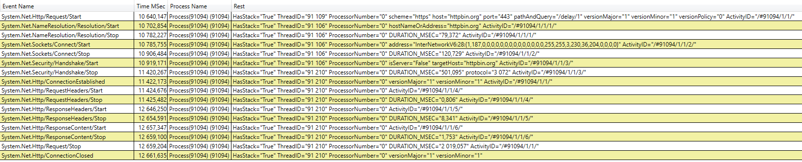

With [.NET 5 released in November](https://devblogs.microsoft.com/dotnet/announcing-net-5-0/), it's a good time to talk about some of the many improvements in the **networking stack**. This includes improvements around [HTTP](https://github.com/dotnet/runtime/pulls?q=is%3Apr+state%3Amerged+label%3Aarea-System.Net.Http+milestone%3A5.0.0), [Sockets](https://github.com/dotnet/runtime/pulls?q=is%3Apr+state%3Amerged+label%3Aarea-System.Net.Sockets+milestone%3A5.0.0), [networking-related security](https://github.com/dotnet/runtime/pulls?q=is%3Apr+state%3Amerged+label%3Aarea-System.Net.Security+milestone%3A5.0.0+), and other [networking primitives](https://github.com/dotnet/runtime/pulls?q=is%3Apr+state%3Amerged+label%3Aarea-System.Net+milestone%3A5.0.0+). In this post, I will highlight some of the more impactful and interesting changes in the release.

## HTTP
### Better Error Handling
In the year since .NET 3.1 was released, many improvements and fixes have been made in the HTTP space. One of the most requested was to add the ability to distinguish timeouts from cancellations when using `HttpClient` ([#21965](https://github.com/dotnet/runtime/issues/21965)). Originally, a custom `CancellationToken` had to be used to distinguish a timeout from a cancellation:

```C#
class Program
{
    private static readonly HttpClient _client = new HttpClient()
    {
        Timeout = TimeSpan.FromSeconds(10)
    };
    
    static async Task Main()
    {
        var cts = new CancellationTokenSource();
        try
        {
            // Pass in the token.
            using var response = await _client.GetAsync("http://localhost:5001/sleepFor?seconds=100", cts.Token);
        }
        // If the token has been canceled, it is not a timeout.
        catch (TaskCanceledException ex) when (cts.IsCancellationRequested)
        {
            // Handle cancellation.
            Console.WriteLine("Canceled: " + ex.Message);	
        }
        catch (TaskCanceledException ex)
        {
            // Handle timeout.
            Console.WriteLine("Timed out: "+ ex.Message);
        }
    }
}
```

With this change, the client still throws `TaskCanceledException` (for backward compatibility), but the inner exception is a `TimeoutException` in case of a timeout:

```C#
class Program
{
    private static readonly HttpClient _client = new HttpClient()
    {
        Timeout = TimeSpan.FromSeconds(10)
    };
    
    static async Task Main()
    {
        try
        {
            using var response = await _client.GetAsync("http://localhost:5001/sleepFor?seconds=100");
        }
        // Filter by InnerException.
        catch (TaskCanceledException ex) when (ex.InnerException is TimeoutException)
        {
            // Handle timeout.
            Console.WriteLine("Timed out: "+ ex.Message);
        }
        catch (TaskCanceledException ex)
        {
            // Handle cancellation.
            Console.WriteLine("Canceled: " + ex.Message);	
        }
    }
}
```

Another improvement was to add `HttpStatusCode` to `HttpRequestException` ([#911](https://github.com/dotnet/runtime/issues/911)). The new [`StatusCode`](https://docs.microsoft.com/dotnet/api/system.net.http.httprequestexception.statuscode?view=net-5.0) property is nullable set when [`EnsureSuccessStatusCode`](https://docs.microsoft.com/dotnet/api/system.net.http.httpresponsemessage.ensuresuccessstatuscode?view=net-5.0) is called on the response. Then it can be used in exception filters:

```C#
class Program
{
    private static readonly HttpClient _client = new HttpClient();
    
    static async Task Main()
    {
        try
        {
            using var response = await _client.GetAsync("https://localhost:5001/doesNotExists");
            // The following line will throw HttpRequestException with StatusCode set if it wasn't 2xx.
            response.EnsureSuccessStatusCode();
        }
        catch (HttpRequestException ex) when (ex.StatusCode == HttpStatusCode.NotFound)
        {
            // Handle 404
            Console.WriteLine("Not found: " + ex.Message);
        }
    }
}
```

Since `HttpClient` helper methods: `GetStringAsync`, `GetByteArrayAsync` and `GetStreamAsync` do not return `HttpResponseMessage`, they call `EnsureSuccessStatusCode` themselves. The exception filtering for those calls then looks like this:

```C#
class Program
{
    private static readonly HttpClient _client = new HttpClient();
    
    static async Task Main()
    {
        try
        {
            // The helper method will throw HttpRequestException with StatusCode set if it wasn't 2xx.
            using var stream = await _client.GetStreamAsync("https://localhost:5001/doesNotExists");
        }
        catch (HttpRequestException ex) when (ex.StatusCode == HttpStatusCode.NotFound)
        {
            // Handle 404
            Console.WriteLine("Not found: " + ex.Message);
        }
    }
}
```

And thanks to the new constructor being public, `HttpRequestException` with a status code can be created manually:
```C#
class Program
{
    private static readonly HttpClient _client = new HttpClient();
    
    static async Task Main()
    {
        try
        {
            using var response = await _client.GetAsync("https://localhost:5001/doesNotExists");
            // Throw for anything higher than 400.
            if (response.StatusCode >= HttpStatusCode.BadRequest)
            {
                throw new HttpRequestException("Something went wrong", inner: null, response.StatusCode);
            }
        }
        catch (HttpRequestException ex) when (ex.StatusCode == HttpStatusCode.NotFound)
        {
            // Handle 404
            Console.WriteLine("Not found: " + ex.Message);
        }
    }
}
```

We would also like to point out that the credit for this change goes to the community. It was implemented by [@yaakov-h](https://github.com/yaakov-h) in [#32455](https://github.com/dotnet/runtime/pull/32455).

### Consistent Cross-Platform Implementation
Originally, the HTTP stack in .NET Core relied on platform dependent handlers:

- `WinHttpHandler` based on WinHTTP for Windows.
- `CurlHandler` based on libcurl for Linux and Mac. 

It was almost impossible to achieve consistency across platforms due to the differences between the two libraries. So in .NET Core 2.1 we introduced a managed HTTP implementation called [`SocketsHttpHandler`](https://docs.microsoft.com/dotnet/api/system.net.http.socketshttphandler?view=net-5.0). We shifted most of our efforts to `SocketsHttpHandler` and, as we became confident in its reliability and feature set, we decided to remove the platform specific handlers from `System.Net.Http.dll` completely. In .NET 5, it is no longer possible to switch back to them with the [`"System.Net.Http.UseSocketsHttpHandler"`](https://docs.microsoft.com/dotnet/api/system.net.http.socketshttphandler?view=net-5.0#remarks) `AppContext` switch as it used to be. However, [`WinHttpHandler`](https://docs.microsoft.com/dotnet/api/system.net.http.winhttphandler?view=dotnet-plat-ext-5.0) is still available as a standalone [NuGet package](https://www.nuget.org/packages/System.Net.Http.WinHttpHandler/). Any code that made use of it via the switch needs to be changed to reference `System.Net.Http.WinHttpHandler` NuGet package:

```bash
 dotnet add package System.Net.Http.WinHttpHandler
```

and explicitly pass a `WinHttpHandler` instance to the `HttpClient` constructor:

```C#
class Program
{
    private static readonly HttpClient _client = new HttpClient(new WinHttpHandler());
    
    static async Task Main()
    {
        using var response = await _client.GetAsync("http://localhost:5001/");
    }
}
```

### SocketsHttpHandler Extension Points
`HttpClient` is a high-level API that is convenient to use but lacks the flexibility in some cases. In more advanced scenarios, finer control is necessary. We have tried to bridge some of these gaps and introduced two extension points to `SocketsHttpHandler` - `ConnectCallback` ([#41949](https://github.com/dotnet/runtime/issues/41949)) and `PlaintextStreamFilter` ([#42557](https://github.com/dotnet/runtime/issues/42557)). 

[`ConnectCallback`](https://docs.microsoft.com/dotnet/api/system.net.http.socketshttphandler.connectcallback?view=net-5.0) enables customizing new connection creation. It is called every time a new TCP connection is opened. The callback can be used to establish in-process transport, to control DNS resolution, to control general or platform-specific options of the underlying socket, or just to be notified whenever a new connection is opened. The following remarks apply to the callback:

- It is passed `DnsEndPoint` determining the remote endpoint and `HttpRequestMessage` which initiated the connection creation. 
- Since `SocketsHttpHandler` provides connection pooling, the created connection might be used to handle multiple subsequent requests, not just the initial one. 
- A new `Stream` is expected to be returned. 
- The callback should not try to establish a TLS session. This is handled afterwards by `SocketsHttpHandler`.

The default implementation when no callback is provided is equivalent of the following minimal, socket-based callback:

```C#
private static async ValueTask<Stream> DefaultConnectAsync(SocketsHttpConnectionContext context, CancellationToken cancellationToken)
{
    // The following socket constructor will create a dual-mode socket on systems where IPV6 is available.
    Socket socket = new Socket(SocketType.Stream, ProtocolType.Tcp);
    // Turn off Nagle's algorithm since it degrades performance in most HttpClient scenarios.
    socket.NoDelay = true;

    try
    {
        await socket.ConnectAsync(context.DnsEndPoint, cancellationToken).ConfigureAwait(false);
        // The stream should take the ownership of the underlying socket,
        // closing it when it's disposed.
        return new NetworkStream(socket, ownsSocket: true);
    }
    catch
    {
        socket.Dispose();
        throw;
    }
}
```

The other extension point, [`PlaintextStreamFilter`](https://docs.microsoft.com/dotnet/api/system.net.http.socketshttphandler.plaintextstreamfilter?view=net-5.0), enables to plug-in a custom layer above a newly opened connection. This callback is invoked after the connection is fully established, including TLS handshake for secure connections, but before any HTTP requests have been sent. As a result, it is possible to use it to listen to plain-text data sent over a secure connection. The general guidelines for this callback are:

- It is passed a stream, the negotiated HTTP version (it might differ from the request version, see [ALPN](https://tools.ietf.org/html/rfc7301)) and an initiating HTTP request.
  - The same stream will be used by subsequent requests as well.
- A stream is expected as the returned value. It can be the one passed in without any changes or a custom stream encapsulating it.
  - How to implement a custom stream can be found in the [`Stream` documentation](https://docs.microsoft.com/dotnet/api/system.io.stream?view=net-5.0#notes-to-implementers). 
  - The custom stream should eventually delegate the reads and writes to the provided one but it can intercept the exchanged data.

A very minimal example of `PlaintextStreamFilter` without a custom stream could look like:

```C#
socketsHandler.PlaintextStreamFilter = (context, token) =>
{
    Console.WriteLine($"Request {context.InitialRequestMessage} --> negotiated version {context.NegotiatedHttpVersion}");
    return ValueTask.FromResult(context.PlaintextStream);
};
```

The timeline of connection creation with the new extension points is:
1. `ConnectCallback` is called to open TCP connection.
2. `SocketsHttpHandler` internally establishes TLS if necessary.
3. `PlaintextStreamFilter` is called with the stream from previous step. If no callback has been registered, nothing is called here.

Both of these callbacks are intended for advanced control over connections in `SocketsHttpHandler`. They should be implemented and tested with utmost care since they might unintentionally cause performance and stability issues.

### Sync API for HttpClient.Send
While we recommend using asynchronous networking APIs for better performance and scalability, we recognize that there are occasions when using a synchronous API is necessary, and synchronously blocking waiting for `HttpClient.SendAsync` often has scalability problems due to requiring multiple threads to complete a single operation. Other pitfalls of this approach, including the infamous deadlock of the UI thread, can be found in [this article](https://devblogs.microsoft.com/pfxteam/should-i-expose-synchronous-wrappers-for-asynchronous-methods/). 

To enable the synchronous scenarios and avoid these issues, we have added a synchronous version of `HttpClient.Send`, but the implementation has some caveats: 

- Only HTTP/1.1 is supported. HTTP/2 uses request multiplexing over a shared connection, thus interleaving requests could block or be blocked by the synchronous operation.
- It cannot be used together with the aforementioned `ConnectCallback`.
- If a handler other than the default `SocketsHttpHandler` is used, it must implement `HttpMessageHandler.Send`. Otherwise, the default implementation of synchronous `HttpMessageHandler.Send` will throw.
- A similar restriction applies to a custom `HttpContent` implementation, it must override `HttpContent.SerializeToStream` in order to be able to be used as a request content in a synchronous call.

We strongly recommend to **keep using the async APIs** where possible. 

## HTTP/2

### Version Selection
This feature evolved from a request to support HTTP/2 over clear-text (h2c). Clear-text communication is not just practical for local debugging or testing environments, there can be HTTP/2-based services, living behind a firewall or reverse proxy, that do not use TLS. For example, gRPC services use HTTP/2 as a transport and some have chosen to forego encryption.

Up until .NET 5, an unsupported application-wide switch must have been turned on to enable clear-text HTTP/2 communication, which could be problematic since it does not enable per request control. Without the switch, every clear-text HTTP/2 request was automatically downgraded to HTTP/1.1. This is because the TLS extension, [ALPN](https://tools.ietf.org/html/rfc7301), is used to negotiate the final HTTP version with the server. Without TLS and thus without ALPN, the client cannot be sure that the server will be able to handle HTTP/2. Thus the client avoids the risk and prefers HTTP/1.1, which is universally supported. However, in the case of previously mentioned back-end services and gRPC, it may be known beforehand that all participants can handle h2c and so the automatic downgrade is undesirable.

When we designed the version selection ([#987](https://github.com/dotnet/runtime/issues/987)), we tried to generalize the original problem and make the API reasonably "future proof". As a result, we decided to give the user control over how the version downgrades and upgrades are handled. We have introduced [`HttpVersionPolicy`](https://docs.microsoft.com/dotnet/api/system.net.http.httpversionpolicy?view=net-5.0), a new enum saying whether downgrades, upgrades, or only the exact version are accepted. For requests created manually and sent by `HttpClient.SendAsync`, the policy can be set directly to the request, via [`HttpRequestMessage.VersionPolicy`](https://docs.microsoft.com/dotnet/api/system.net.http.httprequestmessage.versionpolicy?view=net-5.0). For calls like `GetAsync`, `PostAsync`, `DeleteAsync`, etc., that create the requests internally, an `HttpClient` instance property [`HttpClient.DefaultVersionPolicy`](https://docs.microsoft.com/dotnet/api/system.net.http.httpclient.defaultversionpolicy?view=net-5.0) is used to control the policy.

For example, to enable h2c scenarios we could do this:

```C#
class Program
{
    private static readonly HttpClient _client = new HttpClient()
    {
        // Allow only HTTP/2, no downgrades or upgrades.
        DefaultVersionPolicy = HttpVersionPolicy.RequestVersionExact,
        DefaultRequestVersion = HttpVersion.Version20
    };
    
    static async Task Main()
    {
        try
        {
            // Request clear-text http, no https.
            // The call will internally create a new request corresponding to:
            //   new HttpRequestMessage(HttpMethod.Get, "http://localhost:5001/h2c")
            //   {
            //     Version = HttpVersion.Version20,
            //     VersionPolicy = HttpVersionPolicy.RequestVersionExact
            //   }
            using var response = await _client.GetAsync("http://localhost:5001/h2c");
        }
        catch (HttpRequestException ex)
        {
            // Handle errors, including when h2c connection cannot be established.
            Console.WriteLine("Error: " + ex.Message);
        }
    }
}
```

### Multiple Connections with HTTP/2
HTTP/2 enables multiple simultaneous requests to be multiplexed over a single TCP connection. According to the [HTTP/2 specification](https://httpwg.org/specs/rfc7540.html#n-connection-management), only a single TCP connection should be opened to the server. This recommendation works really well for browsers and addresses the problems of [HTTP/1 opening multiple connections per origin](https://http2.github.io/faq/#why-just-one-tcp-connection). However, this reduces the maximum number of concurrent requests to what is set in the [SETTINGS frame](https://httpwg.org/specs/rfc7540.html#SETTINGS_MAX_CONCURRENT_STREAMS), which often can be set as low as 100. For service-to-service communication, where one client is sending a very high number of requests to a small number of servers and/or can keep multiple long-lived requests, this limit can significantly affect throughput and performance. To overcome this constraint, we have introduced the ability to open multiple HTTP/2 connections to a single endpoint ([#35088](https://github.com/dotnet/runtime/issues/35088)).

By default, multiple HTTP/2 connections are disabled. To enable them, `SocketsHttpHandler.EnableMultipleHttp2Connections` can be set to `true`. An example with multiple concurrent requests can look like:

```C#
class Program
{
    private static readonly HttpClient _client = new HttpClient(new SocketsHttpHandler()
    {
        // Enable multiple HTTP/2 connections.
        EnableMultipleHttp2Connections = true,

        // Log each newly created connection and create the connection the same way as it would be without the callback.
        ConnectCallback = async (context, token) =>
        {
            Console.WriteLine(
                $"New connection to {context.DnsEndPoint} with request:{Environment.NewLine}{context.InitialRequestMessage}");

            var socket = new Socket(SocketType.Stream, ProtocolType.Tcp) { NoDelay = true };
            await socket.ConnectAsync(context.DnsEndPoint, token).ConfigureAwait(false);
            return new NetworkStream(socket, ownsSocket: true);
        },
    })
    {
        // Allow only HTTP/2, no downgrades or upgrades.
        DefaultVersionPolicy = HttpVersionPolicy.RequestVersionExact,
        DefaultRequestVersion = HttpVersion.Version20
    };
    
    static async Task Main()
    {
        // Burst send 2000 requests in parallel.
        var tasks = new Task[2000];
        for (int i = 0; i < tasks.Length; ++i)
        {
            tasks[i] = _client.GetAsync("http://localhost:5001/");
        }
        await Task.WhenAll(tasks);
    }
}
```

The console will show multiple messages from `ConnectCallback` about a new connection being created. If `EnableMultipleHttp2Connections` is commented out, the console will show only a single message.


### Configurable Ping
The HTTP/2 specification defines [PING frames](https://tools.ietf.org/html/rfc7540#section-6.7), a mechanism to ensure that idle connections are kept alive. This feature is useful for long running idle connections that would otherwise be dropped. Such connections can be found in gRPC scenarios like streaming and long-lived remote procedure calls. Up until now, we were only replying to PING requests but never sending them.  

For .NET 5, we have implemented sending of PING frames ([#31198](https://github.com/dotnet/runtime/issues/31198)) with configurable interval, timeout, and whether to send them always or only with active requests. The full configuration with default values is:

```C#
public class SocketsHttpHandler
{
    ...

    // The client will send PING frames to the server if it hasn't receive any frame on the connection for this period of time.
    public TimeSpan KeepAlivePingDelay { get; set; } = Timeout.InfiniteTimeSpan;

    // The client will close the connection if it doesn't receive PING ACK frame within the timeout.
    public TimeSpan KeepAlivePingTimeout { get; set; } = TimeSpan.FromSeconds(20);

    // Whether the client will send PING frames only if there are any active streams on the connection or even if it's idle.
    public HttpKeepAlivePingPolicy KeepAlivePingPolicy { get; set; } = HttpKeepAlivePingPolicy.Always;

    ...
}
public enum HttpKeepAlivePingPolicy
{
    // PING frames are sent only if there are active streams on the connection.
    WithActiveRequests,

    // PING frames are sent regardless if there are any active streams or not.
    Always
}
```

The default value of `KeepAlivePingDelay` (`Timeout.InfiniteTimeSpan`) means that this feature is normally turned off and PING frames will not be automatically sent to the server. The client will still reply to received PING frames, that cannot be turned off. To enable automatic pings the `KeepAlivePingDelay` must be changed, for example to 1 minute:  

```C# 
class Program
{
    private static readonly HttpClient _client = new HttpClient(new SocketsHttpHandler()
    {
        KeepAlivePingDelay = TimeSpan.FromSeconds(60)
    });
}
```

PING frames are sent only if there is no active communication with the server. Every incoming frame from the server resets the delay and only after no frame has been received for `KeepAlivePingDelay`, a PING frame is sent. Then, the server is given `KeepAlivePingTimeout` interval to reply. In case it doesn't, the connection is considered lost and torn down. The algorithm is checking the delays and timeouts in regular intervals but at most every second. Setting either `KeepAlivePingDelay` or `KeepAlivePingTimeout` to a smaller value will lead to an exception.

For example, settings as follows:

```C#
new SocketsHttpHandler()
{
    KeepAlivePingDelay = TimeSpan.FromSeconds(15),
    KeepAlivePingTimeout = TimeSpan.FromSeconds(7.5)
};
```

will lead to 1.875 seconds interval because it is 1/4 of the smaller value of the two, i.e. `min(KeepAlivePingDelay, KeepAlivePingTimeout)/4`. In this case, the timeout might happen somewhere between 7.5 to 9.5 seconds after the PING frame has been sent. Note that the calculation of the checking interval is an implementation detail and might change in the future.

## HTTP/3
HTTP/3 and its underlying transport layer QUIC are in the final stages of being [standardized](https://datatracker.ietf.org/doc/draft-ietf-quic-http/). QUIC is a new UDP-based transport that offers some benefits over TCP based connections:
- Faster handshakes for establishing secure connections with TLS.
- More reliable multiplexing of multiple requests over a single connection, removing the head of line blocking problem when packets are dropped.
- Connection migration enabling smoother transitions between networks for mobile clients, e.g. Wi-Fi to LTE and back again.

.NET 5 introduces experimental support for HTTP/3 - this feature is not yet recommended to be used in production. Under the hood, we are using [MsQuic](https://github.com/microsoft/msquic) library, which is an open-sourced, cross-platform implementation of the QUIC protocol. Detailed instructions how to enable HTTP/3 with QUIC can be found in [System.Net.Experimental.MsQuic](https://github.com/dotnet/runtimelab/tree/feature/System.Net.Experimental.MsQuic#usage) repository:

- Currently, it is available only on Insider build of Windows which has the SChannel support required for QUIC. 
- The package containing the MsQuic library, which is currently available only via an [experimental feed](https://dev.azure.com/dnceng/public/_packaging?_a=package&feed=dotnet-experimental&package=System.Net.Experimental.MsQuic&protocolType=NuGet&version=5.0.0-alpha.20560.6&view=overvie), needs to be referenced. 
- `HttpClient` QUIC support must be enabled via an `AppContext` switch or `DOTNET_SYSTEM_NET_HTTP_SOCKETSHTTPHANDLER_HTTP3DRAFTSUPPORT` environment variable, for example like this:

```C#
AppContext.SetSwitch("System.Net.SocketsHttpHandler.Http3DraftSupport", true);
```

- The request must have `Version` and `VersionPolicy` properties set as follows:

```C#
new HttpRequestMessage
{
    // Request HTTP/3 version.
    Version = new Version(3, 0),
    // Only HTTP/3 is allowed, no version downgrades should happen.
    VersionPolicy = HttpVersionPolicy.RequestVersionExact
}
```

This settings tells `HttpClient` that we have a priori knowledge about the server supporting HTTP/3 and requests it. If HTTP/3 is not supported, an exception will be thrown.

The other option is to have the server advertise HTTP/3 via [Alt-Svc](https://quicwg.org/base-drafts/draft-ietf-quic-http.html#name-http-alternative-services) header. Then the client can use it for subsequent requests. For this scenario, a request should not demand `RequestVersionExact` since it needs to process the first request with a lower protocol version.


## Better Cancellation Support
Task-based asynchronous methods are nowadays the preferred pattern for asynchronous programming. They are especially valuable in networking where a lot of I/O operations happen. The `Task` pattern makes the code much more approachable than the original `Begin/End` "APM" pattern. And part of the Task-based async pattern is using `CancellationToken` for cancellations and timeouts. We have been continuously working on adding cancellation tokens and properly plumbing them all the way down everywhere. We still have gaps in missing overloads ([#33418](https://github.com/dotnet/runtime/issues/33418)) but we have filled many in .NET 5.

For sockets, we added overloads to [`SocketTaskExtensions`](https://docs.microsoft.com/dotnet/api/system.net.sockets.sockettaskextensions?view=net-5.0) where the async methods reside for now - we would like to fold them into the `Socket` class itself in .NET 6 ([#43901](https://github.com/dotnet/runtime/issues/43901)). The new overloads with `CancellationToken` are:

```C#
public static class SocketTaskExtensions
{
    public static ValueTask ConnectAsync(this Socket socket, EndPoint remoteEP, CancellationToken cancellationToken);
    public static ValueTask ConnectAsync(this Socket socket, IPAddress address, int port, CancellationToken cancellationToken);
    public static ValueTask ConnectAsync(this Socket socket, IPAddress[] addresses, int port, CancellationToken cancellationToken);
    public static ValueTask ConnectAsync(this Socket socket, string host, int port, CancellationToken cancellationToken);
}
```

These overloads have been used in `HttpClient` as well as in `TcpClient`, leading to a new overloads in the latter:

```C#
public class TcpClient
{
    public ValueTask ConnectAsync(IPAddress address, int port, CancellationToken cancellationToken);
    public ValueTask ConnectAsync(IPAddress[] addresses, int port, CancellationToken cancellationToken);
    public ValueTask ConnectAsync(string host, int port, CancellationToken cancellationToken);
}

In HTTP space, we added overloads for `HttpClient` ([#916](https://github.com/dotnet/runtime/issues/916)) and `HttpContent` ([#576](https://github.com/dotnet/runtime/issues/576)). `HttpClient` was extended with `Get(ByteArray|Stream|Sync)Async` overloads:

```C#
class HttpClient
{
    public Task<byte[]> GetByteArrayAsync(string requestUri, CancellationToken cancellationToken);
    public Task<byte[]> GetByteArrayAsync(Uri requestUri, CancellationToken cancellationToken);

    public Task<Stream> GetStreamAsync(string requestUri, CancellationToken cancellationToken);
    public Task<Stream> GetStreamAsync(Uri requestUri, CancellationToken cancellationToken);

    public Task<string> GetStringAsync(string requestUri, CancellationToken cancellationToken);
    public Task<string> GetStringAsync(Uri requestUri, CancellationToken cancellationToken);
}
```

And `HttpContent` was given overloads for serialization and reading:

```C#
class HttpContent
{
    public Task<byte[]> ReadAsByteArrayAsync(CancellationToken cancellationToken);
    public Task<Stream> ReadAsStreamAsync(CancellationToken cancellationToken);
    public Task<string> ReadAsStringAsync(CancellationToken cancellationToken);

    protected virtual Task<Stream> CreateContentReadStreamAsync(CancellationToken cancellationToken);

    protected virtual Task SerializeToStreamAsync(Stream stream, TransportContext context, CancellationToken cancellationToken);

    public Task CopyToAsync(Stream stream, CancellationToken cancellationToken);
    public Task CopyToAsync(Stream stream, TransportContext context, CancellationToken cancellationToken);
}
```

If we were to design `HttpContent` now, with all the overloads, we would make `CreateContentReadStreamAsync` and `SerializeToStreamAsync` abstract instead of virtual. The problem is that we try not to break existing code by changing the contract of public classes. What ran under .NET Core 3.1 should keep running under .NET 5 without a change. Adding abstract methods breaks this promise so we had to resort to the virtual ones. Custom `HttpContent` implementations should override them both despite being just virtual. All the in-box `HttpContent` implementations, like `ByteArrayContent`, `MultipartContent` and `StreamContent`, already do so.

## Telemetry
We had been aware that the user story around monitoring the networking internals of .NET Core applications has not been great. Up until now, only very verbose and inconsistent logging messages were possible to collect, and listening for them could have a measurable impact on performance. For .NET 5, we have designed and implemented a new set of telemetry events and counters ([#37428](https://github.com/dotnet/runtime/issues/37428)). These events and counters were made with continuous monitoring in mind, so they are not as resource heavy as the internal logging. Nevertheless, they are not completely free and listening will consume some, albeit small, amount of CPU cycles. The complete list of them is in [this comment](https://github.com/dotnet/runtime/issues/37428#issuecomment-674597327) of the issue.

We are making these new telemetry events and counters publicly known and they are intended to be consumed by the .NET users. We plan to support them in the future and any change to them will be considered a breaking change.

The telemetry events as well as the counters are based on [`EventSource`](https://docs.microsoft.com/dotnet/api/system.diagnostics.tracing.eventsource?view=net-5.0). They can be consumed either in-process via  [`EventListener`](https://docs.microsoft.com/dotnet/api/system.diagnostics.tracing.eventlistener?view=net-5.0) or out-of-proc through [`EventPipe`](https://docs.microsoft.com/dotnet/core/diagnostics/eventpipe) with the `dotnet-trace` and `dotnet-counters` command line tools. More information about these tools can be found in our [diagnostics repository](https://github.com/dotnet/diagnostics).

### Consuming Telemetry Events
One way to consume the telemetry events is programmatically in the process via [`EventListener`](https://docs.microsoft.com/dotnet/api/system.diagnostics.tracing.eventlistener?view=net-5.0):

```C#
class Program
{
    private static readonly HttpClient _client = new HttpClient();
    
    static async Task Main()
    {
        // Instantiate the listener which subscribes to the events. 
        using var listener = new HttpEventListener();
        
        // Send an HTTP request.
        using var response = await client.GetAsync("https://github.com/runtime");
    }
}

internal sealed class HttpEventListener : EventListener
{
    // Constant necessary for attaching ActivityId to the events.
    public const EventKeywords TasksFlowActivityIds = (EventKeywords)0x80;

    protected override void OnEventSourceCreated(EventSource eventSource)
    {
        // List of event source names provided by networking in .NET 5.
        if (eventSource.Name == "System.Net.Http" ||
            eventSource.Name == "System.Net.Sockets" ||
            eventSource.Name == "System.Net.Security" ||
            eventSource.Name == "System.Net.NameResolution")
        {
            EnableEvents(eventSource, EventLevel.LogAlways);
        }
        // Turn on ActivityId.
        else if (eventSource.Name == "System.Threading.Tasks.TplEventSource")
        {
            // Attach ActivityId to the events.
            EnableEvents(eventSource, EventLevel.LogAlways, TasksFlowActivityIds);
        }
    }

    protected override void OnEventWritten(EventWrittenEventArgs eventData)
    {
        var sb = new StringBuilder().Append($"{eventData.TimeStamp:HH:mm:ss.fffffff}  {eventData.ActivityId}.{eventData.RelatedActivityId}  {eventData.EventSource.Name}.{eventData.EventName}(");
        for (int i = 0; i < eventData.Payload?.Count; i++)
        {
            sb.Append(eventData.PayloadNames?[i]).Append(": ").Append(eventData.Payload[i]);
            if (i < eventData.Payload?.Count - 1)
            {
                sb.Append(", ");
            }
        }

        sb.Append(")");
        Console.WriteLine(sb.ToString());
    }
}
```

This small program will produce a console log like this:

```text
19:16:42.5983845  00000011-0000-0000-0000-00005d729c59.00000000-0000-0000-0000-000000000000  System.Net.Http.RequestStart(scheme: https, host: github.com, port: 443, pathAndQuery: /runtime, versionMajor: 1, versionMinor: 1, versionPolicy: 0)
19:16:42.6247315  00001011-0000-0000-0000-00005d429c59.00000011-0000-0000-0000-00005d729c59  System.Net.NameResolution.ResolutionStart(hostNameOrAddress: github.com)
19:16:42.6797116  00001011-0000-0000-0000-00005d429c59.00000000-0000-0000-0000-000000000000  System.Net.NameResolution.ResolutionStop()
19:16:42.6806290  00002011-0000-0000-0000-00005d529c59.00000011-0000-0000-0000-00005d729c59  System.Net.Sockets.ConnectStart(address: InterNetworkV6:28:{1,187,0,0,0,0,0,0,0,0,0,0,0,0,0,0,255,255,140,82,121,3,0,0,0,0})
19:16:42.7115980  00002011-0000-0000-0000-00005d529c59.00000000-0000-0000-0000-000000000000  System.Net.Sockets.ConnectStop()
19:16:42.7157362  00003011-0000-0000-0000-00005d229c59.00000011-0000-0000-0000-00005d729c59  System.Net.Security.HandshakeStart(isServer: False, targetHost: github.com)
19:16:42.8606049  00003011-0000-0000-0000-00005d229c59.00000000-0000-0000-0000-000000000000  System.Net.Security.HandshakeStop(protocol: 12288)
19:16:42.8624541  00000011-0000-0000-0000-00005d729c59.00000000-0000-0000-0000-000000000000  System.Net.Http.ConnectionEstablished(versionMajor: 1, versionMinor: 1)
19:16:42.8651762  00004011-0000-0000-0000-00005d329c59.00000011-0000-0000-0000-00005d729c59  System.Net.Http.RequestHeadersStart()
19:16:42.8658442  00004011-0000-0000-0000-00005d329c59.00000000-0000-0000-0000-000000000000  System.Net.Http.RequestHeadersStop()
19:16:42.8979467  00005011-0000-0000-0000-00005d029c59.00000011-0000-0000-0000-00005d729c59  System.Net.Http.ResponseHeadersStart()
19:16:42.9037560  00005011-0000-0000-0000-00005d029c59.00000000-0000-0000-0000-000000000000  System.Net.Http.ResponseHeadersStop()
19:16:42.9090497  00006011-0000-0000-0000-00005d129c59.00000011-0000-0000-0000-00005d729c59  System.Net.Http.ResponseContentStart()
19:16:43.1092912  00006011-0000-0000-0000-00005d129c59.00000000-0000-0000-0000-000000000000  System.Net.Http.ResponseContentStop()
19:16:43.1093326  00000011-0000-0000-0000-00005d729c59.00000000-0000-0000-0000-000000000000  System.Net.Http.RequestStop()
19:16:43.1109221  00000000-0000-0000-0000-000000000000.00000000-0000-0000-0000-000000000000  System.Net.Http.ConnectionClosed(versionMajor: 1, versionMinor: 1)
```

The events named `*Start` and `*Stop` are emitted with the same `ActivityId`. Such events have special meaning and automatically correlated. It enables monitoring tools like [**PerfView**](https://github.com/microsoft/perfview) to count the time consumed by the operation or link other events to the parent one.

Another way is outside of the process via [`dotnet-trace`](https://docs.microsoft.com/dotnet/core/diagnostics/dotnet-trace):

```C#
class Program
{
    private static readonly HttpClient _client = new HttpClient();
    
    static async Task Main()
    {
        // No listener needed but print the process ID and wait for a key press to start the request.
        Console.WriteLine(Environment.ProcessId);
        Console.ReadKey();
        
        // Send an HTTP request.
        using var response = await client.GetAsync("https://github.com/runtime");
    }
}
```

```bash
# Name the source events from previous example as providers (--providers).
# Set the output file name (-o).
# Set the process ID (-p).
dotnet trace collect --providers System.Net.Http,System.Net.Sockets,System.Net.Security,System.Net.NameResolution -o networking.nettrace -p 1234
```

The `dotnet-trace` will produce a `nettrace` file that can be opened and read in [**PerfView**](https://github.com/microsoft/perfview):


### Consuming Counters
Counters can either be consumed programmatically in the process via [`EventListener`](https://docs.microsoft.com/dotnet/api/system.diagnostics.tracing.eventlistener?view=net-5.0):

```C#
class Program
{
    private static readonly HttpClient _client = new HttpClient();
    
    static async Task Main()
    {
        // Instantiate the listener which subscribes to the events. 
        using var listener = new HttpEventListener();
        
        // Send an HTTP request.
        using var response = await client.GetAsync("https://github.com/runtime");
    }
}

internal sealed class HttpEventListener : EventListener
{
    protected override void OnEventSourceCreated(EventSource eventSource)
    {
        // List of event source names provided by networking in .NET 5.
        if (eventSource.Name == "System.Net.Http" ||
            eventSource.Name == "System.Net.Sockets" ||
            eventSource.Name == "System.Net.Security" ||
            eventSource.Name == "System.Net.NameResolution")
        {
            EnableEvents(eventSource, EventLevel.LogAlways, EventKeywords.All, new Dictionary<string, string>()
            {
                // These additional arguments will turn on counters monitoring with a reporting interval set to a half of a second. 
                ["EventCounterIntervalSec"] = TimeSpan.FromSeconds(0.5).TotalSeconds.ToString()
            });
        }
    }

    protected override void OnEventWritten(EventWrittenEventArgs eventData)
    {
        // It's a counter, parse the data properly.
        if (eventData.EventId == -1)
        {
            	var sb = new StringBuilder().Append($"{eventData.TimeStamp:HH:mm:ss.fffffff}  {eventData.EventSource.Name}  ");
            var counterPayload = (IDictionary<string, object>)(eventData.Payload[0]);
            bool appendSeparator = false;
            foreach (var counterData in counterPayload)
            {
                if (appendSeparator)
                {
                    sb.Append(", ");
                }
                sb.Append(counterData.Key).Append(": ").Append(counterData.Value);
                appendSeparator = true;
            }
            Console.WriteLine(sb.ToString());
        }
    }
}
```

With a console log looking like this:

```text
19:38:55.9452792  System.Net.Http  Name: requests-started, DisplayName: Requests Started, Mean: 0, StandardDeviation: 0, Count: 1, Min: 0, Max: 0, IntervalSec: 0.0004773, Series: Interval=500, CounterType: Mean, Metadata: , DisplayUnits: 
19:38:55.9487031  System.Net.Http  Name: requests-started-rate, DisplayName: Requests Started Rate, DisplayRateTimeScale: 00:00:01, Increment: 1, IntervalSec: 0.0004773, Metadata: , Series: Interval=500, CounterType: Sum, DisplayUnits: 
19:38:55.9487610  System.Net.Http  Name: requests-failed, DisplayName: Requests Failed, Mean: 0, StandardDeviation: 0, Count: 1, Min: 0, Max: 0, IntervalSec: 0.0004773, Series: Interval=500, CounterType: Mean, Metadata: , DisplayUnits: 
19:38:55.9487888  System.Net.Http  Name: requests-failed-rate, DisplayName: Requests Failed Rate, DisplayRateTimeScale: 00:00:01, Increment: 0, IntervalSec: 0.0004773, Metadata: , Series: Interval=500, CounterType: Sum, DisplayUnits: 
19:38:55.9488052  System.Net.Http  Name: current-requests, DisplayName: Current Requests, Mean: 1, StandardDeviation: 0, Count: 1, Min: 1, Max: 1, IntervalSec: 0.0004773, Series: Interval=500, CounterType: Mean, Metadata: , DisplayUnits: 
19:38:55.9488201  System.Net.Http  Name: http11-connections-current-total, DisplayName: Current Http 1.1 Connections, Mean: 0, StandardDeviation: 0, Count: 1, Min: 0, Max: 0, IntervalSec: 0.0004773, Series: Interval=500, CounterType: Mean, Metadata: , DisplayUnits: 
19:38:55.9488524  System.Net.Http  Name: http20-connections-current-total, DisplayName: Current Http 2.0 Connections, Mean: 0, StandardDeviation: 0, Count: 1, Min: 0, Max: 0, IntervalSec: 0.0004773, Series: Interval=500, CounterType: Mean, Metadata: , DisplayUnits: 
19:38:55.9490235  System.Net.Http  Name: http11-requests-queue-duration, DisplayName: HTTP 1.1 Requests Queue Duration, Mean: 0, StandardDeviation: 0, Count: 0, Min: ∞, Max: -∞, IntervalSec: 0.0004773, Series: Interval=500, CounterType: Mean, Metadata: , DisplayUnits: ms
19:38:55.9494528  System.Net.Http  Name: http20-requests-queue-duration, DisplayName: HTTP 2.0 Requests Queue Duration, Mean: 0, StandardDeviation: 0, Count: 0, Min: ∞, Max: -∞, IntervalSec: 0.0004773, Series: Interval=500, CounterType: Mean, Metadata: , DisplayUnits: ms
19:38:55.9643081  System.Net.Sockets  Name: outgoing-connections-established, DisplayName: Outgoing Connections Established, Mean: 0, StandardDeviation: 0, Count: 1, Min: 0, Max: 0, IntervalSec: 7.64E-05, Series: Interval=500, CounterType: Mean, Metadata: , DisplayUnits: 
19:38:55.9643725  System.Net.Sockets  Name: incoming-connections-established, DisplayName: Incoming Connections Established, Mean: 0, StandardDeviation: 0, Count: 1, Min: 0, Max: 0, IntervalSec: 7.64E-05, Series: Interval=500, CounterType: Mean, Metadata: , DisplayUnits: 
19:38:55.9644278  System.Net.Sockets  Name: bytes-received, DisplayName: Bytes Received, Mean: 0, StandardDeviation: 0, Count: 1, Min: 0, Max: 0, IntervalSec: 7.64E-05, Series: Interval=500, CounterType: Mean, Metadata: , DisplayUnits: 
19:38:55.9644685  System.Net.Sockets  Name: bytes-sent, DisplayName: Bytes Sent, Mean: 0, StandardDeviation: 0, Count: 1, Min: 0, Max: 0, IntervalSec: 7.64E-05, Series: Interval=500, CounterType: Mean, Metadata: , DisplayUnits: 
19:38:55.9644858  System.Net.Sockets  Name: datagrams-received, DisplayName: Datagrams Received, Mean: 0, StandardDeviation: 0, Count: 1, Min: 0, Max: 0, IntervalSec: 7.64E-05, Series: Interval=500, CounterType: Mean, Metadata: , DisplayUnits: 
19:38:55.9645243  System.Net.Sockets  Name: datagrams-sent, DisplayName: Datagrams Sent, Mean: 0, StandardDeviation: 0, Count: 1, Min: 0, Max: 0, IntervalSec: 7.64E-05, Series: Interval=500, CounterType: Mean, Metadata: , DisplayUnits: 
19:38:55.9662685  System.Net.NameResolution  Name: dns-lookups-requested, DisplayName: DNS Lookups Requested, Mean: 0, StandardDeviation: 0, Count: 1, Min: 0, Max: 0, IntervalSec: 1.6E-05, Series: Interval=500, CounterType: Mean, Metadata: , DisplayUnits: 
19:38:56.0093961  System.Net.Security  Name: tls-handshake-rate, DisplayName: TLS handshakes completed, DisplayRateTimeScale: 00:00:01, Increment: 0, IntervalSec: 1.99E-05, Metadata: , Series: Interval=500, CounterType: Sum, DisplayUnits: 
```

Or outside of the process with [`dotnet-counters`](https://docs.microsoft.com/dotnet/core/diagnostics/dotnet-counters):

```bash
# Name the source events from previous example as providers (--providers).
# Set the process ID (-p).
 dotnet counters monitor System.Net.Http System.Net.Sockets System.Net.Security System.Net.NameResolution -p 1234
```

This will start the counter monitoring, overwriting the terminal window with the actual values, looking similar to:

```text
[System.Net.Http]
    Current Http 1.1 Connections                                   1    
    Current Http 2.0 Connections                                   0    
    Current Requests                                               1    
    HTTP 1.1 Requests Queue Duration (ms)                          0    
    HTTP 2.0 Requests Queue Duration (ms)                          0    
    Requests Failed                                                0    
    Requests Failed Rate (Count / 1 sec)                           0    
    Requests Started                                               8    
    Requests Started Rate (Count / 1 sec)                          1    
[System.Net.Sockets]
    Bytes Received                                         1,220,260    
    Bytes Sent                                                 3,819    
    Datagrams Received                                             0    
    Datagrams Sent                                                 0    
    Incoming Connections Established                               0    
    Outgoing Connections Established                               1    
[System.Net.NameResolution]
    Average DNS Lookup Duration (ms)                               0    
    DNS Lookups Requested                                          1    
[System.Net.Security]
    All TLS Sessions Active                                        1    
    Current TLS handshakes                                         0    
    TLS 1.0 Handshake Duration (ms)                                0    
    TLS 1.0 Sessions Active                                        0    
    TLS 1.1 Handshake Duration (ms)                                0    
    TLS 1.1 Sessions Active                                        0    
    TLS 1.2 Handshake Duration (ms)                                0    
    TLS 1.2 Sessions Active                                        0    
    TLS 1.3 Handshake Duration (ms)                                0    
    TLS 1.3 Sessions Active                                        1    
    TLS Handshake Duration (ms)                                    0    
    TLS handshakes completed (Count / 1 sec)                       0    
    Total TLS handshakes completed                                 1    
    Total TLS handshakes failed                                    0    
```

## Security
The security layer in .NET is dependent on the underlying OS and its capabilities.
 - For Linux based systems, we use OpenSSL which supports TLS 1.3 since its [1.1.1 version](https://www.openssl.org/news/changelog.html#openssl-111). 
 - For Windows 10, TLS 1.3 is available since [version 1903](https://devblogs.microsoft.com/premier-developer/microsoft-tls-1-3-support-reference/) but only for testing purposes and not for production. Furthermore, it is opt-in and has to be enabled in the registry. As a result, TLS 1.3 did not work on Windows in previous .NET Core versions ([#1720](https://github.com/dotnet/runtime/issues/1720)).

This changed in [Insider Preview build 20170](https://blogs.windows.com/windows-insider/2020/07/15/announcing-windows-10-insider-preview-build-20170/) where TLS 1.3 is turned on by default and can be used via a new [SChannel API](https://docs.microsoft.com/windows/win32/api/schannel/ns-schannel-sch_credentials). We have adjusted the `SslStream` implementation on Windows for the new SChannel APIs, and have tested it with the Windows Insider Preview build for .NET 5.

We have also pursued getting a grade A in [SSL test](https://www.ssllabs.com/ssltest/) for .NET 5 ([#30767](https://github.com/dotnet/runtime/issues/30767)). To achieve that, we had to introduce a [breaking change](https://docs.microsoft.com/dotnet/core/compatibility/cryptography/5.0/default-cipher-suites-for-tls-on-linux) to `SslStream` on Linux where we now set an opinionated list of default cipher suites which are considered strong:

```text
TLS 1.3 cipher suites
TLS_ECDHE_ECDSA_WITH_AES_256_GCM_SHA384
TLS_ECDHE_ECDSA_WITH_AES_128_GCM_SHA256
TLS_ECDHE_RSA_WITH_AES_256_GCM_SHA384
TLS_ECDHE_RSA_WITH_AES_128_GCM_SHA256
TLS_ECDHE_ECDSA_WITH_AES_256_CBC_SHA384
TLS_ECDHE_ECDSA_WITH_AES_128_CBC_SHA256
TLS_ECDHE_RSA_WITH_AES_256_CBC_SHA384
TLS_ECDHE_RSA_WITH_AES_128_CBC_SHA256
```

However, these can be overridden multiple ways:

- In code, by manually setting [`CipherSuitesPolicy`](https://docs.microsoft.com/dotnet/api/system.net.security.ciphersuitespolicy?view=net-5.0) either directly when calling one of the `SslStream.AuthenticateAs...` methods. For example:

```C#
var sslStream = new SslStream(networkStream);
await sslStream.AuthenticateAsClientAsync(new SslClientAuthenticationOptions()
{
    CipherSuitesPolicy = new CipherSuitesPolicy(new[]
    {
        TlsCipherSuite.TLS_AES_256_GCM_SHA384,
        TlsCipherSuite.TLS_CHACHA20_POLY1305_SHA256,
        TlsCipherSuite.TLS_AES_128_GCM_SHA256,
        TlsCipherSuite.TLS_AES_128_CCM_8_SHA256,
        TlsCipherSuite.TLS_AES_128_CCM_SHA256
    }),
});
```

- Or indirectly for `HttpClient` via [`SocketsHttpHandler.SslOptions`](https://docs.microsoft.com/dotnet/api/system.net.http.socketshttphandler.ssloptions?view=net-5.0):

```C#
class Program
{
    private static readonly HttpClient _client = new HttpClient(new SocketsHttpHandler()
    {
        SslOptions = new SslClientAuthenticationOptions()
        {
            CipherSuitesPolicy = new CipherSuitesPolicy(new []
            {
                TlsCipherSuite.TLS_AES_256_GCM_SHA384,
                TlsCipherSuite.TLS_CHACHA20_POLY1305_SHA256,
                TlsCipherSuite.TLS_AES_128_GCM_SHA256,
                TlsCipherSuite.TLS_AES_128_CCM_8_SHA256,
                TlsCipherSuite.TLS_AES_128_CCM_SHA256
            })
        }
    };
    ...
}
```

- By system-wide configuration for [OpenSSL](https://www.openssl.org/docs/man1.1.1/man5/config.html) (the location of the configuration file can be found with `openssl version -d`). The following configuration should be merged into the existing one instead of rewriting the whole file:

```text
[default_conf]
ssl_conf = ssl_sect

[ssl_sect]
system_default = system_default_sect

[system_default_sect]
CipherString = ECDHE-ECDSA-AES256-GCM-SHA384:ECDHE-ECDSA-AES128-GCM-SHA256:ECDHE-RSA-AES256-GCM-SHA384:ECDHE-RSA-AES128-GCM-SHA256:ECDHE-ECDSA-AES256-SHA384:ECDHE-ECDSA-AES128-SHA256:ECDHE-RSA-AES256-SHA384:ECDHE-RSA-AES128-SHA256
```


## Final Notes
This article is not an exhaustive list of all the changes we did. For example we did not include any performance improvements since they are already covered by Stephen's [huge article about performance](https://devblogs.microsoft.com/dotnet/performance-improvements-in-net-5/). And if you find any errors in the networking stack, do not hesitate to reach out, you can find us under [`dotnet/ncl`](https://github.com/orgs/dotnet/teams/ncl) alias.
