I was building a web version of a Unity game I am working on, named Grandpa, to share with some friends when I started thinking, can I add a Unity web build for .NET web applications? How does the web port of a Unity game work? That’s when I started reading more about WebAssembly (WASM). I will be sharing with you here my relevant findings on what is WebAssembly, and how you can take advantage of it as a .NET game, mixed reality, and simulation developer.

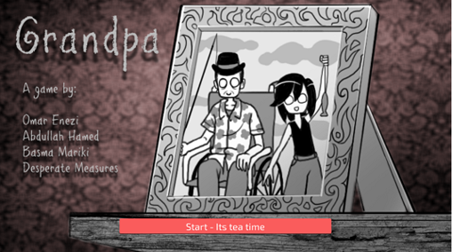 

## What is WebAssembly (WASM)?
Web browsers have an “engine” that can run JavaScript for a long time now. Modern browsers have a new “engine” or runtime called WebAssembly (WASM). With WASM, programmers are no longer forced to using JavaScript for client-side computations on a browser, they can use any language that can generate WASM. 

## How is WASM relevant to game developers?
Imagine a world where you can create a high-performance real-time graphics that runs on any device that has a web browser with one build. This is the potential future of WASM. For now, imagine you're an architect and you were able to build a high-quality 3D model of a building that you can walk through, rendered in real-time with dynamic lighting and weather affects. Then imagine sharing that experience with a client by just sending them a hyperlink that they can open on any OS without having to install anything. This can now be achieved by using WASM. What is exciting is that there are already some .NET game engines that can target WASM.

## Which .NET game engine supports WASM?
**WaveEngine**

WaveEngine is great for industrial and mixed reality use cases. The new .NET 5-based version of WaveEngine also supports builds for WASM. You can see a demo of it in action in their blog post announcing [WaveEngine 3.1 based on .NET 5](https://devblogs.microsoft.com/dotnet/guest-post-introducing-waveengine-3-1-based-on-net-5/).

**Godot**

Godot is another engine that has an option to let you script C# using .NET. It also allows you to create WASM builds. Godot is going even further by offering the engine as a whole in a browser using WASM in their next big 4.0 release. For more details, check out their post on [how you can run the Godot Editor in a browser]( https://godotengine.org/article/godot-editor-running-web-browser).

**Unity**

Unity creates web builds that utilizes WASM and [WebGL (Web Graphics Library)](https://developer.mozilla.org/docs/Web/API/WebGL_API), a graphics API for rendering high-performance interactive graphics available in modern browsers. There is a limitation in Unity WebGL builds where they are only officially supported on desktop browsers as of version 2020.2. So, keep that in mind. I will demo how to create a Unity WebGL build below.

### Building a WASM WebGL Unity project
To create a WebGL/WASM build in Unity, you need to first switch the target platform to WebGL in the Unity build settings.

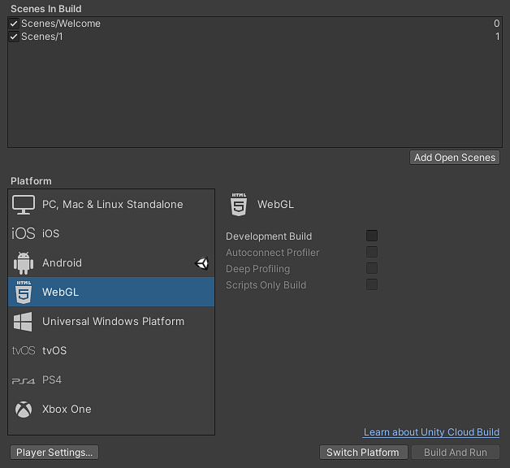

After that’s complete, select **Player Settings** and make sure to note the **Default Canvas Width** and **Height** settings. We might need to use that when embedding a WebGL Unity build in other web apps.

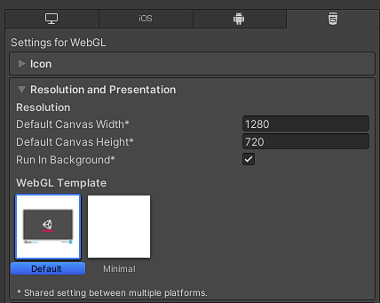

Now start building your WebGL build by selecting **Build**. 

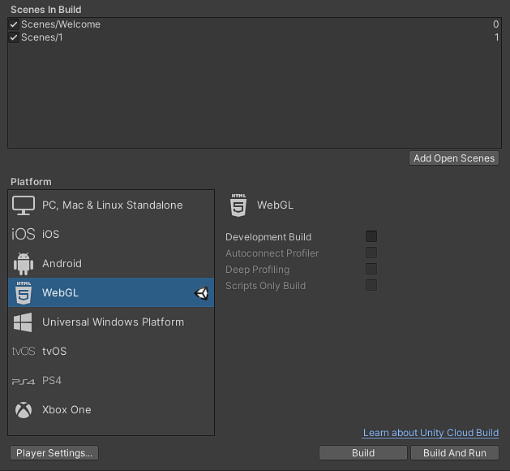

Once the build is done, the build folder should look like this:

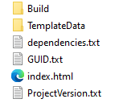

The `index.html` file is the entry point to your web build. It calls the JavaScript functions that will load the WASM Unity binaries. The `TemplateData` folder contains assets like icons, loading progress bar, and CSS file for the `index.html` file. The `Build` folder, shown below, contains the WASM executables and a JavaScript launcher. The JSON file in the build folder has all the path and file names like `dataUrl`, `wasmCodeUrl`, `wasmMemoryUrl`, and `wasmFrameworkUrl`. You can change those in case you moved files around or hosted them on a CDN.
For more information about building a WebGL build, check out the [Unity WebGL build documentation](https://docs.unity3d.com/Manual/webgl-building.html).

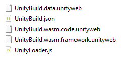


## What else can you do with WASM?
With ASP.NET Core, you can create web apps using C#. Blazor is a feature of ASP.NET Core that enables you to use C# code in a browser using WASM. Developers can write both, the client side- and server-side web application in C# without having to use JavaScript. With Blazor WebAssembly you can create complex web applications that run mainly on the client side. This is great for mobile devices since you can’t always guarantee an internet connection. This is also great for .NET game developers as they do not need to learn another language.
If you are a Unity developer and want to learn more about ASP.NET Core, check out my blog post [Build for the web with ASP.NET Core (For Unity developers)]( https://developer.microsoft.com/games/blog/build-for-the-web-with-aspnet-for-unity-developers/). 
You can easily embed a WASM build of a game or simulation in any ASP.NET Core application by simply using an iframe. For example, here is how you add a Unity webGL build to a Blazor app:

### Embedding a Unity WebGL build in ASP.NET apps
Since we already have an HTML file that runs the Unity build generated by Unity, why not just reuse it when embedding the build in an ASP.NET Core app? We can just load that HTML file inside of an iframe. There is a limitation to this approach is that both apps will be separate and you won't be able to call ASP.NET code from your Unity game, and vice versa except through [JS Interop](https://docs.microsoft.com/aspnet/core/blazor/call-javascript-from-dotnet?view=aspnetcore-5.0). Check the end of the post for a challenge.

For this post, I am using the Blazor App template in Visual Studio 2019 on Windows or Mac. This should work with any ASP.NET Core application. To create a Blazor app out of a template, open up the Visual Studio start page and select **Create a new project**. 

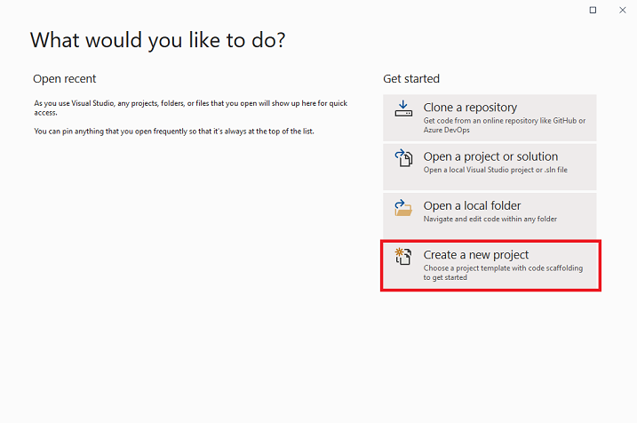

Then search for Blazor app and select it. 

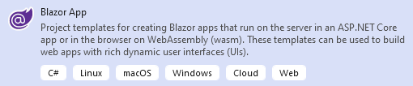

Once you have a Blazor project as well as a Unity build, drag and drop the Unity build folder into the `wwwroot` folder of your Blazor project.

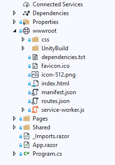

Now open the `Index.razor` file in Visual Studio. It's located in the `Pages` folder inside of your Blazor app folder.

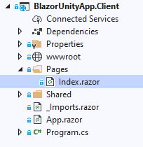

Under the last line of the file, enter this line of code, adding the **Default Canvas Width** and **Height** we noted from the Unity build settings.

```html
<iframe width="" height="" src="UnityBuild/index.html" frameborder="0" allow="accelerometer; autoplay; encrypted-media; gyroscope;" allowfullscreen></iframe>
```
Now, press the play button up top. 


A browser should pop up with the Blazor app and the Unity WebGL build loading. It should look something like this:

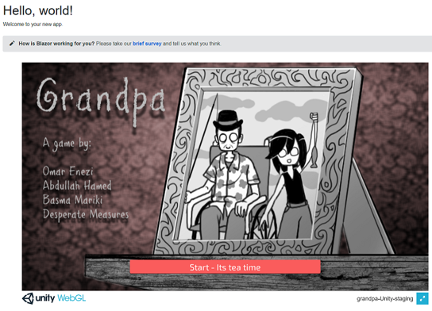

To learn more about Blazor, check out the [Blazor documentation]( https://docs.microsoft.com/aspnet/core/blazor).

## A Challenge
Now that you got the general idea, do you think you can take it one step further? Can you manage to run the Unity build with C# instead of relying on the JavaScript that Unity provides? Can you do this using [JS interop](https://docs.microsoft.com/aspnet/core/blazor/call-javascript-from-dotnet?view=aspnetcore-5.0)? Would love to hear about your attempts in the comments. The first elegant solution on GitHub sent to [my twitter account](https://twitter.com/indiesaudi) will be promoted on this blog in a future post. Good luck!

