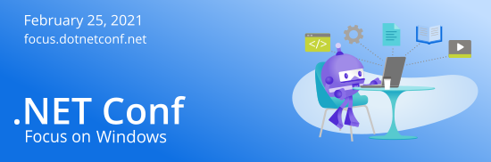

The .NET Conf team is bringing you another ".NET Conf: Focus" event **Thursday, February 25** all about building Windows desktop apps. We have finalized the agenda, speakers, and hosts that will make the day educational and fun. We have .NET and Windows team members along with community speakers and MVPs to show you some amazing things you can do.

**[Check out the agenda and save the date!](https://focus.dotnetconf.net/agenda?utm_campaign=savedate&utm_medium=email&utm_source=dotnetconf)**

I had the pleasure of talking with Leslie on the Visual Studio Toolbox show all about the event and some of the history and behind the scenes tid bits about the .NET Conf series. It's a short 15 minute interview so check it out.

<iframe width="560" height="315" src="https://www.youtube.com/embed/eUR92oqdBjA" frameborder="0" allow="accelerometer; autoplay; clipboard-write; encrypted-media; gyroscope; picture-in-picture" allowfullscreen></iframe>

**Tune into [focus.dotnetconf.net](https://focus.dotnetconf.net/?utm_campaign=savedate&utm_medium=email&utm_source=dotnetconf) on February 25, 2021**.  See how you can move your Windows apps forward to take advantage of modern platforms, components, and tools no matter what .NET app model you're using. Learn why and how to upgrade WPF and Windows Forms apps to .NET 5, see Visual Studio tooling improvements, learn how to leverage cloud services from your client apps, and a whole lot more. You'll also see what the future of native device development will look like in .NET 6.

**Tune in live and ask your questions** on Twitter using the hashtag [#dotNETConf](https://twitter.com/search?q=%23dotnetconf) and our hosts will relay them to the speakers during the session.

**Get some [free digital swag and virtual swag bags](https://focus.dotnetconf.net/swag?utm_campaign=savedate&utm_source=dotnetconf&utm_medium=email).**
Enter to win 1 of 25 epic swag bags with prizes from our generous sponsors. Each one is valued at close to $2,000USD and includes software licenses, t-shirts, socks, and more.

Download free digital swag like wallpapers, themes, 3D printable items, and more. You can also create your own coding companion by building your own custom dotnet-bot at [mod-dotnet-bot.net](https://mod-dotnet-bot.net/).

**What is .NET Conf: Focus?** "Focus" is a series of smaller, live events that we deliver to you throughout the year that are focused on specific things you can do with .NET. Of course, we will still have our big .NET Conf event in November for the .NET 6 launch. [You can check out the past events here](https://github.com/dotnet-presentations/dotNETConf/tree/master/2020).

**[Tune in on February 25](https://focus.dotnetconf.net/?utm_campaign=savedate&utm_medium=email&utm_source=dotnetconf)**, ask questions live and learn how to move your Windows apps forward. As with all live events, you may also witness hijinks, calamity, successes and failures all at the same time a cat walk across a keyboard. We can guarantee you will have fun an learn some things.

See you there!
