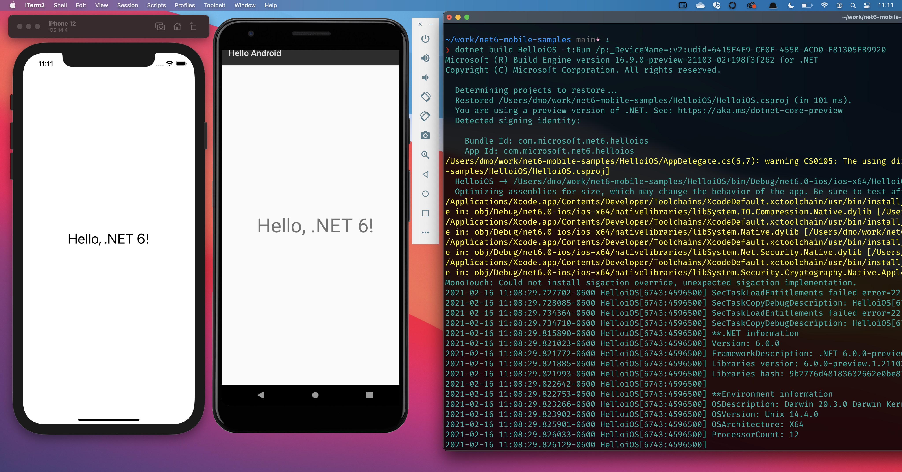

Today, we are happy to deliver the first preview of .NET 6 and share what you can expect from the new release. We have been defining the overall shape of the release for the last few months, including a large set of [new experiences and capabilities](https://themesof.net/). The heart of .NET 6 is delivering the final parts of the .NET unification plan that started with [.NET 5](https://devblogs.microsoft.com/dotnet/announcing-net-5-0/). The release will also include major improvements across all parts of .NET, including for cloud, desktop and mobile apps.

ASP.NET Core and EF Core are also being released today.

You can [download .NET 6 Preview 1](https://dotnet.microsoft.com/download/dotnet/6.0), for Windows, macOS, and Linux.

* [Installers and binaries](https://dotnet.microsoft.com/download/dotnet/6.0)
* [Container images](https://hub.docker.com/_/microsoft-dotnet)
* [Linux packages](https://github.com/dotnet/core/blob/master/release-notes/6.0/)
* [Release notes](https://github.com/dotnet/core/tree/master/release-notes/6.0)
* [Known issues](https://github.com/dotnet/core/blob/master/release-notes/6.0/6.0-known-issues.md)
* [GitHub issue tracker](https://github.com/dotnet/core/issues)

.NET 6 has been tested with Visual Studio 16.9 Preview 4 and Visual Studio for Mac 8.9. We recommend you use those builds if you want to try .NET 6 with Visual Studio family products.

## Unified and extended

.NET 6 will enable you to build the apps that you want to build, for the platforms you want to target, and on the operating systems you want to use for development. We're extending what you can do with .NET and where you can do it by delivering the rest of [.NET unification vision](https://devblogs.microsoft.com/dotnet/introducing-net-5/). We're integrating the Android, iOS, and macOS capabilities that are part of Xamarin into .NET 6. We're also extending what you can do with Blazor into a new kind of hybrid client app -- combining web and native UI together -- that can be used for desktop and mobile scenarios. These new capabilities will be described later in this post and in subsequent previews.

Our unification efforts offer something for all .NET developers. If you are desktop app developer, there are new opportunities for you to reach new users. If you are a mobile app developer, you will benefit from using the mainline .NET tools and APIs while targeting iOS and Android platforms. If you are a web or cloud developer, it will be easier to expose services to .NET mobile apps and share code with them.

We started the [unification process in .NET 5](https://devblogs.microsoft.com/dotnet/announcing-net-5-0/#unified-platform-vision). For that release, we chose Blazor WebAssembly as the first unified platform deliverable. It is based on the [Mono runtime](https://github.com/dotnet/runtime/tree/master/src/mono), uses the .NET class libraries, and .NET SDK tools. We will use the same model for iOS, and Android as we integrate Xamarin. With a unified platform, new APIs and performance improvements will be available to all developers on the same day, and work for all apps.

When you install the .NET SDK, you can start building apps for mobile platforms. That means that you'll be able type `dotnet new android` and then `dotnet run` and expect an Android emulator to start running a .NET app. The same is true for iOS apps. You will have similar experiences in Visual Studio and Visual Studio Code. Don't worry that the .NET SDK is going to get a lot bigger because of mobile workloads being supported. The mobile workloads will be optional. In fact, the .NET SDK is going to become smaller as a result of existing workloads also becoming optional. A new [optional SDK workloads](https://github.com/dotnet/designs/blob/main/accepted/2020/workloads/workloads.md) experience will be part of .NET 6 and will be completed in .NET 7.

We are taking the opportunity around unification to simplify and extend the experience of building Xamarin Forms apps. We're calling that project [.NET Multi-platform App UI](https://devblogs.microsoft.com/xamarin/the-new-net-multi-platform-app-ui-maui/). That project will offer many improvements and capabilities that will extend the platform reach of both desktop and mobile developers.

## Open planning

We adopted a more [open planning process](https://themesof.net/) with .NET 6. We plan .NET releases with a hierarchical model of themes, epics and user stories, with priorities and categories. This model enables you to see the release at a broader scope, provides insight on which features are the most important, and makes it easier to find opportunities to engage and contribute.

You may notice that the GitHub theme and epic issues for .NET 6 started showing up in September. While we have planned product releases many times before, we've never done that with GitHub issues. For .NET 5, we used Azure DevOps. The best way to get an all up view of our plans is to use our Blazor-based [themesof.net](https://themesof.net/) app.

We didn't make a big announcement at the start of this process because we were still figuring out the process and model, and didn't yet have a story to tell. However, we did proactively point a few folks to what we were doing. We first talked to our friends at Red Hat, although they had already been watching our activity and had figured out what we were doing. They were pleased that we were taking the next step in project openness. We next shared our new open planning approach with the .NET Foundation board. Open planning has also made it easier for other teams at Microsoft to see where the .NET Team is headed next.

The plan you see on GitHub is now a fundamental part of our engineering process. We'll do our best to keep these issues up-to-date, and link issues to relevant activities and docs to help you better understand the depth and breadth of the project. We encourage you to engage, ask questions, and give feedback.

## Support

.NET 6 will be will be released in November 2021, and will be supported for three years, as a [Long Term Support (LTS) release](https://github.com/dotnet/core/blob/master/release-policies.md). The [platform matrix](https://github.com/dotnet/core/blob/master/release-notes/6.0/6.0-supported-os.md) has been significantly expanded compared to .NET 5.

The additions are:

- Android.
- iOS.
- Mac and Mac Catalyst, for x64 and Apple Silicon (AKA "M1").
- Windows Arm64 (specifically Windows Desktop).

The default .NET container images for .NET 6 -- starting with Preview 1 -- are based on Debian 11 ("bullseye"). This is discussed more in the container section.

## .NET Multi-platform App UI

.NET Multi-platform App UI is a modern UI toolkit that builds upon and extends Xamarin as part of .NET 6 unification. We have heard from many of you that you want to deliver beautiful and consistent app experiences across various platforms and devices, and want to share more code across your mobile and desktop apps. You will be able to target Android, iOS, macOS, and Windows. .NET 6 multi-platform mobile and cross-platform support will be based on integrating and extending the Xamarin.Forms toolkit, which has been adapted over the past seven years and has satisfied the evolving needs of many customers. Our key focus areas for .NET 6 are: app performance, adding new control themes, and faster developer experiences.

As part of the unification process, we decided it made a lot of sense to merge the Xamarin.Essentials library into .NET Multi-platform App UI. In addition to cross-platform UI controls, you can easily use [device capabilities](https://docs.microsoft.com/xamarin/essentials/), such as device sensors, common features such as photos and contacts, and many services you use on a regular basis such as authentication and secure storage.

.NET 6 Preview 1 introduces the first two platforms of .NET Multi-platform App UI: Android and iOS. [.NET 6 sample mobile projects](https://github.com/dotnet/net6-mobile-samples) and [installation instructions](https://github.com/dotnet/net6-mobile-samples) will help you get started building Android and iOS apps. Future previews will add support for macOS and Windows desktop, add C# Hot Reload to the existing XAML support for faster development experiences, and introduce new project features for managing assets and platform-specific needs from a single place.

Developers using Xamarin today will be able to start using .NET 6 with Xamarin and Xamarin.Forms projects. We will provide a conversion tool and migration guides to help you transition to using .NET 6.



This image demonstrates Android and iOS apps being launched with [dotnet](https://github.com/dotnet/xamarin/issues/26#issuecomment-757981580) from the macOS terminal, running in the Android emuator, and iOS simulator, respectively. They could equally have been running on physical mobile hardware. The app includes the same code as [dotnet-runtimeinfo](https://github.com/dotnet/core/blob/master/samples/dotnet-runtimeinfo/Program.cs), and is displaying the results with `Debug.WriteLine` traces in the debug output window. This app is being run on the [Mono runtime](https://github.com/dotnet/runtime/tree/master/src/mono) with the .NET libraries, exercised with the .NET SDK.

## Blazor desktop apps

Blazor has become a very popular way to write .NET web apps. We first supported Blazor on the server, then in the browser with WebAssembly, and now we're extending it again, to enable you to write Blazor desktop apps. Blazor desktop enables you to create hybrid client apps, which combine web and native UI together in a native client application. It is primarily targeted at web developers that want provide rich client and offline experiences for their users.

Blazor desktop offers a lot of choice on how you construct your application. At one end of the application spectrum, you can use Blazor and web technologies for all aspects of the client application experience with the exception of the outer-most native application container (like the title bar). On the other end of the spectrum, you can use Blazor desktop for targeted functionality within an otherwise native app (like WPF), like a user profile page that you've already implemented for your Blazor-based website. All the choices in between are equally possible. We are building Blazor desktop initially for .NET apps, but there is no technical reason why you couldn't use it in a desktop app built with another app stack, like for example Swift.

Blazor is built on top of .NET Multi-platform App UI. It relies on that UI stack for a native application container and native controls (should you want to use them). We are building Blazor to have startup and throughput performance on par with other desktop solutions. For developers that love Blazor and love web technologies, we think that Blazor is going to be a great choice for building desktop apps.

## Arm64

Arm64 continues to be a big focus for us, and for the industry. We made major [improvements in Arm64 performance with .NET 5.0](https://devblogs.microsoft.com/dotnet/arm64-performance-in-net-5/), and will continue to invest in [Arm64 performance](https://github.com/dotnet/runtime/issues/43629). For this release, we will focus our attention most on functional enablement.

On Windows, we're adding support for Windows Forms and Windows Presentation Framework (WPF), with initial support in Preview 1. This is on top of the Windows Arm64 capabilities we delivered with .NET 5. We will continue to make improvements with each preview based on [feedback](https://github.com/dotnet/wpf/issues/4117). We said earlier that we planned to backport Windows Desktop app capabilities to .NET 5 after we'd enabled it in early .NET 6 builds. That's still the plan, although I don't have a date to share yet. We are aiming for the first half of the year.

On Mac, we are adding support for Apple Silicon (Arm64) chips (native and emulated), with initial support in Preview 1. We will support console apps, ASP.NET Core, Mac client apps (Mac and Mac Catalyst), and the .NET SDK. There is more discussion of Apple Silicon later in the post.

## Containers

Containers are a daily focus on the team, both as the basis of our [build infrastructure](https://github.com/dotnet/dotnet-buildtools-prereqs-docker) and as a [product scenario](https://devblogs.microsoft.com/dotnet/using-net-and-docker-together-dockercon-2019-update/). [.NET performance testing](https://github.com/TechEmpower/FrameworkBenchmarks/tree/master/frameworks/CSharp/aspnetcore) is also done in containers. We have multiple projects planned to improve containers in .NET 6.

* Improve [scaling in containers](https://github.com/dotnet/runtime/issues/48094), and better support for [Windows process-isolated containers](https://github.com/dotnet/runtime/issues/46889). We also plan a new form of container performance testing focused on density and aggregate machine performance.
* Reduce container image size using PGO (more on that later; see "very cold" split).
* Increase startup and throughtput performance by using [ready to run version bubbles](https://github.com/dotnet/coreclr/blob/v2.1.3/Documentation/botr/readytorun-overview.md#version-bubbles).
* Increase startup and throughput performance by using [modern vector instructions by default](https://github.com/dotnet/designs/pull/173).
* [Advanced scenario] Enable large page support with [ready to run composite images](https://github.com/dotnet/runtime/blob/master/docs/design/features/readytorun-composite-format-design.md).

All (but the first) of these features are dependent on crossgen2, which is described later. Most of these features are not container-specific, however, we expect to use them in containers. In some cases, like version bubbles, containers may be the only distribution vehicle where a feature is enabled by default. An important benefit of containers is that we can offer .NET in a more opinionated configurations than the more general `.tar.gz`, `.deb`, or `.msi` deliverables. We'd rather offer containers in a higher-performance configuration with the downside that they may not be usable in all scenarios (like on old hardware).

Whenever we start a new release, we look at the landscape of Linux distros to ensure we are making the best base-image version choices. .NET 6 images will be based on Alpine 3.13 (or later), Debian 11 ("bullseye"), and Ubuntu 20.04. We will not adopt a newer Ubuntu version (in containers) until Ubuntu 22.04 is released.

The Debian bullseye choice deserves more explanation. It is currently in a testing phase and we do not know when it will ship. There is an uncoordinated race between the Debian and .NET releases, and we're confident that .NET 6 will lose the race. Once we start releasing images for a new .NET release, we are not going to change the base image we use. We've been using Debian 10 ("buster") for multiple releases now. It's time to say goodbye to buster given that we'll support .NET 6 for three years.

Starting with Preview 1, if you pull the `6.0` tag, you will be using a [bullseye image](https://github.com/dotnet/dotnet-docker/pull/2582). Bullseye has not been integrated into our CI environment yet, however, manually testing suggests that it is already a solid release, and compatible with buster. Please give us feedback if you have issues.

We started a new blog post series on container images for 2021. The first is [Staying safe with .NET containers](https://devblogs.microsoft.com/dotnet/staying-safe-with-dotnet-containers/).

## Theme: Improve startup and throughput using runtime execution information (PGO)

With each of these previews, I'll describe one or two [.NET 6 themes](https://themesof.net/). I'll start with [Improve startup and throughput using runtime execution information (PGO)](https://github.com/dotnet/core/issues/5491).

We've been using PGO since the early days of .NET. The goal of PGO is to optimize native code in binaries to make it more efficient to be executed by a CPU and other aspects of a computer. Optimized code makes apps launch and run faster, can reduce memory usage and even disk footprint. There are lots of techniques you can employ to that end. We take advantage of PGO -- for the native runtime --  that is offered by the C++ compilers that we use on Windows, macOS, and Linux. That's very related and important, but not what this theme is about.

This theme relates to the native code that the RyuJIT compiler generates, either at runtime or via the crossgen tool (into the [ready-to-run](https://github.com/dotnet/coreclr/blob/master/Documentation/botr/readytorun-overview.md) native code format). Crossgen and RyuJIT already support PGO, but we want to significantly improve this feature, both in terms of usability and performance benefit. We cannot use the C++ compiler PGO capabilities for RyuJIT, or by extension crossgen, because RyuJIT isn't built on top of a C++ compiler (in a codegen sense).

There is a lot to [profile-guided optimization (PGO)](https://en.wikipedia.org/wiki/Profile-guided_optimization). I'll start with an analogy. You are driving slowly down a big highway wishing you were already home. You think to yourself: "most of the reason for this traffic jam isn't volume but the result of an uncoordinated set of drivers who are locally optimizing only in terms of the brake lights one car ahead of them. The tragedy of it all!" In a world where traffic is profile-guided and optimized, a computer would record daily traffic patterns, and then compute optimal meter-by-meter paths for each car -- based on perviously observed traffic patterns -- sent as a constant stream of instructions to each self-driving car computer. Traffic would be globally optimizing for efficiency and safety. You'd get home at least a half hour earlier every day because of it. The government would be able to delay highway expansion projects, and instead use the money to fund schools and parks.

One PGO technique is [hot-cold splitting](https://reviews.llvm.org/rG94faadaca4e): the code that is called most frequently in a binary is placed together and code that is used infrequently is placed in a separate grouping. Ideally, the code needed next in series of method calls (or basic blocks accesses) is already loaded in a CPU cache by virtue of being in the same physical sequence of loaded pages from disk. In that case, method or basic block invocation is lightning fast (as fast as the CPU allows). We also have a third split -- the "very cold" grouping -- which has no native code pre-compiled at all, for example for an else clause that throws an exception. That very cold code will be JITed if it is ever needed, which might not be a performance concern. We can produce significantly smaller binaries if we can identify a lot of candidates for the very cold state.

PGO (in the general case, not just .NET) isn't generally popular because it very challenging to do well, at least with traditional models. The tools are often clunky and the process requires incredible attention to detail. You have to regularly go through a "training" exercise, where you run your app through various scenarios while a tool collects data about your app. You then feed that data into your compiler (in this case, crossgen). You then have to validate that you are happy with the results. You then have to rinse and repeat, both in terms of improving the set of scenarios you train with but also account for your app changing during development. You have to methodically follow all the prescribed steps with PGO if you want optimal results. It is a very tiring and frustrating process.

That's a description of PGO for .NET to date. In .NET 6, we plan to do the following:

- Create a new set of tools for PGO training and data manipulation that are oriented around ease-of-use.
- Publish training data for the .NET libraries so that others (like Red Hat) can use, augment it, and also share training data.
- Enable collecting training data for apps running in production.
- Enable the JIT to use static training data at runtime.
- Enable the JIT to [generate and use dynamic training data](https://github.com/dotnet/runtime/issues/43618) at runtime (training-less scenario).

We expect that PGO can deliver wins on the order of 10% for startup and throughput. For compute-intensive workloads, the benefit could be greater. We expect to need two releases to deliver the full breadth of our vision. We are still defining the exact set of .NET 6 deliverables for PGO. We want to build the right long-term architecture (that avoids re-work down the road or cutting off future opportunities) while delivering compelling new value in this release. We hope to transition to using the new PGO tools (ourselves) in this release. Enabling PGO as a standard feature of .NET will be a significant step forward for the ecosystem.

The remainder of the post describes [features that are included in Preview 1](https://github.com/dotnet/core/issues/5853).

## Targeting .NET 6

The [target framework monikers (TFMs) for .NET 6](https://github.com/dotnet/designs/pull/174) follow the approach that we adopted with [.NET 5](https://github.com/dotnet/designs/blob/main/accepted/2020/net5/net5.md). New TFMs have been added as a result of adding support for new platforms.

To target .NET 6, you need to use a .NET 6 TFM, for example:

```xml
<TargetFramework>net6.0</TargetFramework>
```

The full set of .NET 6 TFMs, including operating-specific ones follows.

* `net6.0`
* `net6.0-android`
* `net6.0-ios`
* `net6.0-maccatalyst`
* `net6.0-macos`
* `net6.0-tvos`
* `net6.0-windows`

The compatibility relationships for each of these TFMs, both among this set, and with existing TFMs is discussed in [.NET 6.0 Target Frameworks](https://github.com/dotnet/designs/pull/174).

We expect that upgrading from .NET 5 to .NET 6 should be straightforward. Please report any breaking changes that you discover in the process of testing existing apps with .NET 6.

## .NET CLI

The .NET CLI has enabled additional convenience experiences as a result of adopting the [System.CommandLine](https://github.com/dotnet/command-line-api) libraries.

### Response files

A response file is a file that contains a set of command-line arguments for a tool. Response files satisfy two primary use cases: enables a command-line invocation to extends past the character limit of the terminal, and is a convenience over typing the same commands repeatedly. Response file support has been added for the .NET CLI. The syntax is `@file.rsp`. The format of the response file is a single line of text, just as it would be structured in a terminal.

The following animation illustrates using a response file with `dotnet build`, demonstrated as: `dotnet build @demo.rsp`


### Directives

Directives are a System.CommandLine experience for interacting with commands directly. Within the System.CommandLine model, commands are a set of objects that can be invoked or explored, as data with associated behavior.

The suggest [directive](https://github.com/dotnet/command-line-api/blob/main/docs/Syntax-Concepts-and-Parser.md#directives) enables you to search for commands if you don't know the exact command. This directive exists to enable the [dotnet-suggest global tool](https://github.com/dotnet/command-line-api/blob/main/docs/dotnet-suggest.md)

```console
dotnet [suggest] buil
build
build-server
msbuild
```

The [parse](https://github.com/dotnet/command-line-api/blob/main/docs/Features-overview.md#parse-preview) directive demonstrates the manner in which the CLI parses your commands. It can be useful to understand why a command doesn't work or has different results than you expect.

```console
dotnet [parse] build -f net5.0
[ dotnet [ build [ -f <net5.0> ] ] ]
```

## Libraries

The following APIs have been added to the .NET libraries.

### System.Numerics - New math APIs

The following performance-oriented math APIs have been added. Their implementation will be hardware accelerated if the underlying hardware supports it.

New APIs:

* `SinCos` for simultaneously computing `Sin` and `Cos`
* `ReciprocalEstimate` for computing an approximate of `1 / x`
* `ReciprocalSqrtEstimate` for computing an approximate of `1 / Sqrt(x)`

New overloads:

* `Clamp`, `DivRem`, `Min`, and `Max` supporting `nint` and `nuint`
* `Abs` and `Sign` supporting `nint`
* `DivRem` variants which return a tuple

### Improved support for Windows ACLs

[System.Threading.AccessControl](https://www.nuget.org/packages/System.Threading.AccessControl/) now includes improved support for interacting with Windows access control lists (ACLs).  New overloads were added to the `OpenExisting` and `TryOpenExisting` methods for `EventWaitHandle`, `Mutex` and `Semaphore`. These overloads -- with "security rights" instances -- enable opening existing instances of threading synchronization objects that were created with special Windows security attributes. This update matches APIs already available in .NET Framework and has the same behavior.

```cs
namespace System.Threading
{
    public static partial class EventWaitHandleAcl
    {
        public static EventWaitHandle OpenExisting(string name, EventWaitHandleRights rights);
        public static bool TryOpenExisting(string name, EventWaitHandleRights rights, out EventWaitHandle result);
    }
    public static partial class MutexAcl
    {
        public static Mutex OpenExisting(string name, MutexRights rights);
        public static bool TryOpenExisting(string name, MutexRights rights, out Mutex result);
    }
    public static partial class SemaphoreAcl
    {
        public static Semaphore OpenExisting(string name, SemaphoreRights rights);
        public static bool TryOpenExisting(string name, SemaphoreRights rights, out Semaphore result);
    }
}
```

### Portable thread pool

The [.NET thread pool has been re-implemented](https://github.com/dotnet/runtime/pull/38225) as a managed implementation, and is now used as the default thread pool in .NET 6. We made this change to enable applications to have access to the same thread pool -- with identical behavior -- independent of whether the CoreCLR, Mono, or any other runtime was being used. We consider this thread pool the standard for .NET going forward. We have not observed or expect any functional or performance impact as part of this change.

We expect that the thread pool will now be more accessible for experimentation or customization by virtue of being written in C#.

You can revert to using the native-implement runtime thread pool with: `COMPlus_ThreadPool_UsePortableThreadPool=0`. We have not decided how long we will maintain the old thread pool.

## Runtime

There are several new runtime features that are part of Preview 1, include Apple Silicon support, crossgen 2, and the beginnings of delivering on the PGO theme discussed earlier.

### Support for Apple Silicon

The new Apple M1 Arm64 chips received a lot of industry fanfare earlier this year. [Apple Silicon support](https://github.com/dotnet/runtime/issues/43313) is a key deliverable of .NET 6. The team has been working on enabling support for the Apple Silicon chip ever since we received [Developer Transition Kits (DTKs)](https://en.wikipedia.org/wiki/Developer_Transition_Kit) from Apple in 2020. .NET 6 Preview 1 includes the first enablement of Apple Silicon, however, you should consider our builds alpha-quality at this stage. We have several design issues to work through and significant validation to ensure a high-quality product.

Note: We use the terms "Apple Silicon", "Apple M1", and "Apple Arm64" largely interchangeably in this post and issues on GitHub. We consider "Apple Silicon" to be the best general term unless specifically referring to a given chip's capabilities, which will make more sense once Apple releases later variants of its chip (perhaps an "M2").

Apple Silicon chips have two different modes: native and (x64) emulated. Emulation is implemented (in part) in the [Rosetta 2 component](https://en.wikipedia.org/wiki/Rosetta_(software)#Rosetta_2). x64 emulation has been widely reported to be very good on Apple M1 devices.

For .NET 6, we will deliver both Arm64 and x64 builds for macOS. We will continue to deliver only x64 builds for earlier .NET and .NET Core releases, and will rely on Rosetta 2 emulation for their use on Apple Silicon machines. The project to enable Apple Silicon support has been significant and required a large enough set of code changes that we are not considering backporting them to .NET 5 or earlier .NET Core versions.

We are also validating that .NET container images -- both x64 and Arm64 -- work correctly on Apple Silicon machines.

Apple has been a great partner with our Apple Silicon work. They have helped us in multiple ways, and have expressed that they want .NET developers and users to be productive and happy on Apple Silicon devices. Thanks Apple folks!

#### Native Apple Silicon

The new Apple chip has stricter requirements than other Arm64 chips that we support. Apple published [Porting Just-In-Time Compilers to Apple Silicon](https://developer.apple.com/documentation/apple_silicon/porting_just-in-time_compilers_to_apple_silicon), and associated new APIs, realizing that application runtimes that rely on a JIT compiler would require changes. At least half of our discussions with Apple centered on the topics outlined in this document. These new requirements are satisfied in the .NET 6 Preview 1 build.

[Universal binaries](https://developer.apple.com/documentation/xcode/building_a_universal_macos_binary) is another new requirement for apps that are published via the Mac app store. Publishing via the store isn't a capability we currently support, nor is it something that we hear requested much from .NET developers. We will not be enabling a workflow to publish universal binaries for .NET apps this release. We will reconsider this need with .NET 7.

Note: Mac supports both native and emulated apps to be run concurrently, however a single process is always either native or emulated. That isn't a problem for .NET apps, but is something you should be aware of (with any app platform). Activity Monitor displays the architecture of each process on your Mac so that it is easy to tell if apps have been ported to native or are relying on emulation.

[Apple Silicon ABI](https://developer.apple.com/documentation/apple_silicon/addressing_architectural_differences_in_your_macos_code) requirements are different from both Mac Intel and from other Arm64 platforms we support. The .NET runtime supports several different calling conventions due to [ABI](https://en.wikipedia.org/wiki/Application_binary_interface) differences, such that [supporting Apple Silicon ABI requirements](https://github.com/dotnet/runtime/issues/41130) are not a unique challenge.

The following changes have been made to [support Apple Silicon Arm64 ABI requirements](https://github.com/dotnet/runtime/issues/41130).  

- [Use bytes in `fgArgTabEntry`](https://github.com/dotnet/runtime/pull/42503)
- [Support byte sizes from lowering to codegen](https://github.com/dotnet/runtime/pull/43024)
- [Preserve precise argument sizes](https://github.com/dotnet/runtime/pull/43130)
- [Use 4-byte stack alignment for `hfa<float>`](https://github.com/dotnet/runtime/pull/46034)
- [Arg alignment](https://github.com/dotnet/runtime/pull/46665)

##### Debugging

Debugging a .NET app running natively doesn't currently work, locally or remotely, in any Visual Studio product. Debugging will be enabled in a later preview (we hope Preview 3).

You can use one of the following workaround options in absence of native debugging being available.

- Launch and debug the app using the `x64` runtime, using Rosetta 2 emulation
- Debug on another platform, such as an Intel Mac or Linux Arm64.

For advanced users: use the lldb native debugger with the  [sos-debugging-extension](https://docs.microsoft.com/dotnet/core/diagnostics/sos-debugging-extension). You must build the extension from the [dotnet/diagnostics repo](https://github.com/dotnet/diagnostics) and then load it as an lldb plugin, as follows.

```console
(lldb) plugin load /Users/stmaclea/git/diagnostics/artifacts/bin/OSX.arm64.Debug/libsosplugin.dylib
```

##### Known issues

The following issues are present in Preview 1 and will be resolved in a later Preview.

- For large stack allocations, the [JIT can fail to generate stack clear code](https://github.com/dotnet/runtime/issues/42023) since the Apple Silicon page size is 16K.
- Reliability isn't yet at parity with x64.
  - A small number of tests are failing GC Stress testing.
  - A small number of tests exhibit intermittent failures.
- CI testing is not enabled (due to machine availability) so test coverage is from manual testing.
- We have not yet designed an experience to use emulated and native .NET versions together on Apple Silicon. If you want to use .NET 6 and .NET 5, for example, on the same machine, you should probably use the `.tar.gz.` distribution rather that `.pkg`, so that you can control the version (if any) that is in the path.

#### .NET Rosetta 2 Emulation

A shared goal between Apple and Microsoft is that [.NET x64 products will run in Rosetta 2 emulation](https://github.com/dotnet/runtime/issues/44897) without changes. We've found that .NET 5 macOS x64 builds work well with Big Sur 11.2+. Please make sure that you have the latest build of Big Sur if you are using .NET with emulation. Earlier Big Sur builds were found to be problematic.

.NET 5 x64 testing by Microsoft, Apple, and the community shows:

- Stability and performance is good.
- Debugging is fully functional.
- Performance is slow when debugging.

We have not yet performed a full test pass on .NET and .NET Core x64 versions running in Rosetta 2 emulation. We will work through the process of validating current behavior, and then determine how to resolve issues, as needed, to ensure high-quality and high-performance x64 product experiences on Apple Silicon.

We do not expect that Rosetta 2 emulation will be supported on Apple Silicon forever, but that it is intended as a temporary migration bridge to Arm64. Our primary focus is on enabling a competitive Arm64 experience on Apple Silicon. We will continue to support .NET on Mac Intel machines as long as Apple supports them.

### Improving single file apps

In .NET 6, [single file apps have been enabled for Windows and macOS](https://github.com/dotnet/runtime/issues/43072). In .NET 5, [single files apps were limited to Linux](https://devblogs.microsoft.com/dotnet/announcing-net-5-0/#single-file-applications). In .NET 6, for all supported operating systems, you can publish a single-file binary that has exactly one file on disk and does not need to extract any of the [core runtime assemblies](https://github.com/dotnet/runtime/issues/43072) to temporary directories.

This capability is based on a building block called "superhost". The normal "apphost" is the executable that launches your application, like `myapp.exe` or `./myapp`. Apphost contains code to find the runtime, load it, and start your app with that runtime. Superhost still performs those tasks, but also includes a statically linked copy of all the CoreCLR native binaries. That removes the need for CoreCLR native binaries to be made available elsewhere.

There are cases where a single file app will have more than one file. WPF native dependencies are not part of the superhost, resulting in  additional files beside the single file app. The same is true for any other native binaries that you happen to depend on.

### Facilitate single-file signing on macOS

Single file apps now satisfy Apple notarization and signing requirements on macOS. The [specific changes](https://github.com/dotnet/runtime/issues/3671) relate to the way that we construct single file apps in terms of discrete file layout.

Apple started [enforcing new requirements](https://developer.apple.com/news/?id=09032019a) for [signing and notarization](https://developer.apple.com/documentation/xcode/notarizing_macos_software_before_distribution) with [macOS Catalina](https://support.apple.com/kb/SP803). We've been working closely with Apple to understand the requirements, and to find solutions that enable a development platform like .NET to work well in that environment. We've made [product changes and documented user worflows](https://docs.microsoft.com/dotnet/core/install/macos-notarization-issues) that are required to satisfy Apple requirements in each of the last few.NET releases. One of the remaining gaps was single-file signing, which is a requirement to distribute a .NET app on macOS, including in the macOS store.

### Crossgen2

Crossgen2 is a replacement of the [crossgen tool](https://github.com/dotnet/runtime/blob/master/docs/workflow/building/coreclr/crossgen.md). It is intended to satisfy two outcomes: make crossgen development more efficient, and enable a set of capabilities that are not currently possible with crossgen. This transition is somewhat similar to the native code csc.exe to managed-code Roslyn-based compiler (if you recall the Roslyn project). Crossgen2 is written in C#, however, it doesn't expose a fancy API like Roslyn does.

The PGO plans we have are contingent on crossgen2, as are [other plans that affect ready-to-run code generation](https://github.com/dotnet/designs/pull/173). There are perhaps a half-dozen projects we have planned for .NET 6 that are dependent on crossgen2. I'll be describing those in later previews. Suffice to say, crossgen2 is a very important project.

Crossgen2 will enable cross-compilation (hence the name "crossgen") across operating system and architecture dimensions. That means that you will be able to use a single build machine to generate native code for all targets, at least as it relates to ready-to-run code. Running and testing that code is a different story, however, and you'll need appropriate hardware and operating systems for that.

The first step (and test) for us is to compile the platform itself with crossgen2. The System.Private.Corelib assembly is compiled by crossgen2 in Preview 1. In subsequent previews, we will target progressively broader parts of the product until the entire .NET SDK is compiled with crossgen2 for all platforms and architectures. That's our goal for the release and a necessary pre-condition for retiring the existing crossgen. Note that crossgen2 only applies to CoreCLR and not to Mono-based applications (which have a separation set of native code tools).

This project -- at least at first -- is not oriented on performance. The goal is to enable a much better architecture for hosting the RyuJIT (or any other) compiler to generate code in an offline manner (not requiring or starting the runtime). In our early testing, we haven't observed any performance differences, which is exactly what is expected.

You might say "hey ... don't you have to start the runtime to run crossgen2 if it is written in C#?" Yes, but that's not what is meant by "offline" in this context. When crossgen2 runs, we're not using the JIT that comes with the runtime that crossgen2 is running on to generate [ready-to-run (R2R) code](https://github.com/dotnet/runtime/blob/master/docs/design/coreclr/botr/readytorun-format.md). That won't work, at least not with the goals we have. Imagine crossgen2 is running on an x64 machine, and we need to generate code for Arm64. Crossgen2 loads the Arm64 RyuJIT -- compiled for x64 -- as a native plugin, and then uses it to generate Arm64 R2R code. The machine instructions are just a stream of bytes that are saved to a file. It can also work in the opposite direction. On Arm64, crossgen2 can generate x64 code using the x64 RyuJIT compiled to Arm64. We use the same approach to target x64 code on x64 machines. Crossgen2 loads a RyuJIT built for that configuration. That may seem complicated, but it's the sort of system you need in place if you want to enable seamless user experiences, and that's exactly what we want.

For now, the SDK still defaults to using the existing crossgen. The default will change to crossgen2 in an upcoming preview.

We hope to use the term "crossgen2" for just one release, after which it will replace the existing crossgen, and then we'll go back to using the "crossgen" term for "crossgen2". In the rare case we need to, we'll say "the old crossgen" or "crossgen1" to refer to the old one.

### Dynamic PGO

[Dynamic PGO](https://github.com/dotnet/runtime/issues/43618) is one of the PGO modalities that we are exploring and enabling. On one hand, it can be thought of as "training-less" PGO. Earlier in the post, I described a challenging process for PGO. The advantage of dynamic PGO is that it doesn't require any of that. The disadvantage is that it takes longer for a process to get to optimal performance. On the other hand, dynamic PGO can be thought of as a replacement for the much  simpler (and less effective) policies used by tiered compilation today.

In the most compelling case, dynamic and static PGO compose together. At runtime, the JIT can refine a small subset of statically compiled PGO-optimized code to provide the most high-value benefits. For example, the JIT can notice that there is only one class in the process (loaded so far) that implements a given interface. The JIT can then generate direct calls (via the class) instead of indirect calls (via the interface). This classic compiler technique is called [devirtualizion](https://en.wikipedia.org/wiki/Virtual_method_table#Efficiency), and results in higher performance by removing indirections in method invocation (small win) and enabling inlining (big win).

The following changes have been made as part of enabling dynamic PGO:

- [Guarded devirtualization](https://github.com/dotnet/runtime/pull/45133) -- Enable guarded devirtualization by class profile and probes for class types.
- [Flowgraph visualizations](https://github.com/dotnet/runtime/pull/42657) -- Graphical dump of flow graph with profile data.
- [Redundant branch elimination](https://github.com/dotnet/runtime/pull/46257) -- Optimize branches where a branch outcome is fully determined.
- [Enable CSE for PGO scenarios](https://github.com/dotnet/runtime/pull/45854) -- Enable [CSE](https://en.wikipedia.org/wiki/Common_subexpression_elimination) of PGO introduced type tests.

### Arm64 performance

We are planning another round of [Arm64 performance improvements in .NET 6](https://github.com/dotnet/runtime/issues/43629), to add to [Arm64 Performance in .NET 5](https://devblogs.microsoft.com/dotnet/arm64-performance-in-net-5/).

The following change is included in Preview 1.

- [Stack frame zeroing](https://github.com/dotnet/runtime/pull/46609) -- Use SIMD register to zero init frame
 


This image demonstrates an improvement in zeroing out the contents of stack frames, which is a common operation. The green line is the new behavior, while the orange line is another (less beneficial) experiment, both of which improve relative to the baseline, represented by the blue line. For this test, lower is better.

### Hardware-accelerating structs

Structs are an important part of the CLR type system. In recent years, they have been frequently used as a performance tool, way up at the level of C#. Examples are `ValueTask`, `ValueTuple` and `Span<T>`. Sadly, structs has been not been given the performance love they deserve in the JIT. In .NET 5 and [.NET 6](https://github.com/dotnet/runtime/issues/43867 ), we've been improving performance for structs, in part by ensuring that they can be loaded and accessed in CPU registers (as the arguments of methods).

The following changes are included in Preview 1:

- [Struct promotion for HFAs](https://github.com/dotnet/runtime/pull/43870) -- Struct promotion for HFA and non-HFA multireg args on x64 and Arm64
- [Enregister HFAs](https://github.com/dotnet/runtime/pull/39326) -- Enregister HFAs and other structs with matching fields.

Note: See [Overview of ABI conventions](https://docs.microsoft.com/en-us/cpp/build/arm64-windows-abi-conventions) for terms.

### Stabilize performance measurements

There is a tremendous amount of engineering systems work on the team that never appears on the blog. That will be true for any hardware or software product you use. The JIT team recently took on a project to [stabilize performance measurements](https://github.com/dotnet/runtime/issues/43227) with the goal of increasing the value of regressions that are auto-reported by our internal performance lab automation. This project is interesting because of the [in-depth investigation](https://github.com/dotnet/runtime/issues/43227) and the [product changes](https://github.com/dotnet/runtime/pull/44370 ) that were required to enable stability. It is also demonstrates the scale at which we need to measure to maintain and improve performance.


This image demonstrates unstable performance measurements. The scale is hundredths of a nanosecond. By the end of the chart (after these changes were committed), you can see that measurements stabilized. This image demonstrates a single test. There are many more tests that are demonstrated to have similar behavior at [dotnet/runtime #43227](https://github.com/dotnet/runtime/issues/43227).

## Closing

.NET 6 promises to be another exciting release with many compelling improvements. It is a particularly interesting release because it contains changes as a result of needing to adapt to externally-focused operating system evolution, and also continuing to innovate within the .NET platform itself. It is also the continuation of increased openness from the .NET team, both in terms of open planning but also sharing previously proprietary performance tools. We haven't achieved it just yet, but .NET 6 will be the second November release in a row, in our new annual cadence. Given the success of [shipping .NET 5 in November 2020](https://devblogs.microsoft.com/dotnet/announcing-net-5-0/), in a very challenging environment, there is every reason to expect .NET 6 will also be released on time.

In the past release, there was a little ambiguity in blog posts, docs, and other websites about the actual name of the release. Now that we have switched to an annual cadence, and do not see much likelihood of releasing minor releases in between, we have stopped using the ".0" branding of the release. In the .NET 5 blog posts, I used the "5.0" branding throughout. Going forward, I intend to call .NET 6 simply ".NET 6" and not ".NET 6.0". I encourage you to do the same. It's not a big deal, but I wanted to clarify our intentions.

A big change this release is fully integrating Android and iOS as part of the existing Xamarin workloads. That requires the obvious requirement to integrating a bunch of code, build systems, and other technology. It also requires integrating blogs, docs, and samples. While we've worked with the Xamarin team for many years, we welcome all of our Xamarin friends to the .NET 6 project. We also welcome Xamarin users to being a part of .NET 6. These releases are quite a ride. You can expect new previews, pretty much like clockwork, once a month. I'll try and include more and more mobile-related content in each of the monthly posts as we go on this journey together. It's going to be fun, and like I said at the start of the post, .NET unification is the heart of this release.

Welcome to .NET 6.
