We're excited to announce updates to the F# tools for Visual Studio 16.9. Since the [F# 5 release last November](https://devblogs.microsoft.com/dotnet/announcing-f-5/), we've been hard at work to improve the F# tools experience in Visual Studio. I'll cover the major improvements made by category:

* .NET 5 scripting for Visual Studio
* New productivity features for Visual Studio
* Tooling performance and responsiveness improvements
* Core compiler improvements

Let's dive in!

## .NET 5 scripting for Visual Studio

Visual Studio 16.9 introduces .NET 5 scripting and a .NET 5-based FSI. To turn it on, visit **tools > options > F# Tools > F# Interactive > Use .NET Core Scripting**:

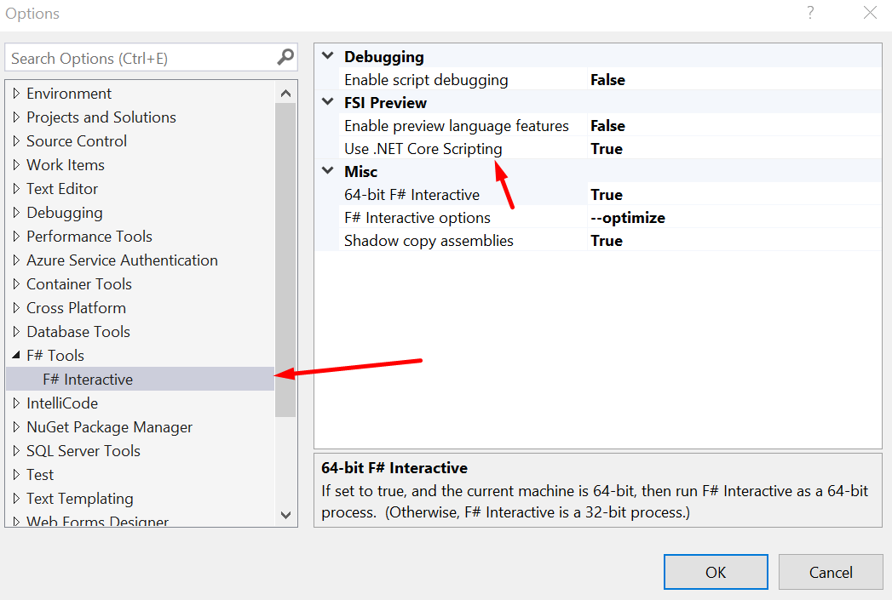

If you already had the F# Interactive window open, you'll need to close and re-open it. Now you can use Visual Studio for modern .NET scripting tasks and pull in package dependencies that aren't compatible with .NET Framework.

With this setting turned on, F# Interactive will use `dotnet fsi` to process F# code, and all F# scripts will behave as if they will run on .NET Core. This means a few things:

* Packages that require `netstandard2.1`, `netcoreapp3.1`, or `net5.0` will now work with `#r "nuget:..."` in F# scripts and F# Interactive
* The default set of libraries available to your scripts will be .NET 5-based, not .NET Framework-based
* Any scripts that require .NET Framework to run (e.g., depend on AppDomains) may not work when this is used

For now, you'll need to turn this on to get the behavior. In a future update, we will make this the default and require anyone who does .NET Framework-based scripting to flip the setting.

## New F# productivity features

Visual Studio 16.9 comes with a new kind of signature/parameter help mode and 14 new code fixes.

### Signature Help for F# function calls

IntelliSense has a feature called Signature Help (sometimes called Parameter Help) for when you're calling something and passing in a parameter. For F#, this has always been available for method calls whenever pressing the `(` key like so:

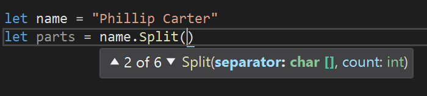

Now, Signature Help can trigger when you're calling an F# function! This is a long-requested feature by F# developers. F# function paramters are separated by spaces, so to trigger Signature Help, press the `space` key. Then you'll see a similar tooltip, but this time for the F# function signature:

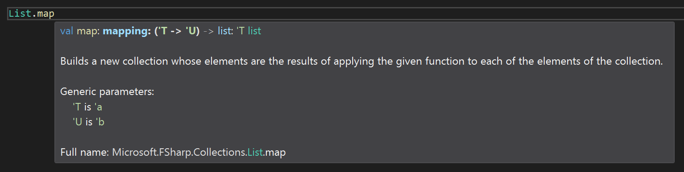

The feature is also aware of how the number of already-applied arguments can change depending on if you're using pipelines like `|>` or `||>`. Here's the same function in Signature Help, except it's being used in a pipeline where the last argument (the list) is already being applied in the pipeline:

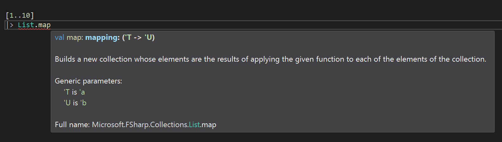

As you can see, the second argument to `List.map` is no longer in the tooltip. That's because it's already applied by the pipeline! Signature Help is pipeline-aware.

### 14 new code fixes

We identified several common scenarios where errors or warnings in routine F# coding could occur where those errors or warnings could actually be resolved by Visual Studio. Many of these are motivated by mistakes that newcomers to F# can make, but some are common even for F# experts. Let's go through them all!

#### Add missing `rec` keyword

If you're missing a `rec` keyword in a recursively-defined function, Visual Studio will offer to add it:

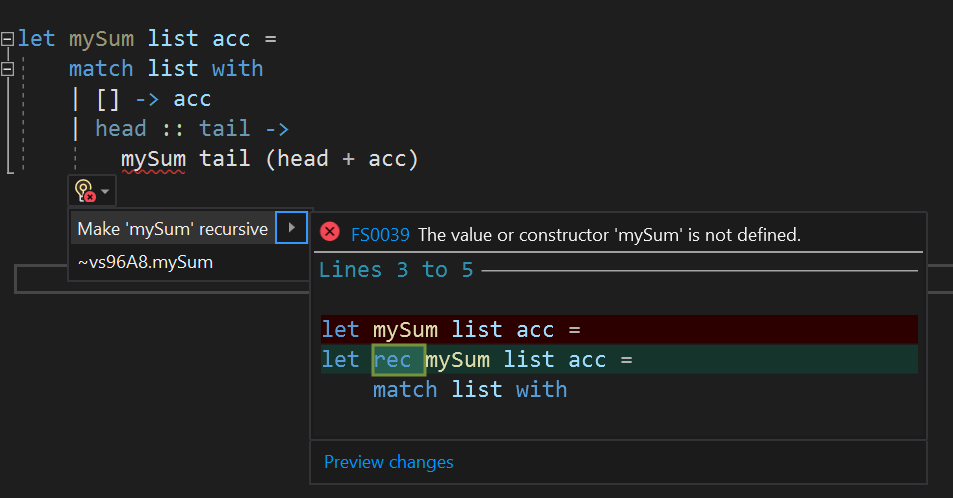

If you're defining a mutually recursive definition and missing the `rec` keyword, Visual Studio will offer to add it:

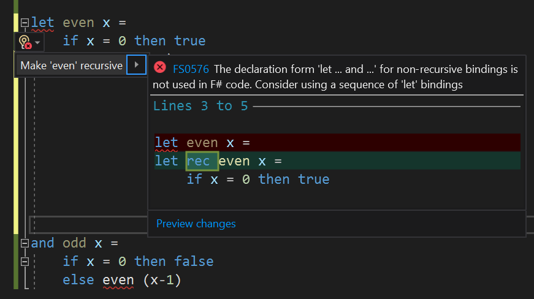

#### Convert C# lambda to F# lambda

If you're familiar with C# and accidentaly type in an C# lambda expression in F#, Visual Studio can detect it and rewrite it to work:

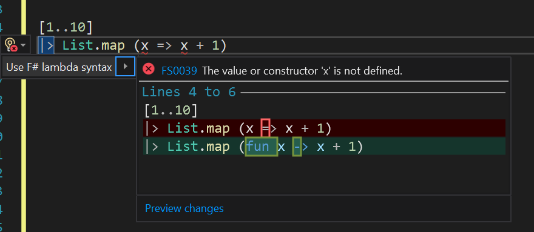

Thanks to [Chet Husk](https://github.com/baronfel) for the original implementation.

#### Add missing `fun` keyword in F# lambda

Another lambda fix, if you forget to type the `fun` keyword, Visual Studio can detect that and add it for you:


#### Remove incorrect use of `return` keyword

The `return` keyword has special meaning when used in [Computation Expressions](https://docs.microsoft.com/dotnet/fsharp/language-reference/computation-expressions) but is otherwise not used in F#. For beginners coming from other languages where you need to use the `return` keyword to indicate you're returning something from a function or method, this might be confusing at first. If you use it when you don't need to, Visual Studio will suggest to remove it:

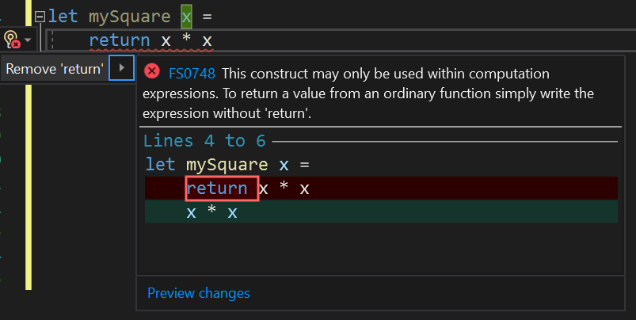

#### Convert record expression to anonymous record

Anonymous records use the `{|` and `|}` brace pair when you construct an instance. Named records don't have the `|` characters. In the case where you construct a record but it's not known, Visual Studio will suggest to use Anonymous Record syntax, since you might have forgotted the `|` parts of the syntax:

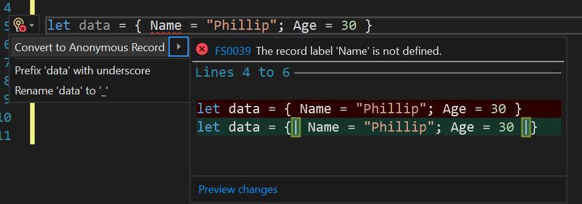

#### Use mutation syntax when a value is mutable

F# uses the `<-` symbol to mutate a value, but if you're coming from a language where `=` is used for assignment and mutation, you might have muscle memory to use `=`. In various circumstances this will emit a warning, and so Visual Studio can offer a code fix to use `<-`:

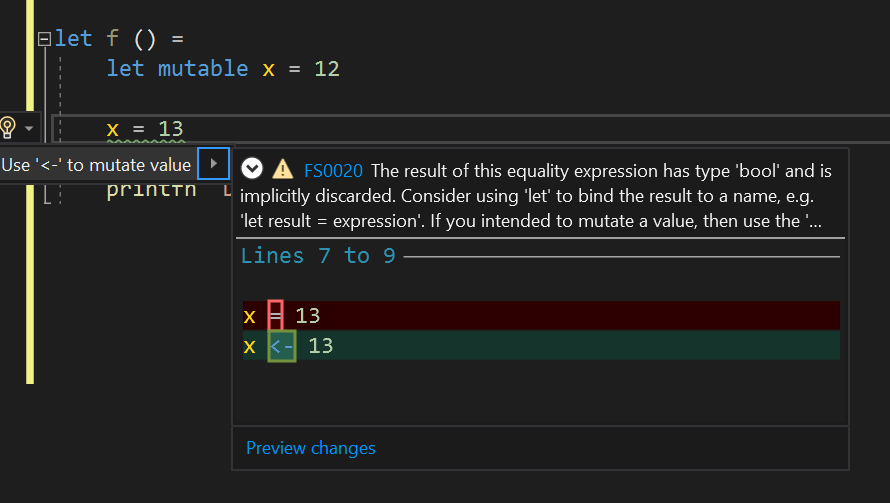

#### Make a declaration mutable

If you're using `<-` to mutate a value but it's not already declared as `mutable`, Visual Studio will offer to change its declaration:

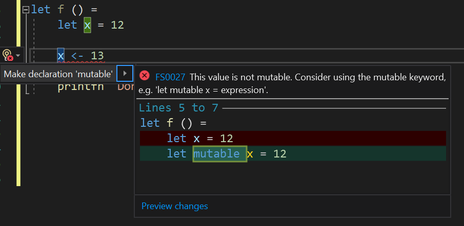

#### Use upcast instead of downcast

If you're downcasting a value that can't be downcast (either via the `:?>` operator or the `downcast` keyword), Visual Studio will suggest an upcast:

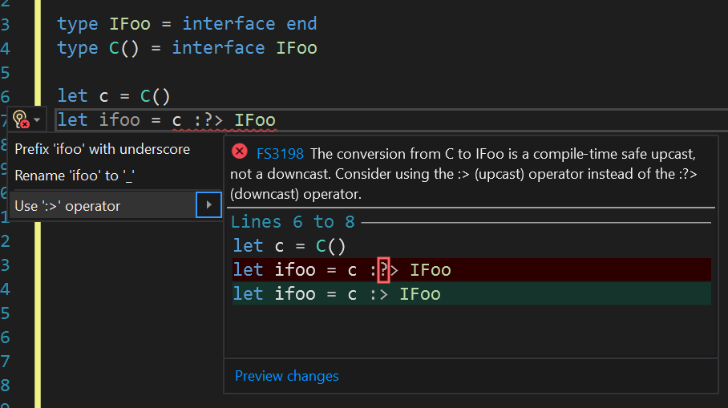

#### Add missing `=` to record, union, or type alias definition

If you're defining a record type, union type, or type alias and forget to type the `=` keyword, Visual Studio will suggest to add one:

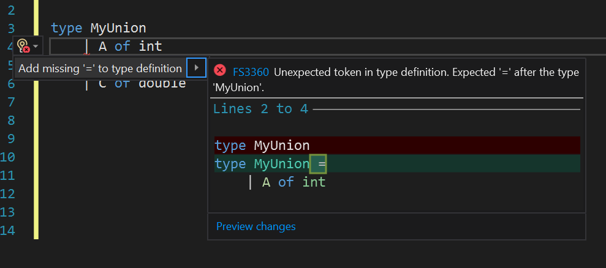

#### Use single `=` for equality check

F# uses a single `=` to perform an equality check. Many other languages use `==`. When you're using one for an equality check, Visual Studio will suggest to switch to `=` so your code can compile:

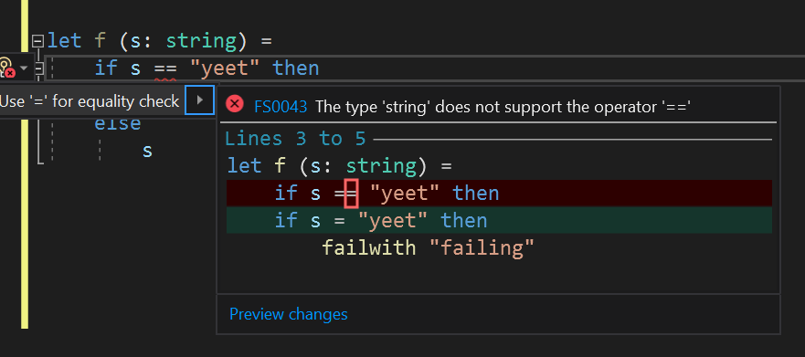

#### Use `not` to negate an expression

F# uses the `not` operator to negate a boolean expression. Many other languages use `!`. If you're using `!`, which has a different meaning in F#, Visual Studio will suggest to switch to `not`:

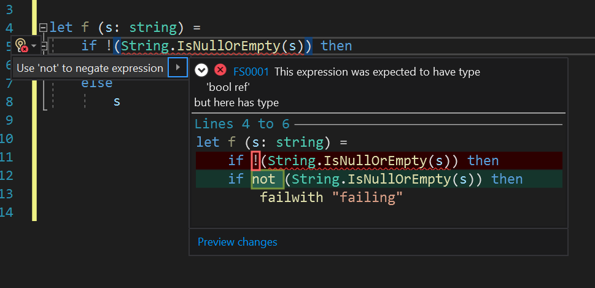

#### Wrap expression in parentheses

There are several scenarios where you need to use parentheses to disambiguate your code. Visual Studio can detect several of these and offer to wrap an expression in parentheses so that your code will compile:

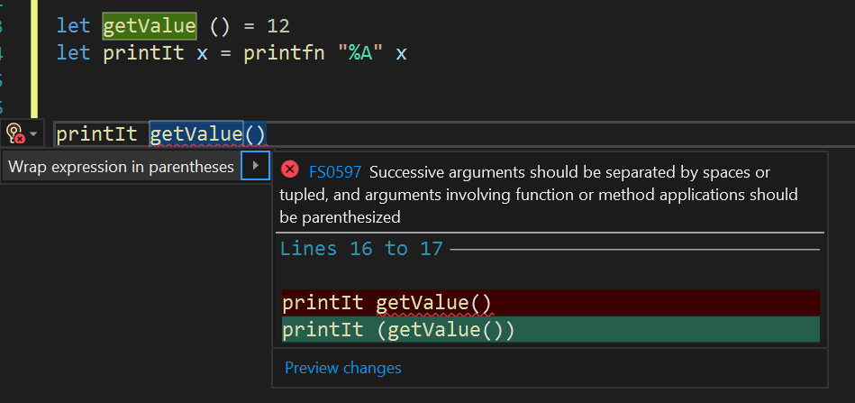

Not every possible case is covered yet. There are a surprisingly large amount of tricky ways that the error this is triggered off of can manifest. We hope to increase the scope of this code fix over time.

#### Fix ambiguity between subtraction and negation

In F#, the code `values.Length -1` and `values.Length - 1` are considered ambiguous. This is because the compiler isn't sure if you're trying to pass `-1` to `values.Length` or if you're subtracting `1` from `values.Length`. We found that people who start with F# can struggle with this issue, so Visual Studio will offer a code fix to change the code to subtraction:

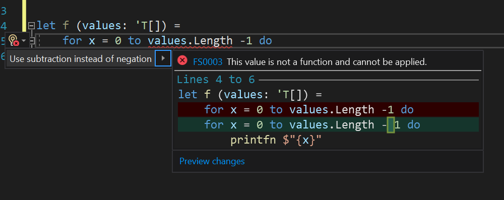

### Each of the 14 code fixes are also in Visual Studio Code

Thanks to [Chet Husk](https://github.com/baronfel), the [Ionide plugin for Visual Studio Code](https://marketplace.visualstudio.com/items?itemName=Ionide.Ionide-fsharp) (the best way to write F# code in Visual Studio Code) has every one of these code fixes.

## Tooling performance and responsiveness improvements

For the past several Visual Studio releases, we've been chipping away at F# tooling performance for large solutions. This release is no different!

### Improved responsiveness for most IDE features

This release features an adjustment to the F# language service. To summarize, the F# language service distinguishes between two kinds of requests:

1. A request for data about the structure (syntax) of F# code
2. A request for data about the meaning (semantics) of F# code

The first kind of request doesn't rely on the F# typechecker, and for over two years now these requests have been free-threaded. That is, if a background thread was busy typechecking user code, it can just use a different background thread to get a parse tree and calculate some information based on that data.

The second kind of request is serial because it relies on the F# typechecker. Because F# uses type inference, changes to your source code could impact the types of anything else that comes after it throughout your entire project or solution. For example, adding a new case to a Union Type or changing the output type of a highly-used function can have downstream effects across your entire codebase. A consequence of this behavior is that F# tooling features that work with typechecked data are impacted by the F# compiler needing to typecheck things.

However, in the large majority of cases, changing the types of things doesn't actually change everything downstream! And as it turns out, features like getting a tooltip to inspect the signature of a function are delayed when there would be no material change to the contents of the tooltip. In light of this, we changed how these requests for tooling features are processed by the F# language service:

1. If there are up to date caches of typecheck info to use, just use the data there and don't wait for a background typecheck operation
2. If there are no up to date caches available, perform a typecheck operation
3. If the request comes from a type provider requesting to update its types, this remains serailized

The result is increased responsiveness for tooltips, IntelliSense, and other features when working in a large codebase. For smaller codebases, things were likely already fairly responsive and so you might not notice a whole lot. If you are using Type Providers, then things will still behave as before.

### Big performance gains for codebases with F# signature files

[F# signature files](https://docs.microsoft.com/dotnet/fsharp/language-reference/signature-files) are files that define a public API surface area that a backing implementation file implements. They can be helpful in "locking down" an API so that consumers can only see additional things if they are added to the signature file.

If you're unfamiliar with them, here's an example of what a signature file and implementation file pair can look like:

**mymath.fsi:**

```fsharp
module MyMath

/// Adds two numbers, x and y.
val add2: x: int -> y: int -> int
```

**mymath.fs:**

```fsharp
module MyMath

let add2 x y = x + y
```

This is a highly simplified example, but it demonstrates how the _signature_ of the `add2` function is explicitly represented in a file.

If you are working in a large codebase, we **highly recommend** creating signature files (`.fsi`) for each of your implementation files (`.fs`). This will ensure that APIs exposed throughout your codebase have the shape you intend them to have. And starting with Visual Studio 16.9, there are two major performance improvements when using them.

First, we apply an optimization that goes "up" a dependency heirarchy. Consider the following project order:

```text
Project1
|__file1.fsi
|__file1.fs
|__file2.fsi
|__file3.fs
```

If you are working in `file3.fs`, so long as the signature files `file1.fsi` and `file2.fsi` are unchanged, the F# compiler will re-use the typecheck information it has about them. This is because the constructs they make available to `file3.fs` via their signatures are unchanged, so there is no need to typecheck the implementation files that back them. As a result, the F# language service will spend a lot less time typechecking things, making any IDE features that rely on typecheck tools faster.

Secondly, now consider a scenario where you are working in `file1.fs`. If you edit code there but you don't make any updates to `file1.fsi`, then the only file that the compiler will typecheck is `file1.fs`. This is because the signature hasn't changed. The rest of the project will still be considered up to date. As a result, the IDE will spend a lot less time typechecking things "down" the dependency heirarchy. In other words, it's less work typechecking and more work processing typecheck data for IDE features that use it!

The [F# codebase](https://github.com/dotnet/fsharp) makes use of signature files mostly in the `FSharp.Compiler.Service` project, which is an enormous project with over 100k lines of F# code and the difference with these changes is significant for us. We hope you'll notice improvements too!

In the future, we're going to look into ways to make it easier to generate signature files from existing implementation files within Visual Studio.

## Core compiler improvements

Finally, the Visual Studio 16.9 release comes with several compiler improvements that can help your code editing experience.

### Warnings for incorrect XML documentation files are turned on by default

In F# 5, we introduced a new warning that validated XML documentation:

* Checks for any malformed tags
* Checks that parameter names in the XML doc match the parameter names in code
* Checks that XML docs don't refer to a parameter that is missing in a function or method signature

For example, here's a malformed XMl documentation comment with a closing tag that's missing the `/`:

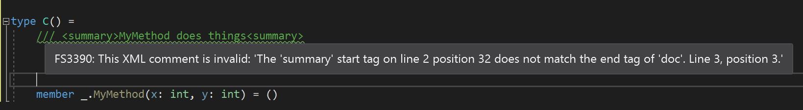

And here's an example of emitting warnings for incorrect parameter documentation:

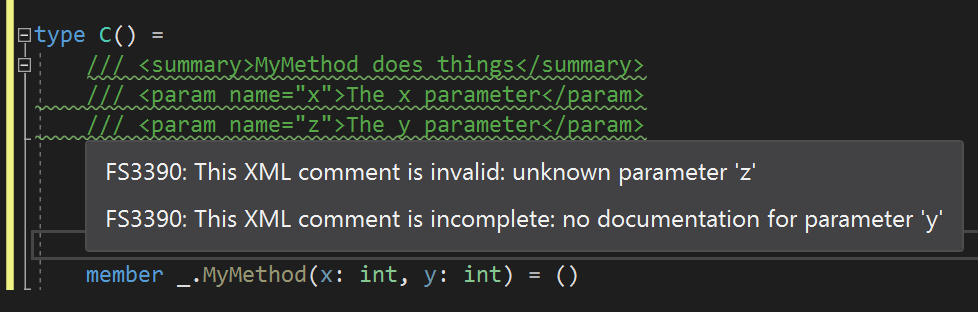

We've gotten feedback from library authors that this warning was very helpful to them, so we turned it on by default.

### Warnings for mismatched parameter names between signature and implementation files

We also turned on another warning to ensure that parameter names in signature files and implementation files are correct. Consider the following signature:

```fsharp
val myFunction: x: int -> y: int -> int
```

If the backing implementation file has an implementation for `myFunction` doesn't define `x` and `y` as its parameter names, the F# compiler will emit a warning.

### Improved runtime performance for code making heavy use of closures

Consider the following F# code:

```fsharp
let mutable a = 0
let mutable res = 0

let f () = a <- a + 1; (fun x -> x + 1)

let g() = 
   for i in 0 .. 10000 do
      for j in 0 .. i do
        res <- f() res

g()
```

This code will now run approximately twice as fast as before. The reason is because the F# compiler used to reallocate certain kinds of closures at runtime each time they were invoked. The compiler will now avoid doing that in most cases.

## Looking forward

There's more tooling and compiler improvements we're looking to invest in. Some concrete tooling improvements we're looking into already include:

* Showing decompiled sources when you invoke Go to Definition on a construct not in your codebase
* Support for Inline Type Hints when pressing a key command
* Support for Inline Parameter Name Hints when pressing a key command
* Improved F# Signature File generation from within Visual Studio
* Support loading packages that depend on framework references in F# Interactive

We're also planning out what the next version of the F# language will include to coincide with the .NET 6 release. We hope to have some exciting things to share in the coming months.

Stay tuned, and happy F# coding!
