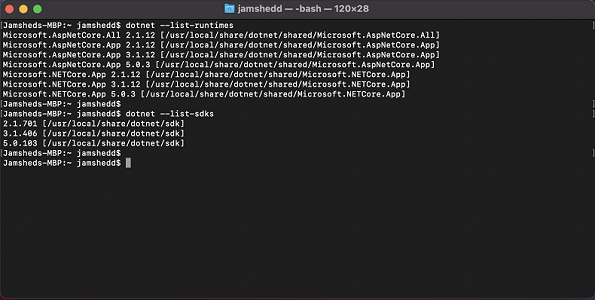
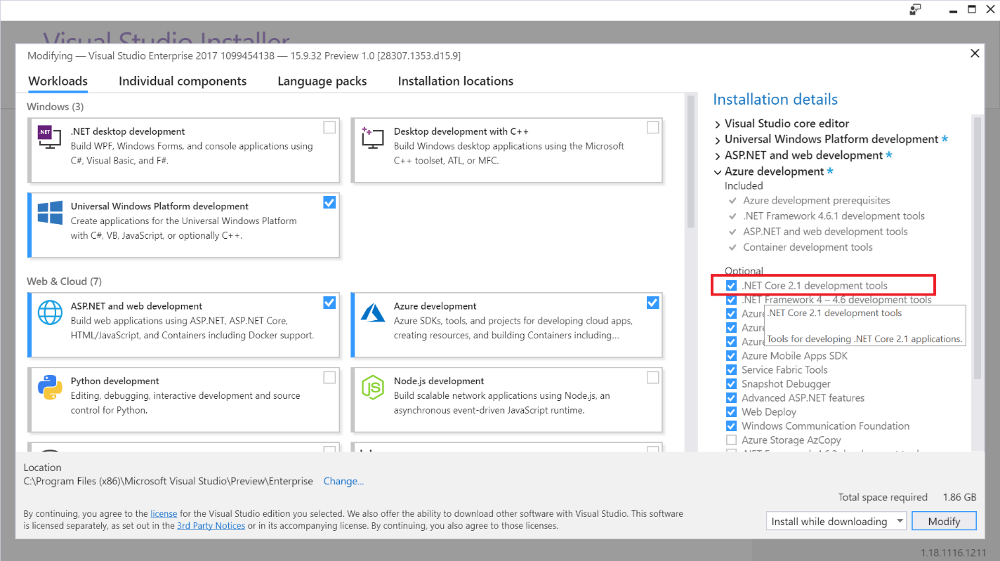

.NET Core 2.1 will be reaching end of support on August 21, 2021. After this date, Microsoft will no longer provide updates (which includes security fixes) or technical support for this version. You'll need to update the version of .NET Core you’re using to a supported version (.NET Core 3.1 or .NET 5.0) before this date in order to continue to receive updates. 

## Support Policy

.NET Core 2.1 is a Long Term Support (LTS) release and therefore supported for 3 years, or 1 year after the next LTS release ships whichever is longer. .NET Core 2.1 shipped May 30, 2018 and was [declared an LTS release with the 2.1.3 update in August 2018](https://devblogs.microsoft.com/dotnet/net-core-august-2018-update/). The 3-year lifecycle for the 2.1 release will come to an end on August 21, 2021.

When .NET Core 2.1 reaches end of support, applications that use this version will continue to run. That said, we won't be issuing security updates for .NET Core 2.1 starting September 2021 when we issue these security updates for .NET Core 3.1 and .NET 5.0. This means that if a computer has .NET Core 2.1 installed, it may be potentially unsecure. Additionally, if you run into any issue and need technical support, we may not be able to help you.

## Update your application 

If you're an end-user, we recommend you reach out to the vendor for your software to confirm whether an updated version of the software is needed and available. The remainder of this post is applicable to software vendors/developers.

If your application uses NET Core 2.1, we strongly recommend you migrate your application to a supported version - .NET 3.1 or later. You can download these versions from the [.NET website](https://dotnet.microsoft.com/download/dotnet). 

### Upgrading to .NET Core 3.1
* Open the project file (the *.csproj, *.vbproj, or *.fsproj file).
* Change the [target framework](https://docs.microsoft.com/dotnet/standard/frameworks) value from netcoreapp2.1 to netcoreapp3.1. The target framework is defined by the `<TargetFramework>` or `<TargetFrameworks>` element.
* For example, change `<TargetFramework>netcoreapp2.1</TargetFramework>` to `<TargetFramework>netcoreapp3.1</TargetFramework>`.

## Update your development environment
In addition to the software you ship to your customers, the computer you use for development may have .NET Core 2.1 installed - either standalone, or installed by Visual Studio. 

You can check for stand-alone installations of .NET Core 2.1 from the command line. On a Windows computer, open a Command Prompt and go to %ProgramFiles%\dotnet folder. On macOS or Linux, open a terminal window.  

Then type the following command: `dotnet --list-runtimes`

If you use Visual Studio 2017 15.9 then based on the workloads installed, you may also have .NET Core 2.1 installed as a required component of Visual Studio and you need to be aware of some relevant changes that are coming.

Starting with the Visual Studio 2017 15.9.34 servicing update for March 2021, the .NET Core 2.1 component in Visual Studio will be changed from _**required**_ to _**recommended**_. Once .NET Core 2.1 reaches end of support, Visual Studio 2017 15.9 will be updated to make the .NET Core 2.1 component _**optional**_. This means that these workloads in Visual Studio may be installed without installing .NET Core 2.1. Note that existing installations won't be affected and if the workload and component were previously installed, they will remain installed until the component or workload is unselected in Visual Studio setup. While it will be possible for you to re-select this optional component in Visual Studio and re-install this, we strongly recommend you use .NET Core 3.1 or .NET 5.0 with Visual Studio 2019 to build apps that run on a supported .NET Core runtime.

Note: the .NET Core cross platform and Mobile development workloads won't be changed and the .NET Core 2.1 component remains as required because these workloads can't be used without .NET Core 2.1. Instead, the entire workload will be marked out of support.

Note: one side effect of installing Visual Studio 2017 without the .NET Core 2.1 component is that if you’re loading a Visual Studio extension that previously leveraged the .NET Core 2.1 runtime installed by one of the workloads and the .NET Core 2.1 component is now optional, the extension may no longer load because the .NET Core 2.1 runtime isn't present anymore.

## Useful Links

* [.NET downloads](https://dotnet.microsoft.com/download/dotnet)
* [.NET Core Compatibility](https://docs.microsoft.com/dotnet/core/compatibility/)
* [.NET Core Deployment](https://docs.microsoft.com/dotnet/core/deploying/)
* [.NET Core Support Policy](https://dotnet.microsoft.com/platform/support/policy/dotnet-core)

## Closing

.NET Core 2.1 will be reaching end of support on August 21, 2021 and after this date we will no longer provide updates including security fixes, or technical support for this version. We strongly recommend you migrate your applications to [.NET Core 3.1](https://devblogs.microsoft.com/dotnet/announcing-net-core-3-1/) or later before this date. 
