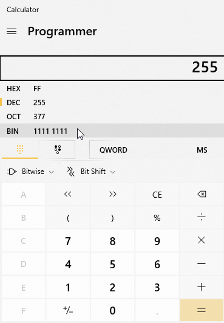
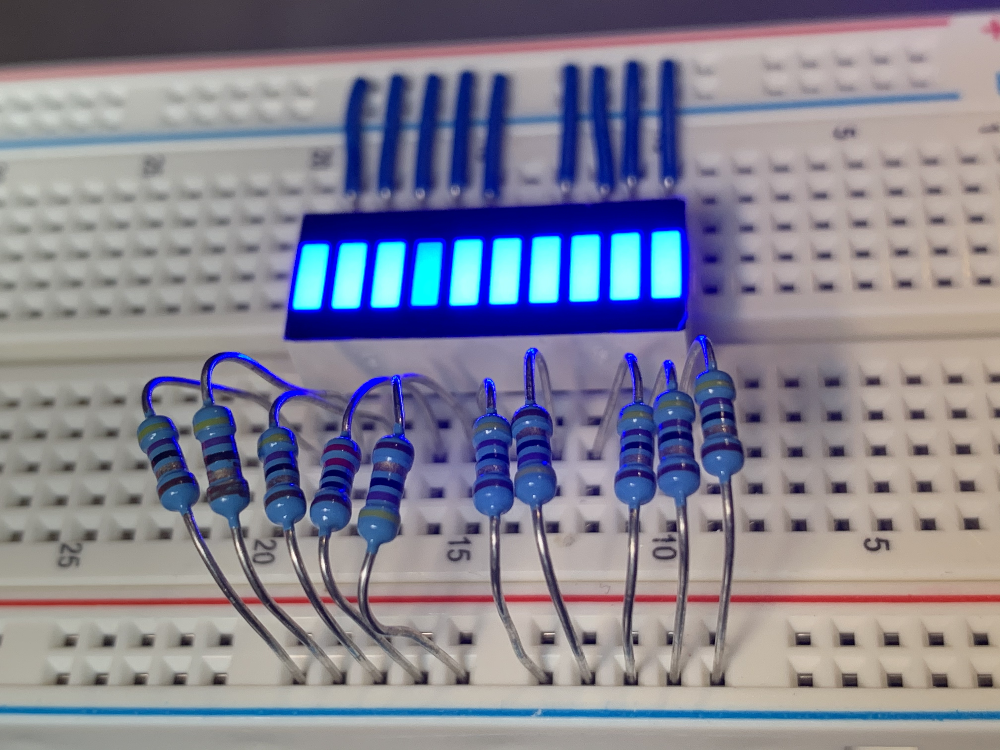
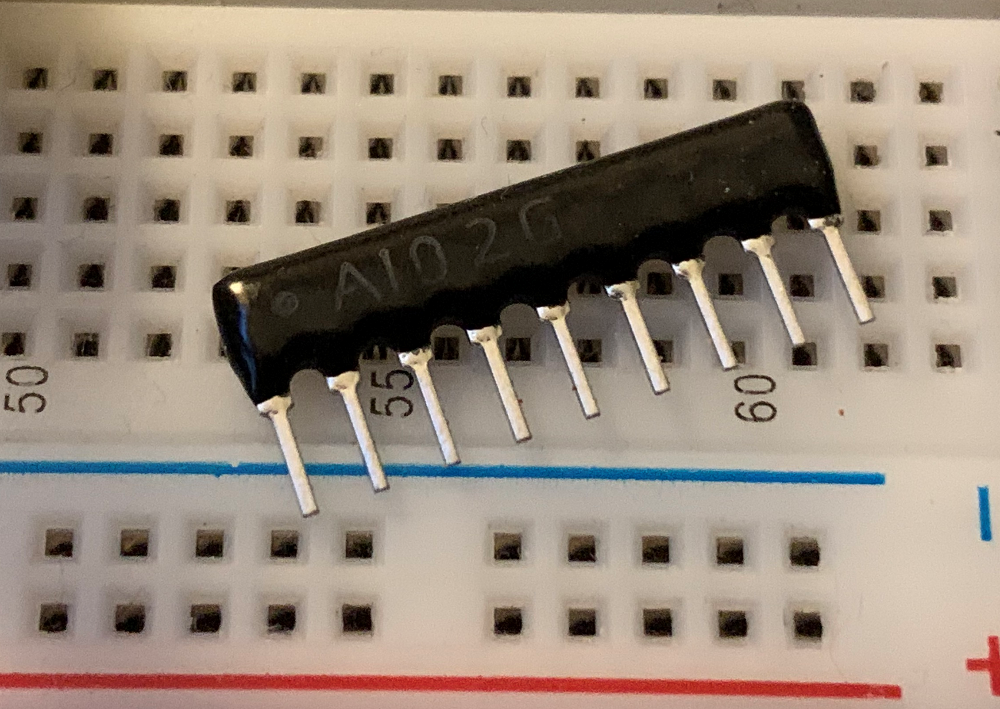
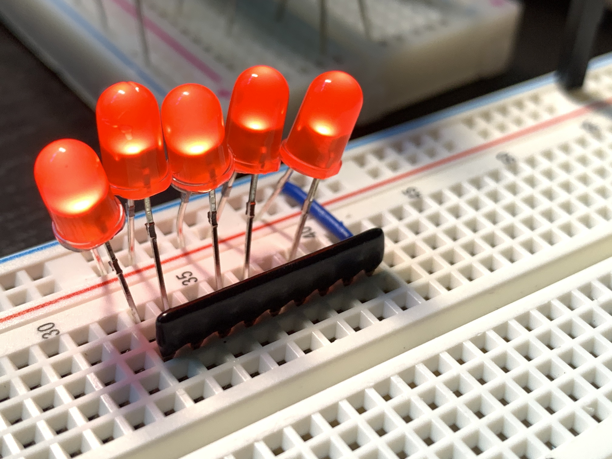
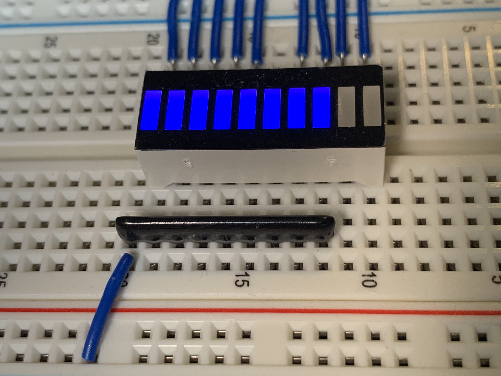
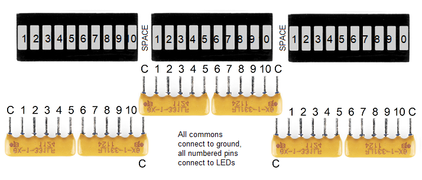
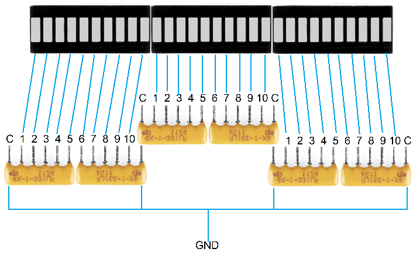
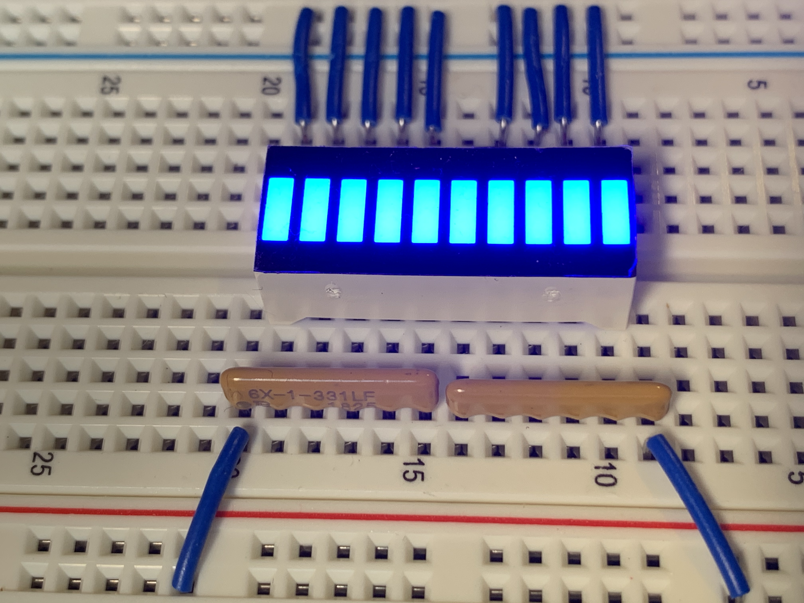
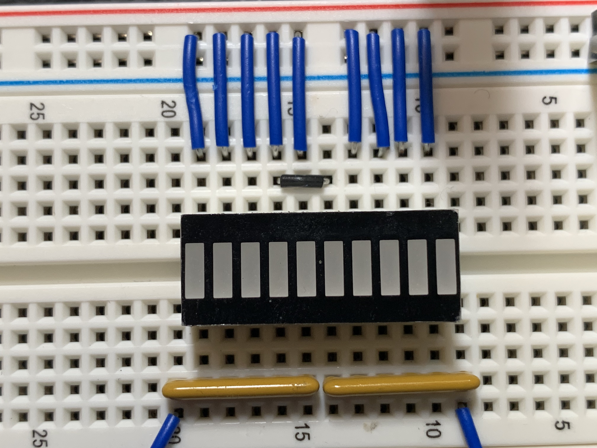

# Blinking lots of LEDs with Raspberry Pi

The [Raspberry Pi](https://www.raspberrypi.org/) is one of the world's most successful hardware projects. A lot of people have one, but not everyone knows what to do with it. You can use it as a [desktop computer](https://www.raspberrypi.org/products/raspberry-pi-400/) or the [brain of an electronic circuit](https://learn.adafruit.com/category/raspberry-pi). I use the Raspberry Pi to blink LEDs -- with C# and [.NET GPIO APIs](https://docs.microsoft.com/dotnet/iot/) -- in weird and wonderful ways. It's straightforward to blink a single LED, but it gets cumbersome to wire and control multiple LEDs once you get past half a dozen. In this post, I'll show you how you can control large numbers of LEDs easily, with a mix of code and hardware.

There are lots of ways to control multiple LEDs. Once you get past the basics, you'll realize that you need some form of [multiplexing](https://en.wikipedia.org/wiki/Multiplexing) system. [Shift registers](https://en.wikipedia.org/wiki/Shift_register) are a commonly used integrated circuit (IC) for multiplexing. They are very simple, effective, and cheap. This post describes various LED multiplexing systems. It focuses on the [Raspberry Pi](https://www.raspberrypi.org/blog/) and C#, but is intended to be useful for a broader audience. The same/similar code and techniques should work on other devices that expose GPIO or SPI pins or with other programming languages. Feel free to port this code to other uses if you'd like.

Need an animated gif here.

## LED APIs

I started this project -- about a year ago -- because I couldn't find a [device binding](https://github.com/dotnet/iot/blob/main/src/devices/README.md) for the [device I wanted to use](https://www.ti.com/product/SN74HC595) to control LEDs. I started by porting the code in [Driving LED’s using a 74HC595 Shift Resistor Circuit](http://www.csharp.nl/2015/06/14/driving-leds-using-a-74hc595-shift-resistor-circuit/) to the [.NET GPIO APIs](https://docs.microsoft.com/dotnet/iot/). I next learned how shift registers worked (thanks [Kevin](https://www.youtube.com/watch?v=6fVbJbNPrEU) and [Julian](https://www.youtube.com/watch?v=G1SzTGZ2l1c)) and was able to build useful device bindings for anyone who wants to use them.

I eventually developed two goals:

- Create high-level LED multiplexing APIs for various techniques and hardware.
- Create a common abstraction across those APIs to enable programming LEDs independent of the way the LEDs are addressed, and physically wired.

The post covers a lot of techniques, hardware and lower-level details. At the end of the post, I tie all the experiences together with an API -- the common abstraction -- that works for everything you'll read about in the post. I though I'd start by introducing you to that `IWriteableSegment` API so that you have a sense of the surprise at the end of the post.

The following code demonstrates controlling LEDs with [`IWriteableSegment`](https://github.com/dotnet/iot/blob/main/src/devices/IWriteableSegment/README.md).

```csharp
IWriteableSegment segment = // acquired somehow

// turn on all LEDs
for (int i = 0; i < segment.Length; i++>)
{
    segment.Write(i, 1);
}

// similar to Thread.Sleep(1000)
segment.Display(1000);

// turn on/off every other LED
// writes '0' for even LEDs and '1' for odd ones, using modulus operator
for (int i = 0; i < segment.Length; i++>)
{
    segment.Write(i, i % 2);
}

segment.Display(1000);

// turn off all LEDs
for (int i = 0; i < segment.Length; i++>)
{
    segment.Write(i, 0);
}
```

I'll skip for the moment how you acquire an `IWriteableSegment`. It's not hard, but you'll have to read the rest of the post to learn how.

I'll now give you an in-depth description of various ways to control LEDs. The post covers controlling LEDs with the following devices.

* [Generic shift register](https://github.com/dotnet/iot/blob/main/src/devices/ShiftRegister/README.md)
* [SN74HC595 shift register](https://github.com/dotnet/iot/blob/main/src/devices/Sn74hc595/README.md)
* [MBI5027 shift register](https://github.com/dotnet/iot/blob/main/src/devices/Mbi5027/README.md)
* [Charlieplexing](https://github.com/dotnet/iot/blob/main/src/devices/Charlieplex/README.md)

Each one of these devices -- via a [device binding](https://github.com/dotnet/iot/blob/main/src/devices/README.md) -- implements the [IWriteableSegment API](https://github.com/dotnet/iot/blob/main/src/devices/IWriteableSegment/README.md), which means that you can control them with code like you see in the example above. Each of these bindings is built on top of the [.NET GPIO (and friends) APIs](https://docs.microsoft.com/dotnet/iot/), which are distributed in the [System.Device.Gpio](https://www.nuget.org/packages/System.Device.Gpio/) package. The bindings (including the `IWriteableSegment` interface) are distributed in the [Iot.Device.Binding](https://www.nuget.org/packages/Iot.Device.Bindings/) package. All of the code is available in the [dotnet/iot repo](https://github.com/dotnet/iot/).

The [Iot.Device.Binding](https://www.nuget.org/packages/Iot.Device.Bindings/) package is maintained and supported by the community. It's a [community project](https://github.com/dotnet/iot/blob/main/src/devices/README.md) run out of the dotnet/iot repo. It's grown to nearly one hundred bindings that enable access to lots of scenarios.

## Tips

You will need some hardware to run the samples in this post. My favorite shops for buying electronic kit are: [Adafruit](https://www.adafruit.com/), [Digi-key](https://www.digikey.com/), and [SparkFun](https://www.sparkfun.com/). Here are some good options to start out with: [Raspberry Pi](https://www.adafruit.com/product/4292), a [breadboard](https://learn.adafruit.com/breadboards-for-beginners/breadboards), [resistors](https://www.adafruit.com/product/2780), and [LEDs](https://www.adafruit.com/product/4203), or just get a [complete kit](https://www.sparkfun.com/products/16388) or a [smaller kit](https://www.sparkfun.com/products/15754).

I primarily use [Raspberry Pi OS](https://www.raspberrypi.org/software/operating-systems/), but any Linux Arm32 or Arm64 build should work. Note: .NET 5+ no longer supports Windows Arm32.

The trick with driving any electrical circuit with code is ensuring that the pins you use in the code match what's on the breadboard. I've included [fritzing](https://fritzing.org/) diagrams throughout the post, that show you the matching circuits for the code. I use [pinout.xyz](https://pinout.xyz/) to double check pin numbers, with the handy visualized Raspberry Pi layout. I also have a physical [GPIO reference](https://www.adafruit.com/product/2263) hanging on [my keychain](https://twitter.com/runfaster2000/status/1100641905375768577) that I'll use to pick pins that are close together.

Electronics programming with a Raspberry Pi can be a lot of fun. None of what you are going to read about is hard. Patience and a methodical approach will serve you well. Fortunately, [breadboards](https://learn.adafruit.com/breadboards-for-beginners/introduction) make it very easy to fix your mistakes. I recommend you use incremental progress as a technique to limit frustration. For example, if I'm setting up a circuit with 8 or 16 LEDs, I usually start with getting 2 LEDs working first, and then repeatedly double after that. You'll also find that the compiler and debugger don't help much for setting up an electronic circuit correctly. I've relied a lot on logging while working on this project. A big part of the appeal of electronics programming, at least for me, is appreciating and embracing what's different about it, while at the same time relying on skills I already have to get my application built.

I love working with the Raspberry Pi. I exclusively use the [Pi headlessly](https://www.raspberrypi.org/documentation/remote-access/) (without a screen). I've found it is the most pleasant and efficient way to interact with the device. Many people use a screen and a keyboard and that's fine. That model works best if you are doing development on the Pi. I prefer to do development on a high-powered desktop or laptop, and then deploy to the Pi and launch remotely.

## Blinking an LED

Let's start with [controlling just one LED](https://github.com/dotnet/iot/tree/main/samples/led-blink). It is a good place to start to get your bearings and learn the fundamentals.

Need an animated gif here.

The [following code](https://github.com/dotnet/iot/blob/main/samples/led-blink/Program.cs) lights an LED for 1000ms and then leaves it dim for 200ms, by raising and dropping the power on pin 18, from high to low. It does this repeatedly and forever until you terminate the program (with `CTRL-c`).

```csharp
int pin = 18;
int lightTime = 1000;
int dimTime = 200;

using GpioController controller = new();
controller.OpenPin(pin, PinMode.Output);

while (true)
{
    controller.Write(pin, PinValue.High);
    Thread.Sleep(lightTime);
    controller.Write(pin, PinValue.Low);
    Thread.Sleep(dimTime);
}
```

You might ask why the program is using `Thread.Sleep` instead of the newer `Task.Delay`. This is program is single threaded with no contention with other work. `Task` is unnecessary and would complicate the program (both the code, and what the code does at runtime).

Let's look at the [circuit](https://github.com/dotnet/iot/blob/main/samples/led-blink/rpi-led.fzz) that needs to be configured on a breadboard to match the code.


Starting from left to right:

- A ground pin on the Pi is connected by the short wire to the breadboard ground rail (that's the green highlighted horizontal line just below the solid blue horizontal line).
- Pin 18 is connected via the longer wired to a terminal strip (an electrically connected numbered line of 5 holes, marked `A` through `E`).
- The anode leg (the longer, power leg) is connected to the same terminal strip as pin 18.
- The cathode leg (the shorter, ground leg) is connected to a different terminal strip, the same one as a resistor.
- The resistor (mine is 47 Ω) is connected to the the ground rail.

Power flows from the Pi, through the load (the LED), and back to ground on the Pi, creating a complete circuit.

When pin 18 is outputting power, the LED will be lit. When pin 18 is not outputting power, the LED will be dim. The brightness of the LED is controlled by the resistor. The higher the resistance (higher ohms), the more dim the LED will be. If no resistor is used (and the LED is connected to ground), the LED will be fully lit and could be damaged. You should always use a resistor. If you disconnect power or ground, the LED will not work, as the circuit will be broken.

I pick pins (like pin 18) based on the convenience of using them and in creating diagrams in the Fritzing program. As you work through this post, my pin selections may start to make sense. For example, the narration of the circuit above would probably make more sense if the ground connection was right-most. I always connect ground with the left-most ground pin to keep it out of the way of the control pins that are the focus of the circuit. The ground is very important, but it is passive, and there are no APIs to control it. It just "is".

Here are some similar examples of blinking an LED with other devices and programming languages.

- [Blinking an LED with Arduino](https://learn.adafruit.com/adafruit-arduino-lesson-2-leds/blinking-the-led)
- [Blinking an LED with Python](https://learn.adafruit.com/blinking-an-led-with-beaglebone-black/writing-a-program)

## Blinking multiple LEDs

The next step is blinking multiple LEDS, as an extension of the prior example. That's not the pattern we're after with this post, but a baseline for comparison.

Need an animated gif here.

The code above can be be adapted to control multiple directly-connected LEDs. The following example controls three LEDs, but can easily be extended to control more. The code itself isn't challenging. It's the circuit wiring that starts to get problematic. There are two key problems: you will eventually run out of pins, and the pins are not always located where you want them (not every pin does the same thing; they are not all fungible). That's why we're shortly going to switch to talking about multiplexing.


```csharp
int lightTime = 1000;
int dimTime = 200;
int[] pins = new int[] {18, 24, 25};

using GpioController controller = new();

// configure pins
foreach (int pin in pins)
{
    controller.OpenPin(pin, PinMode.Output);
    controller.Write(pin, 0);
}

// enable program to be safely terminated via CTRL-c 
Console.CancelKeyPress += (s, e) =>
{
    controller.Dispose();
};

// turn LEDs on and off
int index = 0;
while (true)
{
    int pin = pins[index];
    controller.Write(pin, PinValue.High);
    Thread.Sleep(lightTime);

    Console.WriteLine($"Dim pin {pin} for {dimTime}ms");
    Thread.Sleep(dimTime);
    index++;

    if (index >= pins.Length)
    {
        index = 0;
    }
}
```

This code is almost identical to the previous example. Instead of operating on a single integer, it operates on an array of integers that specifies the pins that  connected to LEDs. You can add or remove integers from the array and the code will continue to work correctly. I've also added a behavior for what happens when the program is terminated with `CTRL-C`, with the `Console.CancelKeyPress` event handler.  This handler is responsible for dimming all the LEDs before the program terminates. In the prior example, the LED is likely to stay lit when the program is terminated due to the lack of this handler. I skipped that in the first example to keep it as simple as possible.

Let's look at the [circuit](https://github.com/richlander/iot/blob/blinkyblinky/samples/led-blink-multiple/rpi-led-multiple.fzz) that needs to be configured on a breadboard to match the code.


The wiring is very similar to the prior example. Starting from left to right:

- A ground pin on the Pi is connected to the breadboard ground rail.
- Pin 18 is connected to a terminal strip .
- A resistor is connected from a subsequent terminal strip to the ground rail.
- An LED is connected to the same terminal strip as pin 18 by its anode leg, and to the same terminal strip as the following resistor by its cathode leg.
- Pin 24 is connected to a terminal strip .
- A resistor is connected from a subsequent terminal strip to the ground rail.
- An LED is connected to the same terminal strip as pin 24 by its anode leg, and to the same terminal strip as the following resistor by its cathode leg.
- Pin 25 is connected to a terminal strip .
- A resistor is connected from a subsequent terminal strip to the ground rail.
- An LED is connected to the same terminal strip as pin 25 by its anode leg, and to the same terminal strip as the following resistor by its cathode leg.

It's now time to look at the multiplexing options.

## Multiplexing

A multiplexer is a device or system that enables you to control multiple things with one thing. You can think of your USB hub or ethernet switch as a multiplexer. You connect one wire from your PC to your USB hub and then as many USB cables into the USB hub as it allows. This means that you only need a few USB connectors on your PC and don't need to feed all the USB cables to the back of your PC. In the case of LEDs, we want to use and control a large number of LEDs and use as few pins on the Pi as possible.

When you buy a USB camera or printer, you hook it up to a USB hub and expect it to just work. That's plug and play. Unfortunately, there is no plug and play for LEDs. With LEDs, you need to write code that understands the multiplexer you've chosen and the address scheme that it offers. This is where what looks like fun quickly turns into a chore. Instead, I wanted to provide a system that is more convenient, like an "LED hub".

There are lots of tutorials and posts that will explain how you can setup multiplexing solutions to control LEDs. I'll share a few that I like, from the Arduino world (almost the same as the Pi for controlling LEDs).

- [74HC595 Shift Register Usage](https://learn.adafruit.com/74hc595/usage)
- [Multiplexing With Arduino and the 74HC595](https://www.instructables.com/id/Multiplexing-with-Arduino-and-the-74HC595/)
- [LED Multiplexing 101: 6 and 16 RGB LEDs With Just an Arduino](https://www.instructables.com/LED-Multiplexing-101-6-and-16-RGB-LEDs-With-Just-a/)

These tutorials offer patterns at varying levels of complexity. There are two problems that many of the tutorials and blog posts I've read suffer from: the code patterns are low-level, and there are no common abstractions across multiplexing schemes.

The following sections describes multiplexing techniques that you can use to control multiple LEDs. Each one offers APIs that are specific to the technique (or IC). The post ends with a description of an interface -- with a consistent API and behavior -- that supports all of the multiplexing techniques discussed in this post. That means you can write code to control LEDs that is abstracted from low-level concerns.

## SN74HC595 shift register


[Shift registers](https://en.wikipedia.org/wiki/Shift_register) are ICs that have a certain number of electrical outputs that can be controlled electronically. They are perfectly suited for controlling LEDs. They typically offer controlling outputs in factors of 8. You'll read shortly about the SN74HC595, which has 8 outputs, and the MBI5027, which has 16. Shift registers can be daisy chained without the need to write special code. For example, four SN74HC595 chips can be daisy chained to control 32 LEDs.

The [SN74HC595](https://github.com/dotnet/iot/blob/main/src/devices/Sn74hc595/README.md) is probably the [most popular shift register](https://www.youtube.com/results?search_query=sn74hc595) used with the Raspberry Pi and Arduino, because it is easy to use and cheap to acquire. You can buy an [SN74HC595 for less than $1](https://www.sparkfun.com/products/13699).

Shift register outputs can be turned on or off in any combination, and can change state very quickly and (kindof) independently. The [SN74HC595](https://github.com/dotnet/iot/blob/main/src/devices/Sn74hc595/README.md) is called an "8-bit" shift register, not an "8 output" one since your code interacts with the shift register in terms of an 8-bit array. This 8-bit array -- called a "storage register" in the [SN74HC595 data sheet](https://www.ti.com/lit/ds/symlink/sn74hc595.pdf) -- has the behavior of a queue data structure. New values enter through the start of the array and exit at the end. Each value is a boolean datatype, with values of either `0` or `1`. This type of device is called a shift register because each time you add a value, the existing values shift one slot further into the queue and one value pops off the end (never to be heard from again). Probably many electronic devices you own have shift registers in them.

You can continue shifting data into the shift register all day long, but that has no effect. Once you are done shifting data in, with the configuration you want, you "latch" the data, which causes the outputs to change to match the values in the storage registers. If the storage register values are all high (`11111111`) when you latch, then all  outputs will be turned on. If the storage register values are all low (`00000000`), then all outputs will be tuned off. If every other value is high and all others are zeros (`01010101`), then every other output will be turned on and the others off. The separation of the storage register and the latch enables you to configure the storage register as desired and then publish its values as an atomic operation. This model avoids the LEDs displaying some interim configuration that you don't intend.

As part of this project, I wrote a [generic shift register binding](https://github.com/dotnet/iot/blob/main/src/devices/ShiftRegister/README.md), and specific ones as well, including for the [SN74HC595](https://github.com/dotnet/iot/blob/main/src/devices/Sn74hc595/README.md). The generic binding exposes functionality that is common to all shift registers. Each of the more specific bindings [derive from the generic shift register implementation](https://github.com/dotnet/iot/blob/0b7733e5580ad55fc80e76e0587740d95c5ea0c2/src/devices/Sn74hc595/Sn74hc595.cs#L14), and adds additional functionality. If you don't need the additional functionality, I recommend using the generic binding.

There are two important differences between the generic and the specific SN74HC595 bindings:

- The `ShiftRegister` binding is generic (and can be used to target multiple shift register models/kinds), so requires the number of outputs to target (in this case 8), while  the `Sn74hc595` binding is written specifically for the SN74HC595 so [targets 8 outputs by default](https://github.com/dotnet/iot/blob/0b7733e5580ad55fc80e76e0587740d95c5ea0c2/src/devices/Sn74hc595/Sn74hc595.cs#L26) since the SN74HC595 is an 8 output shift register.
- The `Sn74hc595` binding [exposes more functionality](https://github.com/dotnet/iot/blob/0b7733e5580ad55fc80e76e0587740d95c5ea0c2/src/devices/Sn74hc595/Sn74hc595.cs#L37-L51), which will be covered shortly. In their basic uses, the two bindings operate identically.

The [following samples](https://github.com/dotnet/iot/blob/main/samples/led-shift-register/Program.cs) do exactly the same thing. One uses the [generic shift register binding](https://github.com/dotnet/iot/blob/main/src/devices/ShiftRegister/samples/Program.cs) and the other the more specific [SN74HC595 binding](https://github.com/dotnet/iot/blob/main/src/devices/Sn74hc595/samples/Program.cs).

```csharp
ShiftRegister sr = new(ShiftRegisterPinMapping.Minimal, 8);

// Light up three of first four LEDs
sr.ShiftBit(1);
sr.ShiftBit(1);
sr.ShiftBit(0);
sr.ShiftBit(1);
sr.Latch();

// Display for 1s
Thread.Sleep(1000);

// Write to all 8 registers with a byte value
// ShiftByte latches data by default
sr.ShiftByte(0b_1000_1101);
```

The following sample demonstrates using the `Sn74hc595` binding.

```csharp
Sn74hc595 sr = new(Sn74hc595PinMapping.Minimal);

// Light up three of first four LEDs
sr.ShiftBit(1);
sr.ShiftBit(1);
sr.ShiftBit(0);
sr.ShiftBit(1);
sr.Latch();

// Display for 1s
Thread.Sleep(1000);

// Write to all 8 registers with a byte value
// ShiftByte latches data by default
sr.ShiftByte(0b_1000_1101);
```

The following animation shows the sample being run.

Need an animated gif here.

The example is intended to show lighting up 8 LEDs almost the same way with `ShiftBit` and `ShiftByte` APIs. The `ShiftBit` (and `Latch`) method calls light three of the first four LEDs. The `ShiftByte` call lights up the first four LEDs exactly the same way, and in addition lights up the eighth LED.

Imagine you have a horizontal line of eight connected LEDs. After the four calls to `ShiftBit` above, you will see the first four LEDs in the following lit/unlit configuration, left to right: `1011`. The outcome is the opposite order in which the code is written because the shift register behaves like a [first-in-first-out (FIFO) queue](https://en.wikipedia.org/wiki/Queue_(abstract_data_type)). `ShiftByte` works the same way. If you shift in `0b_1000_1101`, you will see the following lit/unlit configuration, left to right: `10110001`. The result is backwards. The `ShiftByte` [algorithm](https://github.com/dotnet/iot/blob/0b7733e5580ad55fc80e76e0587740d95c5ea0c2/src/devices/ShiftRegister/ShiftRegister.cs#L143-L152) starts from the most-significant byte (left-most) and ends with the least-significant byte (right-most).

The `ShiftByte` behavior might be unintuitive. It's really just a function of a byte meeting a bit queue. Both of these bindings [support](https://github.com/dotnet/iot/blob/0b7733e5580ad55fc80e76e0587740d95c5ea0c2/src/devices/ShiftRegister/ShiftRegister.cs#L57) the [Serial Peripheral Interface (SPI)](https://en.wikipedia.org/wiki/Serial_Peripheral_Interface). The behavior of an SPI hardware device [writing the byte](https://github.com/dotnet/iot/blob/main/src/System.Device.Gpio/System/Device/Spi/Devices/UnixSpiDevice.cs#L192-L203) to the shift register is the same, but defined in the hardware of the Raspberry Pi itself. It is important that the behavior of the binding matches when using either SPI or GPIO interfaces.

If you want to update all 8 bits at once, it can be easier to visualize the final result using [binary literals](https://docs.microsoft.com/dotnet/csharp/language-reference/proposals/csharp-7.0/binary-literals) (like `0b_1010_1010`) with the `ShiftByte` API (as you see in my example). You can also write integers. I often use the integers `0` and `255`, which are the same as `ShiftByte(0b_0000_0000)` (all unlit) and `ShiftByte(0b_1111_1111)` (all lit), respectively. If you want to update LEDs individually, one at time, then `ShiftBit` is the best choice.

If you are not familiar with bits and bytes and how they relate to integers, check out the binary value of `255` in Programmer mode in Calculator. You can see that `255` is the same as one byte with all bits high (`1`).



Let's zoom back out again, and recall the initial samples at the start of the post. The first difference you might notice is that pin assignments are no longer specified in the application code, but that a pin mapping is used instead ([ShiftRegisterPinMapping](https://github.com/dotnet/iot/blob/main/src/devices/ShiftRegister/ShiftRegisterPinMapping.cs), [Sn74hc595PinMapping](https://github.com/dotnet/iot/blob/main/src/devices/Sn74hc595/Sn74hc595PinMapping.cs)). Shift registers need to be connected with at least three pins that have specific roles. That's all encapsulated with the pin mapping. The type provides a couple standard mappings to make the code terse, as you see above. You can develop your own mappings, either stored in code or in a configuration file.

The `Minimal` mapping isn't enough to enable the shift register to function correctly. The SN74HC595 has `OE` and `SRCLR` pins. When using the `Minimal` mapping, the `OE` pin should be wired to ground and `SRCLR` wired high. The `Complete` mapping, for example, assigns a Raspberry Pi pin for `OE` and `SRLCR`, and does the right thing with them. Put another way, you need to assign a Raspberry Pi pin for shift register pins like `OE` and `SRCLR` if you want to control their behavior as part of your program. If you are happy with their default behavior, you don't have to assign a Raspberry Pi pin, but you still have to wire them on your breadboard to make the shift register (electrically) happy.

I've also switched from using individual LEDs to an [LED bar graph](https://www.adafruit.com/product/1815). A bar graph is easy to use, but individual LEDs will work just fine.

The following [diagram](https://github.com/richlander/iot/blob/blinkyblinky/src/devices/Sn74hc595/sn74hc595-minimal-led-bar-graph.fzz) demonstrates the required wiring for using the SN74HC595 with the `Minimal` mapping.


If you are using SPI, you don't have to provide a pin mapping. It is [pre-defined](https://pinout.xyz/pinout/spi), and is configurable by the SPI address you use. You do, however, need to ensure that SPI is enabled on your Pi, which you can control with [raspi-config](https://www.raspberrypi.org/documentation/configuration/raspi-config.md).

You can validate if an SPI device is enabled on your Pi, and see its address:

```console
$ ls /dev/sp*
/dev/spidev0.0  /dev/spidev0.1
```

The following is a similar sample, using SPI.

```csharp
ShiftRegister sr = new(SpiDevice.Create(new(0, 0)));

// Write to all 8 registers with a byte value
// ShiftByte latches data by default
sr.ShiftByte(0b_1000_1101);
```

The use of `new(0, 0)` expression is the instantiation of a `SpiConnectionSettings` object configured to use the `/dev/spidev0.0` SPI device.

The `ShiftRegister` binding doesn't support the `ShiftBit` method when it is instantiated with SPI. That's because [SPI is oriented in terms of bytes](https://github.com/dotnet/iot/blob/0b7733e5580ad55fc80e76e0587740d95c5ea0c2/src/devices/ShiftRegister/ShiftRegister.cs#L139) not bits. That's why the SPI sample is so much shorter, and only includes a `ShiftByte` call. In theory, `ShiftBit` could be [updated](https://github.com/dotnet/iot/blob/0b7733e5580ad55fc80e76e0587740d95c5ea0c2/src/devices/ShiftRegister/ShiftRegister.cs#L117) to work with SPI, but I didn't do that.

The following [diagram](https://github.com/richlander/iot/blob/blinkyblinky/src/devices//Sn74hc595/sn74hc595-led-bar-graph-spi.fzz) demonstrates the required wiring for using the SN74HC595 with SPI. Other shift registers will be similar.


As I said, the `Sn74hc595` binding exposes SN74HC595-specific capabilities that are not exposed by the generic `ShiftRegister` binding. It only offers one additional feature, which is to [clear the storage register](https://github.com/dotnet/iot/blob/0b7733e5580ad55fc80e76e0587740d95c5ea0c2/src/devices/Sn74hc595/Sn74hc595.cs#L37), as a hardware feature.

The need for this feature is more obvious if we reverse the order of operations in our sample.

```csharp
Sn74hc595 sr = new(Sn74hc595PinMapping.Complete);

// Write to all 8 registers with a byte value
// ShiftByte latches data by default
sr.ShiftByte(0b_1000_1101);

// Display for 1s
Thread.Sleep(1000);

// clear storage before writing new values
sr.ClearStorage();

// Light up three of first four LEDs
sr.ShiftBit(1);
sr.ShiftBit(1);
sr.ShiftBit(0);
sr.ShiftBit(1);
sr.Latch();
```

The `Sn74hc595PinMapping.Complete` pin mapping is required to get access to the `ClearStorage` method. The `ClearStorage` method is useful because it resets the storage register to an all zero state as a hardware feature. As coded, the final state of the 8 outputs would be `10110000`. Without the call to `ClearStorage`, the final state of the outputs would be `10111011`, due to half the remaining state of the call to `ShiftByte`. That might be what you want or not.

As I said, `ClearStorage` is a unique capability of the SN74HC595 chip. That said, the generic shift register binding has a software variant of that capability that has the same effective result (just slower), with the [`ShiftClear` method](https://github.com/dotnet/iot/blob/0b7733e5580ad55fc80e76e0587740d95c5ea0c2/src/devices/ShiftRegister/ShiftRegister.cs#L94). You could take the sample above, switch it to use the `ShiftRegister` class, switch the `ClearStorage` method call to `ShiftClear` and you would see the same behavior. In this example, you would not be able to observe any performance difference.

The following [diagram](https://github.com/richlander/iot/blob/blinkyblinky/src/devices/Sn74hc595/sn74hc595-led-bar-graph.fzz) demonstrates the required wiring for using the SN74HC595 with the `Complete` mapping.


The last scenario for the SN74HC595 is daisy chaining. Both bindings we've just covered support daisy chaining, using either GPIO or SPI. The GPIO-based example below demonstrates how to instantiate the binding for controlling/addressing two -- daisy-chained -- 8-bit shift registers. This is specified by the integer value in the constructor.

```csharp
ShiftRegister sr = new(ShiftRegisterPinMapping.Minimal, 16);
```

The shift registers need to be correctly wired to enable daisy-chaining. On the SN74HC595, you wire `QH'` from the first register to `SER` on the second register. That's it. The pattern with other shift registers is very similar. For example, for the MBI5027 and MBI5168, `SDO` in the first register would connect to `SDI` in the second.

You can write values across multiple daisy chained devices in one of several ways, as demonstrated in the following code. You wouldn't typically use of all these approaches, but pick one.

```csharp
// Write a value to each register bit and latch
// Only works with GPIO
for (int i = 0; i < sr.BitLength; i++)
{
    sr.ShiftBit(1);
}
sr.Latch();

// Prints the following pattern to each register: 10101010
// This pattern only works for register lengths divisible by 8 (which is common)
for (int i = 0; i < sr.BitLength / 8; i++)
{
    sr.ShiftByte(0b_1010_1010);
}

// Downshift a 32-bit number to the desired number of daisy-chained devices
// Same thing could be done with a 64-bit integer if you have more than four 8-bit shift registers (or more than two 16-bit ones)
// Prints the following pattern across two registers: 0001001110001000
int value = 0b_0001_0011_1000_1000;
for (int i = (sr.BitLength / 8) - 1; i > 0; i--)
{
    int shift = i * 8;
    int downShiftedValue = value >> shift;
    sr.ShiftByte((byte)downShiftedValue, false);
}

sr.ShiftByte((byte)value);

// Print array of bytes
// Result will be same as previous example
var bytes = new byte[] { 0b10001000, 0b00010011};
foreach (var b in bytes)
{
    sr.ShiftByte(b);
}
```

The following [diagram](https://github.com/richlander/iot/blob/blinkyblinky/src/devices/Sn74hc595/sn74hc595-minimal-led-bar-graph-double-up.fzz) demonstrates the required wiring for using the SN74HC595 with daisy-chaining. This diagram uses the `Minimal` mapping. The `Complete` mapping will differ.


## Managing resistors

We're now going to take a brief interlude to address the important topic of resistors. Resistors don't have anything to do with code, so it is a surprising digression, but necessary to fully appreciate the MBI5027, which I will present after this section. The biggest challenge with using shift registers is [managing all the resistors](https://www.youtube.com/watch?v=9Zdy8q1lBRY). With some of my more expansive uses of LEDs, I've ended up with a kind of resistor rat's nest. Resistors are among the most annoying aspects of using a breadboard, but are also [electrically necessary](https://www.youtube.com/watch?v=7d4ymjU9NqM). I eventually learned about [resistor networks](https://www.sparkfun.com/products/10855) (AKA resistor arrays). They do a good deal to improve the situation. I'll explain how.

Here's what using resistors looks like to light 10 LEDs. It isn't pretty.



This example demonstrates the best case scenario of using resistors with multiple LEDs. It can get [worse](https://www.youtube.com/watch?v=9Zdy8q1lBRY).

When I'm working on samples, including for this post, I often use a resistor network. They make the breadboard much more tidy and are quicker to work with.



This is a 9-pin resistor network. The first pin (on the left, with the little circle above it) is the common pin and the others are resistors. Just like resistors, [resistor networks](https://www.alliedelec.com/m/d/401cc1274d54e2183571ba536258802b.pdf) have an resistance rating (in ohms). The pictured resistor network has eight resistor pins, which means you can use it with eight LEDs. The common pin is wired to ground. The rest are wired to a load (like an LED).



This image demonstrates using a resistor network with individual LEDs. In this example, the LED anode legs are connected to the power rail, and the cathode legs are wired to the resistor network, which is wired to the ground rail via its common pin.



This image demonstrates my most common arrangement. I use an 9-pin resistor network with a [10 LED bar graph](https://www.sparkfun.com/products/9938). That works perfectly when I am using an 8-output shift register (which isn't part of this particular image) to drive the first 8 LEDs in the LED bar graph. In this example, power is coming from the power rail (via all those blue wires) into the LED anode pins, down the LED cathode pins, into the resistors, out the single common pin, and through to the ground rail.

It would be nice to use all 10 LEDs on the LED bar graph, but without using individual resistors. I reached out to the fine folks at [SparkFun](https://www.sparkfun.com/) to get some advice on this. I was blown away by their generosity in answering my question, with such detailed diagrams. Thanks! Here's what they had to say (with some modest editing, given that our correspondence was a back-and-forth email thread).

*You could use two [6-pin resistor network](https://www.sparkfun.com/products/10855) units per [10 LED bar graph](https://www.sparkfun.com/products/9938), placed in opposing directions (common pins at opposite ends). On a breadboard, you'd need a space between each bar graph to account for the common pin, which you'd overlap with the next resistor network. You could have as many LEDs as you wanted with this scheme. It would look like this:*



*If you're putting these on a printed circuit board (PCB) there's no issue because your traces can run at angles or even be curved, but on a breadboard, your stuck on the 0.1" grid and straight "traces." This is what you do would instead, on a PCB.*



*It is important for the common wires to always overlap. If you put the resistor network units all in the same orientation, then the common pin of one unit would feed into the last resistor pin of the next one. That would put one resistor network in series with the next, and resistors in series add together. That means that the first 5 LEDs would have a 330 ohm resistor, the next 5 would have a 660 ohm resistor and so on. That would make LEDs further down the line dimmer and dimmer until they just wouldn't work anymore. That's not what you want.*



You can see in this image that I've followed this guidance, enabling me to light all 10 LEDs on my bar graph. This model works perfectly.

I use these techniques a fair bit, to avoid using individual resistors whenever I can. However, there is something I like even better, which is a current sink, like the [MBI5027](https://github.com/dotnet/iot/blob/shiftregister/src/devices/Mbi5027/README.md). A current sink enables me to avoid using resistors altogether. Let's take a look at that next.

Before we leave this section, I want to show you an image of my LED bar graph from a different angle. Someone is going to ask how that middle LED is lit, given that there is no blue wire to be seen providing power. Breadboards have annoying idiosyncrasies, and this is one of them in action. I'm using a short [jumper wire](https://www.sparkfun.com/products/124) to provide power to the middle of the LED, since I cannot do that from the power rail.  FYI: I cut the power for this image to make the wiring easier to see, since the image sensor on my camera is looking at the breadboard at a 180 degree angle.




## MBI5027 shift register

The [MBI5027](https://github.com/richlander/iot/blob/shiftregister/src/devices/Mbi5027/README.md) is a 16-bit shift register, which can control up to 16 LEDs. Per the [MBI5027 datasheet](http://archive.fairchip.com/pdf/MACROBLOCK/MBI5027.pdf), it is a "16-bit Constant Current LED Sink Driver with Open/Short Circuit Detection". If it helps, the use of the word "sink" in "current sink" has same meaning as it does in "heat sink". This style of shift register is less common, but similar to and arguably simpler to work with than the SN74HC595.


The MBI5027 is a [current sink](https://en.wikipedia.org/wiki/Current_sources_and_sinks). That means that current flows from a power rail, through LEDs, and to the MBI5027. Each of the pins on the MBI5027 is an *input* not an *output*. This means that the cathode leg of the LED is connected to a given MBI5027 input not the anode leg. This is the opposite direction (of the current and of the LED legs) as the SN74HC595 uses. The MBI5027 is setup this way in order to both act as a shift register (turn LEDs on and off) and moderate a specific and constant current per input, removing the need for a resistor per LED. This is a major simplification for your breadboard circuit.

In comparison, the SN74HC595 is a current source. Current flows from it to the LEDs, and a resistor is required to moderate a specific current, per output. In terms of wiring, the anode leg of each LED is connected to a given SN74HC595 output. I'm not an electrical engineer, but my basic understanding of the mechanics is that a current sink is much better suited for moderating current than a current source.

Here's a more direct comparison of the MBI5027 and SN74HC595:

- The MBI5027 has 16 inputs (and can control 16 LEDs) while the SN74HC595 has 8 outputs.
- The MBI5027 is a current sink, which means you connect the cathode (ground), not anode (power) legs, to its pins. The current comes towards the sink, not away from it. The SN74HC595 is a current source and requires the opposite wiring due to the opposite direction of current.
- The MBI5027 provides a configurable constant current, which means that resistors are not needed per input. A single resistor is used, connected to R-EXT, to configure the current.
- The MBI5027 provides the ability to detect errors, per input.
- The SN74HC595 provides a storage register clear capability, which the MBI5027 lacks.
- The MBI5027 and SN74HC595 can be controlled by the same API for their basic operations; they are protocol compatible.

Note: The [MBI5168](http://archive.fairchip.com/pdf/MACROBLOCK/MBI5168.pdf) is an 8-bit constant current sink without error detection, making it a more direct comparison to the SN74HC595. I've used the MBI5168 and it works as expected.

The following example code demonstrates how to use the MBI5027 with its most basic functions. In fact, it's the exact same code demonstrated earlier in the post. It will work as-is.

```csharp
ShiftRegister sr = new(ShiftRegisterPinMapping.Minimal, 8);

// Light up three of first four LEDs
sr.ShiftBit(1);
sr.ShiftBit(1);
sr.ShiftBit(0);
sr.ShiftBit(1);
sr.Latch();

// Display for 1s
Thread.Sleep(1000);

// Write to all 8 registers with a byte value
// ShiftByte latches data by default
sr.ShiftByte(0b_1000_1101);
```

We can expand the code to support 16 bits, but unless we change the code, it will do exactly the same thing (at least for that particular example). Let's expand it to actually take advantage of 16 bits.


```csharp
ShiftRegister sr = new(ShiftRegisterPinMapping.Minimal, 16);

// Light up three of first four LEDs
sr.ShiftBit(1);
sr.ShiftBit(1);
sr.ShiftBit(0);
sr.ShiftBit(1);
sr.Latch();

// Display for 1s
Thread.Sleep(1000);

// Clear register
sr.ShiftClear();

// Write to all 16 registers with two byte values
// The `false` parameter avoids latching the storage register after the first call to `ShiftByte`
sr.ShiftByte(0b_1101_1010, false);
sr.ShiftByte(0b_1010_1101);
```

You can see what this looks like on my breadboard:

Need an animated gif here.


The following are key aspects to ensure are correct:

- Pin 24 (VDD) must be wired to 5v for error correction to work correctly.
- Pin 23 (R-EXT) must be connected to ground with a resistor, which configures the constant current.
- Loads must connect to the MBI5027 with their cathode legs. In this example, the LED is connected to the ground rail via its anode leg and to a MBI5027 input pin via its cathode leg.

Just like I demonstrated earlier with the SN74HC595, I'll show what's unique about the MBI5027, with the specific `Mbi5027` binding. The MBI5027 has the ability to detect errors, when in an error detection mode. One can imagine this being very useful for a remote monitoring of a sign on a highway that displays critical information to motorists.

The following code demonstrates how to use the MBI5027 for error detection.

```csharp
Mbi5027 sr = new(Mbi5027PinMapping.Complete);

// switch to error detection mode
sr.EnableDetectionMode();

// read error states, per output
var index = sr.BitLength - 1;
foreach (var value in sr.ReadOutputErrorStatus())
{
    Console.WriteLine($"Bit {index--}: {value}");
}

// switch back to normal mode
sr.EnableNormalMode();
```

When all 16 outputs are in use, and no errors are detected, you will see the following output given this code. A `Low` state would be shown if the output is unused, is misconfigured or other error condition. You can create this situation by disconnecting one of the input connections on the MBI5027.

```console
Bit 15: High
Bit 14: High
Bit 13: High
Bit 12: High
Bit 11: High
Bit 10: High
Bit 9: High
Bit 8: High
Bit 7: High
Bit 6: High
Bit 5: High
Bit 4: High
Bit 3: High
Bit 2: High
Bit 1: High
Bit 0: High
```

Note: Error detection was found to work only with 5v power. When 3.3v power was used, error detection did not work correctly.

## Charlieplexing

I saved the best or at least most interesting for last: [charlieplexing](https://en.wikipedia.org/wiki/Charlieplexing). It's a little hard to explain what charlieplexing is in a simple way, but I'll do my best. For starters, it is a multiplexing scheme that does not require using an integrated circuit like a shift register. It takes advantage of the tri-state nature of GPIO pins, which can be either `Low`, `High` or `Input`. `Low` acts as ground, `High` is obviously power, and `Input` doesn't allow power to flow in any direction. These three options enable you to create circuits on the fly, in software. It's a bit magic, definitely awesome, but also a bit of a hack.

The two most obvious downsides of charlieplexing are that it is very confusing, and you can only have one LED on at at a time (unless you use even more complex schemes). On first glance, it would seem like a deal-killer that you can only have one LED on at once. However, with charlieplexing, you turn each LED on and off many times a second so that the eye is tricked. It's called [persistence of vision](https://en.wikipedia.org/wiki/Persistence_of_vision). Surprisingly, it works.

One more paragraph on theory, and then I'll show you how to use the [CharlieplexSegment](https://github.com/richlander/iot/blob/charlie/src/devices/Charlieplex/README.md) binding. The big stumbling block with charlieplexing is coming up with an addressing scheme. I tried about a year ago to write a charlieplexing implementation and failed. Let's step back. With Charlieplexing, you can support (n^2 - n) LEDs where n is the number of pins you dedicate to your charlieplex network. With 4 pins, you can have 12 LEDs, and with 6 pins, you can have 30, for example. If you want to update LED 8, you need to know which of those pins you need to switch to `Low`, `High` or `Input` to make that happen. On one hand, that's hidden from you as part of the implementation of `CharlieplexSegment`. On the other, you need to know how to wire up LED 8 so that it will agree with the code. [`CharlieplexSegment.GetNodes`](https://github.com/dotnet/iot/blob/charlie/src/devices/Charlieplex/CharlieplexSegment.cs) provides you with exactly this information. The [tests](https://github.com/dotnet/iot/blob/charlie/src/devices/Charlieplex/tests/CharlieplexLayout.cs) for this binding also provide insight on how to lay out a charlieplex network.

Let's start with what the code looks like.

```csharp
var pins = new int[] { 6, 13, 19 };
var charlie = new CharlieplexSegment(pins);

for (int i = 0; i < charlie.NodeCount; i++)
{
    // will keep LED lit for 500ms
    charlie.Write(i, 1, 500);
    // will keep LED dim for 250ms
    charlie.Write(i, 0, 250);
}
```

That's not nearly as complex as what you might have expected. In fact, that's even simpler than the shift register APIs I showed you earlier. It's not the code that's hard, but the wiring. Let's dig into that. The [Charlieplex-driver](https://github.com/richlander/iot/blob/charlie/src/devices/Charlieplex/samples/Program.cs) sample app starts by printing out the required pin assignments for each LED (which it refers to as "nodes").

```console
pi@raspberrypi:~ $ ./charlie/charlieplex-driver
Node 0 -- Anode: 6; Cathode: 13
Node 1 -- Anode: 13; Cathode: 6
Node 2 -- Anode: 13; Cathode: 19
Node 3 -- Anode: 19; Cathode: 13
Node 4 -- Anode: 6; Cathode: 19
Node 5 -- Anode: 19; Cathode: 6
```

You can see that the same 3 pins are used as in the sample code: `6`, `13` and `19`. It's pretty self-explanatory. The first LED would connect to pins 6 and 13, with anode and cathode legs, respectively. The second LED would connect to the same two pins, but with the opposite polarity. The rest of the assignments follow along in the same way, giving you a pretty clear recipe for how the LEDs should be laid out in the charlieplex network. With that in place, then the code will create the correct virtual circuit when it runs. It's a network address scheme, where the pins, the LEDs, and the code all have to be aligned for the desired outcome (the right LEDs lighting up at the right time).

This is what a 3-pin charlieplex network looks like as a circuit diagram.


This is what it looks like when I run the [charlieplexing sample](samples/Program.cs).

Add picture here.

This is the same sample, but with a fourth pin added, and limited to 10 LEDs.

Add picture here.

This is what the breadboard looked like before creating a charlieplex network.

Add picture here.

You can continue to expand the number of LEDs you want to support. It's just a function of your ability to creatively satisfy the required wiring. The code and the general pattern stay the same. The `CharlieplexSegment.GetNodes` method will tell you how to correctly wire each LED in your network.

## Using `IWriteableSegment` as a abstraction over LEDs

As you've now seen, there are lots of multiplexing options available. Each one has different behavior, characteristics and a different API. However, they all do the same basic thing, which is to turn LEDs on and off. The differences between them present a challenge if you want your code to work for multiple multiplexing schemes. You also having to learn a different model and API for each one. Certainly, if you are happy with just supporting shift registers, then you can just target the generic `ShiftRegister` class. If you want to target a broader set of multiplexing options, then that isn't enough. The `IWriteableSegment` interface solves this problem by defining the most basic behavior you need to work with LEDs.

The interface is small. It exposes the length of the segment and then methods for writing to and displaying the segment for a given duration. The `Display` method is only needed to support the charlieplex multiplexing scheme. If you don't care about supporting charlieplexing, then you don't need to call it and can call `Thread.Sleep` instead, however, it's just as easy to call the `Display` method since it serves the same purpose.

```csharp
namespace Iot.Device.Common
{
    /// <summary>
    /// Interface that abstracts pin multiplexing.
    /// </summary>
    public interface IWritablePinSegment
    {
        /// <summary>
        /// Length of segment (number of pins)
        /// </summary>
        int Length { get; }

        /// <summary>
        /// Writes a PinValue
        /// </summary>
        void Write(int pin, PinValue value);

        /// <summary>
        /// Displays segment for duration of timespan.
        /// </summary>
        void Display(Timespan value);
    }
}
```

I'll skip for the moment how you create an `IWriteablePinSegment` but focus on using one.

```csharp
IWriteablePinSegment segment = // acquired somehow

// turn on all LEDs
for (int i = 0; i < segment.Length; i++>)
{
    segment.Write(i, 1);
}

// similar to Thread.Sleep(1000)
segment.Display(1000);

// turn on every other LED, using the modulus operator
for (int i = 0; i < segment.Length; i++>)
{
    segment.Write(i, i % 2);
}

segment.Display(1000);

// turn off all LEDs
for (int i = 0; i < segment.Length; i++>)
{
    segment.Write(i, 0);
}

```

As suggested earlier, `IWriteablePinSegment.Display` method is used instead of `Thread.Sleep`. The Charlieplex algorithm (which you'll see soon) requires frequent updates to LEDs to work correctly. The use of `Thread.Sleep` breaks that. Instead, `Display` enables an implementation to sleep (the default) or do work instead, always for a given time duration. I'll explain that in more detail when we get to the charlieplex section. If you never intend to use the charlieplexing, then you can use `Thread.Sleep` (or `Task.Delay`) if you'd prefer.

Now, let's look at how to acquire an `IWriteablePinSegment`. It's very easy. Let's start with a shift register.

```csharp
IWriteablePinSegment segment = new ShiftRegister(ShiftRegisterPinMapping.Standard, 8);
```

Same thing with a `CharlieplexSegment`.

```csharp
IWriteablePinSegment segment = new CharlieplexSegment(pins);
```

You might be wondering at this point why you'd even bother with the other APIs instead of just using this one. I guess that's up to you. Choice is good, right?

## Closing

I hope that you are as excited at this point about blinking LEDs as I am. It's a lot of fun. I wanted to write this post for a few reasons. It was a good excuse to learn about multiplexing schemes since I had an interest on that topic. I also felt that there was a significant gap in the .NET [device bindings catalogue](https://github.com/dotnet/iot/tree/main/src/devices) for multiplexing that should be filled. And last, I thought that this space would be perfect to demonstrate how the .NET type system can be used to create APIs that are on one hand a thin veneer over the hardware, and on the other are approachable and easy to use by being intentionally layered and carefully designed. As the device binding catalog grows, I'm hoping we find more opportunities to create layers and abstractions across devices with common functionality (like temperature sensors).

We've had support for GPIO, SPI and related APIs for some time (since .NET Core 2.0). We see that usage is growing, but haven't heard a lot of feedback on more embedded uses of .NET. We'd love to hear more from you, and on how you'd like to see the product improved for IoT.

Blink.