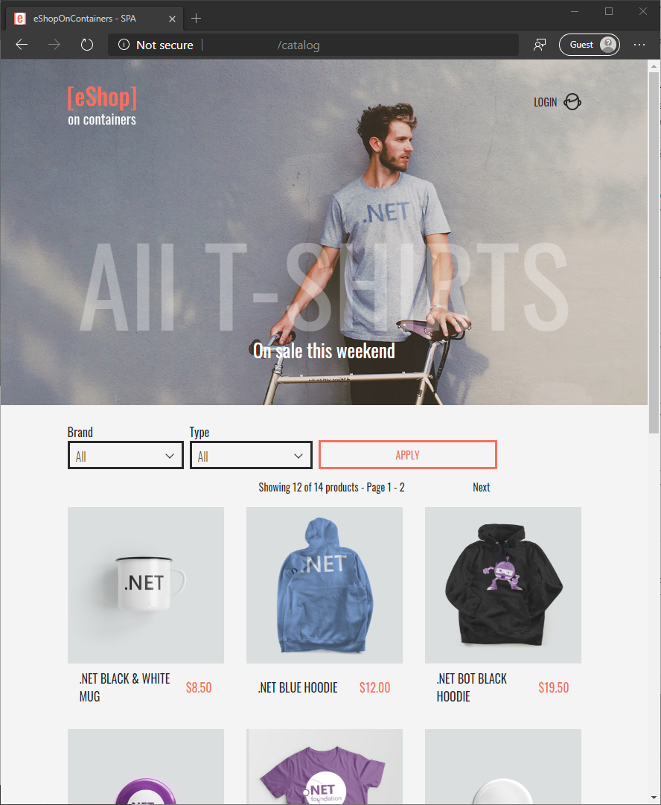
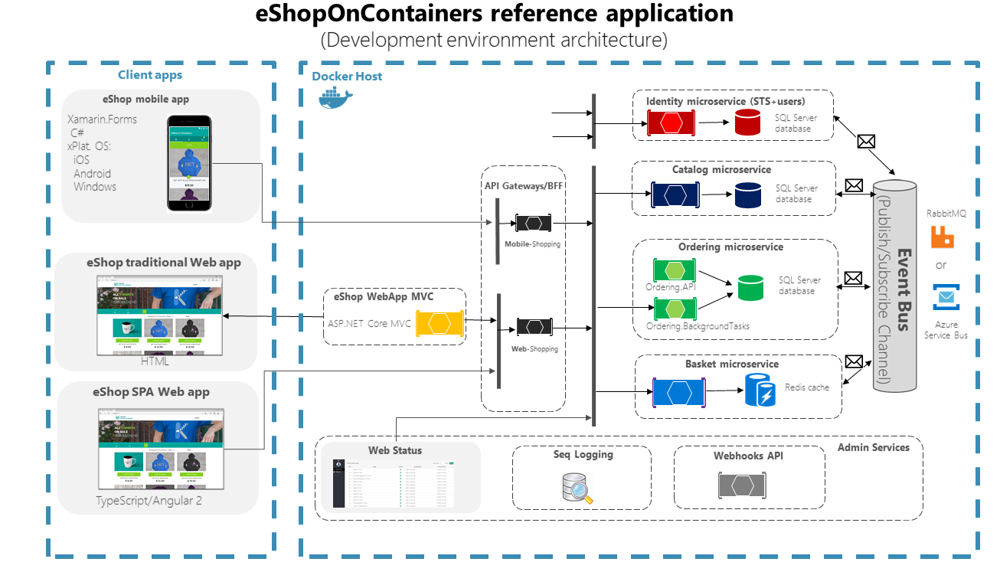

Today, users are demanding responsiveness, the latest and greatest features, and zero downtime from their applications. Businesses are rapidly adopting the cloud's power to meet user demand, increase scalability and availability of applications. However, to fully embrace the cloud and optimize cost savings, applications need to be designed with the cloud in mind. This means not just changing the way applications are built, but also changing development practices in the organization to adopt this cloud-native architectural style.

The .NET team has put together a collection of free resources to help you speed up your cloud-native application development journey. Whether you're modernizing your application or creating something new, we have guidance to assist your decision-making. These guides are up-to-date and include the latest and greatest cloud-ready features in the .NET platform.

## Getting started on cloud-native .NET apps

If you are a beginner, start building a simple microservice endpoint using ASP.NET Web API, Docker, and deploy them to Azure Kubernetes Services(AKS).

* 👉 [.NET Tutorial - Hello World Microservice](https://dotnet.microsoft.com/learn/aspnet/microservice-tutorial/intro) covers step-by-step instructions for installing .NET and building your first microservice using Docker.
* 👉 [.NET Tutorial - Deploy a microservice to Azure](https://dotnet.microsoft.com/learn/aspnet/deploy-microservice-tutorial/intro) covers step-by-step instructions for deploying a .NET microservice to Azure Kubernetes Service (AKS).
* 👉 [.NET and Docker 101 Videos](https://www.youtube.com/watch?v=vmnvOITMoIg&list=PLdo4fOcmZ0oUvXP_Pt2zOgk8dTWagGs_P) will help you get started on .NET, Docker and the tooling support in Visual Studio.
<iframe width="800" height="450" src="https://www.youtube-nocookie.com/embed/vmnvOITMoIg" frameborder="0" allow="accelerometer; autoplay; clipboard-write; encrypted-media; gyroscope; picture-in-picture" allowfullscreen></iframe>

Also, join us for a live two hour course coming up on March 26: [Let's Learn .NET: Microservices](https://aka.ms/letslearndotnet). Come learn about what microservices are, why you need them, and how to build them with C# and .NET. You will leave with an understanding of how a container, images, hub, and orchestrator all relate to each other. 

## Hands-on Microsoft learn modules

Microsoft has a free online training platform called Microsoft Learn. You can learn more skills with content  that is fun, guided, hands-on, interactive, and specific to your role & goals. We have built a series of modules to help you learn to build .NET microservices and cloud-native technologies like Docker, Container Registry, Kubernetes, Helm, and so much more. The only setup that you need on your computer to execute this module is a browser. All the magic is done behind the scenes using the Azure CLI, so, you can focus totally on the learning and leave the infrastructure headaches to the scripts.

**Try them now!** 👉 [https://aka.ms/aspnet-microservices](https://aka.ms/aspnet-microservices)

## Free architecture e-Books

**Dapr for .NET Developers e-book**

Formats: [PDF](https://aka.ms/dapr-ebook) | [Read online](https://docs.microsoft.com/dotnet/architecture/dapr-for-net-developers/)

Guidance for .NET developers to understand and leverage the full power of Microsoft's open-source Distributed Application Runtime. Dapr helps you tackle the challenges that come with building microservices and keeps your code platform agnostic.

**Cloud-native e-book**

Formats: [PDF](https://aka.ms/cloud-native-ebook) | [Read online](https://docs.microsoft.com/dotnet/architecture/cloud-native)

This guidance defines cloud-native application development, introduces a sample app built using cloud-native principles, and covers topics common to most cloud-native applications. This guide's audience is mainly decision-makers, developers, development leads, and architects interested in learning how to build applications designed for the Azure cloud.

**.NET Microservices e-book**

Formats: [PDF](https://aka.ms/MicroservicesEbook) | [Read online](https://docs.microsoft.com/dotnet/architecture/microservices/)

We wrote this guide for developers and solution architects who are new to Docker-based application development and microservices-based architecture. Technical decision-makers, such as an enterprise architect, will also find this guide useful for deciding on what approach to select for new and modern distributed applications. This book covers patterns such as Domain-Driven Design(DDD), Command Query Responsibility Segregation (CQRS), Database per service, API Composition, etc.

**Serverless apps e-book**

Formats: [PDF](https://aka.ms/serverlessbookpdf) | [Read online](https://docs.microsoft.com/dotnet/architecture/serverless/)

This guide focuses on the cloud-native development of applications that use serverless. The book highlights the benefits and exposes the potential drawbacks of developing serverless apps and provides a survey of serverless architectures.

**DevOps: Docker app lifecycle e-book**

Formats: [PDF](https://aka.ms/dockerlifecycleebook) | [Read online](https://docs.microsoft.com/dotnet/architecture/containerized-lifecycle/)

This guide provides a high-level introduction to Azure DevOps for implementing CI/CD pipelines, covers Azure Container Registry (ACR) and Azure Kubernetes Services (AKS )for deployment.

### Modernizing existing .NET applications

**ASP.NET Core gRPC for WCF developers e-book**

Formats: [PDF](https://aka.ms/grpcforwcfbook) | [Read online](https://docs.microsoft.com/dotnet/architecture/grpc-for-wcf-developers/)

We wrote this guide for developers working in .NET Framework or .NET Core who have previously used WCF and seek to migrate their applications to a modern RPC environment for .NET 5. More generally, if you are upgrading, or considering upgrading, to .NET 5, and you want to use the built-in gRPC tools, this guide will help.

**Migrate .NET apps to Azure e-book**

Formats: [PDF](https://aka.ms/liftandshiftwithcontainersebook) | [Read online](https://docs.microsoft.com/dotnet/architecture/modernize-with-azure-containers/)

This guide focuses primarily on the initial modernization of existing Microsoft .NET Framework web or service-oriented applications. This means moving a workload to a newer or more modern environment without significantly altering the application's code and basic architecture. It also highlights the benefits of moving your apps to the cloud and partially modernizing apps using a specific set of new technologies and approaches, like Windows Containers and related compute-platforms in Azure.  Also, check out other Migration resources at [Migrate your .NET app to Azure](https://dotnet.microsoft.com/apps/cloud/migrate-to-azure).

**Porting existing ASP.NET Apps to .NET Core e-book**

Formats: [PDF](https://aka.ms/aspnet-porting-ebook) | [Read online](https://docs.microsoft.com/dotnet/architecture/porting-existing-aspnet-apps/)

This guidance provides high-level strategies for migrating existing apps written for ASP.NET MVC and Web API (.NET Framework 4.x) to .NET Core. It also covers the strategies for migrating large solutions with an example project.

## Reference samples

[eShopOnContainers](https://github.com/dotnet-architecture/eshoponcontainers) is one of our popular Microservices reference samples out there. It is a cross-platform container-based application powered by .NET 5. Check out this sample for detailed implementation of some of the microservices patterns like CQRS, DDD, Database per service, API Composition, etc.  Don't forget to check other samples out there, including Modernizing your .NET apps at [github.com/dotnet-architecture/](https://github.com/dotnet-architecture/).

## Help us improve

We are hoping that you find these learning resources useful. Please help us make these guides and learning resources better for you. If you have comments about a particular book, use the feedback section at the bottom of any [page](https://docs.microsoft.com/dotnet/architecture/) or leave us feedback at [aka.ms/ebookfeedback](https://aka.ms/ebookfeedback).

For more architecture guidance check out 👉 [dot.net/architecture](https://dot.net/architecture).
