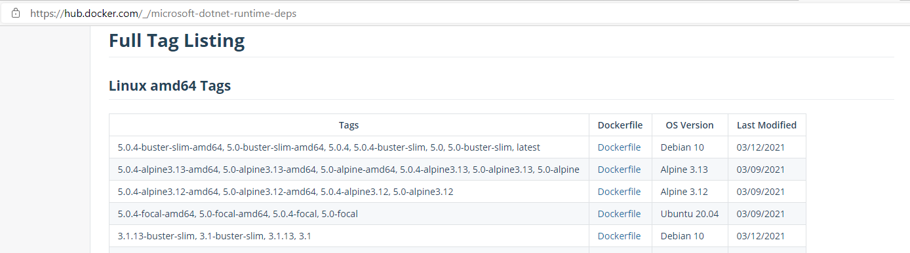
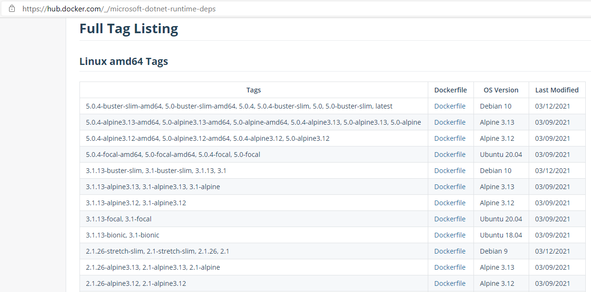
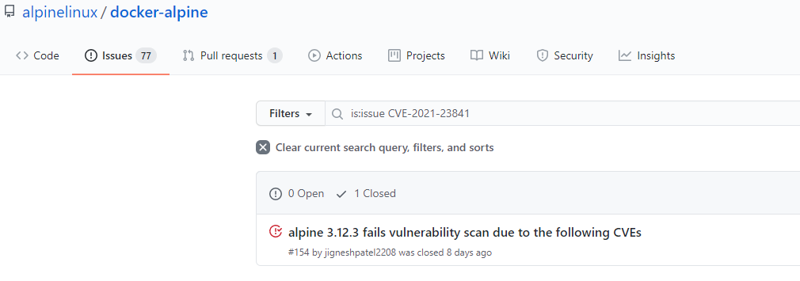

We regularly get contacted for help in managing CVEs in Linux-based .NET images. In fact, we were contacted just this morning about [CVE-2021-23840](https://nvd.nist.gov/vuln/detail/CVE-2021-23840) and [CVE-2021-23841](https://nvd.nist.gov/vuln/detail/CVE-2021-23841). I investigated the CVE for that customer to help them to understand their options. It occurred to me that this information would be helpful to a broader audience. The following post is mostly just a re-printing of our conversation. It demonstrates what the customer wanted to learn and I what I did to answer their questions. I'm not using any special tools or security databases, but the exact same information that you have access to from your desktop.

This post can be thought of as the practical companion to [Staying safe with .NET Containers](https://devblogs.microsoft.com/dotnet/staying-safe-with-dotnet-containers/). That post is more the theory of how to stay safe, but doesn't include much on-the-ground guidance. I'm hoping that this post helps you if you are asked to do an investigation.

The post includes a lot of `docker` commands. I'm using WSL2 for this. As a result, the exact syntax will work on Windows, macOS, and Linux.

## Customer request

*The following is the (massively paraphrased) request from the customer.*

Our CVE scan is showing unpatched vulnerabilities in .NET images, specifically in the runtime-deps layer. It relates to this [openssl security update](https://lists.debian.org/debian-security-announce/2021/msg00035.html).

We are using this tag: `mcr.microsoft.com/dotnet/runtime-deps:3.1`. It has been a couple months since we last built our app with that image. We need your help on what to do next.

## The investigation

The following is the investigation I did to help out this customer. It took ~30 mins to do that. I'm sharing that to give you a sense of what doing this work looks like when you have the skills for the task and have confidence in the techniques you are using.

The first thing I wanted to do is to get some ground facts in place to work from.

- Which distro is the customer using?
- Does the latest patch of that distro have the fix?
- Or, is this issue in a package, such that we need to install an updated package?

The customer said that they were using `mcr.microsoft.com/dotnet/runtime-deps:3.1`. That's a Debian 10 image. I'll show you how I know that, in two different ways.

The first way is just asking the image itself.

```console
rich@mazama:~$ docker pull mcr.microsoft.com/dotnet/runtime-deps:3.1
rich@mazama:~$ docker run --rm mcr.microsoft.com/dotnet/runtime-deps:3.1 cat /etc/os-release
PRETTY_NAME="Debian GNU/Linux 10 (buster)"
NAME="Debian GNU/Linux"
VERSION_ID="10"
VERSION="10 (buster)"
VERSION_CODENAME=buster
ID=debian
HOME_URL="https://www.debian.org/"
SUPPORT_URL="https://www.debian.org/support"
BUG_REPORT_URL="https://bugs.debian.org/"
```

The other way is by looking at the Dockerfile. You can get at that by looking at the [runtime-deps repo](https://hub.docker.com/_/microsoft-dotnet-runtime-deps).



The last line in image corresponds to the customer image. Notice the `3.1` tag. I realize now that I didn't ask the customer if if they were using x64 or Arm images, but for this investigation, it is unlikely to matter. This isn't an architecture-specific issue. If you click on the `Dockerfile` link for that image, you'll end up at [dotnet-docker/src/runtime-deps/3.1/buster-slim/amd64/Dockerfile](https://github.com/dotnet/dotnet-docker/blob/c0e8be8a44b47b1dcc2a5b4b2ebd92022087ac0b/src/runtime-deps/3.1/buster-slim/amd64/Dockerfile#L1). That shows you a Dockerfile that depends on `amd64/debian:buster-slim`. That's [Debian 10](https://wiki.debian.org/DebianReleases#Production_Releases).

Let's now take a look at the [specific issue](https://lists.debian.org/debian-security-announce/2021/msg00035.html). I'm going to ignore the actual CVE write-up and going to focus on remediation in that post:

> For the stable distribution (buster), these problems have been fixed in version `1.1.1d-0+deb10u5`.

Now, I've got the decoder ring in hand -- the patched OpenSSL version -- and can look at which .NET images have that patched version and which do not.

```console
rich@mazama:~$ docker pull mcr.microsoft.com/dotnet/runtime-deps:3.1
rich@mazama:~$ docker run --rm mcr.microsoft.com/dotnet/runtime-deps:3.1 apt list openssl
Listing...
openssl/now 1.1.1d-0+deb10u5 amd64 [installed,local]
```

Nice. The latest version is patched. Now we need to find the first version that isn't patched. This is a serious investigation, so I'm going to `docker pull` before every `docker run`. I'm not going to make any assumptions about the state of my machine (specifically the docker cache).

```console
rich@mazama:~$ docker pull mcr.microsoft.com/dotnet/runtime-deps:3.1
3.1: Pulling from dotnet/runtime-deps
Digest: sha256:b1d57557026c11c1980853306cab07869e4786b78fecb65de5dd717cd0a24dc2
Status: Image is up to date for mcr.microsoft.com/dotnet/runtime-deps:3.1
mcr.microsoft.com/dotnet/runtime-deps:3.1
rich@mazama:~$ docker run --rm mcr.microsoft.com/dotnet/runtime-deps:3.1 apt list openssl
Listing...
openssl/now 1.1.1d-0+deb10u5 amd64 [installed,local]
rich@mazama:~$ docker pull mcr.microsoft.com/dotnet/runtime-deps:3.1.13
3.1.13: Pulling from dotnet/runtime-deps
Digest: sha256:b1d57557026c11c1980853306cab07869e4786b78fecb65de5dd717cd0a24dc2
Status: Image is up to date for mcr.microsoft.com/dotnet/runtime-deps:3.1.13
mcr.microsoft.com/dotnet/runtime-deps:3.1.13
```

I'm not going to run the `docker run` command on `3.1.13`. I can see that its digest matches with `3.1`. They are pointing to the exact same content, so there is no need to check the OpenSSL version again. Let's move on to older tags.

```console
rich@mazama:~$ docker run --rm mcr.microsoft.com/dotnet/runtime-deps:3.1.13 apt list openssl
Listing...
openssl/now 1.1.1d-0+deb10u5 amd64 [installed,local]
rich@mazama:~$ docker pull mcr.microsoft.com/dotnet/runtime-deps:3.1.12
3.1.12: Pulling from dotnet/runtime-deps
Digest: sha256:9be9f0624981bf3570e0abaa2daaa5857b116ff9f3a7d95a9626245b0e6f2920
Status: Image is up to date for mcr.microsoft.com/dotnet/runtime-deps:3.1.12
mcr.microsoft.com/dotnet/runtime-deps:3.1.12
rich@mazama:~$ docker run --rm mcr.microsoft.com/dotnet/runtime-deps:3.1.12 apt list openssl
Listing...
openssl/now 1.1.1d-0+deb10u4 amd64 [installed,local]
```

That didn't take long. That tells us that `3.1.13` has the fix, and `3.1.12` and earlier images do not. You need to upgrade to `3.1.13` to get the fix. You can also manually update `3.1.12` images, but that's not recommended and is a pain, so I'm not going to describe that workflow in this post.

I shared this information with the customer, and they were happy, and had a fine set of next steps for remediation.

In retrospect, I should have asked the customer for the exact .NET image digest that they had used to build their images. That would have been the best place to start the investigation. It would have been useful to determine the OpenSSL version that they were using and validate that it was vulnerable. I believe them, but it's always a good idea to validate all assumptions, particularly related to security, that a customer shares with you. 

## Let's take a look at Alpine

You know what they say about a job well done.

"Hey, what if we had used Alpine?" ... That's what they asked next. I needed a break from publishing lengthy blog posts so I decided to re-play the investigation for another distro to satisfy the request.

Let's pretend the customer was using `mcr.microsoft.com/dotnet/runtime-deps:3.1-alpine3.13` and had the same question. We now need to determine the remediated OpenSSL version in the Alpine ecosystem.



The Alpine tags we are going to look at are the last ones listed in this image.

I looked at that same [openssl security update](https://lists.debian.org/debian-security-announce/2021/msg00035.html) for Debian and did some searches on the listed CVEs.



This [search](https://github.com/alpinelinux/docker-alpine/issues?q=is%3Aissue+CVE-2021-23841) led to me [docker-alpine #154](https://github.com/alpinelinux/docker-alpine/issues/154). That tells me that `1.1.1j-r0` is the remediated version in Alpine Linux. [docker-alpine #147](https://github.com/alpinelinux/docker-alpine/issues/147) confirmed that information. You might want more information than that for your purposes, but I'm going to go with `1.1.1j-r0` as the good version. You can also just rely on your CVE scanners and see if they are happy with that answer.

We now need to do the same exercise and see which Alpine-based .NET images have that OpenSSL package version. Alpine uses a different package manager, so the commands are slightly different.

I'll also say upfront that the Alpine-based .NET 3.1 tags are incredibly confusing. The current .NET Core 3.1 patch versions almost exactly match the current Alpine versions. That's completely unintentional. We also just transitioned from Alpine 3.12 to Alpine 3.13, across the .NET 3.1.12 to .NET 3.1.13 updates, which is doubly confusing. For the tags you are about to see, it's .NET versions on the left and Alpine versions on the right.

```console
rich@mazama:~$ docker pull mcr.microsoft.com/dotnet/runtime-deps:3.1-alpine3.13
3.1-alpine3.13: Pulling from dotnet/runtime-deps
Digest: sha256:9ee0ac4a369b3720e63a89d4403fed1808bd996bedfa5a67682769c5e161f8d9
Status: Image is up to date for mcr.microsoft.com/dotnet/runtime-deps:3.1-alpine3.13
mcr.microsoft.com/dotnet/runtime-deps:3.1-alpine3.13
rich@mazama:~$ docker run --rm mcr.microsoft.com/dotnet/runtime-deps:3.1-alpine3.13 apk list libssl1.1
libssl1.1-1.1.1j-r0 x86_64 {openssl} (OpenSSL) [installed]
rich@mazama:~$ docker pull mcr.microsoft.com/dotnet/runtime-deps:3.1.13-alpine3.13
3.1.13-alpine3.13: Pulling from dotnet/runtime-deps
Digest: sha256:9ee0ac4a369b3720e63a89d4403fed1808bd996bedfa5a67682769c5e161f8d9
Status: Downloaded newer image for mcr.microsoft.com/dotnet/runtime-deps:3.1.13-alpine3.13
mcr.microsoft.com/dotnet/runtime-deps:3.1.13-alpine3.13
```

I'm not going to run the `docker run` command on `3.1.13-alpine3.13`. I can see that its digest matches with `3.1-alpine3.13`. They are pointing to the exact same content, so there is no need to check the OpenSSL version again. Let's move on to older tags.

```console
rich@mazama:~$ docker pull mcr.microsoft.com/dotnet/runtime-deps:3.1.12-alpine3.12
3.1.12-alpine3.12: Pulling from dotnet/runtime-deps
Digest: sha256:4e05c1cbcf2a1592bb40c37fba0d3693a08afa117b978d849703d3f56762d09c
Status: Image is up to date for mcr.microsoft.com/dotnet/runtime-deps:3.1.12-alpine3.12
mcr.microsoft.com/dotnet/runtime-deps:3.1.12-alpine3.12
rich@mazama:~$ docker run --rm mcr.microsoft.com/dotnet/runtime-deps:3.1.12-alpine3.12 apk list libssl1.1
libssl1.1-1.1.1j-r0 x86_64 {openssl} (OpenSSL) [installed]
rich@mazama:~$ docker pull mcr.microsoft.com/dotnet/runtime-deps:3.1.11-alpine3.12
3.1.11-alpine3.12: Pulling from dotnet/runtime-deps
Digest: sha256:58d7f8963a82b24e2eb906a0ecd52432a014297eae662a1bacf225c2182b99f4
Status: Image is up to date for mcr.microsoft.com/dotnet/runtime-deps:3.1.11-alpine3.12
mcr.microsoft.com/dotnet/runtime-deps:3.1.11-alpine3.12
rich@mazama:~$ docker run --rm mcr.microsoft.com/dotnet/runtime-deps:3.1.11-alpine3.12 apk list libssl1.1
libssl1.1-1.1.1i-r0 x86_64 {openssl} (OpenSSL) [installed]
rich@mazama:~$
```

This tells us that `3.1.11-alpine3.12` is vulnerable and that `3.1.12-alpine3.12` and newer tag versions are patched. Again, you can see that the digests for `3.1-alpine3.13` and `3.1.13-alpine3.13` match, and that both tags (since they reference the same image) are patched. If you are using `3.1.12-alpine3.12`, you should probably still rebuild your image. It's likely that `3.1.12-alpine3.12` was rebuilt multiple times through the month (of mid February to mid March) and that it initially included the vulnerable OpenSSL and was rebuilt with the patched version later. You can perform the same test above, to see which OpenSSL version your images have, and then you will be sure.

If you are already using the latest Alpine image, then you don't need to worry about this OpenSSL CVE. If you are using an older tag (`3.1.11-alpine3.12` or older), then you should update your image.

## Let's take a look at Ubuntu

I'll also show you Ubuntu, with quicker treatment. I did some quick searches and found the same [security disclosure for Ubuntu](https://ubuntu.com/security/notices/USN-4738-1). Let's look at the Ubuntu 20.04-based .NET 3.1 `runtime-deps` images. The disclosure tell us we should be looking for the `libssl1.1 - 1.1.1f-1ubuntu2.2` OpenSSL package version.

First, I'll show you that we're looking at Ubuntu 20.04 images.

```console
rich@mazama:~$ docker run --rm mcr.microsoft.com/dotnet/runtime-deps:3.1-focal cat /etc/os-release
NAME="Ubuntu"
VERSION="20.04.2 LTS (Focal Fossa)"
ID=ubuntu
ID_LIKE=debian
PRETTY_NAME="Ubuntu 20.04.2 LTS"
VERSION_ID="20.04"
HOME_URL="https://www.ubuntu.com/"
SUPPORT_URL="https://help.ubuntu.com/"
BUG_REPORT_URL="https://bugs.launchpad.net/ubuntu/"
PRIVACY_POLICY_URL="https://www.ubuntu.com/legal/terms-and-policies/privacy-policy"
VERSION_CODENAME=focal
UBUNTU_CODENAME=focal
```

Now let's look at the latest version of `runtime-deps` for the combination of .NET Core 3.1 and Ubuntu 20.04.


```console
rich@mazama:~$ docker pull mcr.microsoft.com/dotnet/runtime-deps:3.1-focal
3.1-focal: Pulling from dotnet/runtime-deps
Digest: sha256:2cf45d51964425f22eb89769d7d718cf1a03f9f068d0fdea40837c70a1533843
Status: Image is up to date for mcr.microsoft.com/dotnet/runtime-deps:3.1-focal
mcr.microsoft.com/dotnet/runtime-deps:3.1-focal
rich@mazama:~$ docker run --rm mcr.microsoft.com/dotnet/runtime-deps:3.1-focal apt list openssl
Listing...
openssl/now 1.1.1f-1ubuntu2.2 amd64 [installed,local]
```

We have a match. The Ubuntu 20.04-based .NET images are patched as well.

## Closing

As I said in [Staying safe with .NET Containers](https://devblogs.microsoft.com/dotnet/staying-safe-with-dotnet-containers/), CVE management is a skill and one that organizations should invest in before the critical security event occurs. It's a bit like earthquakes on the Pacific coast of the United States. It's not an if, but when.

The style of investigation I shared is not the only kind you need to be fully competent in to do CVE investigations. I shared this one because of how straightforward it was, and because I had just done it earlier today. It is intended to give you a sense of where information can be found, in security advisories, in GitHub repos (specifically the ones related to delivering container images) and in docker images themselves. It is also intended to demonstrate that we have a system in place that keeps images up to date. As you can see from this post, we had images ready for this customer to use, for Alpine, Debian, and Ubuntu.

If there is another more we can do to help, please tell us. We see supporting you in CVE managment as part of our role in providing .NET images for you.
