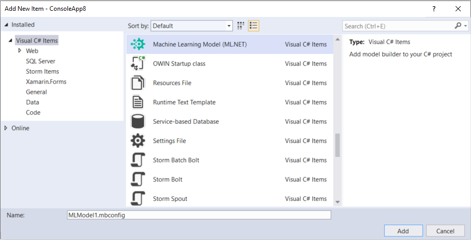
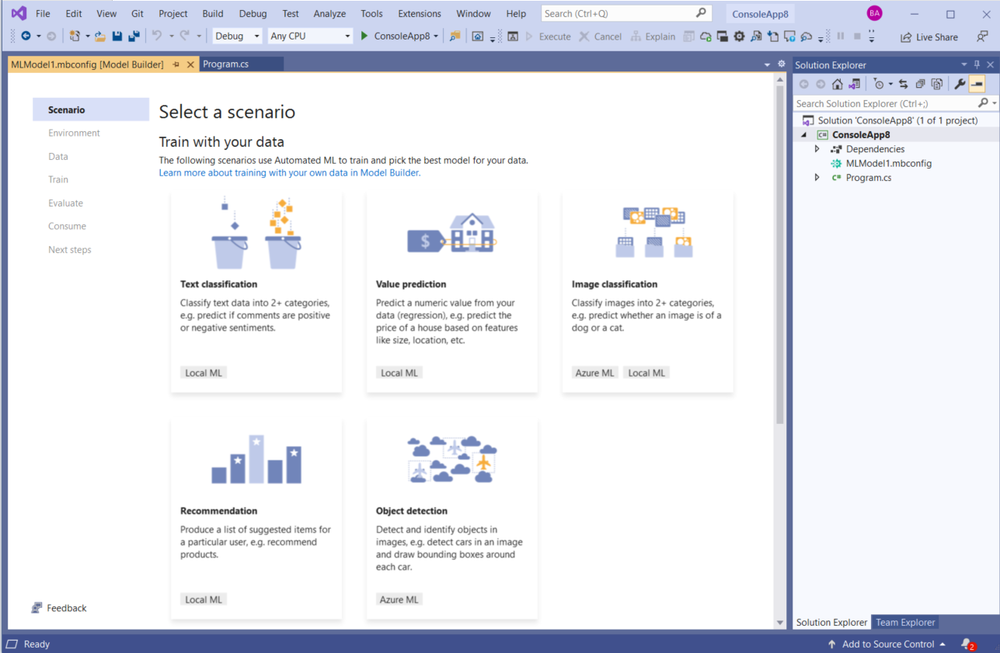
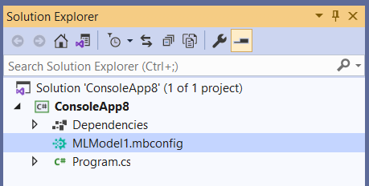
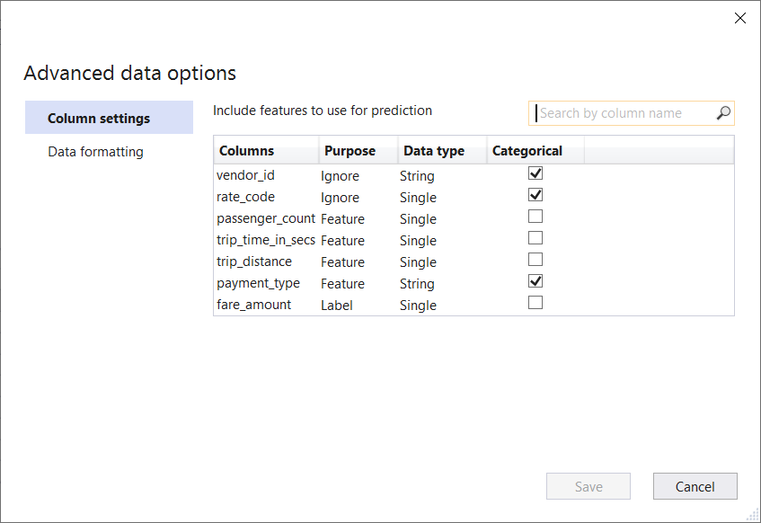
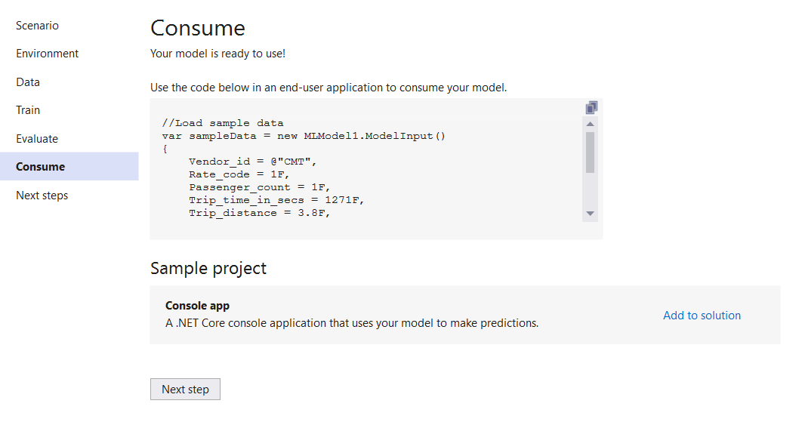

[ML.NET](https://dot.net/ml) is an open-source, cross-platform machine learning framework for .NET developers. It enables integrating machine learning into your .NET apps without requiring you to leave the .NET ecosystem or even have a background in ML or data science.

We are excited to announce new versions of ML.NET and Model Builder!

In this post, we'll cover the following items:

1. [Model Builder Preview](#model-builder-preview)
2. [ML.NET v1.5.5](#ml.net-v1.5.5)
3. [Virtual ML.NET Community Conference](#virtual-ml.net-community-conference)
4. [Feedback](#feedback)
5. [Get started and resources](#get-started-and-resources)

## Model Builder Preview

This preview brings a lot of big changes to Model Builder, and we're excited to get your feedback on all the new features which include:

- Config-based training with generated code-behind files
- Restructured Advanced Data Options
- Redesigned Consume step

You can sign up for the Preview at [aka.ms/blog-mb-preview](https://aka.ms/blog-mb-preview).

### Config-based training with generated code-behind files

The Model Builder experience has been revamped! Now when you right-click on your project in **Solution Explorer** and **Add > Machine Learning**, the **Add New Item Dialog** opens, and you can add an ML.NET Model.



After adding your model, the Model Builder UI opens, and a new item (an `*.mbconfig` file) shows up in the Solution Explorer.





At any point when using Model Builder, if you close out of the UI, you can double click on the `*.mbconfig` in Solution Explorer, and it will open the UI again to your last saved state.

After training, two files are generated under the `*.mbconfig` file:


- **Model.consumption.cs**: This file contains the Model Input and Model Output schemas as well as the `Predict` function generated for consuming the model.
- **Model.training.cs**: This file contains the training pipeline (data transforms, algorithm, algorithm hyperparameters) chosen by Model Builder to train the model. You can use this pipeline for re-training your model.
- **Model.zip**: This is a serialized zip file which represents your trained ML.NET model.

Previously, these files were added as two new projects (a class library for model consumption code and a console app for the training pipeline). The new experience is similar to adding a new form in a Windows Forms application, where there are code-behind files behind the form and double clicking the form opens the designer.

If you open the `*.mbconfig` file, you can see that it is simply a JSON file with state information:

```json
{
  "TrainingConfigurationVersion": 0,
  "TrainingTime": 10,
  "Scenario": {
    "ScenarioType": "Classification"
  },
  "DataSource": {
    "DataSourceType": "TabularFile",
    "FileName": "C:\\Desktop\\Datasets\\yelp_labelled.txt",
    "Delimiter": "\t",
    "DecimalMarker": ".",
    "HasHeader": true,
    "ColumnProperties": [
      {
        "ColumnName": "Comment",
        "ColumnPurpose": "Feature",
        "ColumnDataFormat": "String",
        "IsCategorical": false
      },
      {
        "ColumnName": "Sentiment",
        "ColumnPurpose": "Label",
        "ColumnDataFormat": "String",
        "IsCategorical": true
      }
    ]
  },
  "Environment": {
    "EnvironmentType": "LocalCPU"
  },
  "Artifact": {
    "Type": "LocalArtifact",
    "MLNetModelPath": "C:\\source\\repos\\ConsoleApp8\\ConsoleApp8\\MLModel1.zip"
  },
  "RunHistory": {
    "Trials": [
      {
        "TrainerName": "AveragedPerceptronOva",
        "Score": 0.8059,
        "RuntimeInSeconds": 4.4
      }
    ],
    "Pipeline": "[{\"EstimatorType\":\"MapValueToKey\",\"Name\":null,\"Inputs\":[\"Sentiment\"],\"Outputs\":[\"Sentiment\"]},{\"EstimatorType\":\"FeaturizeText\",\"Name\":null,\"Inputs\":[\"Comment\"],\"Outputs\":[\"Comment_tf\"]},{\"EstimatorType\":\"CopyColumns\",\"Name\":null,\"Inputs\":[\"Comment_tf\"],\"Outputs\":[\"Features\"]},{\"EstimatorType\":\"NormalizeMinMax\",\"Name\":null,\"Inputs\":[\"Features\"],\"Outputs\":[\"Features\"]},{\"LabelColumnName\":\"Sentiment\",\"EstimatorType\":\"AveragedPerceptronOva\",\"Name\":null,\"Inputs\":null,\"Outputs\":null},{\"EstimatorType\":\"MapKeyToValue\",\"Name\":null,\"Inputs\":[\"PredictedLabel\"],\"Outputs\":[\"PredictedLabel\"]}]",
    "MetricName": "MicroAccuracy"
  }
}
```

This new Model Builder experience brings many benefits:

- You can specify the name of your model and generated code.
- You can have more than one Model Builder-generated model in a solution.
- You can save your state and come back to the last saved state. If you spend an hour training and close out of Model Builder, now you don’t have to start over and can just pick up where you left off.
- You can share the `*.mbconfig` file and collaborate on the same Model Builder instance via source control.
- You can use the same `*.mbconfig` file in Model Builder and the ML.NET CLI (coming soon!).

### Restructured Advanced Data Options

In the last Model Builder release, we added *advanced data options* for data loading which gave you more control over column settings and data formatting.

In this release, we added several more options and reorganized the options to make selecting your column settings even easier:

- **Purpose**: Choose whether the column is a Feature column, a Label column, or a column to Ignore during training.
- **Data type**: Choose whether the data in the column is a String, Single, or Boolean.
- **Categorical**: Choose whether the column is categorical or not.



### Redesigned Consume Step

We have redesigned the consume step to make a smooth transition from training and evaluating a model to using that model to make predictions in an end-user application.

A code snippet has been provided in the UI which demonstrates how to set up the Model Input as well as how to use the generated `Predict` function to return the predicted output.

Each Model Input property is filled in with sample data from the first row of your dataset. You can use the copy button in the top right of the box to copy the entire code snippet; then once you paste this code into your end-user application, you can modify the Model Input fields to get real data to feed into your model.



Additionally, there is a new **Sample project** section which generates an application that uses your model and adds the project to your solution. In previous versions of Model Builder, a sample console app was automatically added to your solution; now you can choose whether you want to add a new project to use your model.

Currently, there is only the option to add a console app, but in the future, we plan to add support for Web APIs, Azure Functions, and more.

## ML.NET v1.5.5

This release of ML.NET brings numerous bug fixes and enhancements as well as the following new features:

- New API that accepts double type for the confidence level which helps when you need to have higher precision than an int will allow for. Thank you [@esso23](https://github.com/esso23) for your contributions!
- Support for export ValueMapping estimator to ONNX.
- New API to specify if the output from TensorFlow is batched or not (previously ML.NET always assumed it was a batch amount which caused errors when that wasn’t true).

Check out the [release notes](https://github.com/dotnet/machinelearning/blob/master/docs/release-notes/1.5.5/release-1.5.5.md) for more details.

## Virtual ML.NET Community Conference

On May 7th, the 2nd annual [Virtual ML.NET Community Conference](https://virtualml.net/) will kick off with 2 days of sessions on all things ML.NET, and we're looking for speakers to talk about:

- MLOps
- Case studies and real-life use cases
- Interactive computing with Jupyter
- ML.NET interop (ONNX)
- ML.NET and IoT devices
- ML.NET in F#
- Big Data and ML.NET
- A journey from experimentation to production
- Anything else ML.NET related you can think of!

This is a 100% free event, by the community, for the community.

You can [submit your talk](https://sessionize.com/the-virtual-ml-net-community-conference-9022/) through Sessionize.

## Feedback

We are working on lots of new and exciting things for ML.NET, and we would love to hear your feedback!

- [Sign up](https://aka.ms/blog-mb-preview) for the Model Builder Preview.

- [Let us know on GitHub](https://github.com/dotnet/machinelearning/pull/5628) on which platforms you'd like to use ML.NET (e.g. ARM).

- [Join the conversation on GitHub](https://github.com/dotnet/interactive/issues/1132) about Interactive Notebooks support in Visual Studio.

- Check out this [blog post](https://devblogs.microsoft.com/dotnet/serve-ml-net-models-as-http-apis-with-minimal-configuration/) on how to deploy your model with a minimal web API (and leave your feedback).

If you run into any issues or have general feedback, please let us know by creating an issue in our GitHub repos (or use the Feedback button in Model Builder):

- [ML.NET API](https://github.com/dotnet/machinelearning)
- [ML.NET Tooling (Model Builder & ML.NET CLI)](https://github.com/dotnet/machinelearning-modelbuilder)

## Get started and resources

Get started with ML.NET in this [tutorial](https://dotnet.microsoft.com/learn/ml-dotnet/get-started-tutorial/intro).

Learn more about ML.NET and Model Builder in [Microsoft Docs](https://docs.microsoft.com/dotnet/machine-learning/).

Tune in to the [Machine Learning .NET Community Standup](https://dotnet.microsoft.com/platform/community/standup) every other Wednesday at 10am Pacific Time.
