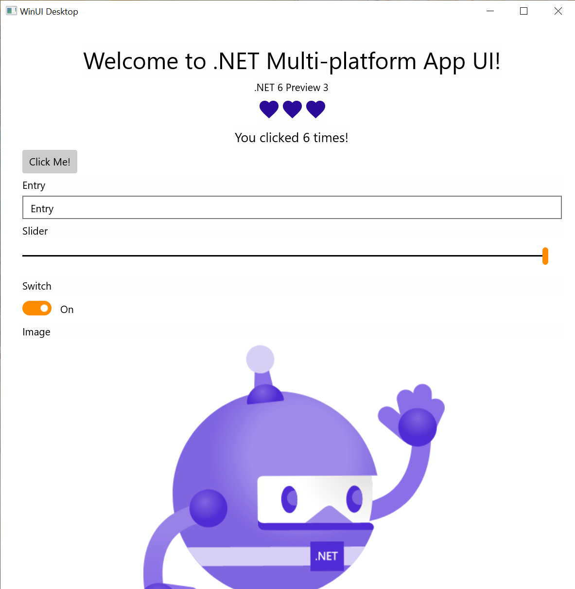
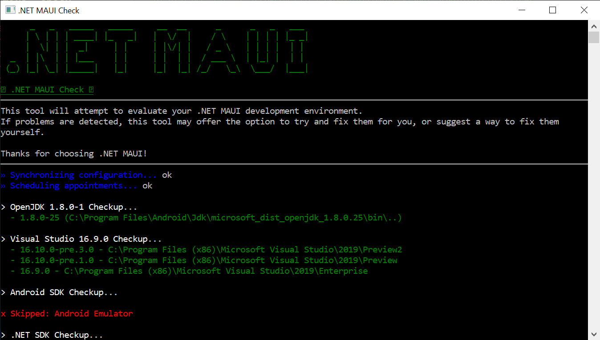

Today with .NET 6 Preview 3 we are shipping the latest progress for mobile and desktop development with the .NET Multi-platform App UI. This release adds the Windows platform with WinUI 3, improves the base application and startup builder, adds native lifecycle events, and continues to add more UI controls and layout capabilities. We are also introducing new semantic properties for accessibility. As we explore each of these in a bit more detail, we invite you to `dotnet new` along with us and share your feedback.

## Windows Desktop Now Supported

Project Reunion 0.5 has shipped! Now Windows joins Android, iOS, and macOS as target platforms you can reach with .NET MAUI! To get started, follow the [Project Reunion installation instructions](https://docs.microsoft.com/windows/apps/project-reunion/get-started-with-project-reunion). For this release we have created a [sample project](https://github.com/dotnet/net6-mobile-samples) that you can explore and run from the 16.10 preview of Visual Studio 2019.



Once we have the necessary .NET 6 build infrastructure for Project Reunion, we will add Windows to our single project templates.

## Getting Started

As we are still in the early stages of preview, the process of installing all the dependencies you need for mobile and desktop development is a bit scattered. To help ourselves, and you, Jonathan Dick has put together a useful `dotnet tool` that evaluates your system and gathers as many of the required pieces as it can. To get started, install `maui-check` globally from the command line:

```cli
dotnet tool install -g Redth.Net.Maui.Check
```

Source: https://github.com/Redth/dotnet-maui-check



Now run `> maui-check` and follow the instructions. Once you succeed, you're ready to create your first app:

```cli
dotnet new maui -n HelloMaui
```

Step-by-step instructions for installing and getting started may also be found at [https://github.com/dotnet/maui/wiki/Getting-Started](https://github.com/dotnet/maui/wiki/Getting-Started).

## Your First Application

.NET MAUI starts every application using the Microsoft.Extensions HostBuilder. This provides a consistent pattern for application developers as well as library maintainers to quickly develop native applications. Each platform has a different starting point, and the consistent point of entry for your application is `Startup.cs`. Here is the most basic example:

```csharp
public class Startup : IStartup
{
    public void Configure(IAppHostBuilder appBuilder)
    {
        appBuilder
            .UseMauiApp<App>();
    }
}
```

This is where you can do such things as register fonts and register compatibility for Xamarin.Forms renderers or your own custom renderers. This is also where you introduce your `App`, an implementation of `Application` which is responsible for (at least) creating a new `Window`:

```csharp
public partial class App : Application
{
    public override IWindow CreateWindow(IActivationState activationState)
    {
        return new MainWindow();
    }
}
```

To complete the journey to your content, a view is added to the `MainWindow`:

```csharp
public class MainWindow : IWindow
{
    public MainWindow()
    {
        Page = new MainPage();
    }

    public IPage Page { get; set; }

    public IMauiContext MauiContext { get; set; }
}
```

And that's it! You now have content in a window.

## Native Lifecycle Events

Expanding on the startup extensions, Preview 3 introduces `ConfigureLifecycleEvents` for easily hooking into native platform lifecycle events. This is an important introduction, especially for the single project experience, to simplify initialization and configuration needed by many libraries. 

As a basic example, you can hook to the Android back button event and handle it as needed:

```csharp
public class Startup : IStartup
{
    public void Configure(IAppHostBuilder appBuilder)
    {
        appBuilder
            .UseMauiApp<App>()
            .ConfigureLifecycleEvents(lifecycle => {
                #if ANDROID
                lifecycle.AddAndroid(d => {
                    d.OnBackPressed(activity => {
                        System.Diagnostics.Debug.WriteLine("Back button pressed!");
                    });
                });
                #endif
            });
    }
}
```

Now let's look at how libraries can use these methods to streamline their platform initialization work. Essentials (Microsoft.Maui.Essentials), a library for cross-platform non-UI services that is now a part of .NET MAUI, makes use of this to configure everything needed for all platforms in a single location:

```csharp
public class Startup : IStartup
{
    public void Configure(IAppHostBuilder appBuilder)
    {
        appBuilder
            .UseMauiApp<App>()
            .ConfigureEssentials(essentials =>
            {
                essentials
                    .UseVersionTracking()
                    .UseMapServiceToken("YOUR-KEY-HERE");
            });
    }
}
```

Within the Essentials code, you can see how the `ConfigureEssentials` extension method is created and hooks into the platform lifecycle events to greatly streamline cross-platform native configuration.

```csharp
public static IAppHostBuilder ConfigureEssentials(this IAppHostBuilder builder, Action<HostBuilderContext, IEssentialsBuilder> configureDelegate = null)
{
    builder.ConfigureLifecycleEvents(life =>
    {
#if __ANDROID__
        Platform.Init(MauiApplication.Current);

        life.AddAndroid(android => android
            .OnRequestPermissionsResult((activity, requestCode, permissions, grantResults) =>
            {
                Platform.OnRequestPermissionsResult(requestCode, permissions, grantResults);
            })
            .OnNewIntent((activity, intent) =>
            {
                Platform.OnNewIntent(intent);
            })
            .OnResume((activity) =>
            {
                Platform.OnResume();
            }));
#elif __IOS__
        life.AddiOS(ios => ios
            .ContinueUserActivity((application, userActivity, completionHandler) =>
            {
                return Platform.ContinueUserActivity(application, userActivity, completionHandler);
            })
            .OpenUrl((application, url, options) =>
            {
                return Platform.OpenUrl(application, url, options);
            })
            .PerformActionForShortcutItem((application, shortcutItem, completionHandler) =>
            {
                Platform.PerformActionForShortcutItem(application, shortcutItem, completionHandler);
            }));
#elif WINDOWS
        life.AddWindows(windows => windows
            .OnLaunched((application, args) =>
            {
                Platform.OnLaunched(args);
            }));
#endif
    });

    if (configureDelegate != null)
        builder.ConfigureServices<EssentialsBuilder>(configureDelegate);

    return builder;
}
```

You can see the [full class on dotnet/maui](https://github.com/dotnet/maui/blob/main/src/Controls/samples/Controls.Sample/Extensions/EssentialsExtensions.cs#L29). We are excited to see more libraries take advantage of this pattern to streamline their usage.

## Updates to Controls and Layouts

Work continues enabling more controls, properties, and layout options in .NET MAUI, in addition to the existing compatibility renderers brought in from Xamarin.Forms. If you begin your application with a startup like the code above, then you'll be using only the handlers currently implemented. To see what's currently implemented, you can review the [Handlers folder at dotnet/maui](https://github.com/dotnet/maui/tree/main/src/Core/src/Handlers).

To track incoming work we have a [Project Board](https://github.com/dotnet/maui/projects/4) setup for all the handlers we are accepting pull requests for. Several developers have already contributed, and early feedback indicates this architecture provides a much improved experience for ease of contribution. 

> "Porting handlers are fun. Any mid-senior developer can handle if they had a little bit of a proper understanding of how Xamarin Forms renderers and how Xamarin in general work." - Burak

Special thanks to these community contributors:

* [almirvuk](https://github.com/almirvuk)
    * [Implement CharacterSpacing property in Entry handler](https://github.com/dotnet/maui/pull/566)
* [AmrAlSayed0](https://github.com/AmrAlSayed0)
    * [Implemented LineHeight on Label](https://github.com/dotnet/maui/pull/538)
* [bkaankose](https://github.com/bkaankose)
    * [Entry ClearButtonVisibility handler](https://github.com/dotnet/maui/pull/564)
* [brunck](https://github.com/brunck)
    * [Port Editor Placeholder text and color properties](https://github.com/dotnet/maui/pull/573)
* [hevey](https://github.com/hevey)
    * [Implement IsTextPredictionEnabled property on Editor](https://github.com/dotnet/maui/pull/515)
* [pictos](https://github.com/pictos)
    * [Port font to Editor](https://github.com/dotnet/maui/pull/503)
* [rogihee](https://github.com/rogihee)
    * [Switch Entry and Editor from EditText to AppCompatEditText](https://github.com/dotnet/maui/pull/493)

Layouts have also received some updates in Preview 3. The `Grid` now supports absolute sizes and auto (sizes to the content). LayoutAlignment options are also now available for `Grid` and `StackLayout` so you can begin positioning views with `HorizontalLayoutAlignment` and `VerticalLayoutAlignment` properties.

## Semantic Properties for Accessibility

We have been working with many customers to better understand common difficulties around implementing accessibility across multiple native platforms, and how we might make this easier in .NET MAUI. One of the initiatives to come from this is adding new semantic properties to map cross-platform properties to native accessibility properties. 

```xaml
<Label 
    Text="Welcome to .NET MAUI!"
    SemanticProperties.HeadingLevel="Level1"
    FontSize="32"
    HorizontalOptions="CenterAndExpand" />

<Label 
    Style="{DynamicResource Glyph}" 
    Text="&#xf388;" 
    SemanticProperties.Description="Heart" />

<Label 
    Text="Click the button. You know you want to!" 
    FontSize="18"
    x:Name="CounterLabel"
    HorizontalOptions="CenterAndExpand" />

<Button 
    Text="Click Me!" 
    Clicked="OnButtonClicked"
    SemanticProperties.Hint="Counts the number of times you click"/>
```

For more information, the original specification and discussion is on [this dotnet/maui issue](https://github.com/dotnet/maui/issues/469).

## Share Your Feedback

We are excited for this release, and look forward to your feedback. Join us at [dotnet/maui](https://github.com/dotnet/maui) and let us know what you think of these improvements.

With each new preview of .NET 6 you can expect more and more capabilities to "light up" in .NET MAUI. For now, please focus on the "dotnet new" experience. Xamarin.Forms developers should look forward to a mid-year release when we'll encourage more migration exploration.
