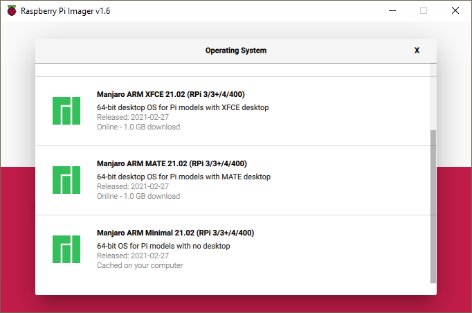

For Pi day 2021, I published a fun post on how to [Blink LEDs with Raspberry Pi](https://devblogs.microsoft.com/dotnet/blinking-leds-with-raspberry-pi/). As part of that writeup, I wanted to include a 40 LED [charlieplexing](https://github.com/dotnet/iot/tree/main/src/devices/Charlieplex) example, but couldn't get it working. It is working now, and I decided to do a follow-up post to show it to you. What's interesting is what I had to do make this sample work. Strangely, I only had to change [one line of code](https://github.com/dotnet/iot/blob/cecfa5466d89eaa47cb0c6652c50f7cf6a03b28b/src/devices/Charlieplex/CharlieplexSegment.cs#L197) in the `CharlieplexSegement` device binding. It's this single line change that I want to share as much as being able to control the forty LEDs.

> I'm using this post to start a new blog series I'm calling "show dotnet", intended for Fridays. The new series is inspired by [Show HN](https://news.ycombinator.com/show) over at Hacker News. The idea is to create space on the .NET blog for showing something interesting or new, with no requirements on being the perfect post or aligned with the current release. The post can be quite short or super long. Doesn't matter. The main thing is that it demonstrates some interesting or useful scenario of using .NET. It's also perfect for guest posts. I've already got the first few posts lined up, and will curate these posts for a while. If this works out, I'll broaden who can post. For now, this blog series is an experiment.

## Animating 40 LEDs

Let's take a look.

I'm using the same [demo code](https://github.com/dotnet/iot/blob/main/samples/led-animate/Program.cs) as I did for the previous post. I have plans for writing some fancier code. Perhaps that will be another "show dotnet" post.

In terms of [code](https://github.com/dotnet/iot/blob/main/samples/led-animate/Program.cs), my app looks like the following:

```csharp
// To use with (8) directly connected GPIO pins
// int[] pins = new int[] { 4, 17, 27, 22, 5, 6, 13, 19 };
// using IOutputSegment segment = new GpioOutputSegment(pins);

// To use with charlieplexing
int[] pins = new int[] { 23, 24, 25, 12, 16, 20, 21};
using IOutputSegment segment = new CharlieplexSegment(pins, 40);

// To use a shift register
// using IOutputSegment segment = new ShiftRegister(ShiftRegisterPinMapping.Minimal, 8);
```

The rest of the code is identical to the rest of the [Program.cs file](https://github.com/dotnet/iot/blob/main/samples/led-animate/Program.cs).

As you can see, I'm using 7 GPIO pins to control 40 LEDs. On the [Charlieplexing wikipedia](https://en.wikipedia.org/wiki/Charlieplexing) page, you will see a table that demonstrates that 7 GPIO pins can be used to control a maximum of 42 LEDs. That means I'm using the 7 pins near to their limit with this example.

You might be thinking that charlieplexing has got to be the least practical way to control LEDs. Look at all those wires! It's worse than an ethernet run in an office building. There is a lot of truth to that. It's also time consuming to wire 40 LEDs. I made several mistakes and had to do it slowly. Now that I've done it a few times, I can go faster. I actually wrote a crude test tool to make it easier. If you want it, tell me in the comments, and I'll make it available.

Yes, there are a lot of wires. A lot of that is just a function of electronics on breadboards. If you want to control 40 LEDs, you will likely need 80 wires (one for each leg). Once you move to PCBs, things get a lot easier. For example, Adafruit has some nice [charlieplexed LED matrices](https://www.adafruit.com/product/2965). They operate on the same principles, and have the advantage of hiding all of the required connections on the underside of the PCB. These charlieplexed LED matrices are on my list to target. I already have a few of them in my toy box.

Perhaps I'll demonstrate controlling 40 LEDs with shift registers in a follow up. The wiring required for that configuration would be very different, although there would still be a lot of wires.

Let's transition to what I had to do to make this demo work.

## Sleeping on the job

When I first wrote the [CharlieplexSegment](https://github.com/dotnet/iot/blob/main/src/devices/Charlieplex/CharlieplexSegment.cs) binding, I used [Thread.Sleep to create a delay](https://github.com/dotnet/iot/blob/cecfa5466d89eaa47cb0c6652c50f7cf6a03b28b/src/devices/Charlieplex/CharlieplexSegment.cs#L197). You need delays to make [persistence of vision](https://en.wikipedia.org/wiki/Persistence_of_vision) systems work. I was aware at the time that [Thread.Sleep](https://docs.microsoft.com/dotnet/api/system.threading.thread.sleep) wasn't the right API because it is graduated in terms of integers representing milliseconds, making 1ms the minimum sleep. I knew from observation and looking at other examples that I needed a delay much shorter than 1ms.

This situation is a little embarrassing. I should have been able to find an alternative myself, and I have excellent access to several threading and concurrency experts who would have been pleased to help me. Eventually, my colleagues at [dotnet/iot](https://github.com/dotnet/iot) pointed me at [DelayHelpers.cs](https://github.com/dotnet/iot/blob/main/src/devices/Common/System/Device/DelayHelper.cs) for inspiration. [dotnet/iot #1249](https://github.com/dotnet/iot/issues/1249) is also relevant.

In the end, I just switched from `Thread.Sleep(1)` to `Thread.SpinWait(1)`. It's like the old joke "I improved performance by removing all the calls to `Thread.Sleep`". That's what I did. As a result, the code is delayed ~1000x less. The impact of the change to my 40 LED example is both extremely obvious and pleasing.

In short, `Thread.Sleep` uses operating system and CPU features that enable creating delays without affecting the overall performance of the machine by yielding, similar to [Thread.Yield](https://docs.microsoft.com/dotnet/api/system.threading.thread.yield). `Thread.Spin` is the opposite, it actually just uses the CPU -- making a given core unavailable for any other execution -- to create a short delay.

In the process of writing this post, I asked my favorite threading experts to review this content. I was given the following advice (which I will absolutely apply).

> Thread.SpinWait does not make guarantees about the wall-clock time that it is going to wait. That’s not good – it makes the code fragile. For example, the next time you upgrade your RPi or we make a performance fix in the runtime, your code may  break because it will be too fast again. Instead of just calling SpinWait, it would be better to active wait for a specific number of nanoseconds, like is done in [DelayHelpers](https://github.com/dotnet/iot/blob/main/src/devices/Common/System/Device/DelayHelper.cs)

I was also given the following detailed feedback:

- Thread.Sleep() and the SpinWait struct can be used when waiting for a state change in a multithreaded environment (a lock being released, change to a memory location, etc.) in a way that allows other threads to do work during the wait.
- The SpinWait struct starts with a short delay (using Thread.SpinWait()) and increases it up to a limit, eventually mixing in Sleep() to allow other threads to run, can be useful when it’s unclear how much delay would be necessary to see the state change (eg. releasing a lock).
- Thread.SpinWait() asks the processor to issue a delay. It typically has a minimum delay in the low-nanosecond range or a few clock cycles. That low of a delay is not guaranteed by the OS, as the OS may still schedule-out the thread and let other threads run on the logical processor, which can lead to millisecond-level delays occasionally, though it may not be an issue if there is not much multiprocessing happening. The process may also be given higher priority.

That's really awesome insight that I wish I'd had earlier. As you can tell, I don't work on threading for .NET.

The following is a little more information that I picked up from various docs.

This is what the [.NET docs](https://docs.microsoft.com/dotnet/api/system.threading.thread.spinwait) say:

> The SpinWait method is useful for implementing locks. Classes in the .NET Framework, such as Monitor and ReaderWriterLock, use this method internally. SpinWait essentially puts the processor into a very tight loop, with the loop count specified by the iterations parameter. The duration of the wait therefore depends on the speed of the processor.

> Contrast this with the Sleep method. A thread that calls Sleep yields the rest of its current slice of processor time, even if the specified interval is zero. Specifying a non-zero interval for Sleep removes the thread from consideration by the thread scheduler until the time interval has elapsed.

This is from [wikipedia](https://en.wikipedia.org/wiki/Busy_waiting):

> In low-level programming, busy-waits may actually be desirable. It may not be desirable or practical to implement interrupt-driven processing for every hardware device, particularly those that are seldom accessed. Sometimes it is necessary to write some sort of control data to hardware and then fetch device status resulting from the write operation, status that may not become valid until a number of machine cycles have elapsed following the write. The programmer could call an operating system delay function, but doing so may consume more time than would be expended in spinning for a few clock cycles waiting for the device to return its status.

That very much describes my use case.

## Running on Raspberry Pi 4 with Arm64

I have several Raspberry Pis on my desk. I have one Pi 2, and then several Pi 3 and Pi 4s. I often install the official [32-bit Raspberry Pi OS](https://www.raspberrypi.org/software/operating-systems/#raspberry-pi-os-32-bit). It works great out of the box. I always install the "Lite" version, since I exclusively ssh into my [headless Pis](https://www.raspberrypi.org/documentation/remote-access/). Using the 32-bit version doesn't really make sense for me, since my team is focused so heavily on Arm64. I should be testing that.

I recently switched to using the [Raspberry Pi Imager](https://www.raspberrypi.org/software/) after having using Etcher for many years. I decided to install a 64-bit OS offered in its operating system catalog. I chose [Manjaro](https://manjaro.org/) since I was already familiar with it from using [Pine64 products](https://www.pine64.org/pinebook-pro/). Manjaro is a great distro, in part because it is in the [Arch](https://archlinux.org/) family, and Arch has an amazing [wiki](https://wiki.archlinux.org/). The [Manjaro wiki](https://wiki.manjaro.org/) is also great. I've used both wikis a fair bit.

You can see me selecting Manjaro in the image below.



I did run into some challenges, but was able to resolve them pretty quickly. Sharing those is the purpose of this section.

I first configured Manjaro to authorize my WSL2 instance for SSH.

```bash
cat .ssh/id_rsa.pub | ssh rich@192.168.1.226 "cat >> .ssh/authorized_keys"
```

I used this command to copy my WSL2 SSH public key to my Raspberry Pi. I logged in to to the Pi first to create an `.ssh` directory. I was able to avoid using passwords after that. I also used VS Code Remote to edit some of the files on the Pi via SSH and without using a password.

You will notice that I'm using an IP address to SSH into my Pi. I'd prefer to use the hostname but [WSL2 doesn't currently support IPv6](https://github.com/microsoft/WSL/issues/4518). Raspberry Pi OS continues to support IPv4 so doesn't have this problem. You may notice this later in my explanation.

I first [installed the required dependencies for .NET](https://github.com/dotnet/core/blob/main/release-notes/6.0/linux-packages.md#arch-linux) using [pacman](https://wiki.manjaro.org/index.php?title=Pacman_Overview). After that, I downloaded .NET via curl using the Linux Arm64 download links at [.NET downloads](https://dotnet.microsoft.com/download/dotnet). I installed .NET 6.

```bash
sudo pacman -Syu \
    glibc \
    gcc \
    krb5 \
    icu \
    openssl \
    libc++ \
    zlib
curl -o dotnet.tar.gz https://download.visualstudio.microsoft.com/download/pr/90d8a5e0-ed8f-430c-a66c-d17a096024a9/95d17428d5b0da3552c502eede9f7f05/dotnet-sdk-6.0.100-preview.3.21202.5-linux-arm64.tar.gz
mkdir dotnet
tar -C dotnet -xf dotnet.tar.gz
./dotnet/dotnet --info
export DOTNET_ROOT=~/dotnet && export DOTNET_ROLL_FORWARD=LatestMajor && export DOTNET_ROLL_FORWARD_TO_PRERELEASE=1
```

I also used various `DOTNET` environment variables. For example, I'm going to be running an app that targets .NET 5. The two `DOTNET_ROLL_FORWARD` environment variables enable me to run the .NET 5 app on .NET 6 without changing the app. The `DOTNET_ROOT` environment variable is required so that application executables can find the runtime. This is also required by the tool that I'm going to install and run next.

I installed the [dotnet-runtimeinfo](https://www.nuget.org/packages/dotnet-runtimeinfo/) to validate that everything was working.

```bash
./dotnet/dotnet tool install -g dotnet-runtimeinfo
export PATH="$PATH:/home/rich/.dotnet/tools"
./dotnet/dotnet runtimeinfo
```

It produces the following result:

```bash
**.NET information
Version: 6.0.0
FrameworkDescription: .NET 6.0.0-preview.3.21201.4
Libraries version: 6.0.0-preview.3.21201.4
Libraries hash: 236cb21e3c1992c8cee6935ce67e2125ac4687e8

**Environment information
OSDescription: Linux 5.10.17-1-MANJARO-ARM #1 SMP PREEMPT Mon Feb 22 11:29:03 CST 2021
OSVersion: Unix 5.10.17.1
OSArchitecture: Arm64
ProcessorCount: 4
```

The next challenge was more surprising. I was expecting to using the [GPIO APIs](https://www.nuget.org/packages/System.Device.Gpio/).

My app crashed with the following stack trace.

```bash
Unhandled exception. System.IO.IOException: Error 13 initializing the Gpio driver.
   at System.Device.Gpio.Drivers.RaspberryPi3LinuxDriver.Initialize() in /home/rich/iot/src/System.Device.Gpio/System/Device/Gpio/Drivers/RaspberryPi3LinuxDriver.cs:line 603
   at System.Device.Gpio.Drivers.RaspberryPi3LinuxDriver.OpenPin(Int32 pinNumber) in /home/rich/iot/src/System.Device.Gpio/System/Device/Gpio/Drivers/RaspberryPi3LinuxDriver.cs:line 159
   at System.Device.Gpio.Drivers.RaspberryPi3Driver.OpenPin(Int32 pinNumber) in /home/rich/iot/src/System.Device.Gpio/System/Device/Gpio/Drivers/RaspberryPi3Driver.cs:line 179
   at System.Device.Gpio.GpioController.OpenPinCore(Int32 pinNumber) in /home/rich/iot/src/System.Device.Gpio/System/Device/Gpio/GpioController.cs:line 104
   at System.Device.Gpio.GpioController.OpenPin(Int32 pinNumber) in /home/rich/iot/src/System.Device.Gpio/System/Device/Gpio/GpioController.cs:line 93
   at System.Device.Gpio.GpioController.OpenPin(Int32 pinNumber, PinMode mode) in /home/rich/iot/src/System.Device.Gpio/System/Device/Gpio/GpioController.cs:line 114
   at Iot.Device.Multiplexing.CharlieplexSegment..ctor(Int32[] pins, Int32 nodeCount, GpioController gpioController, Boolean shouldDispose) in /home/rich/iot/src/devices/Charlieplex/CharlieplexSegment.cs:line 53
   at <Program>$.<Main>$(String[] args) in /home/rich/iot/samples/led-animate/Program.cs:line 16
Aborted (core dumped)
```

I quickly discovered that my [udev rules](https://wiki.archlinux.org/index.php/Udev#About_udev_rules) were incorrect. I got the hint from this [Manjaro forum entry](https://forum.manjaro.org/t/howto-raspberry-pi-temperature-and-humidity-sensor-dht22-dht11-am2302/34685).

I then copied working udev rules from my one Pi running Raspberry Pi OS to the one running Manjaro. I used WSL2 as the intermediary between the two, although it could be done other ways.

```bash
ssh pi@raspberrypineapple "cat /lib/udev/rules.d/60-rpi.gpio-common.rules" | ssh rich@192.168.1.226 "cat >> 60-rpi.gpio-common.rules"
```

I then logged into my Pi running Manjaro and copied the rules to the right location, did some more configuration and then rebooted the Pi.

```bash
sudo mv 60-rpi.gpio-common.rules /lib/udev/rules.d/
sudo groupadd dialout
sudo usermod -aG dialout $USER
sudo reboot
```

That's it. Everything worked after that.

## Closing

Let's see. What did I show you?

- You can do fun an cool stuff with .NET.
- In certain scenarios, you need to use low-level APIs to achieve the right level of required control, but carefully.
- Linux environments sometimes need a bit more configuration to establish the desired execution environment, and then .NET apps are at home from that point on.

I hope you enjoyed the post, and the idea of the "show dotnet" blog series. Take care.
