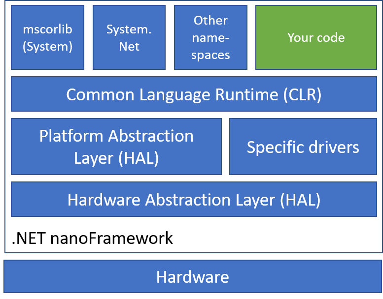
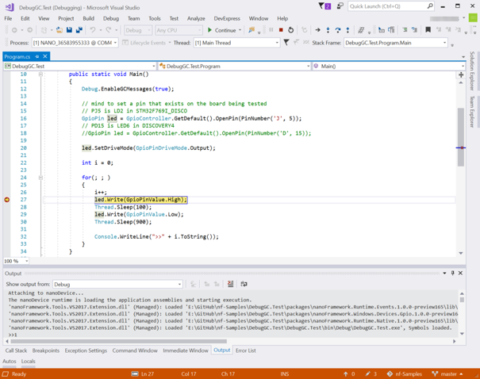
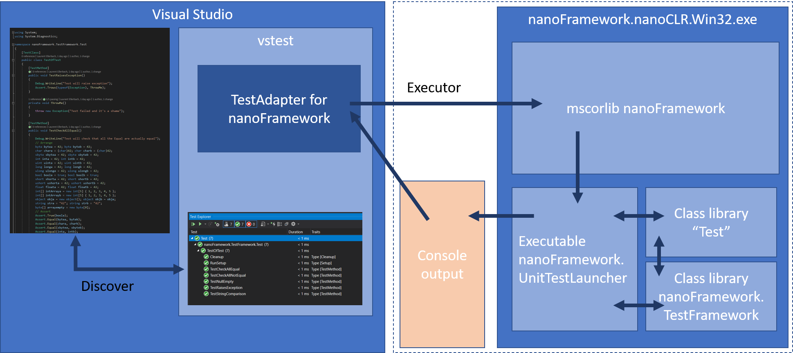
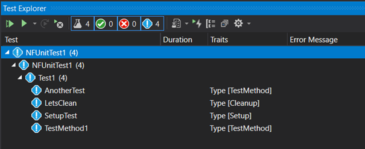
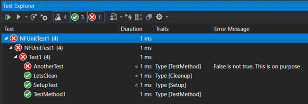
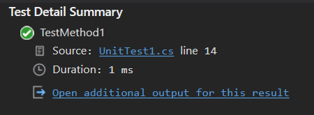
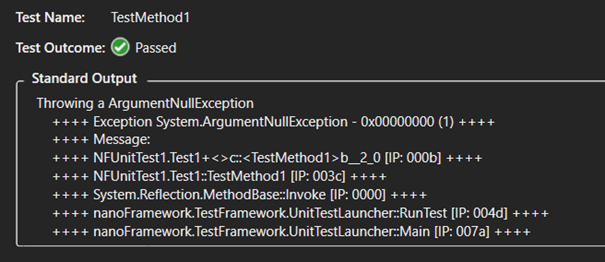
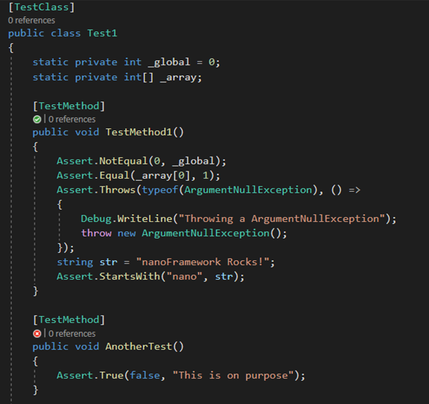
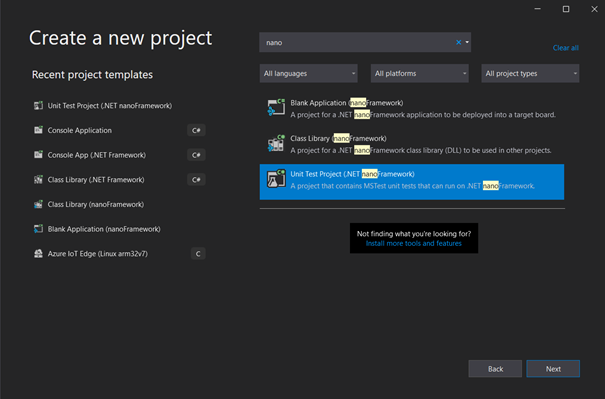
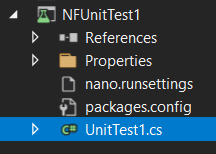

I'm a Principal Software Engineer Manager at Microsoft working for Commercial Software Engineering team. My team and I are doing co-engineering with our largest customers helping them in their digital transformation and focussing on Azure. I'm more focussing on Manufacturing industry and I've been involved in IoT for a very long time. I've been a contributor to [.NET IoT](https://github.com/dotnet/iot) and quickly became one of the main contributors which drove me to work very closely with the .NET team. As a fan of C# since day 1, I'm always looking at fun and innovative way to use it as much as I can. I was excited to discover [.NET nanoFramework](https://github.com/nanoframework/Home) and I'm working on bridging both .NET IoT and .NET nanoFramework to make it easier for a C# developer to use one or the other and reuse as much code as possible. 

[.NET nanoFramework](https://github.com/nanoframework/Home) is an implementation .NET that runs directly on very low-end microcontrollers like ESP32, ARM Cortex-M cores based like STM32, TI CC13x2 and some of the NXP family. It brings all the power of C# and .NET to write embedded code directly on those small footprint devices.

.NET nanoFramework is Open Source and [can be found on GitHub](https://github.com/nanoframework/Home). .NET nanoFramework is community driven mainly sponsored by individuals, [Eclo Solutions](http://www.eclo.solutions/), [Global Control 5](https://globalcontrol5.com/en/) and [OrgPal.IoT](https://www.orgpal.com/). .NET nanoFramework is part of the [.NET Foundation](https://dotnetfoundation.org/). It is a spin-off of .NET Microframework, with a lot of rewrite, and a lot of evolution over time. And with time, with changes, the Test framework which was present in .NET Microframework stopped working and being compatible with nanoFramework. The test framework of .NET Microframework was an internal implementation, it is different from a unit test framework as we know it.

This article will guide you on what it takes to build a unit test environment on a platform that does not have any. We will see that the .NET runtime nanoFramework is running is not the same as .NET Framework or .NET Core. It is also extremely constrained. If you're interested to understand what someone must develop for your unit test to be magic when you press the run button, this article is for you.

First, I want to highlight that nothing would have been possible without [José Simões](https://twitter.com/Jose_Simoes), CEO at Eclo Solutions, founder of .NET nanoFramework. He has been working on and  maintaining the .NET nanoFramework for years and helped me to create this unit test platform. He was recently awarded as Microsoft Most Valuable Professional (MVP), presumably in gratitude for all his efforts for .NET for embedded application scenarios.

As developers, we all love unit tests. They are a great way to increase the code quality, making sure that once you change something in the code, you won't break anything. They are the foundation of any modern software development. So, .NET nanoFramework needed support for unit testing!

What you want from unit tests is that they can run automatically, integrated in your IDE, run in a build pipeline, provide your code coverage, be easy to implement, and be able to do test driven development.  In the case of hardware development, they should run on a real device and report the results properly. You might want them to make you a good coffee but I'm not sure this will happen 😊.

We tend to take it as granted that someone must build the support for a new language or platform to run unit tests. This applies especially in the .NET world where there is a large choice with for example tools like xUnit, NUnit, Coverlet and more.

So let's see what is required to build your own unit test platform by looking at was done with.NET nanoFramework.

## .NET nanoFramework architecture

First, I will give you an introduction to the .NET nanoFramework architecture. This is .NET C# running directly on the metal on small chips like ESP32. When I write *small*, think of 520 Kb SRAM, 240 MHz clock processor, few Mb of flash memory. And that's for everything: the code, the memory allocation, everything.

.NET nanoFramework embeds a nano CLR for each supported hardware which will interpret and execute your .NET compiled code. You will find class libraries too, like System.Text. As you may guess, the libraries are minimal versions when compared with the ones that you can find in .NET 5. *Minimal* meaning that a subset of the full API is available, only the most common ones, fewer overloaded methods and constructors. There are additional class libraries to provide access to GPIO, SPI, I2C. The APIs for these protocols are very similar to the ones defined and offered by [.NET IoT](https://github.com/dotnet/iot), which helps developers reuse code from .NET 5, for example, to .NET nanoFramework.

As a developer, you have the full development experience that you are used to with Visual Studio 2019 thru a [.NET nanoFramework extension](https://marketplace.visualstudio.com/items?itemName=nanoframework.nanoFramework-VS2019-Extension) you'll have to install to support the specific project system, the build, debug and deploy onto the devices.



There is no real OS per se on those small processors, just a Real Time OS (RTOS) for threading and basic elements like [Azure RTOS](https://github.com/azure-rtos). Every chip maker is free to choose the RTOS they are supporting and .NET nanoFramework supports a large variety of them.

Each specific platform is based on a native C SDK from Espressif, STM, NXP, or TI for example. Those SDKs are represented in the architecture as *Hardware Abstraction Layer*. Then a second layer called Platform Abstraction Layer, as well fully written in C allows to make a standard API for the nano CLR while connecting with every specific HAL SDK.

Most of the platforms have to be flashed with a specific boot loader and also the lower layers including the nano CLR, HAL, PAL and potential specific drivers. Some of the platforms already have their own bootloader, so this is not a mandatory component.

The rest of the upper layers where the classic assemblies classes stands, including mscorlib are C# assemblies and can be flashed thru Visual Studio by just pressing F5 to run your application. It's important to add that there is a native interop possibility with C/C++ component. The native part will have to be deployed like the rest of the C code. The native code exposes the functions to your C# code.

To build the C# code, the normal build chain for .NET C# is used producing a DLL/EXE and PDB files that are similar to a .NET 5 C# build. The PDB file contains the debug information. Then a post build operation is done to transform the DLL/EXE into a light portable executable (PE) file and the PDB file to a PDBX file. This PE file is the one uploaded to the device and executed. You can of course load multiple PE files, typical example would be an executable and the dependent libraries, including mscorlib. This is important to keep in mind, we will understand why later.

The experience you have as a developer when running the code and debugging on the device is the same as for any .NET application. You can set breakpoint, get the variable data, step in, set the next statement.



## The problems to solve for a proper unit test platform

Back to what we want as a developer to run our tests, there are quite some problems to solve for .NET nanoFramework:

- How to run tests where you need to discover the code in nano?
- How to run tests on a Windows machine?
- How to run tests on a real device?
- How to have functions you can call before and after the test? Typically to setup hardware properly.
- How to run the test both on the Windows machine and on the hardware the exact same way?
- How to integrate all this with Visual Studio 2019?
- How to run tests in a pipeline for Quality Assurance?
- How to have proper test code coverage?
- How to make it as simple as creating a xUnit Test project in Visual Studio?

## The Test Framework

While those problems are generic, applied to .NET nanoFramework, we can look at what was available as building blocks to use.

The first one is the fact that .NET nanoFramework has some System.Reflection capabilities with support for simple attributes. So the familiar `[Fact]` and other method decoration could be used as a mechanism to recognize which methods contains tests.

There is a support of course for Exception and Exception handling, so the familiar Assert functions can be used as well. So putting all together, the model of having a void function that will run the test and raises an exception if there is an unexpected result will work.

To handle the fact that some methods need to be run at setup and to clean the device at the end can be handled with specific attributes.

We can have the following example when everything is put together for this part of the solving how the Test Framework will look like:

```csharp
using nanoFramework.TestFramework;
using System;
using System.Diagnostics;

namespace NFUnitTest1
{
    [TestClass]
    public class Test1
    {
        static private int _global = 0;
        static private int[] _array;

        [TestMethod]
        public void TestMethod1()
        {
            Assert.NotEqual(0, _global);
            Assert.Equal(_array[0], 1);
            Assert.Throws(typeof(ArgumentNullException), () =>
            {
                Debug.WriteLine("Throwing a ArgumentNullException");
                throw new ArgumentNullException();
            });
            string str = "nanoFramework Rocks!";
            Assert.StartsWith("nano", str);
        }

        [TestMethod]
        public void AnotherTest()
        {
            Assert.True(false, "This is on purpose");
        }

        [Setup]
        public void SetupTest()
        {
            _global = 42;
            _array = new int[3] { 1, 4, 9 };
            Assert.Equal(42, _global);
        }

        [Cleanup]
        public void LetsClean()
        {
            Assert.NotEmpty(_array);
            _array = null;
            Assert.Null(_array);
        }
    }
}
```

We will reuse this example later and see how to run this on the Windows development machine or on a device, gather the results, display them in Visual Studio 2019 and have code coverage information.

## The unit test launcher

The key question now is to find a way to launch those tests. For this part, we will use the reflection present in .NET nanoFramework and catch all possible exceptions to check if a test pass or fail.

The core part of the launcher looks like this:

```csharp
Assembly test = Assembly.Load("NFUnitTest");

Type[] allTypes = test.GetTypes();

foreach (var type in allTypes)
{
    if (type.IsClass)
    {
        var typeAttribs = type.GetCustomAttributes(true);
        foreach (var typeAttrib in typeAttribs)
        {
            if (typeof(TestClassAttribute) == typeAttrib.GetType())
            {
                var methods = type.GetMethods();
                // First we look at Setup
                RunTest(methods, typeof(SetupAttribute));
                // then we run the tests
                RunTest(methods, typeof(TestMethodAttribute));
                // last we handle Cleanup
                RunTest(methods, typeof(CleanupAttribute));
            }
        }
    }
}

private static void RunTest(
    MethodInfo[] methods,
    Type attribToRun)
{
    long dt;
    long totalTicks;

    foreach (var method in methods)
    {
        var attribs = method.GetCustomAttributes(true);

        foreach (var attrib in attribs)
        {
            if (attribToRun == attrib.GetType())
            {
                try
                {
                    dt = DateTime.UtcNow.Ticks;
                    method.Invoke(null, null);
                    totalTicks = DateTime.UtcNow.Ticks - dt;

                    Debug.WriteLine($"Test passed: {method.Name}, {totalTicks}");
                }
                catch (Exception ex)
                {
                    Debug.WriteLine($"Test failed: {method.Name}, {ex.Message}");
                }

            }
        }
    }
}

```

In short, the launcher loads an assembly that has to be called _NFUnitTest_ then find all the test classes, all the test methods and runs all of them. First all the Setup ones, then the TestMethod ones and finally the Cleanup ones. So far, the choice has been made to impose the _NFUnitTest_ as the assembly name that will contain the tests. The reflection present in .NET nanoFramework does not allow yet to find all the possible assemblies and try them all. There also isn't the possibility to pass some command line arguments to the main function. Those are elements that we are looking into implementing in the future.

While loading the _NFUnitTest_ assembly, all the needed dependent assemblies are loaded as well by the nano CLR. So the tests can cover as many dependencies as you'd like and can load on the device. We'll see later about the challenge of finding them and uploading on the device or running them on a regular Windows machine.

_Debug.WriteLine_ is used to output the results of the tests. It is a fairly simple way and comes with few challenges: we'll need to make sure we can gather the output from the device. As a challenge, an optimization is done while building .NET  in Release mode, all the Debug.\* are purely removed from the build. Same behavior applies to .NET nanoFramework as the tool chain used is the same. So this specific component must be always compiled and distributed as a Debug version to make sure the Debug.\* will always be available. The other challenge is on the parsing side, gathering the right information, making sure that the rest of the content is not using this pattern.

Second and more complicated part is to be able to collect this output from the device and on a Windows machine. The good news here is that there is this mechanism already in place distributed with the [.NET nanoFramework extension](https://marketplace.visualstudio.com/items?itemName=nanoframework.nanoFramework-VS2019-Extension) for Visual Studio 2019.

## nanoCLR Win32 application

While I've explained that there is a mechanism to upload and run code, gather the debug information on a device, I did not yet explain how to run .NET nanoFramework on a Windows machine. The assemblies can't just be loaded even in a different application domain and run. That will fail because .NET nanoFramework has its own Base Class Library and CLR, not to mention a HAL and PAL.

Similarly with what happens for any of the hardware platforms we support, we have a build for Windows 32. It includes a CLR, the BCL, and other namespaces. The assembly loading mechanism is slightly different from the one that runs on an microcontroller, but, apart from that, all the rest is the exact same code. The Windows build is an executable that accepts parameters from the command line, like any typical console application, and that's how the assemblies are loaded.

This makes it very convenient to use in scenarios like running unit tests, use on Azure DevOps pipeline and similar ones.

## Visual Studio Adapter Extensibility

Visual Studio Test offers extensibility to discover, run the tests and gather the results in Visual Studio through the [Adapter Extensibility](https://github.com/Microsoft/vstest-docs/blob/master/RFCs/0004-Adapter-Extensibility.md). It can also be used from the command line or in a pipeline with the _vstest.console.exe_ executable.

Looking at the target architecture and summarizing what we've seen before, we now have the following:



On the right, the nanoCLR Win32 application that is loaded with the unit test launcher, the Test Framework and of course the assemblies to test. The output goes into the console.

The TestAdapter should then be able to gather the output coming from the execution of the Test assembly and processes it. Before this, the first challenge is to discover the tests. Let's look at how this is done.

## Test Discovery

The ITestDiscover interface has one method [DiscoverTests](https://github.com/nanoframework/nanoFramework.TestFramework/blob/4909e4e035e5ff203ee7b4e8385a82f727ebb453/source/TestAdapter/Discover.cs#L32) which obviously is here to discover the tests. As you can remember from the .NET nanoFramework architecture, the C# code is compiled through the normal build pipeline producing a DLL/EXE and PDB file.

```csharp
public static List<TestCase> FindTestCases(string source)
{
    List<TestCase> testCases = new List<TestCase>();

    var nfprojSources = FindNfprojSources(source);
    if (nfprojSources.Length == 0)
    {
        return testCases;
    }

    var allCsFils = GetAllCsFileNames(nfprojSources);

    Assembly test = Assembly.LoadFile(source);
    AppDomain.CurrentDomain.AssemblyResolve += App_AssemblyResolve;
    AppDomain.CurrentDomain.Load(test.GetName());

    Type[] allTypes = test.GetTypes();
    foreach (var type in allTypes)
    {
        if (type.IsClass)
        {
            var typeAttribs = type.GetCustomAttributes(true);
            foreach (var typeAttrib in typeAttribs)
            {
                if (typeof(TestClassAttribute).FullName == typeAttrib.GetType().FullName)
                {
                    var methods = type.GetMethods();
                    // First we look at Setup
                    foreach (var method in methods)
                    {
                        var attribs = method.GetCustomAttributes(true);

                        foreach (var attrib in attribs)
                        {
                            if (attrib.GetType().FullName == typeof(SetupAttribute).FullName ||
                            attrib.GetType().FullName == typeof(TestMethodAttribute).FullName ||
                            attrib.GetType().FullName == typeof(CleanupAttribute).FullName)
                            {
                                var testCase = GetFileNameAndLineNumber(allCsFils, type, method);
                                testCase.Source = source;
                                testCase.ExecutorUri = new Uri(TestsConstants.NanoExecutor);
                                testCase.FullyQualifiedName = $"{type.FullName}.{testCase.DisplayName}";
                                testCase.Traits.Add(new Trait("Type", attrib.GetType().Name.Replace("Attribute","")));
                                testCases.Add(testCase);
                            }
                        }
                    }

                }
            }
        }
    }

    return testCases;
}
private static Assembly App_AssemblyResolve(object sender, ResolveEventArgs args)
{
    string dllName = args.Name.Split(new[] { ',' })[0] + ".dll";
    string path = Path.GetDirectoryName(args.RequestingAssembly.Location);
    return Assembly.LoadFrom(Path.Combine(path, dllName));
}
```

To make it easier to process at first, there are few conventions we'll have to follow for the tests project. All the .NET nanoFramework projects are nfproj files, not csproj file. The reason is because of lack of Target Framework Moniker (TFM). The second convention used is that the \bin\Release or \bin\Debug directories has to be child of those nfproj files.

The discovery happens with source files passed to the Test Adapter as full path names. To identify a .NET nanoFramework project, a nfproj file is searched in the directory tree and all the associated cs files are searched. Those conventions simplify the search process.

Now, despite of .NET nanoFramework has its own mscorlib, it's still a .NET assembly, therefore we can apply some of the .NET magic: using reflection on the nanoFramework assemblies to discover potential tests!

Because mscorlib version is different than the one running in the main code, we have to first creating an Application Domain, loading the assembly and its dependencies. And here, there is another trick that's most convenient for what we are trying to accomplish: when building a .NET nanoFramework assembly, all its dependencies get into the build folder. Loading the dependencies, it's a simple matter of just loading every assembly that's present in this folder. That does simplify a lot the process.

Once you have the assembly loaded, you can use reflection and find out all the possible methods through the test attributes.

At this stage it's a bit tricky as well to find the line numbers for each specific test. As per the previous convention, all the CS files are part of a sub directory and as for some of the other .NET tests framework, a file parsing is done to find the correct line number. This is a compromise needed as we cannot really execute the .NET nanoFramework code into the Application Domain. That will fail because of the lack of HAL and PAL.

The list of tests can be passed back to Visual Studio. And taking our previous example, we will have this into the Test Explorer window:



Traits are used to identify the type of test methods and making it easy to find the Setup, Cleanup ones.

## Test Executor

The [ITestExecutor](https://github.com/nanoframework/nanoFramework.TestFramework/blob/4909e4e035e5ff203ee7b4e8385a82f727ebb453/source/TestAdapter/Executor.cs#L75) interface is the one thru which the tests are run and the results output. The tests can be launched thru Visual Studio or from the command line tool. When launched thru the command line, the discovery has to happen first. When ran through Visual Studio 2019, only the tests' part needs to run, the discovery is done through the Adapter Extensibility.

The complexity here is multiple and different of the tests are to be run on the device or in the nanoCLR Win32 application. In any of these cases, finding all the PE files and loading them it's not much of a challenge as they are all in the same directory. But wait, here is something important: you can't run nanoCLR on a HAL/PAL that is not designed for it. The reason is that the calls between the C# code and their native counterparts have to match otherwise bad things will happen. Remember, the C# "connected" to C code through that interop layer. Changing one of the function signatures and the call to its counterpart will fail or produce unexpected results. It's then important to check those specific versions especially for the hardware. But we've decided to make an exception (to a certain extent) for the nanoCLR Win32 application. And you'll understand why when reading about the chicken and egg part ahead in this post.

The specific challenge with the nanoCLR Win32 is to find the application and being able to always load the latest version to make sure we're always running on the latest HAL/PAL. You'll understand the general distribution mechanism when reading the NuGet section. The NuGet package provides the unit test launcher, the test framework, and a version of the nanoCLR Win32.

The mechanism used is based on the possibility, as we're using the same build chain as any other .NET C# code, to have specific targets. You will find the targets file in [the repository](https://github.com/nanoframework/nanoFramework.TestFramework/blob/develop/source/nanoFramework.TestFramework.targets). While building the system will check if the latest version is present and install it if needed.

While it will be too long to explain in detail all the mechanism in place to upload the code on the device, run it and gather the results thru the debug channel, [from the code](https://github.com/nanoframework/nanoFramework.TestFramework/blob/4909e4e035e5ff203ee7b4e8385a82f727ebb453/source/TestAdapter/Executor.cs#L180), the steps are the following: discover the device, the debug and the connection to a device is done by serial port.

Each device is flashed with a boot loader and the nanoCLR. They respond to a &quot;ping&quot; packet. Once a device is queried and responds properly, it's safe to assume that we have a valid .NET nanoFramework device at the other end and that it's running the debugger engine. The next step is to erase the deployment area of the device memory and check that the device is back to its initialized state.

Once this state is reached, we check the versions of all the assemblies and the compatibility with the device. This is done by decompiling the DLL/EXE and checking the version. One more time, we're using the trick that .NET nanoFramework is real .NET code and being built with the normal build chain.

```csharp
foreach (string assemblyPath in allPeFiles)
{
    // load assembly in order to get the versions
    var file = Path.Combine(workingDirectory, assemblyPath.Replace(".pe", ".dll"));
    if (!File.Exists(file))
    {
        // Check with an exe
        file = Path.Combine(workingDirectory, assemblyPath.Replace(".pe", ".exe"));
    }

    var decompiler = new CSharpDecompiler(file, decompilerSettings); ;
    var assemblyProperties = decompiler.DecompileModuleAndAssemblyAttributesToString();
    // read attributes using a Regex
    // AssemblyVersion
    string pattern = @"(?<=AssemblyVersion\("")(.*)(?=\""\)])";
    var match = Regex.Matches(assemblyProperties, pattern, RegexOptions.IgnoreCase);
    string assemblyVersion = match[0].Value;
    // AssemblyNativeVersion
    pattern = @"(?<=AssemblyNativeVersion\("")(.*)(?=\""\)])";
    match = Regex.Matches(assemblyProperties, pattern, RegexOptions.IgnoreCase);
    // only class libs have this attribute, therefore sanity check is required
    string nativeVersion = "";
    if (match.Count == 1)
    {
        nativeVersion = match[0].Value;
    }
    assemblyList.Add(new DeploymentAssembly(Path.Combine(workingDirectory, assemblyPath), assemblyVersion, nativeVersion));
}
```

The next step is to load the assemblies into the device and launch the debug process. This will automatically find the unit test launcher which will start the mechanism.
What’s left is to gather the output from the debug engine for a further analyze:

```csharp
device.DebugEngine.OnMessage += (message, text) =>
{
    _logger.LogMessage(text, Settings.LoggingLevel.Verbose);
    output.Append(text);
    if (text.Contains(Done))
    {
        isFinished = true;
    }
};
```

On the nanoCLR Win32 side, the executable must be found in the various paths as per the previous description, and the build will ensure that the latest versions are installed. All the assemblies must be loaded as arguments in the command line. Now, as this is an external process, a Process class is used capture the Output and Error streams coming from the nanoCLR executable.

```csharp
private Process _nanoClr;
_nanoClr = new Process();
_nanoClr.StartInfo = new ProcessStartInfo(nanoClrLocation, parameter)
{
    WorkingDirectory = workingDirectory,
    UseShellExecute = false,
    RedirectStandardError = true,
    RedirectStandardOutput = true
};
_nanoClr.OutputDataReceived += (sender, e) =>
{
    if (e.Data == null)
    {
        outputWaitHandle.Set();
    }
    else
    {
        output.AppendLine(e.Data);
    }
};

_nanoClr.ErrorDataReceived += (sender, e) =>
{
    if (e.Data == null)
    {
        errorWaitHandle.Set();
    }
    else
    {
        error.AppendLine(e.Data);
    }
};

_nanoClr.Start();

_nanoClr.BeginOutputReadLine();
_nanoClr.BeginErrorReadLine();
// wait for exit, no worries about the outcome
_nanoClr.WaitForExit(runTimeout);
```

The code is what you need to create, capture the output and start the process. Pay attention to the _WaitForExit_ method that will wait for the process to exit or will kill the process after a timeout occurs. This is something important to keep in mind and we'll discuss this part when looking into the ._runsettings_ section.

In both cases, once the test run completes, the output string needs to be parsed. The parser will extract the &quot;Test passed:&quot;, &quot;Test failed:&quot; messages, the method names, the time and any Exception present there, along with anything that has been output in the debug section to make it very developer friendly.

Once you'll press the play button from the Test Explorer window, you'll quickly get the test results from our test case:



For each test case, you'll get the detail view:



And the details:



And of course, as you may expect the annotation into the code for the passed and missed tests. You'll get this for all the classes you have tests in for all the sources that Visual Studio will discover following the code path.



## .runsettings files

A nice mechanism as well is the _.runsettings_ file that can be used to pass specific settings to the Test Adapter. The file looks like that in our case:

```xml
<?xml version="1.0" encoding="utf-8"?>
<RunSettings>
   <!-- Configurations that affect the Test Framework -->
   <RunConfiguration>
       <MaxCpuCount>1</MaxCpuCount>
       <ResultsDirectory>.\TestResults</ResultsDirectory><!-- Path relative to solution directory -->
       <TestSessionTimeout>120000</TestSessionTimeout><!-- Milliseconds -->
       <TargetFrameworkVersion>Framework40</TargetFrameworkVersion>
   </RunConfiguration>
   <nanoFrameworkAdapter>
       <Logging>None</Logging>
       <IsRealHardware>False</IsRealHardware>
   </nanoFrameworkAdapter>
</RunSettings>
```

There are few tricks in this file. First the target framework version is set to _Framework40_. As this build tool chain is used to build the nanoFramework code, this will trigger the discovery from Visual Studio.

Second trick is the session timeout, some tests like some threading tests we're running can be long and you can then play with this setting to avoid having your tests stopped. It's also the mechanism used to make the test execution to stop internally.

The _nanoFrameworkAdapter_ section contains the specific settings that can be passed to the Test Adapter. This is where you can adjust the _IsRealHardware_ from _False_ to _True_ to run it from the Win32 CLR or on a real device. That's the only thing you need to change. Pressing F5 or running it in a command line or in a pipeline will be the exact same process and in full transparency from with the Win32 CLR or the real device.

This .runsettings needs to be present in the same directory as the nfproj file by convention so Visual Studio 2019 will find it and the test discovery can be processed automatically.

For a command line usage or a pipeline usage, the file can be anywhere, it has to be passed as an argument.

## Running the test in Azure DevOps pipeline

As part of each PR like in almost all serious projects nowadays, there are QA checks in place. .NET nanoFramework is using Azure DevOps and running the tests is as simple as adding a Task in Azure Pipline yaml. You can see a result example from the mscorlib build [here](https://dev.azure.com/nanoframework/CoreLibrary/_build/results?buildId=16175&amp;view=logs&amp;j=9c317a41-c6cf-53ec-384d-ce4077395c24&amp;t=43cb5900-5ded-5a12-8194-49b51339f467). You will notice that there are 43 failed tests. The reason is once the unit test framework has been put in place more than 2000 tests have been migrated from .NET Microframework. This process has brought along with the unit tests, opportunities to uncover edge cases and bugs introduced over time. As soon as those will be fixed and all tests are passing, a failure in the unit test task will prevent the merge therefore acting as a quality gate.

The Azure DevOps task looks like this:

```yml
- task: VSTest@2
  condition: and( succeeded(), ${{ parameters.runUnitTests }}, ne( variables['StartReleaseCandidate'], true ) )
  displayName: 'Running Unit Tests'
  continueOnError: true
  inputs:
    testSelector: 'testAssemblies'
    testAssemblyVer2: |
      **\*NFUnitTest*.dll
      **\*Tests*.dll
      **\*Tests*.dll
      !**\*TestAdapter*.dll
      !**\*TestFramework*.dll
      !**\obj\**
    searchFolder: '$(System.DefaultWorkingDirectory)'
    platform: '$(BuildPlatform)'
    configuration: '$(BuildConfiguration)'
    diagnosticsEnabled: true
    vsTestVersion: toolsInstaller
    codeCoverageEnabled: true
    runSettingsFile: '${{ parameters.unitTestRunsettings }}'
```

This is a very standard build task using VS Test which will run vstest.console.exe. The parameters are path to the different configuration elements including the _.runsettings_ as explained in the previous part.

The result is a TRX file: `Results File: D:\a\_temp\.\TestResults\TestResults\VssAdministrator\_WIN-C3AUQ572MAF\_2021-03-10\_13\_06\_15.trx` and the task passing or failing.

This TRX file can be used to push the results into the Azure DevOps board for example, or any other platform like SonarCloud used by .NET nanoFramework for static code analysis.

## NuGet: the friendly developer way

We have now seen the full chain and all the components that are needed, along with some of the mechanisms behind all this that make all this working. Now, we don't want to ask developers to clone a project to have the test. The core idea, since the beginning and related to what we want as developers is to be able to use it smoothly and that's fully transparent. So, for this purpose, a NuGet package is provided. This package includes the unit test launcher (build in Debug version), the test framework library (build in Release), the nanoCLR Win32 application and the update mechanism for the nanoCLR Win32.

## Visual Studio project template

Now to make it absolutely simple for the developer, once you have the [.NET nanoFramework Visual Studio 2019 Extension](https://marketplace.visualstudio.com/items?itemName=nanoframework.nanoFramework-VS2019-Extension) installed, you can create a blank Unit Test project for .NET nanoFramework by using the respective project template.



Like with any project template that we are used to, it will automatically create the right type of project, add the NuGet, put the _.runsettings_ file in place and set the correct assembly name.



And you're good to go to go to write your .NET nanoFramework tests.

## The chicken and egg problem

As we've mentioned before, .NET nanoFramework has it's own Base Class Library, or [mscorlib](https://github.com/nanoframework/lib-CoreLibrary) and friends. One of the motivations to create all the unit test framework for .NET nanoFramework was to be able to reuse, adapt and add tests. Once the framework was in place, the migration of 2000+ tests from .NET Microframework happened. This work represented 84K lines of codes added to mscorlib. It helped to discover quite some edge cases and fixing all of them is now in process.

But why is this a chicken and egg problem? Well, looking at what I wrote previously, the Unit Test Platform is distributed through a NuGet package. This package includes the Unit Test Launcher and the Test Framework which, for obvious reasons are built against a specific version of mscorlib.

Now, when you want to run the mscorlib Unit Tests, you want them to run on the version it's building at that time, not against a previous version. It does mean that all the elements must be as project reference. The tests should be project reference of mscorlib, the Unit Test Launcher and the Test Framework as well. Because .NET nanoFramework is organized in different repositories, the Test Framework one is and this make it easy to add it as a git sub module of the mscorlib one.

As this still requires a specific version of nanoCLR Win32, a fake test project has been added, which contains the NuGet package and as it is built, the latest version of the nanoCLR Win32 is pulled from the build. As mscorlib is using a native C implementation as well, that does allow to run the tests with the always up to date version, all built from source, including in the Azure DevOps pipelines.

## What's next

Now that this .NET nanoFramework unit test framework is real and fully usable. Even if as explained at the beginning, .NET Microframework have a specific test platform, the code used to run those tests can be migrated in large part and adapted to run for nanoFramework. Those test cases will be migrated to the respective class libraries where they belong to. The idea is to have a decent 80%+ coverage for all the .NET nanoFramework code.

Right now the challenge is to be able to have a proper code coverage report. Tools like Coverlet can't be used for the reasons mentioned before about the execution stack and dependencies built. .NET nanoFramework mscorlib is not properly loaded in any of those tools including the VS Test code coverage. This will require more work and a PE parser to analyze more deeply the execution path. There are options for this, one of them being the metadata processor tool, which is used today to parse the assemblies generated by Roslyn and produce the PE files that are loaded into nanoCLR. The code coverage will be part of the Test Adapter rather than the [DataCollector VS Test](https://github.com/microsoft/vstest-docs/blob/master/docs/extensions/datacollector.md) extension. The reason is because it is hard to separate the tests from the analysis of the execution itself.

## Where to start .NET nanoFramework?

To start with .NET nanoFramework, the first step is to get one of the supported devices like an ESP32. There is a list of [board reference](https://github.com/nanoframework/Home#firmware-for-reference-boards) and [community supported boards](https://github.com/nanoframework/nf-Community-Targets#available-community-boards). Then you have to follow [the step by step guide](https://docs.nanoframework.net/content/getting-started-guides/getting-started-managed.html) to install the Visual Studio 2019 extension, flash your device, create your first project and run it.

Having your own C# .NET code running on one of those embedded devices is a matter of minutes and very straight forward.

To create a unit test project, the steps are explained in this post, it's a matter of selecting the type of unit test project for nanoFramework, write a few lines and you'll be good to go! You don't even need a real device to start playing with the unit test framework.

If any help needed, the .NET nanoFramework community is very active and is using [Discord](https://discord.gg/gCyBu8T) channels. Contribution to improve .NET nanoFramework on the native C, the C# and documentation side are more than welcome. The main [.NET nanoFramework](https://github.com/nanoframework/Home) page will give you all the links you need.

I hope you've enjoyed this article, please let me know if you want more like this! Take care.
