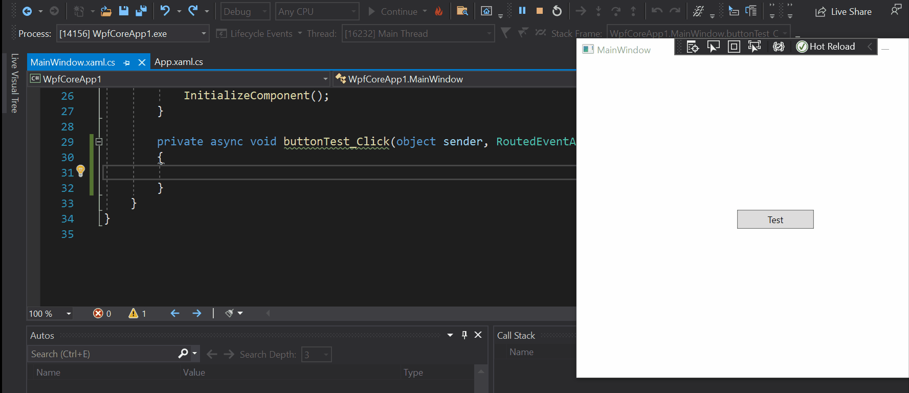

We are delighted to release .NET 6 Preview 4. We're now about half-way through the .NET 6 release. It's a good moment to look again at the full scope of .NET 6, much like the [first preview post](https://devblogs.microsoft.com/dotnet/announcing-net-6-preview-1/). Many features are in close-to-final form and others will come soon now that the foundational building blocks are in place for the release. Preview 4 establishes a solid base for delivering a final .NET 6 build in November, with finished features and experiences. It's also a solid base for real world testing if you haven't yet tried .NET 6 in your environment.

Speaking of the final release, we now have a date! Book off November 9-11 for [.NET Conf 2021](https://www.dotnetconf.net/). We'll launch .NET 6 on the 9th with many in-depth talks that tell you everything you want to know about the new release.

You can [download .NET 6 Preview 4](https://dotnet.microsoft.com/download/dotnet/6.0), for Linux, macOS, and Windows.

* [Installers and binaries](https://dotnet.microsoft.com/download/dotnet/6.0)
* [Container images](https://hub.docker.com/_/microsoft-dotnet)
* [Linux packages](https://github.com/dotnet/core/blob/main/release-notes/6.0/install-linux.md)
* [Release notes](https://github.com/dotnet/core/blob/main/release-notes/6.0/README.md)
* [Known issues](https://github.com/dotnet/core/blob/main/release-notes/6.0/known-issues.md)
* [GitHub issue tracker](https://github.com/dotnet/core/issues/6141)

See the [ASP.NET Core](https://devblogs.microsoft.com/aspnet/) and [EF Core](https://devblogs.microsoft.com/dotnet) posts for more detail on what’s new for web and data access scenarios. There's also a new [.NET MAUI and Hot reload post](https://devblogs.microsoft.com/dotnet) that was published today that describes new client app experiences.

.NET 6 has been tested with [Visual Studio 16.10](https://visualstudio.microsoft.com/vs/) and [Visual Studio for Mac 8.9](https://visualstudio.microsoft.com/vs/mac/). We recommend you use those builds if you want to try .NET 6 with [Visual Studio](https://visualstudio.microsoft.com/).

## Build 2021

The [Microsoft Build conference](https://build.microsoft.com/) is this week. It's free and streaming on the web. It's also not too late to register.

You'll want to checkout these three talks for sure, which will include lots of discussion of .NET 6 and demos that show you what's new and now possible.

* [The future of modern application development with .NET](https://aka.ms/Build2021-BRK213)
* [.NET 6 deep dive; what's new and what's coming](https://aka.ms/Build2021-OD485)
* [.NET Team "Ask the Experts"](https://aka.ms/Build2021-ATEBRK213)

## .NET 6 Themes

We started [planning .NET 6](https://themesof.net/) in late 2020 on GitHub. We identified eight themes across a wide set of topics, including industry scenarios, support, and education. The themes represent half to three quarters of our effort for the release. There are many projects that don't rise to the level of a theme or that are significant but not thematic (like supporting Apple Silicon devices).

The following are the .NET 6 themes, each described with a one sentence summary. They are listed in the same order they are displayed in [themesof.net](https://themesof.net/).

* [.NET appeals to new developers, and students](https://github.com/dotnet/core/issues/5465) -- Deliver intentionally streamlined experiences in Visual Studio products, with clear docs, simpler code models with fewer files and concepts to learn, and intuitive paths to deploying artifacts to test and production environments.
* [.NET has a great client app development experience](https://github.com/dotnet/core/issues/5423) -- Deliver a cross-platform client app foundation that seamlessly caters to desktop, mobile, and web developers and that builds on and extends existing application types like Blazor, and Xamarin.
* [.NET is recognized as a compelling framework for building cloud native apps](https://github.com/dotnet/core/issues/5397) -- Deliver fundamental cloud-native features primarily aimed at performance and observability, improved integration with the cloud-native and [container](https://devblogs.microsoft.com/dotnet/category/containers/) ecosystems, and a cloud-native component ([yarp](https://github.com/microsoft/reverse-proxy)) that demonstrates much of the value of .NET with a critical cloud use case.
* [Enterprise and LTS](https://github.com/dotnet/core/issues/5238) -- Deliver simpler and more predictable models for using .NET with mission critical apps and better cater to the needs of large enterprise and government customers.
* [Grow the .NET ecosystem through increased Quality, Confidence, and Support](https://github.com/dotnet/core/issues/5415) -- Establish a long-term community collaboration that intends to elevate community developers to a similar level as Microsoft, and (on the flip-side) delivers new features and experiences that make it easier for enterprise developers to depend on libraries from community open source projects that are not necessarily affiliated with or backed by a large company.
* [Improve inner-loop performance for .NET developers](https://github.com/dotnet/core/issues/5510) -- Deliver developer productivity improvements that include improving build performance, Hot Restart and Hot Reload.
* [Improve startup and throughput using runtime execution information (PGO)](https://github.com/dotnet/core/issues/5491) -- Deliver a new model for improved performance based on runtime information that can be used for faster startup, higher throughput and smaller binaries.
* [Meeting Developer Expectations](https://github.com/dotnet/core/issues/5366) -- Deliver improvements across the .NET product based on feedback and to enable new scenarios with existing features.

Some of these themes are discussed in more detail in the following posts:

- [.NET 6 Preview 1](https://devblogs.microsoft.com/dotnet/announcing-net-6-preview-1/)
- [.NET 6 Preview 2](https://devblogs.microsoft.com/dotnet/announcing-net-6-preview-2/)
- [Conversation about PGO](https://devblogs.microsoft.com/dotnet/conversation-about-pgo/)

## .NET Platform unification

We've talked a lot in past posts and at conferences about [.NET unification](https://devblogs.microsoft.com/dotnet/introducing-net-5/) yet it is  missing from the themes. Platform unification is baked into everything we do and has no need for its own theme. One can think of it as being the one mega-theme above and beyond the ones that are listed. It is interleaved through multiple of the themes and is a basic assumption of the team going forward.

The [inner-loop performance project](https://github.com/dotnet/core/issues/5510) is a great example. It assumes that .NET 6 apps all share the same foundation, for example using the same build system and libraries. Where there is a technical difference, like using a different runtime (CoreCLR or Mono) or code generation technique (AOT or JIT), we take those things into account and deliver pragmatic and appropriate experiences, with a bias to no observable experience difference. The [EventPipe project](https://github.com/dotnet/core/issues/6098#issuecomment-847257286) is another similar example.

## Production confidence

We'll soon start releasing "go live" builds that are supported in production. We're currently targeting August for that. Our development model is oriented around enabling production workloads, even while we're finishing up work on all the themes that were just mentioned.

Production confidence begins with the [dotnet.microsoft.com](https://dotnet.microsoft.com/) site. It's been running half its site load on .NET 6 starting with Preview 1. While not massive scale, it is a mission critical site for our team and we take it very seriously. .NET 6 has been working for us like a champ.

We also work with Microsoft teams who deploy their production apps on .NET previews. They do that so they can take advantage of new .NET features early. These teams are always looking for opportunities to reduce their cloud hosting costs, and deploying new .NET versions has proven to be one of the most effective approaches for that. These teams give us early feedback that helps us ensure new features are ready for global production use. They also significantly influence final feature shape because they are our first production users.

All of this early battle-testing with real-world apps builds our confidence that .NET 6 will be ready for running your app.

The remainder of the post is dedicated to features that are new in Preview 4.

## Tools: Hot Reload with the Visual Studio debugger and `dotnet` CLI

Hot Reload is a new experience that enables you to make edits to your app's source code while it is running without needing to manually pause the app or hit a breakpoint. Hot Reload improves developer productivity by reducing the number of times you need to restart your running app.

With this release, Hot Reload works on many types of projects such as WPF, Windows Forms, WinUI, ASP.NET, Console Apps and other frameworks that are running on top of the CoreCLR runtime. We’re also working to bring this technology to WebAssembly, iOS and Android apps, powered by Mono, but this is not yet available in Preview 4.

To start testing this feature install [Visual Studio 2019 version 16.11 Preview 1]( https://visualstudio.microsoft.com/vs/preview/) and start your app with the Visual Studio debugger (F5). Once your app is running, you’ll now have the new option to make code changes and apply them using the new “apply code changes” button as illustrated below.



Hot Reload is also available through the `dotnet watch` tool. Preview 4 includes multiple fixes that improve that experience.

If you want to learn more about Hot Reload you can get additional details by reading [Introducing .NET Hot Reload]( https://aka.ms/build2021-hotreload).

## System.Text.Json support for IAsyncEnumerable

`IAsyncEnumerable<T>` is an important feature that was added with .NET Core 3.0 and C# 8. The new [enhancements](https://github.com/dotnet/runtime/issues/1570) enable `System.Text.Json` (de)serialization with `IAsyncEnumerable<T>` objects.

The following examples use streams as a representation of any async source of data. The source could be files on a local machine, or results from a database query or web service API call.

### Streaming serialization

System.Text.Json now supports serializing `IAsyncEnumerable<T>` values as JSON arrays, as you can see in the following example.

```csharp
using System;
using System.Collections.Generic;
using System.IO;
using System.Text.Json;

static async IAsyncEnumerable<int> PrintNumbers(int n)
{
    for (int i = 0; i < n; i++) yield return i;
}

using Stream stream = Console.OpenStandardOutput();
var data = new { Data = PrintNumbers(3) };
await JsonSerializer.SerializeAsync(stream, data); // prints {"Data":[0,1,2]}
```

`IAsyncEnumerable` values are only supported using the asynchronous serialization methods. Attempting to serialize using the synchronous methods will result in a `NotSupportedException` being thrown.

### Streaming deserialization

Streaming deserialization required a new API that returns `IAsyncEnumerable<T>`. We added the `JsonSerializer.DeserializeAsyncEnumerable` method for this purpose, as you can see in the following example.

```csharp
using System;
using System.IO;
using System.Text;
using System.Text.Json;

var stream = new MemoryStream(Encoding.UTF8.GetBytes("[0,1,2,3,4]"));
await foreach (int item in JsonSerializer.DeserializeAsyncEnumerable<int>(stream))
{
    Console.WriteLine(item);
}
```

This example will deserialize elements on-demand and can be useful when consuming particularly large data streams. It only supports reading from root-level JSON arrays, although that could be relaxed in the future based on feedback.

The existing `DeserializeAsync` method nominally supports `IAsyncEnumerable<T>`, but within the confines of its non-streaming method signature. It must return the final result as a single value, as you can see in the following example.

```csharp
using System;
using System.Collections.Generic;
using System.IO;
using System.Text;
using System.Text.Json;

var stream = new MemoryStream(Encoding.UTF8.GetBytes(@"{""Data"":[0,1,2,3,4]}"));
var result = await JsonSerializer.DeserializeAsync<MyPoco>(stream);
await foreach (int item in result.Data)
{
    Console.WriteLine(item);
}

public class MyPoco
{
    public IAsyncEnumerable<int> Data { get; set; }
}
```

In this example, the deserializer will have buffered all `IAsyncEnumerable` contents in memory before returning the deserialized object. This is because the deserializer needs to have consumed the entire JSON value before returning a result.

## System.Text.Json: Writable DOM Feature

The [writeable JSON DOM feature](https://github.com/dotnet/designs/blob/main/accepted/2020/serializer/WriteableDomAndDynamic.md) adds a new straightforward and high-performance programming model for `System.Text.Json`. This new API is attractive since it avoids the complexity and ceremony of serialization and the traditional cost of a DOM.

This new API has the following benefits:

* A lightweight alternative to serialization for cases when use of POCO types is not possible or desired, or when a JSON schema is not fixed and must be inspected.
* Enables efficient modification of a subset of a large tree. For example, it is possible to efficiently navigate to a subsection of a large JSON tree and read an array or deserialize a POCO from that subsection. LINQ can also be used with that.
* Enables using the C# `dynamic` keyword, which allows for a loosely-typed, more script-like model.

We're looking for [feedback on support for `dynamic`](https://github.com/dotnet/runtime/issues/53195). Please give us your feedback if `dynamic` support is important to you.

More details are available at [dotnet/runtime #6098](https://github.com/dotnet/core/issues/6098#issuecomment-840857013).

### Writeable DOM APIs

The writeable DOM exposes the following types.

```cs
namespace System.Text.Json.Node
{
    public abstract class JsonNode {...};
    public sealed class JsonObject : JsonNode, IDictionary<string, JsonNode?> {...}
    public sealed class JsonArray : JsonNode, IList<JsonNode?> {...};
    public abstract class JsonValue : JsonNode {...};
}
```

### Example code

The following example demonstrates the new programming model.

```cs
    // Parse a JSON object
    JsonNode jNode = JsonNode.Parse("{\"MyProperty\":42}");
    int value = (int)jNode["MyProperty"];
    Debug.Assert(value == 42);
    // or
    value = jNode["MyProperty"].GetValue<int>();
    Debug.Assert(value == 42);

    // Parse a JSON array
    jNode = JsonNode.Parse("[10,11,12]");
    value = (int)jNode[1];
    Debug.Assert(value == 11);
    // or
    value = jNode[1].GetValue<int>();
    Debug.Assert(value == 11);

    // Create a new JsonObject using object initializers and array params
    var jObject = new JsonObject
    {
        ["MyChildObject"] = new JsonObject
        {
            ["MyProperty"] = "Hello",
            ["MyArray"] = new JsonArray(10, 11, 12)
        }
    };

    // Obtain the JSON from the new JsonObject
    string json = jObject.ToJsonString();
    Console.WriteLine(json); // {"MyChildObject":{"MyProperty":"Hello","MyArray":[10,11,12]}}

    // Indexers for property names and array elements are supported and can be chained
    Debug.Assert(jObject["MyChildObject"]["MyArray"][1].GetValue<int>() == 11);
```

## Microsoft.Extensions.Logging compile-time source generator

.NET 6 introduces the `LoggerMessageAttribute` type. This attribute is part of the `Microsoft.Extensions.Logging` namespace, and when used, it source-generates performant logging APIs. The source-generation logging support is designed to deliver a highly usable and highly performant logging solution for modern .NET applications. The auto-generated source code relies on the `ILogger` interface in conjunction with `LoggerMessage.Define` functionality.

The source generator is triggered when `LoggerMessageAttribute` is used on `partial` logging methods. When triggered, it is either able to autogenerate the implementation of the `partial` methods it's decorating, or produce compile-time diagnostics with hints about proper usage. The compile-time logging solution is typically considerably faster at run time than existing logging approaches. It achieves this by eliminating boxing, temporary allocations, and copies to the maximum extent possible.

There are benefits over manually using `LoggerMessage.Define` APIs directly:

- Shorter and simpler syntax: Declarative attribute usage rather than coding boilerplate.
- Guided developer experience: The generator gives warnings to help developers do the right thing.
- Support for an arbitrary number of logging parameters. `LoggerMessage.Define` supports a maximum of six.
- Support for dynamic log level. This is not possible with `LoggerMessage.Define` alone.

If you would like to keep track of improvements and known issues, see [dotnet/runtime#52549](https://github.com/dotnet/runtime/issues/52549).

### Basic usage

To use the `LoggerMessageAttribute`, the consuming class and method need to be `partial`. The code generator is triggered at compile time, and generates an implementation of the `partial` method.

```csharp
public static partial class Log
{
    [LoggerMessage(EventId = 0, Level = LogLevel.Critical, Message = "Could not open socket to `{hostName}`")]
    public static partial void CouldNotOpenSocket(ILogger logger, string hostName);
}
```

In the preceding example, the logging method is `static` and the log level is specified in the attribute definition. When using the attribute in a static context, the `ILogger` instance is required as a parameter. You may choose to use the attribute in a non-static context as well. For more examples and usage scenarios visit the [docs](https://docs.microsoft.com/dotnet/core/extensions/logger-message-generator) for the compile-time logging source generator.

## System.Linq enhancements

[New System.LINQ APIs](https://github.com/dotnet/runtime/issues/47231) have been added that have been requested and contributed by the community.

### Enumerable support for `Index` and `Range` parameters

The `Enumerable.ElementAt` method now accepts indices from the end of the enumerable, as you can see in the following example.

```csharp
Enumerable.Range(1, 10).ElementAt(^2); // returns 9
```

An `Enumerable.Take` overload has been added that accepts `Range` parameters. It simplifies taking slices of enumerable sequences:

* `source.Take(..3)` instead of `source.Take(3)`
* `source.Take(3..)` instead of `source.Skip(3)`
* `source.Take(2..7)` instead of `source.Take(7).Skip(2)`
* `source.Take(^3..)` instead of `source.TakeLast(3)`
* `source.Take(..^3)` instead of `source.SkipLast(3)`
* `source.Take(^7..^3)` instead of `source.TakeLast(7).SkipLast(3)`.

Credit to [@dixin](https://github.com/dixin) for contributing the implementation.

### `TryGetNonEnumeratedCount`

The `TryGetNonEnumeratedCount` method attempts to obtain the count of the source enumerable without forcing an enumeration. This approach can be useful in scenarios where it is useful to preallocate buffers ahead of enumeration, as you can see in the following example.

```csharp
List<T> buffer = source.TryGetNonEnumeratedCount(out int count) ? new List<T>(capacity: count) : new List<T>();
foreach (T item in source)
{
    buffer.Add(item);
}
```

`TryGetNonEnumeratedCount` checks for sources implementing `ICollection`/`ICollection<T>` or takes advantage of some of the [internal optimizations employed by Linq](https://github.com/dotnet/runtime/blob/a123d28793ad22954ca6d9074f43b540d0d30b43/src/libraries/System.Linq/src/System/Linq/IIListProvider.cs).

### `DistinctBy`/`UnionBy`/`IntersectBy`/`ExceptBy`

New variants have been added to the set operations that allow specifying equality using key selector functions, as you can see in the following example.

```csharp
Enumerable.Range(1, 20).DistinctBy(x => x % 3); // {1, 2, 3}

var first = new (string Name, int Age)[] { ("Francis", 20), ("Lindsey", 30), ("Ashley", 40) };
var second = new (string Name, int Age)[] { ("Claire", 30), ("Pat", 30), ("Drew", 33) };
first.UnionBy(second, person => person.Age); // { ("Francis", 20), ("Lindsey", 30), ("Ashley", 40), ("Drew", 33) }
```

### `MaxBy`/`MinBy`

`MaxBy` and `MinBy` methods allow finding maximal or minimal elements using a key selector, as you can see in the following example.

```csharp
var people = new (string Name, int Age)[] { ("Francis", 20), ("Lindsey", 30), ("Ashley", 40) };
people.MaxBy(person => person.Age); // ("Ashley", 40)
```

### `Chunk`

`Chunk` can be used to chunk a source enumerable into slices of a fixed size, as you can see in the following example.

```csharp
IEnumerable<int[]> chunks = Enumerable.Range(0, 10).Chunk(size: 3); // { {0,1,2}, {3,4,5}, {6,7,8}, {9} }
```

Credit to [Robert Andersson](https://github.com/inputfalken) for contributing the implementation.

### `FirstOrDefault`/`LastOrDefault`/`SingleOrDefault` overloads taking default parameters

The existing `FirstOrDefault`/`LastOrDefault`/`SingleOrDefault` methods return `default(T)` if the source enumerable is empty. New overloads have been added that accept a default parameter to be returned in that case, as you can see in the following example.

```csharp
Enumerable.Empty<int>().SingleOrDefault(-1); // returns -1
```

Credit to [@Foxtrek64](https://github.com/Foxtrek64) for contributing the implementation.

### `Zip` overload accepting three enumerables

The [Zip](https://docs.microsoft.com/dotnet/api/system.linq.enumerable.zip) method now supports combining three enumerables, as you can see in the following example.

```csharp
var xs = Enumerable.Range(1, 10);
var ys = xs.Select(x => x.ToString());
var zs = xs.Select(x => x % 2 == 0);

foreach ((int x, string y, bool z) in Enumerable.Zip(xs,ys,zs))
{
}
```

Credit to [Huo Yaoyuan](https://github.com/huoyaoyuan) for contributing the implementation.

## Significantly improved FileStream performance on Windows

`FileStream` has been re-written in .NET 6, to have much higher performance and reliability on Windows.

The [re-write project](https://github.com/dotnet/runtime/issues/40359) has been phased over five PRs:

* [Introduce FileStreamStrategy as a first step of FileStream rewrite](https://github.com/dotnet/runtime/pull/47128)
* [FileStream rewrite part II](https://github.com/dotnet/runtime/pull/48813)
* [FileStream optimizations](https://github.com/dotnet/runtime/pull/49975)
* [FileStream rewrite: Use IValueTaskSource instead of TaskCompletionSource](https://github.com/dotnet/runtime/pull/50802)
* [FileStream rewrite: Caching the ValueTaskSource in AsyncWindowsFileStreamStrategy](https://github.com/dotnet/runtime/pull/51363)

The final result is that `FileStream` never blocks when created for async IO, on Windows. That's a major improvement. You can observe that in the benchmarks, which we'll look at shortly.

### Configuration

The first PR enables `FileStream` to choose an implementation at runtime. The most obvious benefit of this pattern is enabling switching back to the old .NET 5 implementation, which you can do with the following setting, in `runtimeconfig.json`.

```json
{
    "configProperties": {
        "System.IO.UseNet5CompatFileStream": true
    }
}
```

We plan to add an [`io_uring` strategy](https://github.com/dotnet/runtime/issues/51985) next, which takes advantage of a Linux feature by the same name in [recent kernels](https://github.com/dotnet/runtime/issues/51985#issuecomment-841907674).

### Performance benchmark

Let's measure the improvements using [BenchmarkDotNet](https://github.com/dotnet/BenchmarkDotNet).

```csharp
public class FileStreamPerf
{
    private const int FileSize = 1_000_000; // 1 MB
    private Memory<byte> _buffer = new byte[8_000]; // 8 kB

    [GlobalSetup(Target = nameof(ReadAsync))]
    public void SetupRead() => File.WriteAllBytes("file.txt", new byte[FileSize]);

    [Benchmark]
    public async ValueTask ReadAsync()
    {
        using FileStream fileStream = new FileStream("file.txt", FileMode.Open, FileAccess.Read, FileShare.Read, bufferSize: 4096, useAsync: true);
        while (await fileStream.ReadAsync(_buffer) > 0)
        {
        }
    }

    [Benchmark]
    public async ValueTask WriteAsync()
    {
        using FileStream fileStream = new FileStream("file.txt", FileMode.Create, FileAccess.Write, FileShare.Read, bufferSize: 4096, useAsync: true);
        for (int i = 0; i < FileSize / _buffer.Length; i++)
        {
            await fileStream.WriteAsync(_buffer);
        }
    }

    [GlobalCleanup]
    public void Cleanup() => File.Delete("file.txt");
}

```ini
BenchmarkDotNet=v0.13.0, OS=Windows 10.0.18363.1500 (1909/November2019Update/19H2)
Intel Xeon CPU E5-1650 v4 3.60GHz, 1 CPU, 12 logical and 6 physical cores
.NET SDK=6.0.100-preview.5.21267.9
  [Host]     : .NET 5.0.6 (5.0.621.22011), X64 RyuJIT
  Job-OIMCTV : .NET 5.0.6 (5.0.621.22011), X64 RyuJIT
  Job-CHFNUY : .NET 6.0.0 (6.0.21.26311), X64 RyuJIT
```

|     Method |  Runtime |      Mean | Ratio | Allocated |
|----------- |--------- |----------:|------:|----------:|
|  ReadAsync | .NET 5.0 |  3.785 ms |  1.00 |     39 KB |
|  ReadAsync | .NET 6.0 |  1.762 ms |  0.47 |      1 KB |
|            |          |           |       |           |
| WriteAsync | .NET 5.0 | 12.573 ms |  1.00 |     39 KB |
| WriteAsync | .NET 6.0 |  3.200 ms |  0.25 |      1 KB |

**Environment:** Windows 10 with SSD drive with BitLocker enabled

**Results:**

* Reading 1 MB file is now **2 times faster**, while writing is **4 times faster**.
* Memory allocations dropped from 39 kilobytes to 1 kilobyte! This is a **97.5% improvement**!

These changes should provide a dramatic improvement for `FileStream` users on Windows. More details are available at [dotnet/core #6098](https://github.com/dotnet/core/issues/6098#issuecomment-830154834).

## Enhanced Date, Time and Time Zone support

The following [improvements](https://github.com/dotnet/runtime/issues/45318) have been made to date and time related types.

### New `DateOnly` and `TimeOnly` structs

[Date- and time-only structs](https://github.com/dotnet/runtime/issues/49036) have been added, with the following characteristics:

* Each represent one half of a `DateTime`, either only the date part, or only the time part.
* `DateOnly` is ideal for birthdays, anniversary days, and business days. It aligns with SQL Server's `date` type.
* `TimeOnly` is ideal for recurring meetings, alarm clocks, and weekly business hours. It aligns with SQL Server's `time` type.
* Complements existing date/time types (`DateTime`, `DateTimeOffset`, `TimeSpan`, `TimeZoneInfo`).
* In `System` namespace, shipped in CoreLib, just like existing related types.

### Perf improvements to `DateTime.UtcNow`

This [improvement](https://github.com/dotnet/runtime/pull/50263) has the following benefits:

* Fixes [2.5x perf regression](https://github.com/dotnet/runtime/issues/13091) for getting the system time on Windows.
* Utilizes a 5-minute sliding cache of Windows leap second data instead of fetching with every call.

### Support for both Windows and IANA time zones on all platforms

This improvements has the following benefits:

* Implicit conversion when using `TimeZoneInfo.FindSystemTimeZoneById` (https://github.com/dotnet/runtime/pull/49412)
* Explicit conversion through new APIs on `TimeZoneInfo`:  `TryConvertIanaIdToWindowsId`, `TryConvertWindowsIdToIanaId`, and `HasIanaId` (https://github.com/dotnet/runtime/issues/49407)
* Improves cross-plat support and interop between systems that use different time zone types.
* Removes need to use TimeZoneConverter OSS library. The functionality is now built-in.

### Improved time zone display names

This [improvement](https://github.com/dotnet/runtime/pull/48931) has the following benefits:

* Removes ambiguity from the display names in the list returned by `TimeZoneInfo.GetSystemTimeZones`.
* Leverages ICU / CLDR globalization data.
* Unix only for now.  Windows still uses the registry data. This may be changed later.

### Other

* The UTC time zone's display name and standard name were hardcoded to English and now uses the same language as the rest of the time zone data (`CurrentUICulture` on Unix, OS default language on Windows).
* Time zone display names in WASM use the non-localized IANA ID instead, due to size limitations.
* `TimeZoneInfo.AdjustmentRule` nested class gets its `BaseUtcOffsetDelta` internal property made public, and gets a new constructor that takes `baseUtcOffsetDelta` as a parameter.  (https://github.com/dotnet/runtime/issues/50256)
* `TimeZoneInfo.AdjustmentRule` also gets misc fixes for loading time zones on Unix (https://github.com/dotnet/runtime/pull/49733), (https://github.com/dotnet/runtime/pull/50131)

## CodeGen

The following improvements have been made to the RyuJIT compiler.

### Community contributions

[@SingleAccretion](https://github.com/SingleAccretion) has been busy making the following improvements over the last few months. That is in addition to a contribution in [.NET 6 Preview 3](https://devblogs.microsoft.com/dotnet/announcing-net-6-preview-3/#runtime-codegen).  Thanks!

* [dotnet/runtime #50373](https://github.com/dotnet/runtime/pull/50373) -- Do not fold away double negation if the tree is a CSE candidate
* [dotnet/runtime #50450](https://github.com/dotnet/runtime/pull/50450) -- Handle casts done via helpers and fold overflow operations in value numbering
* [dotnet/runtime #50702](https://github.com/dotnet/runtime/pull/50702) -- Remove must-init requirement for GS Cookies
* [dotnet/runtime #50703](https://github.com/dotnet/runtime/pull/50703) -- Do not confuse fgDispBasicBlocks in fgMorphBlocks

### Dynamic PGO

The following improvements have been made to support [dynamic PGO](https://github.com/dotnet/runtime/issues/43618).

* [dotnet/runtime #51664](https://github.com/dotnet/runtime/pull/51664) -- Update JIT to consume the new "LikelyClass" records seen from crossgen-processed PGO data
* [dotnet/runtime #50213](https://github.com/dotnet/runtime/pull/50213) -- Tolerate edge profile inconsistencies better
* [dotnet/runtime #50633](https://github.com/dotnet/runtime/pull/50633) -- fixes for mixed PGO/nonPGO compiles
* [dotnet/runtime #50765](https://github.com/dotnet/runtime/pull/50765) -- Revise fgExpandRunRarelyBlocks
* [dotnet/runtime #51593](https://github.com/dotnet/runtime/pull/51593) -- Revise inlinee scale computations

### JIT Loop Optimizations

The following improvements have been made for [loop optimizations](https://github.com/dotnet/runtime/issues/43549).

* [dotnet/runtime #50982](https://github.com/dotnet/runtime/pull/50982) -- Generalize loop inversion
* [dotnet/runtime #51757](https://github.com/dotnet/runtime/pull/51757) -- Don't recompute preds lists during loop cloning

### LSRA

The following improvements have been made to [Linear Scan Register Allocation (LRSA)](https://github.com/dotnet/runtime/blob/main/docs/design/coreclr/jit/lsra-detail.md).

* [dotnet/runtime #51281](https://github.com/dotnet/runtime/pull/51281) -- Improve LRSA stats to include register selection heuristics information

### Optimizations

* [dotnet/runtime #49930](https://github.com/dotnet/runtime/pull/49930) -- Fold null checks for const strings at the Value Numbering level
* [dotnet/runtime #50000](https://github.com/dotnet/runtime/pull/50000) -- Fold null checks against initialized static readonly fields of ref types
* [dotnet/runtime #50112](https://github.com/dotnet/runtime/pull/50112) -- Don't allocate string literals inside potential BBJ_THROW candidates
* [dotnet/runtime #50644](https://github.com/dotnet/runtime/pull/50644) -- Enable CSE for VectorX.Create
* [dotnet/runtime #50806](https://github.com/dotnet/runtime/pull/50806) -- Give up on the tail call if there are unexpected blocks after it
* [dotnet/runtime #50832](https://github.com/dotnet/runtime/pull/50832) -- Updating `Vector<T>` to support `nint` and nuint
* [dotnet/runtime #51409](https://github.com/dotnet/runtime/pull/51409) -- Generalize the branch around empty flow optimization

## .NET Diagnostics: EventPipe for Mono and Improved EventPipe Performance

EventPipe is .NET's cross-platform mechanism for egressing events, performance data, and counters. Starting with .NET 6, we've moved the implementation from C++ to C. With this change, Mono will be able to use EventPipe as well! This means that both CoreCLR and Mono will use the same eventing infrastructure, including the .NET Diagnostics CLI Tools! This change also came with small reduction in size for CoreCLR:

lib | after size - before size | diff
-- | -- | --
libcoreclr.so | 7037856 - 7049408 | -11552


We've also made some changes that improve EventPipe throughput while under load. Over the first few previews, we've made a series of changes that result in throughput improvements as high as 2.06x what .NET 5 was capable of:


> Data collected using the EventPipeStress framework in dotnet/diagnostics. The writer app writes events as fast as it can for 60 seconds. The number of successful and dropped events is recorded.

For more information, see [dotnet/runtime #45518](https://github.com/dotnet/runtime/issues/45518).

## IL trimming

### Warnings enabled by default

Trim warnings tell you about places where trimming may remove code that's used at runtime. These warnings were previously disabled by default because the warnings were very noisy, largely due to the .NET platform not participating in trimming as a first class scenario.

We've annotated large portions of the .NET libraries (the runtime libraries, not ASP.NET Core or Windows Desktop frameworks) so that they produce accurate trim warnings. As a result, we felt it was time to enable trimming warnings by default.

You can disable warnings by setting `<SuppressTrimAnalysisWarnings>` to `true`. With earlier releases, you can set the same property to `false` to see the trim warnings.

Trim warnings bring predictability to the trimming process and put power in developers' hands. We will continue annotating more of the .NET libraries, including ASP.NET Core in subsequent releases. We hope the community will also improve the trimming ecosystem by annotating more code to be trim safe.

More information:

* [Trim warnings in .NET 6](https://github.com/mono/linker/blob/main/docs/fixing-warnings.md)
* [Prepare .NET libraries for trimming](https://docs.microsoft.com/dotnet/core/deploying/prepare-libraries-for-trimming)

### Default TrimMode=link

The new default Trim Mode in .NET 6 is `link`. The `link` TrimMode can provide significant savings by trimming not just unused assemblies, but also unused members.

In .NET 5, trimming tried to find and remove unreferenced assemblies by default. This is safer, but provides limited benefit. Now that trim warnings are on by default developers can be confident in the results of trimming.

Let's take a look at this trimming improvement using one of the .NET SDK tools. I'm going to use [crossgen, the Ready To Run compiler](https://docs.microsoft.com/dotnet/core/deploying/ready-to-run). It can be trimmed with only a few trim warnings, which the crossgen team was able to resolve.

First, let's look at publishing crossgen as a self-contained app without trimming. It is 80 MB (which includes the .NET runtime and all the libraries).


We can then try out the (now legacy) .NET 5 default trim mode, `copyused`. The result drops to 55 MB.


The new .NET 6 default trim mode,`link`, drops the self-contained file size much further, to 36MB.


We hope that the new `link` trim mode aligns much better with the expectations for trimming: significant savings and predictable results.

### Shared model with Native AOT

We've implemented the same trimming warnings for the [Native AOT experiment](https://github.com/dotnet/runtimelab/issues/248)  as well, which should improve the Native AOT compilation experience in much the same way.

## Single-file publishing

The following improvements have been made for single-file application publishing.

### Static Analysis

Analyzers for single-file publishing were added in .NET 5 to warn about `Assembly.Location` and a few other APIs which behave differently in single-file bundles.

For .NET 6 Preview 4 we've improved the analysis to allow for custom warnings. If you have an API which doesn't work in single-file publishing you can now mark it with the `[RequiresAssemblyFiles]` attribute, and a warning will appear if the analyzer is enabled. Adding that attribute will also silence all warnings related to single-file in the method, so you can use the warning to propagate warnings upward to your public API.

The analyzer is automatically enabled for exe projects when `PublishSingleFile` is set to `true`, but you can also enabled it for any project by setting `EnableSingleFileAnalysis` to `true`. This is could be helpful if you want to embed a library in a single file bundle.

### Compression

Single-file bundles now support compression, which can be enabled by setting the property `EnableCompressionInSingleFile` to `true`. At runtime, files are decompressed to memory as necessary. Compression can provide huge space savings for some scenarios. 

Let's look at single file publishing, with and without compression, used with [NuGet Package Explorer](https://github.com/NuGetPackageExplorer/NuGetPackageExplorer).

Without compression: 172 MB


With compression: 71.6 MB


Compression can significantly increase the startup time of the application, especially on Unix platforms (because they have a no-copy fast start path that can't be used with compression). You should test your app after enabling compression to see if the additional startup cost is acceptable.

## `PublishReadyToRun` now uses crossgen2 by default

[Crossgen2](https://devblogs.microsoft.com/dotnet/conversation-about-crossgen2/) is now enabled by default when publishing ReadyToRun images. It also optionally supports generating composite images.

The following setting are exposed to enable you to configure publishing with ready to run code. The settings are set to their default values.

```xml
    <PublishReadyToRun>false</PublishReadyToRun>
    <!-- set to true to enable publishing with ready to run native code -->
    <PublishReadyToRunUseCrossgen2>true</PublishReadyToRunUseCrossgen2> 
    <!-- set to false to use crossgen like in 5.0 -->
    <PublishReadyToRunComposite>false</PublishReadyToRunComposite>
    <!-- set to true to generate a composite R2R image -->
```

## CLI install of .NET 6 SDK Optional Workloads

.NET 6 will introduce the concept of [SDK workloads](https://github.com/dotnet/designs/blob/main/accepted/2020/workloads/workloads.md) that can be install after the fact on top of the .NET SDK to enable various scenarios.  The new workloads available in preview 4 are .NET MAUI and Blazor WebAssembly AOT workloads.  

For the .NET MAUI workloads, we still recommend using the [maui-check](https://github.com/Redth/dotnet-maui-check ) tool for preview 4 as it includes additional components not yet available in Visual Studio or as an .NET SDK workload. To try out the .NET SDK experience anyway (using iOS as the example), run `dotnet workload install microsoft-ios-sdk-full`. Once installed, you can run `dotnet new ios` and then `dotnet build` to create and build your project.

For Blazor WebAssembly AOT, follow the [installation instructions](https://devblogs.microsoft.com/aspnet/asp-net-core-updates-in-net-6-preview-4/) provided via the ASP.NET blog.

Preview 4 includes .NET MAUI workloads for iOS, Android, tvOS, MacOS, and MacCatalyst.

Note that `dotnet workload install` copies the workloads from NuGet.org into your SDK install so will need to be run elevated/sudo if the SDK install location is protected (meaning at an admin/root location).

## Built-in SDK version checking

To make it easier to track when new versions of the SDK and Runtimes are available, we’ve added a new command to the .NET 6 SDK: `dotnet sdk check`

This will tell you within each feature band what is the latest available version of the .NET SDK and .NET Runtime.


## CLI Templates (`dotnet new`)

Preview 4 introduces a new search capability for templates. `dotnet new --search` will search NuGet.org for matching templates. During upcoming previews the data used for this search will be updated more frequently. 

Templates installed in the CLI are available for both the CLI and Visual Studio. An earlier problem with user installed templates being lost when a new version of the SDK was installed has been resolved, however templates installed prior to .NET  6 Preview 4 will need to be reinstalled. 

Other improvements to template installation include support for the `--interactive` switch to support authorization credentials for private NuGet feeds. 

Once CLI templates are installed, you can check if updates are available via `--update-check` and `--update-apply`. This will now reflect template updates much more quickly,  support the NuGet feeds you have defined, and support `--interactive` for authorization credentials.

In Preview 4 and upcoming Previews, the output of `dotnet new` commands will be cleaned up to focus on the information you need most. For example, the `dotnet new --install <package>` lists only the templates just installed, rather than all templates. 

To support these and upcoming changes to `dotnet new`, we are making significant changes to the Template Engine API that may affect anyone hosting the template engine. These changes will appear in Preview 4 and Preview 5. If you are hosting the template engine, please connect with us at https://github.com/dotnet/templating so we can work with you to avoid or minimize disruption.

## Support

.NET 6 will be will be released in November 2021, and will be supported for three years, as a [Long Term Support (LTS) release](https://github.com/dotnet/core/blob/master/release-policies.md). The [platform matrix](https://github.com/dotnet/core/blob/master/release-notes/6.0/6.0-supported-os.md) has been significantly expanded.

The additions are:

- Android.
- iOS.
- Mac and Mac Catalyst, for x64 and Apple Silicon (AKA "M1").
- Windows Arm64 (specifically Windows Desktop).

.NET 6 Debian container images are based on Debian 11 ("bullseye"), which is [currently in testing](https://wiki.debian.org/DebianBullseye).

## Closing

We're well into the .NET 6 release at this point. While the final release in November still seems like a long way off, we're getting close to being done feature development. Now is a great time for feedback since the shape of the new features are now established in many cases and we're still in the active development phase.

Speaking of November, please book off some time during November 9-11 to watch [.NET Conf 2021](https://www.dotnetconf.net/). It is certain to be exciting and fun. We'll be releasing the final .NET 6 build on November 9th, and a blog post even longer than this one.

Still looking for more to read? You might check out our new [conversations](https://devblogs.microsoft.com/dotnet/category/conversations/) series. There is a lot of detailed insights about new .NET 6 features.

We hope you enjoy trying out preview 4.
