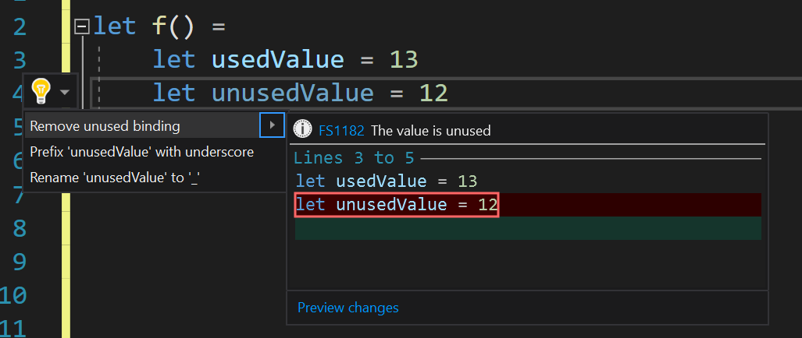
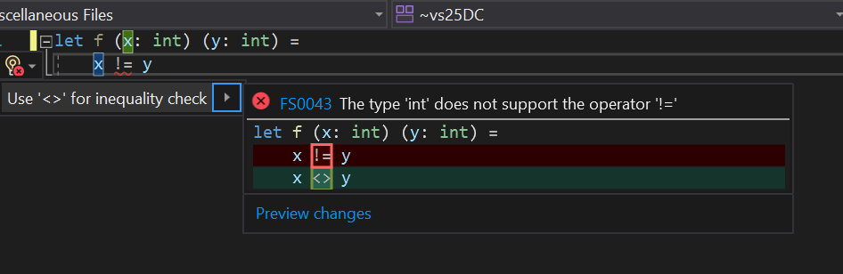
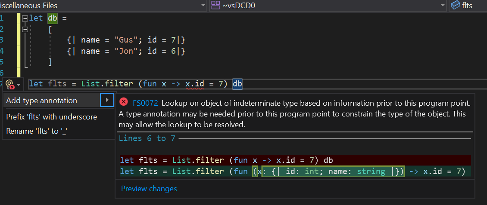
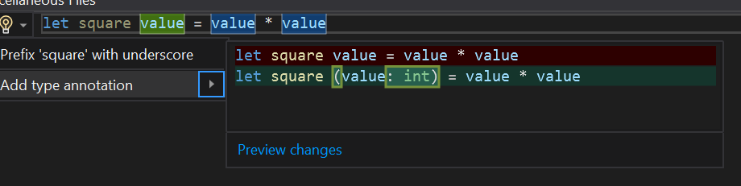

We're excited to announce updates to the F# tools for Visual Studio 16.10. For this release, we're continuing our trend of improving the F# tooling experience in Visual Studio to build upon what was released in the [VS 16.9 update last February](https://devblogs.microsoft.com/dotnet/f-and-f-tools-update-for-visual-studio-16-9/).

* Support for Go to Definition on external symbols
* Better support for mixing C# and F# projects in a solution
* More quick fixes and refactorings
* More tooling performance and responsiveness improvements
* More core compiler improvements

Let's dive in!

## Go to Definition on external symbols

This one's been a long time coming. We've had a feature request [since 2016](https://github.com/dotnet/fsharp/issues/1939) and several trial implementations throughout the years. Now it's here!

<iframe width="1280" height="765" src="https://www.youtube.com/embed/56yqVkWS0BY" title="YouTube video player" frameborder="0" allow="accelerometer; autoplay; clipboard-write; encrypted-media; gyroscope; picture-in-picture" allowfullscreen></iframe>

As shown in the video, you can either use the `f12` key or `ctrl+click` to navigate to a declaration, just like in source code in your own solution.

This feature differs from the C# and Visual Basic solution in that it generates a complete [F# Signature File](https://docs.microsoft.com/dotnet/fsharp/language-reference/signature-files) that represents the module or namespace that the symbol lives under, with XML documentation if it is present. This allows colorization, tooltips, and further navigation to work exactly as if they had been declared as signature files in your own codebase.

## Better mixing of C# and F# projects in your solution

One of the biggest annoyances when working with C# and F# projects that interoperate in the same codebase is that you need to rebuild projects to see updates in other projects if they cross the C# <-> F# boundary.

Starting with the VS 16.10 release, if you make a change to a C# project, you don't need to rebuild it to see changes in an F# project!

<iframe width="1280" height="765" src="https://www.youtube.com/embed/zvuVPe11cGE" title="YouTube video player" frameborder="0" allow="accelerometer; autoplay; clipboard-write; encrypted-media; gyroscope; picture-in-picture" allowfullscreen></iframe>

As shown in the video, I can make any modification and immediately see changes in the F# project.

The inverse is still not true today, and there remains more work to be done to make the C# <-> F# interop boundaries clean from a tooling standpoint. To summarize the current state of things, here's a checklist:

* ✔️ F# projects can "see" changes in C# projects without rebuilding
* ✔️ You can Go to Definition on any C# symbol from F# and navigate to that spot in a C# codebase
* ❌ C# projects cannot "see" changes in an F# project without rebuilding
* ❌ You cannot Go to Definition on any F# symbol from C# and navigate to that spot in the F# codebase

We're doing more work to turn this remaining red crosses into green check marks. The work is quite low-level and starts with some changes to the F# compiler and will likely also involve changes in the C# tooling as well.

## XML documentation scaffolding

At the start of Visual Studio 2019, we disabled a feature that allowed you to scaffold XML documentation in source due to performance concerns. The implementation was found to be a significant source of UI delays, which could be devastating to an overall Visual Studio experience, especially if combined with large memory consumption.

We made huge strides in memory usage reduction since disabling this feature, and changed the implementation of the XML documentation scaffolding feature, so it's now re-enabled and without any risk of incurring the same UI delays!

<iframe width="1280" height="765" src="https://www.youtube.com/embed/oNXSfoBeEnw" title="YouTube video player" frameborder="0" allow="accelerometer; autoplay; clipboard-write; encrypted-media; gyroscope; picture-in-picture" allowfullscreen></iframe>

## More quick fixes and refactorings

The VS 16.10 release doesn't bring as many new updates for quick fixes and refactorings as the last release, but we have some more cool stuff to share!

### Remove unused binding quick fix

If you have an unused binding in any scope, we'll offer to remove it for you if it's considered removable:



### Use proper inequality operator quick fix

Some beginners from other languages might use `!=` and get confused by the error it produces. This quick fix will correct their operator usage to use `<>`:



### Add type annotation to object of indeterminate type quick fix

The F# compiler can give a confusing error, where code technically doesn't compile, but the _F# tools_ can actually infer a type that the compiler can't. This quick fix will bring that known type into a suggestion:



### Add type annotation refactoring

Finally, we've added a refactoring. These are different from quick fixes in that they aren't triggered by warnings or errors. Instead, lightbulbs (with no error icon next to them) indicate that a code refactoring is available at your cursor position.

This refactoring lets you add an explicit type annotation to a parameter.



## Even more tooling performance and responsiveness

Just like the past several Visual Studio released, we're continuing to chip away at tooling performance and responsiveness for larger codebases.

### Reduced memory usage

We identified another "win" for memory usage for large solutions. When Visual Studio colors constructs in an open document, this is actually the result of a process known as "classification". Classification runs in two passes:

1. Syntactical classification
2. Semantic classification

Syntactical classification can do things like identify keywords from non-keyworks. It's very lightweight because it doesn't require typechecking anything. You may notice for a very, very large file that keywords are colored before types are colored.

Semantic classification is an expensive operation. It does things like distinguish classes, structs, enums, methods, properties, etc. The end result is more nuanced colorization in a document. However, since it is typically the first semantic operation kicked off by a language service, it also fills caches.

One of the caches used by semantic classification is the actual classification information itself. This information used to be stored in one big array. It's now backed by a memory-mapped file. This has lead to savings of up to 200MB in the F# codebase, depending on how much code was typechecked.

This change was contributed by [Saurav Tiwary](https://github.com/dr0pdb). Thanks, Saurav!

### More IDE features respond immediately

Last release, we started some work to pull items off of the F# language service's "reactor queue". As a refresher, this system serializes requests that require semantic information because there may be a circumstance where a typechecking operation can have downstream effects. In practice, however, this approach is not actually necessary. This release, we've pulled even more operations off of this queue.

With these changes, you should notice that tooling features in larger codebases react to your inputs faster than before. It's hard to say which specific ones will feel faster, as the nature of this system means that any given operation could have been queued up in a large queue one day, but a smaller queue the next day. Now that most operations are pulled off of the queue, you should notice that most IDE features will immediately provide a response.

## Core compiler improvements

Finally, we've got some more compiler improvements that aren't strictly bug fixes or performance improvements.

### Support for WarnOn in project files

Prior to this release, if you wanted to introduce warnings for specific compiler codes, you'd have to use `--warnon:number` in an `OtherFlags` property in your project file.

You can now just use `WarnOn` and pass the numbers directly in, just like in C#.

This was implemented by [Chet Husk](https://github.com/baronfel). Thanks, Chet!

### Support for ApplicationIcon in project files

Prior to this release, setting `ApplicationIcon` in F# project files would do nothing.

Now, you can set this property in a project file just like in C#. A compiler flag, `--in32icon`, was also added.

This was implemented by [albert-du](https://github.com/albert-du). Thanks!

### More span optimizations

[Jérémie Chassaing](https://github.com/thinkbeforecoding) implemented a lovely optimization for looping over a `Span`/`ReadOnlySpan`.

The following F# code:

```fsharp
let sumArray (vs: int ReadOnlySpan) =
    let mutable sum = 0
    for i in 0 .. vs.Length-1 do
        sum <- sum + vs.[i]
    sum
```

Now emits cleaner IL that removes a bounds check, allowing the runtime to more aggressively optimize the loop. This optimization also applies to `for x in xs do` loops.

## Looking forward

With this release, we're officially shifting gears to support three initiatives:

1. Great support for F# in .NET 6
2. Great support for F# in .NET Interactive
3. Great support for F# in Visual Studio 2022

For the first initiative, we're going to lock down on the language features we intend on releasing with soon. To be transparent, we're not intending on adding many language features this time. We feel that there is more value in core compiler improvements and core tooling improvements (F# interactive, Visual Studio) right now. Because .NET 6 is an LTS release, we're prioritizing existing feature-completeness, performance, and reliability. That doesn't necessarily mean a feature freeze. In fact, we may also end up releasing a "compiler feature" or two, especially when related to improving build times. But it does mean that the set of new language features will be smaller when compared to F# 5. When we have a finalized set of language changes going into .NET 6, we'll announce it and the version number that we'll assign the release.

For the second initiative, we're focused mainly on making sure that F# code gives great output (plaintext, charting), has great tooling (intellisense, tooltips), and gives a good experience using a broad set of libraries, especially those tailored towards data science and machine learning. To that end, we've already accomplished much of what we intend to do, especially in supporting some exotic package layouts for bringing in different packages with native dependencies. But there is a small experiences that might seem "off", and we want to make sure we come out of the gate with an incredible F# experience when .NET Interactive releases as GA.

Lastly, we're heavily focused on making sure we deliver a great F# experience in Visual Studio 2022. Since Visual Studio 2022 is going to be 64-bit, that means that there will be higher memory usage when compared to today. We have a lot of performance analysis work ahead of us. Our preliminary builds indicate that memory usage is ~2x when loading the F# codebase and running an expensive operation like Find All References. We are committed to bringing this factor down as much as possible. On top of that, we want to continue to iterate on Visual Studio productivity features and bring features like Inline Hints, better C# interop, faster build times, and more.

Stay tuned, and happy F# coding!
