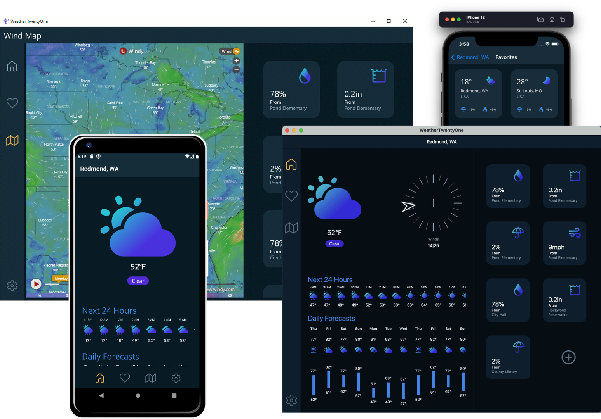
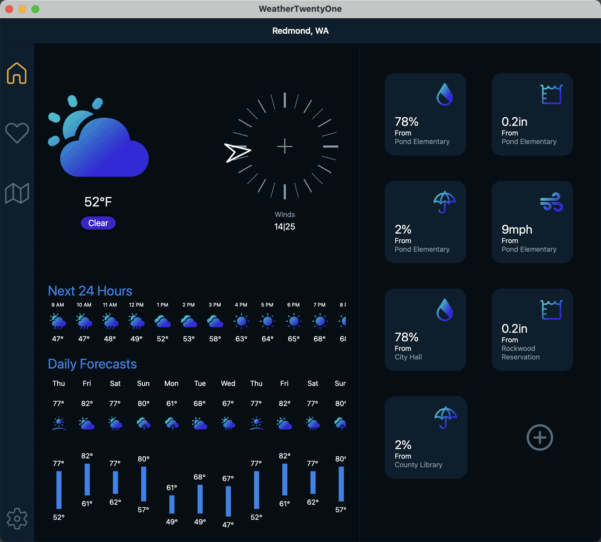
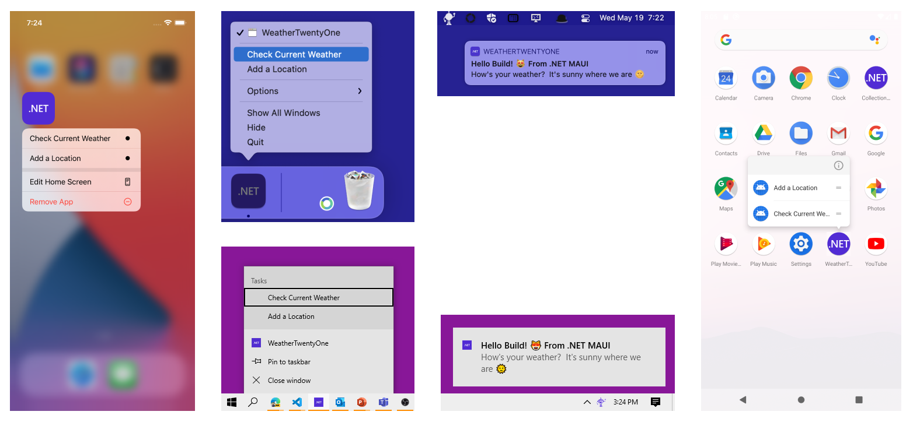
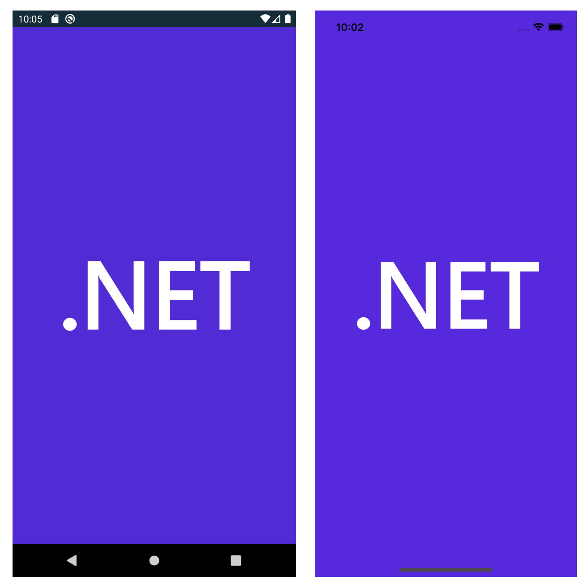
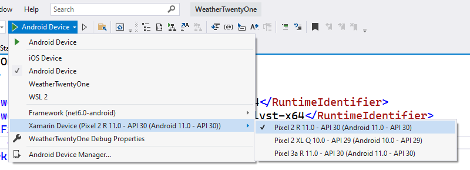
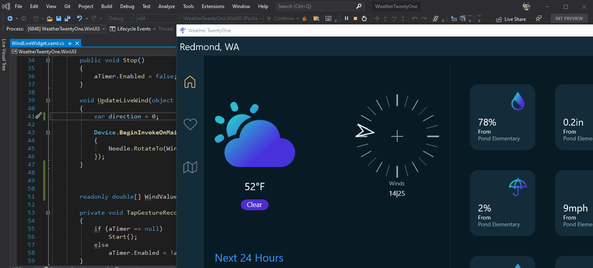
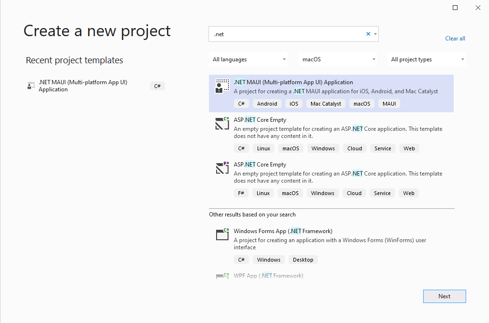

## Intro

Today we are pleased to announce the availability of .NET Multi-platform App UI (.NET MAUI) Preview 4. Each preview introduces more controls and features to this multi-platform toolkit on our way to general availability this November at [.NET Conf](www.dotnetconf.net). .NET MAUI now has enough building blocks to build functional applications for all supported platforms, new capabilities to support running Blazor on the desktop, and exciting progress from the rich community of ecosystem developers enabling their libraries to support .NET MAUI.

## Weather '21

To showcase our progress in Preview 4 for Microsoft Build, we rapidly designed and developed a simple yet beautiful weather app. As we wait for Visual Studio to integrate .NET MAUI productivity features, we began with Xamarin.Forms. We implemented each UI widget and screen with shared styling in a single codebase. After a few hours we then ported that work to .NET MAUI by making a few, small changes such as adopting the new `Microsoft.Maui` namespace. The process was painless and quick!



We also took the opportunity to show have easy it is to light up deep platform integrations by implementing app actions, an icon in the system tray (status bar), and platform native notifications all from a single project running on Android, iOS, macOS, and Windows.

```csharp
private void SetupAppActions()
{
    try
    {
        AppActions.SetAsync(   
            new AppAction("current_info", "Check Current Weather", icon: "current_info"),
            new AppAction("add_location", "Add a Location", icon: "add_location")
        );
    }
    catch (System.Exception ex)
    {
        Debug.WriteLine("App Actions not supported", ex);
    }
}
```



Check out the [WeatherTwentyOne source code here](https://github.com/davidortinau/WeatherTwentyOne) on GitHub, and our demos from Build 2021.

## New Features

Progress continues porting controls and layouts from Xamarin.Forms to the .NET MAUI architecture. In this way .NET MAUI both is excitingly new and not-new at the same time. We have learned much over the past 7 years about how to make cross-platform native UI performant and easy to extend, and we are putting that to work here. For ongoing status of this work visit our [GitHub status report](https://github.com/dotnet/maui/wiki/Status).

### BlazorWebView

The new `BlazorWebView` enables you to host a Blazor web application right in your .NET MAUI application and take advantage of seamless native platform features and UI controls. The control can be added to any XAML page and pointed to the root of the Blazor application.

```xaml
<BlazorWebView 
    HostPage="wwwroot/index.html"
    Services="{StaticResource Services}">
    <BlazorWebView.RootComponent>
        <RootComponent 
            Selector="#app"
            ComponentType="{x:Type local:Main}"
        />
    </BlazorWebView.RootComponent>
</BlazorWebView>
```

For a deeper look at this powerful integration, read more on our [ASP.NET blog](https://devblogs.microsoft.com/aspnet).

### Splash Screen

On mobile platforms especially you want your first screen to appear as quickly as possible, and this is done by implementing a static splash screen. .NET MAUI now has a single place to describe your splash screen for all platforms that support them.

```xaml
<MauiSplashScreen Include="Resources\appiconfg.svg" Color="#512BD4" />
```



Any image format may be provided along with a background brush, similar to how we also do app icons. For more advanced scenarios, platform native splash screen methods all still apply.

### Raw Assets

.NET MAUI now makes it very easy to add other assets to your project and reference them directly while retaining the platform native performance. For example, if you want to display a static HTML file in a `WebView` you can add the file to your project and annotate it as a `MauiAsset` in the properties.

```xml
<MauiAsset Include="Resources\Raw\index.html" />
```

> Tip: you can also use wildcards to enable all files in a directory: `Include="Resources\Raw\*"`

Then you can use it in your application by filename.

```xaml
<WebView Source="index.html" />
```

## Visual Studio Productivity

In Visual Studio 16.11 Preview 1 we get a first look at the productivity features for .NET MAUI including new run options for a multi-targeted single project, and the all new .NET Hot Reload for editing your managed code.

### Single Project Run

Single Project introduces a new experience for selecting the target platform and device when running your .NET MAUI applications. These changes simplify the startup process and give you access to all the platforms and devices in a single place.

For Single Project, platform-specific application projects are no longer within the solution, thus you will no longer right click on a project to set it as the startup project. 

In the new target debug selector, you will select the platform you are targeting first. After selecting your target platform, you will be given the list of devices you can run your .NET MAUI application on. All of this will be accessible through the Run Menu when you have a .NET MAUI Single Project.



The new run menu is the first of a host of changes within Visual Studio to support Single Project applications. We'll be announcing new features in the upcoming releases, so keep an eye out for updates!

### .NET Hot Reload

[.NET Hot Reload](https://devblogs.microsoft.com/dotnet/introducing-net-hot-reload/) is a new experience that enables you to make live edits to your .NET MAUI app's source code while it is running, reducing the number of times you need to rebuild your app.

To start testing this feature install both .NET 6 Preview 4 and [Visual Studio 2019 version 16.11 Preview 1](https://visualstudio.microsoft.com/vs/preview/). Start your app through the Visual Studio debugger (F5) targeting a WinUI 3 host. Once your app is running, you’ll now have the new option to make code changes and apply them using our new “apply code changes” button as illustrated below.



In coming releases .NET Hot Reload will also be available for Android, iOS, and macOS, and we'll be integrating XAML Hot Reload and the Live Visual Tree as well.

To learn more about Hot Reload check out [Introducing .NET Hot Reload]( https://aka.ms/build2021-hotreload).

## Get Started Today

Check out .NET MAUI today. Get started quickly be running the `maui-check` .NET tool from the command line to install .NET 6 Preview and all the SDK dependencies you need for developing .NET MAUI apps.

> Don't have maui-check? Run this from your command line
> 
> ```cli
> dotnet tool install -g Redth.Net.Maui.Check
> Source: https://github.com/Redth/dotnet-maui-check
> ```
> 

Run `> maui-check` and follow the instructions.   

Open [Visual Studio 2019 16.11 Preview 1](https://visualstudio.microsoft.com/vs/preview/) and create a new .NET Multi-platfrom App UI project. 



The new solution format includes the multi-targeted project which runs on Android, iOS, and macOS, and the two WinUI projects for Windows. In future releases the WinUI projects will be absorbed into the multi-targeted project.

To run for Android, set the multi-targeted project as your startup project and select the Android platform from the Run menu to see your Android emulators.

> Android emulators - if this is your first run, you may be asked to create your own emulator before the app will deploy and run.

In coming releases we will enable [iOS on Windows support](https://docs.microsoft.com/xamarin/xamarin-forms/deploy-test/hot-restart) for developing from Visual Studio to your connected iOS device.

For additional information about getting started with .NET MAUI, refer to our [wiki documentation](https://github.com/dotnet/maui/wiki/Getting-Started) on GitHub.

## Feedback Welcome

Please let us know about your experiences using .NET MAUI Preview 4 to create new applications by engaging with us on GitHub at [dotnet/maui](https://github.com/dotnet/maui).

For a look at what is coming in future releases, visit our [product roadmap](https://github.com/dotnet/maui/wiki/roadmap).
