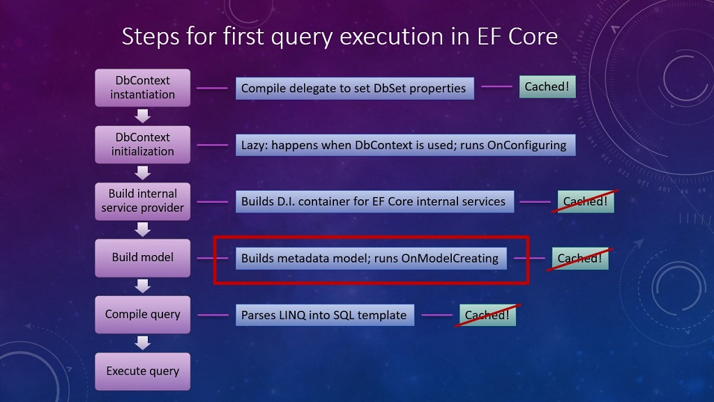
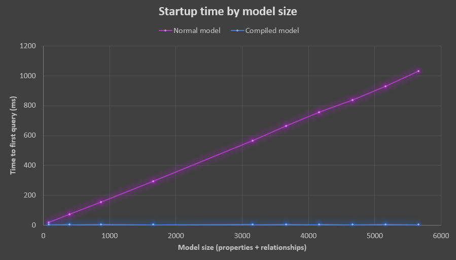

Today, the Entity Framework Core team announces the fifth preview release of EF Core 6.0. This release includes the first iteration of compiled models. If startup time for your application is important and your EF Core model contains hundreds or thousands of entities, properties, and relationships, this is one release you don't want to ignore. 

## TL;DR;

- Compiled models dramatically reduce startup time for your application.
- The models are generated (similar to how migrations are) so they should be refreshed whenever your model changes.
- Some features are not currently supported by compiled models, so be aware of the limitations when you try them out.

## Background

_How does 10x performance sound to you?_ Our team created a sample project with a `DbContext` that contains **449 entity types, 6,390 properties and 720 relationships**. I wrote a console app that loops several times, creates a new instance of a `DbContext` and loads a set of entities with no filters or ordering. The start-up time for the first run consistently takes around **two seconds** on my laptop, with subsequent cached instances weighing in at about 1.5 seconds. Here's the output from a run:

```bash
$ dotnet run -c Release
Model has:
  449 entity types
  6390 properties
  720 relationships
Instantiating context...
It took 00:00:02.1603163.
Instantiating context...
It took 00:00:01.6268628.
Instantiating context...
It took 00:00:01.7144346.
Instantiating context...
It took 00:00:01.6090380.
Instantiating context...
It took 00:00:01.7049987.
```

After testing the baseline application, I used the new [EF Core tools Command Line Interface (CLI)](https://docs.microsoft.com/ef/core/cli/dotnet) feature to optimize the `DbContext`:

```bash
dotnet ef dbcontext optimize -output-dir MyCompiledModels --namespace MyCompiledModels
```

The tool gave me instructions to add a single line of code to my `DbContext` configuration:

```csharp
options.UseModel(MyCompiledModels.BlogsContextModel.Instance);
```

I made the update and re-ran the code to receive a **10x performance gain** with the initial model taking **257ms** to complete. The cached model reduced additional calls to just **1ms**.

```bash
$ dotnet run -c Release
Model has:
  449 entity types
  6390 properties
  720 relationships
Instantiating context...
It took 00:00:00.2573627.
Instantiating context...
It took 00:00:00.0132345.
Instantiating context...
It took 00:00:00.0119556.
Instantiating context...
It took 00:00:00.0101717.
Instantiating context...
It took 00:00:00.0139057.
```

## Your very first query

EF Core performs quite a bit of work to get from your application to returning the first result of the first query your application processes. Let's break down these  two statements and go "behind the scenes" to see what happens.

```csharp
using var myContext = new MyContext();
var results = myContext.MyWidgets.ToList();
```

### DbContext instantiation

The first step is creating an instance of the context. The first time a `DbContext` is created, EF Core will create and compile delegates to set the table properties you expose by using `DbSet<Entity>`. This simply creates the delegates to set the properties so you can query them right away.

> **Performance tip:** you can avoid the overhead of `DbSet` initialization by using an alternate approach such as the `context.Set<Entity>()` API call.

### DbContext (lazy) initialization

After the `DbContext` is created, EF Core "goes to sleep" until you use it. The first time you use a context by accessing one of its APIs (such as navigating an entity and returning results), the context is initialized. This will run the `OnConfiguring` method to establish the [proper provider](https://docs.microsoft.com/ef/core/providers/) and database connections as well as other settings. For example, this is the perfect place to use the [simple logging](https://docs.microsoft.com/ef/core/logging-events-diagnostics/simple-logging) feature by calling the new `LogTo` extension on the [options builder](https://docs.microsoft.com/ef/core/dbcontext-configuration/#dbcontextoptions).

### Service provider

EF Core uses a service-based architecture and has an internal dependency injection framework. This provider is built internally but is designed to work with external DI solutions such as the [service provider in ASP.NET Core](https://docs.microsoft.com/ef/core/dbcontext-configuration/#dbcontext-in-dependency-injection-for-aspnet-core).

> **Performance tip:** much of the overhead described so far can be mitigated by using [context pooling](https://docs.microsoft.com/ef/core/performance/advanced-performance-topics#dbcontext-pooling). This enables a pool of reusable context instances that are already initialized.

### Model building

To understand how a domain object (C# class) relates to the tables and relationships in the database, EF Core builds an internal model that represents all the types, properties, constraints, and relationships that it finds in your `DbContext`. This is a metadata model and includes the call to `OnModelCreating` that can be overridden to provide fluent configuration of the model.

### Query compilation

A major reason why developers use EF Core is its ability to parse Language Integrated Queries (LINQ) into the database dialect. This is an advanced stage because it involves traversing a potentially complex expression tree and translating it into SQL. Something trivial like a projection:

```csharp
var projection = myQuery.Select(obj => new { id = obj.EntityId, name = obj.Identifier });
```

Seems easy enough to translate:

```sql
SELECT EntityId, Identifier FROM ...
```

But what about something more complicated, like this?

```csharp
var pairs = (from a1 in context.Attendees
                from a2 in context.Attendees
                where a1.Id != a2.Id
                select new
                {
                    a1 = a1.Id,
                    a1LastName = a1.LastName,
                    a1FirstName = a2.FirstName,
                    a2 = a2.Id,
                    a2LastName = a2.LastName,
                    a2FirstName = a2.FirstName,
                    sessionCount = 
                    a1.Sessions.Select(s => s.Id)
                    .Intersect(a2.Sessions.Select(s => s.Id)).Count()
                }).OrderByDescending(shared => shared.sessionCount)
            .Take(5);
```

This is ultimately parsed into native SQL, intersection and all. The first time that EF Core encounters a query, it parses the query to determine which parts are dynamic. It then compiles the static parts of the query and parameterizes the dynamic aspects to expedite translation into SQL by using a SQL template.

### Run the query

Finally! The query is now run. To avoid the overhead of performing these steps every time, EF Core caches the delegates for `DbSet` properties, the internal service provider, the constructed model, and the compiled query. This results in much faster performance after the queries are successfully run the first time.

You can visualize these steps using the following diagram (note the cache boxes have strike-through to show they are disabled for our benchmark tests):



Although most of the pipeline is already streamlined, model compilation was an area we knew could improve.

> **A note on source generators.** The approach the team chose is to provide a command that generates the source code files that you can then incorporate into your project to build the compiled model. We are often asked why we didn't choose [source generators](https://devblogs.microsoft.com/dotnet/introducing-c-source-generators/). The answer is that source generators run as user code inside the Visual Studio process. EF Core must build and run the context to obtain information about the model. If an exception is thrown as part of the process, this could potentially force Visual Studio to hang or crash.

As with most technology, compiled models do have trade-offs. Let's look at the pros and cons.

## Pros and cons

The pros should be clear. As your model grows larger, your startup time remains fast. Here is a comparison of startup time between compiled and non-compiled models based on the size of the model.



Here are some cons to consider:

- [Global query filters](https://docs.microsoft.com/ef/core/querying/filters) are not supported.
- [Lazy loading proxies](https://docs.microsoft.com/ef/core/querying/related-data/lazy) are not supported.
- [Change tracking proxies](https://docs.microsoft.com/ef/core/change-tracking/change-detection#change-tracking-proxies) are not supported.
- Custom [IModelCacheKeyFactory](https://docs.microsoft.com/ef/core/modeling/dynamic-model#imodelcachekeyfactory) implementations are not supported.
- The model must be manually synchronized by regenerating it any time the model definition or configuration change.

> **Tip:** if supporting any of these features is critical to your success, please [find the issue](https://github.com/dotnet/efcore/issues) and upvote it or add your comments and thoughts, or [file a new issue](https://github.com/dotnet/efcore/issues/new) to let us know.

Now you've learned the background. How do you get started?

## In conclusion

To start using compiled models today, reap the performance benefits and have the opportunity to provide us with feedback before we release the final EF Core 6.0 version, start by grabbing the latest preview (instructions are below) and installing the [latest EF Core CLI](https://docs.microsoft.com/ef/core/cli/dotnet). The new tool command looks like this (all parameters are optional):

```bash
dotnet ef dbcontext optimize -c MyContext -o MyFolder -n My.Namespace 
```

Inside the NuGet package manager console you can use this:

```powershell
Optimize-DbContext -Context MyContext -OutputDir MyFolder -Namespace My.Namespace
```

The tool will instruct you to add a line like this to your options configuration:

```csharp
opts.UseModel(My.Namespace.MyContextModel.Instance);
```

We hope you benefit from this new feature and can provide us with early feedback. Check out the  [EF Core 6.0 plan](https://docs.microsoft.com/ef/core/what-is-new/ef-core-6.0/plan). In addition to other work, the team has prioritized a number of [Azure Cosmos DB provider features](https://github.com/dotnet/efcore/issues?q=is%3Aopen+is%3Aissue+label%3Aarea-cosmos+milestone%3A6.0.0). Please upvote the features that are important to you and share any feedback you may have! Other features in the preview 5 release will be posted in [EF Core 6.0 What's New](https://docs.microsoft.com/ef/core/what-is-new/ef-core-6.0/whatsnew#ef-core-60-preview-5).

## How to get EF Core 6.0 previews

EF Core is distributed exclusively as a set of NuGet packages. For example, to add the SQL Server provider to your project, you can use the following command using the dotnet tool:

```bash
dotnet add package Microsoft.EntityFrameworkCore.SqlServer --version 6.0.0-preview.5.21301.9
```

This following table links to the preview 5 versions of the EF Core packages and describes what they are used for.

|**Package**    |**Purpose**      |
|--------------:|:----------------|
|[Microsoft.EntityFrameworkCore](https://www.nuget.org/packages/Microsoft.EntityFrameworkCore/6.0.0-preview.5.21301.9)|The main EF Core package that is independent of specific database providers|
|[Microsoft.EntityFrameworkCore.SqlServer](https://www.nuget.org/packages/Microsoft.EntityFrameworkCore.SqlServer/6.0.0-preview.5.21301.9)|Database provider for Microsoft SQL Server and SQL Azure|
|[Microsoft.EntityFrameworkCore.SqlServer.NetTopologySuite](https://www.nuget.org/packages/Microsoft.EntityFrameworkCore.SqlServer.NetTopologySuite/6.0.0-preview.5.21301.9)|SQL Server support for spatial types|
|[Microsoft.EntityFrameworkCore.Sqlite](https://www.nuget.org/packages/Microsoft.EntityFrameworkCore.Sqlite/6.0.0-preview.5.21301.9)|Database provider for SQLite that includes the native binary for the database engine|
|[Microsoft.EntityFrameworkCore.Sqlite.Core](https://www.nuget.org/packages/Microsoft.EntityFrameworkCore.Sqlite.Core/6.0.0-preview.5.21301.9)|Database provider for SQLite _without_ a packaged native binary|
|[Microsoft.EntityFrameworkCore.Sqlite.NetTopologySuite](https://www.nuget.org/packages/Microsoft.EntityFrameworkCore.Sqlite.NetTopologySuite/6.0.0-preview.5.21301.9)|SQLite support for spatial types|
|[Microsoft.EntityFrameworkCore.Cosmos](https://www.nuget.org/packages/Microsoft.EntityFrameworkCore.Cosmos/6.0.0-preview.5.21301.9)|Database provider for Azure Cosmos DB|
|[Microsoft.EntityFrameworkCore.InMemory](https://www.nuget.org/packages/Microsoft.EntityFrameworkCore.InMemory/6.0.0-preview.5.21301.9)|The in-memory database provider|
|[Microsoft.EntityFrameworkCore.Tools](https://www.nuget.org/packages/Microsoft.EntityFrameworkCore.Tools/6.0.0-preview.5.21301.9)|EF Core PowerShell commands for the Visual Studio Package Manager Console; use this to integrate tools like [scaffolding](https://docs.microsoft.com/ef/core/managing-schemas/scaffolding) and [migrations](https://docs.microsoft.com/ef/core/managing-schemas/migrations/) with Visual Studio|
|[Microsoft.EntityFrameworkCore.Design](https://www.nuget.org/packages/Microsoft.EntityFrameworkCore.Design/6.0.0-preview.5.21301.9)|Shared design-time components for EF Core tools|
|[Microsoft.EntityFrameworkCore.Proxies](https://www.nuget.org/packages/Microsoft.EntityFrameworkCore.Proxies/6.0.0-preview.5.21301.9)|Lazy-loading and change-tracking proxies|
|[Microsoft.EntityFrameworkCore.Abstractions](https://www.nuget.org/packages/Microsoft.EntityFrameworkCore.Abstractions/6.0.0-preview.5.21301.9)|Decoupled EF Core abstractions; use this for features like extended data annotations defined by EF Core|
|[Microsoft.EntityFrameworkCore.Relational](https://www.nuget.org/packages/Microsoft.EntityFrameworkCore.Relational/6.0.0-preview.5.21301.9)|Shared EF Core components for relational database providers|
|[Microsoft.EntityFrameworkCore.Analyzers](https://www.nuget.org/packages/Microsoft.EntityFrameworkCore.Analyzers/6.0.0-preview.5.21301.9)|C# analyzers for EF Core|

We also published the 6.0 preview 5 release of the [Microsoft.Data.Sqlite.Core](https://www.nuget.org/packages/Microsoft.Data.Sqlite.Core/6.0.0-preview.5.21301.9) provider for [ADO.NET](https://docs.microsoft.com/dotnet/framework/data/adonet/ado-net-overview).

## Thank you from the team

A big thank you from the EF team to everyone who has used EF over the years!

<table>

<tr>
<td><a href="https://github.com/ajcvickers"><br>Arthur Vickers</a></td>
<td><a href="https://github.com/AndriySvyryd"><br>Andriy Svyryd</a></td>
<td><a href="https://github.com/bricelam"><br>Brice Lambson</a></td>
<td><a href="https://github.com/JeremyLikness"><br>Jeremy Likness</a>
</td>
</tr>

<tr>
<td><a href="https://github.com/maumar"><br>Maurycy Markowski</a></td>
<td><a href="https://github.com/roji"><br>Shay Rojansky</a></td>
<td><a href="https://github.com/smitpatel"><br>Smit Patel</a>
</td><td></td>
</tr>

</table>

## Thank you to our contributors!

We are grateful to our amazing community of contributors. Our success is founded upon the shoulders of your efforts and feedback. If you are interested in contributing but not sure how or would like help, please reach out to us! We want to help you succeed. We would like to publicly acknowledge and thank these contributors for investing in the success of EF Core 6.0.

| | | | |
|:--:|:--:|:--:|:--:|
|**[AkinSabriCam](https://github.com/AkinSabriCam)**|**[alexernest](https://github.com/alexernest)**|**[alexpotter10](https://github.com/alexpotter10)**|**[Ali-YousefiTelori](https://github.com/Ali-YousefiTelori)**|
|[#1](https://github.com/dotnet/EntityFramework.Docs/pull/3157)|[#1](https://github.com/dotnet/EntityFramework.Docs/pull/3225)|[#1](https://github.com/dotnet/EntityFramework.Docs/pull/3143)|[#1](https://github.com/dotnet/efcore/pull/23946), [#2](https://github.com/dotnet/efcore/pull/23946)|
| | | | |
**[alireza-rezaee](https://github.com/alireza-rezaee)**|**[andrejs86](https://github.com/andrejs86)**|**[AndrewKitu](https://github.com/AndrewKitu)**|**[ardalis](https://github.com/ardalis)**|
[#1](https://github.com/dotnet/EntityFramework.Docs/pull/3232)|[#1](https://github.com/dotnet/EntityFramework.Docs/pull/3182)|[#1](https://github.com/dotnet/EntityFramework.Docs/pull/3070)|[#1](https://github.com/dotnet/EntityFramework.Docs/pull/3091)|
| | | | |
**[CaringDev](https://github.com/CaringDev)**|**[carlreid](https://github.com/carlreid)**|**[carlreinke](https://github.com/carlreinke)**|**[cgrevil](https://github.com/cgrevil)**|
[#1](https://github.com/dotnet/efcore/pull/23585), [#2](https://github.com/dotnet/efcore/pull/23585)|[#1](https://github.com/dotnet/efcore/pull/24498), [#2](https://github.com/dotnet/efcore/pull/24498)|[#1](https://github.com/dotnet/efcore/pull/23694), [#2](https://github.com/dotnet/efcore/pull/23694)|[#1](https://github.com/dotnet/EntityFramework.Docs/pull/3154)|
| | | | |
**[cgrimes01](https://github.com/cgrimes01)**|**[cincuranet](https://github.com/cincuranet)**|**[dan-giddins](https://github.com/dan-giddins)**|**[dannyjacosta](https://github.com/dannyjacosta)**|
[#1](https://github.com/dotnet/EntityFramework.Docs/pull/3038)|[#1](https://github.com/dotnet/efcore/pull/24234), [#2](https://github.com/dotnet/efcore/pull/24234), [#3](https://github.com/dotnet/EntityFramework.Docs/pull/2714), [#4](https://github.com/dotnet/EntityFramework.Docs/pull/3185)|[#1](https://github.com/dotnet/EntityFramework.Docs/pull/2910)|[#1](https://github.com/dotnet/efcore/pull/24839), [#2](https://github.com/dotnet/efcore/pull/24839)|
| | | | |
**[dennisseders](https://github.com/dennisseders)**|**[DickBaker](https://github.com/DickBaker)**|**[ErikEJ](https://github.com/ErikEJ)**|**[fagnercarvalho](https://github.com/fagnercarvalho)**|
[#1](https://github.com/dotnet/EntityFramework.Docs/pull/2839), [#2](https://github.com/dotnet/EntityFramework.Docs/pull/2845), [#3](https://github.com/dotnet/EntityFramework.Docs/pull/2848), [#4](https://github.com/dotnet/EntityFramework.Docs/pull/2987), [#5](https://github.com/dotnet/EntityFramework.Docs/pull/2997), [#6](https://github.com/dotnet/EntityFramework.Docs/pull/3007)|[#1](https://github.com/dotnet/EntityFramework.Docs/pull/2990)|[#1](https://github.com/dotnet/efcore/pull/22900), [#2](https://github.com/dotnet/efcore/pull/22900), [#3](https://github.com/dotnet/efcore/pull/22937), [#4](https://github.com/dotnet/efcore/pull/22937), [#5](https://github.com/dotnet/efcore/pull/22938), [#6](https://github.com/dotnet/efcore/pull/22938), [#7](https://github.com/dotnet/EntityFramework.Docs/pull/2897), [#8](https://github.com/dotnet/EntityFramework.Docs/pull/2984), [#9](https://github.com/dotnet/EntityFramework.Docs/pull/3187), [#10](https://github.com/dotnet/EntityFramework.Docs/pull/3197), [#11](https://github.com/dotnet/EntityFramework.Docs/pull/3230), [#12](https://github.com/dotnet/EntityFramework.Docs/pull/3257)|[#1](https://github.com/dotnet/efcore/pull/23094), [#2](https://github.com/dotnet/efcore/pull/23094)|
| | | | |
**[FarshanAhamed](https://github.com/FarshanAhamed)**|**[filipnavara](https://github.com/filipnavara)**|**[garyng](https://github.com/garyng)**|**[Geoff1900](https://github.com/Geoff1900)**|
[#1](https://github.com/dotnet/EntityFramework.Docs/pull/3181)|[#1](https://github.com/dotnet/efcore/pull/23591), [#2](https://github.com/dotnet/efcore/pull/23591)|[#1](https://github.com/dotnet/EntityFramework.Docs/pull/3045), [#2](https://github.com/dotnet/EntityFramework.Docs/pull/3046), [#3](https://github.com/dotnet/EntityFramework.Docs/pull/3047)|[#1](https://github.com/dotnet/EntityFramework.Docs/pull/3025)|
| | | | |
**[gfoidl](https://github.com/gfoidl)**|**[Giorgi](https://github.com/Giorgi)**|**[GitHubPang](https://github.com/GitHubPang)**|**[gurustron](https://github.com/gurustron)**|
[#1](https://github.com/dotnet/efcore/pull/22923), [#2](https://github.com/dotnet/efcore/pull/22923)|[#1](https://github.com/dotnet/efcore/pull/24147), [#2](https://github.com/dotnet/efcore/pull/24147), [#3](https://github.com/dotnet/EntityFramework.Docs/pull/3106), [#4](https://github.com/dotnet/EntityFramework.Docs/pull/3107)|[#1](https://github.com/dotnet/EntityFramework.Docs/pull/3097)|[#1](https://github.com/dotnet/EntityFramework.Docs/pull/3010)|
| | | | |
**[hez2010](https://github.com/hez2010)**|**[HSchwichtenberg](https://github.com/HSchwichtenberg)**|**[jaliyaudagedara](https://github.com/jaliyaudagedara)**|**[jantlee](https://github.com/jantlee)**|
[#1](https://github.com/dotnet/efcore/pull/24211), [#2](https://github.com/dotnet/efcore/pull/24211)|[#1](https://github.com/dotnet/EntityFramework.Docs/pull/2894)|[#1](https://github.com/dotnet/efcore/pull/24499), [#2](https://github.com/dotnet/efcore/pull/24499)|[#1](https://github.com/dotnet/EntityFramework.Docs/pull/2786)|
| | | | |
**[jeremycook](https://github.com/jeremycook)**|**[jing8956](https://github.com/jing8956)**|**[joakimriedel](https://github.com/joakimriedel)**|**[joaopgrassi](https://github.com/joaopgrassi)**|
[#1](https://github.com/dotnet/EntityFramework.Docs/pull/2827)|[#1](https://github.com/dotnet/EntityFramework.Docs/pull/3146)|[#1](https://github.com/dotnet/efcore/pull/23437), [#2](https://github.com/dotnet/efcore/pull/23437)|[#1](https://github.com/dotnet/efcore/pull/22849), [#2](https://github.com/dotnet/efcore/pull/22849)|
| | | | |
**[josemiltonsampaio](https://github.com/josemiltonsampaio)**|**[KaloyanIT](https://github.com/KaloyanIT)**|**[khalidabuhakmeh](https://github.com/khalidabuhakmeh)**|**[khellang](https://github.com/khellang)**|
[#1](https://github.com/dotnet/EntityFramework.Docs/pull/2927)|[#1](https://github.com/dotnet/efcore/pull/23563), [#2](https://github.com/dotnet/efcore/pull/23563), [#3](https://github.com/dotnet/efcore/pull/23666), [#4](https://github.com/dotnet/efcore/pull/23666)|[#1](https://github.com/dotnet/EntityFramework.Docs/pull/2858), [#2](https://github.com/dotnet/EntityFramework.Docs/pull/2962)|[#1](https://github.com/dotnet/EntityFramework.Docs/pull/2982)|
| | | | |
**[koenbeuk](https://github.com/koenbeuk)**|**[kotpal](https://github.com/kotpal)**|**[larsholm](https://github.com/larsholm)**|**[lauxjpn](https://github.com/lauxjpn)**|
[#1](https://github.com/dotnet/EntityFramework.Docs/pull/2921)|[#1](https://github.com/dotnet/EntityFramework.Docs/pull/2763)|[#1](https://github.com/dotnet/efcore/pull/24624), [#2](https://github.com/dotnet/efcore/pull/24624)|[#1](https://github.com/dotnet/efcore/pull/24806), [#2](https://github.com/dotnet/efcore/pull/24806)|
| | | | |
**[leonardoporro](https://github.com/leonardoporro)**|**[lexkazakov](https://github.com/lexkazakov)**|**[mariuz](https://github.com/mariuz)**|**[marodev](https://github.com/marodev)**|
[#1](https://github.com/dotnet/EntityFramework.Docs/pull/2883)|[#1](https://github.com/dotnet/EntityFramework.Docs/pull/3191)|[#1](https://github.com/dotnet/EntityFramework.Docs/pull/3124)|[#1](https://github.com/dotnet/efcore/pull/24951), [#2](https://github.com/dotnet/efcore/pull/24951)|
| | | | |
**[MartinWestminster](https://github.com/MartinWestminster)**|**[Marusyk](https://github.com/Marusyk)**|**[MattKomorcec](https://github.com/MattKomorcec)**|**[MaxG117](https://github.com/MaxG117)**|
[#1](https://github.com/dotnet/EntityFramework.Docs/pull/3118)|[#1](https://github.com/dotnet/efcore/pull/23039), [#2](https://github.com/dotnet/efcore/pull/23039), [#3](https://github.com/dotnet/efcore/pull/24016), [#4](https://github.com/dotnet/efcore/pull/24016), [#5](https://github.com/dotnet/efcore/pull/24203), [#6](https://github.com/dotnet/efcore/pull/24203), [#7](https://github.com/dotnet/efcore/pull/24204), [#8](https://github.com/dotnet/efcore/pull/24204), [#9](https://github.com/dotnet/efcore/pull/24247), [#10](https://github.com/dotnet/efcore/pull/24247), [#11](https://github.com/dotnet/efcore/pull/24284), [#12](https://github.com/dotnet/efcore/pull/24284), [#13](https://github.com/dotnet/efcore/pull/24286), [#14](https://github.com/dotnet/efcore/pull/24286), [#15](https://github.com/dotnet/efcore/pull/24323), [#16](https://github.com/dotnet/efcore/pull/24323)|[#1](https://github.com/dotnet/efcore/pull/24728), [#2](https://github.com/dotnet/efcore/pull/24728)|[#1](https://github.com/dotnet/EntityFramework.Docs/pull/2898)|
| | | | |
**[mefateah](https://github.com/mefateah)**|**[meggima](https://github.com/meggima)**|**[mguinness](https://github.com/mguinness)**|**[michalczerwinski](https://github.com/michalczerwinski)**|
[#1](https://github.com/dotnet/EntityFramework.Docs/pull/3065)|[#1](https://github.com/dotnet/efcore/pull/23605), [#2](https://github.com/dotnet/efcore/pull/23605)|[#1](https://github.com/dotnet/EntityFramework.Docs/pull/3227)|[#1](https://github.com/dotnet/efcore/pull/24793), [#2](https://github.com/dotnet/efcore/pull/24793), [#3](https://github.com/dotnet/efcore/pull/24814), [#4](https://github.com/dotnet/efcore/pull/24814), [#5](https://github.com/dotnet/efcore/pull/24887), [#6](https://github.com/dotnet/efcore/pull/24887)|
| | | | |
**[mrlife](https://github.com/mrlife)**|**[msawczyn](https://github.com/msawczyn)**|**[MSDN-WhiteKnight](https://github.com/MSDN-WhiteKnight)**|**[natashanikolic](https://github.com/natashanikolic)**|
[#1](https://github.com/dotnet/EntityFramework.Docs/pull/3094), [#2](https://github.com/dotnet/EntityFramework.Docs/pull/3128), [#3](https://github.com/dotnet/EntityFramework.Docs/pull/3129), [#4](https://github.com/dotnet/EntityFramework.Docs/pull/3132)|[#1](https://github.com/dotnet/EntityFramework.Docs/pull/2917)|[#1](https://github.com/dotnet/EntityFramework.Docs/pull/2887)|[#1](https://github.com/dotnet/EntityFramework.Docs/pull/2920)|
| | | | |
**[nmichels](https://github.com/nmichels)**|**[nschonni](https://github.com/nschonni)**|**[OKTAYKIR](https://github.com/OKTAYKIR)**|**[OOberoi](https://github.com/OOberoi)**|
[#1](https://github.com/dotnet/efcore/pull/23091), [#2](https://github.com/dotnet/efcore/pull/23091)|[#1](https://github.com/dotnet/EntityFramework.Docs/pull/2775), [#2](https://github.com/dotnet/EntityFramework.Docs/pull/2776), [#3](https://github.com/dotnet/EntityFramework.Docs/pull/2779), [#4](https://github.com/dotnet/EntityFramework.Docs/pull/2780)|[#1](https://github.com/dotnet/EntityFramework.Docs/pull/3145)|[#1](https://github.com/dotnet/EntityFramework.Docs/pull/3163)|
| | | | |
**[Oxyrus](https://github.com/Oxyrus)**|**[pkellner](https://github.com/pkellner)**|**[ptupitsyn](https://github.com/ptupitsyn)**|**[ralmsdeveloper](https://github.com/ralmsdeveloper)**|
[#1](https://github.com/dotnet/EntityFramework.Docs/pull/3110)|[#1](https://github.com/dotnet/EntityFramework.Docs/pull/2954)|[#1](https://github.com/dotnet/EntityFramework.Docs/pull/3202)|[#1](https://github.com/dotnet/efcore/pull/19473), [#2](https://github.com/dotnet/efcore/pull/19473)|
| | | | |
**[RaymondHuy](https://github.com/RaymondHuy)**|**[riscie](https://github.com/riscie)**|**[SergerGood](https://github.com/SergerGood)**|**[Shirasho](https://github.com/Shirasho)**|
[#1](https://github.com/dotnet/efcore/pull/22514), [#2](https://github.com/dotnet/efcore/pull/22514), [#3](https://github.com/dotnet/efcore/pull/23145), [#4](https://github.com/dotnet/efcore/pull/23145), [#5](https://github.com/dotnet/efcore/pull/23232), [#6](https://github.com/dotnet/efcore/pull/23232), [#7](https://github.com/dotnet/efcore/pull/23424), [#8](https://github.com/dotnet/efcore/pull/23424)|[#1](https://github.com/dotnet/efcore/pull/20792), [#2](https://github.com/dotnet/efcore/pull/20792)|[#1](https://github.com/dotnet/efcore/pull/24750), [#2](https://github.com/dotnet/efcore/pull/24750), [#3](https://github.com/dotnet/efcore/pull/24751), [#4](https://github.com/dotnet/efcore/pull/24751), [#5](https://github.com/dotnet/efcore/pull/24752), [#6](https://github.com/dotnet/efcore/pull/24752), [#7](https://github.com/dotnet/efcore/pull/24753), [#8](https://github.com/dotnet/efcore/pull/24753), [#9](https://github.com/dotnet/efcore/pull/24755), [#10](https://github.com/dotnet/efcore/pull/24755)|[#1](https://github.com/dotnet/EntityFramework.Docs/pull/2988)|
| | | | |
**[SimonCropp](https://github.com/SimonCropp)**|**[stevendarby](https://github.com/stevendarby)**|**[Strepto](https://github.com/Strepto)**|**[teo-tsirpanis](https://github.com/teo-tsirpanis)**|
[#1](https://github.com/dotnet/EntityFramework.Docs/pull/2957), [#2](https://github.com/dotnet/EntityFramework.Docs/pull/2959)|[#1](https://github.com/dotnet/efcore/pull/24746), [#2](https://github.com/dotnet/efcore/pull/24746)|[#1](https://github.com/dotnet/efcore/pull/24141), [#2](https://github.com/dotnet/efcore/pull/24141)|[#1](https://github.com/dotnet/EntityFramework.Docs/pull/3123)|
| | | | |
**[the-wazz](https://github.com/the-wazz)**|**[tkp1n](https://github.com/tkp1n)**|**[Tomkaa](https://github.com/Tomkaa)**|**[umitkavala](https://github.com/umitkavala)**|
[#1](https://github.com/dotnet/efcore/pull/23551), [#2](https://github.com/dotnet/efcore/pull/23551)|[#1](https://github.com/dotnet/efcore/pull/23014), [#2](https://github.com/dotnet/efcore/pull/23014)|[#1](https://github.com/dotnet/efcore/pull/23933), [#2](https://github.com/dotnet/efcore/pull/23933)|[#1](https://github.com/dotnet/efcore/pull/23322), [#2](https://github.com/dotnet/efcore/pull/23322), [#3](https://github.com/dotnet/efcore/pull/23562), [#4](https://github.com/dotnet/efcore/pull/23562)|
| | | | |
**[uncheckederror](https://github.com/uncheckederror)**|**[Varorbc](https://github.com/Varorbc)**|**[vincent1405](https://github.com/vincent1405)**|**[vonzshik](https://github.com/vonzshik)**|
[#1](https://github.com/dotnet/EntityFramework.Docs/pull/3168)|[#1](https://github.com/dotnet/EntityFramework.Docs/pull/3141)|[#1](https://github.com/dotnet/efcore/pull/24020), [#2](https://github.com/dotnet/efcore/pull/24020)|[#1](https://github.com/dotnet/efcore/pull/24775), [#2](https://github.com/dotnet/efcore/pull/24775), [#3](https://github.com/dotnet/efcore/pull/24778), [#4](https://github.com/dotnet/efcore/pull/24778)|
| | | | |
**[vytotas](https://github.com/vytotas)**|**[wdesgardin](https://github.com/wdesgardin)**|**[wmeints](https://github.com/wmeints)**|**[yesmey](https://github.com/yesmey)**|
[#1](https://github.com/dotnet/EntityFramework.Docs/pull/3158)|[#1](https://github.com/dotnet/efcore/pull/24588), [#2](https://github.com/dotnet/efcore/pull/24588)|[#1](https://github.com/dotnet/efcore/pull/23873), [#2](https://github.com/dotnet/efcore/pull/23873)|[#1](https://github.com/dotnet/efcore/pull/24111), [#2](https://github.com/dotnet/efcore/pull/24111), [#3](https://github.com/dotnet/efcore/pull/24155), [#4](https://github.com/dotnet/efcore/pull/24155), [#5](https://github.com/dotnet/efcore/pull/24160), [#6](https://github.com/dotnet/efcore/pull/24160)|
| | | | |
