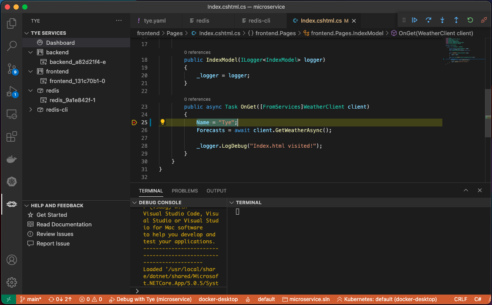
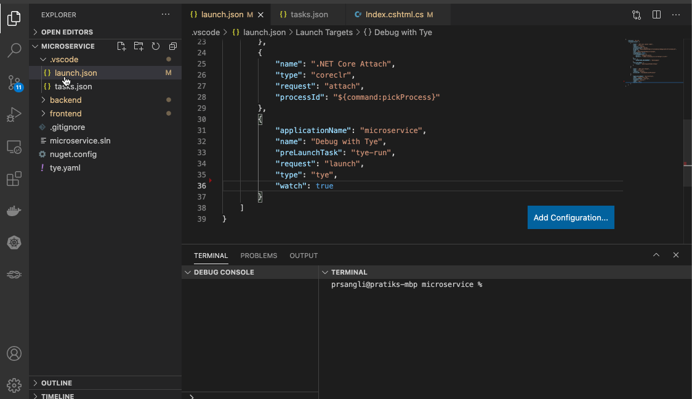
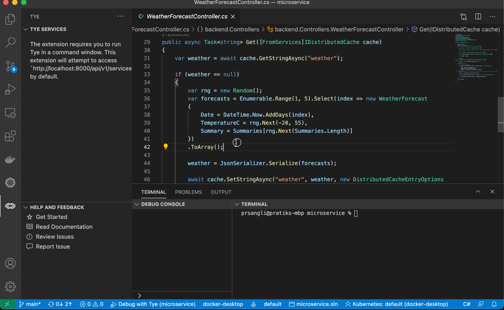
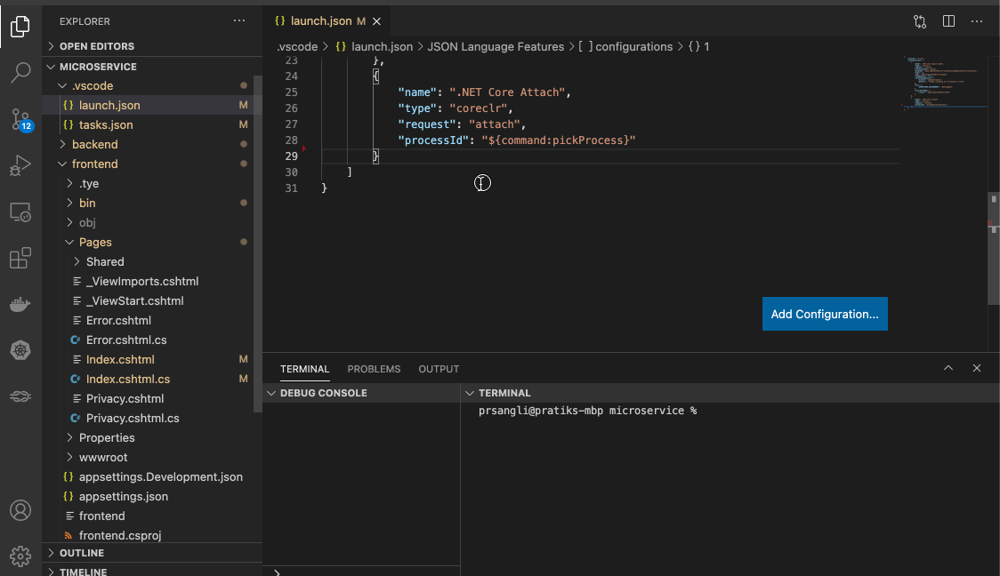

We are excited to announce the availability of our [Visual Studio Code Tye extension](https://aka.ms/vscode-tye), which makes it easier to view, run, and debug applications that are using [Tye](https://github.com/dotnet/tye) from within Visual Studio Code (VS Code).  
This is a continuation of the [Tye](https://github.com/dotnet/tye) experiment, where we are learning what the best cloud native tooling experiences could be. Tye is a developer tool that makes developing, testing, and deploying microservices and distributed applications easier. If you haven't tried Tye yet, give it a try with the help of the [getting started guide](https://github.com/dotnet/tye/blob/main/docs/getting_started.md).  

[cta-button align='center' text='Download Visual Studio Code Tye extension' url='https://aka.ms/vscode-tye'  color='#D83B01']

## View and manage your Tye application
The VS Code extension makes it easier to initialize, run, view, and manage your Tye application from within VS Code. As you can see in the video below, the services are displayed in the Tye Explorer as soon as the Tye application is up and running.  

From the explorer, you can view the logs for any of your services, browse to services that have accessible endpoints, and even attach a debugger to any of the .NET services! We have also included a link that lets you quickly navigate to the browser-based Tye dashboard that you may already know and love.

<figure class="video_container" align="center">
  <iframe src="https://www.youtube.com/embed/-UQau95Fz6U" title="View and manage your Tye application" frameborder="0" allow="accelerometer; autoplay; clipboard-write; encrypted-media; gyroscope; picture-in-picture" allowfullscreen="true"></iframe>
</figure>

## Debug the Tye application like a pro 
The extension provides flexibility to support various debugging scenarios with the ability to run your Tye application without debugging, or to debug all or a subset of services.  
The extension also allows you to debug the services in `watch` mode where the debugger will watch for any code changes and reattach to the process to allow you to continue debugging without restarting your app.  

> **Note:**  
> Debugging your Tye application requires a Tye-specific task and launch configuration. The extension helps you scaffold the default task and launch configuration with the **Tye: Scaffold Tye Tasks** command as described in the [section below](#scaffold-tye-tasks-with-ease).  

### Attach the debugger to already running services
The extension offers attaching the debugger to already running project-based services. To attach the debugger to all project-based services, open **Tye Explorer** and click on the **Debug** icon located next to the section **Tye Services**.  
Alternatively, to debug a single service, select the replica of the service you want to debug, and click on the **Attach** button located next to the name of the replica.

<figure class="video_container" align="center">
  <iframe src="https://www.youtube.com/embed/cupggY6qJ0w" title="Attach the debugger to already running services" frameborder="0" allow="accelerometer; autoplay; clipboard-write; encrypted-media; gyroscope; picture-in-picture" allowfullscreen="true"></iframe>
</figure>

### Debug with Tye configuration
The extension offers debugging multiple services with the help of the **Debug with Tye** launch configuration. The default scaffolded configuration attaches the debugger to all project-based services, but you can configure it to attach to only a subset of services. To debug multiple services, with the **Debug with Tye** debug configuration selected you can just press (<kbd>F5</kbd>).

<figure class="video_container"  align="center">
  <iframe src="https://www.youtube.com/embed/t1Lz_rvT8Kg" title="Debug multiple Tye services" frameborder="0" allow="accelerometer; autoplay; clipboard-write; encrypted-media; gyroscope; picture-in-picture" allowfullscreen="true"></iframe>
</figure>

To debug a subset of services, open the file *.vscode > launch.json*, and edit the **Debug with Tye** configuration to add the property `services` with value of an array of services that you want to debug.

### Shorten your developer inner loop by debugging your application in `watch` mode
The extension supports attaching the debugger in `watch` mode, which watches for code changes and reattaches to the respawned process after the code changes.  
Debugging in `watch` mode enables you to focus on the code-debug loop and not have to restart your app or re-attach the debugger after every code change.

<figure class="video_container"  align="center">
  <iframe src="https://www.youtube.com/embed/MkqB3G4dHdM" title="Debug in the watch mode" frameborder="0" allow="accelerometer; autoplay; clipboard-write; encrypted-media; gyroscope; picture-in-picture" allowfullscreen="true"></iframe>
</figure>

To attach the debugger in `watch` mode,
* Open the file *.vscode > tasks.json* and add the property `"watch": true` to the **tye-run** task, and
* Open the file *.vscode > launch.json* and add the property `"watch": true` to the **Debug with Tye** launch configuration.  

Now, debug the application using the **Debug with Tye** configuration to see it in action.

### Run the Tye application without debugging
To run the Tye application without attaching the debugger, open the Command Palette (<kbd>F1</kbd>), and then type `task`, followed by a <kbd>space</kbd> and `tye-run`.

## Scaffold Tye tasks with ease
The extension offers commands to scaffold the task and launch configuration to run and debug the Tye application. Open the Command Palette (<kbd>F1</kbd>), and use the **Tye: Scaffold Tye Tasks** command to scaffold:
* The **tye-run** task which you can use to run your Tye application without leaving VS Code.
* The **Debug with Tye** configuration which enables you to debug services in your Tye application.

## Help our experiment by sending us your feedback
Your bug reports and suggestions are very important to us as we continue to learn about the problems you have and how close Tye is to solving them – please keep those suggestions and problem reports coming!

You can report issues about Tye by opening an issue on GitHub at [https://github.com/dotnet/tye/issues](https://github.com/dotnet/tye/issues) and you can report issues about the extension by clicking on **Report Issue** button in the **Help and Feedback** section or opening an issue on GitHub at [https://github.com/microsoft/vscode-tye](https://github.com/microsoft/vscode-tye).

## Download the Visual Studio Code extension for Tye today!
We hope you enjoy the Visual Studio Code extension for Tye as much as we enjoy working on it. You can download the extension from the Visual Studio Code extensions marketplace by opening the **Extensions** view in VS Code and searching for **Tye** or by clicking the link below.

[cta-button align='center' text='Download Visual Studio Code Tye extension' url='https://aka.ms/vscode-tye'  color='#D83B01']