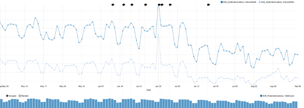
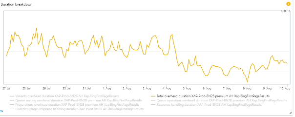
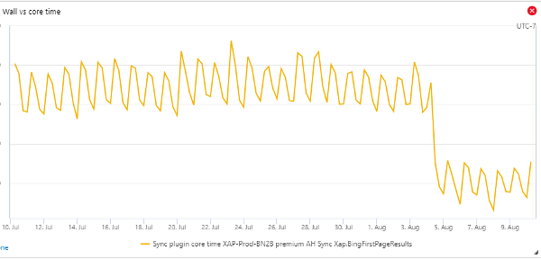
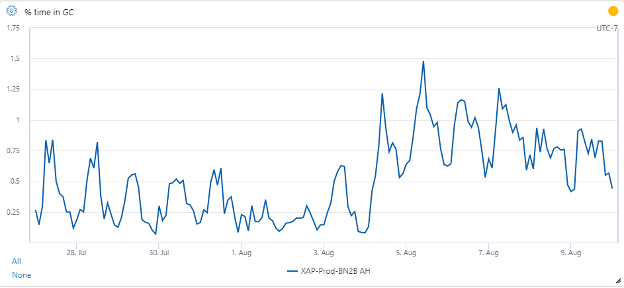
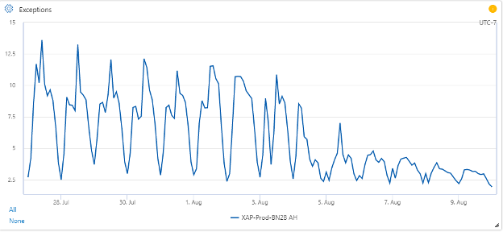
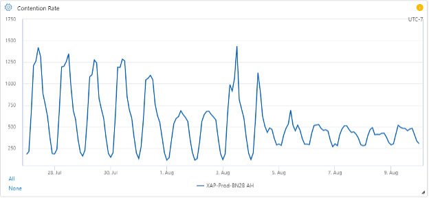
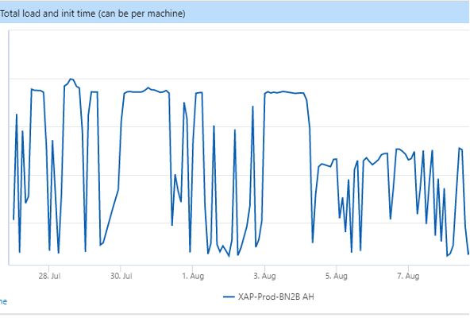
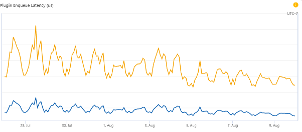
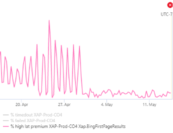

Bing runs one of the world’s largest, most complex, highly performant, and reliable .NET applications. This posts discusses the the journey and the work required to upgrade to .NET, including the significant performance gains we achieved.

This application sits in the middle of the Bing architecture stack and is responsible for much of the coordination among thousands of other components that provide results for all queries. It is also at the heart of many other services outside of Bing.

The team that owns this component is called XAP (“Zap”). I have been a member of this team since 2008, shortly after I joined Microsoft (when Bing was Live Search!). In 2010, we migrated most of our stack from C++ to .NET Framework.

The efforts to migrate XAP to .NET Core began in July of 2018. We consulted with teams that had already done this migration, such as Bing’s UX layer, as well as the .NET team itself.

The XAP team has long relied on a close working relationship with the .NET team, especially the Common Language Runtime (CLR) portion of that team. With the announcement of .NET Core, we knew that we would want to migrate. The anticipated performance benefits, open-source nature, and faster development turnaround were additional incentives.

This migration has been an unqualified success for our team, with improvements in performance and agility already obvious.

## XAP: A Primer

To provide some context, let me convey a high-level picture of XAP's architecture.

Three years ago, Mukul Sabharwal [detailed on the blog](https://devblogs.microsoft.com/dotnet/bing-com-runs-on-net-core-2-1/) how his team had migrated Bing’s frontend to .NET Core. Sitting underneath this UX layer is a high-performance workflow execution engine that manages the coordination and communication amongst the various data backends that feed Bing. This middle layer is also used in many non-Bing services within Microsoft.

It is worth noting that the Bing frontend team has already moved on to .NET 6 previews. They went into production with .NET 6 Preview 1 and are now on Preview 4. They have seen some very significant improvements, primary related to the new [crossgen2 features](https://devblogs.microsoft.com/dotnet/conversation-about-crossgen2/).

The XAP team has two major areas of ownership:

1. Operating this middle portion of the live site for Bing (and other search-related applications such as Sharepoint, Cortana, Windows Search, and more).
1. Providing the runtime, workflow engine, tools, and SDK for our internals partners to build and operate scenarios themselves on this platform.

In Bing, our largest workload, XAP operates thousands of machines across a global set of data centers. On each machine, XAP is loading over 900,000 workflow instances and 5.3 million plugin instances—all in a process with a 50 GB heap that loads 2,500 unique assemblies, and JITs over 2.1 million methods.

At its most fundamental, XAP’s ApplicationHost is a host for independently developed plugins (functions), grouped into a directed acyclic graph called a workflow. Workflows consist of plugins and other workflows. XAP’s job is to execute this workflow as efficiently and quickly as possible.

A typical Bing query will execute about 12,000 nodes (including over 2000 network calls) in a few hundred milliseconds. A single machine typically executes over 30,000 nodes per second at peak.
In order to execute efficiently, as well as maintain a safe system, we enforce numerous constraints on plugin authors, such as:

* Limited API surface area. No process-altering APIs, no threads, no I/O, no synchronization. Those capabilities are all managed via the workflow engine and specialized plugins (e.g., Xap.HTTP).
* Immutable state. Plugins cannot reference mutable static data. Their outputs are made immutable to avoid synchronization in their dependents.
* Strict monitoring. Plugins have tight latency requirements, and after a timeout we will start running their dependents. Plugins that fail often are automatically disabled.

The runtime engine is also highly optimized to execute these plugins efficiently. We avoid thread synchronization as much as possible, we minimize our memory allocations, we [pool large objects](https://github.com/microsoft/Microsoft.IO.RecyclableMemoryStream) to avoid repeated Large Object Heap allocations, and we generate code to more efficiently execute dynamically loaded plugins.

## Performance Results

Before releasing to production, we had been running various builds on multiple test machines and carefully analyzing the results. Once we were reasonably confident, we expanded to small-scale production experiments. Starting with ten random machines running on .NET 5, we gradually expanded the experiment until an entire data center was running .NET 5 in production.

### Production Results

We began rolling out .NET 5 preview 6 to production on one data center on July 8, 2020, nearly 2 years after the project began. (We have since upgraded to the RTM of .NET 5.)

We delayed rollout on other data centers for several weeks to give us ample time to monitor stability and performance.

#### Latency

Latency is one of the primary metrics we track.

One data center’s migration is particularly noticeable:

Here is a high-level summary for multiple environments. These numbers are approximate and taken from daily averages over multiple months. They measure the % improvement in two percentiles.

| Environment | P95 % Improvement | P99 % Improvement |
|-------------|------------------------|------------------------|
| A           | 3%                    | 5%                    |
| B           | 4%                    | 7%                    |
| C           | 1%                    | 2%                    |
| D           | 12%                   | 14%                   |
| E           | 7%                    | 10%                   |

There is a wide variation between these data centers, which can be explained by differences in traffic and machine configuration.

#### Overhead Latency

The total time that ApplicationHost adds to query execution decreased by 11%:

#### CPU

Overall CPU usage showed a drop of about 27%, and the difference is especially obvious when we look at the aggregate CPU time taken by non-I/O plugins in a BingFirstPageResults query:

#### Garbage Collection

Measuring the precise impact of GC across the builds is tricky with counters. Not only has the GC implementation significantly changed, but we’ve applied new configuration in .NET Core.

The % Time in GC counter has increased:

It has gone from an average 0.3% to 0.8%, a lot in relative terms, but not very much in absolute terms.

One explanation for this is a change we made in consultation with the CLR team, after much measurement, to decrease the size of the Gen0 budget. This caused GCs to be faster, but more frequent. This directly contributed to improvements in overall query P99 latency, but it comes at the cost of more time spent in GC. This is an area of active investigation to see if we can improve further, and there are some promising leads in some other configuration tweaks.

#### Exceptions

The average exception rate dropped significantly:

It went from an average of 7.8/sec to 3.5/sec, an improvement of 55%.

#### Lock Contention

Managed lock contention showed a large drop in the peaks, but slightly higher baseline levels:

On average, it dropped from 645 contentions/sec to 410 contentions/sec, an improvement of 36%. This is more significant for the fact that .NET Core changed the algorithm for locks, going to a wait state more quickly than in .NET Framework (which would spin for a while). Thus, a significant portion of the contentions under .NET Core might not have been counted at all in .NET Framework.

#### Startup Times

A reduction in startup time is important because it means that less of each data center is down while we deploy (multiple times per day), leading to lower peak latencies and higher availability at peak load.

Startup time decreased significantly:

Startup time is primarily driven by warmup time, where we run non-user queries through the system before accepting real traffic. Warmup time is determined by CPU time. The 28% drop is strongly correlated with drops in overall plugin CPU usage.

#### ThreadPool

One way we measure efficiency is how long plugins that are ready to be executed stay in the queue waiting for a free processor. This metric is also determined by CPU usage, so it’s not a pure measure of thread pool efficiency.

Average P95 enqueue latency dropped about 31%. Average P99 enqueue latency dropped about 26%.

## Migration Approach

The performance numbers are great, but what about the work that went into achieving them? It's worth highlighting the goals for our migration:

1. Flexibility in choosing whether a machine loaded under .NET Framework or .NET Core. This would allow us to:
   * Dynamically switch back and forth based on infrastructure concepts such as Machine Function, Scale Unit, Environment, or Data Partition.
   * Rollback in production, even months after we migrate.
   * Make changes in our repository without interfering with others’ work. By ensuring that code worked under both runtimes, nobody had to do anything special—we were testing both.
1. Single code base
1. Single copy of binaries
1. Avoiding the need to migrate all our partners to target netcore/netstandard from the beginning. This would have been impossible.

With those principles in mind, we embraced a hybrid approach to building and running the XAP platform:
1. Continued to build the platform under .NET Framework 4.7.2.
1. Used the ApiPort tool to verify API-level compatibility. This ensured that all .NET library calls we made in our platform existed in .NET Core as well.
1. Developed a custom CoreCLR-based host application that dynamically loaded and executed the Framework-built binaries.

This approach helped simplify the testing and deployment aspects of this project and it allowed all our partners to continue developing their scenarios exactly how they were before without having to migrate everything to a new platform at once.

We will eventually migrate all of our binaries to build directly against netstandard2.0 and .NET 5 directly and have no more need for the hybrid approach.

## Challenges

Soon after we began this effort, we realized that the challenges we would face would be numerous and of a different type and scale than what other teams had experienced.

### A Binary Problem

Quite a few assemblies that XAP uses are required for the service to even startup or process a single query. Without fixing every dependency, it is impossible to even start testing. There are dozens of these dependencies. It is an “all or nothing” kind of problem.

### C++/CLI

When we started the migration process, .NET Core was at version 2.0, which did not support C++/CLI. These DLLs would not even load. Bing uses a number of common infrastructure components that are surfaced to managed code via C++/CLI interfaces.

Without these assemblies, the process cannot even bootstrap itself, let alone process queries.

With the help and cooperation of teams throughout the company, we converted all of them to use P/Invoke interfaces.

Even with support in the latest version of .NET Core for C++/CLI projects, these assemblies would require being rebuilt. Since we’re already on the new interfaces, this isn’t necessary for us to pursue.

### Incompatible Code

The XAP runtime consists primarily of a hosting process named ApplicationHost, as well as all the libraries we provide to partners to execute on our platform.

We relied on many managed libraries that had small pieces using APIs that did not exist in .NET Core.

Examples include:

* In-memory caching that used .NET’s MemoryCache library
* A hash computation library
* .NET remoting (WCF)
* HTTP functionality
* Custom assembly loading

Each case required separate resolution. In some cases, there were alternate APIs in .NET we could switch to. In others, we needed to upgrade libraries. Often, this led to a long chain of upgraded dependencies.

Hundreds of our partners’ plugins also used various APIs that did not exist in .NET Core. The number of unique broken APIs was relatively small—perhaps a dozen or so. But the number of plugins and partner teams that owned those plugins was daunting. We work with over 800 developers throughout the world and it was a challenge for the XAP team to communicate with all of them.

So we developed automated tools to scan all plugins using the .NET team’s ApiPort tool. We included these as part of the automated deployment processes that all plugin authors must go through, first as a warning, then as a blocking error. We put together documentation about the most common incompatibilities and the recommended changes to bring them into compliance. Plugins that had been abandoned by their teams were permanently disabled.

### .NET Bugs and Functional Changes

There were many challenges the XAP team faced because of some areas of highly specialized functionality that we have built. Sometimes we relied on unstated assumptions and internal functional changes in .NET caused behavioral changes we needed to resolve. In other cases, our extreme levels of scale and unique architecture brought out bugs that other testing had yet to find.

#### Loader

XAP relies on some very specific functionality for the way we consume our partners’ assemblies to achieve side-by-side assembly loading. This is a fundamental part of our isolation model. Some subtle differences in .NET's loader required us to do a detailed investigation and we ultimately escalated to CLR developers, who found at least two bugs ([dotnet/runtime #12072](https://github.com/dotnet/runtime/issues/12072) and [dotnet/runtime #11895](https://github.com/dotnet/runtime/issues/11895)), one of them a critical stack overflow crash. We were required to make some changes to our code as well.

In addition, because of our traces and investigation, they fixed an [assembly resolution performance bug](https://github.com/dotnet/coreclr/pull/24450) that was impacting us. 

Our unique architecture and scale allowed us to highlight these obscure bugs well before others would have found them.

#### ETW and TraceEvent

Another significant challenge was with the Microsoft.Diagnostics.Tracing.TraceEvent library. When ApplicationHost was first built and we decided on ETW as our logging mechanism, ETW technologies were not yet in the .NET Framework, and the open source versions were at an early stage. We forked the code for both `EventSource` and `TraceEvent` into our own private versions, and they diverged over the ensuing ten years. For various reasons, it proved difficult and costly for us to migrate to the official version once they were more available.

Finally, we migrated to the official package, finding a couple of [small](https://github.com/Microsoft/perfview/pull/929) [bugs](https://github.com/dotnet/runtime/pull/848) along the way.

Another couple of [interesting](https://github.com/dotnet/runtime/issues/34423#event-3194025711) [bugs](https://github.com/dotnet/runtime/pull/35793) we ran into that were fixed in .NET 5 were related to the CLR’s event provider. When our logger code rolls over files, it needs to unsubscribe from the events it listens to, including CLR events. When the logger re-subscribes to the events for the new files, it never received the CLR events anymore. Even external tools, such as PerfView, which we rely on for debugging and performance profiling, could no longer receive these CLR events. The bug was challenging mostly because it was very difficult to reproduce, and our usage pattern was likely a bit unusual.

#### Performance Counters

XAP is very metric-focused. We collect 6 billion events/min across 500 million time series. Most of these are our own, but we rely on many system and .NET-level counters. In .NET Core 2.x, this infrastructure was non-existent, and we were blind in many areas.

Starting in .NET Core 3.x, some performance counters were made available. We have asked for quite a few more to be added. See [here](https://github.com/dotnet/runtime/issues/1098), [here](https://github.com/dotnet/runtime/issues/1099), and [here](https://github.com/dotnet/runtime/issues/11227). Many of these were added in .NET 5.

#### Exception-Handling Bug

While not strictly a bug due to the migration, this was conflated with many of our other issues while investigating performance, and we dealt with it in tandem with other investigations into CLR performance.

For quite a while XAP had been noticing long pauses in unusual places in query execution—places where there is no obvious cause. With help from the CLR team, we gathered traces and discovered that the thread pause was being blocked by the exception-handling mechanism doing disk I/O in some very specific edge cases. This was an acknowledged bug, but curiously all the relevant stacks were from a single plugin that was throwing exceptions (and catching them) on nearly every query. We saw with ETW events that it was the biggest source of exceptions in the process and asked the code owner to do some validation before calling the exception-throwing API (this was a trivial fix for them).

Once the partner team deployed, the mysterious thread pauses were resolved and the biggest source of our high-latency queries cleared up. The CLR team has since fixed the [bug](https://github.com/dotnet/runtime/issues/35866). This graph gives an idea of the impact of this fix, showing the change in percentage of very-high latency queries:

#### GC Changes

A big change that helped us was in how memory is decommitted. The [change](https://github.com/dotnet/runtime/pull/35896) moved decommit out of the GC pause for server GC and made a number of other changes to improve the performance. 

### HTTP Stack

One of the most challenging areas of transition was in our HTTP client stack. Worldwide, our HTTP plugin is called by our partners more than 7.5 million times per second.  .NET Framework and .NET Core have very different HTTP client stacks. Given that one of our important goals was to have a single code base and be able to transition between Framework and Core with just a process restart, we had very important problem to solve.

In .NET Framework, we were relying on functionality in `ServicePointManager` and `WebRequestHandler`, neither of which are present in .NET Core. At first, it was recommended to move to `WinHttpHandler`, but this class is missing a lot of the functionality we relied on. There were real implications for performance should we adopt it, as some backend teams in Bing implemented load balancing that was impossible to achieve using `WinHttpHandler`. The ultimate recommendation, `SocketsHttpHandler`, was only available for .NET Core.

Our situation can be summarized by the following table:

| Library | Contains Needed Functionality | .NET Framework Compatible? | .NET Core Compatible |
|---------|-------|----------------------------|----------------------|
| `WebRequestHandler`  | Yes | Yes| **No** |
| `WinHttpHandler`     | **No** | Yes | Yes |
| `SocketsHttpHandler` | Yes | **No** | Yes |

We didn’t want to move to `WinHttpHandler` and end up in the worst of both worlds. In the end, we created an HTTP interface that dynamically loaded either `WebRequestHandler` or `SocketsHttpHandler`, depending on what runtime was in use. Both of those classes have similar functionality, but don’t share a common interface, so we developed our own.

In addition, in .NET Framework, some TCP settings are set process-wide via `ServicePointManager`, but in .NET Core, they are set on the `SocketsHttpHandler` object. This meant a little more conditional code in the app.

### Scaling Engineering Effort

Because of the binary nature of so many parts of this massive project, it was easy to become completely blocked, especially at early stages. For example, while we were waiting for C++/CLI libraries to be migrated to P/Invoke, we would only work on other things that we knew would be a problem. There was no way to actually start up the ApplicationHost and test it out or see what else was broken. There were many issues like this. Of course, other work was still simultaneously being done; for example, building systems to analyze our partners’ code. 

## Conclusion

Overall, .NET 5 demonstrates a significant performance improvement over .NET Framework in XAP’s scenario. While there is still more work to do, the overall picture is clear that .NET 5 is phenomenally superior in most respects.

We hope that the lessons learned from XAP’s migration story will help guide other teams at Microsoft and the larger industry as they contemplate migration to .NET 5 and beyond.
