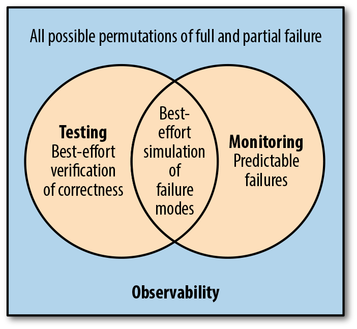

Diagnostics has always been a fundamental part of the .NET development experience. It enables developers to understand the runtime behavior of their programs, at both a high- and low-level. It's also the set of tools that developers reach for to root-cause a failure and resolve it. The diagnostics team primarily builds low-level APIs that IDEs (like Visual Studio), Cloud Services (like Application Insights) or other systems use to provide end-user experiences. More recently, the team has been focused on command-line tools that provide end-user experiences of their own.

We’re using the [conversation format](https://devblogs.microsoft.com/dotnet/category/conversations/) again, this time with runtime engineers who work on diagnostics and related topics.

* [David Mason](https://github.com/davmason)
* [John Salem](https://github.com/josalem)
* [Mike McLaughlin](https://github.com/shirhatti)
* [Noah Falk](https://github.com/noahfalk)
* [Sourabh Shirhatti](https://github.com/mikem8361)
* [Tom McDonald](https://github.com/tommcdon)

## Please define these terms: “debugging”, “diagnostics”, and “observability”.

**David:** I view diagnostics as the broader concept, if you need to get information back from an executing program it probably falls under the umbrella of diagnostics. Debugging and observability are two types of diagnostics. Debugging is when a developer wants to get specific information about how a program is executing that is relevant to fixing a bug. Observability is more about knowing what happens with a system in production. Is it still up? Is it in some error state?

**Mike:** "debugging" is interactive diagnostic experience. "diagnostics" is more general set of tools and services.

**Tom:** Debugging - the ability to analyze application defects in source code or memory.

Diagnostics - broad term that includes debugging, profiling, metrics, logging.

Observability - provide insights in systems, both single and distributed.  This may include metrics, logs, and other data that helps others to understand the operational status of a system.

**John:** Debugging: Deeply inspecting a running application or memory dump. And... if I'm being honest: the occasional printf statement that says "MADE IT HERE!". I'm looking at things like memory values, and watching step-by-step execution of my code sometimes down to the assembly level.

Diagnostics: I use this as a catchall phrase for anything and everything from debugging to logging. Diagnostics is the category of work that enables me--the developer--to better understand my application and how it works. I wrote the code, but the code will only do what I wrote it to and sometimes that doesn't match what I intended. Diagnostics is the activity of trying to match up my intent with what the code is doing.

Observability: A subset of diagnostics that's used as information for higher-order decision making.

**Sourabh:** Observability is a property of a system that has been designed, built, tested, deployed, operated, monitored, and maintained. An observable system isn't achieved by plainly having monitoring in place. It is a feature that needs to be enshrined into a system at the time of system design.

I'll pass on debugging and diagnostics besides saying that observable systems are debuggable and diagnosable

(paraphrased/cited from the [Distributed Systems Observability](https://www.oreilly.com/library/view/distributed-systems-observability/9781492033431/))

**Noah:** Debugging - Used broadly, any steps that a developer takes to troubleshoot and fix an app. Used narrowly it can also mean specifically using a debugger to fix an app.

Diagnostics - All the tools and techniques to understand how an app is operating, usually for the purpose of fixing a problem.

Observability - An old control theory term that meant you could determine the internal state of a system by observing its output. More recently the term was repurposed to mean anything that helps engineers understand how an application is operating. Often people narrow it refering to a few canonical ways of understanding app behavior using logs, metrics, and distributed tracing

## The CLR has traditionally had debugger and profiler APIs. Are there observability APIs, too?

**Sourabh:** Log, metrics, and distributed traces are often known as the three pillars of observability. I consider .NET libraries for logging ([Microsoft.Extensions.Logging](https://docs.microsoft.com/dotnet/api/microsoft.extensions.logging), [System.Diagnostics.Tracing.EventSource](https://docs.microsoft.com/dotnet/api/system.diagnostics.tracing.eventsource)), metrics ([EventCounters](https://docs.microsoft.com/dotnet/core/diagnostics/event-counter-perf), [System.Diagnostics.Metrics](https://github.com/dotnet/core/issues/6099#issuecomment-857049258)) and distributed tracing ([System.Diagnostics.Activity](https://docs.microsoft.com/dotnet/api/system.diagnostics.activity)) to be the observability APIs for .NET.

Additionally, the observability APIs in .NET are largely compatible with [OpenTelemetry](https://devblogs.microsoft.com/dotnet/opentelemetry-net-reaches-v1-0/) (a [CNCF](https://www.cncf.io) observability framework) giving .NET customers access to a whole ecosystem of tools to egress to and analyze their observability data.

**Mike:** I assume that our counters, logging and eventing would be considered observability APIs.

**John:** The runtime has a set of easily consumable metrics APIs in the form of [EventCounters](https://docs.microsoft.com/dotnet/core/diagnostics/event-counters). These allow you to collect information on everything from the number of GCs to the number of exceptions in a super lightweight manner. You can collect these in-process using EventListener or out of process using [`dotnet-counters`](https://docs.microsoft.com/dotnet/core/diagnostics/dotnet-counters) or other diagnostics tooling.

**David:** Interestingly, the [ICorProfiler APIs](https://docs.microsoft.com/dotnet/framework/unmanaged-api/profiling/icorprofilerinfo-interface) are mostly used for observability these days. When we introduced them back in the early days of .NET, we intended that they would be used for profiling and named them accordingly, but as time has gone on we've found that it's easier to achieve profiling via eventing. If you want to profile an app, i.e. find out where it is spending its time, how much memory it uses, etc, then we have great solutions delivered via eventing - first [ETW](https://docs.microsoft.com/windows/win32/etw/event-tracing-portal) on windows, and now our cross platform [EventPipe](https://docs.microsoft.com/dotnet/core/diagnostics/eventpipe) implementation in the runtime. If we think that a bit of information is broadly applicable for profiling, we emit it as an event and enable the ecosystem of profilers consume it.

The niche that ICorProfiler fills at this point is as a general purpose extensibility API for the runtime. We find that lots of 3rd party developers use it to create APM solutions that mainly focus on observability of systems in production.

In addition to ICorProfiler being used for observability, we also have other specific APIs for observability - for instance our [dotnet-monitor](https://devblogs.microsoft.com/dotnet/whats-new-in-dotnet-monitor/) and [dotnet-counter](https://github.com/dotnet/diagnostics/blob/main/documentation/dotnet-counters-instructions.md) tools.

**Noah:** Definitely. Under a broad definition of observability, the debugger and profile APIs are observability APIs as well as all our APIs for logging, distributed tracing, metrics, and dump collection. Under a narrower view many people would probably look most at logging ([ILogger](https://docs.microsoft.com/dotnet/api/microsoft.extensions.logging.ilogger), [Trace](https://docs.microsoft.com/dotnet/api/system.diagnostics.trace), [EventSource](https://docs.microsoft.com/dotnet/api/system.diagnostics.tracing.eventsource)), metrics ([EventCounter](https://docs.microsoft.com/dotnet/api/system.diagnostics.tracing.eventcounter) and the very new [System.Diagnostics.Metrics](https://github.com/tarekgh/designs/blob/Metrics/accepted/2021/System.Diagnostics/Metrics-Design.md)), and distributed tracing ([System.Diagnostics.Activity](https://docs.microsoft.com/dotnet/api/system.diagnostics.activity)).

**Tom:** .NET has several API's and capabilities that provides observability to apps (or systems). Debugging and Profiler API's are one, aspect. We provide metrics and logs which provides high-level observability. API's, such as [EventSource](https://docs.microsoft.com/dotnet/api/system.diagnostics.tracing.eventsource) can be used to provide customized data which is useful for observability.  

## How have diagnostic capabilities improved over the past 5-10 years?

**Mike:** Dump collection ([createdump](https://docs.microsoft.com/dotnet/core/diagnostics/debug-linux-dumps)/[dotnet-dump](https://docs.microsoft.com/dotnet/core/diagnostics/dotnet-dump) collect), dump analysis (dotnet-dump and [SOS](https://docs.microsoft.com//dotnet/core/diagnostics/dotnet-sos) improvements), debugging reliability (bugs fixed), cross-plat diagnostics (tooling for Linux and MacOS) and diagnostic documentation have improved.

**David:** We went cross-platform in .NET Core and one of the great things to see is that our internal and external partners are providing compelling experiences on Linux. We have done a lot of work to make ICorProfiler a first class citizen on Linux and Mac, and it's great to see that our partners are delivering their APMs also cross-platform.

**Sourabh:** In my opinion, the biggest improvement has been bringing most of our diagnostics capabilities cross-platform with a unified tooling to collect and analyze diagnostic artifacts.

The [Diagnostic Server](https://github.com/dotnet/diagnostics/blob/main/documentation/design-docs/ipc-protocol.md) (and [EventPipe](https://docs.microsoft.com/dotnet/core/diagnostics/eventpipe)) along with the ecosystem of the dotnet-* diagnostic CLI tools offer an OS-agnostic way to query the runtime for memory dumps, CPU profiles, and events.

**John:** Most .NET diagnostics were historically Windows-specific. With .NET Core, we specifically focused on moving our diagnostics story to cover all platforms where it can run. We added the Diagnostics IPC server and EventPipe to the runtime to allow eventing in a unified manner across all platforms. This means we can use the same tools everywhere. Our partner teams have worked to allow for opening Linux dumps on Windows as well. We are living in a world, where I can develop on Windows, deploy on Linux, collect diagnostics information on Linux, and then triage that wherever I want. This kind of flexibility allows us to put the analysis front and center. The mental distance from collection to analysis is much shorter now.

**Tom:** We have made our offerings cross-platform. Our diagnostic tooling such as [dotnet-counters](https://docs.microsoft.com/dotnet/core/diagnostics/dotnet-counters), [dotnet-trace](https://docs.microsoft.com/dotnet/core/diagnostics/dotnet-trace), [dotnet-stacks](https://docs.microsoft.com/dotnet/core/diagnostics/dotnet-stack), [dotnet-dump](https://docs.microsoft.com/dotnet/core/diagnostics/dotnet-dump), ..  run on all platforms.  For example, it used to be much better to be running on Windows, because performance analysis tools would often be ETW-based.  We have cross plat solutions, such as EventPipe which provides much of what we had available on Windows-only on all platforms. Tools, such as dotnet-dump and dotnet-trace reduce the need to install extra tools. For example, dumps can be created and analyzed with one tool, on all platforms.  With dotnet-trace, you can collect a performance trace and analyze it on the machine using [speedscope](https://www.speedscope.app).

**Noah:** A lot has changed but a few that are top of mind:

* With .NET Core we added support for macOS and Linux operating systems. In some cases that meant taking tools like Visual Studio and adding remoting capabilities. Other times we integrated with tools native to those platforms like [lldb](https://lldb.llvm.org) and [perf](https://perf.wiki.kernel.org/index.php/Main_Page). We also started adding brand new platform agnostic tools (dotnet-dump, dotnet-counters, dotnet-trace) and cross platform implementations of underlying libraries that have all the logic those tools rely on.
* More recently we've been pushing much harder on logging, tracing and metrics APIs with improvements on all of them in the last couple years.
* Visual Studio has been innovating with some cool features like [Snapshot debugging](https://docs.microsoft.com/azure/azure-monitor/app/snapshot-debugger), [huge improvements in async](https://devblogs.microsoft.com/visualstudio/how-do-i-debug-async-code-in-visual-studio/), dump analysis rules, supporting new source and symbol server technology, and great quality of life improvements like pinnable properties

## Observability is an old scenario but has taken on new life with cloud native apps. Describe how you see it being used, now and in the future. What about dev vs production?

**John:** Observability is definitely moving in the direction of always-on data collection. We've got the infrastructure and data capacity to constantly be monitoring the heartbeat of our applications. Everything from CPU samples to a running metric of P99 latency. This information will help inform design and development decisions for cloud native applications.

**David:** There has been an interesting shift in how we think about debugging vs observability. There used to be a clean line, you ran your software locally and debugged it, or it ran somewhere else and you were thinking about telemetry, error reporting, etc. Now it's completely normal to run code on containers or other machines as part of the daily development cycle. This has led to a grey area between debugging and observability, you might be looking at logs and metrics as part of your daily work and VS has implemented features that allow you to debug production apps.

I think what we're seeing is that observability helps everybody and it should be a feature of the runtime and also a design consideration for end applications. There doesn't have to be a distinction between developer debugging and production monitoring. It's more of a dial you can turn up or down.

**Sourabh:** As modern application environments are polyglot, distributed, and increasing complex, observing your application to identify and react to failures has become increasingly complex. Projects like [OpenTelemetry](https://devblogs.microsoft.com/dotnet/opentelemetry-net-reaches-v1-0/) that standardize how this observability telemetry information is represented, propagated, and egressed to analysis backends is how it's being used today.

**Noah:** As many dev teams move to the cloud often they are trying to figure out how to update their approach to monitoring and troubleshooting. That could be as simple as figuring out how do they get the same kind of logging as they had before, or it could go much deeper because their needs changed and old diagnostic techniques are no longer as effective. Probably the biggest trends I see are increasing emphasis of metrics + distributed tracing and shifting to use more sophisticated distributed data collection systems that integrate in cloud environments. Some teams are happy managing that themselves with increasingly capable OSS and built in platform tools while others prefer having a paid APM solution to handle it. I think there has been a lot of focus on data collection and that often is still the hardest part to setup, but looking to the future there is a huge potential for our tools to analyze, integrate, and act on all this data more intelligently.

## Dotnet-monitor (as a scenario) seems like it is half built in the runtime, half as a tool. Is that the model you expect for new features going forward?

**Mike:** [Hot Reload](https://devblogs.microsoft.com/dotnet/introducing-net-hot-reload/) is another example of work in the runtime (improving and enabling code editing on live applications) and tooling (dotnet-watch, Visual Studio's CTRL-F5 scenarios, etc).

**David:** Having the tools decoupled from the runtime allows us to iterate faster and deliver features targeting previous runtimes. Our design goal has been to expose a service from the runtime that is as generic as possible, and then build the end user features as tools that ship decoupled.

**John:** I see [`dotnet-monitor`](https://devblogs.microsoft.com/dotnet/whats-new-in-dotnet-monitor/) as the culmination of a lot of runtime work over the last several versions. We've been building up the infrastructure in the runtime to allow a tool like `dotnet-monitor` to exist. I think at this point, though, `dotnet-monitor` is poised to add a lot of value on top of the infrastructure we've built into the runtime. It's going to be performing analysis and other higher-order functions based on the data we can send it. Up to this point, it's been a half-and-half scenario, but I think we're reaching a point where the tooling will be able to expand its use cases without changing the runtime and that is super exciting.

Lots of other tooling is taking a similar approach, e.g., hot reload. I think building infrastructure into the runtime that external tools can consume and execute on is a good strategy that's paid off.

**Sourabh:** Our upcoming work on "notification profilers" will add support for multiple non-mutative profilers in the runtime. I expect our model going forward is that we should have sufficient extensibility points in the runtime to polyfill any diagnostics functionality. Assuming something proves to be widely-used, it may graduate from a profiler-based polyfill to core functionality in the runtime. This is not dissimilar to how [eBPF](https://ebpf.io) has been used in the broader Linux community.

However, that being said I expect some functionality will always live outside the runtime. For example, `dotnet-monitor` includes an HTTP server which will never be a candidate for inclusion in the runtime. Certain end-to-end experiences will continue to be built in this manner with only a part of the functionality residing in the runtime.

**Noah:** That part-runtime part-tool work distribution is fairly fundamental. We have to get some information from where it is created (in your app) to where you want to see it (in a tool) and that requires some code operating in each place. We've tried to make the runtime data collection powerful and generic so that we'd be able to reuse it with many tools in the future, but I expect some new scenarios will require work in both places to get the optimal results.

## .NET has a culture and reputation for performance. Has performance improved for the diagnostics area?

**John:** It certainly has! We've spent several versions of dotnet building up the [Diagnostics IPC](https://github.com/dotnet/diagnostics/blob/main/documentation/design-docs/ipc-protocol.md) and [EventPipe](https://docs.microsoft.com/dotnet/core/diagnostics/eventpipe) infrastructure. Eventing is a important place to be highly performant since you may be turning events on in less than ideal times or want to have them on all the time. In .NET 6, we've increased the data throughput of EventPipe under high load by up to 2x what it was in .NET 5 and reduced the overhead of sending events as well. This means you can send more events in tighter resource situations.

**Mike**: We had some perf improvements on Linux and MacOS VS Code debugging (i.e. [`NotifyCrossThreadDependency`](https://docs.microsoft.com/dotnet/api/system.diagnostics.debugger.notifyofcrossthreaddependency) API calls) but there is still room for improvement.

**Noah:** Certainly. One really recent example was we updated .NET's random number generation algorithm so that we could create randomized distributed trace IDs 10-100 times faster than we were previously. Another one has been spending time optimizing the design of the new metrics API so that we could shave nanoseconds off the overhead. We want diagnostics to be something engineers can use freely and pervasively on .NET and the only way that can happen is if the functionality is super cheap and reliable.

## Related to performance, a lot of the recent managed code focus has been on async, value types, `Span<T>`, SIMD, and other low level concepts. Has the debugger kept up to that? What’s been made easier and what do you see as future opportunities?

**Sourabh:** Our diagnostics tools have made huge strides in improving the experience when debugging async code. The [parallel stacks for tasks view in Visual Studio](https://devblogs.microsoft.com/visualstudio/debugging-async-code-parallel-stacks-for-tasks/) can stitch together Tasks to present async logical call stacks. A similar view is present in both sos and [dotnet-dump](https://docs.microsoft.com/dotnet/core/diagnostics/dotnet-dump) analyze as well (parallelstacks command)

## The new hot reload experience sounds amazing. It sounds like EnC without debugger attach. Is that it or is there more to it?

## SnapPoints are an interesting experience. Do you see that as a long term feature or more a tranisition to cloud native practices?

## Profiling is a great scenario for the dev desktop. Does it play a role with cloud deployments?

**David:** Profiling is an overloaded term, there is performance profiling and then [`ICorProfiler`](https://docs.microsoft.com/dotnet/framework/unmanaged-api/profiling/icorprofilerinfo-interface) which we refer to as profiling on the runtime team. And both are absolutely playing a role in cloud deployments.

Performance profiling, i.e. finding out where an application spends its time, how much memory it uses, etc, is a vital scenario for cloud apps. We have put a lot of work into making the data easy to egress from scenarios where you are not directly logged in to a machine. The intention is that it's just as easy to profile your application in the cloud as it is on your local machine.

The `ICorProfiler` APIs are also used by many APM vendors to provide compelling products that allow you to monitor your distributed application. There are many companies that provide solutions that let you monitor your applications in real time, and include features that range from performance profiling to debugging to security analysis.

## How do you think of performance-oriented tracing vs diagnostics? Is there a line there? Are ETW, LTTNG, and PerfView diagnostic tools?

**John:** Tracing is definitely a part of diagnostics, 10000%. It's one of the first tools I reach for when I'm faced with a problem. [ETW](https://docs.microsoft.com/windows/win32/etw/event-tracing-portal), [LTTng](https://lttng.org), [PerfView](https://github.com/microsoft/perfview), [BPF](https://en.wikipedia.org/wiki/Berkeley_Packet_Filter), [perf](https://perf.wiki.kernel.org/index.php/Main_Page), etc. are all essential diagnostics tooling in my book. You aren't always diagnosing a program crash. A good chunk of the time, the problem is far more subtle.

Why does my P99 latency drop on Thursdays? Why did my application stop responding to requests for 5 minutes last night? Where is all my CPU time going? These are things that require point-in-time information (dumps, snapshots, etc.) and time-based information (CPU samples, events, traces, etc.). As we move closer to always-on profiling/tracing/metrics, these tracing tools will become even more essential to a good deployment of your application.

**Noah:** I think of tracing as being part of diagnostics and ETW, Lttng and PerfView are absolutely diagnostic tools. If we were dividing diagnostics into two parts, the first is often "does my app give the output I expected?" and the second part is "does my app have the performance, scale, and resource usage I expected?" Tracing can be helpful for the first and is essential for the second.

## What's a new feature that you've been working on that you think people will be excited about?

**Mike:** I think people will be excited about [Hot Reload](https://devblogs.microsoft.com/dotnet/introducing-net-hot-reload/) and improvements in core dump generation (native MacOS format dumps) and analysis.

**John:** Most of my work the last several months has been on performance of EventPipe, but we did recently ship a little tool I built called [`dotnet-stack`](https://docs.microsoft.com/dotnet/core/diagnostics/dotnet-stack). It's a super simple tool that will print the stack for a process. It's super simple and easy to use. Great with inner dev loop or getting a quick check on where a process is at.

**David:** Sourabh mentioned it already above, the "notification profilers" feature. Since the beginning of ICorProfiler we have only allowed one profiler to be loaded. There are some tricky APIs (ReJIT, Enter/Leave/Tailcall hooks) that would require an API rewrite to support multiple profilers accessing them, but the majority of the APIs are safe to use from multiple profilers. We are doing work to allow one "main profiler" that has access to all APIs, and then multiple "notification profilers" that can receive callbacks from the runtime, but not do any modificiations like IL rewriting.

**Noah:** In .NET 6 we are building a [new metrics API](https://github.com/tarekgh/designs/blob/Metrics/accepted/2021/System.Diagnostics/Metrics-Design.md) that will integrate well with [OpenTelemetry](https://devblogs.microsoft.com/dotnet/opentelemetry-net-reaches-v1-0/) and other 3rd party libraries. We hope it can do for metrics what [ILogger](https://docs.microsoft.com/dotnet/api/microsoft.extensions.logging.ilogger) has done for logging. Although we already have some metric APIs in .NET, the new API should bring new capabilities like multi-dimensional values, histograms for percentiles, and easier integration with the most common tools.

## Closing

As an industry, we've been transitioning from monolithic client/server apps to micro-service architectures over the past ~ decade. We've also seen a lot of businesses, non-profits, and governments -- particularly during the pandemic -- shift to more digital services. It is critical that developers have confidence in those services as they are working on them on their developer desktop and then be able to observe that their services are behaving as expected in production. The .NET diagnostics team has also been shifting its focus to adapt to these trends, with a lot more investment in observability, while continuing to improve interactive debugging. You can expect to see this trend continue in the coming years, as the industry continues its transition and has greater need on experiences like the ones the diagnostic team is building.

Thanks again to Tom, Sourabh, Noah, Mike, John, and David for sharing their insights on .NET diagnostic APIs and experiences.
