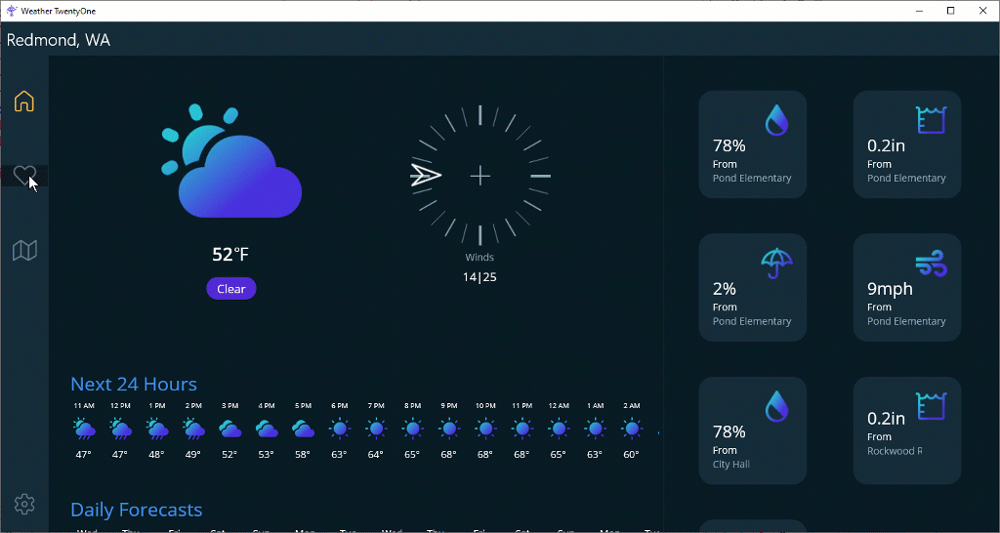
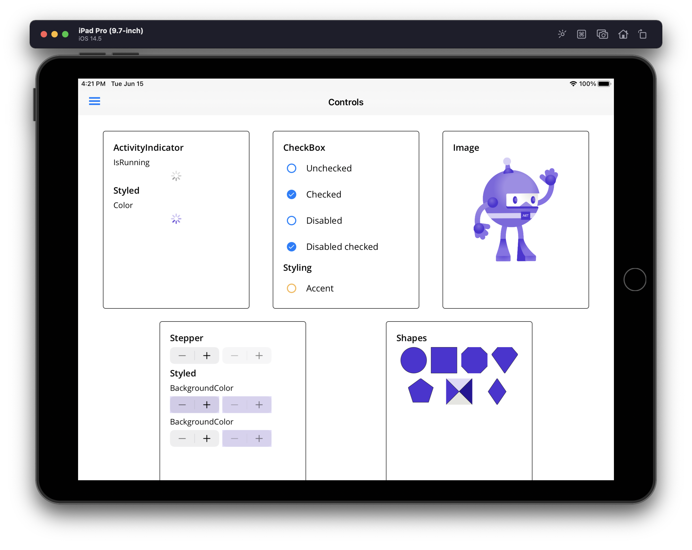
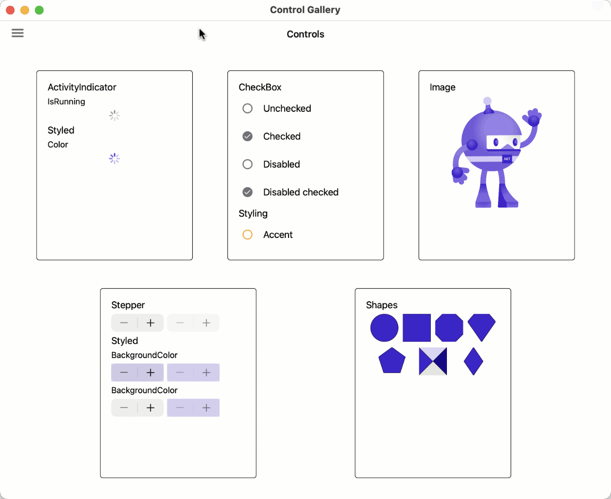
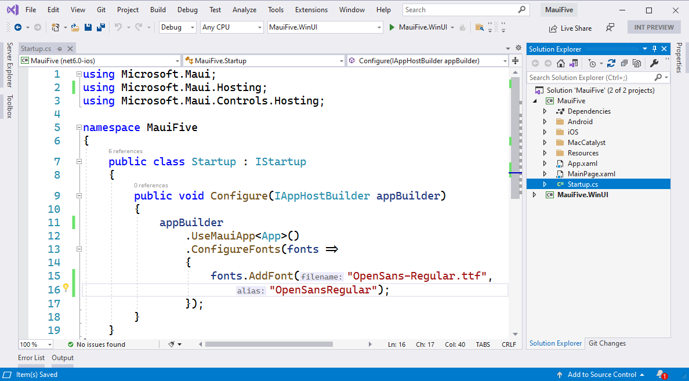

While we are still recovering from Microsoft Build and [.NET 6 Preview 4](https://devblogs.microsoft.com/dotnet/announcing-net-maui-preview-4/), we are here to share our continued progress with .NET Multi-platform App UI (.NET MAUI) Preview 5. In this release we have enabled animations and view transformations, completed the porting of several UI components, and introduced improvements to the single project templates.



## Animations

There are a few ways to perform [animation](https://docs.microsoft.com/xamarin/xamarin-forms/user-interface/animation/) in .NET MAUI, the easiest of which is using [view extension methods](https://docs.microsoft.com/xamarin/xamarin-forms/user-interface/animation/simple) such as `FadeTo`, `RotateTo`, `ScaleTo`, `TranslateTo`, and more. In the following example I grab a reference to each view bound to the layout (see [bindable layouts](https://docs.microsoft.com/xamarin/xamarin-forms/user-interface/layouts/bindable-layouts)) using the new [`HandlerAttached`](https://github.com/dotnet/maui/pull/1200) event:

```xaml
<DataTemplate x:Key="FavouriteTemplate">
    <Frame
        AttachedHandler="OnAttached"
        Opacity="0">
        ...
    </Frame>
</DataTemplate>
```

```xaml
<FlexLayout
    BindableLayout.ItemTemplate="{StaticResource FavouriteTemplate}"
    BindableLayout.ItemsSource="{Binding Favorites}"
    >
    ...
</FlexLayout>
```

When the page appears I then animate the views in with a slight stagger to create the beautiful cascade effect.

```csharp
public partial class FavoritesPage : ContentPage
{
    List<Frame> tiles = new List<Frame>();
    
    void OnAttached(object sender, EventArgs e)
    {

        Frame f = (Frame)sender;
        tiles.Add(f);
    }

    protected override async void OnAppearing()
    {
        base.OnAppearing();

        await Task.Delay(300);
        TransitionIn();
    }

    async void TransitionIn()
    {
        foreach (var item in tiles)
        {
            item.FadeTo(1, 800);
            await Task.Delay(50);
        }
    }    
}
```

For more complete orchestration of view animations, check out the [Custom Animation documentation](https://docs.microsoft.com/xamarin/xamarin-forms/user-interface/animation/custom) which demonstrates adding multiple child animations that can run parallel.

You can view and run the source for this example from the [WeatherTwentyOne project on GitHub](https://github.com/davidortinau/WeatherTwentyOne/).


## UI Components

In this release several controls now have all properties and events ported to handlers from the renderer architecture of Xamarin.Forms, including `ActivityIndicator`, `CheckBox`, `Image`, and `Stepper`. In previous previews you would need to check if a control was ported and register renderers from the compatibility package for those unavailable. In .NET MAUI Preview 5 we have made this much easier by updating the `UseMauiApp` extension (see the [Startup wiki](https://github.com/dotnet/maui/wiki/Application-Startup)) to wire up all the controls for you, whether they are based on handlers or renderers.  



Also new in preview 5 is the first introduction of [`Shell`](https://docs.microsoft.com/xamarin/xamarin-forms/app-fundamentals/shell/), an application container that provides URI navigation and a quick way to implement flyout menus and tabs. To get started add `Shell` as the root element to your window in the `App.xaml.cs`. The typical pattern I follow is naming it "AppShell", though you can name it as you wish.

```csharp
protected override IWindow CreateWindow(IActivationState activationState)
{
    return new Microsoft.Maui.Controls.Window(
        new AppShell()
    );
}
```

Now in your AppShell class start populating the menu with content using the type that represents the navigation you wish to display, either `FlyoutItem` or `Tab`. These are not UI controls, but rather represent the types that will create those UI controls. You can later style the controls with content templates which we'll introduce in preview 6.

```xaml
<Shell xmlns="http://schemas.microsoft.com/dotnet/2021/maui" 
       xmlns:x="http://schemas.microsoft.com/winfx/2009/xaml"
       xmlns:pages="clr-namespace:ControlGallery.Pages"
       Title="ControlGallery"
       x:Class="ControlGallery.AppShell">

    <FlyoutItem Title="Margin and Padding">
        <ShellContent Route="marginpadding" 
                      ContentTemplate="{DataTemplate pages:ControlsPage}" />
    </FlyoutItem>

    <FlyoutItem Title="ActivityIndicator">
        <ShellContent Route="activityindicator" 
                      ContentTemplate="{DataTemplate pages:ActivityIndicatorPage}" />
    </FlyoutItem>

    ...

</Shell>
```



Get the very latest information about controls, layouts, and features on our [.NET MAUI status page](https://github.com/dotnet/maui/wiki/Status).

## Single Project Templates Updates

We have made progress in this release consolidating the multiple WinUI projects into one. Now when you `dotnet new maui` a project you'll see two projects: the multi-targeted .NET MAUI project, and the WinUI project.



Now to run the WinUI project you'll have no confusion about which project to choose. This is one step closer to the final vision of having just one project that can build and deploy to all supported platforms. In order to support this, you'll need to install these Project Reunion extensions for Visual Studio 16.11.

* [Project Reunion (Preview) Extension](https://marketplace.visualstudio.com/items?itemName=ProjectReunion.MicrosoftProjectReunionPreview)
* [Single-project MSIX Packaging Tools](https://marketplace.visualstudio.com/items?itemName=ProjectReunion.MicrosoftSingleProjectMSIXPackagingTools)

## Getting Started with .NET MAUI Preview 5

In this release we've removed the need to add custom NuGet sources to your projects, so now you can create a new project and run it! To get all the latest pieces, we continue to recommend running the `maui-check` dotnet tool. 

To install:

```console
$ dotnet tool install -g redth.net.maui.check
```

Now run and follow the updates to get .NET 6 Preview 5, platform SDKs, .NET MAUI, project templates, and even check your environment for 3rd party dependencies.

```console
$ maui-check
```

If you wish to go step-by-step yourself, you can install everything individually with [these instructions](https://github.com/dotnet/maui-samples/#installing-with-official-preview-installers).

Once installed, you're ready to create a new app based on the preview 5 template. 

```console
$ dotnet new maui -n MauiFive
```

Open your new `MauiFive.sln` in Visual Studio 16.11 Preview 1 and run the platform of your choice!

If you have existing .NET MAUI projects you wish to migrate to Preview 5, I recommend creating a new project like above and copying your files over to the multi-targeted project so you can avoid the trouble of reconciling the WinUI projects. 

For additional information about getting started with .NET MAUI, refer to our wiki documentation on GitHub.

## Feedback Welcome

Please let us know about your experiences using .NET MAUI Preview 5 to create new applications by engaging with us on GitHub at [dotnet/maui](https://github.com/dotnet/maui).

For a look at what is coming in future releases, visit our [product roadmap](https://github.com/dotnet/maui/wiki/roadmap).
