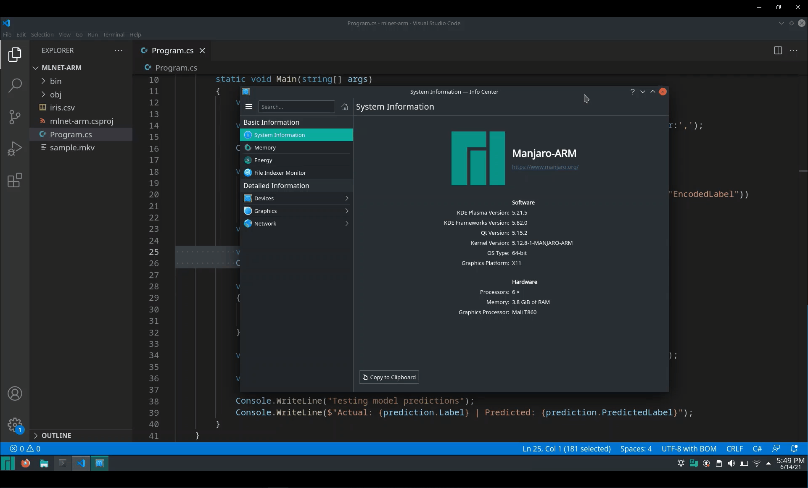
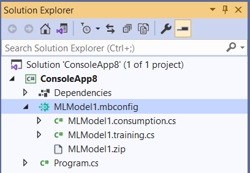
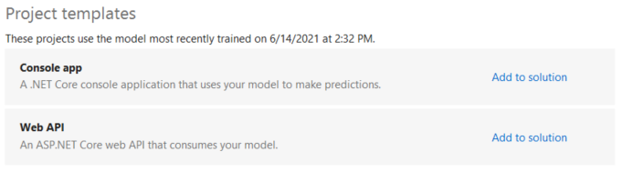
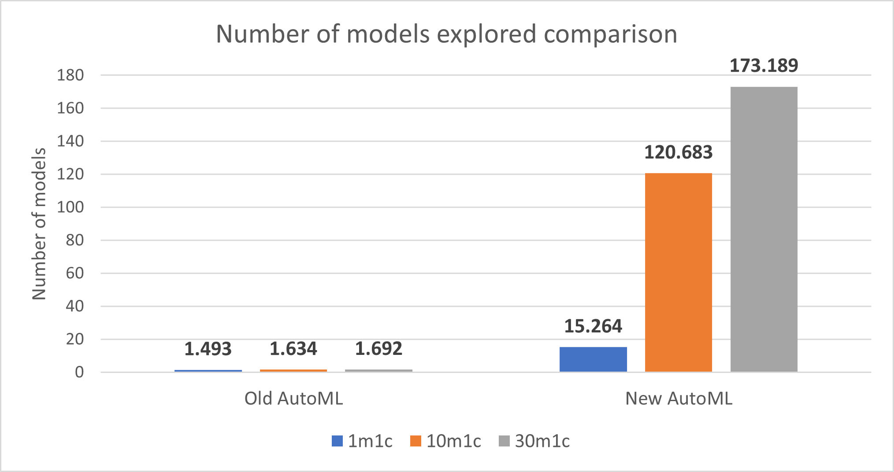
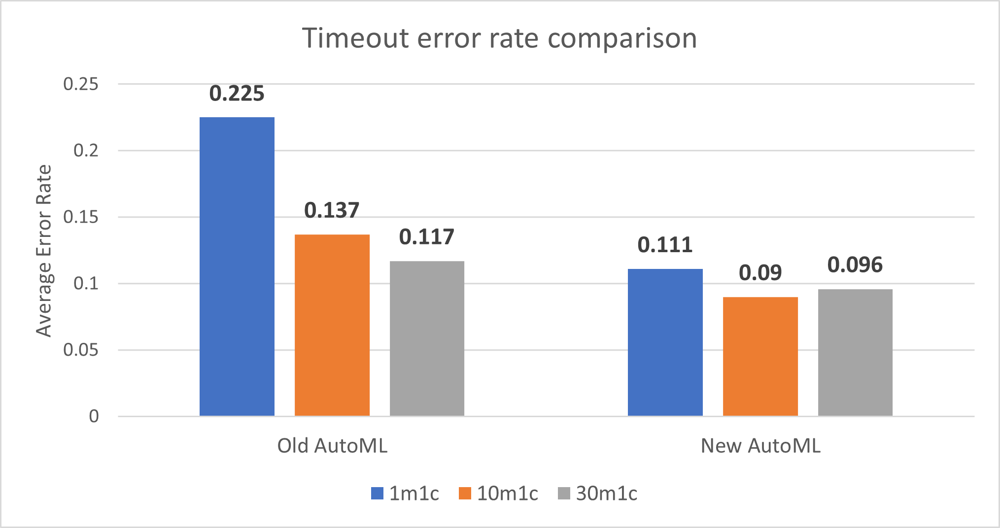
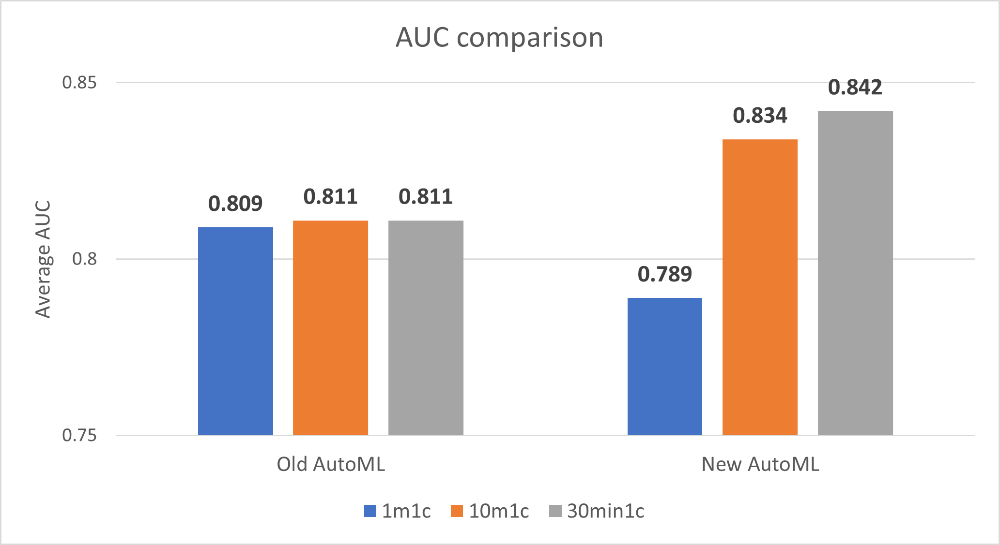
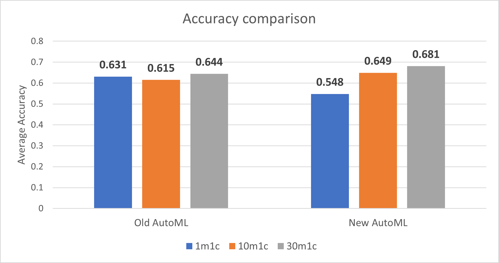
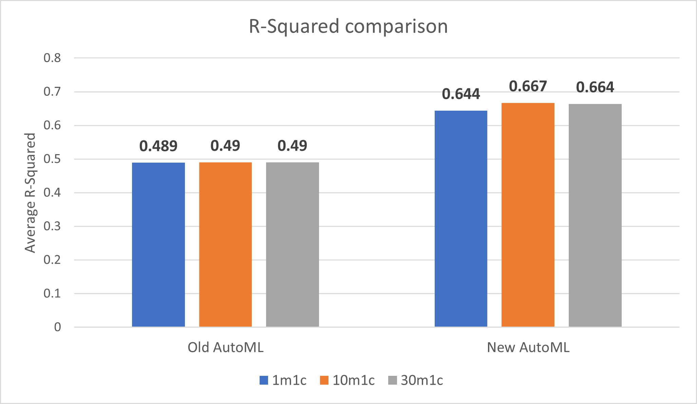

[ML.NET](https://dot.net/ml) is an open-source, cross-platform machine learning framework for .NET developers that enables integration of custom machine learning into .NET apps.

We are excited to announce new versions of ML.NET and Model Builder which bring a ton of awesome updates!

In this post, we’ll cover the following items:

1. [ML.NET Release](#ml.net-release)
2. [Model Builder Updates](#model-builder-updates)
3. [ML.NET Survey Results](#ml.net-survey-results)
4. [Get started and resources](#get-started-and-resources)

## ML.NET Release

This release of ML.NET brings a long-awaited capability to the framework: ARM support!

### ML.NET on ARM

You can now perform training and inferencing with ML.NET on ARM64 and Apple M1 (in addition to Linux and macOS) devices which enables platform support for mobile and embedded devices as well as ARM-based servers.

The following video shows training and inferencing on a Pinebook Pro laptop running Manjaro ARM Linux distribution:

There are still a few limitations when training and inferencing with ML.NET on ARM:

* Symbolic SGD, TensorFlow, OLS, TimeSeries SSA, TimeSeries SrCNN, and ONNX are not currently supported for training or inferencing.
* LightGBM is currently supported for inferencing, but not training.
* You can add LightGBM and ONNX support by compiling them for ARM, but they don’t provide pre-compiled binaries for ARM/ARM64.

These will all throw a `DLL not found` exception. If you are blocked by any of these limitations or would like to see different behavior when hitting these, please let us know by filing an issue in our [GitHub repo](https://github.com/dotnet/machinelearning/issues/new/choose).

### ML.NET on Blazor Web Assembly

With .NET 6, you can also now perform some training and inference on Blazor Web Assembly (WASM). It has the same limitations as ARM with the following additions:

* You must currently set the `EnableMLUnsupportedPlatformTargetCheck` flag to `false` to install in Blazor.
* LDA and Matrix Factorization are not supported.

Check out the [Machine Learning Baseball Prediction repo](https://github.com/bartczernicki/MachineLearning-BaseballPrediction-BlazorApp) (and the related Community Standup [video](https://youtu.be/HBEGPANJnr4)) which has examples of using ML.NET in Blazor Web Assembly.

See the [release notes](https://github.com/dotnet/machinelearning/blob/master/docs/release-notes/1.5.5/release-1.5.5.md) for more details on this release of ML.NET.

## Model Builder Updates

We recently announced several big changes to Model Builder as part of a preview release, including:

* Config-based training with generated code-behind files
* Restructured Advanced Data Options
* Redesigned Consume step

These features and enhancements, which you can learn more about from our previous [blog post](https://devblogs.microsoft.com/dotnet/ml-net-and-model-builder-march-updates/), are now available in the public feed. Update your version of Model Builder to access the newest features.

### Project templates

There is a new *Project templates* section in Model Builder’s Consume step which allows you to generate projects that consume your model. These projects are starting points for model deployment and consumption.

With this release, you can now add a **console app** or a **minimal Web API** (as described in this [blog post](https://devblogs.microsoft.com/dotnet/serve-ml-net-models-as-http-apis-with-minimal-configuration/)) to your solution.

We plan to add support for more project / app types, such as Azure Functions, as we get more feedback (which you can leave in the [Model Builder GitHub repo](https://github.com/dotnet/machinelearning-modelbuilder)).

### New and improved AutoML

We have also started collaborating with Microsoft Research teams [NNI](https://github.com/Microsoft/nni) (Neural Network Intelligence) and [FLAML](https://github.com/Microsoft/flaml) (Fast and Lightweight AutoML) to update ML.NET's AutoML implementation.

The partnership with these teams is important in the short- and long-term, and some of the benefits to ML.NET include:

* Enabling AutoML support for all ML.NET scenarios
* Allowing more precise control over the hyperparameter search space
* Enabling more training environments, including local, Azure, and on-prem distributed training
* Opening up future collaborations on advanced ML tech, like Network Architecture Search (NAS)

In the first implementation iteration, which is a part of this Model Builder release, our teams worked on decreasing the training failure rate, increasing the number of models explored in the given time and CPU resources, and improving overall training performance.

#### Benchmark testing

The team performed benchmark testing to ensure the changes to AutoML are improving the experience. Please note that this is an analysis of short runtimes; for most datasets that will be used to train production-level models, we recommend longer runtimes to allow AutoML to converge on the best model.

These benchmarks run on a standard D32s_v4  machine, and the training constraints are 1m1c, 10m1c and 30m1c (m for minutes and c for cores). There was no restriction on memory usage limit for each trial, and the maximum parallel experiments allowed was 30.

While 51 datasets were evaluated for each AutoML version, the evaluation metrics (AUC, Log loss, and R-Squared) are calculated based only on the datasets which shared success among the two versions.

Below is a summary of the benchmark testing so far:

##### Number of models explored

The new implementation of AutoML **greatly increases the number of models that are explored** for 1-minute train time, 10-minute train time, and 30-minute train time.

> Note: More models explored is better.

##### Average timeout error rate

The new implementation of AutoML **improves the timeout error rate** for 1-minute train time, 10-minute train time, and 30-minute train time.

> Note: *Error* is defined as when AutoML training times out in the given amount of train time without any model explored; *error rate*, or failure ratio, is defined as the percentage of datasets that finish AutoML training without any models found. **A smaller error rate is better**.

The team used several approaches for finding the first model faster during AutoML training, including:

* Starting with a smaller model
* Starting with more cost-efficient parameters
* Sub-sampling (for large datasets)

##### Binary classification model performance (Area Under the Curve, or AUC)

The new implementation of AutoML **decreases the AUC for 1-minute train time** but **improves the AUC for 10-minute train time and 30-minute train time**.

> Note: AUC closer to 1 is better.

##### Multiclass classification model performance (Accuracy)

The new implementation of AutoML **decreases the accuracy for 1-minute train time** but **improves the accuracy for 10-minute train time and 30-minute train time**.

> Note: Accuracy closer to 1 is better.

##### Regression model performance (R-Squared)

The new implementation of AutoML **improves R-Squared** for 1-minute train time, 10-minute train time, and 30-minute train time.

> Note: R-Squared closer to 1 is better.

### Bug fixes

Thank you to everyone who tried out the Preview and left feedback! Based on feedback and bugs filed from this Preview, we were able to make a ton of fixes and improvements, some of which include:

* Cancelling training does not discard current results ([Issue 697](https://github.com/dotnet/machinelearning-modelbuilder/issues/697))
* GPU extension failing ([Issue 1268](https://github.com/dotnet/machinelearning-modelbuilder/issues/1268))
* Detect CUDA and cuDNN versions for GPU training ([Issue 1152](https://github.com/dotnet/machinelearning-modelbuilder/issues/1152))
* Advanced data options dark theme fix ([Issue 1264](https://github.com/dotnet/machinelearning-modelbuilder/issues/1264))
* Unintended page navigation ([Issue 1276](https://github.com/dotnet/machinelearning-modelbuilder/issues/1276))

### What's next in Model Builder

We are working on a lot of awesome features and improvements for Model Builder, a few of which we’ve outlined below:

#### Easier collaboration and Git

This release of Model Builder only supports absolute paths for training datasets. This means that there is limited support for Git functionality, and sharing an mbconfig file between computers or accounts will require re-setting the local dataset location. We are tracking this fix in [Issue 1456](https://github.com/dotnet/machinelearning-modelbuilder/issues/1456), which will add better support for sharing and checking in/out mbconfig files.

#### Performance improvements

The team is working on several performance improvements in the UI, particularly around interactions with large datasets.

#### Further AutoML improvements

The team will continue making improvements to AutoML including improving the current tuning algorithm so that it can search faster on a larger search space, more advanced training (e.g. via advanced featurizers and more trainers), and adding more scenarios to AutoML, including time series forecasting and anomaly detection.

#### Continue training

When you start training in Model Builder, you have to wait out the entire training time in order to get a model. This means that during training if you get, for example, a model with 95% accuracy that you’d like to use but have 10 minutes left of training, you must wait for the rest of the 10 minutes in order to get and use that model. If you “Cancel Training” at any point, you lose all progress.

Additionally, if you spend 10 minutes training and don’t get any models, or only get a few models with poor accuracy, you must start training over again with a larger train time in hopes that the next round will give you better models.

The team is working on adding support for being able to “continue” training which means the ability to start training again after stopping (or in this case pausing) training. With this feature, the training progress is not reset after you pause training, and instead training will recover from the point that you stopped training. Model Builder can then use the training history to potentially select better algorithm hyperparameters and to pick a pipeline with better performance, resulting in a better model. This also enables the scenarios of being able to pause training early and get the best model without having to re-start training again.

#### Azure ML Datasets

Currently when you train in Model Builder with the Azure ML training environment, your data gets uploaded to an Azure Blob storage associated with an Azure ML workspace. This means that you can only choose local data for training.

The ML.NET team is working with the Azure ML team to add Azure ML Datasets support so that you can choose to train on a dataset already in Azure. Alternatively, you will be able to create new Azure ML Datasets from local data within Model Builder.

## ML.NET Survey Results

In a previous [post](https://devblogs.microsoft.com/dotnet/ml-net-survey-machine-learning-in-net/), we asked for your feedback on Machine Learning in .NET.

We received ~900 responses (THANK YOU!) and went over some of the results in the [Machine Learning .NET Community Standup](https://youtu.be/o-WQyQc-rJ0?t=728).

The key insights from this round of surveys include:

* Compared to surveys from the past 2 years,
  * More respondents have tried or are currently using ML.NET
  * More respondents from large companies are using ML.NET (vs. small companies)
  * More respondents are using ML in production already (vs. in the learning phases)
  * ML.NET users are getting more advanced and want advanced features (e.g. model explainability, data prep, deep learning)
* The biggest blockers / pain points / challenges all up among respondents are:
  * Small ML.NET community
  * Docs and samples (quantity, quality, real world)
  * Insufficient deep learning support
  * Specific ML scenario or algorithm not supported by ML.NET
  * Afraid Microsoft will abandon it

The overall top pain points from the survey, as well as how we plan to address each one, are listed in the table below:

| Pain point / blocker      | Action items / next steps |
| ----------- | ----------- |
| Small ML.NET community | Continue community efforts, (e.g., Virtual ML.NET Community Conference, Machine Learning .NET Community Standup, ML.NET Discord channel), share more stories of ML.NET use cases / case studies, be active on Stack Overflow, GitHub, etc. |
| Insufficient deep learning support | Torch support (consume PyTorch models in ML.NET), add Keras-like feature to build neural networks from scratch, dd scenarios as needed (e.g., NLP and object detection local and Azure training |
| Lack of / quality of docs and samples | Updated Docs plan with more dedicated resources, keep Docs and samples repo up to date, add more practical use cases and more complicated E2E samples and tutorials |
| Specific ML scenario or algorithm not supported by ML.NET |	Add NLP and local object detection training, continue working with users and analyzing market to understand which scenarios and algorithms need to be supported in ML.NET |
| Afraid Microsoft will abandon it | Get on the .NET release schedule, actively work on APIs + tooling / develop features /  keep up to date with ML trends, public strategy and roadmap, ML.NET announcements and demos in big .NET conference keynotes |

If you have feedback, ideas, or other things you'd like to see from the ML.NET team, please let us know!

## Get started and resources

Learn more about ML.NET and Model Builder in [Microsoft Docs](https://aka.ms/mlnet-docs).

If you run into any issues, feature requests, or feedback, please file an issue in the [ML.NET APIs repo](https://github.com/dotnet/machinelearning) or the [ML.NET Tooling (Model Builder & ML.NET CLI) [repo](https://github.com/dotnet/machinelearning-modelbuilder) on GitHub.

Missed The Virtual ML.NET Community Conference? All the sessions were recorded, so you can watch all of the amazing talks from [Day 1](https://www.youtube.com/watch?v=ch1aeidOt_M) and [Day 2](https://www.youtube.com/watch?v=ljL7dJBGBb4&t=19184s).

Tune in to the [Machine Learning .NET Community Standup](https://dotnet.microsoft.com/platform/community/standup) every other Wednesday at 10am Pacific Time.
