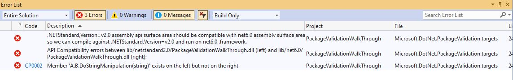
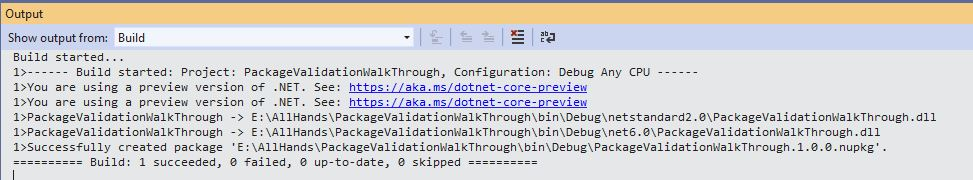
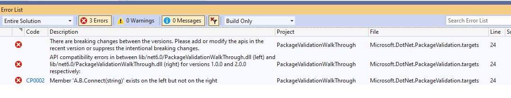
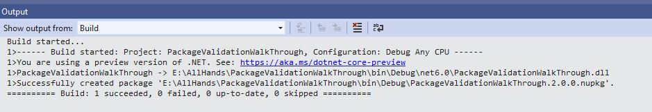
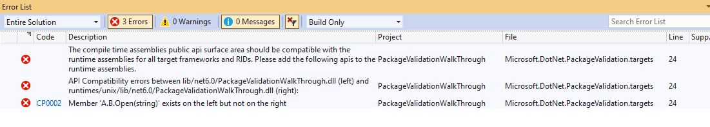
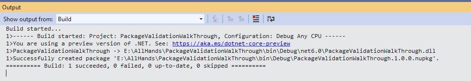

In this blog post, I'm going to show the new package validation tooling that will become available with .NET 6. It ensures that your package consumers have a great experience across all .NET platforms and versions and that you didn't accidentally make any breaking changes with the previous version of your package. If that is of interest to you, keep reading!

## Why validation is important

With .NET Core & Xamarin we have made cross-platform a mainstream requirement for library authors. However, we lack validation tooling for cross targeting packages, which can result in packages that don't work well, which in turn hurts our ecosystem. This is especially problematic for emerging platforms where adoption isn't high enough to warrant special attention by library authors.

The tooling we provide as part of the SDK has close to zero validation that multi-targeted packages are well-formed. For example, a package that multi-targets for .NET 6.0 and .NET Standard 2.0 needs to ensure that code compiled against the .NET Standard 2.0 binary can run against the .NET 6.0 binary. We have seen this issue in the wild, even with 1st parties, for example, the Azure AD libraries.

It's easy to think that a change is safe and compatible if source consuming that change continues to compile without changes. However, certain changes may work fine in C# but can cause problems at runtime if the consumer wasn't recompiled, for example, adding a defaulted parameter or changing the value of a constant.

Package Validation tooling will allow library developers to validate that their packages are consistent and well-formed. It involves validating that there are no breaking changes across versions. It will validate that the package have the same set of publics APIs for all the different runtime-specific implementations. It will also help developers to catch any applicability holes.

## How To Add Package Validation To Your Projects

Package Validation is currently being shipped as an MSBuild SDK package which can be consumed by a project. It is a set of tasks and targets that run after generating the package when calling `dotnet pack` (or after `dotnet build` in case you set `GeneratePackageOnBuild` to `true`).

To reference it, you need to use the new `<Sdk>` syntax:

```xml
<Project Sdk="Microsoft.NET.Sdk">

  <Sdk Name="Microsoft.DotNet.PackageValidation" Version="1.0.0-preview.5.21302.8" />

  <PropertyGroup>
    <TargetFrameworks>netstandard2.0;net6.0</TargetFrameworks>
  </PropertyGroup>

</Project>
```

In the next sections, I'll walk you through a set of scenarios that show how you can validate your own packages.
### Validating Compatible Frameworks

Packages containing compatible frameworks need to ensure that code compiled against one can run against another. Examples of compatible framework pairs are:

* .NET Standard 2.0 and .NET 6.0
* .NET 5.0 and .NET 6.0

In both of these cases, your consumers can build against .NET Standard 2.0 or NET 5.0 and run on .NET 6.0. In case your binaries are not compatible between these frameworks, consumers could end up with compile and/or runtime errors.

Package Validation will catch these errors at pack time. Here is an example scenario:

Suppose you're writing a game which does a lot of string manipulation. You need to support both .NET Framework and .NET Core consumers. You started with just targeting .NET Standard 2.0 but now you realize you want to take advantage of spans in .NET 6.0 to avoid unnecessary string allocations. In order to do that, you now want to multi-target for .NET Standard 2.0 and .NET 6.0.

You have written the following code:
```c#
#if NET6_0_OR_GREATER
    public void DoStringManipulation(ReadOnlySpan<char> input)
    {
        // use spans to do string operations.
    }
#else
    public void DoStringManipulation(string input)
    {
        // Do some string operations.
    }
#endif
```

You then try to pack the project (using dotnet pack cmd or using VS) it fails with the following error:



You understand that you shouldn't exclude ```DoStringManipulation(string)``` but instead just provide an additional ```DoStringManipulation(ReadOnlySpan<char>)``` method for .NET 6.0 and changes the code accordingly:

```c#
#if NET6_0_OR_GREATER
    public void DoStringManipulation(ReadOnlySpan<char> input)
    {
        // use spans to do string operations.
    }
#endif
    public void DoStringManipulation(string input)
    {
        // Do some string operations.
    }
```

You try to pack the project again.



### Validation Against Baseline Package Version

Package Validation can also help you validate your library project against a previous released stable version of your package. In order to use this feature, you will need to add the ```PackageValidationBaselineVersion``` or ```PackageValidationBaselinePath``` to your project.

Package validation will detect any breaking changes on any of the shipped target frameworks and will also detect if any target framework support has been dropped.

For example consider the following scenario: you are working on the AdventureWorks.Client NuGet package. You want to make sure that you don't accidentally make breaking changes so you configure your project to instruct package validation tooling to run API compatibility against the previous version of the package.

```xml
<Project Sdk="Microsoft.NET.Sdk">

  <Sdk Name="Microsoft.DotNet.PackageValidation" Version="1.0.0-preview.5.21302.8" />

  <PropertyGroup>
    <TargetFramework>net6.0</TargetFramework>
    <PackageVersion>2.0.0</PackageVersion>
    <PackageValidationBaselineVersion>1.0.0</PackageValidationBaselineVersion>
  </PropertyGroup>

</Project>
```

A few weeks later, you are tasked with adding support for a connection timeout to your library. The Connect method currently looks like this:

```C#
public static HttpClient Connect(string url)
{
    // ...
}
```

Since a connection timeout is an advanced configuration setting, you reckon that you can just add an optional parameter:

```c#
public static HttpClient Connect(string url, TimeSpan timeout = default)
{
    // ...
}
```

However, when you try to pack, it throws an error.



You realize that while this is not a [source breaking change](https://docs.microsoft.com/dotnet/standard/library-guidance/breaking-changes#source-breaking-change), it's a binary [breaking change](https://docs.microsoft.com/dotnet/standard/library-guidance/breaking-changes#binary-breaking-change). You solve this problem by adding an overload instead:

```c#
public static HttpClient Connect(string url)
{
    return Connect(url, Timeout.InfiniteTimeSpan);
}

public static HttpClient Connect(string url, TimeSpan timeout)
{
    // ...
}
```

You try to pack the project again.



## Validation Against Different Runtimes

You may choose to have different implementation assemblies for different runtimes in your nuget package. In that case, you will need to make sure that these assemblies are compatible with the compile-time assemblies.

For example, consider the following scenario: you are working on a library involving some interop calls to unix and windows API respectively. You have written the following code:

```c#
#if Unix
    public static void Open(string path, bool securityDescriptor)
    {
        // call unix specific stuff
    }
#else
    public static void Open(string path)
    {
        // call windows specific stuff
    }
#endif
```

The resulting package structure looks like

```xml
lib/net6.0/A.dll 
runtimes/unix/lib/net6.0/A.dll
```

`lib\net6.0\A.dll` will always be used at compile time regardless of the underlying operating system. `lib\net6.0\A.dll` will also be used at runtime for non-Unix systems, but `runtimes\unix\lib\net6.0\A.dll` will be used at runtime for Unix systems.

When you try to pack this project, you get an error:



you quickly realize your mistake and adds `A.B.Open(string)` to the unix runtime as well.

```c#
#if Unix
    public static void Open(string path, bool securityDescriptor)
    {
        // call unix specific stuff
    }
    
    public static void Open(string path)
    {
        // throw not supported exception
    }
#else
    public static void Open(string path)
    {
        // call windows specific stuff
    }
#endif
```

You try to pack the project again.



## Roadmap

We will continue to add more and more capabilities with monthly updates until we'll release a stable version later this year. Some of the features which are already in pipeline are error suppressions and nullability annotations compatibility rules.

## Share Your Feedback

We are excited for this release, and look forward to your feedback. Let us know what you think of the product. 

[Let us know what you think!](https://github.com/dotnet/sdk/issues/new/).
