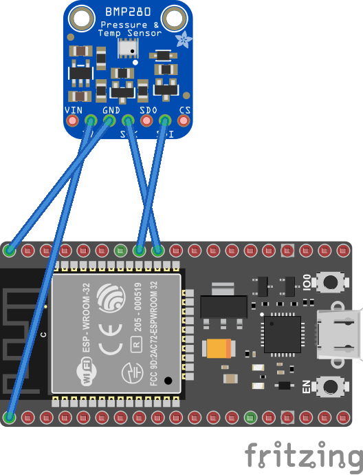
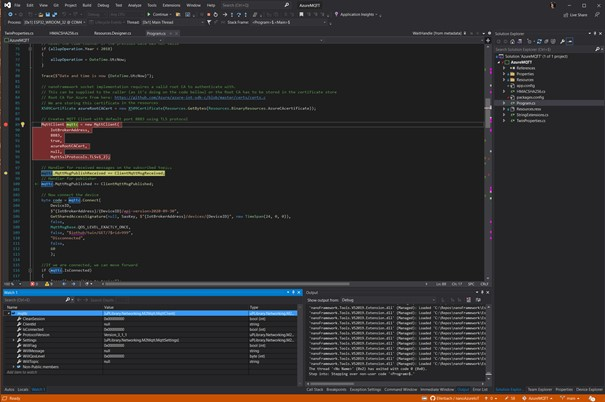
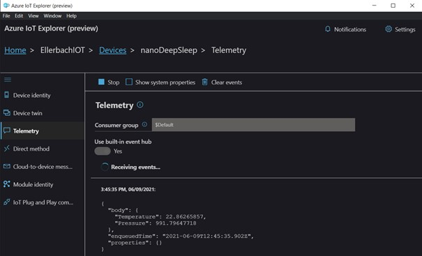
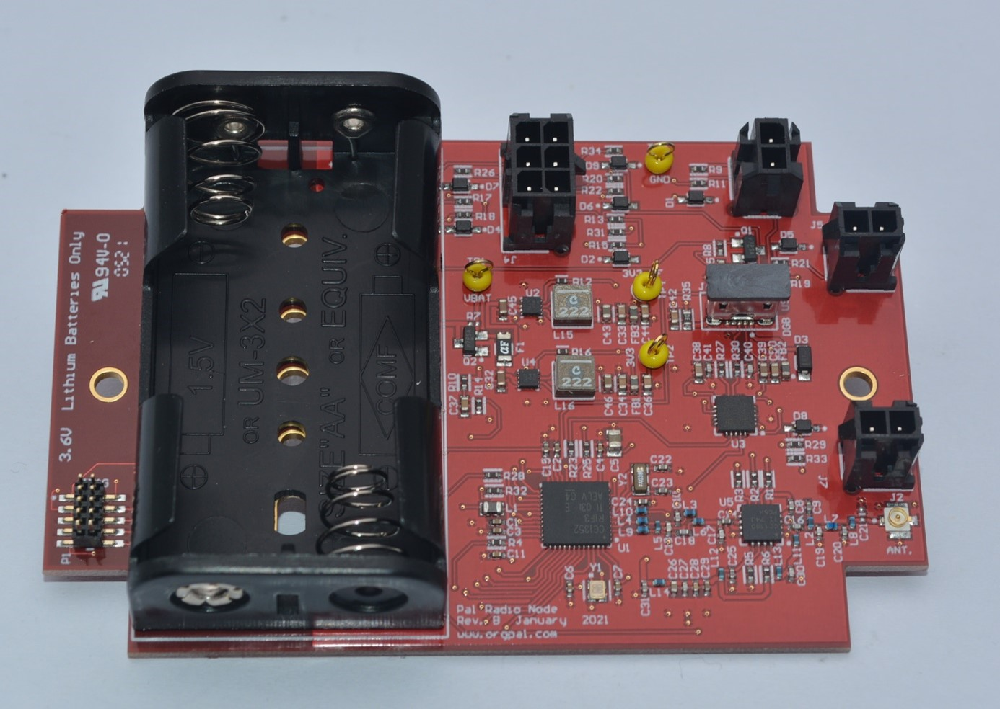
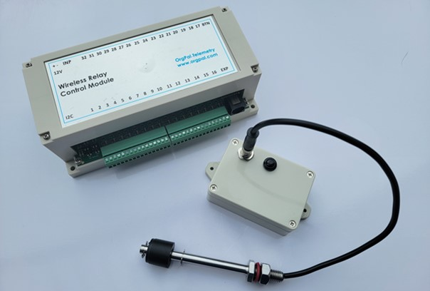
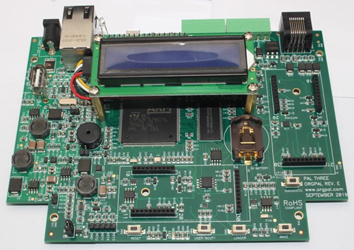
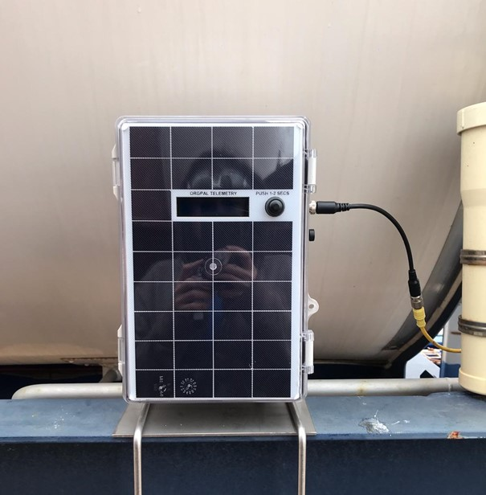

Today, I'd like to [show dotnet](https://devblogs.microsoft.com/dotnet/category/show-dotnet/) how to run your own .NET application on a Micro Controller Unit (MCU) on a simple battery for multiple years. I'll build an application that will read the temperature and pressure on a BMP280 sensor connected to an ESP32. The core idea is to be run on a small solar panel charging a LiPo battery. I will as well present two real case scenarios, both running .NET nanoFramework, one on STM32F7 processor and the other one on a TI CC1352R.

I'm Laurent Ellerbach. I'm a Principal Software Engineer Manager at Microsoft working for the Commercial Software Engineering team. My team and I are doing co-engineering with our largest customers helping them in their digital transformation and focussing on Azure. I'm more focussing on Manufacturing industry and I've been involved in IoT for a very long time. I've been a contributor to [.NET IoT](https://github.com/dotnet/iot) and quickly became one of the main contributors which drove me to work very closely with the .NET team. As a fan of C# since day 1, I'm always looking at fun and innovative way to use it as much as I can. I was excited to discover [.NET nanoFramework](https://github.com/nanoframework/Home) and I'm working on bridging both .NET IoT and .NET nanoFramework to make it easier for a C# developer to use one or the other and reuse as much code as possible.

## MCU, CPU, what's the difference?

A Micro Controller Unit (MCU) is a small processor, usually a synonym for low power consumption, and small size. Modern ones like STM32F7, ESP32, TI CC1352R are ARM Cortex M based, embedding few hundreds of kilobytes of RAM, small flash and a decent few hundred million of hertz clock cadence. On small processors like those ones, you run a very simple OS called Real Time OS (RTOS) like [Azure RTOS](https://azure.microsoft.com/services/rtos/). Those RTOS provide threading, inter-threading messaging and synchronization, minimum network capability and you have to build your applications on top, traditionally using C/C++. A special implementation of .NET exists for those MCU, it's called [.NET nanoFramework](https://github.com/nanoframework/Home).

A Central Processing Unit (CPU) is a larger processor, in this category, you'll find all the traditional x86, x64, but as well other ARM processors like the one used in Raspberry Pi. These are the families that run "real" OSes like Windows, Linux, or macOS. On those type of processors, you can run .NET 5.0, for example.

One of the main differences between them is the computation power which translates to power consumption. And, of course, in the chip cost; a CPU is much more expensive than an MCU. Typical MCU costs ranges from few cents to few dollars. CPU cost is a scale factor of at least 10 or 100.

Also, even if you feel your CPU based machine is fast and your preferred OS fast as well, you may not be thinking of scenarios like booting or coming back from sleep, measuring something, sending those measurements over a network and going back to sleep mode. That's not easy with a CPU-based machine. On an MCU, entering into a sleep state is easy and because the RTOS is very light, your application can be up and running very, very quickly. On an MCU, you can enable a sleep mode that will place the processor in a state that uses has very low energy consumption. Imagine an animal like a hedgehog over the winter, it's about the same. Everything will be put in a low consumption mode, where every single non vital element will be totally shut down. The consumption will drop to few milli- or micro-Amperes (µA).

On a CPU, this is not fully possible. You can, in modern architecture adjust the CPU frequency, and there are sleep modes as well, those are only light sleep. So, a CPU will always be awake or in a power saving mode where it will still consume quite some energy. That's the reason why, on all hardware or all vendors, based on CPU, after some time in a light sleep, the system goes into hibernation which is basically dropping the states and the memory on the hard drive and halting the CPU. You've experienced the time to wake up from both modes, even when you feel it's fast, it's still taking a significant amount of time, at least multiple seconds.

On the MCU world, there is the possibility to just sleep or go to a deep sleep mode reducing even further the power consumption. You can wonder: what can wake up the MCU? It depends on the MCU. One of the most common situations is based on a timer. Technically speaking, everything will be shut down, except a small watch crystal and a timer. Those elements consume only few micro-Amperes, meaning that the unit can run those on a battery for years or decades. When the time to wake-up is reached, the MCU awakes, performs the boot sequence and it starts executing its program.

There are other ways to awake it, just like in real life! The cold bucket of water or someone shaking you up is as well possible. This one is called an interruption. In the MCU world, it will mean a change of state on a General Purpose Input/Output (GPIO) pin. In short, something happened. You pressed a button, or you touched a screen changing the state of the GPIO. This mode consumes a bit more energy than the previous one, still, the processor is deeply sleeping, and, again, only few micro-Amperes are consumed.

.NET nanoFramework addresses the world of MCU and supports this sleep mechanism for all the supported architectures like ESP32, STM32, NXP and TI. This enables scenarios to have .NET code running for years on a single battery, as I will explain later,

What interests us most of the time in this IoT world is to measure an element from time to time, send this data over the air or a cable and wait for the next period to measure it again. This is the most common scenario in the IoT world. You want to consume as little as possible; you want to change the batteries as infrequently as possible, and you still want the device to say it is alive time to time.

## Experiment it yourself: using a solar panel and a LiPo battery

To experiment this behavior yourself, you will need to use one of the supported MCU for .NET nanoFramework. Here, I'll just use a cheap and popular ESP32. I have this code deployed in a garden. It is connecting to my Wi-Fi, connecting to Azure IoT Hub, getting settings, publishing its state, measuring temperature and pressure, posting those data to Azure IoT Hub and going back to sleep. To complete this sequence of operations requires only a few seconds. The code is available on the nanoFramework [sample GitHub repository](https://github.com/nanoframework/Samples/tree/main/samples/AzureMQTTTwinsBMP280Sleep). The schema is the following and depending on which ESP32, the position of the physical pins may change:



.NET nanoFramework has a [Visual Studio Extension](https://nanoframework.net/new-preview-feeds-for-nanoframework) that you have to install. You also have to [flash your device](https://docs.nanoframework.net/content/getting-started-guides/getting-started-managed.html#uploading-the-firmware-to-the-board-using-nanofirmwareflasher). Then you can debug your C# code like you do with any .NET application! You can as well connect to a Wi-Fi or a wired network. Helpers make your life easy and everything you need is in a [nanoFramework NuGet package](https://www.nuget.org/packages/nanoFramework.NetWorkHelper). The first part of the code connects to the Wi-Fi, requests or renews an IP address:

```csharp
// As we are using TLS, we need a valid date &amp; time
// We will wait maximum 1 minute to get connected and have a valid date
CancellationTokenSource cs = new(sleepTimeMinutes);
var success = NetworkHelper.ConnectWifiDhcp(Ssid, Password, setDateTime: true, token: cs.Token);
if (!success)
{
    Trace($"Can't connect to wifi: {NetworkHelper.ConnectionError.Error}");
    if (NetworkHelper.ConnectionError.Exception != null)
    {
        Trace($"NetworkHelper.ConnectionError.Exception");
    }

    GoToSleep();
}
```

With the previous code, we're storing the SSID and Password in the code, which you could argue isn't secure. It is also possible to store it directly on the device and just call a helper that will connect without specifying it at all in the code.

The second part of the code is the connection to Azure IoT. I will not go deep in the details. We are using MQTT to connect to Azure IoT, with a symmetric key.

```csharp
const string DeviceID = "nanoDeepSleep";
const string IotBrokerAddress = "yourIoTHub.azure-devices.net";
const string SasKey = "alongsastoken";
// nanoFramework socket implementation requires a valid root CA to authenticate with.
// This can be supplied to the caller (as it's doing on the code bellow) or the Root CA has to be stored in the certificate store
// Root CA for Azure from here: https://github.com/Azure/azure-iot-sdk-c/blob/master/certs/certs.c
// We are storing this certificate as an application resource
X509Certificate azureRootCACert = new X509Certificate(Resources.GetBytes(Resources.BinaryResources.AzureCAcertificate));

// Creates MQTT Client with default port 8883 using TLS protocol
MqttClient mqttc = new MqttClient(
    IotBrokerAddress,
    8883,
    true,
    azureRootCACert,
    null,
    MqttSslProtocols.TLSv1_2);

// Handler for received messages on the subscribed topics
mqttc.MqttMsgPublishReceived += ClientMqttMsgReceived;
// Handler for publisher
mqttc.MqttMsgPublished += ClientMqttMsgPublished;

// Now connect the device
byte code = mqttc.Connect(
    DeviceID,
    $"{IotBrokerAddress}/{DeviceID}/api-version=2020-09-30",
    GetSharedAccessSignature(null, SasKey, $"{IotBrokerAddress}/devices/{DeviceID}", new TimeSpan(24, 0, 0)),
    false,
    MqttMsgBase.QOS_LEVEL_EXACTLY_ONCE,
    false, "$iothub/twin/GET/?$rid=999",
    "Disconnected",
    false,
    60
    );

//If we are connected, we can move forward
if (mqttc.IsConnected)
{
    mqttc.Subscribe(
        new[] {
            $"devices/{DeviceID}/messages/devicebound/#",
            "$iothub/twin/res/#"
        },
        new[] {
                MqttMsgBase.QOS_LEVEL_AT_LEAST_ONCE,
                MqttMsgBase.QOS_LEVEL_AT_LEAST_ONCE
        }
    );
    //Rest of the code here
}
```

The first thing you'll notice is that .NET nanoFramework provides all what is necessary to connect to any MQTT broker, including Azure IoT Hub. Like for the rest of the elements, the [MQTT library is installed with a NuGet package](https://www.nuget.org/packages/nanoFramework.M2Mqtt). This MQTT library is a port of M2Mqtt on .NET nanoFramework.

The Azure root certificate is needed to validate the identity of the endpoint we are connecting to. It is stored in the code resources. .NET nanoFramework offers a concept of application resources as well.

We are registering for events. Here, we will be interested in the messages that we can receive, and the confirmation that those messages have been received by Azure IoT. There are more events you can subscribe to. This is done in two steps, first one with the MQTT class and second with the protocol.

To connect the device itself, a shared access signature is required. This calculation is made with class helper which allows to create using a HMACSHA256 calculation. Most of the parameters are specific to the MQTT protocol and documented on [Azure IoT Hub documentation](https://docs.microsoft.com/azure/iot-hub/iot-hub-mqtt-support).

Moving forward we are requesting the [device twin](https://docs.microsoft.com/azure/iot-hub/iot-hub-devguide-device-twins) for this device. A twin is a concept that is creating desired properties and reported properties. See this as a desired and reported configuration for the device. It is up to you to define what you want to setup.

We will request them and wait to receive them. As always, we're using a pattern with a timeout to make sure that even if we don't receive it, it won't prevent the code for too long and that we will proceed to the next steps.

```csharp
mqttc.Publish($"{TwinDesiredPropertiesTopic}?$rid={Guid.NewGuid()}", Encoding.UTF8.GetBytes(""), MqttMsgBase.QOS_LEVEL_AT_LEAST_ONCE, false);

CancellationTokenSource cstwins = new(10000);
CancellationToken tokentwins = cstwins.Token;
while (!twinReceived && !tokentwins.IsCancellationRequested)
{
    tokentwins.WaitHandle.WaitOne(200, true);
}
```

As we subscribe to the message event, once the Twin will be sent the event will be triggered and we will be able to process it:

```csharp
void ClientMqttMsgReceived(object sender, MqttMsgPublishEventArgs e)
{
        string message = Encoding.UTF8.GetString(e.Message, 0, e.Message.Length);

        if (e.Topic.StartsWith("$iothub/twin/"))
        {           
            if (message.Length > 0)
            {
                // skip if already received in this session
                if (!twinReceived)
                {
                    try
                    {
                        TwinProperties twin = (TwinProperties)JsonConvert.DeserializeObject(message, typeof(TwinProperties));
                        minutesToGoToSleep = twin.desired.TimeToSleep != 0 ? twin.desired.TimeToSleep : minutesToGoToSleep;
                        twinReceived = true;
                    }
                    catch
                    {
                        // We will ignore
                    }
                }
            }           
        }
    }
}
```

The twin is encoded as a Json text message:

```json
{"desired":{"TimeToSleep":5,"$version":2},"reported":{"Firmware":"nanoFramework","TimeToSleep":2,"$version":94}}
```

A Json serializer and deserializer is available as a [NuGet for .NET nanoFramework](https://www.nuget.org/packages/nanoFramework.Json). I'm using a class to deserialize the object. The `TimeToSleep` property describes how many minutes I ask the device to sleep. 5 in this case will represent 5 minutes. This allows me to adjust the behavior of my code without having to redeploy my code. This mechanism is a very important one offered by Azure IoT Hub.

Once the twin details are received and processed or, if not, a timeout will expire, I republish the twin:

```csharp
mqttc.Publish($"{TwinReportedPropertiesTopic}?$rid={Guid.NewGuid()}", Encoding.UTF8.GetBytes($"{{\"Firmware\":\"nanoFramework\",\"TimeToSleep\":{minutesToGoToSleep}}}"), MqttMsgBase.QOS_LEVEL_AT_LEAST_ONCE, false);
```

And I don't wait for any confirmation in this case, I go straight go to the next step. My next step is to measure the temperature and atmospheric pressure using a BMP280 sensor. This sensor is an I2C sensor, very popular cheap, and easy to find.

This sensor has been [implemented in .NET IoT](https://github.com/dotnet/iot/tree/main/src/devices/Bmxx80) and [ported to .NET nanoFramework](https://github.com/nanoframework/nanoFramework.IoT.Device/tree/develop/devices/Bmxx80). .NET nanoFramework offers a large library of sensors, based on the [same code base](https://github.com/dotnet/iot/blob/main/src/devices/README.md). Because .NET nanoFramework has constraints, every binding has been split in each own NuGet. The code for those bindings can be found at the [nanoFramework.IoT.Device repository](https://github.com/nanoframework/nanoFramework.IoT.Device). The code had to be transformed to support the specific project type of .NET nanoFramework and other specificities like transforming generic list or span into non generic ones. Because of the size constraints for example, Enums have a simplified implementation. `IsDefined` or `GetValues` are not available because the description of the Enum items is removed to save flash storage in the MCU.

The code to read the sensor is the following:

```csharp
// I2C bus 1 is using GPIO 18 and GPIO 19 on the ESP32
const int busId = 1;
I2cConnectionSettings i2cSettings = new(busId, Bmp280.DefaultI2cAddress);
I2cDevice i2cDevice = I2cDevice.Create(i2cSettings);
var i2CBmp280 = new Bmp280(i2cDevice);
// set higher sampling
i2CBmp280.TemperatureSampling = Sampling.LowPower;
i2CBmp280.PressureSampling = Sampling.UltraHighResolution;

var readResult = i2CBmp280.Read(); 
```

And it would be the [**exact** same code on a Raspberry Pi](https://github.com/dotnet/iot/blob/main/src/devices/Bmp180/samples/Program.cs) running .NET 5.0 using the [.NET IoT device binding NuGet package](https://www.nuget.org/packages/Iot.Device.Bindings/).

Also, a lot of work and efforts has been made to allow a simple, consistent and straight forward for all the supported bindings. This allows to develop solutions in .NET that are easy to reuse from the code and support perspective on a CPU and on a MCU.

Once the measure is done, we can publish the result on Azure IoT:

```csharp
//Publish telemetry data using AT LEAST ONCE QOS Level
messageID = mqttc.Publish(telemetryTopic, Encoding.UTF8.GetBytes($"{{\"Temperature\":{readResult.Temperature.DegreesCelsius},\"Pressure\":{readResult.Pressure.Hectopascals}}}"), MqttMsgBase.QOS_LEVEL_EXACTLY_ONCE, false);

// Wait for the message or cancel if waiting for too long
CancellationToken token = new CancellationTokenSource(5000).Token;
while (!messageReceived && !token.IsCancellationRequested)
{
    token.WaitHandle.WaitOne(200, true);
}

GoToSleep();
```

We'll wait a bit to receive a confirmation of the published results. That's happening through one of the events we've subscribe to.

```csharp
void ClientMqttMsgPublished(object sender, MqttMsgPublishedEventArgs e)
{
    if (e.MessageId == messageID)
    {
        messageReceived = true;
    }
}
```

As always, if we don't receive the confirmation in a specific time window, we will continue and go to sleep no matter what. Not receiving the confirmation doesn't necessarily means that it has not been published and that it has not arrived. On a slow network, getting the confirmation may take a little bit of time. Also, some events may be skipped. And without going details, that's the reason why MQTT protocol has a delivery mechanism adapted to those situations.

The `_GoToSleep_` method starts by setting up the wake-up mechanism. MCUs have a lot of them. Here, we will use the timer:

```csharp
void GoToSleep()
{
    Sleep.EnableWakeupByTimer(new TimeSpan(0, 0, minutesToGoToSleep, 0));
    Sleep.StartDeepSleep();
}
```

Note that the time that the MCU will remain in sleep mode (in minutes) is determined by the twin property received from Azure IoT Hub.

The `Sleep` class is specific to .NET nanoFramework and was specially designed to manage the sleep modes on every device. Despite having a common API, the low level implementation is specific to each supported MCU. Some offer more features than others. API are aligned and if a mode, like the timer one, is available on all MCUs, the API will be the exact same.

In about 100 lines of .NET code and few hours of effort, you can then connect to a Wi-Fi network, connect to Azure IoT Hub, get the twin properties, report them, measure a sensor, report the measurement to Azure IoT Hub and then enter deep sleep mode, lowering the power consumption of an MCU! The .NET nanoFramework NuGet and existing code helpers make that easy.

## Duration of code execution

Now let's look at more data while running the code.

The example code uses `Microsoft.Extensions.Logging` for logging. .NET nanoFrameworks follows the logging patterns used in .NET 5.0 framework and is compatible with the implementation in .NET IoT. We will use it here to be able to trace what's happening when the code is running.

.NET nanoFramework code can be debugged using Visual Studio debugger. So, when you are in the development phase, you can, of course, start a debug session and do what you are used to do when debugging any .NET C# application. Now, when the device goes to sleep, it loses the debug context and when it will wake up, you won't be able to get back to it.



So, for this phase and to measure how everything is running, an external logging mechanism can be used. We will use a serial port, plugged on the machine. A tool like Putty or any other serial reader will work perfectly to capture the data.

The code to put this in place is the following:

```csharp
// Use Trace to show messages in serial COM2 as debug won't work when the device will wake up from deep sleep
// Set the GPIO 16 and 17 for the serial port COM2
Configuration.SetPinFunction(16, DeviceFunction.COM2_RX);
Configuration.SetPinFunction(17, DeviceFunction.COM2_TX);
SerialPort serial = new("COM2");
serial.BaudRate = 115200;
logger = new SerialLogger(ref serial, "My logger");
logger.MinLogLevel = LogLevel.Debug;
Trace("Program Started, connecting to WiFi.");

void Trace(string message)
{
    logger?.LogDebug(message);
}
```

I've placed abundant trace calls everywhere in the code, so the result is rather verbose. And here is an example of the trace I see:

```text
Program Started, connecting to WiFi.
Date and time is now 06/09/2021 12:45:33
subscribing to topics
Getting twin properties
Response from publish with message id: 2
Message received on topic: $iothub/twin/res/200/?$rid=be27fc48-85bb-455e-3585-6ff363d09002
and message length: 115
and was in the success queue.
New sleep time to sleep received: 30
Sending twin properties
Message received on topic: $iothub/twin/res/200/?$rid=be27fc48-85bb-455e-3585-6ff363d09002
and message length: 115
and was in the success queue.
Temperature: 22.86265857°C
Pressure: 991.79647718hPa
Message received on topic: $iothub/twin/res/200/?$rid=be27fc48-85bb-455e-3585-6ff363d09002
and message length: 115
and was in the success queue.
Message ID for telemetry: 4
Response from publish with message id: 3
Message received on topic: $iothub/twin/res/204/?$rid=54f8f9a7-d190-48db-ba88-9ed4a47bc50b&amp;$version=263
and message length: 0
and received confirmation for desired properties.
Response from publish with message id: 4
Full operation took: 00:00:07.3871120
Set wakeup by timer for 30 minutes to retry.
Deep sleep now
```

First, the full operation took only a bit longer than 7 seconds as the boot time about 1 second is not included in the managed code. Second, those 7 seconds include getting the Azure twins, adjusting them, reporting them, measuring the sensor, reporting the measurement and receiving the confirmation!

Third, you may have hard time to follow the logic of those traces. And that's expected. .NET nanoFramework works with multiple threads. When events are raised like receiving the twins or getting confirmation of a message being posted, all the other threads continue to execute.

Something to reflect on is that the execution from my own measurement takes between 3 and 10 seconds, with an average around 6 seconds.

The total execution time can be improved by completely removing the Trace code that outputs to the serial port.

On the Azure side, using for example [Azure IoT Explorer](https://docs.microsoft.com/azure/iot-pnp/howto-use-iot-explorer), you can check that the device sent the telemetry properly and that you received everything:



## Measured consumption

What really interests us here is the possibility of putting the MCU in a deep sleep mode and measuring its consumption to compare against the normal execution mode.

For this we will have to use an [ammeter](https://en.wikipedia.org/wiki/Ammeter) on the power supply wire. We will measure when the MCU is running and when it is sleeping.

While running at the boot, I can see a peak of approximately 250 mA which very quickly goes down to around 140 mA.

Once in deep sleep, less than 2 mA are consumed because I still have a little led connected which should be removed. The specifications states between 10 and 150 µA in this mode. So more than a factor of 1000!

If you take a 2000 mAh battery and doing simple math with a deep sleep consumption of 50 µA, you'll be able to stay on this battery for 40,000 hours representing more than 4 years and a half. Read the section on the real case scenarios to understand that this is a real and valid scenario.

Now assuming that I will run all the time my code connecting to WiFi, to Azure IoT, measuring, posting the data, my consumption will always be in average about 140 mA, you can expect then working on battery for more than 14 hours without discontinuity. That would represent more than 5,000 cycles.

Considering that the battery health is good, and presuming that the temperature is constant along with few other related elements, I would be able to run my measurement 2 times per day and I would still be able to stay on the same battery for 2 years and a half without any issue.

For my own scenario, in my garden, I'll use a simple solar panel, a LiPo charger and a LiPo battery. They will be connected to an ESP32. This ESP32 will have a BMP280 temperature, and barometric sensor connected. My ESP32 is located in the garden still in range of the Wi-Fi but far from any mains power outlet. I can generously go for multiple measurements per hour, even if the weather is not particularly sunny for several days, the battery will be large enough.

## Case study: Tank Level Monitoring and Overfill Protection

This case study is about tank level monitoring with overfill protection. Imagine a 25k liters tank and you're interested in measuring the level inside the tank, raising alerts when the level is too high during fill ups. This is one of the products [OrgPal.IoT](https://www.orgpal.com/) built based out of .NET nanoFramework. They have other products for field telemetry using .NET nanoFramework as well.

The board they have designed is based on a TI CC1352R MCU, which includes the radio in the same die:




This board has a low power of 50 µA in sleep mode and can last 5-8 years on two 3.6V batteries.

When the tank gets filled, it will detect any potential overflow and act as a fill protection. It is in a small box, running on two 3.6V 2400mA batteries. The box is easily accessible on the tank. A float that controls fill up is moved and triggered in case a specific level is reached and then the unit wakes up, transmits over a radio signal to a main box up to 1km far away, running as well a .NET nanoFramework application, that will close a valve via a relay control board for up to 32 lines, preventing overfill of product and thus saving product and taking care of environmental hazards.

The second scenario is field telemetry. The board used is based out of a STM32F7 processor. It comes with embedded screen, Ethernet, RS 485 (Modbus), Flash Storage, SD card, USB, a GPS, a satellite communication module and more via the expansion slots modules.



It is in a self-powered box, that has a built-in solar panel which powers the system allowing off grid usage for years at a time with low power usage. Those units are mounted on mobile tanks for example. The scenario for operation looks like this:

The unit wakes up, takes reading using sensor for product level with ultrasonic, radar, electro magnetic, gets volume of the tanks. Then it turns on a GPS receiver and gets a precise GPS position.

Last step is to report all this data to Azure IoT via a satellite connection.

Once data is reported, the unit goes back to sleep. The cycle repeats every 4, 6 or 8 hours or as needed.

A worker can walk to the unit and get a reading thru the screen by pushing the button on the box. This will wake up the box to process the requested measurements. It will then go back to sleep. The power used in the sleep mode is as low as 200 µA.

Here is the box, with the solar panel that is 25x13cm. It is large enough to run the system at its full power when needed and of course on the low power mode as well.



"Microsoft .NET is one of the best platforms for building great applications, and .NET nanoFramework offered the same benefits to us for the microcontroller and all of our hardware. The .NET nanoFramework and the team behind it created the same rich development experience as the big brother .NET Framework. Having it also as an open source, with a great community makes us feel comfortable that our investment has a future and we do not have to depend on a proprietary technology, licensing and so on.

Simply put, .NET nanoFramework streamlined our development process with powerful, easy-to-use tools like Visual Studio that enabled us to create solutions in days to weeks vs. months to years with very little limitations. It has built-in security measures that ensures the deployed application is safe and protected. If your business requires a reliable application with great performance, easy to develop, open source then .NET nanoFramework is your best choice for your application."

[Zan Gligorov](mailto:zan@orgpal.com), Principal at [OrgPal](http://www.orgpal.com/)

[OrgPal.IOT](http://www.orgpal.com/) is a Houston, Texas based technology company, focusing on specialized Internet of Things (IOT) hardware and software solutions taking field-services and data via telemetry for storage, analysis and management in the Azure cloud or your private enterprise. They provide edge endpoint hardware and information gateway infrastructure that brings your data to your fingertips, on desktop, server and mobile devices.

## Conclusion

Energy consumption is a global problem. As developers we have a responsibility. The technology we choose has an impact and in IoT, it's even more important to choose a technology that consumes as little power as possible while still enabling all the productivity we love with .NET.

This is the reality running .NET code on a MCU with extremely low power consumption, even in a scenario where you need to send data to Azure. Creating such devices including the hardware boards is now a matter of weeks or short months compared to using traditional technologies.

## How do I start with .NET nanoFramework?

To start with .NET nanoFramework, the first step is to get one of the supported devices like an ESP32. There is a list of [board reference](https://github.com/nanoframework/Home#firmware-for-reference-boards) and [community supported boards](https://github.com/nanoframework/nf-Community-Targets#available-community-boards). Then you have to follow [the step by step guide](https://docs.nanoframework.net/content/getting-started-guides/getting-started-managed.html) to install the Visual Studio 2019 extension, flash your device, create your first project and run it.

Having your own C# .NET code running on one of those embedded devices is a matter of minutes and very straightforward.

You need sensors like the BMP280 to reproduce what I've been doing. There is a very large support in [.NET IoT](https://github.com/dotnet/iot/blob/main/src/devices/README.md) and [.NET nanoFramework](https://github.com/nanoframework/nanoFramework.IoT.Device). You can use them the same way from CPU or MCU!

If any help is needed, the .NET nanoFramework community is very active and is using [Discord](https://discord.gg/gCyBu8T) channels. Contribution to improve .NET nanoFramework on the native C, the C# and documentation side are more than welcome. The main [.NET nanoFramework](https://github.com/nanoframework/Home) page will give you all the links you need.

I hope you've enjoyed this article, please let me know if you want more like this! Take care.
