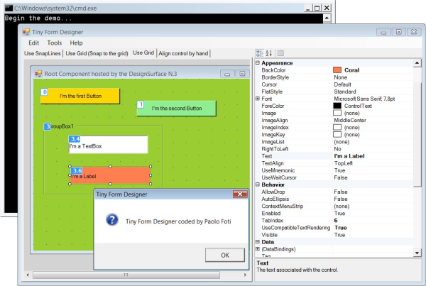

In this post we are going to talk about what's new in Windows Forms runtime in .NET 6.0 Preview 5.

## Application-wide default font

.NET Framework and Windows Forms were designed and built in a completely different world from today – back when CRT
monitors still largely maxed out at 1024x768, and “Microsoft Sans Serif” was the default font on Windows.

However, nothing is ever set in stone, and even fundamental properties like default font change once in a while.
Windows Vista received a fair share of UI updates, including the default font, which was changed to Segoe UI.
But this wasn’t something that could be changed in .NET Framework, and it continued using Microsoft Sans Serif as
the default font. 

Fast forward to 2018 and .NET Core 3.0 we were finally able to start modernizing Windows Forms. We changed the font
to Segoe UI in [dotnet/winforms#656](https://github.com/dotnet/winforms/pull/656), and quickly learned that a great
number of things depend on this default font metrics. For example, the designer was no longer a true WYSIWYG, because
Visual Studio process was run under .NET Framework 4.7.2, and use the old default font, whereas a .NET application at
the runtime would run with the new font. (Before you ask, we are working on a feature that will address this.)

We also learned that the change of font made it harder for some customers to migrate their large applications with
pixel-perfect layouts. Whilst we had provided [migration strategies](https://docs.microsoft.com/dotnet/core/compatibility/fx-core#default-control-font-changed-to-segoe-ui-9-pt)
applying those across hundreds of forms and controls could be a significant undertaking.

To make it easier to migrate those pixel-perfect apps in [dotnet/winforms#4911](https://github.com/dotnet/winforms/pull/4911)
we added a new API to our toolkit:

```csharp
void Application.SetDefaultFont(Font font)
```

Like many other `Application` API, this API can only be used before the first window is created, which generally is
in the `Main()` method of the application.


```csharp
class Program
{
    [STAThread]
    static void Main()
    {
        Application.EnableVisualStyles();
        Application.SetHighDpiMode(HighDpiMode.PerMonitorV2);

       Application.SetDefaultFont(new Font(new FontFamily("Microsoft Sans Serif"), 8f));

        Application.Run(new Form1());
    }
}
```

An attempt to set the default font after the first window is created will result in an `InvalidOperationException`.

As a side note, it is easy to go wild with this API, and set the application default font to '_Chiller, 20pt, style=bold italic underline_',
but please be mindful of your end user experience.


## More runtime designers


The Windows Forms SDK consist of two distinct parts: 

1. the runtime, i.e. the code that executes, open sourced at https://github.com/dotnet/winforms, and
2. the designer, which consists of “general designer” (i.e. a designer that developers can embed in their application)
and "Visual Studio specific" components, close sourced. 

In .NET Framework these two parts lived closely together, and that allowed developers to invoke and use VS-specific
functionality in their apps. In .NET Core these two components were split, and now for the most part evolve independently
of each other. With this split, the Visual Studio Designer specific functionality will not be made publicly available,
because it makes no sense outside Visual Studio. On the other hand, the general designer functionality can be used and useful
outside Visual Studio, and in response to our customers' requests in Preview 5 we have ported a number of API that should
enable building "a designer", such as a report designer. 

With [dotnet/winforms#4860](https://github.com/dotnet/winforms/pull/4860) the following designers are now available: 

* System.ComponentModel.Design.ComponentDesigner 
* System.Windows.Forms.Design.ButtonBaseDesigner 
* System.Windows.Forms.Design.ComboBoxDesigner 
* System.Windows.Forms.Design.ControlDesigner 
* System.Windows.Forms.Design.DocumentDesigner 
* System.Windows.Forms.Design.DocumentDesigner 
* System.Windows.Forms.Design.FormDocumentDesigner 
* System.Windows.Forms.Design.GroupBoxDesigner 
* System.Windows.Forms.Design.LabelDesigner 
* System.Windows.Forms.Design.ListBoxDesigner 
* System.Windows.Forms.Design.ListViewDesigner 
* System.Windows.Forms.Design.MaskedTextBoxDesigner 
* System.Windows.Forms.Design.PanelDesigner 
* System.Windows.Forms.Design.ParentControlDesigner 
* System.Windows.Forms.Design.ParentControlDesigner 
* System.Windows.Forms.Design.PictureBoxDesigner 
* System.Windows.Forms.Design.RadioButtonDesigner 
* System.Windows.Forms.Design.RichTextBoxDesigner 
* System.Windows.Forms.Design.ScrollableControlDesigner 
* System.Windows.Forms.Design.ScrollableControlDesigner 
* System.Windows.Forms.Design.TextBoxBaseDesigner 
* System.Windows.Forms.Design.TextBoxDesigner 
* System.Windows.Forms.Design.ToolStripDesigner 
* System.Windows.Forms.Design.ToolStripDropDownDesigner 
* System.Windows.Forms.Design.ToolStripItemDesigner 
* System.Windows.Forms.Design.ToolStripMenuItemDesigner 
* System.Windows.Forms.Design.TreeViewDesigner 
* System.Windows.Forms.Design.UpDownBaseDesigner 
* System.Windows.Forms.Design.UserControlDocumentDesigner 

If you think we missed a designer that your application depends on please let us know at our [GitHub repository](https://github.com/dotnet/winforms).

As a test bed we’ve used an [awesome sample](https://www.codeproject.com/Articles/24385/Have-a-Great-DesignTime-Experience-with-a-Powerful)
authored by [Paolo Foti](https://www.codeproject.com/script/Membership/View.aspx?mid=4970295)



### Why these API weren’t ported initially? 

When we were opening sourcing the Windows Forms SDK we needed to prioritize our work based on usage per our telemetry. Now we are porting based on customer feedback. 
So these APIs are now ported on a per-request basis and require a use case that will warrant the work.


## Reporting bugs and suggesting features

If you have any comments, suggestions or faced some issues, please let us know! Submit Visual Studio and Designer
related issues via **Visual Studio Feedback** (look for a button in the top right corner in Visual Studio), and Windows
Forms runtime related issues at our [GitHub repository](https://github.com/dotnet/winforms).

Happy coding!
