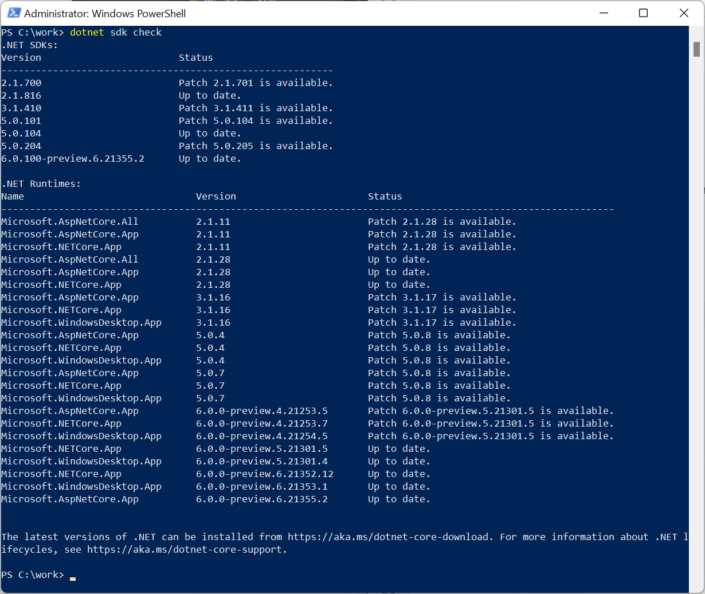
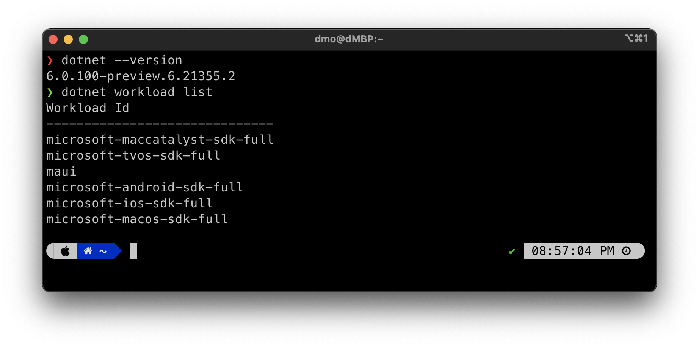
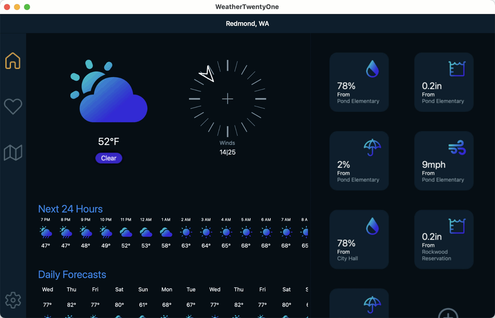
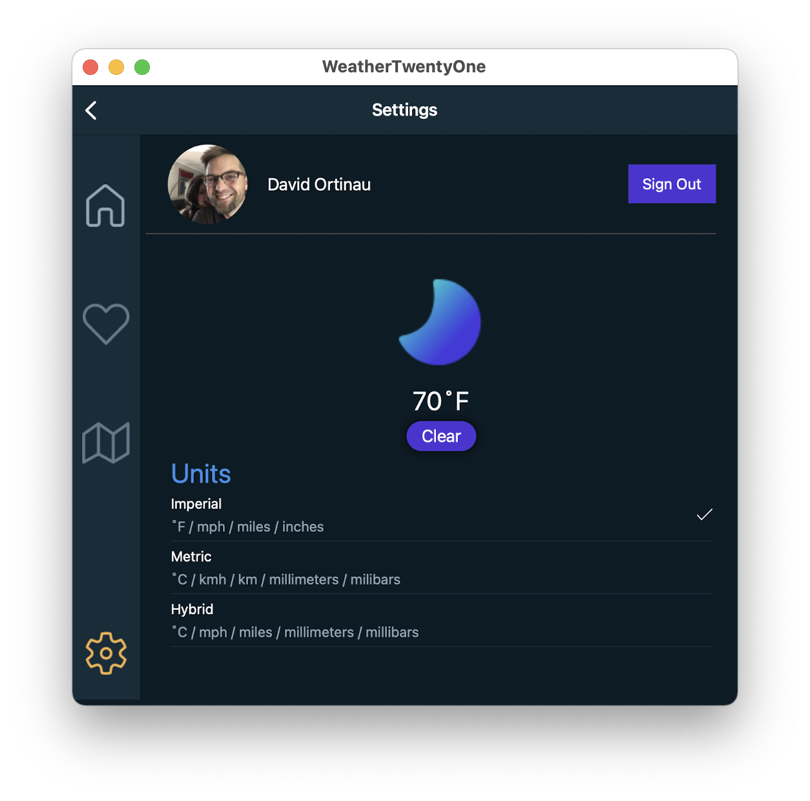
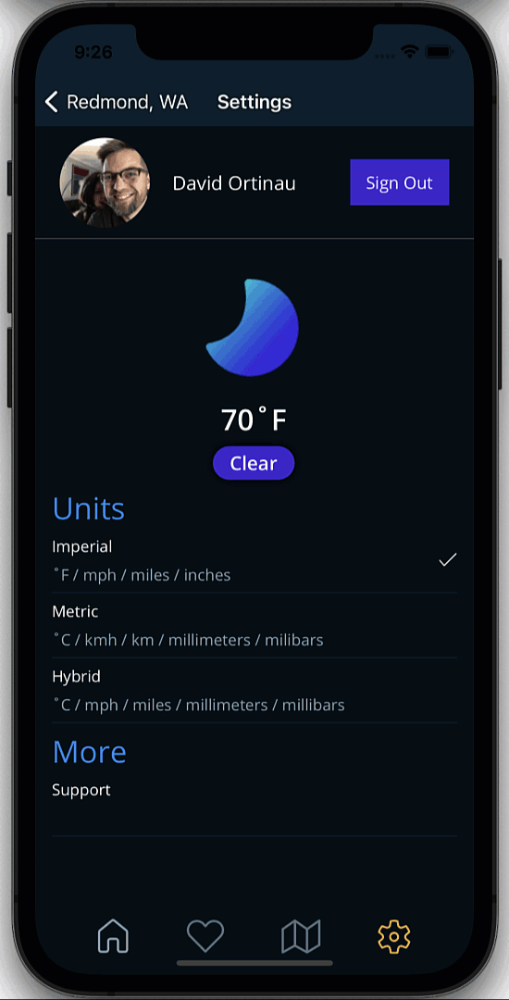
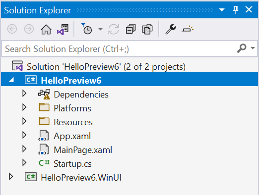

Today with .NET 6 Preview 6 we are shipping our latest progress on .NET Multi-platform App UI (MAUI). This release we are all-in on Visual Studio 2022 Preview 2. This also marks the first time we are shipping .NET MAUI as a workload installation. Several new capabilities are now available including gestures, modal pages, view clipping, native alerts, flex layout, and more. Single project also continues to be improved along with adopting the latest release of the Windows App SDK and Visual Studio extensions. Let's take a deeper look.

## Workload Installation

As part of .NET unification, we have introduced the concept of SDK workloads to enable specific developer scenarios on top of the .NET SDK you've installed. In preview 4 the underlying SDKs for Android, iOS, macOS, and Mac Catalyst were enabled, and now in preview 6 we are introducing the `maui`, `maui-mobile`, and `maui-desktop` workloads. The first will acquire and install all the required SDKs for building .NET MAUI applications. If you are only wanting to target mobile or desktop, you can choose those individually.

In the near future Visual Studio 2022 will include these with its installer. To use them today, jump into your favorite CLI. First, take a look at what you have installed already:

```dotnetcli
dotnet sdk check
```



This reports what has been installed via the .NET SDK installer itself. Now to see the additional workloads run:

```dotnetcli
dotnet workload list
```



To then install .NET MAUI you can execute:

```dotnetcli
dotnet workload install maui
```

> What about the `maui-check` dotnet tool? We will continue to update `maui-check` with each release as it does additional validation of your development environment to help you be successful: checking for OpenJDK, emulators, Xcode, Visual Studio versions, and more.

For more information about mobile and desktop workloads, [read details here](https://github.com/dotnet/maui-samples/#dotnet-workload-install-command).

## New .NET MAUI Capabilities

As you can see on [our status report](https://github.com/dotnet/maui/wiki/Status), we are very close to being completely green for enabling features in .NET MAUI. Let's highlight a few of the newcomers.

## Gestures

[Gesture recognizers](https://docs.microsoft.com/xamarin/xamarin-forms/app-fundamentals/gestures/) allow you to apply tap, pinch, pan, swipe, and drag-and-drop to any view instance. You can apply them easily in XAML:

```xaml
<Grid>
    <Grid.GestureRecognizers>
        <TapGestureRecognizer NumberOfTapsRequired="2" Command="{Binding OnTileTapped}" />
    </Grid.GestureRecognizers>
    <!-- Grid content -->
</Grid>
```



In this example, when the weather widget tile is double-tapped, it simulates a refresh with a fade-out, fade-in animation.

## Clipping

When you need to mask content you can now add shapes to the clipping region of a layout or view. The most common use for this is to make a circle image.



```xaml
<Image Source="face.png">
    <Image.Clip>
        <EllipseGeometry RadiusX="80"
                         RadiusY="80"
                         Center="80,80" />
    </Image.Clip>
</Image>
```

## Native Alerts

Each platform has a native way of displaying alerts to users. These can be simple informational [popups](https://docs.microsoft.com/xamarin/xamarin-forms/user-interface/pop-ups#display-an-alert), [simple input forms](https://docs.microsoft.com/xamarin/xamarin-forms/user-interface/pop-ups#display-a-prompt), and even [action sheets](https://docs.microsoft.com/xamarin/xamarin-forms/user-interface/pop-ups#guide-users-through-tasks) with multiple options to guide a user. These are available from any `Page` in a .NET MAUI application.

```csharp
await DisplayAlert ("Alert", "You have been alerted", "OK");
```



These are just a few of the controls and layouts updated in preview 6. For a complete list, check out the commit log on GitHub. A few sweeping changes for layout, borders, corners, and shadows will be arriving in preview 7.

## Single Project and Windows

We've made a few updates to single project based on developer feedback and Windows support to adopt the latest features. Some of you have been following along with each release, and we love that! Thank you for providing your feedback and engaging with us on GitHub and Discord. So, what has changed in preview 6 that you'll need to update in your existing solutions?

* The NuGet package is replaced with the [.NET MAUI workload](https://github.com/dotnet/maui/blob/release/6.0.1xx-preview6/src/Templates/src/templates/maui-mobile/MauiApp1/MauiApp1.csproj) (`<UseMaui>true</UseMaui>` in the .csproj).
* Single project solutions now [nest individual platforms](https://github.com/dotnet/maui/tree/release/6.0.1xx-preview6/src/Templates/src/templates/maui-mobile/MauiApp1/Platforms) within a "Platforms" folder for tidy organization.
* Updated to Windows App SDK 0.8.1 RC. Use the latest Visual Studio 2022 compatible extensions from the marketplace.



## Get Started Today

First thing's first, install .NET 6 Preview 6. Now add the `maui` workload using the command above. Also make sure you have updated to the latest preview of Visual Studio 2022.

Ready? Create new app from the command line and then open the solution in Visual Studio 2022.

```cli
dotnet new maui -n HelloPreview6
```

> In future versions of Visual Studio 2022 the .NET MAUI templates will appear in the File > New list. Until then, the CLI is your good friend.

For additional information about getting started with .NET MAUI, refer to our [documentation](https://docs.microsoft.com/dotnet/maui/get-started/installation).

## Feedback Welcome

Please let us know about your experiences using .NET MAUI Preview 5 to create new applications by engaging with us on GitHub at [dotnet/maui](https://github.com/dotnet/maui).

For a look at what is coming in future releases, visit our [product roadmap](https://github.com/dotnet/maui/wiki/roadmap).