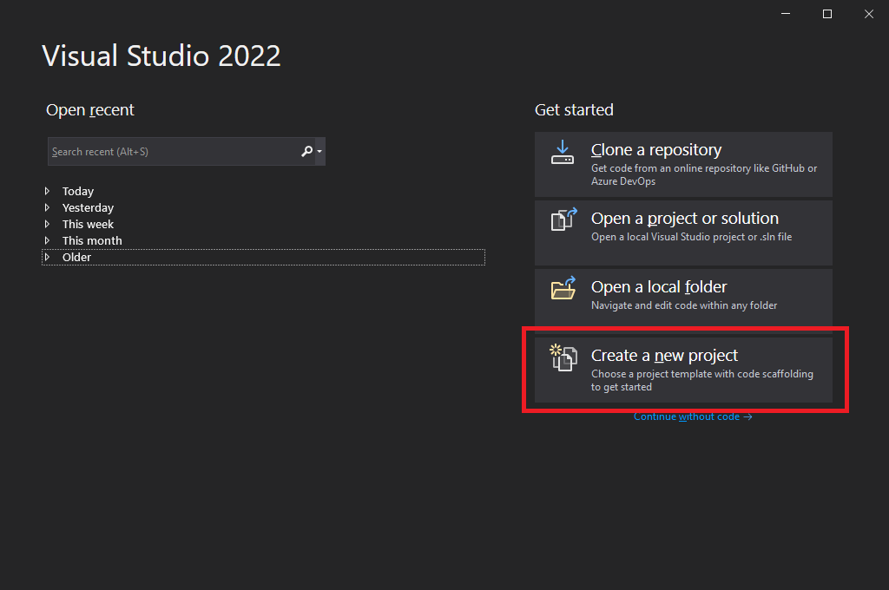
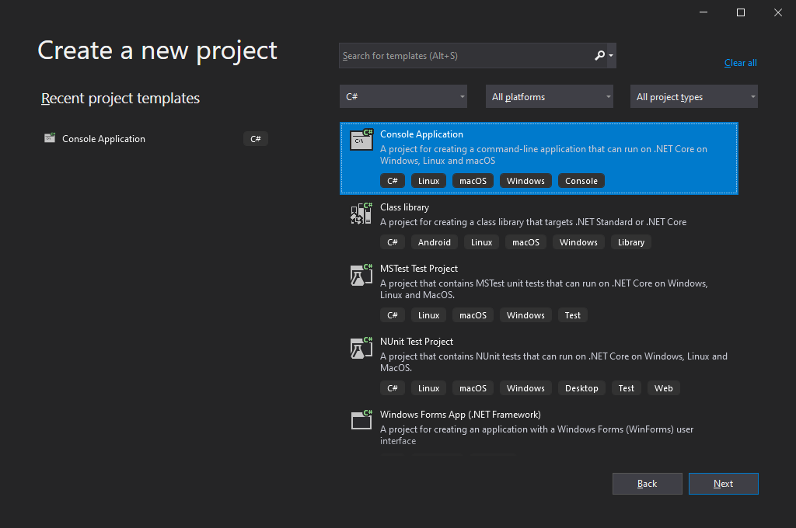
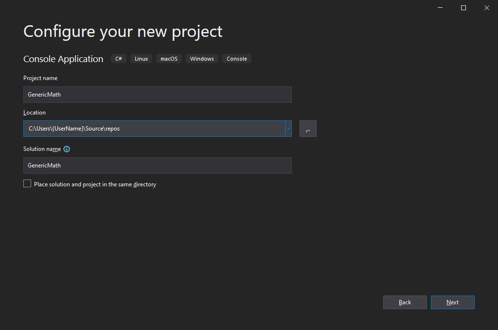
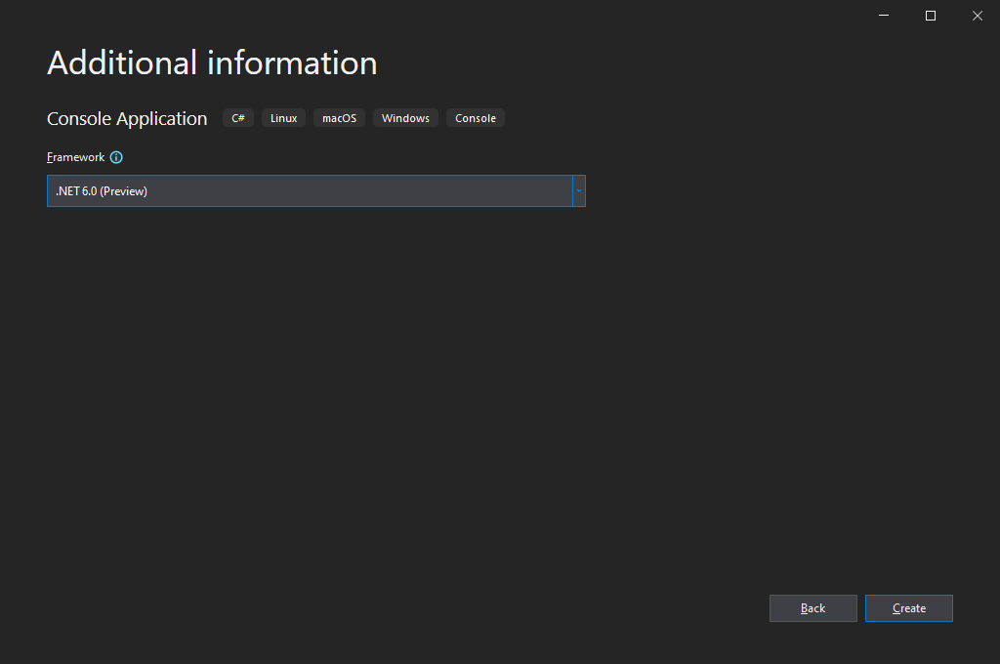
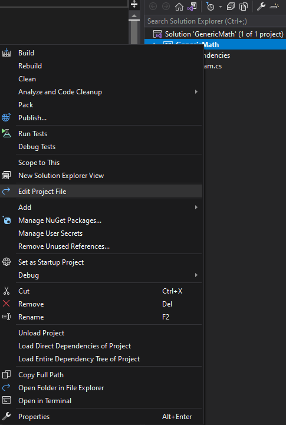

If you've ever wanted to use operators with generic types or thought that interfaces could be improved by supporting the ability to define static methods as part of their contract, then this blog post is for you as .NET 6.0 will be shipping a preview of the new generic math and static abstracts in interfaces features. These features will not be supported for use in a production environment in .NET 6 and are being previewed so we can get feedback from the community and build a more compelling feature overall. It is highly recommended that you try the feature out and provide feedback if there are scenarios or functionality you feel is missing or could otherwise be improved.

## Requires preview features attribute

Central to everything else is the new [RequiresPreviewFeatures](https://github.com/dotnet/designs/blob/main/accepted/2021/preview-features/preview-features.md) attribute and corresponding analyzer. This attribute allows us to annotate new preview types and preview APIs on non-preview types so that we can succesfully ship a preview feature alongside the supported product. The analyzer looks for APIs and types being consumed that have the `RequiresPreviewFeatures` attribute and will give a diagnostic if the consumer is not correspondingly marked with `RequiresPreviewFeatures` itself, which can be done at the member, type, or assembly level.

This analyzer exists to help avoid users taking accidental dependencies on preview features or APIs as they will likely have breaking changes introduced between when they initially preview and when they become officially supported. The analyzer will not be available in .NET 6 Preview 7 but should be available in .NET 6 RC1.

## Static Abstracts in Interfaces

C# is planning on introducing a new feature referred to as [Static Abstracts in Interfaces](https://github.com/dotnet/csharplang/blob/main/proposals/static-abstracts-in-interfaces.md). As the name indicates, this means you can now declare static abstract methods as part of an interface and implement them in the derived type. A simple but powerful example of this is in `IParseable` which is the counterpart to the existing `IFormattable`. Where `IFormattable` allows you to define a contract for generating a formatted string for a given type, `IParseable` allows you to define a contract for parsing a string to create a given type:
```csharp
public interface IParseable<TSelf>
    where TSelf : IParseable<TSelf>
{
    static abstract TSelf Parse(string s, IFormatProvider? provider);

    static abstract bool TryParse([NotNullWhen(true)] string? s, IFormatProvider? provider, out TSelf result);
}

public readonly struct Guid : IParseable<Guid>
{
    public static Guid Parse(string s, IFormatProvider? provider)
    {
        /* Implementation */
    }

    public static bool TryParse([NotNullWhen(true)] string? s, IFormatProvider? provider, out Guid result)
    {
        /* Implementation */
    }
}
```

A quick overview of the feature is:
* You can now declare interface members that are simultaneously `static` and `abstract`
* These members do not currently support [Default Interface Methods]( https://docs.microsoft.com/dotnet/csharp/language-reference/proposals/csharp-8.0/default-interface-methods) (DIMs) and so `static` and `virtual` is not a valid combination
* This functionality is only available to interfaces, it is not available to other types such as `abstract class`
* These members are not accessible via the interface, that is `IParseable<Guid>.Parse(someString, null)` will result in a compilation error

To elaborate on the last point, normally `abstract` or `virtual` members are invoked via some kind of virtual dispatch. For static methods we don't have any object or instance in which to carry around the relevant state for true virtual dispatch and so the runtime wouldn't be able to determine that `IParseable<Guid>.Parse(...)` should resolve to `Guid.Parse`. In order for this to work, we need to specify the actual type somewhere and that is achievable through generics:
```csharp
public static T InvariantParse<T>(string s)
    where T : IParseable<T>
{
    return T.Parse(s, CultureInfo.InvariantCulture);
}
```

By using generics in the fashion above, the runtime is able to determine which `Parse` method should be resolved by looking it up on the concrete `T` that is used. If a user specified `InvariantParse<int>(someString)` it would resolve to the parse method on `System.Int32`, if they specified `InvariantParse<Guid>(someString)` it would resolve to that on `System.Guid`, and so on. This general pattern is sometimes referred to as the Curiously Recurring Template Pattern (CRTP) and is key to allowing the feature to work.

More details on the runtime changes made to support the feature can be found here: https://github.com/dotnet/runtime/blob/main/docs/design/specs/Ecma-335-Augments.md#static-interface-methods

## Generic Math

One long requested feature in .NET is the ability to use operators on generic types. Using static abstracts in interfaces and the new interfaces being exposed in .NET, you can now write this code:
```csharp
public static TResult Average<T, TResult>(IEnumerable<T> values)
    where T : INumber<T>
    where TResult : INumber<TResult>
{
    TResult sum = Sum<T, TResult>(values);
    return TResult.Create(sum) / TResult.Create(values.Count());
}

public static TResult StandardDeviation<T, TResult>(IEnumerable<T> values)
    where T : INumber<T>
    where TResult : IFloatingPoint<TResult>
{
    TResult standardDeviation = TResult.Zero;

    if (values.Any())
    {
        TResult average = Average<T, TResult>(values);
        TResult sum = Sum<TResult, TResult>(values.Select((value) => {
            var deviation = TResult.Create(value) - average;
            return deviation * deviation;
        }));
        standardDeviation = TResult.Sqrt(sum / TResult.Create(values.Count() - 1));
    }

    return standardDeviation;
}

public static TResult Sum<T, TResult>(IEnumerable<T> values)
    where T : INumber<T>
    where TResult : INumber<TResult>
{
    TResult result = TResult.Zero;

    foreach (var value in values)
    {
        result += TResult.Create(value);
    }

    return result;
}
```

This is made possible by exposing several new static abstract interfaces which correspond to the various operators available to the language and by providing a few other interfaces representing common functionality such as parsing or handling number, integer, and floating-point types. The interfaces were designed for extensibility and reusability and so typically represent single operators or properties. They explicitly do not pair operations such as multiplication and division since that is not correct for all types. For example, `Matrix4x4 * Matrix4x4` is valid, `Matrix4x4 / Matrix4x4` is not. Likewise, they typically allow the input and result types to differ in order to support scenarios such as `double = TimeSpan / TimeSpan` or `Vector4 = Vector4 * float`.

If you're interested to learn more about the interfaces we're exposing, take a look at the [design document](https://github.com/dotnet/designs/pull/205) which goes into more detail about what is exposed.

| Operator Interface Name | Summary                                                          |
| ----------------------- | ---------------------------------------------------------------- |
| IParseable              | Exposes support for `Parse(string, IFormatProvider)`             |
| ISpanParseable          | Exposes support for `Parse(ReadOnlySpan<char>, IFormatProvider)` |
|                         |                                                                  |
| IAdditionOperators      | Exposes the `x + y` operator                                     |
| IBitwiseOperators       | Exposes the `x & y`, `x | y`, `x ^ y`, and `~x` operators        |
| IComparisonOperators    | Exposes the `x < y`, `X > y`, `x <= y`, and `x >= y` operators   |
| IDecrementOperators     | Exposes the `--x` operator. Also supports `x++`                  |
| IDivisionOperators      | Exposes the `x / y` operator                                     |
| IEqualityOperators      | Exposes the `x == y` and `x != y` operators                      |
| IIncrementOperators     | Exposes the `++x` operator                                       |
| IModulusOperators       | Exposes the `x % y` operator                                     |
| IMultiplyOperators      | Exposes the `x * y` operator                                     |
| IShiftOperators         | Exposes the `x << y` and `x >> y` operators                      |
| ISubtractionOperators   | Exposes the `x - y` operator                                     |
| IUnaryNegationOperators | Exposes the `-x` operator                                        |
| IUnaryPlusOperators     | Exposes the `+x` operator                                        |
|                         |                                                                  |
| IAdditiveIdentity       | Exposes the concept of `(x + T.AdditiveIdentity) == x`           |
| IMinMaxValue            | Exposes the concept of `T.MinValue` and `T.MaxValue`             |
| IMultiplicativeIdentity | Exposes the concept of `(x * T.MultiplicativeIdentity) == x`      |
|                         |                                                                  |
| IBinaryFloatingPoint    | Exposes members common to binary floating-point types            |
| IBinaryInteger          | Exposes members common to binary integer types                   |
| IBinaryNumber           | Exposes members common to binary number types                    |
| IFloatingPoint          | Exposes members common to floating-point types                   |
| INumber                 | Exposes members common to all number types                       |
| ISignedNumber           | Exposes members common to all signed number types                |
| IUnsignedNumber         | Exposes members common to all unsigned number types              |

The binary floating-point types are `System.Double` (`double`), `System.Half`, and `System.Single` (`float`). The binary-integer types are `System.Byte` (`byte`), `System.Int16` (`short`), `System.Int32` (`int`), `System.Int64` (`long`), `System.IntPtr` (`nint`), `System.SByte` (`sbyte`), `System.UInt16` (`ushort`), `System.UInt32` (`uint`), `System.UInt64` (`ulong`), and `System.UIntPtr` (`nuint`). Several of the above interfaces are also implemented by various other types including `System.Char`, `System.DateOnly`, `System.DateTime`, `System.DateTimeOffset`, `System.Decimal`, `System.Guid`, `System.TimeOnly`, and `System.TimeSpan`.

Since this feature is in preview, there are various aspects that are still in flight and that may change before the next preview or when the feature officially ships. For example, we will likely be changing the name of `INumber<TSelf>.Create` to `INumber<TSelf>.CreateChecked` and `INumber<TSelf>.CreateSaturating` to `INumber<TSelf>.CreateClamped` based on feedback already received. We may also expose new or additional concepts such as `IConvertible<TSelf>` or interfaces to support vector types and operations.

If any of the above or any other features are important to you or you feel may impact the usability of the feature in your own code, please do provide feedback ([.NET Runtime or Libraries](https://github.com/dotnet/runtime), [C# Language](https://github.com/dotnet/csharplang], and [C# Compiler](https://github.com/dotnet/roslyn) are generally good choices). In particular:
* Checked operators are not currently possible and so `checked(x + y)` will not detect overflow: https://github.com/dotnet/csharplang/issues/4665
* There is no easy way to go from a signed type to an unsigned type, or vice versa, and so selecting logical (unsigned) vs arithmetic (signed) shift is not possible: https://github.com/dotnet/csharplang/issues/4682
* Shifting requires the right-hand side to be `System.Int32` and so additional conversions may be required: https://github.com/dotnet/csharplang/issues/4666
* All APIs are currently explicitly implemented, many of these will likely become implicitly available on the types when the feature ships

## Trying out the features

In order to try out the features there are a few steps required:

1. Create a new C# console application targeting .NET 6 on the command line or in your favorite IDE






2. Edit the C# project file, enable preview features, and reference System.Runtime.Experimental



```xml
<Project Sdk="Microsoft.NET.Sdk">

  <PropertyGroup>
    <EnablePreviewFeatures>true</EnablePreviewFeatures>
    <LangVersion>preview</LangVersion>
    <OutputType>Exe</OutputType>
    <TargetFramework>net6.0</TargetFramework>
  </PropertyGroup>

  <ItemGroup>
    <PackageReference Include="System.Runtime.Experimental" Version="6.0.0-preview.7.*" />
  </ItemGroup>

</Project>
```

3. Create a generic type or method and constrain it to one of the new static abstract interfaces

```csharp
// See https://aka.ms/new-console-template for more information

using System.Globalization;

static T Add<T>(T left, T right)
    where T : INumber<T>
{
    return left + right;
}

static T ParseInvariant<T>(string s)
    where T : IParseable<T>
{
    return T.Parse(s, CultureInfo.InvariantCulture);
}

Console.Write("First number: ");
var left = ParseInvariant<float>(Console.ReadLine());

Console.Write("Second number: ");
var right = ParseInvariant<float>(Console.ReadLine());

Console.WriteLine($"Result: {Add(left, right)}");
```

4. Run the program and observe the output

> First number: 5
> Second number: 3.14
> Result: 8.14

## Closing

While we only briefly covered the new types and gave a simple example of their usage, the potential applications are much broader and we are looking forward to your feedback and seeing what awesome ways you can use this to improve your existing code or in the creation of new code. You can log feedback on any of the existing issues linked above or open new issues, as appropriate, on the relevant GitHub repository ([.NET Runtime or Libraries](https://github.com/dotnet/runtime), [C# Language](https://github.com/dotnet/csharplang], and [C# Compiler](https://github.com/dotnet/roslyn) are generally good choices).
