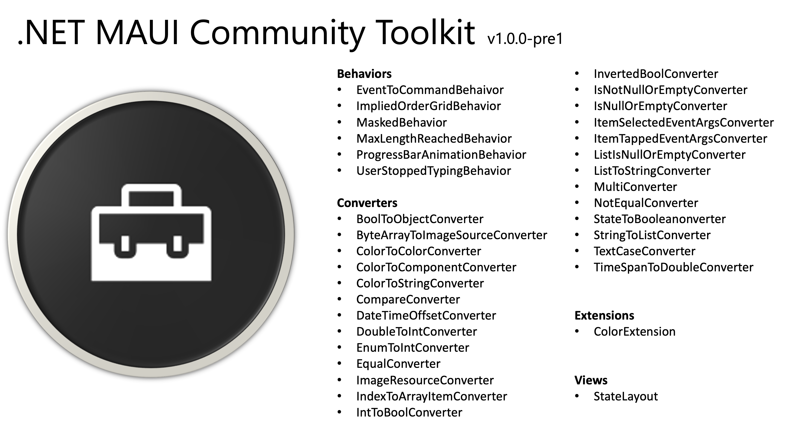
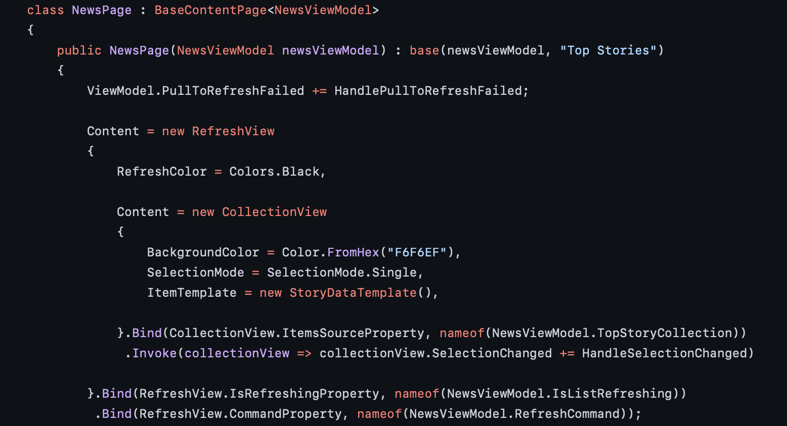
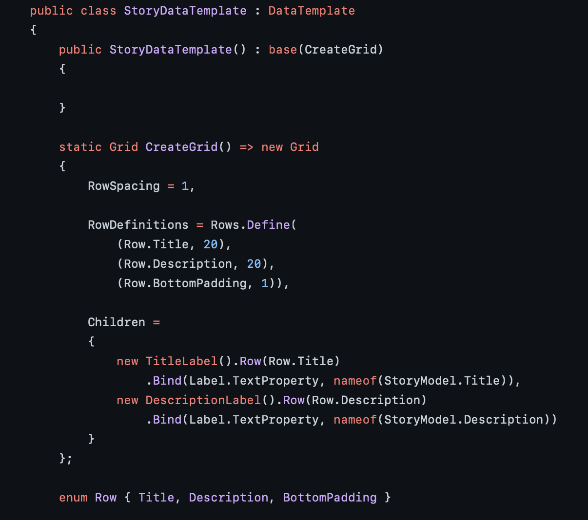

The Community Toolkit team is excited to announce the first pre-release two new .NET Multi-platform App UI (.NET MAUI) Toolkits:
- [`CommunityToolkit.Maui`](https://www.nuget.org/packages/CommunityToolkit.Maui/)
- [`CommunityToolkit.Maui.Markup`](https://www.nuget.org/packages/CommunityToolkit.Maui.Markup/)

As [announced last month](https://devblogs.microsoft.com/xamarin/the-future-of-xamarin-community-toolkit/?WT.mc_id=mobile-39516-bramin), these libraries are the evolution of the [Xamarin Community Toolkits](https://github.com/xamarin/xamarincommunitytoolkit). They contain .NET MAUI Extensions, Advanced UI/UX Controls, Effects, and Behaviors to help make your life as a .NET MAUI developer easier.

These features are contributed by you, our amazing .NET community, and maintained by a core set of maintainers [(see "Focus On Community", below)](#focus-on-community).

And - the best part - the features you add to the .NET MAUI Toolkit may one day be included into the official .NET MAUI library! We leverage the Community Toolkits to debut new features and work closely with the .NET MAUI engineering team to nominate features for promotion.

## What to Expect in .NET MAUI Toolkit

The .NET MAUI Toolkit does not yet include all of the amazing community contributions from the [Xamarin Community Toolkit](https://github.com/xamarin/xamarincommunitytoolkit). We are actvely porting them from Xamarin.Forms to .NET MAUI and they will be available in upcoming releases [(see "Schedule", below)](#schedule).



The .NET MAUI Toolkit will not contain the MVVM features from Xamarin Community Toolkit, like [`AsyncCommand`](https://channel9.msdn.com/Shows/XamarinShow/Xamarin-Community-Toolkit-Awesome-AsyncCommand--AsyncValueCommand?WT.mc_id=mobile-39516-bramin). Going forward, we will be adding all MVVM-specifc features to a new NuGet Package, `CommunityToolkit.MVVM`.

## What to Expect in .NET MAUI Markup Toolkit

The .NET MAUI Markup Toolkit allows developers to continue architecting their apps using MVVM, Bindings, Resource Dictionaries, etc., without the need for XAML:
* Fluent C# UI Extensions
* Create your .NET MAUI UI in C# using MVVM (no XAML)

The [.NET MAUI Markup Toolkit](https://github.com/communitytoolkit/maui.markup) contains all of the C# UI extension methods from the [Xamarin Community Toolkit](https://github.com/xamarin/xamarincommunitytoolkit).

 Here are examples from my [open-source HackerNews app](https://github.com/brminnick/HackerNews/):

| ContentPage | DataTemplate |
| ----------- | ------------ |
| [Link to Source Code](https://github.com/brminnick/HackerNews/blob/5e93c31c6d806167ce01ad15fd6297c2014c6d96/HackerNews/HackerNews/Pages/NewsPage.cs#L13-L32) | [Link to Source Code](https://github.com/brminnick/HackerNews/blob/5e93c31c6d806167ce01ad15fd6297c2014c6d96/HackerNews/HackerNews/Views/News/StoryDataTemplate.cs#L8-L33) |
|  |  |

### Docs

We have teamed up with the Microsoft Docs team to find a new home for all of the Community Toolkit documentation. Stay tuned for future updates when we announce the new location of the Community Toolkit docs on [docs.microsoft.com](https://docs.microsoft.com).


## Getting Started

Both `MauiCompat` libraries are available as a NuGet package that can be added to any .NET 6 project targeting `net6.0-ios` and `net6.0-android`:

| | **CommunityToolkit.Maui** | **CommunityToolkit.Maui.Markup** | 
|-| --------------------------------------- | ---------------------------------------------- |
| NuGet Package | https://www.nuget.org/packages/CommunityToolkit.Maui/ | https://www.nuget.org/packages/CommunityToolkit.Maui.Markup/ |

1. Open a .NET MAUI project in Visual Studio

2. In the [Visual Studio Package Manager Console](https://docs.microsoft.com/nuget/consume-packages/install-use-packages-powershell#opening-the-console-and-console-controls?WT.mc_id=mobile-39516-bramin), enter the following command:

    ```bash
    Install-Package CommunityToolkit.Maui
    ```

    or

    ```bash
    Install-Package CommunityToolkit.Maui.Markup
    ```

3. To add the namespace to the toolkit:

    * In C#, add the following:

        ```csharp
        using CommunityToolkit.Maui;
        ```

        or 

        ```csharp
        using CommunityToolkit.Maui.Markup;
        ```

    * In XAML, add the following:

        ```xml
        xmlns="https://schemas.microsoft.com/dotnet/2021/maui"
        xmlns:behaviors="clr-namespace:CommunityToolkit.Maui.Behaviors;assembly=CommunityToolkit.Maui"
        xmlns:converters="clr-namespace:CommunityToolkit.Maui.Converters;assembly=CommunityToolkit.Maui"
        xmlns:effects="clr-namespace:CommunityToolkit.Maui.Effects;assembly=CommunityToolkit.Maui"
        xmlns:views="clr-namespace:CommunityToolkit.Maui.Views;assembly=CommunityToolkit.Maui"
        ```

## Focus on Community

While these libraries are built in collaboration with the .NET team at Microsoft, it is truly a community effort. The core team, [Andrei Misiukevich](https://twitter.com/Andrik_Just4Fun), [Pedro Jesus](https://twitter.com/pj_souz), [Gerald Versluis](https://twitter.com/jfversluis), [Javier Suárez](https://twitter.com/jsuarezruiz), and (myself) [Brandon Minnick](https://twitter.com/TheCodeTraveler), are here mostly to move things forward. 

Your help and input is very much required. Whether that is through triaging issues, updating Docs, participating in discussions or adding actual code, we will need your help!

Starting in November, following the first offical release (aka non pre-release) of .NET MAUI Community Toolkit, we encourage you to open Feature Requests and Proposals to add your favorite .NET MAUI extensions to the toolkit:

- [.NET MAUI Community Toolkit GitHub Repository](https://github.com/communityToolkit/Maui/)
- [.NET MAUI Markup Community Toolkit GitHub Repository](https://github.com/communityToolkit/Maui.Markup)

Once your proposal has been approved, you will be welcome to submit a Pull Request adding your own feature to the toolkit!

## Schedule

The .NET MAUI Community Toolkit will GA alongside .NET MAUI and .NET 6 in November 2021.

| **Date** | **Milestone** |
| ---- | --------- |
| August 2021 | First NuGet Pre-Release of `CommunityToolkit.Maui` |
| August 2021 | First NuGet Pre-Release of `CommunityToolkit.Maui.Markup` |
| September 2021 | Second NuGet Pre-Release of `CommunityToolkit.Maui` |
| September 2021 | Second NuGet Pre-Release of `CommunityToolkit.Maui.Markup` |
| October 2021 | Third NuGet Pre-Release of `CommunityToolkit.Maui` |
| October 2021 | Third NuGet Pre-Release of `CommunityToolkit.Maui.Markup` |
| November 2021 | .NET MAUI GA |
| November 2021 | `CommunityToolkit.Maui` GA |
| November 2021 | Begin Accepting New Proposals + Feature Requests for `CommunityToolit.Maui` |
| November 2021 | `CommunityToolkit.Maui.Markup` GA |
| November 2021 | Begin Accepting New Proposals + Feature Requests for `CommunityToolit.Maui.Markup` |

## Summary

The .NET MAUI Community Toolkits are still a work in progress, but we wanted to share our progress with you today!

As you begin your journey in .NET MAUI, try out the Toolkits, open proposals on our GitHub repositories, join the discussions and help us make the best Toolkits for the community!
