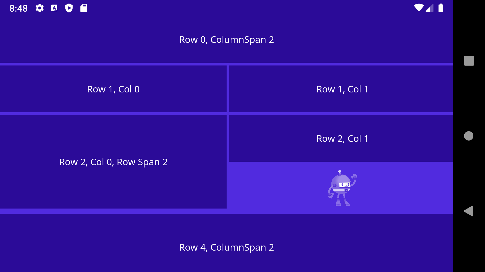
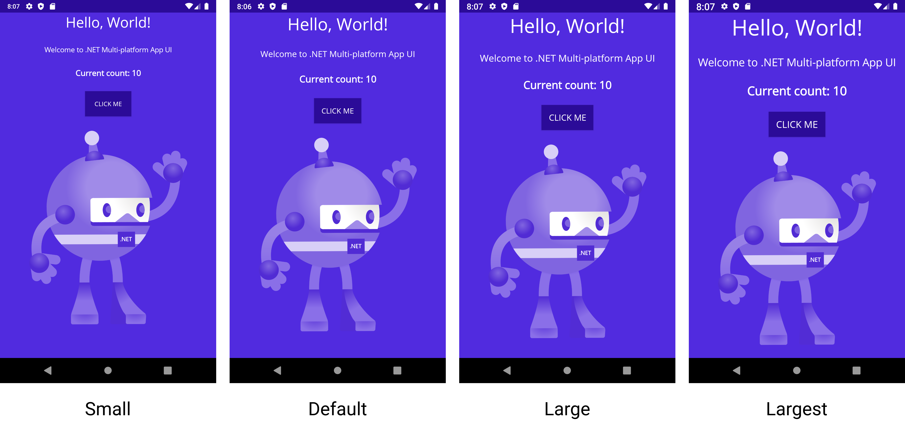
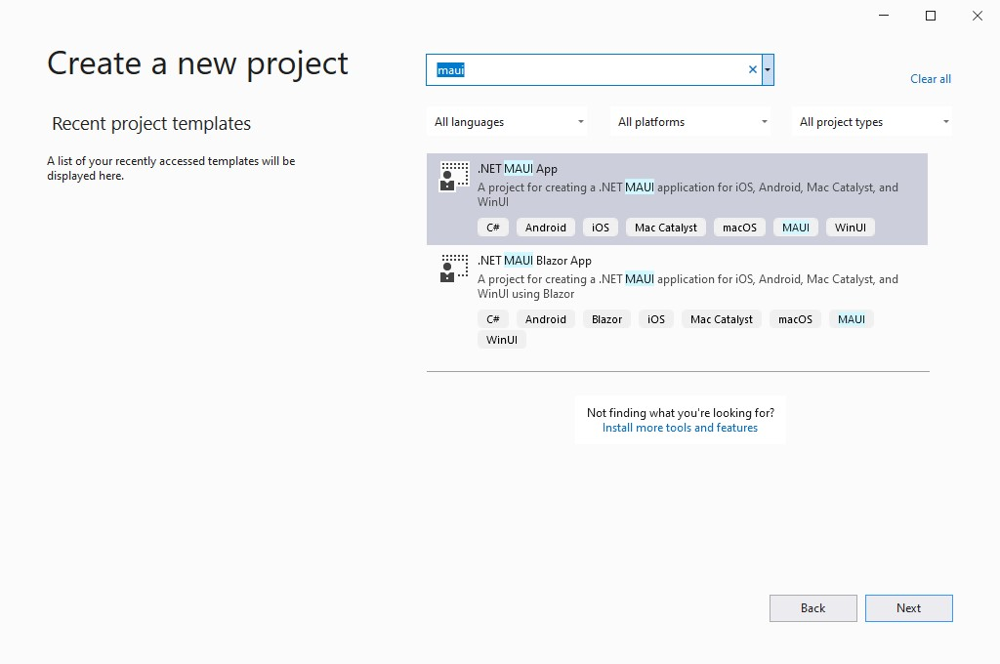

.NET 6 Preview 7 is now available, and we have introduced all new layouts for [.NET Multi-platform App UI](https://docs.microsoft.com/dotnet/maui/) (MAUI). This is a significant change for performance and reliability. We are excited to also introduce some new accessibility focused capabilities based on the new SemanticService, font scaling options, compatibility support for Xamarin.Forms Effects, and more.



## New Layouts

Up to now the layouts you've been using in .NET MAUI are the Xamarin.Forms layouts that were made aware of how to size and position both renderers and the new handler based controls. We began with this approach in order to quickly put UI on screen and focus our efforts on completing our library of UI 40 controls, and to prove out our ability to be compatible with projects migration from Xamarin.Forms. At the same time, we have been building optimized layouts based on a new LayoutManager approach employing our 7 years of Xamarin.Forms layout learning to optimize for consistency, performance, and maintainability.

In this preview, the old layouts are now only to be found in the Microsoft.Maui.Controls.Compatibility namespace, and the new layouts are enabled by default as:

* [Grid](https://docs.microsoft.com/xamarin/xamarin-forms/user-interface/layouts/grid)
* [FlexLayout](https://docs.microsoft.com/xamarin/xamarin-forms/user-interface/layouts/flex-layout)
* [StackLayout](https://docs.microsoft.com/xamarin/xamarin-forms/user-interface/layouts/stacklayout)
    * HorizontalStackLayout
    * VerticalStackLayout 

StackLayout now wraps two layouts focused on horizontal and vertical orientations. We recommend choosing the one that fits your layout need. The StackLayout still has an orientation property you can set, and in some cases this is essential when your adaptive layouts my change orientation based on screen size or device idiom.

Each layout has an accompanying LayoutManager responsible for measuring and positioning views. The Measure method takes height and width constraints, and is responsible for measuring all of hte layout's children. The ArrangeChildren then sets the size and position of each view according to the rules of the layout. For very advanced cases, you may override the CreateLayoutManager method of a layout to provide a custom implementation of ILayoutManager.

One of the immediate updates you'll noticed is the leveling of default spacing values on these layouts: 0. If you have used the legacy layouts, then you are already aware of different, arbitrary values previously set there. Zero sets a more clear expectation, and directs you to set your preferred values that meet your design needs. For convenience, set these starting values in your global styles:

```xaml
<ResourceDictionary>
    <Style TargetType="StackLayout">
        <Setter Property="Spacing" Value="6"/>
    </Style>

    <Style TargetType="Grid">
        <Setter Property="ColumnSpacing" Value="6"/>
        <Setter Property="RowSpacing" Value="6"/>
    </Style>
</ResourceDictionary>
```

[`AbsoluteLayout`](https://docs.microsoft.com/xamarin/xamarin-forms/user-interface/layouts/absolutelayout) and [`RelativeLayout`](https://docs.microsoft.com/xamarin/xamarin-forms/user-interface/layouts/relativelayout) now exist only in the compatibility namespace, and we recommend you closely consider whether you really need to use them or not. Where possible, use one of the layouts listed above. In the meantime, you can update your code to use them by adding the new namespace, and prefixing your XAML references:

```xaml
<ContentPage
    xmlns:cmp="clr-namespace:Microsoft.Maui.Controls.Compatibility;assembly=Microsoft.Maui.Controls"
    ...
    >
    <cmp:AbsoluteLayout>
        ...
    </cmp:AbsoluteLayout>
</ContentPage>
```

The .NET Upgrade Assistant is [being updated for all of these changes](https://github.com/dotnet/upgrade-assistant/issues/774), and we'll do our best to guide you through them, if not handle them for you during the upgrade process.

We will be giving a lot of focus to polishing up these new layouts through the next several sprints, so please give them a look and [file any issues](https://github.com/dotnet/maui/issues/new/choose) you observe as you explore using them.

## Accessibility Changes and Improvements

We meet monthly with several developers across a variety of companies heavily invested in delivering applications that meet the highest accessibility rating. From these meetings we have made a few changes and additions to our accessibility support making it easier for everyone to product accessible apps.

### TabIndex and IsTabStop Removed

TabIndex and IsTabStop properties were introduced in Xamarin.Forms to help developers control the order in which UI elements would be read by a screen reader. In practice, they ended up being confusing and not meeting that need. In .NET MAUI we recommend a thoughtful design approach that orders your UI as you would want it to be read, rather than looking for programmatic ways to manipulate the structure of your interface. For cases when you must take control over the order, we recommend the community toolkit's [`SemanticOrderView`](https://github.com/xamarin/XamarinCommunityToolkit/pull/1240) which will be available in the .NET MAUI version of the same.  

### SetSemanticFocus and Announce

Part of the new `SemanticExtensions` class, we have added a new `SetSemanticFocus` method allows you to move screen reader focus to a specific element. Compare this to `VisualElement.Focus` which sets input focus.

```xaml
<VerticalStackLayout>
    <Label
        Text="Explore SemanticExtensions below"
        TextColor="RoyalBlue"
        FontAttributes="Bold"
        FontSize="16"
        Margin="0,10"/>
    <Button
        Text="Click to set semantic focus to label below"
        FontSize="14"
        Clicked="SetSemanticFocusButton_Clicked"/>
    <Label
        x:Name="semanticFocusLabel"
        Text="Label receiving semantic focus"
        FontSize="14"/>
</VerticalStackLayout>
```

```csharp
private void SetSemanticFocusButton_Clicked(object sender, System.EventArgs e)
{
  semanticFocusLabel.SetSemanticFocus();
}
```

Within Essentials we have added another new method, `Announce`, which sets the text to be announced by the screen reader. On a button click, for example, you can trigger the following important message to be read:

```csharp
void Announce_Clicked(object sender, EventArgs e)
{
  SemanticScreenReader.Announce("Make accessible apps with .NET MAUI");
}
```

## Font Scaling

All controls across all platforms now have [font scaling](https://github.com/dotnet/maui/pull/1774) enabled by default. This means as your application users adjust their text scaling preferences in the OS, your UI will reflect their choice. This produces a more accessible app by default. 



Each control has an added `FontAutoScalingEnabled`, and it even works with `FontImageSource` for your font icons. Setting a `FontSize` is your 100% size, and to lock it in you'll set `FontAutoScalingEnabled="false"`.

```xaml
<VerticalStackLayout>    
    <Label 
        Text="Scaling disabled" 
        FontSize="18"
        FontAutoScalingEnabled="False"/>
    <Label 
        Text="Scaling enabled" 
        FontSize="18"/>
</VerticalStackLayout>
```

Be sure to review your screens and adjust styling as needed to make sure they are usable at all sizes.

## Additional Highlights

Also in this release are several other notable additions.

* We have added support for [`Effects`](https://docs.microsoft.com/xamarin/xamarin-forms/app-fundamentals/effects/introduction), which will support projects upgrading from Xamarin.Forms. [#1574](https://github.com/dotnet/maui/pull/1574).
* AppThemeBinding improvements for supporting dark and light theme modes [#1657](https://github.com/dotnet/maui/pull/1657)
* ScrollView handler [#1669](https://github.com/dotnet/maui/pull/1669)
* Android Shell ported to core [#979](https://github.com/dotnet/maui/pull/979)
* Shell navigation passing complex objects [#204](https://github.com/dotnet/maui/pull/2004)
* Visual Tree Helper added for XAML Hot Reload [#1845](https://github.com/dotnet/maui/pull/1845)
* Switch to System.ComponentModel.TypeConverter [#1725](https://github.com/dotnet/maui/pull/1725)
* Window lifecycle events [#1754](https://github.com/dotnet/maui/pull/1754)
* Page navigation events [#1812](https://github.com/dotnet/maui/pull/1812)
* CSS prefix updated to `-maui` [#1877](https://github.com/dotnet/maui/pull/1877)

For a full set of changes, review the [branch comparison](https://github.com/dotnet/maui/compare/release/6.0.1xx-preview7...release/6.0.1xx-preview6).

## Get Started Today

First thing's first, install .NET 6 Preview 7. Next add the `maui` workload using `maui-check`. Also make sure you have updated to the latest preview of Visual Studio 2022.

> In future versions of Visual Studio 2022 .NET MAUI will be installed alongside other workloads. For now `maui-check` from the CLI is our recommendation for installing everything you need.

Ready? Open Visual Studio 2022 Preview 3 and create a new project. Search for and select .NET MAUI.



For additional information about getting started with .NET MAUI, refer to our [documentation](https://docs.microsoft.com/dotnet/maui/get-started/installation).

## Feedback Welcome

Visual Studio 2022 previews are rapidly enabling new features for .NET MAUI. As you encounter any issues with debugging, deploying, and editor related experiences, please use the Help > Send Feedback menu to report your experiences.

At the time of release, we are troubleshooting the latest Windows App SDK [Single-project MSIX extension](https://marketplace.visualstudio.com/items?itemName=ProjectReunion.MicrosoftSingleProjectMSIXPackagingToolsDev17) for Visual Studio 2022 and .NET MAUI to address a failure to debug. You can successfully deploy the Windows app directly and run it from the Start menu.

Please let us know about your experiences using .NET MAUI Preview 7 to create new applications by engaging with us on GitHub at [dotnet/maui](https://github.com/dotnet/maui).

For a look at what is coming in future releases, visit our [product roadmap](https://github.com/dotnet/maui/wiki/roadmap), and for a status of feature completeness visit our [status wiki](https://github.com/dotnet/maui/wiki/status).
