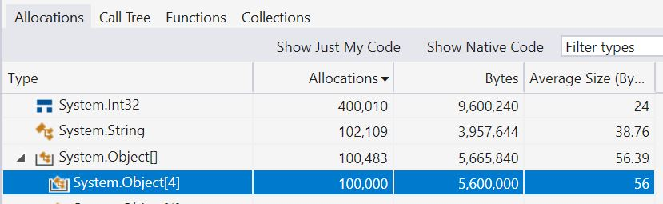

---
post_title: String Interpolation in C# 10 and .NET 6
username: stoub@microsoft.com
microsoft_alias: stoub@microsoft.com
categories: .NET
desired_publication_date: 08/10/2021
summary: All about interpolated string handlers in C# 10 and .NET 6
---

Text processing is at the heart of huge numbers of apps and services, and in .NET, that means lots and lots of `System.String`.  `String` creation is so fundamental that a myriad of ways of doing so have existed since .NET Framework 1.0 was released, and more have joined the fray since.  Whether via `String`'s constructors, or `StringBuilder`, or `ToString` overrides, or helper methods on `String` like `Join` or `Concat` or `Create` or `Replace`, APIs to create strings are ubiquitous. One of the most powerful APIs for creating strings in .NET, however, is `String.Format`.

The `String.Format` method has a multitude of overloads, all of which share in common the ability to supply a "composite format string" and associated arguments.  That format string contains a mixture of literal text and placeholders, sometimes referred to as "format items" or "holes", which are then filled in with the supplied arguments by the formatting operation.  For example, `string.Format("Hello, {0}! How are you on this fine {1}?", name, DateTime.Now.DayOfWeek)`, given a name of `"Stephen"` and invoked on a Thursday, will output a string `"Hello, Stephen! How are you on this fine Thursday?"`.  Additional functionality is available, such as the ability to provide a format specifier, e.g. `string.Format("{0} in hex is 0x{0:X}", 12345)` will produce the string `"12345 in hex is 0x3039"`.

These capabilities all result in `String.Format` being a workhorse that powers a significant percentage of string creation.  In fact, it's so important and useful, C# language syntax was added in C# 6 to make it even more usable.  This "string interpolation" functionality enables developers to specify that a string is to be interpolated by placing a `$` character just before the string; then, rather than specifying arguments for the format items separately, those arguments can be embedded directly into the interpolated string.  For example, my earlier "Hello" example can now be written as `$"Hello, {name}! How are you on this fine {DateTime.Now.DayOfWeek}?"`, which will produce exactly the same string but via a more convenient syntax.

The C# compiler is free to generate whatever code it deems best for an interpolated string, as long as it ends up producing the same result, and today it has multiple mechanisms it might employ, depending on the situation.  If, for example, you were to write:
```C#
const string Greeting = "Hello";
const string Name = "Stephen";
string result = $"{Greeting}, {Name}!";
```
the C# compiler can see that all portions of the interpolated string are string literals, and it can emit this into IL as if it had been written as a single string literal:
```C#
string result = "Hello, Stephen!";
```
Or, for example, if you were to write:
```C#
public static string Greet(string greeting, string name) => $"{greeting}, {name}!";
```
the C# compiler can see that all of the format items are filled with strings, so it can generate a call to `String.Concat`:
```C#
public static string Greet(string greeting, string name) => string.Concat(greeting, ", ", name);
```
In the general case, however, the C# compiler emits a call to `String.Format`.  For example, if you were to write:
```C#
public static string DescribeAsHex(int value) => $"{value} in hex is 0x{value:X}";
```
the C# compiler will emit code similar to the `string.Format` call we saw earlier:
```C#
public static string DescribeAsHex(int value) => string.Format("{0} in hex is 0x{1:X}", value, value);
```
The constant string and `String.Concat` examples represent about as good an output as the compiler could hope for.  However, when it comes to all of the cases that end up needing `String.Format`, there are some limitations implied, in particular around performance but also functionality:
- Every time `String.Format` is called, it needs to parse the composite format string to find all the literal portions of the text, all of the format items, and their specifiers and alignments; somewhat ironically in the case of string interpolation, the C# compiler already had to do such parsing in order to parse the interpolated string and generate the `String.Format`, yet it has to be done again at run-time for each call.
- These APIs all accept arguments typed as `System.Object`, which means that any value types end up getting boxed in order to be passed in as an argument.
- There are `String.Format` overloads that accept up to three individual arguments, but for cases where more than three are needed, there's a catch-all overload that accepts a `params Object[]`.  That means any number of arguments more than three allocates an array.
- In order to extract the string representation to insert into a hole, the object argument's `ToString` method needs to be used, which not only involves virtual (`Object.ToString`) or interface (`IFormattable.ToString`) dispatch, it also allocates a temporary string.
- These mechanisms all share a functional limitation, which is that you can only use as format items things that can be passed as `System.Object`.  That prohibits the use of `ref struct`s, like `Span<char>` and `ReadOnlySpan<char>`.  More and more, these types are being used as a way of improving performance by being able to represent pieces of text in a non-allocating manner, whether as a sliced span from a larger string or as text formatted into stack-allocated space or into a reusable buffer, so it's unfortunate they can't then be used in these larger string construction operations.
- In addition to creating `System.String` instances, the C# language and compiler support targeting a `System.FormattableString`, which is effectively a tuple of the composite format string and `Object[]` arguments array that would have been passed to `String.Format`.  This enables the string interpolation syntax to be used for creating things other than `System.String`, as code can then take that `FormattableString` and its data and do something special with it; for example, the `FormattableString.Invariant` method accepts a `FormattableString` and will pass the data along with `CultureInfo.InvariantCulture` to `String.Format`, in order to perform the formatting using the invariant culture rather than the current culture.  While functionally useful, this adds even more expense, as all of these objects need to be created before anything is even done with them (and beyond the allocations, `FormattableString` adds its own costs, such as additional virtual method calls).

All of these issues and more are addressed by interpolated string handlers in C# 10 and .NET 6!

## Strings, But Faster

"Lowering" in a compiler is the process by which the compiler effectively rewrites some higher-level or more complicated construct in terms of simpler ones or better performing ones.  For example, when you `foreach` over an array:
```C#
int[] array = ...;
foreach (int i in array)
{
    Use(i);
}
```
rather than emitting that as use of the array's enumerator:
```C#
int[] array = ...;
using (IEnumerator<int> e = array.GetEnumerator())
{
    while (e.MoveNext())
    {
        Use(e.Current);
    }
}
```
the compiler emits it as if you'd used the array's indexer, iterating from 0 to its length:
```C#
int[] array = ...;
for (int i = 0; i < array.Length; i++)
{
    Use(array[i]);
}
```
as this results in the smallest and fastest code.

C# 10 addresses the afformentioned gaps in interpolated string support by allowing interpolated strings to not only be "lowered to" a constant string, a `String.Concat` call, or a `String.Format` call, but now also to a series of appends to a builder, similar in concept to how you might use a `StringBuilder` today to make a series of `Append` calls and finally extract the built string.  These builders are called "interpolated string handlers", and .NET 6 includes the following `System.Runtime.CompilerServices` handler type for direct use by the compiler:
```C#
namespace System.Runtime.CompilerServices
{
    [InterpolatedStringHandler]
    public ref struct DefaultInterpolatedStringHandler
    {
        public DefaultInterpolatedStringHandler(int literalLength, int formattedCount);
        public DefaultInterpolatedStringHandler(int literalLength, int formattedCount, System.IFormatProvider? provider);
        public DefaultInterpolatedStringHandler(int literalLength, int formattedCount, System.IFormatProvider? provider, System.Span<char> initialBuffer);
        
        public void AppendLiteral(string value);
        
        public void AppendFormatted<T>(T value);
        public void AppendFormatted<T>(T value, string? format);
        public void AppendFormatted<T>(T value, int alignment);
        public void AppendFormatted<T>(T value, int alignment, string? format);

        public void AppendFormatted(ReadOnlySpan<char> value);
        public void AppendFormatted(ReadOnlySpan<char> value, int alignment = 0, string? format = null);
        
        public void AppendFormatted(string? value);
        public void AppendFormatted(string? value, int alignment = 0, string? format = null);
        public void AppendFormatted(object? value, int alignment = 0, string? format = null);
        
        public string ToStringAndClear();
    }
}
```
As an example of how this ends up being used, consider this method:
```C#
public static string FormatVersion(int major, int minor, int build, int revision) =>
    $"{major}.{minor}.{build}.{revision}";
```
Prior to C# 10, this would have produced code equivalent to the following:
```C#
public static string FormatVersion(int major, int minor, int build, int revision)
{
    var array = new object[4];
    array[0] = major;
    array[1] = minor;
    array[2] = build;
    array[3] = revision;
    return string.Format("{0}.{1}.{2}.{3}", array);
}
```
We can visualize some of the aforementioned costs here by looking at this under an allocation profiler.  Here I'll use the .NET Object Allocation Tracking tool in the Performance Profiler in Visual Studio.  Profiling this program:
```C#
for (int i = 0; i < 100_000; i++)
{
    FormatVersion(1, 2, 3, 4);
}

public static string FormatVersion(int major, int minor, int build, int revision) =>
    $"{major}.{minor}.{build}.{revision}";
```
yields:



highlighting that we're boxing all four integers and allocating an object[] array to store them, in addition to the resulting string we expect to see here.

Now with C# 10 targeting .NET 6, the compiler instead produces code equivalent to this:
```C#
public static string FormatVersion(int major, int minor, int build, int revision)
{
    var handler = new DefaultInterpolatedStringHandler(literalLength: 3, formattedCount: 4);
    handler.AppendFormatted(major);
    handler.AppendLiteral(".");
    handler.AppendFormatted(minor);
    handler.AppendLiteral(".");
    handler.AppendFormatted(build);
    handler.AppendLiteral(".");
    handler.AppendFormatted(revision);
    return handler.ToStringAndClear();
}
```
Now in the profiler, we see only:


with the boxing and array allocation eliminated.

What's going on here? The compiler:
- Constructs a `DefaultInterpolatedStringHandler`, passing in two values: the number of characters in the literal portions of the interpolated string, and the number of holes in the string.  The handler can use this information to do a variety of things, such as guessing at how much space will be needed for the whole formatting operation and renting an initial buffer from `ArrayPool<char>.Shared` large enough to accomodate that.
- Issues a series of calls to append the portions of the interpolated string, calling `AppendLiteral` for the constant portions of the string, and calling one of the `AppendFormatted` overloads for the format items.
- Issues a call to the handler's `ToStringAndClear` method to extract the built string (and return any `ArrayPool<char>.Shared` resources to the pool).

If we look back at our earlier list of concerns with `string.Format`, we can see here how various concerns are addressed:
- There's no more composite format string to be parsed at run-time: the compiler has parsed the string at compile time, and generated the appropriate sequence of calls to build up the result.
- The handler exposes a generic `AppendFormatted<T>` method, so value types will no longer be boxed in order to be appended.  That has knock-on benefits as well; for example, if T is a value type, the code inside `AppendFormatted<T>` will be specialized for that particular value type, which means any interface checks or virtual/interface dispatch performed by that method can be devirtualized and potentially even inlined. (Over the years, we've considered adding generic `String.Format` overloads, e.g. `Format<T1, T2>(string format, T1 arg, T2 arg)`, to help avoid the boxing, but such an approach can also lead to code bloat as each call site with a unique set of generic value type arguments will result in a generic specialization being created.  While we may still choose to do so in the future, this approach limits such bloat by only needing one specialization of `AppendFormatted<T>` per T rather than per combination of all T1, T2, T3, etc. passed at that particular call site.)
- We're now making one `AppendFormatted` call per hole, so there's no longer an artificial cliff as to when we have to use and allocate an array to pass in more than a few arguments.
- The compiler will bind to any `AppendFormatted` method that accepts a compatible type as that of the data being formatted, so by exposing `AppendFormatted(ReadOnlySpan<char>)`, spans of chars can now be used in holes in interpolated strings.

What about the intermediate string allocations that might previously have resulted from calling `object.ToString` or `IFormattable.ToString` on the format items?  .NET 6 now exposes a new interface, `ISpanFormattable` (this interface was previously internal), which is implemented on many types in the core libraries:
```C#
public interface ISpanFormattable : IFormattable
{
    bool TryFormat(Span<char> destination, out int charsWritten, ReadOnlySpan<char> format, IFormatProvider? provider);
}
```
The generic `AppendFormatted<T>` overloads on `DefaultInterpolatedStringHandler` check to see whether the `T` implements this interface, and if it does, it uses it to format not into a temporary `System.String` but instead directly into the buffer backing the handler.  On value type `T`s, because of generic specialization performed by the backend compiler, a check for this interface can also be performed when the assembly code is compiled, so there's no interface dispatch for such types.

We can see an example of the performance impact of this by running a simple benchmark:
```C#
using BenchmarkDotNet.Attributes;
using BenchmarkDotNet.Running;
using System.Runtime.CompilerServices;

[MemoryDiagnoser]
public class Program
{
    static void Main(string[] args) => BenchmarkSwitcher.FromAssemblies(new[] { typeof(Program).Assembly }).Run(args);

    private int major = 6, minor = 0, build = 100, revision = 7;

    [Benchmark(Baseline = true)]
    public string Old()
    {
        var array = new object[4];
        array[0] = major;
        array[1] = minor;
        array[2] = build;
        array[3] = revision;
        return string.Format("{0}.{1}.{2}.{3}", array);
    }

    [Benchmark]
    public string New()
    {
        var builder = new DefaultInterpolatedStringHandler(3, 4);
        builder.AppendFormatted(major);
        builder.AppendLiteral(".");
        builder.AppendFormatted(minor);
        builder.AppendLiteral(".");
        builder.AppendFormatted(build);
        builder.AppendLiteral(".");
        builder.AppendFormatted(revision);
        return builder.ToStringAndClear();
    }
}
```
On my machine, this produces:

| Method |      Mean | Ratio | Allocated |
|------- |----------:|------:|----------:|
|    Old | 111.70 ns |  1.00 |     192 B |
|    New |  66.75 ns |  0.60 |      40 B |

showing that simply recompiling yields a 40% throughput improvement and an almost 5x reduction in memory allocation.  But, we can do better...

The C# compiler doesn't just know how to use a `DefaultInterpolatedStringHandler` implicitly in the lowering of an interpolated string.  It also knows how to "target-type" (meaning to choose what to do based on what something is being assigned to) an interpolated string to an "interpolated string handler", a type that implements a particular pattern the compiler knows about, and `DefaultInterpolatedStringHandler` implements that pattern.  This means that a method can have a `DefaultInterpolatedStringHandler` parameter, and when an interpolated string is passed as the argument to that parameter, the compiler will generate the same construction and append calls to create and populate that handler prior to passing the handler to the method.  On top of that, the method can use the `[InterpolatedStringHandlerArgument(...)]` attribute to get the compiler to pass other arguments into the handler's constructor, if an appropriate constructor is provided.  As shown earlier, `DefaultInterpolatedStringHandler` actually exposes two additional constructors beyond the ones already used in our examples, one that also accepts an `IFormatProvider?` used to control how formatting is accomplished, and one that further accepts a `Span<char>` that can be used as scratch space by the formatting operation (this scratch space is typically either stack-allocated or comes from some reusable array buffer easily accessed) rather than always requiring the handler to rent from the `ArrayPool`.  That means we can write a helper method like this:
```C#
public static string Create(
    IFormatProvider? provider,
    Span<char> initialBuffer,
    [InterpolatedStringHandlerArgument("provider", "initialBuffer")] ref DefaultInterpolatedStringHandler handler) =>
    handler.ToStringAndClear();
```
This method and its lack of much implementation might look a little strange... that's because most of the work involved is actually happening at the call site.  When you write:
```C#
public static string FormatVersion(int major, int minor, int build, int revision) =>
    Create(null, stackalloc char[64], $"{major}.{minor}.{build}.{revision}");
```
the compiler lowers that to the equivalent of:
```C#
public static string FormatVersion(int major, int minor, int build, int revision)
{
    Span<char> span = stackalloc char[64];
    var handler = new DefaultInterpolatedStringHandler(3, 4, null, span);
    handler.AppendFormatted(major);
    handler.AppendLiteral(".");
    handler.AppendFormatted(minor);
    handler.AppendLiteral(".");
    handler.AppendFormatted(build);
    handler.AppendLiteral(".");
    handler.AppendFormatted(revision);
    return Create(null, span, ref handler);
}
```
Now that we can start with stack-allocated buffer space and, in this example, won't ever need to rent from the `ArrayPool`, we get numbers like this:

|   Method |      Mean | Ratio | Allocated |
|--------- |----------:|------:|----------:|
|      Old | 109.93 ns |  1.00 |     192 B |
|      New |  69.95 ns |  0.64 |      40 B |
| NewStack |  48.57 ns |  0.44 |      40 B |

Of course, we're not encouraging everyone to author such a `Create` method on their own.  That method is actually exposed on `System.String` in .NET 6:
```C#
public sealed class String
{
    public static string Create(
        IFormatProvider? provider,
        [InterpolatedStringHandlerArgument("provider")] ref DefaultInterpolatedStringHandler handler);
        
    public static string Create(
        IFormatProvider? provider,
        Span<char> initialBuffer,
        [InterpolatedStringHandlerArgument("provider", "initialBuffer")] ref DefaultInterpolatedStringHandler handler);
}
```
so we can instead write our example without needing any custom helper:
```C#
public static string FormatVersion(int major, int minor, int build, int revision) =>
    string.Create(null, stackalloc char[64], $"{major}.{minor}.{build}.{revision}");
```

What about that `IFormatProvider?` argument?  `DefaultInterpolatedStringHandler` is able to thread that argument through to the `AppendFormatted` calls, which means these `string.Create` overloads provide a direct (and much better performing) alternative to `FormattableString.Invariant`.  Let's say we wanted to use the invariant culture with our formatting example.  Previously we could write:
```C#
public static string FormatVersion(int major, int minor, int build, int revision) =>
    FormattableString.Invariant($"{major}.{minor}.{build}.{revision}");
```
and now we can write:
```C#
public static string FormatVersion(int major, int minor, int build, int revision) =>
    string.Create(CultureInfo.InvariantCulture, $"{major}.{minor}.{build}.{revision}");
```
or if we want to use some initial buffer space as well:
```C#
public static string FormatVersion(int major, int minor, int build, int revision) =>
    string.Create(CultureInfo.InvariantCulture, stackalloc char[64], $"{major}.{minor}.{build}.{revision}");
```

The performance difference here is even more stark:

| Method |      Mean | Ratio | Allocated |
|------- |----------:|------:|----------:|
|    Old | 124.94 ns |  1.00 |     224 B |
|    New |  48.19 ns |  0.39 |      40 B |

Of course, much more than just `CultureInfo.InvariantCulture` can be passed in.  `DefaultInterpolatedStringHandler` supports the same interfaces on the supplied `IFormatProvider` as does `String.Format`, so even implementations that supply an `ICustomFormatter` may be used. Let's say I wanted to change my example to print all of the integer values in hex rather than in decimal.  We can achieve that using format specifiers, e.g.
```C#
public static string FormatVersion(int major, int minor, int build, int revision) =>
    $"{major:X}.{minor:X}.{build:X}.{revision:X}";
```
Now that format specifiers are provided, the compiler looks not for an `AppendFormatted` method that can take just the `Int32` value, it instead looks for one that can take both the `Int32` value to be formatted as well as a string format specifier.  Such an overload does exist on `DefaultInterpolatedStringHandler`, so we end up with this code generated:
```C#
public static string FormatVersion(int major, int minor, int build, int revision)
{
    var handler = new DefaultInterpolatedStringHandler(3, 4);
    handler.AppendFormatted(major, "X");
    handler.AppendLiteral(".");
    handler.AppendFormatted(minor, "X");
    handler.AppendLiteral(".");
    handler.AppendFormatted(build, "X");
    handler.AppendLiteral(".");
    handler.AppendFormatted(revision, "X");
    return handler.ToStringAndClear();
}
```
Again, we see here that the compiler handled up front not only the parsing of the composite format string into the individual series of `Append` calls, but it also parsed out the format specifier to be passed as an argument to `AppendFormatted`. But, what if, just for fun, we wanted to output the components in, say, binary rather than in hex?  There's no format specifier that yields a binary representation of an `Int32`.  Does that mean we can no longer use interpolated string syntax?  Nope.  We can write a little `ICustomFormatter` implementation:
```C#
private sealed class ExampleCustomFormatter : IFormatProvider, ICustomFormatter
{
    public object? GetFormat(Type? formatType) => formatType == typeof(ICustomFormatter) ? this : null;

    public string Format(string? format, object? arg, IFormatProvider? formatProvider) =>
        format == "B" && arg is int i ? Convert.ToString(i, 2) :
        arg is IFormattable formattable ? formattable.ToString(format, formatProvider) :
        arg?.ToString() ??
        string.Empty;
}  
```
and pass that to `String.Create`:
```C#
public static string FormatVersion(int major, int minor, int build, int revision) =>
    string.Create(new ExampleCustomFormatter(), $"{major:B}.{minor:B}.{build:B}.{revision:B}");
```
Neat.

### A Note On Overloads

One interesting thing to note are the `AppendFormatted` overloads exposed on the handler.  The first four are all generic and accomodate the vast majority of inputs developers can pass as format items.
```C#
public void AppendFormatted<T>(T value);
public void AppendFormatted<T>(T value, string? format);
public void AppendFormatted<T>(T value, int alignment);
public void AppendFormatted<T>(T value, int alignment, string? format);
```
Given an `int value`, for example, these overloads enable format items like these:
```C#
$"{value}" // formats value with its default formatting
$"{value:X2}" // formats value as a two-digit hexademical value
$"{value,-3}" // formats value consuming a minimum of three characters, left-aligned
$"{value,8:C}" // formats value as currency consuming a minimum of eight characters, right-aligned
```
We could have enabled all of those just with the longest overload, if we made the alignment and format arguments optional; the compiler uses normal overload resolution to determine which `AppendFormatted` to bind to, and thus if we only had `AppendFormatted<T>(T value, int alignment, string? format)`, it would work fine.  However, there are two reasons we didn't do that.  First, optional parameters end up baking the default values as arguments into the IL, which makes the call sites larger, and given how frequently interpolated strings are used, we wanted to minimize the call site code size as much as possible.  Second, their are code quality benefits in some cases, in that when the implementation of these methods can assume the defaults for `format` and `alignment`, the resulting code can be more streamlined.  So, for the generic overloads that represent the majority case for the arguments used in interpolated strings, we added all four combinations.

There are of course some things that today can't be represented as generics, the most prominent being `ref structs`.  Given the prominence and importance of `Span<char>` and `ReadOnlySpan<char>` (the former of which is implicitly convertible to the latter), the handler also exposes these overloads:
```C#
public void AppendFormatted(ReadOnlySpan<char> value);
public void AppendFormatted(ReadOnlySpan<char> value, int alignment = 0, string? format = null);
```
Given a `ReadOnlySpan<char> span = "hi there".Slice(0, 2);`, these overloads enable format items like these:
```C#
$"{span}" // outputs the contents of the span
$"{span,4}" // outputs the contents of the span consuming a minimum of four characters, right-aligned
```
The latter of those could have been enabled by an `AppendFormatted` method that only took alignment, but passing an alignment is relatively uncommon, so we decided to just have the one overload that could take both alignment and format.  The `format` with a span is ignored, but not having this overload could result in the compiler issuing an error in some cases, and so for consistency it's available.

That brings us to:
```C#
public void AppendFormatted(object? value, int alignment = 0, string? format = null);
```
Why have an `object`-based overload when we have a generic?  It turns out there are some situations where the compiler is unable to determine a best type to use for the generic and thus would fail to bind if only the generic were offered.  You can see this if you tried to write a method like this:
```C#
public static T M<T>(bool b) => b ? 1 : null; // error
```
which would fail to compile because the compiler is currently unable to determine a type to use to represent the result of that ternary.  However, if we instead write it as:
```C#
public static object M(bool b) => b ? 1 : null; // ok
```
that compiles successfully, because both 1 and null can be converted to the target type of `object`.  Thus, we expose an `AppendFormatted` overload for `object` to handle these corner cases where the type of the generic can't be determined.  But, these cases are sufficiently rare, that we only added the longest overload, with optional parameters, to use as the fallback.

Interestingly, this then produces a problem if you try to pass a string with an alignment and a format.  At that point the compiler has to choose between the `T`, `object`, and `ReadOnlySpan<char>`, and `string` is implicitly convertible to both `object` (it derives from `object`) and `ReadOnlySpan<char>` (there's an implicit cast operation defined), which makes this ambiguous.  To resolve that amiguity, we added the `string` overload that takes optional alignment and format.  We also added the overload that takes just a `string` both because strings are incredibly common as format items and we can provide an implementation optimized specifically for string.
```C#
public void AppendFormatted(string? value);
public void AppendFormatted(string? value, int alignment = 0, string? format = null);
```

## Interpolating into Spans

Thus far, we've seen how creating strings with string interpolation in C# gets faster and more memory efficient, and we've seen how we exert some control over that string interpolation via `String.Create`.  What we haven't yet seen is that the new C# string interpolation support goes well beyond creating new string instances.  Instead, it now provides general support for using the string interpolation syntax to format into arbitrary targets.

One of the more interesting and impactful advances in .NET in recent years has been the proliferation of spans.  When it comes to text, `ReadOnlySpan<char>` and `Span<char>` have enabled significant improvements in the performance of text processing.  And formatting is a key piece of that... case in point, many types in .NET now have `TryFormat` methods for outputting a char-based representation into a destination buffer rather than using `ToString` to do the equivalent into a new string instance.  This will become even more prevalent now that the `ISpanFormattable` interface with its `TryFormat` method is public.

So, let's say I'm implementing my own type, `Point`, and I want to implement `ISpanFormattable`:
```C#
public readonly struct Point : ISpanFormattable
{
    public readonly int X, Y;
    
    public static bool TryFormat(Span<char> destination, out int charsWritten, ReadOnlySpan<char> format, IFormatProvider? provider)
    {
        ...
    }
}
```
How do I implement that `TryFormat` method?  I could do so by formatting each component, slicing spans as I go, and in general doing everything manually, e.g.
```C#
public bool TryFormat(Span<char> destination, out int charsWritten, ReadOnlySpan<char> format, IFormatProvider? provider)
{
    charsWritten = 0;
    int tmpCharsWritten = 0;

    if (!X.TryFormat(destination, out int tmpCharsWritten, default, provider))
    {
        return false;
    }
    destination = destination.Slice(tmpCharsWritten);

    if (destination.Length < 2)
    {
        return false;
    }
    ", ".AsSpan().CopyTo(destination);
    tmpCharsWritten += 2;
    destination = destination.Slice(2);

    if (!Y.TryFormat(destination, out int tmp, default, provider))
    {
        return false;
    }
    charsWritten = tmp + tmpCharsWritten;
    return true;
}
```
and that's fine, albeit a non-trivial amount of code. It's a shame I couldn't just use the simple string interpolation syntax to express my intent and have the compiler generate logically equivalent code for me, e.g.
```C#
public bool TryFormat(Span<char> destination, out int charsWritten, ReadOnlySpan<char> format, IFormatProvider? provider) =>
    destination.TryWrite(provider, $"{X}, {Y}", out charsWritten);
```
In fact, you can.  With C# 10 and .NET 6, the above will "just work", thanks to the compiler's support for custom interpolated string handlers.

.NET 6 contains the following new extension methods on the `MemoryExtensions` class:
```C#
public static bool TryWrite(
    this System.Span<char> destination,
    [InterpolatedStringHandlerArgument("destination")] ref TryWriteInterpolatedStringHandler handler,
    out int charsWritten);
    
public static bool TryWrite(
    this System.Span<char> destination,
    IFormatProvider? provider,
    [InterpolatedStringHandlerArgument("destination", "provider")] ref TryWriteInterpolatedStringHandler handler,
    out int charsWritten);
```
The structure of these methods should now look familiar, taking a "handler" as a parameter that's attributed with an `[InterpolatedStringHandlerArgument]` attribute referring to other parameters in the signature.  This `TryWriteInterpolatedStringHandler` is a type designed to meet the compiler's requirements for what an interpolated string handler looks like, in particular:
- It needs to be attributed with `[InterpolatedStringHandler]`.
- It needs to have a constructor that takes two parameters, one that's an `int literalLength` and one that's a `int formattedCount`.  If the handler parameter has an `InterpolatedStringHandlerArgument` attribute, then the constructor also needs to have a parameter for each of the named arguments in that attribute, of the appropriate types and in the right order. The constructor may also optionally have an `out bool` as its last parameter (more on that in a moment).
- It needs to have an `AppendLiteral(string)` method, and it needs to have an `AppendFormatted` method that supports every format item type passed in the interpolated string.  These methods may be void-returning or optionally bool-returning (again, more on that in a moment).

As a result, this `TryWriteInterpolatedStringHandler` type ends up having a shape very similar to that of the `DefaultInterpolatedStringHandler`:
```C#
[InterpolatedStringHandler]
public ref struct TryWriteInterpolatedStringHandler
{
    public TryWriteInterpolatedStringHandler(int literalLength, int formattedCount, Span<char> destination, out bool success);
    public TryWriteInterpolatedStringHandler(int literalLength, int formattedCount, Span<char> destination, IFormatProvider? provider, out bool success);
    
    public bool AppendLiteral(string value);

    public bool AppendFormatted<T>(T value);
    public bool AppendFormatted<T>(T value, string? format);
    public bool AppendFormatted<T>(T value, int alignment);
    public bool AppendFormatted<T>(T value, int alignment, string? format);
    
    public bool AppendFormatted(ReadOnlySpan<char> value);
    public bool AppendFormatted(ReadOnlySpan<char> value, int alignment = 0, string? format = null);

    public bool AppendFormatted(object? value, int alignment = 0, string? format = null);
    
    public bool AppendFormatted(string? value);
    public bool AppendFormatted(string? value, int alignment = 0, string? format = null);
}
```
With that type, a call like the previously shown:
```C#
public bool TryFormat(Span<char> destination, out int charsWritten, ReadOnlySpan<char> format, IFormatProvider? provider) =>
    destination.TryWrite(provider, $"{X}, {Y}", out charsWritten);
```
will end up getting lowered to code like the following:
```C#
public bool TryFormat(Span<char> destination, out int charsWritten, ReadOnlySpan<char> format, IFormatProvider? provider)
{
    var handler = new TryWriteInterpolatedStringHandler(2, 2, destination, provider, out bool success);
    _ = success &&
        handler.AppendFormatted(X) &&
        handler.AppendLiteral(", ") &&
        handler.AppendFormatted(Y);
    return destination.TryWrite(provider, ref handler, out charsWritten);
}
```
There are some really interesting things happening here.  First, we see the `out bool` from the `TryWriteInterpolatedStringHandler`'s constructor.  The compiler is using that `bool` to decide whether to make any of the subsequent `Append` calls: if the `bool` is false, it short-circuits and doesn't call any of them.  That's valuable in a situation like this because the constructor is passed both the `literalLength` and the `destination` span it'll be writing into.  If the constructor sees that the literal length is larger than the length of the destination span, it knows the interpolation can't possibly succeed (unlike `DefaultInterpolatedStringHandler` which can grow to arbitrary lengths, `TryWriteInterpolatedStringHandler` is given the user-provided span that must contain all the data written), so why bother doing any more work?  Of course, it's possible the literals would fit but the literals plus the formatted items would not.  So each `Append` method here also returns a `bool`, indicating whether the append operation succeeded, and if it didn't (because there was no more room), the compiler again is able to short-circuit all subsequent operations.  It's also important to note that this short-circuiting doesn't just avoid whatever work would have been done by the subsequent `Append` methods, it also avoids even evaluating the contents of the hole. Imagine if `X` and `Y` in these examples were expensive method invocations; this conditional evaluation means we can avoid work we know won't be useful.  Later in this post we'll see where the benefits of that really earn their keep.

Once all of the formatting has been done (or not done), the handler is passed to the original method the developer's code actually called.  That method's implementation then is responsible for any final work, in this case extracting from the handler how many characters were written and whether the operation was successful, and returning that to the caller.

## Interpolating into StringBuilders

`StringBuilder` has long been one of the main ways developers create `String`s, with a multitude of methods exposed for mutating the instance until the data is finally copied into an immutable `String`.  These methods include several `AppendFormat` overloads, e.g.
```C#
public StringBuilder AppendFormat(string format, params object?[] args);
```
which work just like `string.Format`, except writing the data to the `StringBuilder` rather than creating a new string.  Let's consider then a variant of our `FormatVersion` example from earlier, this time modified to append to the builder:
```C#
public static void AppendVersion(StringBuilder builder, int major, int minor, int build, int revision) =>
    builder.AppendFormat("{0}.{1}.{2}.{3}, major, minor, build, revision");
```
That works of course, but it has the exact same concerns we had initially with `string.Format`, so someone concerned with these intermediate costs (especially if they were pooling and reusing the `StringBuilder` instance) might choose to write it out by hand:
```C#
public static void AppendVersion(StringBuilder builder, int major, int minor, int build, int revision)
{
    builder.Append(major);
    builder.Append('.');
    builder.Append(minor);
    builder.Append('.');
    builder.Append(build);
    builder.Append('.');
    builder.Append(revision);
}
```
You can see where this is going.  .NET 6 now sports additional overloads on `StringBuilder`:
```C#
public StringBuilder Append([InterpolatedStringHandlerArgument("")] ref AppendInterpolatedStringHandler handler);
public StringBuilder Append(IFormatProvider? provider, [InterpolatedStringHandlerArgument("", "provider")] ref AppendInterpolatedStringHandler handler);

public  StringBuilder AppendLine([InterpolatedStringHandlerArgument("")] ref AppendInterpolatedStringHandler handler);
public  StringBuilder AppendLine(System.IFormatProvider? provider, [InterpolatedStringHandlerArgument("", "provider")] ref AppendInterpolatedStringHandler handler)
```
With those, we can rewrite our `AppendVersion` example, with the simplicity of interpolated strings but the general efficiency of the individual append calls:
```C#
public static void AppendVersion(StringBuilder builder, int major, int minor, int build, int revision) =>
    builder.Append($"{major}.{minor}.{build}.{revision}");
```
As we've seen, this will end up being translated by the compiler into individual append calls, each of which will append directly to the `StringBuilder` wrapped by the handler:
```C#
public static void AppendVersion(StringBuilder builder, int major, int minor, int build, int revision)
{
    var handler = new AppendInterpolatedStringHandler(3, 4, builder);
    handler.AppendFormatted(major);
    handler.AppendLiteral(".");
    handler.AppendFormatted(minor);
    handler.AppendLiteral(".");
    handler.AppendFormatted(build);
    handler.AppendLiteral(".");
    handler.AppendFormatted(revision);
    handler.Append(ref handler);
}
```
These new `StringBuilder` overloads have an additional benefit, which is that they are indeed overloads of the existing `Append` and `AppendLine` methods.  When passing a non-constant interpolated string to a method with multiple overloads, one that takes a string and one that takes a valid interpolated string handler, the compiler will prefer the overload with the handler.  That means, upon recompilation, any existing calls to `StringBuilder.Append` or `StringBuilder.AppendLine` that are currently being passed an interpolated string will now simply get better, appending all of the individual components directly to the builder, rather than first creating a temporary string which in turn is then appended to the builder.

## Debug.Assert Without The Overhead

One of the conundrums developers sometimes face with `Debug.Assert` is the desire to provide lots of useful details in the assert message, while also recognizing that such details should never actually be necessary; after all, the purpose of `Debug.Assert` is to notify you when something that should never happen has in fact happened.  String interpolation makes it easy to add lots of details to such a message:
```C#
Debug.Assert(validCertificate, $"Certificate: {GetCertificateDetails(cert)}");
```
but this also means it makes it easy to pay a lot of unnecessary cost that should never be required.  And while this is "only" for debug, this can have a profound impact on the performance of, for example, tests, with that overhead meaningfully detracting from a developer's productivity, increasing how much time and resources are spent on continuous integration, and so on.  Wouldn't it be nice if we could both have this nice syntax and also avoid having to pay any of these costs in the expected 100% case where they're not needed?

The answer, of course, is we now can.  Remember the conditionality of execution we saw earlier in the span example, where the handler was able to pass out a `bool` value to tell the compiler whether to short-circuit?  We take advantage of that with new overloads of `Assert` (and `WriteIf` and `WriteLineIf`) on `Debug`, e.g.
```C#
[Conditional("DEBUG")]
public static void Assert(
    [DoesNotReturnIf(false)] bool condition,
    [InterpolatedStringHandlerArgument("condition")] AssertInterpolatedStringHandler message);
```
Per my earlier comments, when `Debug.Assert` is called with an interpolated string argument, the compiler will now prefer this new overload over the one that takes `String`.  For a call like the one shown (`Debug.Assert(validCertificate, $"Certificate: {GetCertificateDetails(cert)}")`), the compiler will then generate code like the following:
```C#
var handler = new AssertInterpolatedStringHandler(13, 1, validCertificate, out bool shouldAppend);
if (shouldAppend)
{
    handler.AppendLiteral("Certificate: ");
    handler.AppendFormatted(GetCertificateDetails(cert));
}
Debug.Assert(validCertificate, handler);
```
Thus, the computation of `GetCertificateDetails(cert)` and the creation of the string won't happen at all if the handler's constructor sets `shouldAppend` to `false`, which it will do if the condition Boolean `validCertificate` passed in is `true`.  In this way, we avoid doing any of the expensive work for the assert unless it's about to fail.  Pretty cool.

This same technique is likely to be invaluable to additional APIs like those involved in logging, where for example you might only want to compute the message to be logged if the logging is currently enabled and has been set to a high enough logging level as to warrant this particular call taking effect.

### What's next?

This support is available as of .NET 6 Preview 7.  We would love your feedback on it, and in particular on where else you'd like to see support for custom handlers incorporated.  The most likely candidates would include places where the data is destined for something other than a string, or where the support for conditional execution would be a natural fit for the target method.

Happy coding!
