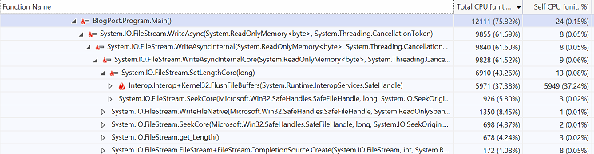
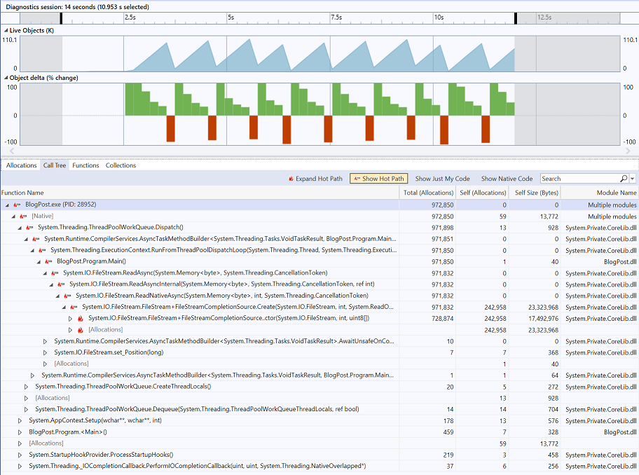
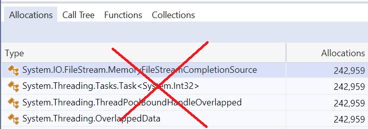

For .NET 6, we have made `FileStream` much faster and more reliable, thanks to an almost entire re-write. For same cases, the async implementation is now a few times faster!

We also recognized the need of having more high-performance file IO features: concurrent reads and writes, scatter/gather IO and introduced new APIs for them.

## TL;DR

> File I/O is better, stronger, faster! - [Rob Fahrni](https://twitter.com/Fahrni/status/1429848474112069632)

If you are not into details, please see [Summary](#Summary) for a short recap of what was changed.

## Introduction to FileStream

Before we deep dive into the details, we need to explain few concepts crucial to understanding what was changed. Let's first take a look at the two most flexible `FileStream` constructors and discuss their arguments:

```csharp
public FileStream(string path, FileMode mode, FileAccess access, FileShare share, int bufferSize, FileOptions options)
public FileStream(SafeFileHandle handle, FileAccess access, int bufferSize, bool isAsync)
```

* `path` is a relative or absolute path to a file. The file can be a:
  * Regular file (the most common use case).
  * Symbolic link - `FileStream` dereferences symbolic links and opens the target instead of the link itself.
  * Pipe or a socket - for which `CanSeek` returns `false`, while `Position` and `Seek()` just throw.
  * Character, block file and more.
* `handle` is a handle or file descriptor provided by the caller.
* `mode` is an enumeration that tells `FileStream` whether the given file should be opened, created, replaced, truncated or opened for appending.
* `access` specifies the intent: reading, writing, or both.
* `share` describes whether we want to have exclusive access to the file (`FileShare.None`), share it for reading, writing or even for deleting the file. If you have ever observed a "_file in use_" error, it means that someone opened the file first and locked it using this enumeration.
* `bufferSize` sets the size of the `FileStream` private buffer used for **buffering**. When a user requests a read of `n` bytes, and `n` is less than `bufferSize`, `FileStream` is going to try to fetch `bufferSize`-many bytes from the operating system, store them in its private buffer and return only the requested `n` bytes. The next read operation is going to return from the remaining buffered bytes and ask the OS for more, only if needed. This performance optimization allows `FileStream` to reduce the number of expensive sys-calls, as copying bytes is simply cheaper.
  * Buffering is also applied to all `Write*()` methods. That is why calling `Write*()` doesn't guarantee that the data is immediately saved to the file and we need to call `Flush*()` to flush the buffer. On top of that, every operating system implements buffering to reduce disk activity. So most of the sys-calls don't perform actual disk operations, but copy memory from user to kernel space. If we want to force the OS to flush the data to the disk, we need to call `Flush(flushToDisk: true)`.
  * **Buffering is enabled by default** (the default for `bufferSize` is 4096).
  * To **disable the `FileStream` buffering**, just pass `1` (works for every .NET) or `0` (works for .NET 6 preview 6+) as `bufferSize`. 
  * If you ever needed to disable the OS buffering in a .NET app, please provide your feedback in [#27408](https://github.com/dotnet/runtime/issues/27408) which would help us to prioritize the feature request.
* `isAsync` allows for controlling whether the file should be opened for asynchronous or synchronous IO. **The default value is `false`, which translates to synchronous IO**. If you open `FileStream` for synchronous IO, but later use any of its `*Async()` methods, they are going to perform synchronous IO (no cancellation support) on a `ThreadPool` thread which might not scale up as well as if the `FileStream` was opened for asynchronous IO. The opposite is also an issue on Windows: if you open `FileStream` for asynchronous IO, but call a synchronous method, it's going to start an asynchronous IO operation and **block waiting for it to complete**.
* `options` is a flags enumeration that supports further configuration of behaviors, including `isAsync`.

## Benchmarks

### Environment

We have used `FileStream` benchmarks from the [dotnet/performance repository](https://github.com/dotnet/performance/blob/main/src/benchmarks/micro/libraries/System.IO.FileSystem/Perf.FileStream.cs). The harness was obviously [BenchmarkDotNet](https://github.com/dotnet/BenchmarkDotNet) (version `0.13.1`). See the [full historical results from our lab](https://pvscmdupload.blob.core.windows.net/reports/allTestHistory/TestHistoryIndexIndex.html).

For the purpose of this blog post, we have run the benchmarks on  an `x64` machine (Intel Xeon CPU E5-1650, 1 CPU, 12 logical and 6 physical cores) with an SSD drive. The machine was configured for dual boot of Windows 10 (10.0.18363.1621) and Ubuntu 18.04. The results can't be used for absolute numbers comparison, as on Windows the disk encryption was enabled, using [BitLocker](https://docs.microsoft.com/windows/security/information-protection/bitlocker/bitlocker-overview). For the sake of simplicity we refer to Ubuntu results using term "Unix" as all non-Windows optimizations apply to all Unix-like Operating Systems.

### How to read the Results

Legend for reading the tables with benchmark results:
- options, share, fileSize, userBufferSize: Value of the `options|share|fileSize|userBufferSize` parameter.
- Mean: Arithmetic mean of all measurements.
- Ratio: Mean of the ratio distribution (in this case it's always [.NET 6]/[.NET 5]).
- Allocated: Allocated memory per single operation (managed only, inclusive, `1KB = 1024B`).
- 1 ns: 1 Nanosecond (0.000000001 sec).

|    Method |  Runtime | share |        Mean | Ratio |
|---------- |--------- |------ |------------:|------:|
| GetLength | .NET 5.0 |  Read | 1,932.00 ns |  1.00 |
| GetLength | .NET 6.0 |  Read |    58.52 ns |  0.03 |

For the table presented above, we can see that the `GetLength` benchmark was taking `1932 ns` to execute on average with .NET 5, and only `58.52 ns` with .NET 6. The ratio column tells us that .NET 6 was on average taking 3% of .NET 5 total time execution. We can also say that .NET 6 is 33 (`1.00 / 0.03`) times faster than .NET 5 for this particular benchmark and environment.

With that in mind, let's take a look at what we have changed.

## Performance improvements 

Based on feedback from our customers ([#16354](https://github.com/dotnet/runtime/issues/16354), [#25905](https://github.com/dotnet/runtime/issues/25905)) and some additional profiling with Visual Studio Profiler we have identified key CPU bottlenecks of the Windows implementation.



By using [Visual Studio Memory Profiler](https://docs.microsoft.com/visualstudio/profiling/memory-usage?view=vs-2019) we have tracked down all allocations:



### Seek and Position

After some decent amount of brainstorming, we got to the conclusion that all performance bottlenecks in `FileStream.ReadAsync()` and `FileStream.WriteAsync()` methods were caused by the fact that when `FileStream` was opened for asynchronous IO, it was synchronizing the file offset with  Windows for every asynchronous operation. A [blog post](https://docs.microsoft.com/archive/blogs/winserverperformance/designing-applications-for-high-performance-part-iii-2) from the Windows Server Performance Team calls the API that allows for doing that (`SetFilePointer()` method) an *anachronism*:

> The old DOS SetFilePointer API is an anachronism. One should specify the file offset in the overlapped structure even for synchronous I/O. It should never be necessary to resort to the hack of having private file handles for each thread.

We decided to stop doing that for seekable files and simply track the offset only in memory, and use sys-calls that always require us to provide the file offset in an explicit way. We have done that for both Windows and Unix implementation. We discuss this breaking change [later](#Tracking-file-offset-only-in-memory) in this post.

```csharp
[Benchmark]
[Arguments(OneKibibyte, FileOptions.None)]
[Arguments(OneKibibyte, FileOptions.Asynchronous)]
public void SeekForward(long fileSize, FileOptions options)
{
    string filePath = _sourceFilePaths[fileSize];
    using (FileStream fileStream = new FileStream(filePath, FileMode.Open, FileAccess.Read, FileShare.Read, FourKibibytes, options))
    {
        for (long offset = 0; offset < fileSize; offset++)
        {
            fileStream.Seek(offset, SeekOrigin.Begin);
        }
    }
}

[Benchmark]
[Arguments(OneKibibyte, FileOptions.None)]
[Arguments(OneKibibyte, FileOptions.Asynchronous)]
public void SeekBackward(long fileSize, FileOptions options)
{
    string filePath = _sourceFilePaths[fileSize];
    using (FileStream fileStream = new FileStream(filePath, FileMode.Open, FileAccess.Read, FileShare.Read, FourKibibytes, options))
    {
        for (long offset = -1; offset >= -fileSize; offset--)
        {
            fileStream.Seek(offset, SeekOrigin.End);
        }
    }
}
```

#### Windows

Since [FileStream.Seek()](https://docs.microsoft.com/dotnet/api/system.io.filestream.seek) and [FileStream.Position](https://docs.microsoft.com/dotnet/api/system.io.filestream.position) are no longer performing a sys-call, but just access the position stored in memory, we can observe an improvement from 10x to 100x.

|                 Method |  Runtime |  fileSize |      options |            Mean | Ratio |   Allocated |
|----------------------- |--------- |---------- |------------- |----------------:|------:|------------:|
|            SeekForward | .NET 5.0 |      1024 |         None |       580.88 μs |  1.00 |       168 B |
|            SeekForward | .NET 6.0 |      1024 |         None |        56.01 μs |  0.10 |       240 B |
|                        |          |           |              |                 |       |             |
|           SeekBackward | .NET 5.0 |      1024 |         None |     2,273.19 μs |  1.00 |       169 B |
|           SeekBackward | .NET 6.0 |      1024 |         None |        60.67 μs |  0.03 |       240 B |
|                        |          |           |              |                 |       |             |
|            SeekForward | .NET 5.0 |      1024 | Asynchronous |     2,623.50 μs |  1.00 |       200 B |
|            SeekForward | .NET 6.0 |      1024 | Asynchronous |        61.30 μs |  0.02 |       272 B |
|                        |          |           |              |                 |       |             |
|           SeekBackward | .NET 5.0 |      1024 | Asynchronous |     5,354.25 μs |  1.00 |       200 B |
|           SeekBackward | .NET 6.0 |      1024 | Asynchronous |        66.63 μs |  0.01 |       272 B |

The increased amount of allocated memory comes from the abstraction layer that we have [introduced](https://github.com/dotnet/runtime/pull/47128) to support the .NET 5 Compatibility mode, which also helped increase the code maintainability: we now have a few separate `FileStream` [strategy](https://en.wikipedia.org/wiki/Strategy_pattern) implementations instead of one with _a lot_ of `if` blocks.

#### Unix

Unix implementation is no longer performing the `lseek` sys-call and we can observe a very nice `x25` improvement for the `SeekForward` benchmark.

|                 Method |  Runtime |  fileSize |      options |             Mean | Ratio |   Allocated |
|----------------------- |--------- |---------- |------------- |-----------------:|------:|------------:|
|            SeekForward | .NET 5.0 |      1024 |         None |       447.915 μs |  1.00 |       161 B |
|            SeekForward | .NET 6.0 |      1024 |         None |        19.083 μs |  0.04 |       232 B |
|                        |          |           |              |                  |       |             |
|            SeekForward | .NET 5.0 |      1024 | Asynchronous |       453.645 μs |  1.00 |       281 B |
|            SeekForward | .NET 6.0 |      1024 | Asynchronous |        19.511 μs |  0.04 |       232 B |

There is no improvement for `SeekBackward` benchmark, which [uses](https://github.com/dotnet/performance/blob/686f552943ccef56e8404ed0a060fcc1e689a2a0/src/benchmarks/micro/libraries/System.IO.FileSystem/Perf.FileStream.cs#L117) `SeekOrigin.End` which requires the file length to be obtained. 

### Length

We have [noticed](https://github.com/dotnet/runtime/issues/49541) that when the file is opened for reading, we can cache the file length as long as it's not shared for writing (`FileShare.Write`). In such scenarios, nobody can write to the given file and file length can't change until the file is closed.

This change ([#49975](https://github.com/dotnet/runtime/pull/49975)) was included in .NET 6 Preview 4.

```csharp
[Benchmark(OperationsPerInvoke = OneKibibyte)]
[Arguments(FileShare.Read)]
[Arguments(FileShare.Write)]
public long GetLength(FileShare share)
{
    string filePath = _sourceFilePaths[OneKibibyte];
    using (FileStream fileStream = new FileStream(filePath, FileMode.Open, FileAccess.Read, share, FourKibibytes, FileOptions.None))
    {
        long length = 0;
        for (long i = 0; i < OneKibibyte; i++)
        {
            length = fileStream.Length;
        }
        return length;
    }
}
```
#### Windows

The first-time access have not changed, but every next call to [FileStream.Length](https://docs.microsoft.com/dotnet/api/system.io.filestream.length) can be even few dozens times faster.

|    Method |  Runtime | share |        Mean | Ratio |
|---------- |--------- |------ |------------:|------:|
| GetLength | .NET 5.0 |  Read | 1,932.00 ns |  1.00 |
| GetLength | .NET 6.0 |  Read |    58.52 ns |  0.03 |

Kudos to [@pentp](https://github.com/pentp) who made it also possible for `FileStream` opened with `FileShare.Delete` ([#56465](https://github.com/dotnet/runtime/pull/56465)).

#### Unix

In contrary to Windows, we can't cache file length on Unix-like operating systems where the file locking is only [advisory](https://en.wikipedia.org/wiki/File_locking#In_Unix-like_systems), and there is no guarantee that the file length won't be changed by others.

Speaking of file locking, in .NET 6 preview 7 we have [added](https://github.com/dotnet/runtime/pull/55256) a possibility to disable it on Unix. This can be done by using `System.IO.DisableFileLocking` app context switch or `DOTNET_SYSTEM_IO_DISABLEFILELOCKING` environment variable.

### WriteAsync

#### Windows

After [@benaadams](https://github.com/benaadams) reported [#25905](https://github.com/dotnet/runtime/issues/25905) we have very carefully studied the profiles and [WriteFile](https://docs.microsoft.com/windows/win32/api/fileapi/nf-fileapi-writefile) docs and got to the conclusion that we don't need to extend the file before performing every async write operation. `WriteFile()` extends the file if needed. 

In the past, we were doing that because we were thinking that `SetFilePointer` (Windows sys-call used to set file position) could not be pointing to a non-existing offset (`offset > endOfFile`). [Docs](https://docs.microsoft.com/windows/win32/api/fileapi/nf-fileapi-setfilepointer#remarks) helped us to invalidate that assumption:

> It is not an error to set a file pointer to a position beyond the end of the file. The size of the file does not increase until you call the SetEndOfFile, WriteFile, or WriteFileEx function. A write operation increases the size of the file to the file pointer position plus the size of the buffer written, which results in the intervening bytes uninitialized.

Some pseudocode to show the difference:

```csharp
public class FileStream
{
    long _position;
    SafeFileHandle _handle;

    async ValueTask WriteAsyncBefore(ReadOnlyMemory<byte> buffer)
    {
        long oldEndOfFile = GetFileLength(_handle); // 1st sys-call
        long newEndOfFile = _position + buffer.Length;

        if (newEndOfFile > oldEndOfFile) // this was true for EVERY write to an empty file
        {
            ExtendTheFile(_handle, newEndOfFile); // 2nd sys-call

            SetFilePosition(_handle, newEndOfFile); // 3rd sys-call
            _position += buffer.Length;
        }

        await WriteFile(_handle, buffer); // 4th sys-call
    }

    async ValueTask WriteAsyncAfter(ReadOnlyMemory<byte> buffer)
    {
        await WriteFile(_handle, buffer, _position); // the ONLY sys-call
        _position += buffer.Length;
    }
}
```

Once we had achieved a single sys-call per `WriteAsync` call, we worked on the memory aspect. In [#50802](https://github.com/dotnet/runtime/pull/50802) we have switched from `TaskCompletionSource` to [IValueTaskSource](https://devblogs.microsoft.com/dotnet/understanding-the-whys-whats-and-whens-of-valuetask/#implementing-ivaluetasksource-ivaluetasksourcetgt). By doing that, we were able to get rid of the `Task` allocation for `ValueTask`-returning method overloads. In [#51363](https://github.com/dotnet/runtime/pull/51363) we have started re-using `IValueTaskSource` instances and eliminated the task source allocation. In the very same PR we have also changed the ownership of `OverlappedData` ([#25074](https://github.com/dotnet/runtime/issues/25074)) and eliminated the remaining two most common allocations: `OverlappedData` and `ThreadPoolBoundHandleOverlapped`.



All aforementioned changes were included in .NET 6 Preview 4. Let's use the following benchmarks to measure the difference:

```csharp
[Benchmark]
[ArgumentsSource(nameof(AsyncArguments))]
public Task WriteAsync(long fileSize, int userBufferSize, FileOptions options)
    => WriteAsync(fileSize, userBufferSize, options, streamBufferSize: FourKibibytes);

[Benchmark]
[ArgumentsSource(nameof(AsyncArguments_NoBuffering))]
public Task WriteAsync_NoBuffering(long fileSize, int userBufferSize, FileOptions options)
    => WriteAsync(fileSize, userBufferSize, options, streamBufferSize: 1);

async Task WriteAsync(long fileSize, int userBufferSize, FileOptions options, int streamBufferSize)
{
    CancellationToken cancellationToken = CancellationToken.None;
    Memory<byte> userBuffer = new Memory<byte>(_userBuffers[userBufferSize]);

    using (FileStream fileStream = new FileStream(_destinationFilePaths[fileSize], FileMode.Create, FileAccess.Write, 
        FileShare.Read, streamBufferSize, options))
    {
        for (int i = 0; i < fileSize / userBufferSize; i++)
        {
            await fileStream.WriteAsync(userBuffer, cancellationToken);
        }
    }
}
```

|                 Method |  Runtime |  fileSize | userBufferSize |      options |            Mean | Ratio |   Allocated |
|----------------------- |--------- |---------- |--------------- |------------- |----------------:|------:|------------:|
|             WriteAsync | .NET 5.0 |      1024 |           1024 | Asynchronous |       433.01 μs |  1.00 |     4,650 B |
|             WriteAsync | .NET 6.0 |      1024 |           1024 | Asynchronous |       402.73 μs |  0.93 |     4,689 B |
|                        |          |           |                |              |                 |       |             |
|             WriteAsync | .NET 5.0 |   1048576 |            512 | Asynchronous |     9,140.81 μs |  1.00 |    41,608 B |
|             WriteAsync | .NET 6.0 |   1048576 |            512 | Asynchronous |     5,762.94 μs |  0.63 |     5,425 B |
|                        |          |           |                |              |                 |       |             |
|             WriteAsync | .NET 5.0 |   1048576 |           4096 | Asynchronous |    21,214.05 μs |  1.00 |    80,320 B |
|             WriteAsync | .NET 6.0 |   1048576 |           4096 | Asynchronous |     4,711.63 μs |  0.22 |       940 B |
|                        |          |           |                |              |                 |       |             |
| WriteAsync_NoBuffering | .NET 5.0 |   1048576 |          16384 | Asynchronous |     6,866.69 μs |  1.00 |    20,416 B |
| WriteAsync_NoBuffering | .NET 6.0 |   1048576 |          16384 | Asynchronous |     2,056.75 μs |  0.31 |       782 B |
|                        |          |           |                |              |                 |       |             |
|             WriteAsync | .NET 5.0 | 104857600 |           4096 | Asynchronous | 2,613,446.73 μs |  1.00 | 7,987,648 B |
|             WriteAsync | .NET 6.0 | 104857600 |           4096 | Asynchronous |   425,094.18 μs |  0.16 |     2,272 B |
|                        |          |           |                |              |                 |       |             |
| WriteAsync_NoBuffering | .NET 5.0 | 104857600 |          16384 | Asynchronous |   773,901.50 μs |  1.00 | 1,997,248 B |
| WriteAsync_NoBuffering | .NET 6.0 | 104857600 |          16384 | Asynchronous |   141,073.78 μs |  0.19 |     1,832 B |

As you can see, [FileStream.WriteAsync()](https://docs.microsoft.com/dotnet/api/system.io.filestream.writeasync) is now be up to few times faster!

#### Unix

Unix-like systems don't expose async file IO APIs (except of the new `io_uring` which we talk about [later](#Whats-Next)). Anytime user asks `FileStream` to perform async file IO operation, a synchronous IO operation is being scheduled to Thread Pool. Once it's dequeued, the blocking operation is performed on a dedicated thread.

In case of `WriteAsync`, Unix implementation was already performing a single sys-call per invocation. But it does not mean that there was no place for other improvements! In [#55123](https://github.com/dotnet/runtime/pull/55123) the amazing [@teo-tsirpanis](https://github.com/teo-tsirpanis) has combined the concept of [IValueTaskSource](https://devblogs.microsoft.com/dotnet/understanding-the-whys-whats-and-whens-of-valuetask/#implementing-ivaluetasksource-ivaluetasksourcetgt) and [IThreadPoolWorkItem](https://docs.microsoft.com/dotnet/api/system.threading.ithreadpoolworkitem) into a single type. By implementing `IThreadPoolWorkItem` interface, the type gained the possibility of queueing itself on the Thread Pool (which normally requires an allocation of a `ThreadPoolWorkItem`). By re-using it, [@teo-tsirpanis](https://github.com/teo-tsirpanis) achieved amortized allocation-free file operations (per `SafeFileHandle`, when used non-concurrently). The optimization applied also to Windows implementation for synchronous file handles, but let's focus on the Unix results:

|                 Method |  Runtime |  fileSize | userBufferSize |      options |             Mean | Ratio |   Allocated |
|----------------------- |--------- |---------- |--------------- |------------- |-----------------:|------:|------------:|
|             WriteAsync | .NET 5.0 |      1024 |           1024 |         None |        53.002 μs |  1.00 |     4,728 B |
|             WriteAsync | .NET 6.0 |      1024 |           1024 |         None |        34.615 μs |  0.65 |     4,424 B |
|                        |          |           |                |              |                  |       |             |
|             WriteAsync | .NET 5.0 |      1024 |           1024 | Asynchronous |        34.020 μs |  1.00 |     4,400 B |
|             WriteAsync | .NET 6.0 |      1024 |           1024 | Asynchronous |        33.699 μs |  0.99 |     4,424 B |
|                        |          |           |                |              |                  |       |             |
|             WriteAsync | .NET 5.0 |   1048576 |            512 |         None |     5,531.106 μs |  1.00 |   234,004 B |
|             WriteAsync | .NET 6.0 |   1048576 |            512 |         None |     2,133.012 μs |  0.39 |     5,002 B |
|                        |          |           |                |              |                  |       |             |
|             WriteAsync | .NET 5.0 |   1048576 |            512 | Asynchronous |     2,447.687 μs |  1.00 |    33,211 B |
|             WriteAsync | .NET 6.0 |   1048576 |            512 | Asynchronous |     2,121.449 μs |  0.87 |     5,009 B |
|                        |          |           |                |              |                  |       |             |
|             WriteAsync | .NET 5.0 |   1048576 |           4096 |         None |     2,296.017 μs |  1.00 |    29,170 B |
|             WriteAsync | .NET 6.0 |   1048576 |           4096 |         None |     1,889.585 μs |  0.83 |       712 B |
|                        |          |           |                |              |                  |       |             |
|             WriteAsync | .NET 5.0 |   1048576 |           4096 | Asynchronous |     2,024.704 μs |  1.00 |    18,986 B |
|             WriteAsync | .NET 6.0 |   1048576 |           4096 | Asynchronous |     1,897.600 μs |  0.94 |       712 B |
|                        |          |           |                |              |                  |       |             |
| WriteAsync_NoBuffering | .NET 5.0 |   1048576 |          16384 |         None |     1,659.638 μs |  1.00 |     7,666 B |
| WriteAsync_NoBuffering | .NET 6.0 |   1048576 |          16384 |         None |     1,519.658 μs |  0.92 |       558 B |
|                        |          |           |                |              |                  |       |             |
| WriteAsync_NoBuffering | .NET 5.0 |   1048576 |          16384 | Asynchronous |     1,634.240 μs |  1.00 |     7,698 B |
| WriteAsync_NoBuffering | .NET 6.0 |   1048576 |          16384 | Asynchronous |     1,503.478 μs |  0.92 |       558 B |
|                        |          |           |                |              |                  |       |             |
|             WriteAsync | .NET 5.0 | 104857600 |           4096 |         None |   152,306.164 μs |  1.00 | 2,867,840 B |
|             WriteAsync | .NET 6.0 | 104857600 |           4096 |         None |   141,986.988 μs |  0.93 |     1,256 B |
|                        |          |           |                |              |                  |       |             |
|             WriteAsync | .NET 5.0 | 104857600 |           4096 | Asynchronous |   149,759.617 μs |  1.00 | 1,438,392 B |
|             WriteAsync | .NET 6.0 | 104857600 |           4096 | Asynchronous |   147,565.278 μs |  0.99 |     1,064 B |
|                        |          |           |                |              |                  |       |             |
| WriteAsync_NoBuffering | .NET 5.0 | 104857600 |          16384 |         None |   122,106.778 μs |  1.00 |   717,584 B |
| WriteAsync_NoBuffering | .NET 6.0 | 104857600 |          16384 |         None |   114,989.749 μs |  0.94 |     1,392 B |
|                        |          |           |                |              |                  |       |             |
| WriteAsync_NoBuffering | .NET 5.0 | 104857600 |          16384 | Asynchronous |   117,631.183 μs |  1.00 |   717,472 B |
| WriteAsync_NoBuffering | .NET 6.0 | 104857600 |          16384 | Asynchronous |   113,781.015 μs |  0.97 |     1,392 B |

In the benchmark where we take advantage of `FileStream` buffering (`fileSize==1048576 && userBufferSize==512`) we can observe some additional memory allocation improvements that come from [#56095](https://github.com/dotnet/runtime/pull/56095) where we started to pool the async method builder by just annotating async methods with  [PoolingAsyncValueTaskMethodBuilder](https://github.com/dotnet/runtime/issues/49903) attributes that have been introduced in .NET 6.

```csharp
[AsyncMethodBuilder(typeof(PoolingAsyncValueTaskMethodBuilder<>))]
async ValueTask<int> ReadAsync(Task semaphoreLockTask, Memory<byte> buffer, CancellationToken cancellationToken)

[AsyncMethodBuilder(typeof(PoolingAsyncValueTaskMethodBuilder))]
async ValueTask WriteAsync(Task semaphoreLockTask, ReadOnlyMemory<byte> source, CancellationToken cancellationToken)
```

### ReadAsync

#### Windows

Initially, [FileStream.ReadAsync()](https://docs.microsoft.com/dotnet/api/system.io.filestream.readasync) has benefited a lot from file length caching and lack of file offset synchronization (.NET 6 preview 4). But since length can't be cached for files opened with `FileAccess.ReadWrite` or `FileShare.Write`, we have decided to also limit it to a single sys-call (`ReadFile`). After [#56531](https://github.com/dotnet/runtime/pull/56531) got merged (.NET 6 Preview 7), `ReadAsync` ensures that the position is correct after the operation finishes. Without fetching file length before the read operation starts. Some pseudocode:

```csharp
public class FileStream
{
    long _position;
    SafeFileHandle _handle;

    async ValueTask<int> ReadAsyncBefore(Memory<byte> buffer)
    {
        long fileOffset = _position;
        long endOfFile = GetFileLength(_handle); // 1st sys-call

        if (fileOffset + buffer.Length > endOfFile) // read beyond EOF
        {
            buffer = buffer.Slice(0, endOfFile - fileOffset);
        }

        _position = SetFilePosition(_handle, fileOffset + buffer.Length); // 2nd sys-call

        await ReadFile(_handle, buffer); // 3rd sys-call
    }

    async ValueTask<int> ReadAsyncBefore(Memory<byte> buffer)
    {
        int bytesRead = await ReadFile(_handle, buffer, _position); // the ONLY sys-call
        _position += bytesRead;

        return bytesRead;
    }
}
```

The reduced number of sys-calls and memory allocations (which were exactly the same as for `WriteAsync` described above) has clearly paid off for [FileStream.ReadAsync()](https://docs.microsoft.com/dotnet/api/system.io.filestream.readasync) which is now **up to few times faster**, depending on file size, user buffer size and `FileOptions` used for the creation of `FileStream`:

```csharp
[Benchmark]
[ArgumentsSource(nameof(AsyncArguments))]
public Task<long> ReadAsync(long fileSize, int userBufferSize, FileOptions options)
    => ReadAsync(fileSize, userBufferSize, options, streamBufferSize: FourKibibytes);

[Benchmark]
[ArgumentsSource(nameof(AsyncArguments_NoBuffering))]
public Task<long> ReadAsync_NoBuffering(long fileSize, int userBufferSize, FileOptions options)
    => ReadAsync(fileSize, userBufferSize, options, streamBufferSize: 1);

async Task<long> ReadAsync(long fileSize, int userBufferSize, FileOptions options, int streamBufferSize)
{
    CancellationToken cancellationToken = CancellationToken.None;
    Memory<byte> userBuffer = new Memory<byte>(_userBuffers[userBufferSize]);
    long bytesRead = 0;
    using (FileStream fileStream = new FileStream(_sourceFilePaths[fileSize], FileMode.Open, FileAccess.Read, FileShare.Read, streamBufferSize, options))
    {
        while (bytesRead < fileSize)
        {
            bytesRead += await fileStream.ReadAsync(userBuffer, cancellationToken);
        }
    }

    return bytesRead;
}
```

|                 Method |  Runtime |  fileSize | userBufferSize |      options |            Mean | Ratio |   Allocated |
|----------------------- |--------- |---------- |--------------- |------------- |----------------:|------:|------------:|
|              ReadAsync | .NET 5.0 |   1048576 |            512 | Asynchronous |     5,163.71 μs |  1.00 |    41,479 B |
|              ReadAsync | .NET 6.0 |   1048576 |            512 | Asynchronous |     3,406.73 μs |  0.66 |     5,233 B |
|                        |          |           |                |              |                 |       |             |
|              ReadAsync | .NET 5.0 |   1048576 |           4096 | Asynchronous |     6,575.26 μs |  1.00 |    80,320 B |
|              ReadAsync | .NET 6.0 |   1048576 |           4096 | Asynchronous |     2,873.59 μs |  0.44 |       936 B |
|                        |          |           |                |              |                 |       |             |
|  ReadAsync_NoBuffering | .NET 5.0 |   1048576 |          16384 | Asynchronous |     1,915.17 μs |  1.00 |    20,420 B |
|  ReadAsync_NoBuffering | .NET 6.0 |   1048576 |          16384 | Asynchronous |       856.61 μs |  0.45 |       782 B |
|                        |          |           |                |              |                 |       |             |
|              ReadAsync | .NET 5.0 | 104857600 |           4096 | Asynchronous |   714,699.30 μs |  1.00 | 7,987,648 B |
|              ReadAsync | .NET 6.0 | 104857600 |           4096 | Asynchronous |   297,675.86 μs |  0.42 |     2,272 B |
|                        |          |           |                |              |                 |       |             |
|  ReadAsync_NoBuffering | .NET 5.0 | 104857600 |          16384 | Asynchronous |   192,485.40 μs |  1.00 | 1,997,248 B |
|  ReadAsync_NoBuffering | .NET 6.0 | 104857600 |          16384 | Asynchronous |    93,350.07 μs |  0.49 |     1,040 B |

**Note:** As you can see, the size of the user buffer (the `Memory<byte>` passed to `FileStream.ReadAsync`) has a great impact on the total execution time. Reading 1 MB file using 512 byte buffer was taking 3,406.73 μs on average, 2,873.59 μs for a 4 kB buffer and 856.61 μs for 16 kB. By using the right buffer size, we can speed up the read operation even more than 3x! Would you be interested in reading *.NET File IO performance guidelines*? (We want to know it before we invest our time in writing them).

#### Unix

`ReadAsync` implementation has benefited from the optimizations described for `WriteAsync` Unix implementation:

|                 Method |  Runtime |  fileSize | userBufferSize |      options |             Mean | Ratio |   Allocated |
|----------------------- |--------- |---------- |--------------- |------------- |-----------------:|------:|------------:|
|              ReadAsync | .NET 5.0 |   1048576 |            512 |         None |     3,550.898 μs |  1.00 |   233,997 B |
|              ReadAsync | .NET 6.0 |   1048576 |            512 |         None |       674.037 μs |  0.19 |     5,019 B |
|                        |          |           |                |              |                  |       |             |
|              ReadAsync | .NET 5.0 |   1048576 |            512 | Asynchronous |       744.525 μs |  1.00 |    35,369 B |
|              ReadAsync | .NET 6.0 |   1048576 |            512 | Asynchronous |       663.037 μs |  0.91 |     5,019 B |
|                        |          |           |                |              |                  |       |             |
|              ReadAsync | .NET 5.0 |   1048576 |           4096 |         None |       537.004 μs |  1.00 |    29,169 B |
|              ReadAsync | .NET 6.0 |   1048576 |           4096 |         None |       375.843 μs |  0.72 |       706 B |
|                        |          |           |                |              |                  |       |             |
|              ReadAsync | .NET 5.0 |   1048576 |           4096 | Asynchronous |       499.676 μs |  1.00 |    31,249 B |
|              ReadAsync | .NET 6.0 |   1048576 |           4096 | Asynchronous |       398.217 μs |  0.81 |       706 B |
|                        |          |           |                |              |                  |       |             |
|  ReadAsync_NoBuffering | .NET 5.0 |   1048576 |          16384 |         None |       187.578 μs |  1.00 |     7,664 B |
|  ReadAsync_NoBuffering | .NET 6.0 |   1048576 |          16384 |         None |       154.951 μs |  0.83 |       553 B |
|                        |          |           |                |              |                  |       |             |
|  ReadAsync_NoBuffering | .NET 5.0 |   1048576 |          16384 | Asynchronous |       189.687 μs |  1.00 |     8,208 B |
|  ReadAsync_NoBuffering | .NET 6.0 |   1048576 |          16384 | Asynchronous |       158.541 μs |  0.84 |       553 B |
|                        |          |           |                |              |                  |       |             |
|              ReadAsync | .NET 5.0 | 104857600 |           4096 |         None |    49,196.600 μs |  1.00 | 2,867,768 B |
|              ReadAsync | .NET 6.0 | 104857600 |           4096 |         None |    41,890.758 μs |  0.85 |     1,124 B |
|                        |          |           |                |              |                  |       |             |
|              ReadAsync | .NET 5.0 | 104857600 |           4096 | Asynchronous |    48,793.215 μs |  1.00 | 3,072,600 B |
|              ReadAsync | .NET 6.0 | 104857600 |           4096 | Asynchronous |    42,725.572 μs |  0.88 |     1,124 B |
|                        |          |           |                |              |                  |       |             |
|  ReadAsync_NoBuffering | .NET 5.0 | 104857600 |          16384 |         None |    23,819.030 μs |  1.00 |   717,354 B |
|  ReadAsync_NoBuffering | .NET 6.0 | 104857600 |          16384 |         None |    18,961.480 μs |  0.80 |       644 B |
|                        |          |           |                |              |                  |       |             |
|  ReadAsync_NoBuffering | .NET 5.0 | 104857600 |          16384 | Asynchronous |    21,595.085 μs |  1.00 |   768,557 B |
|  ReadAsync_NoBuffering | .NET 6.0 | 104857600 |          16384 | Asynchronous |    18,861.580 μs |  0.87 |       668 B |

### Read & Write

[FileStream.Read()](https://docs.microsoft.com/dotnet/api/system.io.filestream.read) and [FileStream.Write()](https://docs.microsoft.com/dotnet/api/system.io.filestream.write) implementation for files opened for synchronous IO was already optimal for all OSes. But that was not true for files opened for async file IO on Windows.

```csharp
[Benchmark]
[ArgumentsSource(nameof(SyncArguments))]
public long Read(long fileSize, int userBufferSize, FileOptions options)
    => Read(fileSize, userBufferSize, options, streamBufferSize: FourKibibytes);

private long Read(long fileSize, int userBufferSize, FileOptions options, int streamBufferSize)
{
    byte[] userBuffer = _userBuffers[userBufferSize];
    long bytesRead = 0;
    using (FileStream fileStream = new FileStream(
        _sourceFilePaths[fileSize], FileMode.Open, FileAccess.Read, FileShare.Read, streamBufferSize, options))
    {
        while (bytesRead < fileSize)
        {
            bytesRead += fileStream.Read(userBuffer, 0, userBuffer.Length);
        }
    }

    return bytesRead;
}

[Benchmark]
[ArgumentsSource(nameof(SyncArguments))]
public void Write(long fileSize, int userBufferSize, FileOptions options)
    => Write(fileSize, userBufferSize, options, streamBufferSize: FourKibibytes);

private void Write(long fileSize, int userBufferSize, FileOptions options, int streamBufferSize)
{
    byte[] userBuffer = _userBuffers[userBufferSize];
    using (FileStream fileStream = new FileStream(_destinationFilePaths[fileSize], FileMode.Create, FileAccess.Write, FileShare.Read, streamBufferSize, options))
    {
        for (int i = 0; i < fileSize / userBufferSize; i++)
        {
            fileStream.Write(userBuffer, 0, userBuffer.Length);
        }
    }
}
```

#### Windows

Prior to .NET 6 Preview 6, sync file operations for async file handles were simply starting async file operation by scheduling a new work item to Thread Pool and blocking current thread until the work was finished. Since we did not know whether given span was pointing to a stack-allocated memory, `FileStream` was also [performing a copy](https://github.com/dotnet/runtime/blob/3d5d26181cd7bc07ea6c6f87710c14ccd043b415/src/libraries/System.Private.CoreLib/src/System/IO/Stream.cs#L317-L330) of given memory buffer to a managed array rented from `ArrayPool`.

This has been changed in .NET 6 Preview 6 ([#54266](https://github.com/dotnet/runtime/pull/54266)) and now sync operations on `FileStream` opened for async file IO on Windows just allocate a dedicated [wait handle](https://docs.microsoft.com/dotnet/standard/threading/eventwaithandle), start async operation using `ReadFile` or `WriteFile` sys-call and wait for the completion to be signaled by the OS.

Some pseudocode:

```csharp
public class FileStream
{
    long _position;
    SafeFileHandle _handle;

    int ReadBefore(Span<byte> buffer)
    {
        if (_handle.IsAsync)
        {
            byte[] managed = ArrayPool.Shared<byte>.Rent(buffer.Length);
            buffer.CopyTo(managed, 0, buffer.Length);

            int bytesRead = ReadAsync(managed).GetAwaiter().GetResult();
            
            ArrayPool.Shared<byte>.Return(managed);

            return bytesRead;
        }
    }

    int ReadAfter(Span<byte> buffer)
    {
        if (_handle.IsAsync)
        {
            var waitHandle = new EventWaitHandle();
            ReadFile(_handle, buffer, _position, waitHandle);

            waitHandle.WaitOne();

            int bytesRead = GetOverlappedResult(_handle);

            return bytesRead;
        }
    }
}
```

And again the reads and writes became up to few times faster!

|                 Method |  Runtime |  fileSize | userBufferSize |      options |            Mean | Ratio |   Allocated |
|----------------------- |--------- |---------- |--------------- |------------- |----------------:|------:|------------:|
|                   Read | .NET 5.0 |   1048576 |            512 | Asynchronous |     5,138.52 μs |  1.00 |    41,435 B |
|                   Read | .NET 6.0 |   1048576 |            512 | Asynchronous |     2,333.87 μs |  0.45 |    59,687 B |
|                        |          |           |                |              |                 |       |             |
|                  Write | .NET 5.0 |   1048576 |            512 | Asynchronous |     7,122.63 μs |  1.00 |    41,421 B |
|                  Write | .NET 6.0 |   1048576 |            512 | Asynchronous |     4,163.27 μs |  0.59 |    59,692 B |
|                        |          |           |                |              |                 |       |             |
|                   Read | .NET 5.0 |   1048576 |           4096 | Asynchronous |     5,260.75 μs |  1.00 |    80,075 B |
|                   Read | .NET 6.0 |   1048576 |           4096 | Asynchronous |     2,113.04 μs |  0.40 |    55,567 B |
|                        |          |           |                |              |                 |       |             |
|                  Write | .NET 5.0 |   1048576 |           4096 | Asynchronous |    20,534.30 μs |  1.00 |    80,093 B |
|                  Write | .NET 6.0 |   1048576 |           4096 | Asynchronous |     3,788.95 μs |  0.19 |    55,572 B |
|                        |          |           |                |              |                 |       |             |
|                   Read | .NET 5.0 | 104857600 |           4096 | Asynchronous |   537,752.97 μs |  1.00 | 7,990,536 B |
|                   Read | .NET 6.0 | 104857600 |           4096 | Asynchronous |   232,123.57 μs |  0.43 | 5,530,632 B |
|                        |          |           |                |              |                 |       |             |
|                  Write | .NET 5.0 | 104857600 |           4096 | Asynchronous | 2,486,838.27 μs |  1.00 | 8,003,016 B |
|                  Write | .NET 6.0 | 104857600 |           4096 | Asynchronous |   328,680.68 μs |  0.13 | 5,530,632 B |

#### Unix

Unix has no separation for async and sync file handles (the `O_ASYNC` flag passed to [open()](https://man7.org/linux/man-pages/man2/open.2.html) has no effect for regular files as of today) so we could not apply a similar optimization to Unix implementation.

## Thread-Safe File IO

We recognized the need for **thread-safe File IO**. To make this possible, stateless and offset-based [APIs](https://github.com/dotnet/runtime/issues/24847#issuecomment-848063507) have been introduced in [#53669](https://github.com/dotnet/runtime/pull/53669) which was part of .NET 6 Preview 7:

```csharp
namespace System.IO
{
    public static class RandomAccess
    {
        public static int Read(SafeFileHandle handle, Span<byte> buffer, long fileOffset);
        public static void Write(SafeFileHandle handle, ReadOnlySpan<byte> buffer, long fileOffset);

        public static ValueTask<int> ReadAsync(SafeFileHandle handle, Memory<byte> buffer, long fileOffset, CancellationToken cancellationToken = default);
        public static ValueTask WriteAsync(SafeFileHandle handle, ReadOnlyMemory<byte> buffer, long fileOffset, CancellationToken cancellationToken = default);

        public static long GetLength(SafeFileHandle handle);
    }

    partial class File
    {
        public static SafeFileHandle OpenHandle(string filePath, FileMode mode = FileMode.Open, FileAccess access = FileAccess.Read, 
            FileShare share = FileShare.Read, FileOptions options = FileOptions.None, long preallocationSize = 0);
    }
}
```

By always requesting the file offset, we can use offset-based sys-calls ([pread()|pwrite()](https://man7.org/linux/man-pages/man2/pwrite.2.html) on Unix, [ReadFile()|WriteFile()](https://docs.microsoft.com/windows/win32/api/fileapi/nf-fileapi-readfile) on Windows) that don't modify the current offset for the given file handle. It allows for **thread-safe** reads and writes.

Sample usage:

```csharp
async Task ThreadSafeAsync(string path, IReadOnlyList<ReadOnlyMemory<byte>> buffers)
{
    using SafeFileHandle handle = File.OpenHandle( // new API (preview 6)
        path, FileMode.Create, FileAccess.Write, FileShare.None, FileOptions.Asynchronous); 

    long offset = 0;
    for (int i = 0; i < buffers.Count; i++)
    {
        await RandomAccess.WriteAsync(handle, buffers[i], offset); // new API (preview 7)
        offset += buffers[i].Length;
    }
}
```

**Note:** the new APIs don't support Pipes and Sockets, as they don't have the concept of Offset (Position).

## Scatter/Gather IO

[Scatter/Gather IO](https://en.wikipedia.org/wiki/Vectored_I/O) allows reducing the number of expensive sys-calls by passing multiple buffers in a single sys-call. This is another high-performance feature that has been implemented for .NET 6 Preview **7**:

```csharp
namespace System.IO
{
    public static class RandomAccess
    {
        public static long Read(SafeFileHandle handle, IReadOnlyList<Memory<byte>> buffers, long fileOffset);
        public static void Write(SafeFileHandle handle, IReadOnlyList<ReadOnlyMemory<byte>> buffers, long fileOffset);
    
        public static ValueTask<long> ReadAsync(SafeFileHandle handle, IReadOnlyList<Memory<byte>> buffers, long fileOffset, CancellationToken cancellationToken = default);
        public static ValueTask WriteAsync(SafeFileHandle handle, IReadOnlyList<ReadOnlyMemory<byte>> buffers, long fileOffset, CancellationToken cancellationToken = default);
    }
}
```

These methods map to the following sys-calls:
* Unix: if possible [preadv()|pwritev()](https://man7.org/linux/man-pages/man2/readv.2.html), otherwise `n` calls to `pread|pwrite`.
* Windows: if possible [ReadFileScatter()|WriteFileGather()](https://docs.microsoft.com/windows/win32/api/fileapi/nf-fileapi-readfilescatter), otherwise `n` calls to `ReadFile|WriteFile`.

```csharp
async Task OptimalSysCallsAsync(string path, IReadOnlyList<ReadOnlyMemory<byte>> buffers)
{
    using SafeFileHandle handle = File.OpenHandle(
        path, FileMode.Create, FileAccess.Write, FileShare.None, FileOptions.Asynchronous); 

    await RandomAccess.WriteAsync(handle, buffers, fileOffset: 0); // new API (preview 7)
}
```

### Benchmark

How performing fewer sys-calls affects performance?

```csharp
const int FileSize = 100_000_000;
string _filePath = Path.Combine(Path.GetTempPath(), Path.GetTempFileName());
byte[] _buffer = new byte[16000];

[Benchmark]
public void Write()
{
    byte[] userBuffer = _buffer;
    using SafeFileHandle fileHandle = File.OpenHandle(_filePath, FileMode.Create, FileAccess.Write, FileShare.Read, FileOptions.DeleteOnClose);

    long bytesWritten = 0;
    for (int i = 0; i < FileSize / userBuffer.Length; i++)
    {
        RandomAccess.Write(fileHandle, userBuffer, bytesWritten);
        bytesWritten += userBuffer.Length;
    }
}

[Benchmark]
public void WriteGather()
{
    byte[] userBuffer = _buffer;
    IReadOnlyList<ReadOnlyMemory<byte>> buffers = new ReadOnlyMemory<byte>[] { _buffer, _buffer, _buffer, _buffer };
    using SafeFileHandle fileHandle = File.OpenHandle(_filePath, FileMode.Create, FileAccess.Write, FileShare.Read, FileOptions.DeleteOnClose);
            
    long bytesWritten = 0;
    for (int i = 0; i < FileSize / (userBuffer.Length * 4); i++)
    {
        RandomAccess.Write(fileHandle, buffers, bytesWritten);
        bytesWritten += userBuffer.Length * 4;
    }
}
```

#### Windows

The very strict [WriteFileGather()](https://docs.microsoft.com/windows/win32/api/fileapi/nf-fileapi-writefilegather#parameters) requirements were not met, and we have not observed any gains.

|      Method |   Median | 
|------------ |---------:| 
|       Write | 78.48 ms | 
| WriteGather | 77.88 ms | 

#### Ubuntu

We have observed 8% gain due to fewer sys-calls:

|      Method |   Median |
|------------ |---------:|
|       Write | 96.62 ms |
| WriteGather | 89.87 ms |

## Preallocation Size

We have [implemented](https://github.com/dotnet/runtime/pull/51111/) one more performance and reliability feature that allows users to specify the file preallocation size: [#45946](https://github.com/dotnet/runtime/issues/45946).

When `PreallocationSize` is specified, .NET requests the OS to ensure the disk space of a given size is allocated in advance. From a performance perspective, the write operations don't need to extend the file and it's less likely that the file is going to be fragmented. From a reliability perspective, write operations will no longer fail due to running out of space since the space has already been reserved.

On Unix, it's mapped to [posix_fallocate()](https://man7.org/linux/man-pages/man3/posix_fallocate.3.html) or [fcntl(F_PREALLOCATE)](https://developer.apple.com/library/archive/documentation/System/Conceptual/ManPages_iPhoneOS/man2/fcntl.2.html) or fcntl(F_ALLOCSP). On Windows, to [SetFileInformationByHandle(FILE_ALLOCATION_INFO)](https://docs.microsoft.com/windows/win32/api/fileapi/nf-fileapi-setfileinformationbyhandle).

```csharp
async Task AllOrNothingAsync(string path, IReadOnlyList<ReadOnlyMemory<byte>> buffers)
{
    using SafeFileHandle handle = File.OpenHandle(
        path, FileMode.Create, FileAccess.Write, FileShare.None, FileOptions.Asynchronous
          preallocationSize: buffers.Sum(buffer => buffer.Length)); // new API (preview 6)

    await RandomAccess.WriteAsync(handle, buffers, fileOffset: 0); 
}
```

If there is not enough disk space, or the file is too large for the given filesystem, an `IOException` is thrown. For Pipes and Sockets, the `preallocationSize` is ignored. 

The example above uses the new `File.OpenHandle` API, but it's also supported by `FileStream`.

### Benchmark

Let's measure how specifying the `preallocationSize` affects writing to a `100 MB` file using `16 KB` buffer:

```csharp
string _filePath = Path.Combine(Path.GetTempPath(), Path.GetTempFileName());
byte[] _buffer = new byte[16000];

[Benchmark]
[Arguments(true)]
[Arguments(false)]
public void PreallocationSize(bool specifyPreallocationSize)
{
    byte[] userBuffer = _buffer;
    using SafeFileHandle fileHandle = File.OpenHandle(_filePath, FileMode.Create, FileAccess.Write, FileShare.Read, FileOptions.DeleteOnClose, 
        specifyPreallocationSize ? FileSize : 0); // the difference

    long bytesWritten = 0;
    for (int i = 0; i < FileSize / userBuffer.Length; i++)
    {
        RandomAccess.Write(fileHandle, userBuffer, bytesWritten);
        bytesWritten += userBuffer.Length;
    }
}
```

#### Windows

We can observe a very nice performance gain (around 20% in this case) and a flatter distribution.

|            Method | specifyPreallocationSize |   Median |      Min |      Max |
|------------------ |------------------------- |---------:|---------:|---------:|
| PreallocationSize |                    False | 77.07 ms | 75.78 ms | 91.90 ms |
| PreallocationSize |                     True | 61.93 ms | 61.46 ms | 63.86 ms |

#### Ubuntu

In the case of Ubuntu, we can observe an even more impressive perf win (more than 50% in this case):

|            Method | specifyPreallocationSize |   Median |      Min |       Max |
|------------------ |------------------------- |---------:|---------:|----------:|
| PreallocationSize |                    False | 96.65 ms | 95.41 ms | 101.78 ms |
| PreallocationSize |                     True | 43.70 ms | 43.07 ms |  51.50 ms |

## FileStreamOptions

To improve the user experience of creating new `FileStream` instances, we are introducing a new type called `FileStreamOptions` which is an implementation of the [Options pattern](https://docs.microsoft.com/dotnet/core/extensions/options). It's part of **.NET 6.0 Preview 5**.

```csharp
namespace System.IO
{
    public sealed class FileStreamOptions
    {
        public FileStreamOptions() {}
        public FileMode Mode { get; set; }
        public FileAccess Access { get; set; } = FileAccess.Read;
        public FileShare Share { get; set; } = FileShare.Read;
        public FileOptions Options { get; set; }
        public int BufferSize { get; set; } = 4096;
        public long PreallocationSize { get; set; }
    }

    public class FileStream : Stream
    {
        public FileStream(string path, FileStreamOptions options);
    }
}
```

Sample usage:

```csharp
var openForReading = new FileStreamOptions { Mode = FileMode.Open };
using FileStream source = new FileStream("source.txt", openForReading);

var createForWriting = new FileStreamOptions
{
    Mode = FileMode.CreateNew,
    Access = FileAccess.Write,
    Options = FileOptions.WriteThrough,
    BufferSize = 0, // disable FileStream buffering
    PreallocationSize = source.Length // specify size up-front
};
using FileStream destination = new FileStream("destination.txt", createForWriting);
source.CopyTo(destination);
```

Moreover, we have [hidden](https://github.com/dotnet/runtime/pull/52587) the `[Obsolete]` `FileStream` constructors to exclude them from IntelliSense.

## Breaking changes

### Synchronization of async operations when buffering is enabled

On Windows, for `FileStream` opened for asynchronous IO with buffering enabled, calls to `ReadAsync()` ([#16341](https://github.com/dotnet/runtime/issues/16341)) and `FlushAsync()` ([#27643](https://github.com/dotnet/runtime/issues/27643)) were performing **blocking** calls when they were filling or flushing the buffer.

In order to fix that, we have introduced synchronization in [#48813](https://github.com/dotnet/runtime/pull/48813). **When buffering is enabled, all async operations are serialized**.

This introduced the first breaking change: `FileStream.Position` is now updated **after** the asynchronous operation completes, not before the operation is started. `FileStream` has never been thread-safe, but for those of you who were starting multiple asynchronous operations and not awaiting them, you won't observe an updated `Position` before awaiting the operations (the order of the operations is not going to change). The recommended approach is to use the new APIs for Scatter/Gather IO.

Since this is an anti-pattern, and should be rare, we won't go into details, but you can read more about it in [#50858](https://github.com/dotnet/runtime/issues/50858). 

### Tracking file offset only in memory

None of the `FileStream.Read*()` and `FileStream.Write*()` operations synchronize the offset with the OS anymore. The current offset can be obtained **only** with a call to `FileStream.Position` or `FileStream.Seek(0, SeekOrigin.Current)`. If you obtain the handle by calling `FileStream.SafeFileHandle`, and ask the OS for the current offset for the given handle by using the `SetFilePointerEx` or `lseek` sys-call, it won't always return the same value as `FileStream.Position`. It works in the other direction as well: if you obtain the `FileStream.SafeFileHandle` and use a sys-call that modifies the offset, `FileStream.Position` won't reflect the change. Since we believe that this is a very niche scenario, we won't describe the breaking change in detail here. For more details, please refer to [#50860](https://github.com/dotnet/runtime/issues/50860).

### .NET 5 compatibility mode

You can request .NET 5 compatibility mode in `runtimeconfig.json`:

```json
{
    "configProperties": {
        "System.IO.UseNet5CompatFileStream": true
    }
}
```

Or using the following environment variable:

```cmd
set DOTNET_SYSTEM_IO_USENET5COMPATFILESTREAM=1
```

This mode is going to be [removed](https://github.com/dotnet/runtime/issues/55196) in .NET 7. Please let us know if there is any scenario that can't be implemented in .NET 6 without using the .NET 5 compatibility mode.

## What's Next?

We have already started working on adding support for a new `FileMode` that is going to allow for atomic appends to end of file: [#53432](https://github.com/dotnet/runtime/issues/53432#issuecomment-902478772).

We are considering adding `io_uring` support as part of our .NET 7 planning. If you would benefit from `FileStream` performance improvements on 5.5+ kernels, please share your scenario on the [dotnet/runtime#51985](https://github.com/dotnet/runtime/issues/51985) issue to help us prioritize that effort.

## Summary

In .NET 6, we've made several improvements to file IO:

* Async file IO can be now up to few times faster and allocation-free.
* Async file IO on Windows is not using blocking APIs anymore.
* New stateless and offset-based APIs for thread-safe file IO have been introduced. Some overloads accept multiple buffers at a time, allowing to reduce the number of sys-calls.
* New APIs for specifying file preallocation size have been introduced. Both performance and reliability can be improved by using them.
* `FileStream.Position` is not synchronized with the OS anymore (it's tracked only in memory).
* `FileStream.Position` is updated after the async operation has completed, not before it was started.
* Users can request .NET 5 compatibility mode using a configuration file or an environment variable.
* `FileStream` behavior for edge cases has been aligned for both Windows and Unix.

Let us know what you think!