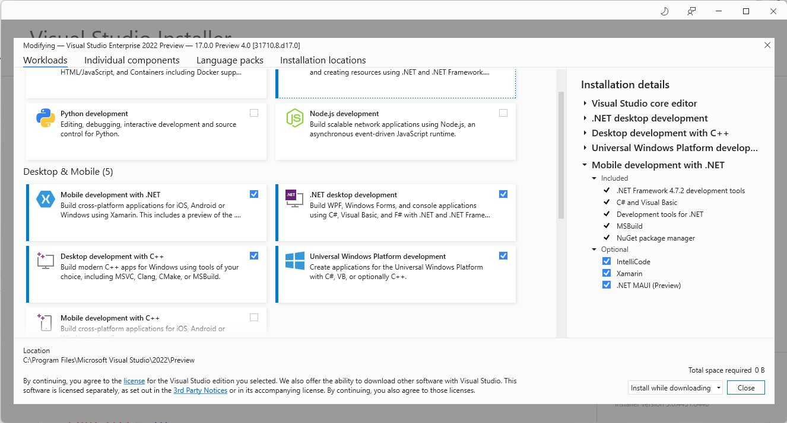
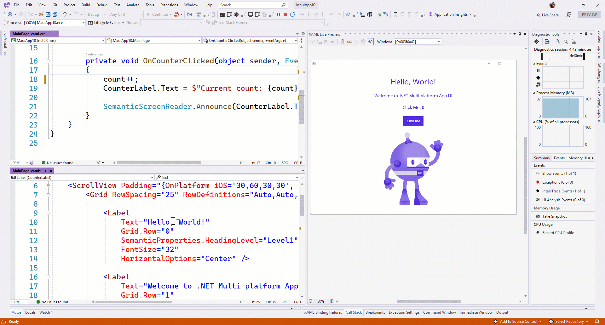

The .NET 6 project started in late 2020 as we were finishing .NET 5 where we started the journey to unify the .NET platform runtimes, libraries, and SDK. .NET 5 proved to be a very successful release, the first of the annual November releases, and due to the pandemic, the first all remote team release. Most importantly, it has been rapidly and broadly adopted. This November, .NET 6 will GA and will complete the unification of the mono runtime into core, have one set of base libraries for all workloads, and provide one SDK and project system with an expanded set of operating system and device targets. We will also release the next version of the C# language with C#10, have made several enhancements to the web stack ASP.NET, and improved the development experience with hot reload everywhere. We are also working on the next major release of Visual Studio 2022. There’s a whole lot more improvements coming with .NET 6 in November. Read the RC1 release posts for [.NET 6](https://devblogs.microsoft.com/dotnet/announcing-net-6-rc1/) and [ASP.NET Core in .NET 6](https://devblogs.microsoft.com/aspnet/asp-net-core-updates-in-net-6-rc-1/). 


.NET Multi-platform App UI (.NET MAUI) makes it possible to build native client apps for Windows, macOS, iOS, and Android with a single codebase and provides the native container and controls for Blazor hybrid scenarios. .NET MAUI is a wrapper framework and development experience in Visual Studio that abstracts native UI frameworks already available – WinUI for Windows, Mac Catalyst for macOS/iPadOS, iOS, and Android. Although it's not another native UI framework, there is still a significant amount of work to provide optimal development and runtime experiences across these devices.  

The .NET team has been working hard with the community in the open on its development and we are committed to its release. Unfortunately, .NET MAUI will not be ready for production with .NET 6 GA in November. We want to provide the best experience, performance, and quality on day 1 to our users and to do that, we need to slip the schedule. We are now targeting early Q2 of 2022 for .NET MAUI GA.  

In the meantime, we will continue to enhance Xamarin and recommend it for building production mobile apps and continue releasing monthly previews of .NET MAUI. All the features we plan to deliver for .NET MAUI will be available in November when .NET 6 releases, but we will continue to work on quality and addressing customer feedback. We encourage you to give the previews a try. The .NET Upgrade Assistant will also support upgrading Xamarin projects to .NET MAUI.  

.NET 6 RC1 is a “Go Live” release, meaning you can use it in production and you will be supported. This excludes .NET MAUI packages. The next release of .NET MAUI packages, when .NET 6 RC2 releases, will indicate “preview” in the version.  

Thank you for all the feedback, contributions, and excitement that you have shared with us on this journey. Please keep it coming and we look forward to a high-quality release early next year. Now let’s look at some of the new features in this release. 

## .NET MAUI Preview 8 Highlights

The September preview of .NET MAUI completes some important Visual Studio integrations, namely installing .NET MAUI as a workload in the Visual Studio 2022 installer, and folding the Windows platform inside our single, multi-targeted project. With Visual Studio 2022 Preview 4 you can now use broader Hot Reload support with C# and XAML, and the new XAML Live Preview panel for a productive, focused development environment. Within the .NET MAUI SDK itself, preview 8 includes updates to the app startup pattern, the ability to extend a handler, and miscellaneous other new control capabilities as we close on feature completeness.

### Visual Studio 2022 Preview 4 Productivity

When installing Visual Studio 2022 Preview 4, you can now check .NET MAUI (preview) within the Mobile Development with .NET workload. This will bring in .NET 6 as well as the optional workload dependencies: Android, iOS, and Mac Catalyst. When targeting desktop, you'll also want to choose the Desktop Development with .NET, UWP, and Desktop Development with C++ workloads. 



Once installed, the .NET MAUI templates and features of Visual Studio are all available. Live Preview will mirror your running application within the Visual Studio window in a panel you can dock anywhere that's most convenient to you. The panel supports zooming in and out to focus on every detail of your UI, guides to align elements on both horizontal and vertical axis, and on some platforms you can hover and select UI elements to get sizing and distance information.



XAML Hot Reload now works well on Android, iOS (on Windows via Hot Restart or a remote build host), and Windows. And .NET Hot Restart is working together with XAML Hot Reload on Android, iOS, and Windows too. 

When you create a new project, you'll now see the Windows platform is alongside Android, iOS, and Mac Catalyst within the Platforms folder. To use Windows, you first need to install the Windows App SDK extension for Visual Studio 2022, and then uncomment the TargetFramework node at the top of your csproj file. In a future release, this will be available by default with the extension pre-installed with .NET MAUI.

### .NET MAUI SDK Updates

The most notable update that you'll need to migrate existing applications to is how we implement the .NET Host Builder pattern. We are now aligned with how ASP.NET and Blazor do this with a MauiProgram class that creates and returns a MauiApp. Each platform now calls that MauiProgram.CreateMauiApp. Compare an existing project with the new templates, or the [pull request](https://github.com/dotnet/maui/pull/2137), to see these changes to Android/MainApplication.cs, iOS/AppDelegate.cs, and macCatalyst/AppDelegate.cs.

Sample `MauiProgram`:

```csharp
public static class MauiProgram
{
    public static MauiApp CreateMauiApp()
    {
        var builder = MauiApp.CreateBuilder();
        builder
            .UseMauiApp<App>()
            .ConfigureFonts(fonts =>
            {
                fonts.AddFont("OpenSans-Regular.ttf", "OpenSansRegular");
            });

        return builder.Build();
    }
}
```

Sample `MainApplication.cs`:

```csharp
public class MainApplication : MauiApplication
{
    public MainApplication(IntPtr handle, JniHandleOwnership ownership)
        : base(handle, ownership)
    {
    }

    protected override MauiApp CreateMauiApp() => MauiProgram.CreateMauiApp();
}
```

#### Android Updates

Android 12 (API 31) is now the default for .NET 6 applications building for Android. To use Android 12, you'll need to [install JDK 11 manually](https://aka.ms/vs2019-and-jdk-11). Once we update the Android tooling in Visual Studio to use JDK 11, we'll bundle this dependency by default with .NET MAUI. Until then, JDK 11 may have an unfavorable impact on the Android designer, SDK manager, and device manager.

Android projects now use the MaterialTheme by default. Make sure `Platforms/Android/MainActivity.cs` specifies `@style/Maui.SplashTheme` or you may get runtime errors on Android. Review the [updated .NET MAUI template](https://github.com/dotnet/maui/blob/main/src/Templates/src/templates/maui-mobile/Platforms/Android/MainActivity.cs#L7) for example.

#### Other Changes

Other notable changes and additions include:
* MinHeightRequest, MaxHeightRequest, MinWidthRequest, MaxWidthRequest have dropped the "Request" suffix and the layout system now treats them as true values
* Simplified method for appending behavior to any control mapper - [#1859](https://github.com/dotnet/maui/pull/1859)
* Various improvements to Shell theme styling
* Added RefreshView for Android [#2027](https://github.com/dotnet/maui/pull/2027) and iOS [#2029](https://github.com/dotnet/maui/pull/2029)
* Added AbsoluteLayout [#2136](https://github.com/dotnet/maui/pull/2136)
* Added Right-to-Left (RTL) FlowDirection [#948](https://github.com/dotnet/maui/pull/948)
* Added Button.Icon ImageSource [#2079](https://github.com/dotnet/maui/pull/2079)

## Get Started Today

First thing's first, install Visual Studio 2022 Preview 4 and check .NET MAUI (preview) under the Mobile Development with .NET workload, the Desktop Development with .NET workload, Desktop Development with C++ workload, and Universal Windows Platform.

Now, install the Windows App SDK [Single-project MSIX extension](https://marketplace.visualstudio.com/items?itemName=ProjectReunion.MicrosoftSingleProjectMSIXPackagingToolsDev17). Before running the Windows target, remember to uncomment the framework in the csproj file.

Ready? Open Visual Studio 2022 and create a new project. Search for and select .NET MAUI.


For additional information about getting started with .NET MAUI, refer to our [documentation](https://docs.microsoft.com/dotnet/maui/get-started/installation).

## Feedback Welcome

Visual Studio 2022 previews are rapidly enabling new features for .NET MAUI. As you encounter any issues with debugging, deploying, and editor related experiences, please use the Help > Send Feedback menu to report your experiences.

Please let us know about your experiences using .NET MAUI to create new applications by engaging with us on GitHub at [dotnet/maui](https://github.com/dotnet/maui).

For a look at what is coming in future releases, visit our [product roadmap](https://github.com/dotnet/maui/wiki/roadmap), and for a status of feature completeness visit our [status wiki](https://github.com/dotnet/maui/wiki/status).
