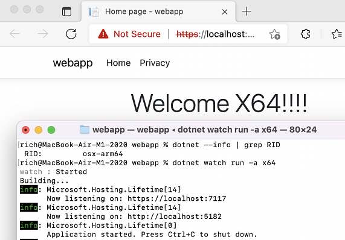

We are excited to release .NET 6 Release Candidate 2. It is the second of two "go live" release candidate releases that are supported in production. For the last couple months, the team has been focused exclusively on quality improvements. There are a lot of new features in the release, which only fully come together near the end. The team is currently validating end-to-end workflows to find the places where design intentions and technical reality don't yet fully match. That's led to teams tightening leaky pipes and paving paths are all the way to their destination. We've heard from users that upgrading production sites to .NET 6 RC1 has been both "boring" (non-event) and "exciting" (significant performance improvements). We're confident that RC2 will continue that trend of having no surprises and exciting features. 

You can [download .NET 6 Release Candidate 2](https://dotnet.microsoft.com/download/dotnet/6.0) for Linux, macOS, and Windows.

* [Installers and binaries](https://dotnet.microsoft.com/download/dotnet/6.0)
* [Container images](https://hub.docker.com/_/microsoft-dotnet)
* [Linux packages](https://github.com/dotnet/core/blob/main/release-notes/6.0/install-linux.md)
* [Release notes](https://github.com/dotnet/core/blob/main/release-notes/6.0/README.md)
* [API diff](https://github.com/dotnet/core/tree/main/release-notes/6.0/preview/api-diff/preview7)
* [Known issues](https://github.com/dotnet/core/blob/main/release-notes/6.0/known-issues.md)
* [GitHub issue tracker](https://github.com/dotnet/core/issues/6688)

See the [.NET MAUI](https://devblogs.microsoft.com/dotnet) and [ASP.NET Core](https://devblogs.microsoft.com/aspnet/) posts for more detail on what’s new for client and web application scenarios.

.NET Conf is a free, three-day, virtual developer event that celebrates the major releases of .NET. This year, .NET 6 will launch at .NET Conf November 9-11. We encourage you to [save the date and tune in](https://www.dotnetconf.net). Visual Studio 2022 RC2 is also releasing today and they have also announced that launch event happening on November 8. You can read all about that on the [Visual Studio blog](https://aka.ms/VS2022RC).  
We're at that fun part of the cycle where we support the new release in production. We genuinely encourage it. You can reach out to us at dotnet@microsoft.com if you need guidance on how to approach that. A bunch of businesses have reached out and some are now in production. We also help Microsoft teams run on RC releases. Some Microsoft teams have gone into production on RC1 and we expect many more on RC2. This includes the [.NET Website](https://dot.net/).

.NET 6 RC2 has been tested and is supported with [Visual Studio 2022 Preview 5](https://visualstudio.microsoft.com/vs/preview/vs2022/). .NET 6 will be supported with Visual Studio 2022 and not Visual Studio 2019. Similarly, it will be supported with MSBuild 17.x and not 16.x. If you want to use .NET 6, you will need to upgrade to Visual Studio 2022.

Support for .NET 6 is coming soon in Visual Studio 2022 for Mac Preview 1, which is currently available as a private preview.

Check out the new [conversations posts](https://devblogs.microsoft.com/dotnet/category/conversations/) for in-depth engineer-to-engineer discussions on the latest .NET features.

The [.NET 6 RC1 post](https://devblogs.microsoft.com/dotnet/announcing-net-6-release-candidate-1/) was focused on foundational features, many of which will not see their full fruition until .NET 7. This post is focused on C# 10 and the related improvements to templates. It also includes an update on macOS and Windows Arm64 (which includes breaking changes). Let's take a look.

## C# 10

[C# 10](https://docs.microsoft.com/dotnet/csharp/whats-new/csharp-10) is an important part of the .NET 6 release. For the most part, C# 10 is a further evolution of existing concepts and capabilities, like records and patterns. It also includes features -- `global using` and file-scoped namespaces -- that help you simplify your code and write less boilerplate. Those specific improvements are the basis of the template changes that are discussed later in this post.

### Record structs

C# 10 adds support for record structs. This new feature is similar to C# 9 (class-based) records, with some key differences. For the most part, record structs have been added for completeness so that structs can enjoy the same record benefits as classes. However, the team did not simply structify records, but decided to align struct records with `ValueTuple` as much as class records. As a result of that design approach, record struct properties are mutable by default, while record class properties are immutable. You can declare a `readonly record struct`, which is immutable and matches the `record class` semantics. At a high level, record structs do not replace record classes, nor do we encourage migration of record classes to record structs. The guidance for using classes vs structs applies equally to record classes and record structs. Put another way, the choice between classes and structs should be made before choosing to use records.

Let's take a look at how record structs differ from [record classes](https://gist.github.com/richlander/bcbbcc9e0b541a06eb805d663ebf6334)

```csharp
Battery battery = new("CR2032", 0.235, 100);

WriteLine(battery);

while (battery.RemainingCapacityPercentage > 0)
{
    battery.RemainingCapacityPercentage--;
}

WriteLine(battery);

public record struct Battery(string Model, double TotalCapacityAmpHours, int RemainingCapacityPercentage);
```

This example of a record struct produces the following output.

```bash
Battery { Model = CR2032, TotalCapacityAmpHours = 0.235, RemainingCapacityPercentage = 100 }
Battery { Model = CR2032, TotalCapacityAmpHours = 0.235, RemainingCapacityPercentage = 0 }
```

https://gist.github.com/richlander/4408b08a03085a345d42ca1d6b753275

As already stated, the most obvious difference is that record struct properties are mutable by default. That's the key difference beyond being structs and the `record struct` syntax.

Let's review C# 9 records. They provide a [terse syntax for defining struct-like data-oriented classes](https://devblogs.microsoft.com/dotnet/announcing-net-5-0-rc-1/#c-9-records). They bias to immutability while offering a terse syntax -- `with` expressions -- for immutable-friendly copying. It might have surprised folks that we started with classes for a feature that is intended to be struct-like. Most of the time, developers use classes over structs, due to pass by reference as opposed to value semantics. Classes are the best choice in most cases and easier to use.

Struct records are very similar to class records:

- They use the same syntax (with the exception of `struct` or `class` in the definition).
- They enable customizing member definitions (new in C# 10) to use fields over (by default) property members.
- They enable customizing the member behavior, using `init` or mutable properties.
- They support `with` expressions. In fact, starting in C# 10, all `struct` types support `with` expressions.

Struct records differ from class records:

- Struct records are defined with `record struct` or `readonly record struct`.
- Struct classes are defined with `record` or `record class`.
- Struct record properties are mutable (`get`/`set`) by default.
- Struct class properties are immutable (`get`/`init`) by default.

The asymmetric (im)mutability behavior between struct records and struct classes will likely be met with surprise and even distaste with some readers. I'll try to explain the [thinking behind the design](https://github.com/dotnet/csharplang/blob/main/meetings/2020/LDM-2020-10-05.md#record-struct-primary-constructor-defaults). By virtue of pass by value semantics, structs don't benefit from immutability nearly as much as classes. For example, if a struct is a key in a dictionary, that (copy of the struct) key is immutable and lookups will be performed via equality. At the same time, the design team saw that `ValueTuple` can be thought of as an anonymous record struct and that record structs can be seen as a grow-up from `ValueTuple`. That only works if record structs embrace mutability and support fields, which is exactly what the team decided to do. Also, embracing mutability is a reflection that structs and classes are different.

If you prefer the immutable behavior with record structs, you can have it by adding the `readonly` keyword.

Looking at structs generally, key functionality is common:

- Equality checks are the same for all structs, provided by the runtime.
- All structs can use `with` expressions for creating non-mutating copies, which is new in C# 10.

### Global usings

`global using` enables you to specify a namespace that you would like available in all of your source files, as if it was declared in each one. It can also be used with `using static` and aliasing. This feature enables a common set of `using` declarations to be available, and by extension, for many `using` lines to no longer be needed. This is most relevant for the platform namespaces, but can be used for any namespace.

The following syntax can be used for the various `using` forms:

- `global using System;`
- `global using static System.Console;`
- `global using E = System.Environment;`


These declarations just need to be declared once in your compilation to be effective throughout it. There are four patterns for declaring `global using`.

- In `Program.cs`, which makes your root `using` statements global to the whole program by upgrading them to `global using`.
- In a `GlobalUsings.cs` file (or some similar name), which is used to centrally manage all of your `global using` statements.
- In your project file, with syntax that follows.
- In your project file, enable the default platform `using` statements (for the MSBuild SDK your app relies on), with syntax that follows.

The following MSBuild syntax can be used in place of `.cs` files, in an `<ItemGroup>` (using analogs of the earlier examples).

- `<Using Include="System"/>`
- `<Using Include="System.Console" Static="True"/>`
- `<Using Include="System.Environment" Alias="E"/>`

You can enable implicit `using` defined by the platform in a `<PropertyGroup>`.

- `<ImplicitUsings>enable</ImplicitUsings>`

[Implicit `using`](https://docs.microsoft.com/dotnet/core/project-sdk/msbuild-props#implicitusings) [differs by MSBuild SDK](https://docs.microsoft.com/dotnet/core/compatibility/sdk/6.0/implicit-namespaces-rc1#new-behavior). `Microsoft.NET.Sdk` defines a basic set, and other SDKs  define additional ones.

If you use the MSBuild capabilities, you can see the effective result in a generated file in the `obj` directory, as demonstrated by the following.

```Console
PS C:\Users\rich\app> type .\app.csproj | findstr Using
    <ImplicitUsings>enable</ImplicitUsings>
    <Using Include="System.Console" Static="True"/>
    <Using Include="System.Environment" Alias="E"/>
PS C:\Users\rich\app> type .\obj\Debug\net6.0\app.GlobalUsings.g.cs
// <auto-generated/>
global using global::System;
global using global::System.Collections.Generic;
global using global::System.IO;
global using global::System.Linq;
global using global::System.Net.Http;
global using global::System.Threading;
global using global::System.Threading.Tasks;
global using E = global::System.Environment;
global using static global::System.Console;
```

You can see that the `Microsoft.NET.Sdk` adds several `global using` statements, in the `.GlobalUsings.g.cs` file. Note that the `global::` operator isn't necessary and can be safely ignored in terms of developing an understanding of the generated syntax.

### File-scoped namespace declaration

File-scoped namespace declarations is another C# 10 feature that is aimed at reducing indentation and line count.

The syntax for this feature follows:

```csharp
namespace Foo;
```

It is an alternative to the traditional three-line syntax:

```csharp
namespace Foo
{
}
```

The three-line syntax can be nested. The one-line syntax does not support nesting. There can only be one file-scoped declaration per file. It must precede all types defined in the file, much like the three-line syntax.

Namespaces are not compatible with top-level statements. Top-level statements exist within the top-level namespace. This also means that if you add additional methods to the `Program` class, using the `partial class` syntax that the partial `Program` class needs to also be in the top-level namespace.

This is very similar to the [one-line `using` declaration that was added to C# 8](https://devblogs.microsoft.com/dotnet/announcing-net-core-3-0/#using-declarations).

### `const` and interpolated strings

Interpolated strings can now be assigned to `const` variables. Interpolated strings are intuitive to use and read, and should be usable everywhere. They can now be used with `const` provided that the placeholder values are also constant.

The following example demonstrates a possible use case:

```csharp
const string Bar = "Bar";
const string DoubleBar = $"{Bar}_{Bar}";
```

Many other improvements have been made to interpolated strings, which are described in [String Interpolation in C# 10 and .NET 6](https://devblogs.microsoft.com/dotnet/string-interpolation-in-c-10-and-net-6/).

### Extended property patterns

You can now reference nested properties or fields within a property pattern. For example, the following pattern is now legal:

```csharp
{ Prop1.Prop2: pattern }
```

Previously, you'd need to use a more verbose form:

```csharp
{ Prop1: { Prop2: pattern } }
```

You can see this more compact form used in the following example, for example with `Reading.PM25`.

```csharp
List<Status> statuses = new()
{
    new(Category.Normal, new(20, false, 20)),
    new(Category.Warning, new(20, false, 60)),
    new(Category.Danger, new(20, true, 60)),
    new(Category.Danger, new(100, false, 20))
};

foreach (Status status in statuses)
{
    string message = status switch
    {
        {Category: Category.Normal} => "Let the good times roll",
        {Category: Category.Warning, Reading.PM25: >50 and <100} => "Check the air filters",
        {Reading.PM25: >200 } => "There must be a fire somewhere. Don't go outside.",
        {Reading.SmokeDetected: true } => "We have a fire!",
        {Category: Category.Danger} => "Something is badly wrong",
        _ => "Unknown status"
    };

    Console.WriteLine(message);
}


record struct Reading(int Temperature, bool SmokeDetected, int PM25);
record struct Status(Category Category, Reading Reading);
enum Category
{
    Normal,
    Warning,
    Danger
}
```

https://gist.github.com/richlander/7599b523a9e286ed7e8cca3704f6641c

## .NET SDK: C# project templates modernized

We [modernized .NET SDK templates](https://devblogs.microsoft.com/dotnet/announcing-net-6-preview-7/#net-sdk-c-project-templates-modernized) with Preview 7, using the latest C# features and patterns. There was significant feedback on those changes, in part because builds started to fail. As part of the initial templates update, we enabled [implicit usings](https://docs.microsoft.com/dotnet/core/project-sdk/msbuild-props#implicitusings) by default (AKA opt-out) for .NET 6 (`net6.0`) projects (including if you updated an app from .NET 5 to .NET 6). That has [been changed](https://docs.microsoft.com/dotnet/core/compatibility/sdk/6.0/implicit-namespaces-rc1). We've updated the SDK so that all the new features are opt-in. The response to that change (which was made in RC1) has been positive.

There was also feedback that some folks didn't like the new simplified `Program.cs` file, with [top level statements](https://docs.microsoft.com/dotnet/csharp/whats-new/tutorials/top-level-statements). We've made [improvements](https://docs.microsoft.com/dotnet/csharp/whats-new/csharp-10) to top-level statements in response and continued to use it for templates. We expect that most developers who prefer the traditional approach can straightforwardly add the extra ceremony themselves.

The following language features are used in the new templates:

* async Main
* Top-level statements
* Target-typed new expressions
* Global using directives
* File-scoped namespaces
* Nullable reference types

We built all of these features because we think that they are better than the previous alternative. Templates are the easiest and best way to steer new developers and new apps to use the best patterns. The C# design team is a big believer in enabling the use of fewer lines, fewer characters to specify a given concept or operation, and the reducing needless repetition. That's what most of these new features enable. Nullable differs in that it results in more reliable code. Every app or library that uses nullable is less likely to crash in production. Software is too complicated for human minds to see the mistakes that a compiler can.

A common theme across these features is that they reduce noise and increase signal when you are looking at your code in a  code editor. More important aspects should now pop. For example, if you see a `using` statement in a given file, it's a special one needed beyond the implicit set. You should be able to copy/paste code from one file to another without needing to `CTRL-.` types to add the required namespaces (at least not as much). If you see nullable warnings or errors, you know that your code is likely incorrect in some way. There is also the benefit of removing indentation. More of your code will be visible within the first dozen columns of your editor, as opposed to them just being space characters. One can think of these features as delivering higher density of specificity and meaning to your eyes.

### Console template

Let's start with the `console` template. It's very small.

`Program.cs`:

```csharp
// See https://aka.ms/new-console-template for more information
Console.WriteLine("Hello, World!");
```

Project file:

```xml
<Project Sdk="Microsoft.NET.Sdk">

  <PropertyGroup>
    <OutputType>Exe</OutputType>
    <TargetFramework>net6.0</TargetFramework>
    <ImplicitUsings>enable</ImplicitUsings>
    <Nullable>enable</Nullable>
  </PropertyGroup>

</Project>
```

Even though the console template is much more minimal that its .NET 5 counterpart, there is no reduction in functionality. You can also see that `ImplicitUsings` is now an opt-in feature, and is enabled in the templates.

### Web templates

The `web` template is similarly minimal.

```csharp
var builder = WebApplication.CreateBuilder(args);
var app = builder.Build();

app.MapGet("/", () => "Hello World!");

app.Run();
```

The `webapi` template maps more closely to typical ASP.NET Core apps. You will quickly notice that the split between `Program.cs` and `Startup.cs` has been removed. `Startup.cs` no longer exists.

`Program.cs`:

```csharp
var builder = WebApplication.CreateBuilder(args);

// Add services to the container.

builder.Services.AddControllers();
// Learn more about configuring Swagger/OpenAPI at https://aka.ms/aspnetcore/swashbuckle
builder.Services.AddEndpointsApiExplorer();
builder.Services.AddSwaggerGen();

var app = builder.Build();

// Configure the HTTP request pipeline.
if (app.Environment.IsDevelopment())
{
    app.UseSwagger();
    app.UseSwaggerUI();
}

app.UseHttpsRedirection();

app.UseAuthorization();

app.MapControllers();

app.Run();

```

The project file for the `webapi` template is similar to the `console` one.

```xml
<Project Sdk="Microsoft.NET.Sdk.Web">

  <PropertyGroup>
    <TargetFramework>net6.0</TargetFramework>
    <Nullable>enable</Nullable>
    <ImplicitUsings>enable</ImplicitUsings>
  </PropertyGroup>

  <ItemGroup>
    <PackageReference Include="Swashbuckle.AspNetCore" Version="6.1.5" />
  </ItemGroup>

</Project>
```

You can see that file-scope namespaces are used throughput this sample, including in `WeatherForecast.cs`:

```csharp
namespace webapi;

public class WeatherForecast
{
    public DateTime Date { get; set; }
    public int TemperatureC { get; set; }
    public int TemperatureF => 32 + (int)(TemperatureC / 0.5556);
    public string? Summary { get; set; }
}

```

Target-type `new` is used with `WeatherForecastController.cs`:

```csharp
private static readonly string[] Summaries = new[]
{
    "Freezing", "Bracing", "Chilly", "Cool", "Mild", "Warm", "Balmy", "Hot", "Sweltering", "Scorching"
};
```

In the `mvc` template, you can see the use of nullable annotations and an expression-bodied method.

```csharp
namespace webmvc.Models;

public class ErrorViewModel
{
    public string? RequestId { get; set; }

    public bool ShowRequestId => !string.IsNullOrEmpty(RequestId);
}
```

### Windows Forms templates

The Windows Forms template has also been updated. It includes most the other improvements covered with the other templates, although notably not top-level statements.

```csharp
namespace winforms;

static class Program
{
    /// <summary>
    ///  The main entry point for the application.
    /// </summary>
    [STAThread]
    static void Main()
    {
        ApplicationConfiguration.Initialize();
        Application.Run(new Form1());
    }    
}
```

You can see the use of the one-line `namespace` statement and the lack of any platform-level `using` statements due to enabling implicit usings.

WPF templates have not been updated as part of the release.

### Implicit usings

I'll now show you these features in action. Let's start with implicit usings. When enabled, [each `Sdk` adds its own set of implicit `using` statements](https://docs.microsoft.com/dotnet/core/compatibility/sdk/6.0/implicit-namespaces-rc1#new-behavior).

As demonstrated earlier, the `Microsoft.NET.Sdk` adds several `global using` statements.

If this feature is disabled, you'll see that the app no longer compiles since the `System` namespace (in this example) is no longer declared.

```console
PS C:\Users\rich\app> type .\app.csproj | findstr Implicit
    <ImplicitUsings>disable</ImplicitUsings>
PS C:\Users\rich\app> dotnet build
Microsoft (R) Build Engine version 17.0.0-preview-21501-01+bbcce1dff for .NET
Copyright (C) Microsoft Corporation. All rights reserved.

  Determining projects to restore...
  All projects are up-to-date for restore.
  You are using a preview version of .NET. See: https://aka.ms/dotnet-core-preview
C:\Users\rich\app\Program.cs(2,1): error CS0103: The name 'Console' does not exist in the current context [C:\Users\rich\app\app.csproj]

Build FAILED.
```

Another option is to use the global using feature, which enables you to only use the namespaces you want, as you can see in the following example.

```xml
<Project Sdk="Microsoft.NET.Sdk">

  <PropertyGroup>
    <OutputType>Exe</OutputType>
    <TargetFramework>net6.0</TargetFramework>
    <ImplicitUsings>disable</ImplicitUsings>
    <Nullable>enable</Nullable>
  </PropertyGroup>

  <ItemGroup>
    <Using Include="System" />
  </ItemGroup>

</Project>
```

Now, building the code.

```console
PS C:\Users\rich\app> type .\app.csproj | findstr Using
    <ImplicitUsings>disable</ImplicitUsings>
  <Using Include="System" />
PS C:\Users\rich\app> dotnet build
Microsoft (R) Build Engine version 17.0.0-preview-21501-01+bbcce1dff for .NET
Copyright (C) Microsoft Corporation. All rights reserved.

  Determining projects to restore...
  All projects are up-to-date for restore.
  You are using a preview version of .NET. See: https://aka.ms/dotnet-core-preview
  app -> C:\Users\rich\app\bin\Debug\net6.0\app.dll

Build succeeded.
    0 Warning(s)
    0 Error(s)

Time Elapsed 00:00:00.80
```

That's not the recommended general pattern, but is a good option for folks that want maximum control. In most cases, we expect that developers will rely on the implicit usings provided by the SDK and take advantage of explicit global usings for namespaces from their own code or NuGet packages that they use pervasively.

#### Nullable

I've updated `Program.cs` to demonstrate nullable reference types. The app calls a `List<T>` method that returns a `T?`, in this case a nullable string (`string?`).

```csharp
List<string> greetings = new()
{
    "Nice day, eh?"
};

string? hello = greetings.Find(x => x.EndsWith("!"));
string greeting = hello ?? "Hello world!";

Console.WriteLine($"There are {greeting.Length} characters in \"{greeting}\"");
```

The line that defines the `hello` variable won't compile without being defined as `var`, `string?` or addressing the case where [`List<T>.Find` returns null](https://docs.microsoft.com/dotnet/api/system.collections.generic.list-1.find). Without the nullable feature enabled, I might miss this problem, which would result in my code crashing with a `NullReferenceException` exception. That's no good. I'm handling that on the next line with `??`, the [null coalescing operator](https://docs.microsoft.com/dotnet/csharp/language-reference/operators/null-coalescing-operator). In most cases, these two lines would be merged into one, as you can see in the following code. I've kept them separate (in this contrived example) so that you can see my use of `string?` to accommodate an API that returns a nullable reference type.

```csharp
string greeting = greetings.Find(x => x.EndsWith("!")) ?? "Hello world!";
```

I can declare the variable as `string` since the null-ness has been accommodated with the string that follows `??`. The `string?` in this case is something that only the compiler sees.

#### string[] args

I'm now going to quickly address the questions that most people ask about top-level statements, including the `args` parameter. The `args` parameter remains available with top-level statements. It's just less obvious. Here's another program that demonstrates using it.

```csharp
string greeting = args.Length > 0 ? string.Join(" ", args) : "Hello World!";
WriteLine($"There are {greeting.Length} characters in \"{greeting}\" in this {nameof(Program)}.");
```

It produces the following output.

```console
PS C:\Users\rich\app> dotnet run
There are 12 characters in "Hello World!" in this Program.
PS C:\Users\rich\app> dotnet run Nice day, eh?
There are 13 characters in "Nice day, eh?" in this Program.
```

This app also demonstrates that the `Program` type is still defined. [`Program.Main` is not](https://github.com/dotnet/csharplang/blob/main/meetings/2021/LDM-2021-07-26.md#speakable-names-for-top-level-statements).

I removed the `Console` from `Console.WriteLine` in `Program.cs` by adding a [global static using](https://docs.microsoft.com/dotnet/core/project-sdk/msbuild-props#using) to my project file, as follows.

```xml
<Project Sdk="Microsoft.NET.Sdk">

  <PropertyGroup>
    <OutputType>Exe</OutputType>
    <TargetFramework>net6.0</TargetFramework>
    <ImplicitUsings>enable</ImplicitUsings>
    <Nullable>enable</Nullable>
  </PropertyGroup>

  <ItemGroup>
    <Using Include="System.Console" Static="True"/>
  </ItemGroup>

</Project>
```

### Defining regular methods

We've heard the feedback that real methods are preferred over [local functions](https://docs.microsoft.com/dotnet/csharp/programming-guide/classes-and-structs/local-functions), specifically for the `Program` class. You can use either model with top-level statements.

I've kept the program the same, but switched all the functionality to static method in the `Program` class, defined in a partial class.

Program.cs.

```csharp
WriteLine(GetTheGreeting(args));
```

Program.Foo.cs.

```csharp
public partial class Program
{
    public static string GetTheGreeting(string[] args)
    {
        string greeting = args.Length > 0 ? string.Join(" ", args) : "Hello World!";
        return $"There are {greeting.Length} characters in \"{greeting}\" in this {nameof(Program)}.";
    }
}
```

It produces the same result as the previous example. The name `Program.Foo.cs` is arbitrary. In fact, so is `Program.cs`. You can name these files whatever you'd like. The compiler will figure it out.

As mentioned earlier, the `Program` type must be in the top-level namespace when using top-level statements.

## macOS and Windows Arm64 Update

We have good news. The project to support macOS and Windows arm64 is almost done. We've been working on it for over a year, with help when we needed it from the fine folks on the macOS and the Windows teams. At first, we thought that the project was solely about supporting Arm64 on macOS and that Rosetta 2 would cover x64. Easy and just about ISAs, right? Not quite. As we dug deeper, it became clear that x64 + Arm64 co-existence was the bigger task to take on, focused on the CLI and installers, including a few places where they need to agree. Anyway, we're close to delivering builds of .NET that we think deliver the best experience we could imagine.

I'll provide a quick summary of where we are at for macOS and Windows Arm64 machines:

- .NET 6 RC2 enables Arm64 + x64 co-existence by installing Arm64 and x64 builds to different locations. Until now, Arm64 and x64 builds overwrite each other, which led to general sadness.
- **You need to uninstall all .NET builds** and start from scratch (on macOS and Windows Arm64 machines) to adopt .NET 6 RC2+.
- The CLI enables you to use the Arm64 SDK to do Arm64 AND x64 development (assuming you have the required Arm64 and x64 runtimes installed). The same is true in reverse.
- We want people to just use the Arm64 SDK since it will be a better experience (native architecture performance; one SDK to maintain). We will continue to improve the product to make this model the easy choice for most developers.
- For the SDK, we will only support .NET 6+ on Arm64. Earlier SDK builds will be [blocked on Arm64](https://github.com/dotnet/installer/pull/12278).
- For runtimes, we will support all in-support versions, Arm64 and x64.
- .NET 6 RC2 delivers the bulk of the final .NET 6 experience for Arm64 (including x64 emulation).
- We hope to update .NET Core 3.1 and .NET 5 runtimes to align with .NET 6 RTM (both in time and with the technical requirements). That's still TBD.
- RC2 nightly builds are currently broken, so you will need to wait a couple more weeks until we actually ship RC2 to try this all out.
- **The .NET 5 SDK for Windows Arm64 will go out of support early**, with .NET 6 RTM.

We're also considering making breaking changes to `dotnet test` to unify the arguments we use for architecture targeting:

- https://github.com/dotnet/sdk/issues/21389
- https://github.com/dotnet/sdk/issues/21952

A big part of the project is enabling the use of x64 runtimes with the Arm64 SDK. You can see that demonstrated in the following image.



If you want more details, check out [dotnet/sdk #21686](https://github.com/dotnet/sdk/issues/21686).

## Contributor showcase

In developing .NET 6, we appreciate the many contributions of our GitHub community. As we did in our [Preview 7](https://devblogs.microsoft.com/dotnet/announcing-net-6-preview-7/#contributor-showcase) and [RC1 posts](https://devblogs.microsoft.com/dotnet/announcing-net-6-release-candidate-1/#contributor-showcase), we'd like to recognize just a few of those.

This text is written in the contributors' own words:

### Alexandr Golikov (@kirsan31)


*My name is Alexandr Golikov and I am from Saint Petersburg, Russia.*

*I have been writing stock trading software for over 15 years, mostly with .Net Framework and WinForms. As soon as .Net Core WinForms became open source and a preview version was released, I started trying to migrate our projects into it and contribute to solving both old problems that were in .Net Framework and new ones.
At this moment all of our projects are working on .Net 5.0. But .Net 6 is already almost here, and .Net 7 is on the horizon, and... I hope that I will continue to contribute to this great framework, and will have more free time for this :)*

*In the end, I want to thank the whole .Net team and especially the WinForms project developers and maintainers!*

### Tobias Käs (@weltkante)


*I'm Tobias Käs and mostly visible under the alias [weltkante](https://github.com/weltkante) on github. I'm from Germany, studied computer science in Frankfurt and am currently living in Mönchengladbach. I'm coming from a low level C++ programming background but have switched to C# programming as my main language ever since it distinguished itself from Java by adding generics in .NET 2.0.*
 
*I've been working over 12 years programming desktop applications in .NET Framework using WinForms and later WPF. I have spent a lot of time digging into the internals of .NET and its UI frameworks to learn how they work, debugging issues, finding workarounds, and in general getting the most out of these frameworks. Ever since they went open source I'm trying to give back from what I learned, following issue discussions, commenting pull requests, or doing the occasional contribution.*

### Ivan Zlatanov (@zlatanov)


*My name is Ivan Zlatanov, and I am from Botevgrad, Bulgaria. I dipped my toes in the world of software first in high school where we did competitive programming in Turbo Pascal. I’ve spent the next summer doing some PHP and learning about the web dev. Not long after an opportunity arose where I could learn C# and ASP.NET 2.0 and once I picked that, I never stopped.  I’ve been programming with C# and .NET for almost 14 years now.*
 
*I love contributing to open-source projects because I can help others. I love the immediate feedback you get from reviews and the open discussion of problems and solutions with other people around the globe. As Scott Hanselman once said that we only have limited keystrokes left in each of us, so we better spend them well.*
 
*Contributing to Open Source and in particular .NET is keystrokes spent well.*

## Closing

C# 10 offers significant improvements in simplicity and expressiveness, building on similar features in C# 9. In the past, one could reasonably poke fun at C# for requiring so much ceremony and knowledge of object oriented concepts just to write a single line of code. Those days are behind us, and the templates reflect that. Part of the motivation for these changes has been to make C# more attractive to new programmers and schools. These simplifying changes fundamentally change what you need to learn to get started with and become skilled using C#. In its new default form, it is directly comparable to other languages that similarly start with a single file source file.

We look forward to seeing other projects simplify their new user experiences with top-level statements, `global using`, records and many of the other modern features. There is a lot of opportunity to create simpler learning journeys for both open source projects and commercial offerings.

We encourage you to use .NET 6 RC2. We're confident that you'll find it a solid release. And [save the date for .NET Conf on November 9](https://www.dotnetconf.net) for the .NET 6 launch. 
Thanks for being a .NET developer.
