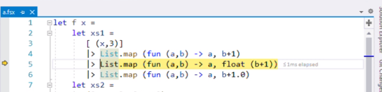
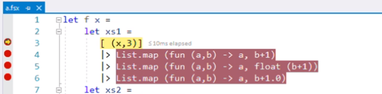
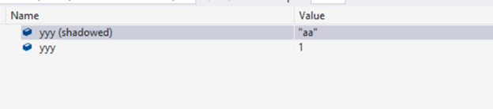
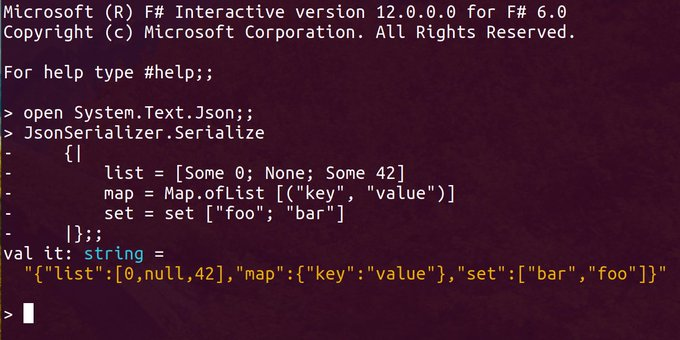

We’re excited to announce the availability F# 6, shipping with .NET 6 RC2 and Visual Studio 2022 RC2. It's the next step to making it easier for you to write robust, succinct and performant code. You can get F# 6 in the following ways:

* [Install the latest .NET 6 SDK RC2 preview](https://dotnet.microsoft.com/download/dotnet/6.0)
* [Install Visual Studio 2022 RC2 preview](https://visualstudio.microsoft.com/vs/preview/)
* [Use .NET Interactive Notebooks in Jupyter or VS Code](https://github.com/dotnet/interactive#notebooks-with-net)

F# 6 is about making F# simpler and more performant. This applies to the language design, library, and tooling. A major goal of long-term language evolution is to remove corner-cases in the language that surprise users or are unnecessary hurdles on the path to adoption. We are very pleased to have worked with the F# community in this release to make the F# language simpler, more performant, and easier to learn.

To learn more about F#, see [The .NET Conf Focus Day on F#](https://channel9.msdn.com/Events/dotnetConf/Focus-on-FSharp) including the [F# Bonanza](https://channel9.msdn.com/Events/dotnetConf/Focus-on-FSharp/Don-Symes-F-Bonanza), [Guido van Rossum Learns F#](https://channel9.msdn.com/Events/dotnetConf/Focus-on-FSharp/Don-Teaches-Guido-FSharp) and [Starting Your F# Journey](https://channel9.msdn.com/Events/dotnetConf/Focus-on-FSharp/Starting-Your-FSharp-Journey).

## Making F# faster and more interopable with task {…}
 
One of the most requested features for F# - and the most significant technical feature in this release – has been to make authoring asynchronous tasks simpler, more performant and more interoperable with other .NET languages like C#. Previously, creating .NET tasks required using `async {…}` to create a task and then invoking it with `Async.AwaitTask`. With F# 6 you can now use `task {…}` directly to create the task and await it. For example, consider the following F# code to create a .NET-compatible task:

```fsharp
let readFilesTask (path1, path2) =
   async {
        let! bytes1 = File.ReadAllBytesAsync(path1) |> Async.AwaitTask
        let! bytes2 = File.ReadAllBytesAsync(path2) |> Async.AwaitTask
        return Array.append bytes1 bytes2
   } |> Async.StartAsTask
```

This code can now become: 

```fsharp
let readFilesTask (path1, path2) =
   task {
        let! bytes1 = File.ReadAllBytesAsync(path1)
        let! bytes2 = File.ReadAllBytesAsync(path2)
        return Array.append bytes1 bytes2
   }
```
 
The built-in support for `task {…}` is available ubiquitously in F# code – no namespaces need to be opened. 

Task support has previously been available for F# 5.0 through the excellent TaskBuilder.fs and Ply libraries. These guided the design of the support in F# 6 and provided an important source of tests. The authors of these libraries have been major contributors to the design of F# 6, both directly and indirectly. Migrating code to the built-in support should be straightforward. There are however some differences: namespaces and type-inference differ slightly between the built-in support and these libraries, and some additional type annotations may be needed. These community libraries can still be used with F# 6, if explicitly referenced and the correct namespaces opened in each file. 

Using `task {…}` is very similar to `async {…}`, and both are supported. Using `task {…}` has several advantages over `async {…}`:

* The performance of `task {…}` is much better.
* Debugging stepping and stack traces for `task {…}` is better.
* Interoperating with .NET packages expecting or producing tasks is easier.

If you’re familiar with `async {…}`, there are some differences to be aware of:

* `task {…}` immediately executes the task to the first asynchronous yield.
* `task {…}` does not implicitly propagate a cancellation token.
* `task {…}` does not perform implicit cancellation checks.
* `task {…}` does not support asynchronous tailcalls. This means using `return! .. ` recursively may result in stack overflows if there are no intervening asynchronous yields.

In general, you should consider using `task {…}` over `async {…}` in new code if interoperating with .NET libraries that uses tasks. Review code before switching to `task {…}` to ensure you are not relying on the above characteristics of `async {…}`.
 
The `task {…}` support of F# 6 is built on a foundation called “resumable code” [RFC FS-1087](https://github.com/fsharp/fslang-design/blob/main/preview/FS-1087-resumable-code.md). Resumable code is a core technical feature which can be used to build many kinds of high-performance asynchronous and yielding state machines. 

In the coming months we will be working with the F# community to utilise this feature to make available two key optional packages:

1.	A fast re-implementation of F# `async {…}`  using resumable code.
2.	A fast re-implementation of asynchronous sequences `asyncSeq {…}` using resumable code.

Initially these will be delivered via community packages such as FSharp.Control.AsyncSeq. In future versions they may be integrated into FSharp.Core.

## Making F# simpler to learn: indexing with expr[idx]
 
In F# 6, we begin [allowing the syntax `expr[idx]` for  indexing syntax](https://github.com/fsharp/fslang-design/blob/main/FSharp-6.0/FS-1110-index-syntax.md).  

Up to and including F# 5.0, F# has used `expr.[idx]` as indexing syntax. This syntax was based on a similar notation used in OCaml for string indexed lookup. Allowing the use of `expr[idx]` is based on repeated feedback from those learning F# or seeing F# for the first time that the use of dot-notation indexing comes across as an unnecessary divergence from standard industry practice. There is no need for F# to diverge here.

This is not a breaking change – by default no warnings are emitted on the use of `expr.[idx]`. However, some informational messages are emitted related to this change suggesting code clarifications, and some further informational messages can be optionally activated. For example, an optional informational warning (`/warnon:3566`) can be activated to start reporting uses of the `expr.[idx]` notation. See [Indexer Notation](https://aka.ms/fsharp-index-notation) for details.

In new code, we recommend the systematic use of `expr[idx]` as the indexing syntax.
 
## Making F# faster: Struct representations for partial active patterns 
 
F# includes [the active patterns](https://docs.microsoft.com/dotnet/fsharp/language-reference/active-patterns) feature that allows users to extend pattern matching in intuitive and powerful ways. In F# 6 we've augmented that feature with optional [Struct representations for active patterns](https://github.com/fsharp/fslang-design/blob/main/FSharp-6.0/FS-1039-struct-representation-for-active-patterns.md). This allows you to use an attribute to constrain a partial active pattern to return a [value option](https://docs.microsoft.com/dotnet/fsharp/language-reference/value-options):

```fsharp
[<return: Struct>]
let (|Int|_|) str =
   match System.Int32.TryParse(str) with
   | true, int -> ValueSome(int)
   | _ -> ValueNone
```

The use of the attribute is required. At usage sites, code doesn't change. The net result is that allocations are reduced.

## Making F# more uniform: overloaded custom operations in computation expressions
 
F# 6 activates the feature "overloaded custom operations in computation expressions" which has been in preview since F# 5.0. This allows for simpler DSLs in F# including for validation and web programming.

The feature was previously described in [the announcement for F# 5.0 preview](https://devblogs.microsoft.com/dotnet/announcing-f-5/#preview-overloads-of-custom-keywords-in-computation-expressions) and implements [F# RFC 1056](https://github.com/fsharp/fslang-design/blob/main/FSharp-6.0/FS-1056-allow-custom-operation-overloads.md).

## Making F# more uniform: “as” patterns

In F# 6, the right hand side of an “as” pattern can now itself be a pattern. This is important when a type test has given a stronger type to an input. For example, consider the code

```fsharp
type Pair = Pair of int * int

let analyzeObject (input: obj) =
    match input with
    | :? (int * int) as (x, y) -> printfn $"A tuple: {x}, {y}"
    | :? Pair as Pair (x, y) -> printfn $"A DU: {x}, {y}"
    | _ -> printfn "Nope"
 
let input = box (1, 2)
```

In each pattern case the input object is type-tested. The right-hand-side of the “as” pattern is now allowed to be a further pattern which can itself match the object at the stronger type.

## Making F# more uniform: Indentation syntax revisions 

The F# community has contributed some key improvements to make the F# language more uniform in F# 6. The most important of these is removing a number of inconsistencies and limitations in F#'s use of indentation-aware syntax, see [RFC FS-1108]( https://github.com/fsharp/fslang-design/blob/main/FSharp-6.0/FS-1108-undentation-frenzy.md). This resolved 10 significant issues highlighted by the F# users since F# 4.0.  

For example, in F# 5.0 the following was allowed:

```fsharp
let c = (
    printfn "aaaa"
    printfn "bbbb"
)
```

However  the following was not (producing a warning)

```fsharp
let c = [
    1
    2
]
```

In F# 6, both are allowed. This makes F# simpler and easier to learn. The F# community contributor [Hadrian Tang]( https://github.com/Happypig375) has led the way on this including remarkable and highly valuable systematic testing of the feature.

## Making F# more uniform: Discards on use bindings

F# 6 allows `_` to be used in a `use` binding, for example:

```fsharp
let doSomething () =
    use _ = System.IO.File.OpenText("input.txt")
    printfn "reading the file"
```

This feature implements [F# RFC FS-1102](https://github.com/fsharp/fslang-design/blob/main/FSharp-6.0/FS-1102-discards-on-use-bindings.md).

## Making F# more uniform: Formatting for binary numbers

F# 6 adds the `%B` pattern to the available format specifiers for binary number formats. Consider the following F# code:

```fsharp
printf "%o" 123
printf "%B" 123
```

This code prints the following output:

```fsharp
173
1111011
```

This feature implements [F# RFC FS-1100](https://github.com/fsharp/fslang-design/blob/main/FSharp-6.0/FS-1100-Printf-binary.md).

## Making F# faster: InlineIfLambda 

In F# 6, we've added a new declarative feature that allows code to optionally indicate that lambda arguments should be inlined at callsites.

For example, consider the following `iterate` function to traverse an array:

```fsharp
let inline iterateTwice ([<InlineIfLambda>] action) (array: 'T[]) = 
    for j = 0 to array.Length-1 do 
        action array[j]
    for j = 0 to array.Length-1 do 
        action array[j]
```

If the callsite is

```fsharp
let arr = [| 1.. 100 |]
let mutable sum = 0
arr  |> iterateTwice (fun x -> 
    sum <- sum + x) 
```

then after inlining and other optimizations the code becomes:

```fsharp
let arr = [| 1.. 100 |]
let mutable sum = 0
for j = 0 to array.Length-1 do 
    sum <- array[i] + x
for j = 0 to array.Length-1 do 
    sum <- array[i] + x
```

Unlike previous versions of F#, this optimization applied regardless of the size of the lambda expression involved. This feature can also be used to implement loop unrolling and similar transformations reliably.

An opt-in warning (`/warnon:3517`, off by default) can be turned on to indicate places in your code where `InlineIfLambda` arguments are not bound to lambda expressions at callsites. In normal situations, this warning should not be enabled, however in certain kinds of high-performance programming it can be useful to ensure all code is inlined and flattened.

## Making F# faster: Improved performance and debugging for list and array expressions

In F# 6, the compiled form of generative list and array expressions is now up to 4x faster (see [the relevant pull request]( https://github.com/dotnet/fsharp/pull/11592)). Generative list and array expressions also have greatly improved debugging. For example:

```fsharp
let generateList (i: int) =
    [ "a"
      "b"
      for j in 1 .. 10 do
          "c"
          if i % 3 = 0 then 
              "d"
      "e"
    ]
```

This function generates lists of size 13 or 23 depending on the input and now executes more efficiently and breakpoints can be set on the individual lines

## Making F# simpler and more interoperable: Implicit conversions 

In F# 6 we have activated support for additional “implicit” and “type-directed” conversions in F#, as described in [RFC FS-1093](https://github.com/fsharp/fslang-design/blob/main/FSharp-6.0/FS-1093-additional-conversions.md).

This change achieves three things.
1.	Fewer explicit upcasts are required 
2.	Fewer explicit integer conversions are required 
3.	First-class support for .NET-style implicit conversions is added

### Additional implicit upcast conversions

In F# 5.0 and before, upcasts were needed for the return expression when implementing a function where the expressions have different subtypes on different branches, even when a type annotation was present. Consider the following F# 5.0 code (StreamReader derives from TextReader):

```fsharp
open System
open System.IO
  
let findInputSource() : TextReader = 
    if DateTime.Now.DayOfWeek = DayOfWeek.Monday then  
        // On Monday a TextReader
        Console.In
    else
        // On other days a StreamReader
        File.OpenText("path.txt") :> TextReader
```

Here the branches of the conditional compute a TextReader and StreamReader respectively, and the upcast was added to make both branches have type TextReader. In F# 6, these upcasts are now added automatically. This means the code can now be simpler:

```fsharp
let findInputSource() : TextReader = 
    if DateTime.Now.DayOfWeek = DayOfWeek.Monday then  
        // On Monday a TextReader
        Console.In
    else
        // On other days a StreamReader
        File.OpenText("path.txt")
```

You may optionally enable the warning `/warnon:3388` to show a warning at every point an additional implicit upcast is used, as described below.

### Implicit integer conversions

Type-directed conversions also allow for automatically widening 32-bit integers to 64-bit integers more often. For example, the use of 64-bit integers is now ubiquitous in machine-learning libraries. Consider a typical API shape:

```fsharp
type Tensor(…) =
    static member Create(sizes: seq<int64>) = Tensor(…)

```
In F# 5.0, integer literals for int64 must be used:
```fsharp
Tensor.Create([100L; 10L; 10L])
```

or

```fsharp
Tensor.Create([int64 100; int64 10; int64 10])
```

In F# 6, widening happens automatically for `int32` to `int64`, `int32` to `nativeint` and `int32` to `double`, when both source and destination type are known during type inference, so in cases such as the above `int32` literals can be used:

```fsharp
Tensor.Create([100; 10; 10])
```

Despite this change, F# still continues to use explicit widening of numeric types in most cases. For example, implicit widening does not apply to other numeric types such as `int8` or `int16`, nor from `float32` to `float64`, nor when either source or destination type is unknown. You may also optionally enable the warning `/warnon:3389`to show a warning at every point implicit numeric widening is used, as described below.

> NOTE: High-performance modern tensor implementations are available through [TorchSharp](https://github.com/dotnet/TorchSharp/) and [TensorFlow.NET](https://github.com/SciSharp/TensorFlow.NET).

### First-class support for .NET-style implicit conversions

The addition of type-directed conversions allows .NET “op_Implicit” conversions to be applied automatically in F# code when calling methods. For example, in F# 5.0 it was necessary to use `XName.op_Implicit` when working with .NET APIs for XML:

```fsharp
open System.Xml.Linq

let purchaseOrder = XElement.Load("PurchaseOrder.xml")

let partNos = purchaseOrder.Descendants(XName.op_Implicit "Item")
```

In F# 6, `op_Implicit` conversions are applied automatically for argument expressions when they are available and the types are known for the source expression and target type:
 
```fsharp
open System.Xml.Linq

let purchaseOrder = XElement.Load("PurchaseOrder.xml")

let partNos = purchaseOrder.Descendants("Item")
```

You may optionally enable the warning `/warnon:3390` to show a warning at every point op_Implicit is used for method arguments.

#### Optional warnings for implicit conversions

When used widely, or inappropriately, type-directed and implicit conversions can interact poorly with type inference and lead to code that is harder to understand. For this reason, some mitigations are in-place to help ensure this feature is not widely abused in F# code. First, both source and destination type must be strongly known, with no ambiguity or additional type inference arising. Secondly, opt-in warnings can be activated to report any use of implicit conversions, with one warning on by default:

* `/warnon:3388` (additional implicit upcast)
* `/warnon:3389` (implicit numeric widening)
* `/warnon:3390` (op_Implicit at method arguments)
* `/warnon:3391` (op_Implicit at non-method arguments, on by default)

If your team wants to ban all uses of implicit conversions you can also use `/warnaserror:3388`, `/warnaserror:3389`, `/warnaserror:3390`, `/warnaserror:3391`.

## Making F# simpler: Updating immutable collections
 
This release sees the addition of five new operations to the core collection functions in FSharp.Core. These are:

*	List/Array/Seq.insertAt
*	List/Array/Seq.removeAt
*	List/Array/Seq.updateAt
*	List/Array/Seq.insertManyAt
*	List/Array/Seq.removeManyAt

These all perform copy-and-update operations on the corresponding collection type or sequence. Examples of using these functions can be seen in the documentation, e.g. for [List.insertAt](https://fsharp.github.io/fsharp-core-docs/reference/fsharp-collections-listmodule.html#insertAt).

As an example, consider the model, message and update logic for a simple “Todo List” application written in the Elmish style. Here the user interacts with the application, generating messages, and the `update` function processes these messages, producing a new model:

```fsharp
type Model =
    { ToDo: string list }

type Message =
    | InsertToDo of index: int * what: string
    | RemoveToDo of index: int
    | LoadedToDos of index: int * what: string list

let update (model: Model) (message: Message) =
    match message with
    | InsertToDo (index, what) -> 
        { model with ToDo = model.ToDo |> List.insertAt index what }
    | RemoveToDo index -> 
        { model with ToDo = model.ToDo |> List.removeAt index }
    | LoadedToDos (index, what) -> 
        { model with ToDo = model.ToDo |> List.insertManyAt index what }
```

With these new functions, the logic is clear and simple and relies only on immutable data.

## Making F# simpler: Map has Keys and Values

In FSharp.Core 6.0.0.0 the `Map` type new supports [Keys](https://fsharp.github.io/fsharp-core-docs/reference/fsharp-collections-fsharpmap-2.html#Keys) and [Values](https://fsharp.github.io/fsharp-core-docs/reference/fsharp-collections-fsharpmap-2.html#Values) properties. These do not copy the underlying collection. 
 
## Making F# simpler: Additional intrinsics for NativePtr

In FSharp.Core 6.0.0.0 we add new intrinsics to the [NativePtr](https://fsharp.github.io/fsharp-core-docs/reference/fsharp-nativeinterop-nativeptrmodule.html) module:

*	`NativePtr.nullPtr` 
*	`NativePtr.isNullPtr` 
*	`NativePtr.initBlock`
*	`NativePtr.clear` 
*	`NativePtr.copy` 
*	`NativePtr.copyBlock`
*	`NativePtr.ofILSigPtr`
*	`NativePtr.toILSigPtr`

As with other functions in `NativePtr` these functions are inlined and their use emits warnings unless `/nowarn:9` is used. The use of these functions is restricted to unmanaged types.

## Making F# more uniform: Additional numeric types with unit annotations

F# supports [Units of Measure](https://docs.microsoft.com/dotnet/fsharp/language-reference/units-of-measure), allowing annotation tags to be added to numeric types. However, in previous versions not all numeric types supported these annotations. In F# 6, the following types or type abbreviation aliases now support unit-of-measure annotations, the new additions are shown with `+`:

 F# alias     | CLR Type
--------------|------------------
`float32`/`single`+     | `System.Single`
`float`/`double`+     | `System.Double`
`decimal` | `System.Decimal `
`sbyte`/`int8`+       | `System.SByte`
`int16`       | `System.Int16`
`int`/`int32`+      | `System.Int32`
`int64`      | `System.Int64`
`byte`+/`uint8`+       | `System.Byte`
`uint16`+     | `System.UInt16`
`uint`+/`uint32`+     | `System.UInt32`
`uint64`+     | `System.UIn64`
`nativeint`+  | `System.IntPtr`
`unativeint`+ | `System.UIntPtr`

For example, you can annotate an unsigned integer as follows:

```fsharp
[<Measure>] 
type days

let better_age = 3u<days>
```

This design revision was championed, designed and implemented by community member [Paulmichael Blasucci](https://github.com/pblasucci). 
 
## Bringing F# forward: Reducing use of rarely used symbolic operators  

In F# programming, “ref cells” can be used for heap-allocated mutable registers. While they are occasionally useful, in modern F# coding these are rarely needed as `let mutable` can normally be used instead. The F# core library includes two operators `:=` and `!` and two functions `incr` and `decr` specifically related to reference calls. The presence of these operators makes reference cells more central to F# programming than they need to be, requiring all F# programmers to know these operators. Further, the `!` operator can be easily confused with the `not` operation in C# and other languages, a potentially subtle source of bugs when translating code.

As a result, in F# 6 we’ve made a decision to give soft guidance that de-normalizes the use of `:=`, `!`, `incr` and `decr` in F# 6 and beyond. Using these operators and functions will now given informational messages asking you to replace your code with explicit use of the `Value` property.

The rationale for this change is to reduce the number of operators the F# programmer needs to know.

For example, consider the following F# 5.0 code:

```fsharp
let r = ref 0

let doSomething() =
    printfn "doing something"
    r := !r + 1
```

First, in modern F# coding reference cells are rarely needed, as `let mutable` can normally be used instead:

```fsharp
let mutable r = 0

let doSomething() =
    printfn "doing something"
    r <- r + 1
```

If reference cells are used, then the in F# 6 an informational warning is emitted asking you to change the last line to ` r.Value <- r.Value + 1`, and linking you to further guidance on the appropriate use of reference cells.

```fsharp
let r = ref 0

let doSomething() =
    printfn "doing something"
    r.Value <- r.Value + 1
```

These messages are not warnings - they are "informational messages" shown in the IDE. This remains backwards-compatible, and is described in  [RFC FS-1111](https://github.com/fsharp/fslang-design/blob/main/FSharp-6.0/FS-1111-refcell-op-information-messages.md).

## Bringing F# forward: Removing long-deprecated legacy features

F# 2.0 deprecated several F# features, giving warnings if they were used. These features been removed in F# 6.0 and will give errors, unless you explicitly use `/langversion:5.0` or before. The features that now give errors are:

*	Multiple generic parameters using a postfix type name, for example `(int, int) Dictionary`. This becomes an error in F# 6 and the standard `Dictionary<int,int>` should be used instead.
*	`#indent "off"`. This becomes an error in F# 6
*	`x.(expr)`. This becomes an error in F# 6 
*	`module M = struct … end` . This becomes an error in F# 6
*	Use of inputs `*.ml` and `*.mli`. This becomes an error in F# 6
*	Use of `(*IF-CAML*)` or `(*IF-OCAML*)`. This becomes an error in F# 6
*	Use of `land`, `lor`, `lxor`, `lsl`, `lsr` or `asr` as infix operators. These are infix keywords in F# because they were infix keywords in OCaml and are not defined in FSharp.Core. Using these keywords will now emit a warning (not error)

These are described in [RFC FS-1114](https://github.com/fsharp/fslang-design/blob/main/FSharp-6.0/FS-1114-ml-compat-revisions.md)

## F# tooling: Pipeline debugging!
 
One of the most anticipated features in the F# 6 toolchain is the addition of “Pipeline debugging”. Now, the F# compiler emits debug stepping points for each position in an F# pipeline involving |>, ||> and |||> operators. At each step, the input or intermediate stage of the pipeline can be inspected in a typical debugger.

For example:


 
Breakpoints can also be set at each point in the pipeline, for example:



Pipeline debugging activates by default when you re-compile your code with the F# 6 compiler, regardless of the language version or IDE you are using. Play with stepping and breakpoints and let us know what you think!

 ## F# tooling: Value shadowing shown in debugger

The updated F# 6 toolchain makes another important improvement to debugging. For example, consider the code

```fsharp
let someFunctionUsingShadowing x =
    let yyy = "aa"
    let yyy = "aa".Length - 1
    yyy + 3 
```

Here the second `yyy` “shadows” the first. This is allowed in F# and the technique is a common one because F# defaults to immutable bindings, hence new versions of bindings often replace previous ones. 

When using an F# 6 toolchain, the names associated with locals are adjusted for those portions of scopes where shadowing occurs. For example, when a breakpoint is placed on the expression `yyy + 3` of the above function, the locals are displayed as follows:



## F# tooling: Performance and Scalability

In F# 6, we have made dramatic improvements to Compiler/IDE-tooling perf/scalability improvements in both the core implementation of the language and the Visual Studio components.

*	The F# compiler now performs the parsing stage in parallel, resulting in approximately 5% performance improvement for large projects.

*	Analysis results are now performed concurrently. When working in the IDE, analysis requests are no longer serialized through a single “reactor” compilation thread. Instead, the F# Compiler Service is now concurrent. This greatly improves performance in many situations.

*	Improved performance of analysis in F# projects that contain signature files. If you are using signature files in your project you will see diagnostics and other analysis results much more quickly when a change is made to an implementation file without change to the signature file. This change was also included in the final releases of Visual Studio 2019.

* Find-all references is now performed concurrently, in parallel across multiple projects.

* Major performance improvements to “Close solution” and “Switch configuration”. For example, some simple use cases have reduced “Close solution” from 16 seconds to 1 second. For a demonstration of this see [this tweet by contributor Will Smith](https://twitter.com/TIHan/status/1436044454381514752).

## F# tooling: In-memory cross-project referencing!

In F# 6, we made working between F# and C# projects simpler and more reliable through “In-memory cross-project referencing” from F# to C#. 

This means in C# projects are now reflected immediately in a F# project without having to compile the C# project on-disk. It also means analysis results are available in uncompiled solutions.

## F# tooling: .NET Core the default for scripting

If you open or execute an F# Script (`.fsx`) in Visual Studio, by default the script will be analysed and executed using .NET Core with 64-bit execution. This functionality was in preview in Visual Studio 2019 and is now enabled by default.

To enable .NET Framework scripting, use `Tools -> Options -> F# Tools -> F# Interactive` and set `Use .NET Core Scripting` to `false` and restart the F# Interactive window. This setting affects both script editing and script execution.

64-bit scripting is now also the default. To enable 32-bit execution for .NET Framework scripting, also set `64-bit F# Interactive` to `false`. There is no 32-bit option for .NET Core scripting.

## F# tooling: F# scripts now respect global.json

If you execute a script using `dotnet fsi` in a directory containing a `global.json` with a .NET SDK setting, then the listed version of the .NET SDK will be used to execute and for editing the the script. This feature has been in preview in the later versions of .NET 5.

For example, assume is a script is in a directory with the following `global.json` specifying a .NET SDK version policy:

```json
{
  "sdk": {
    "version": "5.0.200",
    "rollForward": "minor"
  }
}
```

This is a powerful feature that lets you "lock down" the SDK used to compile, analyse and execute your scripts.

* If you now execute the script using `dotnet fsi`, from this directory, the SDK version will be respected. If the SDK is not found, you may need to install it on your development machine.
* Visual Studio and other IDEs will respect this setting when you are editing script.
* When you start or reset the F# Interactive evaluation window in Visual Studio, the SDK choice is delayed until you first use "Send to Interactive" (Alt-Enter) from the  script. At this point, the SDK chosen will the one used for editing and executing the script.

On Linux and other UNIX systems you can combine a `global.json` with a [shebang](https://en.wikipedia.org/wiki/Shebang_(Unix)) with a language version for direct execution of the script. A simple shebang for `script.fsx` is:

```fsharp
#!/usr/bin/env -S dotnet fsi
    
printfn "Hello, world"
```

The script can be executed directly with `script.fsx`. You can combine this with a specific, non-default language version like this:

```fsharp
#!/usr/bin/env -S dotnet fsi --langversion:5.0
```

Note that this setting will be ignored by editing tools, which will analyse the script assuming latest language version.

## F# tooling: .NET Interactive in Visual Studio Code and Visual Studio!

[.NET Interactive Notebooks](https://github.com/dotnet/interactive#notebooks-with-net) allow you to use notebook-style programming with F# and C#. Many improvements have been made in recent releases including excellent support in Visual Studio Code.

Also [just announced](https://devblogs.microsoft.com/dotnet/ml-net-and-model-builder-october-updates/) is a [Notebook Editor extension for Visual Studio 2022](https://marketplace.visualstudio.com/items?itemName=MLNET.notebook).

## Making F# simpler to learn: Code Examples!
 
In October, the F# community has worked on an initiative to add code examples for all public entry points to the F# Core Library. 800 code examples have now been contributed! For example:

* All functions in the [List](https://fsharp.github.io/fsharp-core-docs/reference/fsharp-collections-listmodule.html), [Array](https://fsharp.github.io/fsharp-core-docs/reference/fsharp-collections-arraymodule.html), [Seq](https://fsharp.github.io/fsharp-core-docs/reference/fsharp-collections-seqmodule.html) and [Map](https://fsharp.github.io/fsharp-core-docs/reference/fsharp-collections-mapmodule.html) modules now have code examples.

* Functions and methods in advanced modules such as [Quotations](https://fsharp.github.io/fsharp-core-docs/reference/fsharp-quotations-fsharpexpr.html) now have examples.

You can contribute to this initiative via [this GitHub issue](https://github.com/dotnet/fsharp/issues/12124). 

## System.Text.Json support for common F# types

Starting with .NET 6 System.Text.Json will have built-in support for common F# types. An example is shown below.



User-defined discriminated unions are not yet supported in this way. Thank you to [Eirik Tsarpalis](https://github.com/eiriktsarpalis) for contributing this to .NET.

## General Improvements in .NET 6

F# 6 is built on .NET 6, and F# programmers benefit both directly and indirectly from a host of new features and improvements in the runtime. Some of these are listed below, summarized from the announcements for [.NET 6 Release Candidate 1](https://devblogs.microsoft.com/dotnet/announcing-net-6-release-candidate-1/) and previous release announcements.

* [Source build](https://github.com/dotnet/source-build), a scenario and infrastructure being developed with Red Hat that is intended to satisfy packaging rules of commonly used Linux distributions, such as Debian and Fedora. Also, source build is intended to enable .NET Core contributors to build a .NET Core SDK with coordinated changes in multiple repositories. The technology is intended to solve common challenges that developers encounter when trying to build the whole .NET Core SDK from source.
* [Profile-guided optimization](https://devblogs.microsoft.com/dotnet/conversation-about-pgo/), which is based on the assumption that code executed as part of a startup often is uniform and that higher level performance can be delivered by leveraging it. PGO can compile startup code at higher quality, reduce binary size, and rearrange application binaries so code used at startup is co-located near the start of the file.
* [Dynamic PGO](https://github.com/dotnet/runtime/issues/43618), a mirror image of PGO, integrated with the RyuJIT .NET just-in-time compiler. Performance is improved.
* [Crossgen2](https://devblogs.microsoft.com/dotnet/announcing-net-6-release-candidate-1/#crossgen2), to generate and optimize code via ahead-of-time compilation, is now enabled by default when publishing ReadyToRun images.
* [Intel Control Enforcement Technology (CET)](https://newsroom.intel.com/editorials/intel-cet-answers-call-protect-common-malware-threats/), available in some new Intel and AMD processors to protect against common types of attacks involving control-flow hijacking.
* [HTTP/3](https://en.wikipedia.org/wiki/HTTP/3), previewed in .NET 6, solves functional and performance challenges with previous versions of HTTP.
* [W^X](https://en.wikipedia.org/wiki/W%5EX), a security mitigation to block attack paths by disallowing memory pages to be writable and executable at the same time.

Other improvements in .NET 6 include:

* Interface casting performance has been improved by 16 percent to 38 percent.
* Code generation has been improved in RyuJIT via multiple changes, to make the process more efficient or resulting code run faster.
* Single-file bundles now support compression.
* Single-file application publishing improvements including improved analysis to allow for custom warnings.
* Enhanced date, time, and time zone support.
* Significantly improved FileStream performance on Windows.
* OpenSSL 3 support has been added for cryptography on Linux.
* OpenTelemetry Metrics API support has been added. OpenTelemetry, which has been supported in recent .NET versions, promotes observability.
* WebSocket compression for libraries reduces the amount of data transmitted over a network.
* Package validation tools enable NuGet library developers to validate that packages are consistent and well-formed.
* TLS support for DirectoryServices.Protocols.
* Native memory allocation APIs.

## General Improvements in Visual Studio

The release of F# 6 coincides with the release of Visual Studio 2022 on Windows. F# programmers using this IDE experience will benefit from many improvements in this release:

* [Visual Studio 2022 on Windows is now a 64-bit application](https://docs.microsoft.com/visualstudio/ide/whats-new-visual-studio-2022?view=vs-2019#visual-studio-2022-is-64-bit). This means you can open, edit, run, and debug even the biggest and most complex solutions without running out of memory.
* [Find in Files is faster](https://docs.microsoft.com/visualstudio/ide/whats-new-visual-studio-2022?view=vs-2019#find-in-files-is-faster). Find in Files is now as much as 3x faster when searching large solutions such as Orchard Core.
* [Multi-repo support with Git in the IDE](https://docs.microsoft.com/visualstudio/ide/whats-new-visual-studio-2022?view=vs-2019#multi-repo-support-with-git-in-the-ide). If you've worked with projects hosted on different Git repositories, you might have used external tools or multiple instances of Visual Studio to connect to them. With Visual Studio 2022, you can work with a single solution that has projects in multiple repositories and contribute to them all from a single instance of Visual Studio. 
* [Personalization improvements](https://docs.microsoft.com/visualstudio/ide/whats-new-visual-studio-2022?view=vs-2019#personalization-improvements). For example, Visual Studio 2022 offers you the ability to sync with your Windows theme - if you've enabled the "night light" feature there, Visual Studio uses it, too. 

## What's next

Now that F# 6 is released, we're moving our focus to a few areas:

1. Simplifying the F# learning experience
2. Continuing to modernize the F# language service implementation
3. Planning for the next F# version

Cheers, and happy F# coding!

## Thanks and Acknowledgments!
 
F# is developed as a collaboration between the .NET Foundation, the F# Software Foundation, their members and other contributors including Microsoft. The F# community is involved at all stages of innovation, design, implementation and delivery and we're proud to be a contributing part of this community.

Many people have contributed directly and indirectly to F# 6, including all who have contributed to the F# Language Design Process through [fsharp/fslang-suggestions](https://github.com/fsharp/fslang-suggestions/) and [fsharp/fslang-design](https://github.com/fsharp/fslang-design) repositories. [Robert Peele](https://github.com/rspeele) developed [TaskBuilder.fs](https://github.com/rspeele/TaskBuilder.fs) and [Nino Floris](https://github.com/NinoFloris) developed [Ply](https://github.com/crowded/ply).

[Will Smith](https://github.com/TIHan), [Kevin Ransom](https://github.com/KevinRansom), [Vlad Zarytovskii](https://github.com/vzarytovskii), [Phillip Carter](https://github.com/cartermp), [Don Syme](https://github.com/dsyme), [Brett V. Forsgren](https://github.com/brettfo) contributed directly at Microsoft under the guidance of [Jon Sequeira](https://github.com/jonsequitur) and [Tim Heuer](https://github.com/timheuer).

[Eugene Auduchinok](https://github.com/auduchinok) made [41 PRs](https://github.com/dotnet/fsharp/commits?author=auduchinok&since=2020-09-21&until=2021-10-13) to the F# core implementation, including significant improvements to error recovery. [Florian Verdonck](https://github.com/nojaf) made [24 PRs](https://github.com/dotnet/fsharp/commits?author=nojaf&since=2020-09-21&until=2021-10-13), including improved source trees for the [Fantomas](https://github.com/fsprojects/fantomas#fantomas) source code formatter. [Hadrian Tang](https://github.com/Happypig375) made [22 PRs](https://github.com/dotnet/fsharp/commits?author=nojaf&since=2020-09-21&until=2021-10-13), including several of the language features and simplifications outlined in this blog post. GitHub user [kerams](https://github.com/kerams) made [13 pull requests](https://github.com/dotnet/fsharp/commits?author=kerams&since=2020-09-21&until=2021-10-13), including support for SkipLocalsInit and performance improvements. [Scott Hutchinson](https://github.com/ScottHutchinson) made [9 PRs](https://github.com/dotnet/fsharp/commits?author=ScottHutchinson&since=2020-09-21&until=2021-10-13), [Goswin Rothenthal](https://twitter.com/GoswinR) made [7 PRs](https://github.com/dotnet/fsharp/commits?author=goswinr&since=2020-09-21&until=2021-10-13), [Ryan Coy](https://twitter.com/laenas) made [6 PRs](https://github.com/dotnet/fsharp/commits?author=laenas&since=2020-09-21&until=2021-10-13),  [Victor Baybekov](https://github.com/buybackoff) made [5 PRs](https://github.com/dotnet/fsharp/commits?author=buybackoff&since=2020-09-21&until=2021-10-13), including performance improvements to Map and Set in FSharp.Core. Some of these improvements were shipped in later versions of FSharp.Core 5.0.x.

Other direct contributors to the [dotnet/fsharp](https://github.com/dotnet/fsharp) repository in the F# 6.0 time period include [forki](https://github.com/dotnet/fsharp/commits?author=forki&since=2020-09-21&until=2021-10-13), [smoothdevelopers](https://github.com/dotnet/fsharp/commits?author=smoothdeveloper&since=2020-09-21&until=2021-10-13), [cristianosuzuki77](https://github.com/dotnet/fsharp/commits?author=cristianosuzuki77&since=2020-09-21&until=2021-10-13), [ErikSchierboom](https://github.com/dotnet/fsharp/commits?author=ErikSchierboom&since=2020-09-21&until=2021-10-13), [jonfortescue](https://github.com/dotnet/fsharp/commits?author=jonfortescue&since=2020-09-21&until=2021-10-13), [teo-tsirpanis](https://github.com/dotnet/fsharp/commits?author=teo-tsirpanis&since=2020-09-21&until=2021-10-13), [MaxWilson](https://github.com/dotnet/fsharp/commits?author=MaxWilson&since=2020-09-21&until=2021-10-13), [mmitche](https://github.com/dotnet/fsharp/commits?author=mmitche&since=2020-09-21&until=2021-10-13), [DedSec256](https://github.com/dotnet/fsharp/commits?author=DedSec256&since=2020-09-21&until=2021-10-13), [uxsoft](https://github.com/dotnet/fsharp/commits?author=uxsoft&since=2020-09-21&until=2021-10-13), [Swoorup](https://github.com/dotnet/fsharp/commits?author=Swoorup&since=2020-09-21&until=2021-10-13), [En3Tho](https://github.com/dotnet/fsharp/commits?author=En3Tho&since=2020-09-21&until=2021-10-13), [0x6a62](https://github.com/dotnet/fsharp/commits?author=0x6a62&since=2020-09-21&until=2021-10-13), [uweigand](https://github.com/dotnet/fsharp/commits?author=uweigand&since=2020-09-21&until=2021-10-13), [MecuStefan](https://github.com/dotnet/fsharp/commits?author=MecuStefan&since=2020-09-21&until=2021-10-13), [JYCabello](https://github.com/dotnet/fsharp/commits?author=JYCabello&since=2020-09-21&until=2021-10-13), [Yatao Li](https://github.com/dotnet/fsharp/commits?author=yatli&since=2020-09-21&until=2021-10-13), [amieres](https://github.com/dotnet/fsharp/commits?author=amieres&since=2020-09-21&until=2021-10-13), [chillitom](https://github.com/dotnet/fsharp/commits?author=chillitom&since=2020-09-21&until=2021-10-13), [Daniel-Svensson](https://github.com/dotnet/fsharp/commits?author=Daniel-Svensson&since=2020-09-21&until=2021-10-13), [Krzysztof-Cieslak](https://github.com/dotnet/fsharp/commits?author=Krzysztof-Cieslak&since=2020-09-21&until=2021-10-13), [thinkbeforecoding](https://github.com/dotnet/fsharp/commits?author=thinkbeforecoding&since=2020-09-21&until=2021-10-13), [abelbraaksma](https://github.com/dotnet/fsharp/commits?author=abelbraaksma&since=2020-09-21&until=2021-10-13) and [ShalokShalom](https://github.com/dotnet/fsharp/commits?author=ShalokShalom&since=2020-09-21&until=2021-10-13).

Many other people are contributing to the rollout of F# 6 and .NET 6 in [Fable](https://fable.io/), [Ionide](https://ionide.io/), [Bolero](https://fsbolero.io/), [FSharp.Data](https://fsprojects.github.io/FSharp.Data/), [Giraffe](https://github.com/giraffe-fsharp/Giraffe#giraffe), [Saturn](https://github.com/SaturnFramework/Saturn), [SAFE Stack](https://safe-stack.github.io/), [WebSharper](https://websharper.com/), [FsCheck](https://fscheck.github.io/FsCheck/), [DiffSharp](https://diffsharp.github.io/), [Fantomas](https://github.com/fsprojects/fantomas#fantomas) and other community-delivered technologies.

## Contributor Showcase

In this and future announcements we will highlight some of the individuals who contribute to F#. This text is written in the contributors’ own words:

> I'm Nino Floris, co-founder of Crowded and contributor to Npgsql and other projects. At Crowded we endeavor to create a friendly community platform, written in F# with a focus on fast apis and principled flexibility. I am interested in statically typed programming languages that bring adaptable, performant, and usable programming experiences to more places. Small open source communities with big impact hold a special place in my heart – when I'm not busy with work you may see me contributing to Npgsql, (web) frameworks, or sharing my enthusiasm for programming by helping people in the community.


> I'm Hadrian Tang, a 19-year-old student at Hong Kong University of Science and Technology studying Information Systems for the second year. I started programming in 2014 by picking up a book on VB.NET at the school library. I moved to C#, then started looking into F# after reading [a comment by Charles Roddie](https://github.com/verybadcat/CSharpMath/issues/4) in 2018. I was reluctant to adopt F#, but the simple syntax and interoperability ultimately won me over. However, like every language, F# has much to improve, which is why I'm the author of 17% of currently open issues at the F# suggestions repo. Last summer, I took a shot at some of the easy features that ultimately made it to F# 6. I use F# for mobile development using and for my next project plan to use Fable and web interfaces to improve interoperability with JavaScript's huge array of libraries, teaming up with [WhiteBlackGoose] (https://github.com/WhiteBlackGoose).
>
> Much thanks to Don Syme for creating such an amazing language with simple syntax and great interoperability, and to the [F# Discord](https://discord.gg/R6n7c54) for a great place to help each other: I could get help from the community with any problems that I faced. Moreover, GitHub and .NET also give a great foundation for all F# work. I love how F# is agile: starting PRs to implement unapproved features can lead to approval. I look forward to the future of F#, especially with the theme of making F# simple! And much thanks to the F# community as a whole for libraries, tooling and support!


