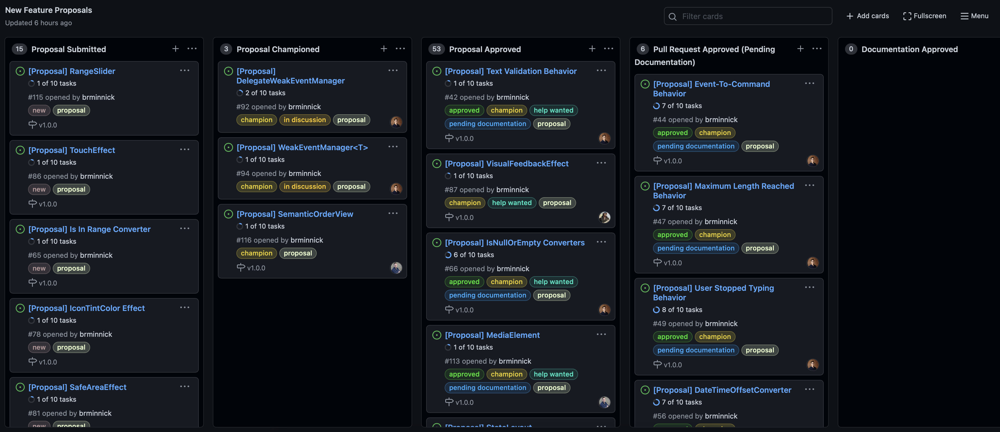
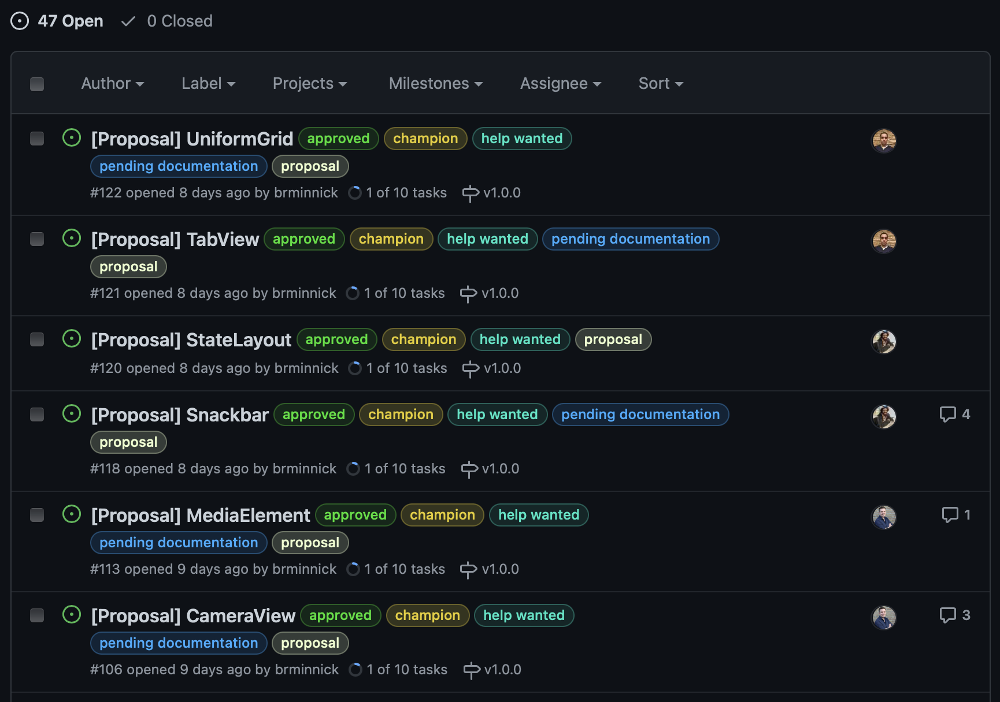

We recently [introduced the .NET MAUI Community Toolkit](https://devblogs.microsoft.com/dotnet/introducing-the-net-maui-community-toolkit-preview/?WT.mc_id=mobile-44689-bramin) and are now ready to accept community contributions!

We've revamped the [workflow for adding New Features](https://github.com/CommunityToolkit/Maui/projects/1) and are sharing it today to help facilitate your future contributions.

To keep track of the new workflow, we have created a [GitHub Project Board](https://github.com/CommunityToolkit/Maui/projects/1) where you can follow along:

## New Feature Workflow

The [**New Feature Workflow**](https://github.com/CommunityToolkit/Maui#submitting-a-new-feature) was heavily inspired by the [C# Team's current workflow](https://github.com/dotnet/csharplang#discussions), leaveraing their implementation of Discussions and Proposals.

### 1. Open A Discussion

All new features will start out as a [Discussion](https://github.com/CommunityToolkit/Maui/discussions).

This is where, as a community, we can chat about the pros + cons of a new feature, determine its scope, the shape of its API Surface, and come to a common agreement on its implementation.

### 2. Open a New Feature Proposal 

Once the implementation of a new feature has been agreed upon in its Discussion, it is time to [Submit a New Feature Proposal](https://github.com/CommunityToolkit/Maui/issues/new?assignees=&labels=new%2C+proposal&template=open-a-new-feature-proposal.md&title=%5BProposal%5D+).

The New Feature Proposals are fairly indepth, requiring the following information:
- Summary
- Detailed Design
- Usage Syntax
  - XAML Usage
  - C# Usage
- Drawbacks
- Alternatives
- Unresolved Questions

### 3. Proposal Champion

After a new proposal is opened, a member of the [.NET MAUI Community Toolkit team](https://github.com/orgs/CommunityToolkit/teams/maui) will then choose to be its Champion, meaning that team member agrees it should be included in the .NET MAUI Community Toolkit and they will present it at the next [.NET MAUI Community Toolkit Monthly Standup](https://www.youtube.com/watch?v=0ZBh2Hl54ZY) for a vote.

Each month we live-stream our standups on the [.NET Foundation YouTube Channel](https://www.youtube.com/channel/UCiaZbznpWV1o-KLxj8zqR6A) at 1200 PT where, amongst other things, we will vote on New Feature Proposals. If a Proposal receives greater than 50% approval from the core team, it is officially Approved!

### 4. Proposal Approved 

Once a proposal has been approved, it finally time to start writing code! 

At this stage, we will assign the proposal to any community member who would like to contribute towards it. 

Leave a comment on any proposal tagged [`help wanted`](https://github.com/CommunityToolkit/Maui/issues?q=is%3Aopen+is%3Aissue+label%3A%22help+wanted%22) and we will happily assign it you you!

We ask that each Pull Request include the following items before we merge it:
- Implementation
  - iOS Support
  - Android Support
  - macOS Support
  - Windows Support
- [Unit Tests](https://github.com/CommunityToolkit/Maui/tree/main/src/CommunityToolkit.Maui.UnitTests)
- [Sample](https://github.com/CommunityToolkit/Maui/tree/main/samples)
- XML Documentation

### 5. Pull Request Approved (Pending Documentation)

At this step, the code has been completed, including its Unit Tests, its XML Documentation and its inclusion in the [.NET MAUI Toolkit Sample App](https://github.com/CommunityToolkit/Maui/tree/main/samples).

The only thing preventing the PR from being merged now is the completion of its Official Documentation in the [Microsoft Docs GitHub Repository](https://github.com/MicrosoftDocs). Because the offical docs live in a different repo, we add the [`pending documentation` tag](https://github.com/CommunityToolkit/Maui/issues?q=is%3Aissue+is%3Aopen+label%3A%22pending+documentation%22) to ensure we always complete the docs.

We ask that the Pull Request Author also write the official documentation for the feature as you are the one who knows the feature best! Of course, we are always happy to review and edit your documentation if English isn't your primary language.

### 6. Documentation Approved

Once the documentation has been completed, it will be reviewed, approved and merged by a member of the .NET MAUI Community Toolkit team.

With the documentation completed, the Pull Request can be merged!

### 7. Complete

Finally! The Pull Request has been merged, officially adding your code to the .NET MAUI Community Toolkit!

## Approved Proposals: Help Wanted

The easiest way to start contributing to the .NET MAUI Community Toolkit is find an [Approved Proposal](https://github.com/CommunityToolkit/Maui/issues?q=is%3Aissue+is%3Aopen+label%3A%22help+wanted%22) with the [`help wanted`](https://github.com/CommunityToolkit/Maui/issues?q=is%3Aissue+is%3Aopen+label%3A%22help+wanted%22) tag. As of writing this blog post, we currently have 47 Open Approved Proposals that would love your contributions:

To be assigned an Approved Proposal, leave a comment on it letting us know that you'd like to do the work and we will assign it to you.

## Summary

The .NET MAUI Community Toolkit is very much a community effort! In fact, the [approved proposals](https://github.com/CommunityToolkit/Maui/issues?q=is%3Aissue+is%3Aopen+label%3A%22help+wanted%22) were all originally written by you, the community, for the [Xamarin Community Toolkit](https://github.com/xamarin/XamarinCommunityToolkit)!

While these libraries are built in collaboration with the .NET team at Microsoft, it is truly a community effort. The core team, [Andrei Misiukevich](https://twitter.com/Andrik_Just4Fun), [Pedro Jesus](https://twitter.com/pj_souz), [Gerald Versluis](https://twitter.com/jfversluis), [Javier Suárez](https://twitter.com/jsuarezruiz), and (myself) [Brandon Minnick](https://twitter.com/TheCodeTraveler), are here mostly to move things forward.

Your help and input is very much required. Whether that is through triaging issues, updating Docs, participating in discussions or writing code, we appreciate all of your help!

Get started by claiming your first Approved Proposal today: https://github.com/CommunityToolkit/Maui/issues?q=is%3Aissue+is%3Aopen+label%3A%22help+wanted%22
