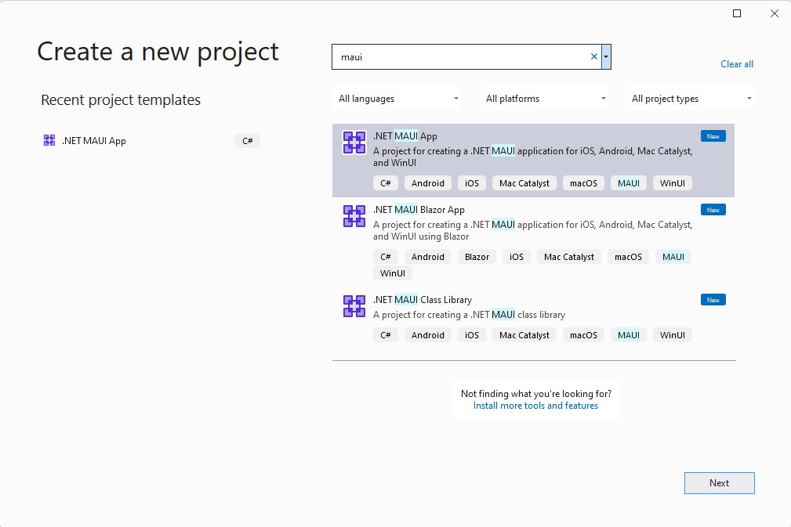

.NET Multi-platform App UI (MAUI) Preview 9 is available today with [.NET 6 RC2](https://devblogs.microsoft.com/dotnet/announcing-net-6-release-candidate-2/) and in the preview channel of [Visual Studio 2022 Preview 5](https://aka.ms/VS2022RC). While much of the work in this preview is focused on completing and stabilizing the 50+ controls and layouts, preview 9 adds support for borders and shadows across all controls and layouts. Preview 9 includes performance improvements to help Android apps start instantly.

> Roadmap news: as [Scott Hunter shared last month](https://devblogs.microsoft.com/dotnet/update-on-dotnet-maui/), .NET MAUI will continue releasing previews monthly as we make our way to a release candidate (RC) in the first quarter of 2022, and general availability (GA) in the second quarter of 2022.

## Updated Controls

New in this release are updated implementations of several controls. `BoxView` is a simple yet flexible and adaptive view that is useful for many needs. `IndicatorView` pairs with any collection based control to display an index of pagination using any shape you need. `ImageButton` is perfect for what you need a button that is just an image. `WebView` uses the platform native browser control to render any online or embedded HTML content; ideal for displaying markup more complex than the subset of HTML supported by `Label`.

More information:

* [BoxView](https://docs.microsoft.com/xamarin/xamarin-forms/user-interface/boxview)
* [IndicatorView](https://docs.microsoft.com/xamarin/xamarin-forms/user-interface/indicatorview)
* [ImageButton](https://docs.microsoft.com/xamarin/xamarin-forms/user-interface/imagebutton)
* [WebView](https://docs.microsoft.com/xamarin/xamarin-forms/user-interface/webview)

## Borders, Corners, and Shadows - Oh my!

The new `Microsoft.Maui.Graphics` library provides a consistent UI drawing API based on native graphics engines, and enables us to easily add borders, corner rendering, and beautiful shadows to most any layout or control in .NET MAUI.


The new `Border` control can wrap any layout or control to add borders and independent control of each corner. This controls is provided in the style of WPF, UWP, Silverlight, and the latest Windows App SDK. In this example I have wrapped a border control around the counter label in our default template to add the stroke and round the top-left and bottom-right corners.

```xaml
<Border 
    Grid.Row="2"
    Padding="16,8"
    Stroke="{StaticResource PrimaryBrush}"
    Background="#2B0B98"
    StrokeThickness="4"
    HorizontalOptions="Center">
    <Border.StrokeShape>
        <RoundRectangle CornerRadius="40,0,0,40"/>
    </Border.StrokeShape>
    <Label 
        Text=".NET MAUI Preview: 9"                
        FontSize="18"
        FontAttributes="Bold"
        TextColor="White"
        x:Name="CounterLabel" />
</Border>
```

The corner radius of the provided shape accepts a `Thickness` type value which enables independent control of each corner of the rectangle: top-left, top-right, bottom-left, bottom-right.

The border control does add a wrapping view element around a single content, so you can set a background color or padding as needed. Several other properties are available to customize the stroke of the border such as:

* StrokeDashArray: pattern of dashes and gaps in the stroke
* StrokeDashOffset: distance within the dash pattern  
* StrokeLineCap: shape at the end of a line
* StrokeLineJoin: type of join at the vertices
* StrokeMiterLimit: limit on the ration of the miter length to half of the stroke thickness

> In a future version we'll investigate adding a markup helper for setting the stroke shape directly rather than instantiating a shape.


Ready to add some depth to your UI? Add a `Shadow` to any layout or control, including images and shapes.  

```xaml
<Image>
    <Image.Shadow>
        <Shadow Brush="#000000" 
                Offset="20,20"
                Radius="40"/>
    </Image.Shadow>
</Image>
```

## Quick Android Startup

Ahead-of-time (AOT) compilation makes a big difference in how quickly your applications can code start on Android. Full AOT may also make your application artifacts larger than you wish if you're working to remain below the wifi installation bar. In this situation, Startup Tracing is the answer. By partially AOT'ing only the parts of your application executed during startup (by tracing the path of startup execution, hence the name), we are able to balance speed and size.

Preview 9 now ships with a .NET MAUI startup tracing profile. To enable it, open the project properties 

Benchmark numbers from Pixel 5 device tests:

|                                     |    [Android App][1] |     [.NET MAUI App][2] |
| ----------------------------------: | ------------------: | ----------------: |
|                JIT startup time (s) |   00:00.4387        | 00:01.4205        |
|          AOT startup time (vs. JIT) |   00:00.3317 ( 76%) | 00:00.7285 ( 51%) |
| Profiled AOT startup time (vs. JIT) |   00:00.3093 ( 71%) | 00:00.7098 ( 50%) |
|                 JIT `.apk` size (B) |    9,155,954        | 17,435,225        |
|           AOT `.apk` size (vs. JIT) |   12,755,672 (139%) | 44,751,651 (257%) |
|  Profiled AOT `.apk` size (vs. JIT) |    9,777,880 (107%) | 23,210,787 (133%) |

We have a [pull request](https://github.com/dotnet/maui/issues/2740) for making this the default profile for .NET MAUI applications built in release configuration.

> Jonathan Peppers also [found an additional 400ms improvement](https://github.com/dotnet/maui/pull/2606) by optimizing the Android resource designer file.

## Ecosystem Controls

[DevExpress](https://community.devexpress.com/blogs/mobile/archive/2021/09/30/net-maui-free-early-access-preview-of-data-editors-and-more-for-mobile-development-v21-2.aspx), [Syncfusion](https://www.syncfusion.com/blogs/post/introducing-the-first-set-of-syncfusion-net-maui-controls.aspx), and [Telerik](https://www.telerik.com/maui-ui) have recently all shipped new sets of controls for .NET MAUI, and are making use of the powerful graphics support provided in `Microsoft.Maui.Graphics`.


## Get Started Today

First thing's first, install Visual Studio 2022 Preview 5 and check .NET MAUI (preview) under the Mobile Development with .NET workload, and check the Universal Windows Platform development workload.

Now, install the Windows App SDK [Single-project MSIX extension](https://marketplace.visualstudio.com/items?itemName=ProjectReunion.MicrosoftSingleProjectMSIXPackagingToolsDev17). Before running the Windows target, remember to uncomment the framework in the csproj file.

Ready? Open Visual Studio 2022 and create a new project. Search for and select .NET MAUI.



For additional information about getting started with .NET MAUI, refer to our [documentation](https://docs.microsoft.com/dotnet/maui/get-started/installation).

If you are migrating a project from another preview, check out our migration notes in the [dotnet/maui wiki](https://github.com/dotnet/maui/wiki).

## Feedback Welcome

Visual Studio 2022 previews are rapidly enabling new features for .NET MAUI. As you encounter any issues with debugging, deploying, and editor related experiences, please use the Help > Send Feedback menu to report your experiences.

Please let us know about your experiences using .NET MAUI to create new applications by engaging with us on GitHub at [dotnet/maui](https://github.com/dotnet/maui).

For a look at what is coming in future releases, visit our [product roadmap](https://github.com/dotnet/maui/wiki/roadmap), and for a status of feature completeness visit our [status wiki](https://github.com/dotnet/maui/wiki/status).
