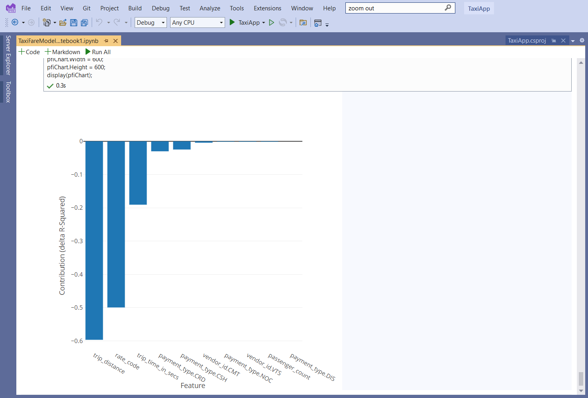
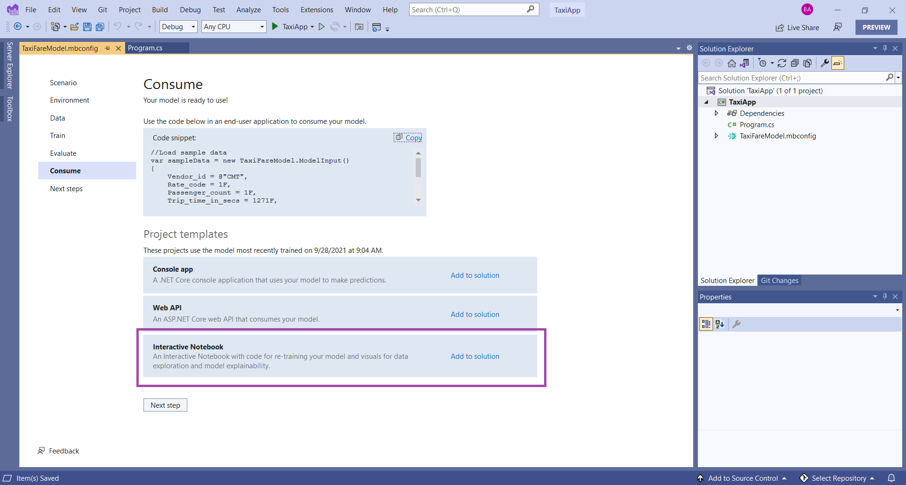
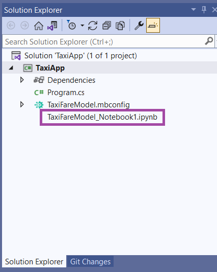
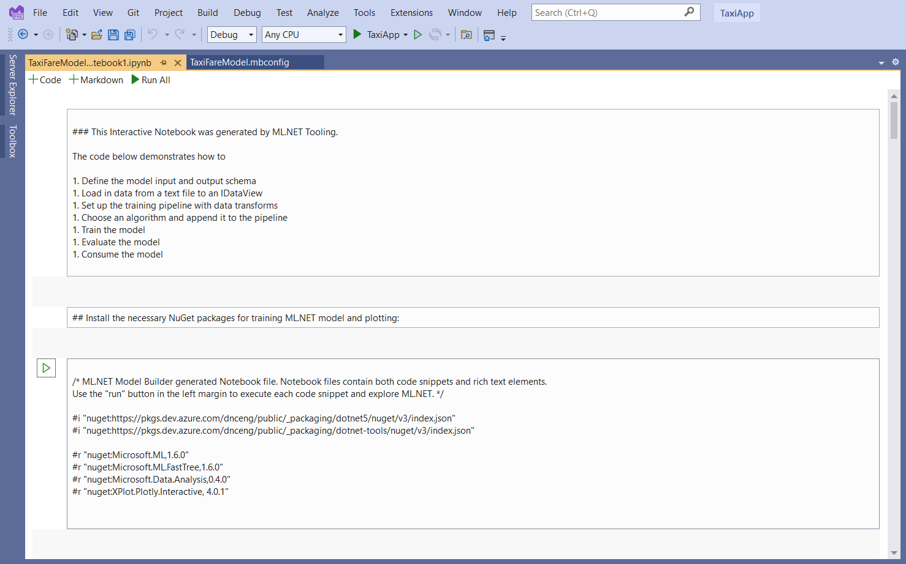
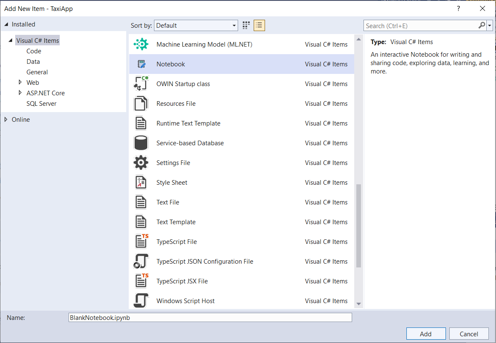
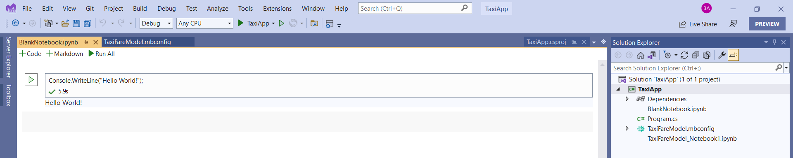

[ML.NET](https://dot.net/ml) is an open-source, cross-platform machine learning framework for .NET developers that enables integration of custom machine learning into .NET apps.

In this post, we'll cover the following items:

1. [Model Builder updates](#model-builder-updates)
2. [Progress on addressing ML.NET pain points](#progress-on-addressing-ml.net-pain-points)
3. [Get started and resources](#get-started-and-resources)

## Model Builder updates

### Notebook Editor in Visual Studio

Interactive Notebooks are used extensively in data science and machine learning. They are great for data exploration and preparation, experimentation, model explainability, and even education.

Last year, .NET Interactive Notebooks were [announced](https://devblogs.microsoft.com/dotnet/net-interactive-preview-3-vs-code-insiders-and-polyglot-notebooks/), and you can currently use .NET Interactive Notebooks in VS Code as an [extension](https://marketplace.visualstudio.com/items?itemName=ms-dotnettools.dotnet-interactive-vscode).

After talking to customers, the team decided to experiment with Interactive Notebooks in Visual Studio which has resulted in the new **Notebook Editor** extension!



#### Getting started with Notebook Editor

Notebook Editor is only available in Visual Studio 2022 starting with Preview 4 and is currently offered as an experimental (preview) extension.

To try it out, you should first:

1. Install Visual Studio 2022 Preview 4 (or newer).
2. Install the [Notebook Editor extension]( https://marketplace.visualstudio.com/manage/publishers/mlnet/extensions/notebook/) from the Visual Studio Marketplace.
3. Open your command line and install the `dotnet interactive` global tool with the following command:

    ```console
    dotnet tool install -g --add-source "https://pkgs.dev.azure.com/dnceng/public/_packaging/dotnet-tools/nuget/v3/index.json" Microsoft.dotnet-interactive
    ```

Then, there are two entry points to get started with Notebook Editor in Visual Studio.

The first entry point is from ML.NET Model Builder, where you can get a generated Notebook with content based on your own data and model.

To get a Notebook from Model Builder:

1. Install the latest version of [Model Builder](https://aka.ms/mb-2022) for VS 2022.
2. Train a model with Model Builder and go to the **Consume** step.
3. Under **Project templates**, add the **Interactive Notebook** to your solution.
    
4. Double click on the **.ipynb** file that is now in the **Solution Explorer** to open the Notebook in **Notebook Editor**.
    

The generated Notebook from Model Builder contains:

- The training pipeline for the model chosen by Model Builder so that you can see how your model was trained and easily re-train
- Plots and graphs for data exploration and model explainability techniques so that you can more easily understand and explain your data and model



The second entry point for Notebooks is to simply add a new Notebook from the **Add New Item** dialog.

1. Right click on your project in the **Solution Explorer**.
2. Select **Add > New Item…**
3. In the **Add New Item** dialog, select **Notebook** and add it to your project.
    

This creates a blank Notebook with no content. You can try adding some C# code and running a cell in the Notebook like this:



This is the first version of Notebooks in Visual Studio! If you have any feedback, issues, or questions about Notebook Editor or Notebooks in Visual Studio, please file an issue in our [GitHub repo](https://github.com/dotnet/machinelearning-modelbuilder/issues/new/choose).

### Consumption code improvements

After you train a model in Model Builder, the Consumption file is generated and added to your project. This Consumption file contains a Predict() method which you can use to make predictions with your model in your end-user application.

This method abstracts away several steps that are needed to consume an ML.NET model:

1. Initializing an MLContext
2. Loading the model
3. Creating a PredictionEngine
4. Using the PredictionEngine and the model to make the prediction on the input data

In the previously generated model consumption code, these steps all happened inside the Predict() method, meaning that these all happened every time the Predict() method was called. This resulted in decreased performance on each prediction.

So, we updated the code to make it a lot more efficient where all of these steps only happen once when using the Predict() method.

The new code is demonstrated below:

```csharp
public static ModelOutput Predict(ModelInput input)
{
    var predEngine = PredictEngine.Value;
    return predEngine.Predict(input);
}
        
private static PredictionEngine<ModelInput, ModelOutput> CreatePredictEngine()
{
    var mlContext = new MLContext();
    ITransformer mlModel = mlContext.Model.Load(MLNetModelPath, out var _);
    return mlContext.Model.CreatePredictionEngine<ModelInput, ModelOutput>(mlModel);
}
```

Read more about all of this month's updates in the [Release Notes](https://github.com/dotnet/machinelearning-modelbuilder/blob/main/docs/release-notes/16.7.3.2143002.md).

## Progress on addressing ML.NET pain points

As mentioned in the last ML.NET [blog post](https://devblogs.microsoft.com/dotnet/ml-net-june-updates-model-builder/#ml-net-survey-results), the following items were found as top pain points or blockers in this year's ML.NET customer development:

1. Small ML.NET Community
2. Afraid Microsoft will abandon the framework
3. Lack of / quality docs and samples
4. Lack of deep learning support
5. Specific ML scenario or algorithm not supported by ML.NET

Below we have outlined the steps we've taken so far and progress we've made in each area.

### Small ML.NET Community

The team continues to host the Machine Learning .NET Community Standup every other week to talk about what we're working on and to educate and engage with the community. We've also added a new story to the ML.NET Customer Showcase and are working on adding more.

We are also encouraging contributions to ML.NET. The [first good issue](https://github.com/dotnet/machinelearning/labels/good%20first%20issue) and [up-for-grab](https://github.com/dotnet/machinelearning/issues?q=is%3Aopen+is%3Aissue+label%3Aup-for-grabs) issues on GitHub are a great place to start!

Additionally, following the previous .NET monthly themes of F#, Razor, and IoT, October will be focused on machine learning! The team is currently planning out lots of machine learning and ML.NET content and is looking forward to working with the community on this.

### Afraid Microsoft will abandon the framework

ML.NET is .NET, and to make it feel more a part of .NET, we've decided to align with the .NET release schedule. This means that we will ship our next version of ML.NET (v1.7.0) with .NET 6.0 in November 2021 and will ship subsequent major releases (ML.NET 2.0, 3.0, etc.) with major releases of .NET. We will ship production-ready preview version releases in between so that we can continue adding new features to the framework throughout the year.

We are also taking steps to organize the [dotnet/machinelearning](https://github.com/dotnet/machinelearning) repo and keep it up to date. We are currently revising our triage processes so that we can address your issues and feedback faster. Issues will be linked to version releases in the [Projects](https://github.com/dotnet/machinelearning/projects) section of the repo so you can see what we're actively working on and when we plan to release.

Check out the [roadmap](https://github.com/dotnet/machinelearning/blob/main/ROADMAP.md) to see what we have planned for ML.NET this year.

### Lack of / quality docs and samples

We have invested more resources into content development to make sure our Docs stay up to date and that we add documentation for new features faster as well as add more relevant samples.

[@luisquintanilla](https://github.com/luisquintanilla) (Microsoft content developer) and [@jwood803](https://github.com/jwood803) (ML.NET community member and newly contracted docs/samples developer) have both been working hard to ensure that we increase the quality of ML.NET documentation. They have set several goals, including reducing the average days to close Docs issues and publishing documentation for new features no more than two weeks after a new feature is released.

In the past two months, 19 articles have been updated, and a new [article](https://docs.microsoft.com/dotnet/machine-learning/how-to-guides/label-images-for-object-detection-using-vott) on how to label images for object detection has been added. This month, the team is working on adding two new tutorials for image classification and recommendation in Model Builder to Docs as well as updating the samples to the newest version of ML.NET.

You can file issues and make suggestions for ML.NET documentation in the [dotnet/docs](https://github.com/dotnet/docs) repo and for ML.NET samples in the [dotnet/machinelearning-samples](https://github.com/dotnet/machinelearning-samples) repo.

### Lack of deep learning support

This past year we've been working on our plan for deep learning in .NET, and now we are ready to execute that plan to expand ML.NET's deep learning support.

As part of this plan, we will:

- Make it easier to consume ONNX models in ML.NET using the ONNX Runtime (RT)
- Fully support and productionize [TorchSharp](https://github.com/xamarin/TorchSharp) for building neural networks in .NET
- Build a bridge between TorchSharp and ML.NET

Read more about the deep learning plan and leave your feedback in this [tracking issue](https://github.com/dotnet/machinelearning/issues/5918).

### Specific ML scenario or algorithm not supported by ML.NET

We have added Named Entity Recognition to the [roadmap](https://github.com/dotnet/machinelearning/blob/main/ROADMAP.md) which has been a highly requested scenario since ML.NET was released.

The deep learning plan will also enable a variety of other scenarios so that you can train custom models for object detection, NLP tasks, and more in .NET.

If there is still a scenario or algorithm missing that is not covered in the roadmap, please let us know by [filing an issue](https://github.com/dotnet/machinelearning/issues/new?assignees=&labels=&template=suggest-a-feature.md&title=).

## Get started and resources

Learn more about ML.NET and Model Builder in [Microsoft Docs](https://aka.ms/mlnet-docs).

If you run into any issues, feature requests, or feedback, please file an issue in the [ML.NET API repo](https://github.com/dotnet/machinelearning) or the [ML.NET Tooling (Model Builder & ML.NET CLI) repo](https://github.com/dotnet/machinelearning-modelbuilder) on GitHub.

Join the [ML.NET Community Discord](https://aka.ms/virtual-mlnet-community-discord).

Tune in to the [Machine Learning .NET Community Standup](https://dotnet.microsoft.com/live/community-standup) every other Wednesday at 10am Pacific Time.
