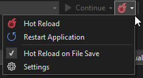
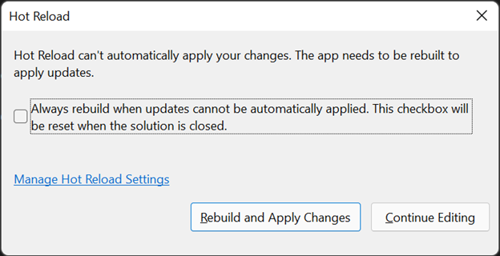

Earlier this year [we announced .NET Hot Reload](https://devblogs.microsoft.com/dotnet/introducing-net-hot-reload/), an ambitious project to bring Hot Reload to as many .NET developers as possible. We started this journey with a first preview available in Visual Studio 2019 and promised a lot more to come in Visual Studio 2022 where the full experience would ship. I am excited to use this blog post to update you on our progress towards this goal and all the wonderful features that are [coming November 8th, 2021](https://devblogs.microsoft.com/visualstudio/join-us-november-8th-for-the-launch-of-visual-studio-2022/) when we hit our GA release 🥳.

For anyone new to Hot Reload here is a quick introduction. The Hot Reload experience in Visual Studio works for both managed .NET and native C++ apps (fun fact, we did not originally plan to support C++ in the first release, but we got there!).

Regardless of the type of app you’re working on, our goal with Hot Reload is to save you as many app restarts between edits as possible, making you more productive by reducing the time you spend waiting for apps to rebuild, restart, re-navigate to the previous location where you were in the app itself, etc. We accomplish this by making it possible for you to edit your applications code files and apply those code changes immediately to the running application, also known as “Hot Reload”.

If you want to see some live demos of this feature you can check out one of these videos:

* [ASP.NET Community Standup (June 8, 2021)](https://youtu.be/8xLw-f1iFLw?t=1243)
* [.NET Desktop Community Standup (Sept 23rd, 2021)](https://youtu.be/DjNf_EfccAc?t=124)
* [.NET MAUI Community Standup (Oct 7th, 2021)](https://youtu.be/cEoSkHZlKa4?t=1988)

For the rest of this blog, we will deep dive into what’s new since our original announcement and cover just how far .NET Hot Reload the mechanism, our work in .NET 6 itself and the Visual Studio 2022 user experience has come.

Agenda:

* Supported App Frameworks and Scenarios for .NET developers, such as where Hot Reload can be used and through which startup experience
* Improvements to the core user experience in Visual Studio 2022
* What’s new for .NET MAUI and ASP.NET scenarios
* Additional supported edits for .NET apps
* Improvements to the end-to-end experience when using both XAML and .NET Hot Reload together in the same edit session (still in preview)
* How Hot Reload improves .NET 6 Unit Testing (experimental)
* An update to changes in Hot Reload support through `dotnet watch` CLI tool

Let’s jump in.

## Supported App Frameworks and Scenarios

Since we announced this feature back in May 2021 a very common question has been “will Hot Reload work with my .NET app combo (framework/version)?”, we’ve made huge progress to make the answer YES in most situations, in summary:

Since we announced this feature back in May 2021 a very common question has been “will Hot Reload work with my .NET app combo (framework/version)?”, we’ve made huge progress to make the answer YES in most situations, in summary:

* **When using Visual Studio 2022 and starting your app with the debugger** the basic Hot Reload experience works with most types of .NET apps and framework versions, this includes .NET Framework, .NET Core and .NET 5+ (for both C# and VB.NET as applicable). The type of apps that are supported include web (code-behind changes), desktop, mobile, cloud and other project types. The key rule here is if you’re using the debugger assume Hot Reload is available to you and give it a try!
* **When using Visual Studio 2022 but not using the debugger** (for example using CTRL-F5 to start the app) Hot Reload is now available even without the debugger when targeting most types of .NET 6 apps. This means that apps not targeting .NET 6 (.NET 5 or below) will not support the “no debugger” scenario and must use the debugger to get Hot Reload support. 
* **When using Visual Studio 2022 with a .NET 6 app, the most type of scenarios are supported.** This is not limited to simply the “no debugger” scenario mention above, it also includes support for project types such as .NET MAUI and Blazor and more generally editing Razor files and CSS Hot Reload in ASP.NET apps. It also includes other minor optimizations in additional app frameworks. Using both Visual Studio 2022 and updating your apps to .NET 6 will definitively give you the most powerful Hot Reload experience and we hope you will give it a try.

While I hope the above summary is helpful, there are many details that are worth discussing so let’s go deeper.

### Visual Studio 2022 when using the debugger

When using Visual Studio 2022 and starting the app with the debugger Hot Reload works with most app frameworks, including typical app types such as Console, Windows Forms (WinForms), WPF, UWP, WinUI 3* and most types of ASP.NET web projects (for code-behind edits) including ASP.NET MVC, Web API and even older Web Forms projects. This list is also just an example. The real answer is anywhere you have .NET and you’re using the Visual Studio managed debugger, you should get basic Hot Reload support.

This means that even projects such as Azure Functions will work great in this scenario. We encourage you to try your combination and let us know if you find any problems.

_*WinUI 3 by default uses mixed mode debugging which does not support Hot Reload. You can modify this in project settings by enabling the Managed Debugger which will enable Hot Reload to work properly._

### When using Visual Studio 2022 but not using the debugger

Hot Reload is now available without the debugger when targeting most types of .NET 6 apps, including project types such as Console, WPF, Windows Forms (WinForms), ASP.NET Core MVC, APIs and Blazor. We know some developers have good reason or preference to start their apps without the debugger and we hope this extra feature will give them value for little to no impact on startup time.

This feature is exclusive to .NET 6+ and those apps not targeting .NET 6 (.NET 5 or below) will not support the “no debugger” scenario and must use the debugger to get access to Hot Reload functionality.

Also be aware that not all project types will be supported for the “no debugger” scenario in our first release. Specifically:

* .NET MAUI and WinUI 3 apps will continue to only work with Hot Reload when using the debugger. We do hope to improve this situation in a future release, but don’t have an exact timeline. 
* UWP app also not supported for Hot Reload without the debugger, this is by design and there are no current plans to improve this.

### When using Visual Studio 2022 with a .NET 6 app, the most type of scenarios are supported

Developers who are able to use both Visual Studio 2022 and work on apps that target .NET 6 will get the benefits of the most polished and capable Hot Reload experience.

Highlights of what is supported:

* .NET MAUI apps (iOS, Android and WinUI), including both regular .NET MAUI and .NET MAUI Blazor Hybrid apps
* Blazor apps (Server and WebAssembly*)
* Razor file editing in both Blazor and regular ASP.NET Core websites
* CSS Hot Reload
* Ability to get Hot Reload support when running apps without the debugger (as described above in more detail)

Developers targeting .NET 6 will continue to get more improvements in future Visual Studio 2022 updates and .NET feature band and major releases. We’re just getting started!

_*In Visual Studio 2022 GA release Hot Reload support for Blazor WebAssembly when using the Visual Studio debugger isn’t enabled yet. You can still get Hot Reload If you start your app through Visual Studio without the debugger, and we are working to resolve this in the next Visual Studio update._

### Unsupported Scenarios

Even in the final release there will still be some unsupported scenarios that you should be aware of:

* Xamarin.Forms apps won’t support Hot Reload in iOS and Android scenarios. You will get some Hot Reload when targeting a UWP app. This is by design, and we don’t expect to make any further improvements
* Apps built using F# or those targeting .NET Native will not support Hot Reload
There are other minor known limitations and we’ll be publishing some GitHub issues and docs with more details in the coming weeks.

## Improved User Experience in Visual Studio 2022

The Hot Reload experience for both .NET (and C++ developers) in Visual Studio 2022 has also undergone major improvements. The toolbar now has the target implementation of our “Hot Reload” button with improved look and more functionality. 

The first thing you will notice is the new drop-down style button with a new icon (yes, it’s our 3rd attempt at locking this visual down 😊). The command is renamed from “apply code changes” to “Hot Reload”.

 

Expanding the buttons reveals easy access to features such as restart running application(s), a toggle for Hot Reload on save, and quick access to the new settings panel.

Here are more details on each of the new features:

* **Restart Applications Easily:** You can now easily restart your running application if a rude edit needs to be applied through a rebuild regardless of whether you started your app using the debugger or if you started it without the debugger (NEW for .NET 6 apps!).
* **Hot Reload on Save:** In previous releases you could only apply Hot Reload changes on save in ASP.NET projects, for every other project you had to explicitly click the Hot Reload button. With recent improvements it is now possible to Hot Reload for any project type by simply pressing save. This new feature is opt-in, and once enabled will apply to all your sessions unless you turn it off.
* **Easy Settings Access:** In this release we’ve also added a Hot Reload settings panel to give you more control when Hot Reload is enabled/disabled. You can reach these settings in Visual Studio “Options > .NET / C++ Hot Reload” or through the Hot Reload buttons dropdown menu by clicking on Settings.

We’ve also added an improved rude edit dialog that is available when running your app without the debugger.

 

This new UI has multiple improvements such as:

* A Visual Studio session wide option to Rebuild and Apply Changes on each Hot Reload rude edit. Once checked this applies until Visual Studio is restarted
* A rebuild and apply your code changes command that can be accomplished with a single click, instead of multiple manual steps
* And easy access to settings

The dialog also lets you continue editing if you don’t want to take any automated action as was previously possible.

There is one known limitation, this new dialog won’t be available in the GA release when using the debugger, but the work will be completed in a future update.

## Support for .NET MAUI iOS/Android scenarios and improvements for ASP.NET developers

### Expanded Hot Reload availability in mobile scenarios for .NET MAUI apps

We’ve made big progress for .NET MAUI apps beyond the initial ability to use Hot Reload when running as a WinUI desktop application. With recent updates it is possible to go beyond Windows as .NET MAUI apps can now be Hot Reloaded when running them as iOS/tvOS or Android app when using the Visual Studio 2022 debugger and targeting .NET 6. This works when your apps are in a debug configuration with the Interpreter turned on (on by default in new templates). 

This feature works for both .NET MAUI and .NET MAUI Blazor hybrid apps, though there are some limitations (listed below). For those building .NET MAUI apps with XAML you can also use XAML Hot Reload alongside .NET Hot Reload, making it possible to change the apps look and feel and its code-behind in the same debug session. There are still a few edges to this experience, and we will continue to refine it, such as ensuring this pattern works well in MVVM scenarios.

As .NET MAUI is [not shipping GA this November](https://devblogs.microsoft.com/dotnet/update-on-dotnet-maui/), all tooling related is also not considered GA and we are working to finish all the required work aligned with the .NET MAUI release itself.

Known issues and limitations:

* In Android and iOS/tvOS scenarios when Mono is the runtime it is only possible to edit method bodies and make changes to those methods. In .NET 6 this will be a limitation for any platform where Mono is the runtime, and a greater number of edits are supported when using the CoreCLR runtime (example: .NET MAUI app running as a WinUI 3 app).
* For .NET MAUI Blazor apps Hot Reload will not yet automatically refresh the view and CSS Hot Reload is not yet available. These are known issues and are being worked on for future releases.
* When building a .NET MAUI App with XAML and using the MVVM pattern, some scenarios still won’t work perfectly. An example of this is using .NET Hot Reload (in a WinUI 3 app) to create a new property in a ViewModel, followed by using XAML Hot Reload to bind to it is not fully reliable. We’re working to enable these scenarios for the final release.

### Improved support for ASP.NET scenarios

We now support additional capabilities for ASP.NET developers targeting .NET 6, improvements include:

* CSHTML: Editing a Razor CSHTML file will now support many more types of edits.
* Browser Refresh: Editing a razor file will now automatically refresh the changes in your web browser when debugging. This was previously only available when starting the app without the debugger.
* CSS Hot Reload: It is now possible to change CSS files while the app is running, and changes will be applied immediately to the running app as you type.

With all these capabilities in place .NET 6, developers can now Hot Reload almost any type of .NET Code (in code-behind or Razor pages) in both ASP.NET Core and Blazor projects. This works when using both the Visual Studio debugger and when running your app without the debugger. Blazor Wasm being the one exception that only works today when launching your app without the debugger, but we will fix this in a future update as previously mentioned.

## Additional Supported .NET Edits

We’ve also made general improvements to support additional types of edits, both when using Hot Reload and the Edit and Continue experience.

Specifically, it is now possible to edit code that uses any of the new C# 10 features, such as global using directives, file scoped namespaces, improved lambdas and parameter-less struct constructors.

In addition, it is also now possible to rename method and local function parameters.

## XAML end-to-end experience (preview)

With the introduction of .NET Hot Reload we’re making a series of improvements over time to enable the smoothest possible experience when using both XAML and .NET Hot Reload technologies together in this same debug session.

The following scenarios are possible if you are using Visual Studio 2022 in a Preview channel and have opted into the required setting (see below).

For WPF and WinUI 3 apps:

* XAML code editor will now properly show newly created control types and properties created by a .NET Hot Reload operation in IntelliSense.
* Binding to a newly created property using .NET Hot Reload will now work as expected. For WinUI 3, you can also now use x:Bind to bind to a new property.

For WPF apps:

* Adding a newly created method for an event handler created using .NET Hot Reload will now work.

While the above scenarios work if the types are first applied using .NET Hot Reload and then XAML Hot Reload is used, there is a known limitation. For example, if you try to bind to a new property using XAML Hot Reload to a property that has not yet been created and only then use .NET Hot Reload to create it, the XAML mechanism will not see the new property. We are aware of this issue and hope to improve it in the future.

To help us test these new features, make sure you turn on the preview flag under “Options > Preview Features > XAML IntelliSense updates after .NET Hot Reload”.

While This feature won’t be ready in time for Visual Studio 2022 GA in November, we will continue to make this option available in our preview channel and we hope to see this go live in the next few update releases.

## Test Execution with Hot Reload (experimental)

Running tests from the Test Explorer in Visual Studio has always resulted in building the relevant test projects before test execution if changes have occurred. This is because the binaries on disk need to be up to date when picked up by the test runner (vstest.console). With the addition of Hot Reload in Visual Studio 2022, we are now able receive the benefit of this technology for test scenarios enabling us to skip the expensive build step when [supported edits](https://github.com/dotnet/roslyn/blob/296e0fada42f241d338b169c3c6c6189101ef0b7/docs/wiki/EnC-Supported-Edits.md) are made in the editor. We achieve this by tracking the edits made in Visual Studio and executing the test runner with old binaries that are patched with the new updates, which in most cases leads to faster test execution.

This feature is still experimental, and we are working to make this broadly available (and on by default) in the future. For now, you can choose to opt-in to using this feature by going into options and enabling the following setting: Tools > Options > Test > "(Experimental) Enable Hot Reloaded Test Runs for C# and VB test projects targeting .NET 6 and higher". 

Once the option is enabled, Test Explorer will automatically use test execution with Hot Reload with .NET 6 projects. If a Hot Reload is not possible, it will fall back to the regular behavior of building and running tests. 

You can learn more about this feature by reading our docs: [https://aka.ms/TestExecutionWithHotReload](https://aka.ms/TestExecutionWithHotReload)

## Update to Hot Reload support through dotnet watch

Throughout the last year we’ve been working to enable the best possible Hot Reload experience in Visual Studio 2022 and .NET 6. Part of our goal was to also explore making this feature available to customers through a variety of mechanisms such as bringing the full power of Hot Reload to as many .NET and C++ developers as possible when running through Visual Studio 2022 debugger, supporting Hot Reload when running .NET 6 apps without the debugger, and the very basic Hot Reload support we added to the .NET SDK tools through `dotnet watch`.

As we reflect on what was accomplished, and what is still in front of us, the backlog continues to grow. This includes many high value scenarios that will benefit the broadest number of developers, including focus areas such as .NET MAUI, Blazor, adding support more types of edits, more optimized experience when working with XAML apps, and much more.

With these considerations, we’ve decided that starting with the upcoming .NET 6 GA release, we will enable Hot Reload functionality only through Visual Studio 2022 so we can focus on providing the best experiences to the most users. We’ll also continue to pursue adding Hot Reload to Visual Studio for Mac in a future release.

## Your Feedback Matters

As we’ve said in previously blog post, your feedback continues to really help us build better products and Hot Reload is no exception. We really appreciate you taking the time to try our newest feature and we hope you will report problems using the Visual Studio feedback mechanism.

Thank you!