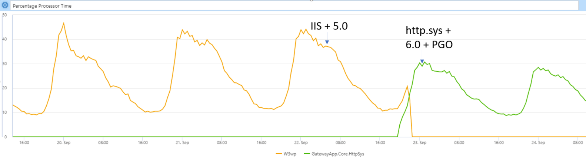

Azure Active Directory’s gateway service is a reverse proxy that fronts hundreds
of services that make up Azure Active Directory (Azure AD). If you’ve used
services such as office.com, outlook.com, portal.azure.com or xbox.live.com,
then you’ve used Azure AD’s gateway. The gateway provides features such as TLS
termination, automatic failovers/retries, geo-proximity routing, throttling, and
tarpitting to services in Azure AD. The gateway is present in 54 Azure
datacenters worldwide and serves __~185 Billion__ requests each day. Up until
recently, Azure AD’s gateway was running on .NET 5.0. As of September 2021, it’s
running on .NET 6.0.

## Efficiency gains by moving to .NET 6.0

The below image shows that application CPU utilization dropped by __33%__ for
the same traffic volume after moving to .NET 6.0 on our production fleet.



The above meant that our application efficiency went up by __50%__. Application
efficiency is one of the key metrics we use to measure performance and is
defined as 

```xml
Application efficiency = (Requests per second) / (CPU utilization of application)
```
## Changes made in .NET 6.0 upgrade

Along with the .NET 6.0 upgrade, we made two major changes:

1. Migrated from IIS to [HTTP.sys
   server](https://docs.microsoft.com/aspnet/core/fundamentals/servers/httpsys).
   This was made possible by new features in .NET 6.0.
2. Enabled dynamic
   [PGO](https://devblogs.microsoft.com/dotnet/conversation-about-pgo/)
   (profile-guided optimization).  This is a new feature of .NET 6.0.

The following sections will describe each of those changes in more detail.

## Migrating from IIS to HTTP.sys server

There are 3 server options to pick from in ASP.NET Core:

* Kestrel
* HTTP.sys server
* IIS

A previous [blog
post](https://devblogs.microsoft.com/dotnet/azure-active-directorys-gateway-service-is-on-net-core-3-1)
describes why Azure AD gateway chose IIS as the server to run on during our .NET
Framework 4.6.2 to .NET Core 3.1 migration. During the .NET 6.0 upgrade, we
migrated from IIS to HTTP.sys server. Kestrel was not chosen due to the lack of
certain [TLS](https://github.com/dotnet/runtime/issues/45456)
[features](https://github.com/dotnet/runtime/issues/60949) our service depends
on (support is expected by June 2022 in Windows Server 2022).

By migrating from IIS to HTTP.sys server, Azure AD gateway saw the following
benefits:

1. A **27%** increase in application efficiency.
2. _Deterministic queuing model_: HTTP.sys server runs on a single-queue system,
   whereas IIS has an internal queue on top of the HTTP.sys queue. The
   double-queue system in IIS results in unique performance problems (especially
   in high concurrency situations, although issues in IIS can potentially be
   offset by tweaking
   `HKLM:\SYSTEM\CurrentControlSet\Services\W3SVC\Performance\ReceiveRequestPending`
   in the Windows registry). By removing IIS and moving to a single-queue system
   on HTTP.sys, queuing issues that arose due to rate mismatches in the
   double-queue system disappeared as we moved to a deterministic model.
3. _Improved deployment and autoscale experience_: The move away from IIS
   simplifies deployment since we no longer need to install/configure IIS and
   [ANCM](https://docs.microsoft.com/aspnet/core/host-and-deploy/aspnet-core-module)
   before starting the website. Additionally, TLS configuration is easier and
   more resilient as it needs to be specified at just one layer (Http.sys)
   instead of two as it had been with IIS.

The following showcase some of the changes that were made while moving from IIS
to HTTP.sys server:

### 1. TLS renegotiation

Renegotiation provides the ability to do optional client certificate negotiation
based on HTTP constructs such as request path.

  Example: On IIS, during the initial TLS handshake with the client, the server
  can be configured to not request a client certificate. However, if the path
  of the request contains, say "foo", IIS triggers a TLS renegotiation and
  requests a client certificate.

  The following web.config configuration in IIS is how path based TLS
  renogotiation is enabled on IIS:

  ```xml
  <location path="foo">
      <system.webServer>
        <security>
          <access sslFlags="Ssl, SslNegotiateCert, SslRequireCert"/>
        </security>
      </system.webServer>
  </location>
  ```

In HTTP.sys server hosting (.NET 6.0 and up), the above configuration is
expressed in code by calling
[GetClientCertificateAsync()](https://docs.microsoft.com/dotnet/api/microsoft.aspnetcore.http.connectioninfo.getclientcertificateasync)
as below.

```csharp
  // default renegotiate timeout in http.sys is 120 seconds.
  const int RenegotiateTimeOutInMilliseconds = 120000;
  X509Certificate2 cert = null;
  if (httpContext.Request.Path.StartsWithSegments("foo"))
  {
    if (httpContext.Connection.ClientCertificate == null)
    {
      using (var ct = new CancellationTokenSource(RenegotiateTimeOutInMilliseconds))
      {
        cert = await context.Connection.GetClientCertificateAsync(ct.Token);
      }
    }
  }
```

In order for `GetClientCertificateAsync()` to trigger a renegotiation, the
following setting should be set in
[HttpSysOptions](https://docs.microsoft.com/dotnet/api/microsoft.aspnetcore.server.httpsys.httpsysoptions)

```csharp
options.ClientCertificateMethod = ClientCertificateMethod.AllowRenegotation;
```

### 2. Mapping IIS Server variables

* On IIS, TLS information such as `CRYPT_PROTOCOL`, `CRYPT_CIPHER_ALG_ID`,
  `CRYPT_KEYEXCHANGE_ALG_ID` and `CRYPT_HASH_ALG_ID` is obtained by [Server
  variables](https://docs.microsoft.com/iis/web-dev-reference/server-variables)
  and can be leveraged as shown
  [here](https://www.microsoft.com/security/blog/2017/09/07/new-iis-functionality-to-help-identify-weak-tls-usage/).
* On HTTP.sys server, equivalent information is exposed via
  [ITlsHandshakeFeature's](https://docs.microsoft.com/dotnet/api/microsoft.aspnetcore.connections.features.itlshandshakefeature)
  `Protocol`, `CipherAlgorithm`, `KeyExchangeAlgorithm` and `HashAlgorithm`
  respectively.

### 3. Ability to interpret non-ASCII headers

The gateway receives millions of headers each day with non-ASCII characters in
them and the ability to interpret non-ASCII headers is important. Kestrel and
IIS already have this ability, and in .NET 6.0, Latin1 request header encoding
[was added for HTTP.sys](https://github.com/dotnet/aspnetcore/issues/34330) as
well. It can be enabled using `HttpSysOptions` as shown below.

```csharp
options.UseLatin1RequestHeaders = true;
```

### 4. Observability

In addition to [.NET
telemetry](https://docs.microsoft.com/dotnet/core/diagnostics/available-counters),
the health of a service can be monitored by plugging into a wealth of
[telemetry](https://docs.microsoft.com/windows/win32/http/scenario-3--performance-counters)
exposed by HTTP.sys such as:

* `Http Service Request Queues\ArrivalRate`
* `Http Service Request Queues\RejectedRequests`
* `Http Service Request Queues\CurrentQueueSize`
* `Http Service Request Queues\MaxQueueItemAge`
* `Http Service Url Groups\ConnectionAttempts`
* `Http Service Url Groups\CurrentConnections`

## Enabling Dynamic PGO (profile-guided optimization)

[Dynamic
PGO](https://devblogs.microsoft.com/dotnet/announcing-net-6-release-candidate-1/#dynamic-pgo)
is one the most exciting features of .NET 6.0! PGO can benefit .NET 6.0
applications by maximizing <em>steady-state</em> performance.

Dynamic PGO is a opt-in feature in .NET 6.0. There are 3 environment variables
you need to set to enable dynamic PGO:

1) `set DOTNET_TieredPGO=1`. This setting leverages initial Tier0 compilation of
   methods to observe method behavior. When methods are rejitted at Tier1, the
   information gathered from the Tier0 executions is used to optimize the Tier1
   code. Enabling this switch increased our application efficiency by __8.18%__
   compared to plain .NET 6.0.

2) `set DOTNET_TC_QuickJitForLoops=1`. This setting enables tiering for methods
   that contain loops. Enabling this switch (in conjunction with above switch)
   increased our application efficiency by __10.2%__ compared to plain .NET 6.0.

3) `set DOTNET_ReadyToRun=0`. The core libraries that ship with .NET come with
   ReadyToRun enabled by default. ReadyToRun allows for faster startup because
   there is less to JIT compile, but this also means code in ReadyToRun images
   doesn't go through the Tier0 profiling process which enables dynamic PGO. By
   disabling ReadyToRun, the .NET libraries also participate in the dynamic PGO
   process. Setting this switch (in conjunction with the two above) increased
   our application efficiency by __13.23%__ compared to plain .NET 6.0.

## Learnings

* There were a few `SocketsHttpHandler` changes in .NET 6.0 that surfaced as
  issues in our service. We worked with the .NET team to identify workarounds
  and improvements.
    * New connection attempts that fail [can impact HTTP multiple
      requests](https://github.com/dotnet/runtime/issues/60654) in .NET 6.0,
      whereas a failed connection attempt would only impact a single HTTP
      request in .NET 5.0.
        * Workaround : Setting a
          [ConnectTimeout](https://docs.microsoft.com/dotnet/api/system.net.http.socketshttphandler.connecttimeout)
          slightly lower than HTTP request timeout ensures .NET 5.0 behavior is
          maintained. Alternatively, disposing the underlying handler on a
          failure also ensures only a single request is impacted due to a
          connect timeout (although this can be expensive depending on the size
          of the connection pool, please be sure to measure for your scenario).          
    * Requests that fail due to RST packets are [no longer automatically
      retried](https://github.com/dotnet/runtime/issues/60644) in .NET 6.0 and
      this results in an elevated rate of `An existing connection was forcibly
      closed by the remote host` exceptions bubbling up to the application from
      HttpClient.
        * Workaround : The application can add retries on top of HttpClient for
          idempotent requests. Additionally, if RST packets are due to idle
          timeouts, setting
          [PooledConnectionIdleTimeout](https://docs.microsoft.com/dotnet/api/system.net.http.socketshttphandler.pooledconnectionidletimeout)
          to lower than the idle timeout of the server will help eliminate RST
          packets due to idle connections.
* `HttpContext.RequestAborted.IsCancellationRequested` had inconsistent behavior
  on HTTP.sys compared to other servers and has been
  [fixed](https://github.com/dotnet/aspnetcore/issues/35407) in .NET 6.0.
* Client side disconnects were [noisy on HTTP.sys
  server](https://github.com/dotnet/aspnetcore/issues/35490) and there was a
  [race condition](https://github.com/dotnet/aspnetcore/pull/35401) that was
  triggered while trying to set StatusCode on a disconnected request. Both have
  been fixed in .NET 6.0.

## Summary

Every new release of .NET has [tremendous performance
improvements](https://devblogs.microsoft.com/dotnet/performance-improvements-in-net-6/)
and there is a huge upside to migrating to the latest version of .NET. For Azure
AD gateway, we look forward to trying out newer APIs specific to .NET 6.0 for
even bigger wins and further enhancements in .NET 7.0.
