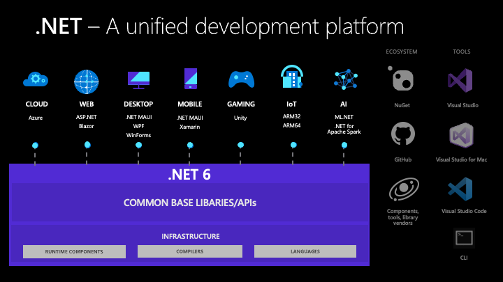
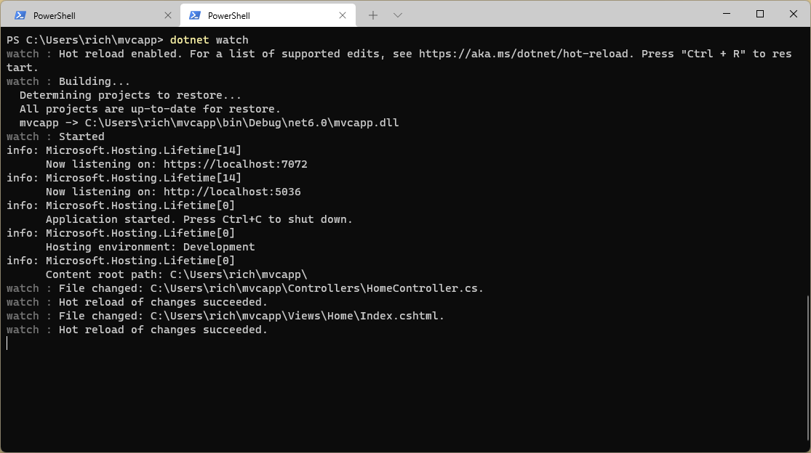
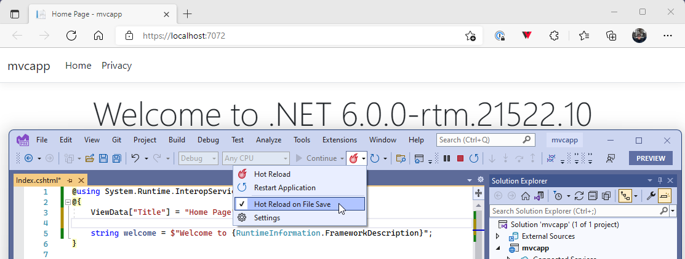
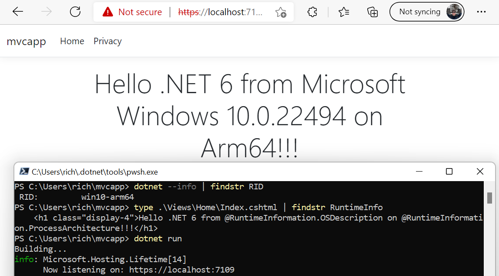
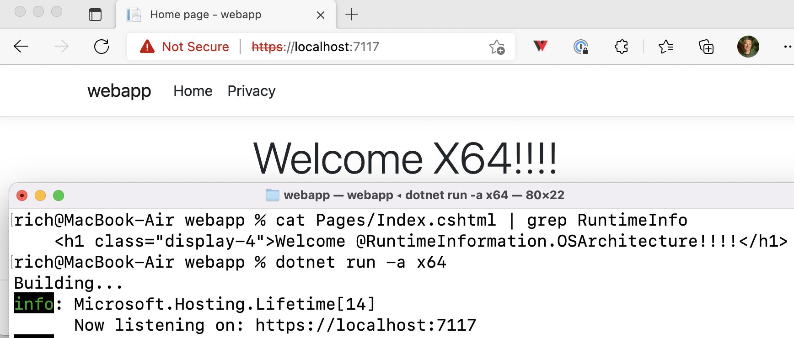
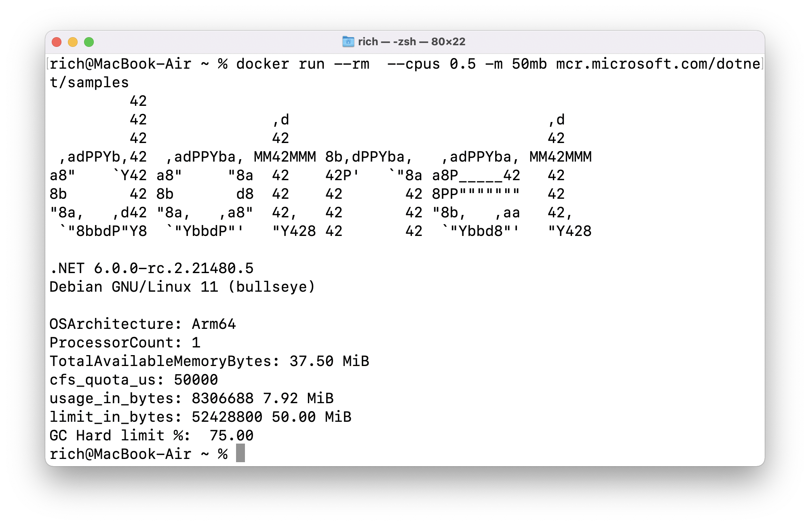
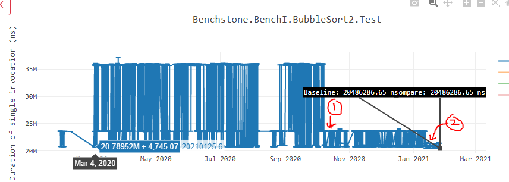

Welcome to .NET 6. Today's release is the result of just over a year's worth of effort by the .NET Team and community. C# 10 and F# 6 deliver language improvements that make your code simpler and better. There are [massive gains in performance](https://devblogs.microsoft.com/dotnet/performance-improvements-in-net-6/), which we've seen dropping the cost of hosting cloud services at Microsoft. .NET 6 is the first release that natively supports Apple Silicon (Arm64) and has also been improved for Windows Arm64. We built a new dynamic profile-guided optimization (PGO) system that delivers deep optimizations that are only possible at runtime. Cloud diagnostics have been improved with [dotnet monitor](https://devblogs.microsoft.com/dotnet/whats-new-in-dotnet-monitor/) and [OpenTelemetry](https://devblogs.microsoft.com/dotnet/opentelemetry-net-reaches-v1-0/). WebAssembly support is more capable and performant. New APIs have been added, for [HTTP/3](https://devblogs.microsoft.com/dotnet/http-3-support-in-dotnet-6/), [processing JSON](https://devblogs.microsoft.com/dotnet/try-the-new-system-text-json-source-generator/), [mathematics](https://devblogs.microsoft.com/dotnet/preview-features-in-net-6-generic-math/), and directly manipulating memory. .NET 6 will be [supported for three years](https://github.com/dotnet/core/blob/main/releases.md). Developers have already started upgrading applications to .NET 6 and we've heard great early results in production. .NET 6 is ready for your app.

You can [download .NET 6](https://dotnet.microsoft.com/download/dotnet/6.0) for Linux, macOS, and Windows.

* [Installers and binaries](https://dotnet.microsoft.com/download/dotnet/6.0)
* [Container images](https://hub.docker.com/_/microsoft-dotnet)
* [Linux packages](https://github.com/dotnet/core/blob/main/release-notes/6.0/install-linux.md)
* [Release notes](https://github.com/dotnet/core/blob/main/release-notes/6.0/README.md)
* [API diff](https://github.com/dotnet/core/blob/main/release-notes/6.0/preview/api-diff/rc1/README.md)
* [Known issues](https://github.com/dotnet/core/blob/main/release-notes/6.0/known-issues.md)
* [GitHub issue tracker](https://github.com/dotnet/core/issues/6795)

See the [.NET MAUI](https://devblogs.microsoft.com/dotnet), [ASP.NET Core](https://devblogs.microsoft.com/aspnet/), and [EF Core](https://devblogs.microsoft.com/dotnet) posts for more detail on what’s new for client, web, and data access scenarios.

Visual Studio 2022 is also releasing today. [Read the announcement](https://aka.ms/vs2022gablog) and [watch the launch event](https://visualstudio.microsoft.com/launch/) to learn more about the release.

[PowerShell 7.2](https://devblogs.microsoft.com/powershell/general-availability-of-powershell-7-2) is also releasing today, built on .NET 6. PowerShell users get access to the same performance improvements and APIs as .NET developers.

[.NET Conf](https://dotnetconf.net) is a free, three-day, virtual developer event that celebrates the major releases of .NET.  It starts tomorrow and runs November 9-11 featuring speakers from our team, teams at Microsoft, and the broader community with over 80 sessions. [Tune in to learn and engage with us](https://dotnetconf.net).

Check out the new [conversations posts](https://devblogs.microsoft.com/dotnet/category/conversations/) for in-depth engineer-to-engineer discussions on the latest .NET features.

## .NET 6 Highlights

.NET 6 is:

* **Production stress-tested** with Microsoft services, [cloud apps run by other companies](https://twitter.com/nycdotnet/status/1438970921302347778), and open [source projects](https://github.com/jellyfin/jellyfin/pull/6695).
* **Supported for three years** as the latest [long term support (LTS) release](https://github.com/dotnet/core/blob/main/releases.md).
* **Unified platform** across [browser](https://github.com/dotnet/aspnetcore/tree/main/src/Components), [cloud](https://github.com/dotnet/aspnetcore), [desktop](https://github.com/dotnet/winforms), [IoT](https://github.com/dotnet/iot/), and [mobile apps](https://github.com/dotnet/maui), all using the same .NET Libraries and the ability to share code easily.
* **Performance** is [greatly improved across the board](https://devblogs.microsoft.com/dotnet/performance-improvements-in-net-6/) and for [file I/O in particular](https://devblogs.microsoft.com/dotnet/file-io-improvements-in-dotnet-6/), which together result in decreased execution time, latency, and memory use.
* **C# 10** [offers language improvements](https://devblogs.microsoft.com/dotnet/welcome-to-csharp-10) such as record structs, implicit using, and new lambda capabilities, while the compiler adds incremental source generators.
 **F# 6** adds new features including [Task based async, pipeline debugging and numerous performance improvements](https://aka.ms/fsharp-6-release).
* **Visual Basic** has improvements in the [Visual Studio experience and for Windows Forms project open experience](https://devblogs.microsoft.com/dotnet/whats-new-for-visual-basic-in-visual-studio-2022).
* **Hot Reload** enables you to skip rebuilding and restarting your app to view a new change -- while your app is running -- supported in Visual Studio 2022 and from the .NET CLI, for C# and Visual Basic.
* **Cloud diagnostics** have been improved with [OpenTelemetry](https://devblogs.microsoft.com/dotnet/opentelemetry-net-reaches-v1-0/) and [dotnet monitor](https://devblogs.microsoft.com/dotnet/whats-new-in-dotnet-monitor/), which is now supported in production and available with Azure App Service.
* **JSON APIs** are [more capable](https://devblogs.microsoft.com/dotnet/try-the-new-system-text-json-source-generator/) and have higher performance with a source generator for the serializer.
* **Minimal APIs** introduced in ASP.NET Core to [simplify the getting started experience](https://www.hanselman.com/blog/exploring-a-minimal-web-api-with-aspnet-core-6) and improve the performance of HTTP services.
* **Blazor** [components can now be rendered from JavaScript](https://docs.microsoft.com/aspnet/core/blazor/components/?view=aspnetcore-6.0#render-razor-components-from-javascript) and integrated with existing JavaScript based apps.
* **WebAssembly AOT** [compilation for Blazor WebAssembly (Wasm) apps](https://docs.microsoft.com/aspnet/core/blazor/host-and-deploy/webassembly?view=aspnetcore-6.0#ahead-of-time-aot-compilation), as well as support for runtime relinking and native dependencies.
* **Single-page apps** built with ASP.NET Core now use a more flexible pattern that can be used with Angular, React, and other popular frontend JavaScript frameworks.
* **HTTP/3** has been added so that ASP.NET Core, HttpClient, and gRPC can all [interact with HTTP/3 clients and servers](https://devblogs.microsoft.com/dotnet/http-3-support-in-dotnet-6/).
* **File IO** now has support for symbolic links and has greatly improved performance with a re-written-from-scratch `FileStream`.
* **Security** has been improved with support for [OpenSSL 3](https://www.openssl.org/blog/blog/2021/09/07/OpenSSL3.Final/), the [ChaCha20Poly1305 encryption scheme](https://cryptopp.com/wiki/ChaCha20Poly1305), and runtime defense-in-depth mitigations, specifically [W^X](https://github.com/dotnet/designs/blob/main/accepted/2021/runtime-security-mitigations.md#wx) and [CET](https://github.com/dotnet/designs/blob/main/accepted/2021/runtime-security-mitigations.md#intel-control-flow-enforcement-technology-cet).
* **Single-file apps (extraction-free)** can be published for Linux, macOS, and Windows (previously only Linux).
* **IL trimming** is now more capable and effective, with new warnings and analyzers to ensure correct final results.
* **Source generators and analyzers** have been added that help you produce better, safer, and higher performance code.
* **Source build** enables organizations like Red Hat to build .NET from source and offer their own builds to their users.

The release includes about ten thousand git commits. Even with the length of this post, it skips over many improvements. You'll have to download and try .NET 6 to see everything that's new.

## Support

.NET 6 is a Long-term Support (LTS) release that will be [supported for three years](https://github.com/dotnet/core/blob/main/releases.md). It is [supported on multiple operating systems](https://github.com/dotnet/core/blob/main/release-notes/6.0/supported-os.md), including macOS Apple Silicon and Windows Arm64.

[Red Hat supports .NET](http://redhatloves.net/) on Red Hat Enterprise Linux, in collaboration with the .NET Team.  On RHEL 8 and later, .NET 6 will be available for the AMD and Intel (x64_64), ARM (aarch64), and IBM Z and LinuxONE (s390x) architectures.

Please start migrating your apps to .NET 6, particularly .NET 5 apps. We have heard from early adopters that upgrading to .NET 6 is straightforward from .NET Core 3.1 and .NET 5.

.NET 6 is supported with [Visual Studio 2022](https://visualstudio.microsoft.com/vs) and [Visual Studio 2022 for Mac](https://visualstudio.microsoft.com/vs/mac/). It is not supported with Visual Studio 2019, Visual Studio for Mac 8, or MSBuild 16. If you want to use .NET 6, you will need to upgrade to Visual Studio 2022. .NET 6 is supported with the Visual Studio Code [C# extension](https://marketplace.visualstudio.com/items?itemName=ms-dotnettools.csharp).

Azure App Service:

-  Azure Functions [now supports running serverless functions in .NET 6](https://go.microsoft.com/fwlink/?linkid=2178604).
- The [App Service .NET 6 GA Announcement](https://go.microsoft.com/fwlink/?linkid=2178304) has information and details for ASP.NET Core developers excited to get going with .NET 6 today.
- Azure Static Web Apps now supports [full-stack .NET 6 applications with Blazor WebAssembly frontends and Azure Function APIs](https://go.microsoft.com/fwlink/?linkid=2178605).

Note: If you're app is already running a .NET 6 Preview or RC build on App Service, it will be auto-updated on the first restart once the .NET 6 runtime and SDK are deployed to your region. If you deployed a self-contained app, you will need to re-build and re-deploy.

## Unified and extended platform

.NET 6 delivers a unified platform, for [browser](https://github.com/dotnet/aspnetcore/tree/main/src/Components), [cloud](https://github.com/dotnet/aspnetcore), [desktop](https://github.com/dotnet/winforms), [IoT](https://github.com/dotnet/iot/), and [mobile apps](https://github.com/dotnet/maui). The underlying platform has been updated to serve the needs of all app types and to make it easy to re-use code across all your apps. New capabilities and improvements are available to all apps at the same time, so that your code running in the cloud or on a mobile device behaves the same way and has the same benefits.



The reach of .NET developers continues to widen with each release. [Machine learning](https://github.com/dotnet/machinelearning) and [WebAssembly](https://docs.microsoft.com/aspnet/core/blazor/host-and-deploy/webassembly?view=aspnetcore-6.0#ahead-of-time-aot-compilation) are two of the most recent additions. For example, with machine learning, you can write apps that look for anomalies in streaming data. With WebAssembly, you can [host .NET apps in the browser](http://blazor.net/), just like HTML and JavaScript, or [mix them with HTML and JavaScript](https://docs.microsoft.com/aspnet/core/blazor/components/?view=aspnetcore-6.0#render-razor-components-from-javascript).

One of the most exciting additions is [.NET Multi-platform App UI (.NET MAUI)](https://github.com/dotnet/maui). You can now write code -- in a single project -- that delivers a modern client app experience across desktop and mobile operating systems. .NET MAUI will be released a little later than .NET 6. We've put a lot of time and effort into .NET MAUI and are very excited to release it and see .NET MAUI apps in production.

Of course, .NET apps are also at home on [Windows desktop](https://docs.microsoft.com/dotnet/desktop/) -- with [Windows Forms](https://github.com/dotnet/winforms) and [WPF](https://github.com/dotnet/wpf) -- and in the cloud with ASP.NET Core. They are the app types we've offered for the longest and they continue to be very popular, and we've improved them in .NET 6.

## Targeting .NET 6

Continuing on the theme of a broad platform, writing .NET code across all those operating systems is easy.

To [target .NET 6](https://github.com/dotnet/designs/blob/main/accepted/2021/net6.0-tfms/net6.0-tfms.md), you need to use a .NET 6 target framework, like the following:

```xml
<TargetFramework>net6.0</TargetFramework>
```

The `net6.0` Target Framework Moniker (TFM) gives you access to all the cross-platform APIs that .NET offers. This is the best option if you are writing console apps, ASP.NET Core apps, or reusable cross-platform libraries.

If you are targeting a specific operating system (like if writing a Windows Forms or iOS app), then there is another set of TFMs (that each target a self-evident operating system) for you to use. They give you access to all the APIs in `net6.0` plus a bunch of operating-system-specific ones.

- `net6.0-android`
- `net6.0-ios`
- `net6.0-maccatalyst`
- `net6.0-tvos`
- `net6.0-windows`

The version-less TFMs are each equivalent to targeting the lowest supported operating system version by .NET 6. You can specify an operating system version if you want to be specific or to get access to newer APIs.

The `net6.0` and `net6.0-windows` TFMs are supported (same as .NET 5). The Android and Apple TFMs are new with .NET 6 and currently in preview. They will be supported with a later .NET 6 update.

There are no compatibility relationships between the OS-specific TFMs. For example, `net6.0-ios` is not compatible with `net6.0-tvos`. If you want to share code, you need to do that with source with `#if` statements or binaries with `net6.0` targeted code.

## Performance

The team has had a deep and growing focus on performance ever since we started the .NET Core project. [Stephen Toub](https://github.com/stephentoub) does an amazing job of capturing the progress of .NET performance with each release. If you haven't had the chance, I recommend taking a look at his [Performance improvements in .NET 6](https://devblogs.microsoft.com/dotnet/performance-improvements-in-net-6/) post.

In this post, I've captured some heavy-hitter performance improvements that you'll want to know about, including File IO, interface casting, PGO, and System.Text.Json.

### Dynamic PGO

**Dynamic Profile-guided Optimization (PGO)** can markedly improve steady-state performance. For example, PGO gives a 26% improvement (510K -> 640K) in requests per second for the TechEmpower JSON "MVC" suite.

Dynamic PGO builds upon [Tiered Compilation](https://devblogs.microsoft.com/dotnet/tiered-compilation-preview-in-net-core-2-1/), which enables methods to first be compiled very quickly (referred to as "Tier 0") to improve startup performance, and to then subsequently be recompiled (referred to as "Tier 1") with lots of optimization enabled once that method has shown to be impactful. This model enables methods to be instrumented in Tier 0 to allow various observations to be made about the code's execution. When these methods are rejitted at Tier 1, the information gathered from the Tier 0 executions is used to better optimize the Tier 1 code. That's the essence of the mechanism.

Dynamic PGO will have slightly slower startup times than the default runtime, as there is extra code running in Tier 0 methods to observe method behavior.

To enable Dynamic PGO, set `DOTNET_TieredPGO=1` in the environment where your application will run. You must also ensure that Tiered Compilation is enabled (it is by default). Dynamic PGO is opt-in because it is a new and impactful technology. We want a release of opt-in use and associated feedback to ensure that it is fully stress-tested. We did the same thing with Tiered Compilation. Dynamic PGO is supported and is already in use in production by at least one very large Microsoft service. We encourage you to try it.

You can see more on dynamic PGO benefits in [Performance in .NET 6](https://devblogs.microsoft.com/dotnet/performance-improvements-in-net-6/) post, including the following microbenchmark, which measures the cost of a particular LINQ enumerator.

```csharp
private IEnumerator<long> _source = Enumerable.Range(0, long.MaxValue).GetEnumerator();

[Benchmark]
public void MoveNext() => _source.MoveNext();
```

Here's the result, with and without dynamic PGO.

|   Method     |      Mean | Code Size |
|--------------|----------:|----------:|
| PGO Disabled | 1.905 ns  |      30 B |
| PGO Enabled  | 0.7071 ns |     105 B |

That's a pretty big difference, but there is also increased code size, which might surprise some readers. This is the size of assembly code generated by the JIT, not memory allocations (which is a more common focus). There is a good explanation for that from the .NET 6 Performance post.

One optimization common in PGO implementations is “hot/cold splitting”, where sections of a method frequently executed (“hot”) are moved close together at the beginning of the method, and sections of a method infrequently executed (“cold”) are moved to the end of the method. That enables better use of instruction caches and minimizes loads of likely-unused code.

As context, interface dispatch is the most expensive call type in .NET. Non-virtual method calls are the fastest, and even faster still are calls that can be eliminated via inlining. In this case, dynamic PGO is providing two (alternative) callsites for `MoveNext`. The first -- the hot one -- is a direct call to `Enumerable+RangeIterator.MoveNext` and the other -- the cold one -- is a virtual interface call via `IEnumerator<int>`. It's a huge win if the hot one gets called most of the time.

This is the magic. When the JIT instrumented the Tier 0 code for this method, that included instrumenting this interface dispatch to track the concrete type of `_source` on each invocation.  And the JIT found that every invocation was on a type called `Enumerable+RangeIterator`, which is a [private class](https://github.com/dotnet/runtime/blob/d019e70d2b7c2f7cd1137fac084dbcdc3d2e05f5/src/libraries/System.Linq/src/System/Linq/Range.cs#L31) used to implement `Enumerable.Range` inside of the `Enumerable` implementation.  As such, for Tier 1 the JIT has emitted a check to see whether the type of `_source` is that `Enumerable+RangeIterator`: if it isn't, then it jumps to the cold section we previously highlighted that's performing the normal interface dispatch.  But if it is -- which based on the profiling data is expected to be the case the vast majority of the time -- it can then proceed to directly invoke the `Enumerable+RangeIterator.MoveNext` method, non-virtualized.  Not only that, but it decided it was profitable to inline that [`MoveNext`](https://github.com/dotnet/runtime/blob/d019e70d2b7c2f7cd1137fac084dbcdc3d2e05f5/src/libraries/System.Linq/src/System/Linq/Range.cs#L47-L67) method. The net effect is that the generated assembly code is bit larger, but optimized for the exact scenario expected to be most common. Those are the kind of wins we intended when we started building dynamic PGO.

Dynamic PGO is discussed again in the RyuJIT section.

### File IO Improvements

[`FileStream` was almost completely re-written in .NET 6](https://devblogs.microsoft.com/dotnet/file-io-improvements-in-dotnet-6/), with a focus on improving async File IO performance. On Windows, the implementation no longer uses blocking APIs and can be **up to a few times faster**! We've also made improvements to memory usage, on all platforms. After the first async operation (which typically allocates), we've made async operations **allocation-free**! In addition, we have made the behavior for edge cases uniform where Windows and Unix implementations were different (and it was possible).

The performance improvements of this re-write benefit all operating systems. The benefit to Windows is the highest since it was farther behind. macOS and Linux users should also see significantly `FileStream` performance improvements.

The following benchmark writes 100 MB to a new file.

```csharp
private byte[] _bytes = new byte[8_000];

[Benchmark]
public async Task Write100MBAsync()
{
    using FileStream fs = new("file.txt", FileMode.Create, FileAccess.Write, FileShare.None, 1, FileOptions.Asynchronous);
    for (int i = 0; i < 100_000_000 / 8_000; i++)
        await fs.WriteAsync(_bytes);
}
```

On Windows with an SSD drive, we observed a **4x speedup** and more than a **1200x allocation drop**:

|          Method |  Runtime |       Mean | Ratio | Allocated |
|---------------- |--------- |-----------:|------:|----------:|
| Write100MBAsync | .NET 5.0 | 1,308.2 ms |  1.00 |  3,809 KB |
| Write100MBAsync | .NET 6.0 |   306.8 ms |  0.24 |      3 KB |

We also recognized the need for more high-performance file IO features: concurrent reads and writes, and scatter/gather IO. We introduced new APIs to the `System.IO.File` and `System.IO.RandomAccess` classes for those cases.

```csharp
async Task AllOrNothingAsync(string path, IReadOnlyList<ReadOnlyMemory<byte>> buffers)
{
    using SafeFileHandle handle = File.OpenHandle(
        path, FileMode.Create, FileAccess.Write, FileShare.None, FileOptions.Asynchronous,
        preallocationSize: buffers.Sum(buffer => buffer.Length)); // hint for the OS to pre-allocate disk space

    await RandomAccess.WriteAsync(handle, buffers, fileOffset: 0); // on Linux it's translated to a single sys-call!
}
```

The sample demonstrates:

* Opening a file handle using the new `File.OpenHandle` API.
* Pre-allocating disk space using the new [Preallocation Size](https://devblogs.microsoft.com/dotnet/file-io-improvements-in-dotnet-6/#preallocation-size) feature.
* Writing to the file using the new [Scatter/Gather IO](https://devblogs.microsoft.com/dotnet/file-io-improvements-in-dotnet-6/#scatter-gather-io) API.

The Preallocation Size feature improves performance since write operations don’t need to extend the file and it’s less likely that the file is going to be fragmented. This approach improves reliability since write operations will no longer fail due to running out of space since the space has already been reserved. The Scatter/Gather IO API reduces the number of sys-calls required to write the data (from buffer-many to one on Unix).

### Faster interface checking and casting

[Interface casting performance has been boosted](https://github.com/dotnet/runtime/pull/49257) by 16% - 38%. This improvement is particularly useful for C#'s pattern matching to and between interfaces.


This chart demonstrates the scale of the improvement for a representative benchmark.

One of the biggest advantages of moving parts of the .NET runtime from C++ to managed C# is that it lowers the barrier to contribution. This includes interface casting, which was moved to C# as an early .NET 6 change. Many more people in the .NET ecosystem are literate in C# than C++ (and the runtime uses challenging C++ patterns). Just being able to read some of the code that composes the runtime is a major step to developing confidence in contributing in its various forms.

Credit to [Ben Adams](https://github.com/benaadams).

### System.Text.Json Source Generators

We added a [source generator for System.Text.Json](https://devblogs.microsoft.com/dotnet/try-the-new-system-text-json-source-generator/) that avoids the need for reflection and code generation at runtime, and that enables generating optimal serialization code at build time. Serializers are typically written with very conservative techniques because they have to be. However, if you read your own serialization source code (that uses a serializer), you can see what the obvious choices should be that can make a serializer a lot more optimal in your specific case. That's exactly what this new source generator does.

In addition to increasing performance and reducing memory, the source generator produces code that is optimal for assembly trimming. That can help with producing smaller apps.

Serializing [POCOs](https://en.wikipedia.org/wiki/Plain_old_CLR_object) is a very common scenario. Using the new source generator, we observe that serialization is **~1.6x faster** with [our benchmark](https://gist.github.com/layomia/2c236f74b250ed06e0cac5435f78e2cc).

|           Method |     Mean |  StdDev | Ratio |
|----------------- |---------:|--------:|------:|
|       Serializer | 243.1 ns | 9.54 ns |  1.00 |
| SrcGenSerializer | 149.3 ns | 1.91 ns |  0.62 |

The [TechEmpower caching benchmark](https://www.techempower.com/benchmarks/#section=data-r20&hw=ph&test=cached-query) exercises a platform or framework's in-memory caching of information sourced from a database. The .NET implementation of the benchmark performs JSON serialization of the cached data in order to send it as a response to the test harness.

|                          | Requests/sec |  Requests |
|--------------------------|--------------|-----------|
| net5.0                   |      243,000 | 3,669,151 |
| net6.0                   |      260,928 | 3,939,804 |
| net6.0 + JSON source gen |      364,224 | 5,499,468 |

We [observe](https://github.com/aspnet/Benchmarks/pull/1683) an ~100K RPS gain (**~40% increase**). .NET 6 scores a 50% higher throughput than .NET 5 when combined with the [MemoryCache performance improvements](https://github.com/dotnet/runtime/issues/46970)!

## C# 10

[Welcome to C# 10](https://devblogs.microsoft.com/dotnet/welcome-to-csharp-10). A major theme of C# 10 is continuing the simplification journey that started with [top-level statements in C# 9](https://devblogs.microsoft.com/dotnet/c-9-0-on-the-record/#top-level-programs). The new features remove even more ceremony from `Program.cs`, resulting in programs as short as a single line. They were inspired by talking to people -- students, professional developers, and others -- with no prior C# experience and learning what works best and is intuitive for them.

Most of the [.NET SDK templates have been updated](https://devblogs.microsoft.com/dotnet/announcing-net-6-release-candidate-2/#net-sdk-c-project-templates-modernized) to deliver the much simpler and more terse experience that is now possible with C# 10. We've heard feedback that some folks don't like the new templates because they are not intended for experts, remove object orientation, remove concepts that are important to learn on day one of writing C#, or encourage writing a whole program in one file. Objectively, none of these points are true. The new model is equally intended and equally appropriate for students as professional developers. It is, however, different from the C-derived model we've had until .NET 6.

There are several other features and improvements in C# 10, including record structs.

### Global using directives

Global using directives let you specify a `using` directive just once and have it applied to every file that you compile.

The following examples show the breadth of the syntax:

* `global using System;`
* `global using static System.Console;`
* `global using Env = System.Environment;`

You can put `global using` statements in any `.cs` file, including in `Program.cs`.

Implicit usings is an MSBuild concept that automatically adds a set of `global using` directives [depending on the SDK](https://docs.microsoft.com/dotnet/core/compatibility/sdk/6.0/implicit-namespaces-rc1#new-behavior). For example, console app implicit usings differ from ASP.NET Core.

Implicit usings are opt-in, and enabled in a `PropertyGroup`:
 
* `<ImplicitUsings>enable</ImplicitUsings>`

Implicit usings are opt-in for existing projects but included by default for new C# projects. For more information, see [Implicit usings](https://docs.microsoft.com/dotnet/core/project-sdk/overview#implicit-using-directives).

### File-scoped namespaces

File-scoped namespaces enable you to declare the namespace for a whole file without nesting the remaining contents in `{ ... }`. Only one is allowed, and it must come before any types are declared.

The new syntax is a single line:

```csharp
namespace MyNamespace;

class MyClass { ... } // Not indented
```

This new syntax is an alternative to the three-lined indented style:

```csharp
namespace MyNamespace
{
    class MyClass { ... } // Everything is indented
}
```

The benefit is a reduction indentation in the extremely common case where your whole file is in the same namespace.

### Record structs

C# 9 introduced records as a special value-oriented form of classes. In C# 10 you can also declare records that are structs. Structs in C# *already* have value equality, but record structs add an `==` operator and an implementation of `IEquatable<T>`, as well as a value-based `ToString` implementation:

```c#
public record struct Person
{
    public string FirstName { get; init; }
    public string LastName { get; init; }
}
```

Just like record classes, record structs can be "positional", meaning that they have a primary constructor which implicitly declares public members corresponding to the parameters:

```c#
public record struct Person(string FirstName, string LastName);
```

However, unlike record classes, the implicit public members are *mutable auto-implemented properties*. This is so that record structs are a natural grow-up story for tuples. For example, if you have a return type that is `(string FirstName, string LastName)` and you want to grow that up to a named type, you can easily declare the corresponding positional struct record and maintain the mutable semantics.

If you want an immutable record with readonly properties, you can declare the whole record struct `readonly` (just as you can other structs):

```c#
public readonly record struct Person(string FirstName, string LastName);
```

C# 10 also supports `with` expressions not just for record structs but for *all* structs, as well as for anonymous types:

```c#
var updatedPerson = person with { FirstName = "Mary" };
```

## F# 6

[F# 6](https://aka.ms/fsharp-6-release) is about making F# simpler and more performant. This applies to the language design, library, and tooling. Our goal with F# 6 (and beyond) was to remove corner-cases in the language that surprise users or present hurdles to learning F#. We are very pleased to have worked with the F# community in this ongoing effort.

### Making F# faster and more interoperable

The new `task {…}` syntax directly creates a task and starts it. This is one of the most significant features in F# 6, making asynchronous tasks simpler, more performant and more interoperable with C# and other .NET languages. Previously, creating .NET tasks required using `async {…}` to create a task and invoking `Async.StartImmediateAsTask`.

The `task {…}` feature is built on a foundation called [“resumable code” RFC FS-1087](https://github.com/fsharp/fslang-design/discussions/455). Resumable code is a core feature, and we expect to use it to build other high-performance asynchronous and yielding state machines in the future.

F# 6 also adds other performance features for library authors including `InlineIfLambda` and unboxed representations for F# active patterns. A particularly significant performance improvement is in the compilation of list and array expressions, which are now up to **4x faster** and have better and simpler debugging as well.

### Making F# easier to learn and more uniform

F# 6 enables the `expr[idx]` indexing syntax. Up until now, F# has used expr.[idx] for indexing. Dropping the dot-notation is based on repeated feedback from first-time F# users, that the use of dot comes across as an unnecessary divergence from the standard practice they expect. In new code, we recommend the systematic use of the new `expr[idx]` indexing syntax. We should all switch to this syntax as a community.

The F# community has contributed key improvements to make the F# language more uniform in F# 6. The most important of these is removing a number of inconsistencies and limitations in F#’s indentation rules. Other design additions to make F# more uniform include the addition of `as` patterns; allowing "overloaded custom operations" in computation expression (useful for DSLs); allowing `_` discards on `use` bindings and allowing `%B` for binary formatting in output. The F# core library adds new functions for copy-and-update on lists, arrays, and sequences, plus additional `NativePtr` intrinsics.  Some legacy features of F# deprecated since 2.0 now result in errors. Many of these changes better align F# with your expectations, resulting in fewer surprises.

F# 6 also added support for additional “implicit” and “type-directed” conversions in F#. This means fewer explicit upcasts, and adds first-class support for .NET-style implicit conversions. F# is also adjusted to be better suited to the era of numeric libraries using 64-bit integers, with implicit widening for 32-bit integers.

### Improving the F# tooling

Tooling improvements in F# 6 make day to day coding easier. New "pipeline debugging" allows you to step, set breakpoints and inspect intermediate values for the F# piping syntax `input |> f1 |> f2`. The debug display of shadowed values has been improved, eliminating a common source of confusion when debugging. F# tooling is now also more performant with the F# compiler performing the parsing stage in parallel. F# IDE tooling is also improved. F# scripting is now even more robust, allowing you to pin the version of the .NET SDK used through `global.json` files.

## Hot Reload

Hot Reload is another performance feature, focused on developer productivity. It enables you to make a wide variety of code edits to a running application, collapsing the time you need to spend waiting for apps to rebuild, restart, or to re-navigate to the same spot where you were after making a code change.

Hot Reload is available through both the `dotnet watch` CLI tool and Visual Studio 2022. You can use Hot Reload with a large variety of app types such as ASP.NET Core, Blazor, .NET MAUI, Console, Windows Forms (WinForms), WPF, WinUI 3, Azure Functions, and others.

When using the CLI, simply start your .NET 6 app using `dotnet watch`, make any supported edit, and when saving the file (like in Visual Studio Code) those changes will be immediately applied. If the changes are not supported, the details will be logged to the command window.



This image displays an MVC app being launched with `dotnet watch`. I made edits to both `.cs` and `.cshtml` files (as reported in the log) and both were applied to the code and reflected in the browser very quickly, in less than half a second.

When using Visual Studio 2022, simply start your app, make a [supported change](https://docs.microsoft.com/visualstudio/debugger/supported-code-changes-csharp), and use the new "Hot Reload" button (displayed in the following image) to apply those changes. You can also opt to apply changes on save through the drop-down menu on the same button. When using Visual Studio 2022, Hot Reload is available for multiple .NET versions, for .NET 5+, .NET Core, and .NET Framework. For example, you will be able to make code-behind changes to an `OnClickEvent` handler for a button. It is not supported for the `Main` method of an application.



Note: There is a [bug in RuntimeInformation.FrameworkDescription](https://github.com/dotnet/runtime/issues/45812#issuecomment-961399793) that is demonstrated in that image that will be fixed shortly.

Hot Reload also works in tandem with the existing Edit and Continue capability (when stopped at a breakpoint), and XAML Hot Reload for editing an apps UI in real-time. It is currently supported for C# and Visual Basic apps (not F#).

## Security

Security has been significantly improved in .NET 6. It is always an important focus for the team, including threat modeling, cryptography, and defense in depth mitigations.

On Linux, we rely on [OpenSSL](https://www.openssl.org) for all cryptographic operations, including for TLS (required for HTTPS). On macOS and Windows, we rely on OS-provided functionality for the same purpose. With each new version of .NET, we often need to add support for a new build of OpenSSL. .NET 6 adds support for [OpenSSL 3](https://www.openssl.org/blog/blog/2021/09/07/OpenSSL3.Final/).

The biggest changes with OpenSSL 3 are an improved [FIPS 140-2](https://en.wikipedia.org/wiki/FIPS_140-2) module and simpler licensing.

.NET 6 requires OpenSSL 1.1 or higher and will prefer the highest installed version of OpenSSL it can find, up to and including v3. In the general case, you're most likely to start using OpenSSL 3 when the Linux distribution you use switches to it as the default. Most distros have not yet done that. For example, if you install .NET 6 on Red Hat 8 or Ubuntu 20.04, you will not (at the time of writing) start using OpenSSL 3.

OpenSSL 3, Windows 10 21H1, and Windows Server 2022 all support [ChaCha20Poly1305](https://cryptopp.com/wiki/ChaCha20Poly1305). You can [use this new authenticated encryption scheme with .NET 6](https://github.com/dotnet/runtime/issues/45130) (assuming your environment supports it).

Credit to [Kevin Jones](https://github.com/vcsjones) for Linux support for ChaCha20Poly1305.

We also published a new [runtime security mitigation roadmap](https://github.com/dotnet/designs/blob/main/accepted/2021/runtime-security-mitigations.md). It is important that the runtime you use is safe from textbook attack types. We're delivering on that need. In .NET 6, we built initial implementations of [W^X](https://en.wikipedia.org/wiki/W%5EX) and [Intel Control-flow enforcement technology (CET)](https://en.wikipedia.org/wiki/Control-flow_integrity). W^X is fully supported, enabled by default for macOS Arm64, and is opt-in for other environments. CET is opt-in and a preview for all environments. We expect both technologies to be enabled by default for all environments in .NET 7.

## Arm64

There is a lot of excitement about Arm64 these days, for laptops, cloud hardware, and [other devices](https://www.raspberrypi.com/products/raspberry-pi-zero-2-w/). We feel that same excitement on the .NET team and are doing our best to keep up with that industry trend. We partner directly with engineers at Arm Holdings, Apple, and Microsoft to ensure that our implementations are correct and optimized, and that our plans align. These close partnerships have helped us a lot.

- Special thanks to Apple who sent our team a bushel of Arm64 dev kits to work with prior to the M1 chip launching, and for significant technical support.
- Special thanks to Arm Holdings, whose engineers code reviewed our Arm64 changes and also made performance improvements.

We added initial support for Arm64 with .NET Core 3.0 and Arm32 before that. The team has made major investments in Arm64 in each of the last few releases, and this will continue for the foreseeable future. In .NET 6, our primary focus was on supporting the new Apple Silicon chips and the [x64 emulation scenario](https://github.com/dotnet/designs/blob/main/accepted/2021/x64-emulation-on-arm64/x64-emulation.md) on both macOS and Windows Arm64 OSes.

You can install both the Arm64 and x64 versions of .NET on macOS 11+ and Windows 11+ Arm64 OSes. We had to make several design choices and product changes to make sure that worked.

Our strategy is "pro native architecture". We recommend that you always use the SDK that matches the native architecture, which is the Arm64 SDK on macOS and Windows Arm64. The SDK is large body of software. It is going to be much higher performance running natively on an Arm64 chip than emulated. We've updated the CLI to make that easy. We're never going to be focused on optimizing emulated x64.

By default, if you `dotnet run` a .NET 6 app with the Arm64 SDK, it will run as Arm64. You can easily switch to running as x64 with the `-a` argument, like `dotnet run -a x64`. The same argument works for other CLI verbs. See [.NET 6 RC2 Update for macOS and Windows Arm64](https://github.com/dotnet/sdk/issues/21686) for more information.

There's a subtlety there that I want to ensure is covered. When you use `-a x64`, the SDK is still running natively as Arm64. There are fixed points in the .NET SDK architecture where process boundaries exist. For the most part, a process must be all Arm64 or all x64. I'm simplifying a bit, but the .NET CLI waits for the last process creation in the SDK architecture and launches that one as the chip architecture you requested, like x64. That's the process your code runs in. That way, you get the benefit of Arm64 as a developer, but your code gets to run in the process it needs. This is only relevant if you need to run some code as x64. If you don't, then you can just run everything as Arm64 all the time, and that's great.

### Arm64 Support

The following are the key points you need to know, for macOS and Windows Arm64:

- .NET 6 Arm64 and x64 SDKs are supported and recommended.
- All in-support Arm64 and x64 runtimes are supported.
- .NET Core 3.1 and .NET 5 SDKs work but provide less capability and in some cases are not fully supported.
- `dotnet test` doesn't yet work correctly with x64 emulation. We are [working on that](https://github.com/dotnet/sdk/issues/21391). `dotnet test` will be improved as part of the 6.0.200 release, and possibly earlier.

See [.NET Support for macOS and Windows Arm64](https://github.com/dotnet/sdk/issues/22380) for more complete information.

Linux is missing from this discussion. It doesn't support x64 emulation in the same way as macOS and Windows. As a result, these new CLI features and the support approach don't directly apply to Linux, nor does Linux need them.

### Windows Arm64

We have a simple [tool that demonstrates the environment](https://www.nuget.org/packages/dotnet-runtimeinfo/) that .NET is running on.

```bash
C:\Users\rich>dotnet tool install -g dotnet-runtimeinfo
You can invoke the tool using the following command: dotnet-runtimeinfo
Tool 'dotnet-runtimeinfo' (version '1.0.5') was successfully installed.

C:\Users\rich>dotnet runtimeinfo
         42
         42              ,d                             ,d
         42              42                             42
 ,adPPYb,42  ,adPPYba, MM42MMM 8b,dPPYba,   ,adPPYba, MM42MMM
a8"    `Y42 a8"     "8a  42    42P'   `"8a a8P_____42   42
8b       42 8b       d8  42    42       42 8PP"""""""   42
"8a,   ,d42 "8a,   ,a8"  42,   42       42 "8b,   ,aa   42,
 `"8bbdP"Y8  `"YbbdP"'   "Y428 42       42  `"Ybbd8"'   "Y428

**.NET information
Version: 6.0.0
FrameworkDescription: .NET 6.0.0-rtm.21522.10
Libraries version: 6.0.0-rtm.21522.10
Libraries hash: 4822e3c3aa77eb82b2fb33c9321f923cf11ddde6

**Environment information
ProcessorCount: 8
OSArchitecture: Arm64
OSDescription: Microsoft Windows 10.0.22494
OSVersion: Microsoft Windows NT 10.0.22494.0
```

As you can see, the tool is running natively on Windows Arm64. I'll show you what that looks like ASP.NET Core.



### macOS Arm64

And you can see that the experience is similar on macOS Arm64, with architecture targeting also demonstrated.

```bash
rich@MacBook-Air app % dotnet --version
6.0.100
rich@MacBook-Air app % dotnet --info | grep RID
 RID:         osx-arm64
rich@MacBook-Air app % cat Program.cs 
using System.Runtime.InteropServices;
using static System.Console;

WriteLine($"Hello, {RuntimeInformation.OSArchitecture} from {RuntimeInformation.FrameworkDescription}!");
rich@MacBook-Air app % dotnet run
Hello, Arm64 from .NET 6.0.0-rtm.21522.10!
rich@MacBook-Air app % dotnet run -a x64
Hello, X64 from .NET 6.0.0-rtm.21522.10!
rich@MacBook-Air app % 
```

This image demonstrates that Arm64 execution is the default with the Arm64 SDK and how easy it is to switch between targeting Arm64 and x64, using the `-a` argument. The exact same experience works on Windows Arm64.



This image demonstrates the same thing, but with ASP.NET Core. I'm using the same .NET 6 Arm64 SDK as you saw in the previous image.

### Docker on Arm64

Docker supports containers running with native architecture and in emulation, with native architecture being the default. This seems obvious but can be [confusing](https://twitter.com/runfaster2000/status/1403503484226347012) when most of the Docker Hub catalog is x64 oriented. You can use `--platform linux/amd64` to request an x64 image.

We only support running Linux Arm64 .NET container images on Arm64 OSes. This is because we've never supported running .NET in [QEMU](https://www.qemu.org/), which is what Docker uses for architecture emulation. It appears that this may be [due to a limitation in QEMU](https://github.com/dotnet/runtime/issues/13648#issuecomment-962550359).



This image demonstrates the console sample we maintain: `mcr.microsoft.com/dotnet/samples`. It's a fun sample since it contains some basic logic for printing CPU and memory limit information that you can play with. The image I've show sets CPU and memory limits.

Try it for yourself: `docker run --rm mcr.microsoft.com/dotnet/samples`

### Arm64 Performance

The Apple Silicon and x64 emulation support projects were super important, however, we also improved Arm64 performance generally.


This image demonstrates an improvement in [zeroing out the contents of stack frames](https://github.com/dotnet/runtime/pull/46609), which is a common operation. The green line is the new behavior, while the orange line is another (less beneficial) experiment, both of which improve relative to the baseline, represented by the blue line. For this test, lower is better.

## Containers

.NET 6 is better for containers, primarily based on all the improvements discussed in this post, for both Arm64 and x64. We also made key changes that will help a variety of scenarios. [Validate container improvements with .NET 6](https://github.com/dotnet/runtime/issues/53149) demonstrates some of these improvements being tested together.

The Windows container improvements and the new environment variable have also been included in the November .NET Framework 4.8 container update, releasing November 9th (tomorrow).

Release notes are available at our docker repositories:

- [.NET 6 Container Release Notes](https://gist.github.com/mthalman/a7d6519832e371596def2a3b343a3bcf)
- [.NET Framework 4.8 November 2021 Container Release Notes](https://github.com/microsoft/dotnet-framework-docker/issues)

TODO: Update release note links.

### Windows Containers

[.NET 6 adds support for Windows process-isolated containers](https://github.com/dotnet/runtime/issues/46889). If you use [Windows containers in Azure Kubernetes Service (AKS)](https://docs.microsoft.com/azure/aks/windows-container-cli), then you are relying on process-isolated containers. Process-isolated containers can be thought of as very similar to Linux containers. Linux containers use [cgroups](https://github.com/dotnet/runtime/pull/34334) and Windows process-isolated containers use [Job Objects](https://docs.microsoft.com/windows/win32/procthread/job-objects). Windows also offer Hyper-V containers, which offers greater isolation through greater virtualization. There are no changes in .NET 6 for Hyper-V containers.

The primary value of this change is that `Environment.ProcessorCount` will now report the correct value with Windows process-isolated containers. If you create a 2-core container on a 64-core machine, `Environment.ProcessorCount` will return `2`.  In prior versions, this property would report the total number of processors on a machine, independent of the limit specified by the Docker CLI, Kubernetes, or other container orchestrator/runtime. This value is used by various parts of .NET for scaling purposes, including the .NET garbage collector (although it relies on a related, lower-level, API). Community libraries also rely on this API for scaling.

We recently validated this new capability with a customer, on Windows Containers in production on AKS using a large set of pods. They were able to run successfully with 50% memory (compared to their typical configuration), a level that previously resulted in `OutOfMemoryException` and `StackOverflowException` exceptions. They didn't take the time to find the minimum memory configuration, but we guessed it was significantly below 50% of their typical memory configuration. As a result of this change, they are going to move to cheaper Azure configurations, saving them money. That's a nice, easy win, simply by upgrading.

### Optimizing scaling

We have heard from users that some applications cannot achieve optimal scaling when `Environment.ProcessorCount` reports the correct value. If this sounds like the opposite of what you just read for Windows Containers, it kinda-sorta is. .NET 6 now offers the [DOTNET_PROCESSOR_COUNT environment variable](https://github.com/dotnet/runtime/issues/48094) to control the value of `Environment.ProcessorCount` manually. In the typical use case, an application might be configured with 4 cores on a 64-core machine, and scale best in terms of 8 or 16 cores. This environment variable can be used to enable that scaling.

This model might seem strange, where `Environment.ProcessorCount` and `--cpus` (via the Docker CLI) values can differ. Container runtimes, by default, are oriented in terms of core equivalents, not actual cores. That means, when you say you want 4 cores, you get the equivalent CPU time of 4 cores, but your app might (in theory) run on many more cores, even all 64 cores on a 64-core machine for a short period. That may enable your app to scale better on more than 4 threads (continuing with the example), and allocating more could be beneficial. This assumes that the thread allocation is based on the value of `Environment.ProcessorCount`. If you opt to set a higher value, it is likely that your app will use more memory. For some workloads, that is an easy tradeoff. At the very least, it is a new option you can test.

This new feature is supported for both Linux and Windows Containers.

Docker also offers a CPU groups feature, where your app is affinitized to specific cores. This feature is not recommended in that scenario since the number of cores an app has access to is concretely defined. We have also seen some issues with using it with Hyper-V containers, and it isn't really intended for that isolation mode.

### Debian 11 "bullseye"

We watch [Linux distros lifecycle and release plans](https://github.com/dotnet/core/labels/os-support) very closely and try to make the best choices on your behalf. Debian is the Linux distribution we use for our default Linux images. If you pull the `6.0` tag from one of our container repos, you will pull a Debian image (assuming you are using Linux containers). With each new .NET release, we consider whether we should adopt a new Debian version.

As a matter of policy, we do not change the Debian version for our convenience tags, like `6.0`, mid-release. If we did, some apps would be certain to break. That means, that choosing the Debian version at the start of the release is very important. Also, these images get a lot of use, mostly because they are references by the "good tags".

The Debian and .NET releases are naturally not planned together. When we started .NET 6, we saw that Debian "bullseye" would likely be released in 2021. We decided to take a [bet on bullseye from the start of the release](https://github.com/dotnet/dotnet-docker/pull/2582). We started releasing bullseye-based container images with [.NET 6 Preview 1](https://devblogs.microsoft.com/dotnet/announcing-net-6-preview-1/#containers) and decided not to look back. The bet was that the .NET 6 release would lose the race with the bullseye release. By August 8th, we still didn't know when bullseye would ship, leaving three months before our own release would go out, on November 8th. We didn't want to ship a production .NET 6 on a preview Linux, but we held firm late to the plan that we'd lose this race.

We were pleasantly surprised when [Debian 11 "bullseye"](https://www.debian.org/News/2021/20210814) was released on August 14th. We lost the race but won the bet. That means that .NET 6 users get the best and latest Debian, by default, from day one. We believe that Debian 11 and .NET 6 will be a great combination for a lot of users. Sorry [buster](https://www.debian.org/releases/buster/), we hit the [bullseye](https://www.debian.org/releases/bullseye/).

Newer distro versions include newer major versions of various packages in their package feed and often get [CVE fixes](https://security-tracker.debian.org/) faster. That's in addition to a newer kernel. Users are better served by a new distro version.

Looking a little further ahead, we'll start planning support for [Ubuntu 22.04](https://ubuntu.com/about/release-cycle) before long. [Ubuntu](https://ubuntu.com/) is another Debian-family distro and popular with .NET developers. We hope to offer same-day support for the new Ubuntu LTS release.

Hat tip to [Tianon Gravi](https://github.com/tianon) for maintaining Debian images for the community and helping us when we have questions.

### Dotnet monitor

[`dotnet monitor`](https://github.com/dotnet/dotnet-monitor/tree/main/documentation) is an important diagnostics tool for containers. It has [been available as a sidecar container image](https://devblogs.microsoft.com/dotnet/whats-new-in-dotnet-monitor/) for some time, but in an unsupported "experimental" status. As part of .NET 6, we are releasing a [.NET 6-based `dotnet monitor` image](https://hub.docker.com/_/microsoft-dotnet-monitor) that is fully-supported in production.

[`dotnet monitor` is already in use by Azure App Service](https://azure.github.io/AppService/2021/11/01/Diagnostic-Tools-for-ASP-NET-Core-Linux-apps-are-now-publicly-available.html) as an implementation detail of their ASP.NET Core Linux diagnostics experience. This is one of the intended scenarios, building on top of dotnet monitor to provide higher-level and higher-value experiences.

You can pull the new image now:

```bash
docker pull mcr.microsoft.com/dotnet/monitor:6.0
```

`dotnet monitor` makes it easier to access diagnostic information -- logs, traces, process dumps -- from a .NET process. It is easy to get access to all the diagnostic information you want on your desktop machine, however, those same familiar techniques might not work in production using containers, for example. `dotnet monitor` provides a unified way to collect these diagnostic artifacts regardless of whether running on your desktop machine or in a Kubernetes cluster. There are two different mechanisms for collection of these diagnostic artifacts:

- An **HTTP API** for ad-hoc collection of artifacts. You can call these API endpoints when you already know your application is experiencing an issue and you are interested in gathering more information.
- **Triggers** for rule-based configuration for always-on collection of artifacts. You may configure rules to collect diagnostic data when a desired condition is met, for example, collect a process dump when you have sustained high CPU.

`dotnet monitor` provides a common diagnostic API for .NET apps that works everywhere you want with any tools you want. The "common API" isn't a .NET API but a web API that you can call and query. `dotnet monitor` includes an ASP.NET web server that directly interacts with and exposes data from a diagnostics server in the .NET runtime. The design of `dotnet monitor` enables high-performance monitoring in production and secure use to gate access to privileged information. `dotnet monitor` interacts with the runtime -- across container boundaries -- via a non-internet-addressable [unix domain socket](https://en.wikipedia.org/wiki/Unix_domain_socket). That model communication model is a perfect fit for this use case.

### Structured JSON logs

The [JSON formatter](https://docs.microsoft.com/dotnet/core/extensions/console-log-formatter#json) is now the default console logger in the [`aspnet` .NET 6 container image](https://hub.docker.com/_/microsoft-dotnet-aspnet). The default in .NET 5 was set to the [simple console formatter](https://docs.microsoft.com/dotnet/core/extensions/console-log-formatter#simple). This change was made in order to have a default configuration that works with automated tools that rely on a machine-readable format like JSON.

The output now looks like the following for the `aspnet` image:

```bash
$ docker run --rm -it -p 8000:80 mcr.microsoft.com/dotnet/samples:aspnetapp
{"EventId":60,"LogLevel":"Warning","Category":"Microsoft.AspNetCore.DataProtection.Repositories.FileSystemXmlRepository","Message":"Storing keys in a directory \u0027/root/.aspnet/DataProtection-Keys\u0027 that may not be persisted outside of the container. Protected data will be unavailable when container is destroyed.","State":{"Message":"Storing keys in a directory \u0027/root/.aspnet/DataProtection-Keys\u0027 that may not be persisted outside of the container. Protected data will be unavailable when container is destroyed.","path":"/root/.aspnet/DataProtection-Keys","{OriginalFormat}":"Storing keys in a directory \u0027{path}\u0027 that may not be persisted outside of the container. Protected data will be unavailable when container is destroyed."}}
{"EventId":35,"LogLevel":"Warning","Category":"Microsoft.AspNetCore.DataProtection.KeyManagement.XmlKeyManager","Message":"No XML encryptor configured. Key {86cafacf-ab57-434a-b09c-66a929ae4fd7} may be persisted to storage in unencrypted form.","State":{"Message":"No XML encryptor configured. Key {86cafacf-ab57-434a-b09c-66a929ae4fd7} may be persisted to storage in unencrypted form.","KeyId":"86cafacf-ab57-434a-b09c-66a929ae4fd7","{OriginalFormat}":"No XML encryptor configured. Key {KeyId:B} may be persisted to storage in unencrypted form."}}
{"EventId":14,"LogLevel":"Information","Category":"Microsoft.Hosting.Lifetime","Message":"Now listening on: http://[::]:80","State":{"Message":"Now listening on: http://[::]:80","address":"http://[::]:80","{OriginalFormat}":"Now listening on: {address}"}}
{"EventId":0,"LogLevel":"Information","Category":"Microsoft.Hosting.Lifetime","Message":"Application started. Press Ctrl\u002BC to shut down.","State":{"Message":"Application started. Press Ctrl\u002BC to shut down.","{OriginalFormat}":"Application started. Press Ctrl\u002BC to shut down."}}
{"EventId":0,"LogLevel":"Information","Category":"Microsoft.Hosting.Lifetime","Message":"Hosting environment: Production","State":{"Message":"Hosting environment: Production","envName":"Production","{OriginalFormat}":"Hosting environment: {envName}"}}
{"EventId":0,"LogLevel":"Information","Category":"Microsoft.Hosting.Lifetime","Message":"Content root path: /app","State":{"Message":"Content root path: /app","contentRoot":"/app","{OriginalFormat}":"Content root path: {contentRoot}"}}
```

The logger format type can be changed by setting or unsetting the `Logging__Console__FormatterName` environment variable or via code change (see [Console log formatting](https://docs.microsoft.com/dotnet/core/extensions/console-log-formatter) for more details).

After changing it, you will see output like the following (just like .NET 5):

```bash
$ docker run --rm -it -p 8000:80 -e Logging__Console__FormatterName="" mcr.microsoft.com/dotnet/samples:aspnetapp
warn: Microsoft.AspNetCore.DataProtection.Repositories.FileSystemXmlRepository[60]
      Storing keys in a directory '/root/.aspnet/DataProtection-Keys' that may not be persisted outside of the container. Protected data will be unavailable when container is destroyed.
warn: Microsoft.AspNetCore.DataProtection.KeyManagement.XmlKeyManager[35]
      No XML encryptor configured. Key {8d4ddd1d-ccfc-4898-9fe1-3e7403bf23a0} may be persisted to storage in unencrypted form.
info: Microsoft.Hosting.Lifetime[14]
      Now listening on: http://[::]:80
info: Microsoft.Hosting.Lifetime[0]
      Application started. Press Ctrl+C to shut down.
info: Microsoft.Hosting.Lifetime[0]
      Hosting environment: Production
info: Microsoft.Hosting.Lifetime[0]
      Content root path: /app
```

Note: This change doesn't affect the .NET SDK on your developer machine, like with `dotnet run`. This change is specific to the `aspnet` container image.

## Support for OpenTelemetry Metrics

We've been [adding support for OpenTelemetry](https://devblogs.microsoft.com/dotnet/opentelemetry-net-reaches-v1-0/) for the last couple .NET versions, as part of our focus on [observability](https://devblogs.microsoft.com/dotnet/conversation-about-diagnostics/). In .NET 6, we're adding [support](https://github.com/dotnet/runtime/issues/44445) for the [OpenTelemetry Metrics API](https://github.com/open-telemetry/opentelemetry-specification/blob/main/specification/metrics/api.md). By adding support for OpenTelemetry, your apps can seamlessly interoperate with other [OpenTelemetry](https://opentelemetry.io) systems.

[System.Diagnostics.Metrics](https://github.com/dotnet/designs/blob/main/accepted/2021/System.Diagnostics/Metrics-Design.md) is the .NET implementation of the [OpenTelemetry Metrics API specification](https://github.com/open-telemetry/opentelemetry-specification/blob/main/specification/metrics/api.md). The Metrics APIs are designed explicitly for processing raw measurements, with the intent of producing continuous summaries of those measurements, efficiently and simultaneously.

The APIs include the `Meter` class which can be used to create instrument objects. The APIs expose four instrument classes: `Counter`, `Histogram`, `ObservableCounter`, and `ObservableGauge` to support different metrics scenarios. Also, the APIs expose the `MeterListener` class to allow listening to the instrument's recorded measurement for aggregation and grouping purposes.

The [OpenTelemetry .NET implementation](https://github.com/open-telemetry/opentelemetry-dotnet) will be extended to use these new APIs, which add support for Metrics observability scenarios.

### Library Measurement Recording Example

```C#
    Meter meter = new Meter("io.opentelemetry.contrib.mongodb", "v1.0");
    Counter<int> counter = meter.CreateCounter<int>("Requests");
    counter.Add(1);
    counter.Add(1, KeyValuePair.Create<string, object>("request", "read"));
```

### Listening Example

```C#
    MeterListener listener = new MeterListener();
    listener.InstrumentPublished = (instrument, meterListener) =>
    {
        if (instrument.Name == "Requests" && instrument.Meter.Name == "io.opentelemetry.contrib.mongodb")
        {
            meterListener.EnableMeasurementEvents(instrument, null);
        }
    };
    listener.SetMeasurementEventCallback<int>((instrument, measurement, tags, state) =>
    {
        Console.WriteLine($"Instrument: {instrument.Name} has recorded the measurement {measurement}");
    });
    listener.Start();
```

## Windows Forms

We have continued to make key [improvements in Windows Forms](https://devblogs.microsoft.com/dotnet/whats-new-in-windows-forms-in-net-6-0-preview-5/). .NET 6 includes better accessibility for controls, the ability to set an application-wide default font, template updates and others.

### Accessibility improvements

In this release, we added [UIA providers](https://docs.microsoft.com/windows/win32/winauto/uiauto-providersoverview) for `CheckedListBox`, `LinkLabel`, `Panel`, `ScrollBar`, `TabControl` and `TrackBar` that enable tools like Narrator, and test automation to interact with the elements of an application.

### Default font

You can now [set a default font for an application](https://devblogs.microsoft.com/dotnet/whats-new-in-windows-forms-in-net-6-0-preview-5/#application-wide-default-font) with `Application.SetDefaultFont`.

```csharp
void Application.SetDefaultFont(Font font)
```

### Minimal applications

The following is a [minimal Windows Forms application with .NET 6](https://github.com/dotnet/designs/blob/main/accepted/2021/winforms/streamline-application-bootstrap.md):

```csharp
class Program
{
    [STAThread]
    static void Main()
    {
        ApplicationConfiguration.Initialize();
        Application.Run(new Form1());
    }
}
```

As part of the .NET 6 release, we've been updating most of the templates to them more modern and minimal, including with Windows Forms. We decided to keep the Windows Forms template a bit more traditional, in part because of the need for the `[STAThread]` attribute to apply to the application entrypoint. However, there is more a play than immediately meets the eye.

`ApplicationConfiguration.Initialize()` is a source generated API that behind the scenes emits the following calls:

```csharp
Application.EnableVisualStyles();
Application.SetCompatibleTextRenderingDefault(false);
Application.SetDefaultFont(new Font(...));
Application.SetHighDpiMode(HighDpiMode.SystemAware);
```

The parameters of these calls are configurable via [MSBuild properties](https://docs.microsoft.com/dotnet/core/project-sdk/msbuild-props-desktop#windows-forms-settings) in csproj or props files.

The Windows Forms designer in Visual Studio 2022 is also aware of these properties (for now it only reads the default font), and can show you your application as it would look at runtime:


### Template updates

Windows Forms templates for C# have been updated to support the new application bootstrap, `global using` directives, file-scoped namespaces, and nullable reference types.

### More runtime designers

Now you can build a general-purpose designer (for example, a report designer) since .NET 6 has all the missing pieces for designers and designer-related infrastructure. For more information, see this [blog post](https://devblogs.microsoft.com/dotnet/whats-new-in-windows-forms-in-net-6-0-preview-5/#more-runtime-designers).

## Single-file Apps

In .NET 6, [in-memory single file apps have been enabled for Windows and macOS](https://github.com/dotnet/runtime/issues/43072). In .NET 5, [this deployment type was limited to Linux](https://devblogs.microsoft.com/dotnet/announcing-net-5-0/#single-file-applications). You can now publish a single-file binary that is both deployed and launched as a single file, for all supported OSes. Single files apps no longer extract any [core runtime assemblies](https://github.com/dotnet/runtime/issues/43072) to temporary directories.

This expanded capability is based on a building block called "superhost". "apphost" is the executable that launches your application in the non-single-file case, like `myapp.exe` or `./myapp`. Apphost contains code to find the runtime, load it, and start your app with that runtime. Superhost still performs some of those tasks but uses a statically linked copy of all the CoreCLR native binaries. Static linking is the approach we use to enable the single file experience.

Native dependencies (like that come with a NuGet package) are the notable exception to single-file embedding. They are not included in the single file by default. For instance, WPF native dependencies are not part of the superhost, resulting in additional files beside the single file app. You can use the setting `IncludeNativeLibrariesForSelfExtract` to embed and extract native-dependencies.

### Static Analysis

We've improved single-file analyzers to allow for custom warnings. If you have an API which doesn't work in single-file publishing you can now mark it with the `[RequiresAssemblyFiles]` attribute, and a warning will appear if the analyzer is enabled. Adding that attribute will also silence all warnings related to single-file in the method, so you can use the warning to propagate warnings upward to your public API.

The single-file  analyzer is automatically enabled for `exe` projects when `PublishSingleFile` is set to `true`, but you can also enable it for any project by setting `EnableSingleFileAnalysis` to `true`. This is helpful if you want to support a library being part of a single file app.

In .NET 5, we added warning for `Assembly.Location` and a few other APIs which behave differently in single-file bundles.

### Compression

Single-file bundles now support compression, which can be enabled by setting the property `EnableCompressionInSingleFile` to `true`. At runtime, files are decompressed to memory as necessary. Compression can provide huge space savings for some scenarios.

Let's look at single file publishing, with and without compression, used with [NuGet Package Explorer](https://github.com/NuGetPackageExplorer/NuGetPackageExplorer).

Without compression: **172 MB**


With compression: **71.6 MB**


Compression can significantly increase the startup time of the application, especially on Unix platforms. Unix platforms have a no-copy fast-start path that can't be used with compression. You should test your app after enabling compression to see if the additional startup cost is acceptable.

### Single-file debugging

Single-file apps can currently only be debugged using platform debuggers, like WinDBG. We are looking at adding Visual Studio debugging with a later build of Visual Studio 2022.

### Single-file signing on macOS

Single file apps now satisfy Apple notarization and signing requirements on macOS. The [specific changes](https://github.com/dotnet/runtime/issues/3671) relate to the way that we construct single file apps in terms of discrete file layout.

Apple started [enforcing new requirements](https://developer.apple.com/news/?id=09032019a) for [signing and notarization](https://developer.apple.com/documentation/xcode/notarizing_macos_software_before_distribution) with [macOS Catalina](https://support.apple.com/kb/SP803). We've been working closely with Apple to understand the requirements, and to find solutions that enable a development platform like .NET to work well in that environment. We've made [product changes and documented user workflows](https://docs.microsoft.com/dotnet/core/install/macos-notarization-issues) to satisfy Apple requirements in each of the last few .NET releases. One of the remaining gaps was single-file signing, which is a requirement to distribute a .NET app on macOS, including in the macOS store.

## IL trimming

The team has been working on IL trimming for multiple releases. .NET 6 represents a major step forward on that journey. We've been working to make a more aggressive trimming mode safe and predictable and as a result have confidence to make it the default. `TrimMode=link` was previously an opt-in feature and is now the default.

We've had a three-pronged strategy to trimming:

- Improve trim-ability of the platform.
- Annotate the platform to provide better warnings and to enable others to do the same.
- Based on that, make the default trim mode more aggressive so that it is easy to make apps small.

Trimming has previously been in preview because of the unreliable results for apps which use unannotated reflection. With trim warnings, the experience should now be predictable. Apps without trim warnings should trim correctly and observe no change in behavior when running. Currently, only the core .NET libraries have been fully annotated for trimming, but we hope to see the ecosystem annotate for trimming and become trim compatible

### Reducing app size

Let's take a look at this trimming improvement using [crossgen](https://docs.microsoft.com/dotnet/core/deploying/ready-to-run), which is one of the SDK tools. It can be trimmed with only a few trim warnings, which the crossgen team was able to resolve.

First, let's look at publishing crossgen as a self-contained app without trimming. It is 80 MB (which includes the .NET runtime and all the libraries).


We can then try out the (now legacy) .NET 5 default trim mode, `copyused`. The result drops to 55 MB.


The new .NET 6 default trim mode, `link`, drops the self-contained file size much further, to 36MB.


We hope that the new `link` trim mode aligns much better with the expectations for trimming: significant savings and predictable results.


### Warnings enabled by default

Trim warnings tell you about places where trimming may remove code that's used at runtime. These warnings were previously disabled by default because the warnings were very noisy, largely due to the .NET platform not participating in trimming as a first class scenario.

We've annotated large portions of the .NET libraries so that they produce accurate trim warnings. As a result, we felt it was time to enable trimming warnings by default. The ASP.NET Core and Windows Desktop runtime libraries have not been annotated. We plan to annotate ASP.NET service components next (after .NET 6). We're hoping to see the community annotate NuGet libraries now that .NET 6 is released.

You can disable warnings by setting `<SuppressTrimAnalysisWarnings>` to `true`.

More information:

* [Trim warnings](https://github.com/mono/linker/blob/main/docs/fixing-warnings.md)
* [Intro to trimming](https://docs.microsoft.com/dotnet/core/deploying/trimming/trim-self-contained)
* [Prepare .NET libraries for trimming](https://docs.microsoft.com/dotnet/core/deploying/prepare-libraries-for-trimming)

### Shared with Native AOT

We've implemented the same trimming warnings for the [Native AOT experiment](https://github.com/dotnet/runtimelab/issues/248)  as well, which should improve the Native AOT compilation experience in much the same way.

## Math

We've improved Math APIs significantly. Some folks in [the community have been enjoying these improvements](https://twitter.com/okyrylchuk/status/1452342483036385282) already.

### Performance-oriented APIs

Performance-oriented math APIs have been added to System.Math. Their implementation is hardware accelerated if the underlying hardware supports it.

New APIs:

- `SinCos` for simultaneously computing `Sin` and `Cos`.
- `ReciprocalEstimate` for computing an approximate of `1 / x`.
- `ReciprocalSqrtEstimate` for computing an approximate of `1 / Sqrt(x)`.

New overloads:

- `Clamp`, `DivRem`, `Min`, and `Max` supporting `nint` and `nuint`.
- `Abs` and `Sign` supporting `nint`.
- `DivRem` variants which return a `tuple`.

Perf improvements:

- `ScaleB` was ported to C# resulting in calls being [up to 93% faster](https://github.com/dotnet/runtime/pull/42476#issuecomment-771825502). Credit to [Alex Covington](https://github.com/alexcovington).

### BigInteger Performance

[Parsing of BigIntegers](https://github.com/dotnet/runtime/pull/47842) from both decimal and hexadecimal strings has been improved. We see [improvements of up to 89%](https://github.com/DrewScoggins/performance-2/issues/5765), as demonstrated in the following chart (lower is better).


Credit to [Joseph Da Silva](https://github.com/jfd16).

### `Complex` APIs now annotated as `readonly`

[Various `System.Numerics.Complex` APIs are now annotated as `readonly`](https://github.com/dotnet/runtime/pull/51797/) to ensure that no copy is made for `readonly` values or values passed by `in`.

Credit to [hrrrrustic](https://github.com/hrrrrustic).

### `BitConverter` now supports floating-point to unsigned integer bitcasts 

`BitConverter` [now supports `DoubleToUInt64Bits`, `HalfToUInt16Bits`, `SingleToUInt32Bits`, `UInt16BitsToHalf`, `UInt32BitsToSingle`, and `UInt64BitsToDouble`](https://github.com/dotnet/runtime/pull/53784). This should make it easier to do floating-point bit manipulation when required.

Credit to [Michal Petryka](https://github.com/MichalPetryka).

### `BitOperations` supports additional functionality

`BitOperations` now supports [`IsPow2`](https://github.com/dotnet/runtime/pull/36163), [`RoundUpToPowerOf2`](https://github.com/dotnet/runtime/pull/53992), and [provides `nint`/`nuint` overloads for existing functions](https://github.com/dotnet/runtime/pull/58733).

Credit to [John Kelly](https://github.com/john-h-k), [Huo Yaoyuan](https://github.com/huoyaoyuan), and [Robin Lindner](https://github.com/deeprobin).

### `Vector<T>`, `Vector2`, `Vector3`, and `Vector4` improvements

`Vector<T>` [now supports the `nint` and `nuint` primitive types](https://github.com/dotnet/runtime/pull/50832), added in C# 9. For example, this change should make it simpler to use SIMD instructions with pointers or platform-dependent length types.

`Vector<T>` [now supports a `Sum` method](https://github.com/dotnet/runtime/pull/53527) to simplify needing to compute the "horizontal sum" of all elements in the vector. Credit to [Ivan Zlatanov](https://github.com/zlatanov).

`Vector<T>` [now supports a generic `As<TFrom, TTo>` method](https://github.com/dotnet/runtime/pull/47150) to simplify dealing with vectors in generic contexts where the concrete type isn't known. Credit to [Huo Yaoyuan](https://github.com/huoyaoyuan)

[Overloads supporting `Span<T>`](https://github.com/dotnet/runtime/pull/50062) were added to `Vector2`, `Vector3`, and `Vector4` to improve the experience when needing to load or store vector types.

### Better parsing of standard numeric formats

We've [improved the parser for the standard numeric types](https://github.com/dotnet/runtime/issues/46827), specifically for `.ToString` and `.TryFormat`. They will now understand requests for precision > 99 decimal places and will provide accurate results to that many digits. Also, the parser now better supports trailing zeros in the `Parse` method.

The following examples demonstrate before and after behavior.

- `32.ToString("C100")` -> `C132`
   - .NET 6: `$32.0000000000000000000000000000000000000000000000000000000000000000000000000000000000000000000000000000`
   - .NET 5: We had an artificial limitation in the formatting code to only handle a precision of <= 99. For precision >= 100, we instead interpreted the input as a custom format.
- `32.ToString("H99")` -> throw a `FormatException`
   -  .NET 6: throws a FormatException
   - This is correct behavior, but it's called here to contrast with the next example.
- `32.ToString("H100")` -> `H132`
   - .NET 6: throw a FormatException
   - .NET 5: `H` is an invalid format specifier. So, we should've thrown a `FormatException`. Instead, our incorrect behavior of interpreting precision >= 100 as custom formats meant we returned wrong values.
- `double.Parse("9007199254740997.0")` -> `9007199254740998`
   - .NET 6: `9007199254740996`.
   - .NET 5: `9007199254740997.0` is not exactly representable in the IEEE 754 format. With our current rounding scheme, the correct return value should have been `9007199254740996`. However, the last `.0` portion of the input was forcing the parser to incorrectly round the result and return `9007199254740998`. 

## System.Text.Json

`System.Text.Json` provides multiple high-performance APIs for processing JSON documents. Over the last few releases, we've added new functionality to further improve JSON processing performance and to mitigate blockers for people wanting to migrate from [`NewtonSoft.Json`](https://www.nuget.org/packages/Newtonsoft.Json). This release includes continues on that path and is major step forward on performance, particularly with the serializer source generator.

### `JsonSerializer` source generation

Note: Apps that [used source generation with .NET 6 RC1 or earlier builds should be re-compiled](https://github.com/dotnet/core/issues/6570#issuecomment-938637761).

The backbone of nearly all .NET serializers is reflection. Reflection is a great capability for certain scenarios, but not as the basis of high-performance cloud-native applications (which typically (de)serialize and process a lot of JSON documents). Reflection is a problem for [startup](https://github.com/dotnet/runtime/issues/1568), memory usage, and [assembly trimming](https://github.com/dotnet/runtime/issues/45441).

The alternative to runtime reflection is compile-time [source generation](https://devblogs.microsoft.com/dotnet/new-c-source-generator-samples/). In .NET 6, we are including a [new source generator as part of `System.Text.Json`](https://devblogs.microsoft.com/dotnet/try-the-new-system-text-json-source-generator/). The JSON source generator works in conjunction with `JsonSerializer` and can be configured in multiple ways.

It can provide the following benefits:

* Reduce start-up time
* Improve serialization throughput
* Reduce private memory usage
* Remove runtime use of `System.Reflection` and `System.Reflection.Emit`
* IL trimming compatibility

By default, the JSON source generator emits serialization logic for the given serializable types. This delivers higher performance than using the existing `JsonSerializer` methods by generating source code that uses `Utf8JsonWriter` directly. In short, source generators offer a way of giving you a different implementation at compile-time in order to make the runtime experience better.

Given a simple type:

```cs
namespace Test
{
    internal class JsonMessage
    {
        public string Message { get; set; }
    }
}
```

The source generator can be configured to generate serialization logic for instances of the example `JsonMessage` type. Note that the class name `JsonContext` is arbitrary. You can use whichever class name you want for the generated source.

```cs
using System.Text.Json.Serialization;

namespace Test
{
    [JsonSerializable(typeof(JsonMessage)]
    internal partial class JsonContext : JsonSerializerContext
    {
    }
}
```

The serializer invocation with this mode could look like the following example. This example provides the best possible performance.

```cs
using MemoryStream ms = new();
using Utf8JsonWriter writer = new(ms);

JsonSerializer.Serialize(jsonMessage, JsonContext.Default.JsonMessage);
writer.Flush();

// Writer contains:
// {"Message":"Hello, world!"}
```

The fastest and most optimized source generation mode -- based on `Utf8JsonWriter` -- is currently only available for serialization. Similar support for deserialization -- based on `Utf8JsonReader` -- may be provided in the future depending on your feedback.

The source generator also emits type-metadata initialization logic that can benefit deserialization as well. To deserialize an instance of `JsonMessage` using pre-generated type metadata, you can do the following:

```cs
JsonSerializer.Deserialize(json, JsonContext.Default.JsonMessage);
```

### `JsonSerializer` support for IAsyncEnumerable

You can now [(de)serialize `IAsyncEnumerable<T>` JSON arrays](https://github.com/dotnet/runtime/issues/1570) with `System.Text.Json`.The following examples use streams as a representation of any async source of data. The source could be files on a local machine, or results from a database query or web service API call.

`JsonSerializer.SerializeAsync` has been updated to recognize and provide special handing for `IAsyncEnumerable` values. 

```csharp
using System;
using System.Collections.Generic;
using System.IO;
using System.Text.Json;

static async IAsyncEnumerable<int> PrintNumbers(int n)
{
    for (int i = 0; i < n; i++) yield return i;
}

using Stream stream = Console.OpenStandardOutput();
var data = new { Data = PrintNumbers(3) };
await JsonSerializer.SerializeAsync(stream, data); // prints {"Data":[0,1,2]}
```

`IAsyncEnumerable` values are only supported using the asynchronous serialization methods. Attempting to serialize using the synchronous methods will result in a `NotSupportedException` being thrown.

Streaming deserialization required a new API that returns `IAsyncEnumerable<T>`. We added the `JsonSerializer.DeserializeAsyncEnumerable` method for this purpose, as you can see in the following example.

```csharp
using System;
using System.IO;
using System.Text;
using System.Text.Json;

var stream = new MemoryStream(Encoding.UTF8.GetBytes("[0,1,2,3,4]"));
await foreach (int item in JsonSerializer.DeserializeAsyncEnumerable<int>(stream))
{
    Console.WriteLine(item);
}
```

This example will deserialize elements on-demand and can be useful when consuming particularly large data streams. It only supports reading from root-level JSON arrays, although that could potentially be relaxed in the future based on feedback.

The existing `DeserializeAsync` method nominally supports `IAsyncEnumerable<T>`, but within the confines of its non-streaming method signature. It must return the final result as a single value, as you can see in the following example.

```csharp
using System;
using System.Collections.Generic;
using System.IO;
using System.Text;
using System.Text.Json;

var stream = new MemoryStream(Encoding.UTF8.GetBytes(@"{""Data"":[0,1,2,3,4]}"));
var result = await JsonSerializer.DeserializeAsync<MyPoco>(stream);
await foreach (int item in result.Data)
{
    Console.WriteLine(item);
}

public class MyPoco
{
    public IAsyncEnumerable<int> Data { get; set; }
}
```

In this example, the deserializer will have buffered all `IAsyncEnumerable` contents in memory before returning the deserialized object. This is because the deserializer needs to have consumed the entire JSON value before returning a result.

### System.Text.Json: Writable DOM Feature

The [writeable JSON DOM feature](https://github.com/dotnet/designs/blob/main/accepted/2020/serializer/WriteableDomAndDynamic.md) adds a [new straightforward and high-performance programming model](https://github.com/dotnet/core/issues/6098#issuecomment-840857013) for `System.Text.Json`. This new API is attractive since it avoids needing strongly-typed serialization contracts, and the DOM is mutable as opposed to the existing `JsonDocument` type.

This new API has the following benefits:

* A lightweight alternative to serialization for cases when using [POCO](https://en.wikipedia.org/wiki/Plain_old_CLR_object) types is not possible or desired, or when a JSON schema is not fixed and must be inspected.
* Enables efficient modification of a subset of a large tree. For example, it is possible to efficiently navigate to a subsection of a large JSON tree and read an array or deserialize a POCO from that subsection. LINQ can also be used with that.

The following example demonstrates the new programming model.

```cs
    // Parse a JSON object
    JsonNode jNode = JsonNode.Parse("{\"MyProperty\":42}");
    int value = (int)jNode["MyProperty"];
    Debug.Assert(value == 42);
    // or
    value = jNode["MyProperty"].GetValue<int>();
    Debug.Assert(value == 42);

    // Parse a JSON array
    jNode = JsonNode.Parse("[10,11,12]");
    value = (int)jNode[1];
    Debug.Assert(value == 11);
    // or
    value = jNode[1].GetValue<int>();
    Debug.Assert(value == 11);

    // Create a new JsonObject using object initializers and array params
    var jObject = new JsonObject
    {
        ["MyChildObject"] = new JsonObject
        {
            ["MyProperty"] = "Hello",
            ["MyArray"] = new JsonArray(10, 11, 12)
        }
    };

    // Obtain the JSON from the new JsonObject
    string json = jObject.ToJsonString();
    Console.WriteLine(json); // {"MyChildObject":{"MyProperty":"Hello","MyArray":[10,11,12]}}

    // Indexers for property names and array elements are supported and can be chained
    Debug.Assert(jObject["MyChildObject"]["MyArray"][1].GetValue<int>() == 11);
```

### ReferenceHandler.IgnoreCycles

[`JsonSerializer` (System.Text.Json)](https://docs.microsoft.com/dotnet/api/system.text.json.jsonserializer) now supports the ability to [ignore cycles when serializing an object graph](https://github.com/dotnet/runtime/issues/40099). The `ReferenceHandler.IgnoreCycles` option has similar behavior as Newtonsoft.Json [`ReferenceLoopHandling.Ignore`](https://www.newtonsoft.com/json/help/html/ReferenceLoopHandlingIgnore.htm). One key difference is that the System.Text.Json implementation replaces reference loops with the `null` JSON token instead of ignoring the object reference.

You can see the behavior of `ReferenceHandler.IgnoreCycles` in the following example. In this case, the `Next` property is serialized as `null` since it otherwise creates a cycle.

```csharp
class Node
{
    public string Description { get; set; }
    public object Next { get; set; }
}

void Test()
{
    var node = new Node { Description = "Node 1" };
    node.Next = node;
    
    var opts = new JsonSerializerOptions { ReferenceHandler = ReferenceHandler.IgnoreCycles };
    
    string json = JsonSerializer.Serialize(node, opts);
    Console.WriteLine(json); // Prints {"Description":"Node 1","Next":null}
}
```

## Source build

With source build, [you can build the .NET SDK on your own machine from source](https://github.com/dotnet/source-build#building) with just a few commands. Let me explain why this project is important.

[Source build](https://github.com/dotnet/source-build) is a scenario and also infrastructure that we’ve been working on in collaboration with Red Hat since before shipping .NET Core 1.0. Several years later, we’re very close to delivering a fully automated version of it. For Red Hat Enterprise Linux (RHEL) .NET users, this [capability is a big deal](https://www.redhat.com/en/about/development-model). Red Hat tells us that .NET has grown to become an important developer platform for their ecosystem. Nice!

The [gold standard for Linux distros](https://wiki.debian.org/Packaging/SourcePackage) is to build open source code using compilers and toolchains that are part of the distro archive. That works for the .NET runtime (written in C++), but not for any of the code written in C#. For C# code, we use a two-pass build mechanism to satisfy distro requirements. It’s a bit complicated, but it’s important to understand the flow.

Red Hat builds .NET SDK source using the Microsoft binary build of the .NET SDK (#1) to produce a pure open source binary build of the SDK (#2). After that, the same SDK source code is built again using this fresh build of the SDK (#2) to produce a provably open source SDK (#3). This final binary build of the .NET SDK (#3) is then made available to RHEL users. After that, Red Hat can use this same SDK (#3) to build new .NET versions and no longer needs to use the Microsoft SDK to build monthly updates.

That process may be surprising and confusing. Open source distros need to be built by open source tools. This pattern ensures that the Microsoft build of the SDK isn’t required, either by intention or accident. There is a higher bar, as a developer platform, to being included in a distro than just using a compatible license. The source build project has enabled .NET to meet that bar.

The deliverable for source build is a source tarball. The source tarball contains all the source for the SDK (for a given release). From there, Red Hat (or another organization) can build their own version of the SDK. Red Hat policy requires using a built-from-source toolchain to produce a binary tar ball, which is why they use a two-pass methodology. But this two-pass method is not required for source build itself.

It is common in the Linux ecosystem to have both source and binary packages or tarballs available for a given component. We already had binary tarballs available and now have source tarballs as well. That makes .NET match the standard component pattern.

The big improvement in .NET 6 is that the source tarball is a now a product of our build. It used to require significant manual effort to produce, which also resulted in significant latency delivering the source tarball to Red Hat. Neither party was happy about that.

We’ve been working closely with Red Hat on this project for five+ years. It has succeeded, in no small part, due to the efforts of the excellent Red Hat engineers we’ve had the pleasure of working with. Other distros and organizations have and will benefit from their efforts.

As a side note, source build is a big step towards [reproducible builds](https://wiki.debian.org/ReproducibleBuilds), which we also strongly believe in. The .NET SDK and C# compiler have significant reproducible build capabilities.

## Libraries APIs

The following APIs have been added, in the addition to the ones already covered.

### WebSocket Compression

Compression is important for any data transmitted over a network. [WebSockets now enable compression](https://github.com/dotnet/runtime/issues/20004). We used an implementation of `permessage-deflate` extension for WebSockets, [RFC 7692](https://tools.ietf.org/html/rfc7692). It allows compressing WebSockets message payloads using the `DEFLATE` algorithm. This [feature](https://github.com/dotnet/runtime/issues/31088) was one of the top user requests for Networking on GitHub.

Compression used with encryption may lead to attacks, like [CRIME](https://en.wikipedia.org/wiki/CRIME) and [BREACH](https://en.wikipedia.org/wiki/BREACH). It means that a secret cannot be sent together with user-generated data in a single compression context, otherwise that secret could be extracted. To bring a user's attention to these implications and help them weigh the risks, we named one of the key APIs `DangerousDeflateOptions`. We also added the ability to turn off compression for specific messages, so if the user would want to send a secret, they could do that securely without compression.

The [memory footprint of the WebSocket when compression is disabled](https://github.com/dotnet/runtime/pull/52022) was reduced by about 27%.

Enabling the compression from the client side is easy, as you can see in the following example. However, bear in mind that the server can negotiate the settings, such as, requesting a smaller window or denying compression completely.

```c#
var cws = new ClientWebSocket();
cws.Options.DangerousDeflateOptions = new WebSocketDeflateOptions()
{
    ClientMaxWindowBits = 10,
    ServerMaxWindowBits = 10
};
```

[WebSocket compression support for ASP.NET Core](https://github.com/dotnet/aspnetcore/issues/2715) was also added.

Credit to [Ivan Zlatanov](https://github.com/zlatanov).

### Socks proxy support

[SOCKS](https://en.wikipedia.org/wiki/SOCKS) is a proxy server implementation that can process any TCP or UDP traffic, making it a very versatile system. It is a [long-standing community request](https://github.com/dotnet/runtime/issues/17740) that has been [added to .NET 6](https://github.com/dotnet/runtime/pull/48883).

This change adds support for Socks4, Socks4a, and Socks5. For example, it enables testing external connections via SSH or [connecting to the Tor network](https://en.wikipedia.org/wiki/SOCKS#Usage).

The `WebProxy` class now accepts `socks` schemes, as you can see in the following example.

```c#
var handler = new HttpClientHandler
{
    Proxy = new WebProxy("socks5://127.0.0.1", 9050)
};
var httpClient = new HttpClient(handler);
```

Credit to [Huo Yaoyuan](https://github.com/huoyaoyuan).

### Microsoft.Extensions.Hosting -- ConfigureHostOptions API

We added a new ConfigureHostOptions API on IHostBuilder to make application setup simpler (for example, configuring the shutdown timeout):

```c#
using HostBuilder host = new()
    .ConfigureHostOptions(o =>
    {
        o.ShutdownTimeout = TimeSpan.FromMinutes(10);
    })
    .Build();

host.Run();
```

In .NET 5, configuring the host options was a bit more complicated:

```c#
using HostBuilder host = new()
    .ConfigureServices(services =>
    {
        services.Configure<HostOptions>(o =>
        {
            o.ShutdownTimeout = TimeSpan.FromMinutes(10);
        });
    })
    .Build();

host.Run();
```

### Microsoft.Extensions.DependencyInjection -- CreateAsyncScope APIs

The [`CreateAsyncScope` API](https://github.com/dotnet/runtime/pull/51840) was created to handle disposal of `IAsyncDisposable` services. Previously, you might have noticed that disposal of a `IAsyncDisposable` service provider could throw an `InvalidOperationException` exception.

The following example demonstrates the new pattern, using `CreateAsyncScope` to enable safe use of the `using` statement.

```c#
await using (var scope = provider.CreateAsyncScope())
{
    var foo = scope.ServiceProvider.GetRequiredService<Foo>();
}
```

The following example demonstrate the existing problem case:

```c#
using System;
using System.Threading.Tasks;
using Microsoft.Extensions.DependencyInjection;

await using var provider = new ServiceCollection()
        .AddScoped<Foo>()
        .BuildServiceProvider();

// This using can throw InvalidOperationException
using (var scope = provider.CreateScope())
{
    var foo = scope.ServiceProvider.GetRequiredService<Foo>();
}

class Foo : IAsyncDisposable
{
    public ValueTask DisposeAsync() => default;
}
```

The following pattern was the previous suggested workaround to avoid the exception. It is no longer required.

```c#
var scope = provider.CreateScope();
var foo = scope.ServiceProvider.GetRequiredService<Foo>();
await ((IAsyncDisposable)scope).DisposeAsync();
```

Credit to [Martin Björkström](https://github.com/bjorkstromm).

### Microsoft.Extensions.Logging -- compile-time source generator

.NET 6 [introduces the `LoggerMessageAttribute` type](https://github.com/dotnet/runtime/issues/52549). This attribute is part of the `Microsoft.Extensions.Logging` namespace, and when used, it source-generates performant logging APIs. The source-generation logging support is designed to deliver a highly usable and highly performant logging solution for modern .NET applications. The auto-generated source code relies on the `ILogger` interface in conjunction with `LoggerMessage.Define` functionality.

The source generator is triggered when the `LoggerMessageAttribute` is used on `partial` logging methods. When triggered, it is either able to autogenerate the implementation of the `partial` methods it's decorating or produce compile-time diagnostics with hints about proper usage. The compile-time logging solution is typically considerably faster at runtime than existing logging approaches. It achieves this by eliminating boxing, temporary allocations, and copies to the maximum extent possible.

There are benefits over manually using `LoggerMessage.Define` APIs directly:

- Shorter and simpler syntax: Declarative attribute usage rather than coding boilerplate.
- Guided developer experience: The generator gives warnings to help developers do the right thing.
- Support for an arbitrary number of logging parameters. `LoggerMessage.Define` supports a maximum of six.
- Support for dynamic log level. This is not possible with `LoggerMessage.Define` alone.

To use the `LoggerMessageAttribute`, the consuming class and method need to be `partial`. The code generator is triggered at compile time and generates an implementation of the `partial` method.

```csharp
public static partial class Log
{
    [LoggerMessage(EventId = 0, Level = LogLevel.Critical, Message = "Could not open socket to `{hostName}`")]
    public static partial void CouldNotOpenSocket(ILogger logger, string hostName);
}
```

In the preceding example, the logging method is `static` and the log level is specified in the attribute definition. When using the attribute in a static context, the `ILogger` instance is required as a parameter. You may choose to use the attribute in a non-static context as well. For more examples and usage scenarios, visit the [compile-time logging source generator](https://docs.microsoft.com/dotnet/core/extensions/logger-message-generator) documentation.

### System.Linq -- Enumerable support for `Index` and `Range` parameters

The `Enumerable.ElementAt` method now accepts indices from the end of the enumerable, as you can see in the following example.

```csharp
Enumerable.Range(1, 10).ElementAt(^2); // returns 9
```

An `Enumerable.Take` overload has been added that accepts `Range` parameters. It simplifies taking slices of enumerable sequences:

* `source.Take(..3)` instead of `source.Take(3)`
* `source.Take(3..)` instead of `source.Skip(3)`
* `source.Take(2..7)` instead of `source.Take(7).Skip(2)`
* `source.Take(^3..)` instead of `source.TakeLast(3)`
* `source.Take(..^3)` instead of `source.SkipLast(3)`
* `source.Take(^7..^3)` instead of `source.TakeLast(7).SkipLast(3)`.

Credit to [@dixin](https://github.com/dixin).

### System.Linq -- `TryGetNonEnumeratedCount`

The `TryGetNonEnumeratedCount` method attempts to obtain the count of the source enumerable without forcing an enumeration. This approach can be useful in scenarios where it is useful to preallocate buffers ahead of enumeration, as you can see in the following example.

```csharp
List<T> buffer = source.TryGetNonEnumeratedCount(out int count) ? new List<T>(capacity: count) : new List<T>();
foreach (T item in source)
{
    buffer.Add(item);
}
```

`TryGetNonEnumeratedCount` checks for sources implementing `ICollection`/`ICollection<T>` or takes advantage of some of the [internal optimizations employed by Linq](https://github.com/dotnet/runtime/blob/a123d28793ad22954ca6d9074f43b540d0d30b43/src/libraries/System.Linq/src/System/Linq/IIListProvider.cs).

### System.Linq -- `DistinctBy`/`UnionBy`/`IntersectBy`/`ExceptBy`

New variants have been added to the set operations that allow specifying equality using key selector functions, as you can see in the following example.

```csharp
Enumerable.Range(1, 20).DistinctBy(x => x % 3); // {1, 2, 3}

var first = new (string Name, int Age)[] { ("Francis", 20), ("Lindsey", 30), ("Ashley", 40) };
var second = new (string Name, int Age)[] { ("Claire", 30), ("Pat", 30), ("Drew", 33) };
first.UnionBy(second, person => person.Age); // { ("Francis", 20), ("Lindsey", 30), ("Ashley", 40), ("Drew", 33) }
```

### System.Linq -- `MaxBy`/`MinBy`

`MaxBy` and `MinBy` methods allow finding maximal or minimal elements using a key selector, as you can see in the following example.

```csharp
var people = new (string Name, int Age)[] { ("Francis", 20), ("Lindsey", 30), ("Ashley", 40) };
people.MaxBy(person => person.Age); // ("Ashley", 40)
```

### System.Linq -- `Chunk`

`Chunk` can be used to chunk a source enumerable into slices of a fixed size, as you can see in the following example.

```csharp
IEnumerable<int[]> chunks = Enumerable.Range(0, 10).Chunk(size: 3); // { {0,1,2}, {3,4,5}, {6,7,8}, {9} }
```

Credit to [Robert Andersson](https://github.com/inputfalken).

### System.Linq -- `FirstOrDefault`/`LastOrDefault`/`SingleOrDefault` overloads taking default parameters

The existing `FirstOrDefault`/`LastOrDefault`/`SingleOrDefault` methods return `default(T)` if the source enumerable is empty. New overloads have been added that accept a default parameter to be returned in that case, as you can see in the following example.

```csharp
Enumerable.Empty<int>().SingleOrDefault(-1); // returns -1
```

Credit to [@Foxtrek64](https://github.com/Foxtrek64).

### System.Linq -- `Zip` overload accepting three enumerables

The [Zip](https://docs.microsoft.com/dotnet/api/system.linq.enumerable.zip) method now supports combining three enumerables, as you can see in the following example.

```csharp
var xs = Enumerable.Range(1, 10);
var ys = xs.Select(x => x.ToString());
var zs = xs.Select(x => x % 2 == 0);

foreach ((int x, string y, bool z) in Enumerable.Zip(xs,ys,zs))
{
}
```

Credit to [Huo Yaoyuan](https://github.com/huoyaoyuan).

### PriorityQueue

`PriorityQueue<TElement, TPriority>` (System.Collections.Generic) is a [new collection](https://github.com/dotnet/runtime/pull/46009) that enables adding new items with a value and a priority. On dequeue the PriorityQueue returns the element with the lowest priority value. You can think of this new collection as similar to `Queue<T>` but that each enqueued element has a priority value that affects the behavior of dequeue.

The following sample demonstrates the behavior of `PriorityQueue<string, int>`.

```csharp
// creates a priority queue of strings with integer priorities
var pq = new PriorityQueue<string, int>();

// enqueue elements with associated priorities
pq.Enqueue("A", 3);
pq.Enqueue("B", 1);
pq.Enqueue("C", 2);
pq.Enqueue("D", 3);

pq.Dequeue(); // returns "B"
pq.Dequeue(); // returns "C"
pq.Dequeue(); // either "A" or "D", stability is not guaranteed.
```

Credit to [Patryk Golebiowski](https://github.com/pgolebiowski).

## Faster handling of structs as Dictionary values

[CollectionsMarshal.GetValueRef](https://github.com/dotnet/runtime/pull/49388) is a new **unsafe** API  that makes updating struct values in Dictionaries faster. The new API is intended for high performance scenarios, not for general purpose use. It returns a `ref` to the struct value, which can then be updated in place with typical techniques.

The following example demonstrates using the new API:

```cs
ref MyStruct value = CollectionsMarshal.GetValueRef(dictionary, key);
// Returns Unsafe.NullRef<TValue>() if it doesn't exist; check using Unsafe.IsNullRef(ref value)
if (!Unsafe.IsNullRef(ref value))
{
    // Mutate in-place
    value.MyInt++;
}
```

Prior to this change, updating `struct` dictionary values could be expensive for high-performance scenarios, requiring a dictionary lookup and a copy to stack of the `struct`. Then after changing the `struct`, it would be assigned to the dictionary key again resulting in another look up and copy operation. This improvement reduces the key hashing to 1 (from 2) and removes all the struct copy operations.

Credit to [Ben Adams](https://github.com/benaadams).

### New `DateOnly` and `TimeOnly` structs

[Date- and time-only structs](https://github.com/dotnet/runtime/issues/49036) have been added, with the following characteristics:

* Each represent one half of a `DateTime`, either only the date part, or only the time part.
* `DateOnly` is ideal for birthdays, anniversary days, and business days. It aligns with SQL Server's `date` type.
* `TimeOnly` is ideal for recurring meetings, alarm clocks, and weekly business hours. It aligns with SQL Server's `time` type.
* Complements existing date/time types (`DateTime`, `DateTimeOffset`, `TimeSpan`, `TimeZoneInfo`).
* In `System` namespace, shipped in CoreLib, just like existing related types.

### Perf improvements to `DateTime.UtcNow`

This [improvement](https://github.com/dotnet/runtime/pull/50263) has the following benefits:

* Fixes [2.5x perf regression](https://github.com/dotnet/runtime/issues/13091) for getting the system time on Windows.
* Utilizes a 5-minute sliding cache of Windows leap second data instead of fetching with every call.

### Support for both Windows and IANA time zones on all platforms

This improvement has the following benefits:

* Implicit conversion when using `TimeZoneInfo.FindSystemTimeZoneById` (https://github.com/dotnet/runtime/pull/49412)
* Explicit conversion through new APIs on `TimeZoneInfo`:  `TryConvertIanaIdToWindowsId`, `TryConvertWindowsIdToIanaId`, and `HasIanaId` (https://github.com/dotnet/runtime/issues/49407)
* Improves cross-plat support and interop between systems that use different time zone types.
* Removes need to use TimeZoneConverter OSS library. The functionality is now built-in.

### Improved time zone display names

[Time zone display names have been improved on Unix](https://github.com/dotnet/runtime/pull/48931):

* Removes ambiguity from the display names in the list returned by `TimeZoneInfo.GetSystemTimeZones`.
* Leverages ICU / CLDR globalization data.
* Unix only for now.  Windows still uses the registry data. This may be changed later.

The following additional improvements were also made:

* The UTC time zone's display name and standard name were hardcoded to English and now uses the same language as the rest of the time zone data (`CurrentUICulture` on Unix, OS default language on Windows).
* Time zone display names in Wasm use the non-localized IANA ID instead, due to size limitations.
* `TimeZoneInfo.AdjustmentRule` nested class gets its `BaseUtcOffsetDelta` internal property made public and gets a new constructor that takes `baseUtcOffsetDelta` as a parameter.  (https://github.com/dotnet/runtime/issues/50256)
* `TimeZoneInfo.AdjustmentRule` also gets miscellaneous fixes for loading time zones on Unix (https://github.com/dotnet/runtime/pull/49733), (https://github.com/dotnet/runtime/pull/50131)

### Improved support for Windows ACLs

[System.Threading.AccessControl](https://www.nuget.org/packages/System.Threading.AccessControl/) now includes [improved support for interacting with Windows access control lists (ACLs)](https://github.com/dotnet/runtime/pull/43134/). New overloads were added to the `OpenExisting` and `TryOpenExisting` methods for `EventWaitHandle`, `Mutex` and `Semaphore`. These overloads -- with "security rights" instances -- enable opening existing instances of threading synchronization objects that were created with special Windows security attributes. 

This update matches APIs available in .NET Framework and has the same behavior.

The following examples demonstrate using these new APIs.

For `Mutex`:

```cs
var rights = MutexRights.FullControl;
string mutexName = "MyMutexName";

var security = new MutexSecurity();
SecurityIdentifier identity = new SecurityIdentifier(WellKnownSidType.BuiltinUsersSid, null);
MutexAccessRule accessRule = new MutexAccessRule(identity, rights, AccessControlType.Allow);
security.AddAccessRule(accessRule);

// createdMutex, openedMutex1 and openedMutex2 point to the same mutex
Mutex createdMutex = MutexAcl.Create(initiallyOwned: true, mutexName, out bool createdNew, security);
Mutex openedMutex1 = MutexAcl.OpenExisting(mutexName, rights);
MutexAcl.TryOpenExisting(mutexName, rights, out Mutex openedMutex2);
```

For `Semaphore`

```cs
var rights = SemaphoreRights.FullControl;
string semaphoreName = "MySemaphoreName";

var security = new SemaphoreSecurity();
SecurityIdentifier identity = new SecurityIdentifier(WellKnownSidType.BuiltinUsersSid, null);
SemaphoreAccessRule accessRule = new SemaphoreAccessRule(identity, rights, AccessControlType.Allow);
security.AddAccessRule(accessRule);

// createdSemaphore, openedSemaphore1 and openedSemaphore2 point to the same semaphore
Semaphore createdSemaphore = SemaphoreAcl.Create(initialCount: 1,  maximumCount: 3, semaphoreName, out bool createdNew, security);
Semaphore openedSemaphore1 = SemaphoreAcl.OpenExisting(semaphoreName, rights);
SemaphoreAcl.TryOpenExisting(semaphoreName, rights, out Semaphore openedSemaphore2);
```

For  `EventWaitHandle`

```cs
var rights = EventWaitHandleRights.FullControl;
string eventWaitHandleName = "MyEventWaitHandleName";

var security = new EventWaitHandleSecurity();
SecurityIdentifier identity = new SecurityIdentifier(WellKnownSidType.BuiltinUsersSid, null);
EventWaitHandleAccessRule accessRule = new EventWaitHandleAccessRule(identity, rights, AccessControlType.Allow);
security.AddAccessRule(accessRule);

// createdHandle, openedHandle1 and openedHandle2 point to the same event wait handle
EventWaitHandle createdHandle = EventWaitHandleAcl.Create(initialState: true, EventResetMode.AutoReset, eventWaitHandleName, out bool createdNew, security);
EventWaitHandle openedHandle1 = EventWaitHandleAcl.OpenExisting(eventWaitHandleName, rights);
EventWaitHandleAcl.TryOpenExisting(eventWaitHandleName, rights, out EventWaitHandle openedHandle2);
```

### HMAC one-shot methods

The `System.Security.Cryptography` [HMAC](https://en.wikipedia.org/wiki/HMAC) classes now have [static methods that allow one-shot calculation of HMACs](https://github.com/dotnet/core/issues/6569#issuecomment-913876347) without allocations. These additions are similar to the [one-shot methods for hash generation](https://github.com/dotnet/runtime/issues/17590) that were added in a previous release.

## `DependentHandle` is now public

The `DependentHandle` type is now public with [the following API surface](https://github.com/dotnet/runtime/pull/54246):

```csharp
namespace System.Runtime
{
    public struct DependentHandle : IDisposable
    {
        public DependentHandle(object? target, object? dependent);
        public bool IsAllocated { get; }
        public object? Target { get; set; }
        public object? Dependent { get; set; }
        public (object? Target, object? Dependent) TargetAndDependent { get; }
        public void Dispose();
    }
}
```

It can be used by to create advanced systems, such as sophisticated caching systems or customized versions of the `ConditionalWeakTable<TKey, TValue>` type. For instance, it will be used by the [`WeakReferenceMessenger`](https://docs.microsoft.com/dotnet/api/microsoft.toolkit.mvvm.Messaging.WeakReferenceMessenger) type in the [MVVM Toolkit](https://aka.ms/mvvmtoolkit/docs) to avoid memory allocations when broadcasting messages.

### Portable thread pool

The [.NET thread pool has been re-implemented](https://github.com/dotnet/runtime/pull/38225) as a managed implementation and is now used as the default thread pool in .NET 6. We made this change to enable all .NET applications to have access to the same thread pool independent of whether the CoreCLR, Mono, or any other runtime was being used. We have not observed or expect any functional or performance impact as part of this change.

## RyuJIT

The team has made many improvements to the .NET JIT compiler this release, documented in each of the preview posts. Most of these changes improve performance. A few of the RyuJIT highlights are covered here.

### Dynamic PGO

In .NET 6 we've enabled two forms of PGO (Profile Guided Optimization):

* **Dynamic PGO** uses data gathered from the current run to optimize the current run.
* **Static PGO** relies on data gathered from past runs to optimize future runs.

Dynamic PGO was already covered in the performance section, earlier in the post. I'll provide a re-cap.

Dynamic PGO enables the JIT to collect information at runtime about the code paths and types that are actually used for that specific run of the app. The JIT can then optimize the code in terms of those code paths for sometimes very significantly improved performance. We've seen healthy double-digit improvements in both testing and production. There are a set of classic compiler techniques that are not possible with either a JIT or ahead-of-time compilation without PGO. We're now able to apply those techniques. Hot/cold splitting is one such technique and devirtualization is another.

To enable Dynamic PGO, set `DOTNET_TieredPGO=1` in the environment where your application will run.

As stated in the performance section, dynamic PGO delivers a 26% improvement (510K -> 640K) in requests per second for the TechEmpower JSON "MVC" suite. That's an amazing improvement with no code changes.

Our ambition is to enable Dynamic PGO by default in a future release of .NET, hopefully with .NET 7. We strongly encourage you to try Dynamic PGO in your applications and give us feedback.

### Full PGO

To get the full benefit of Dynamic PGO, you can set two extra environment variables: `DOTNET_TC_QuickJitForLoops=1` and `DOTNET_ReadyToRun=0`. This ensures that as many methods as possible participate in tiered compilation. We call this variant **Full PGO**. Full PGO can provide larger steady-state performance benefits than Dynamic PGO but will have slower startup times (since more methods must be jitted at Tier 0).

You would not want to use this option for a short-running serverless application, but it could make sense for a long-running one.

In future releases we plan to streamline and simplify these options so that you can get the benefits of full PGO more simply and for a wider range of applications.

#### Static PGO

We currently use **Static PGO** to optimize .NET Libraries assemblies like `System.Private.CoreLib` that ship with R2R (Ready To Run).

The benefit of static PGO is that is that optimizations are made when assemblies are compiled to R2R format with crossgen. That means that there is runtime benefit with no runtime cost. That's very significant and the reason why PGO is important with C++, for example.

### Loop alignment

Memory alignment is a common requirement for various operations in modern computing. In .NET 5, we started [aligning methods at the 32-byte boundary](https://github.com/dotnet/runtime/pull/42909). In .NET 6, we have added a feature to perform [adaptive loop alignment](https://devblogs.microsoft.com/dotnet/loop-alignment-in-net-6/) that adds `NOP` padding instructions in a method having loops such that the loop code starts at mod(16) or mod(32) memory address. These changes improve and stabilize the performance of .NET code.

In the following [Bubble sort](https://github.com/dotnet/performance/blob/master/src/benchmarks/micro/runtime/Benchstones/BenchI/BubbleSort2.cs) chart, data point 1 represents the point where we started aligning methods at 32-byte boundary. Data point 2 represents the point where we started aligning inner loops that as well. As you can see, both the performance and stability of the benchmark improve considerably.



### Hardware-accelerated structs

Structs are an important part of the CLR type system. In recent years, they have been frequently used as a performance primitive throughout the .NET libraries. Recent examples are `ValueTask`, `ValueTuple` and `Span<T>`. Record structs are a new example. In .NET 5 and .NET 6, we've been improving performance for structs, in part by [ensuring that structs can be held in ultra-fast CPU registers](https://github.com/dotnet/runtime/issues/43867) when they are locals, arguments or return values of methods). This is particularly beneficial for APIs that compute with vectors.

### Stabilize performance measurements

There is a tremendous amount of engineering systems work on the team that never appears on the blog. That will be true for any hardware or software product you use. The JIT team  took on a project to [stabilize performance measurements](https://github.com/dotnet/runtime/issues/43227) with the goal of increasing the value of regressions that are auto-reported by our internal performance lab automation. This project is interesting because of the [in-depth investigation](https://github.com/dotnet/runtime/issues/43227) and the [product changes](https://github.com/dotnet/runtime/pull/44370 ) that were required to enable stability. It also demonstrates the scale at which we measure to maintain and improve performance.


This image demonstrates unstable performance measurements where performance fluctuated between a slow and fast in successive runs. The x-axis is the date of the test and y-axis is the time of the test in nanoseconds. By the end of the chart (after these changes were committed), you can see that measurements stabilized, with the best result. This image demonstrates a single test. There are many more tests that are demonstrated to have similar behavior at [dotnet/runtime #43227](https://github.com/dotnet/runtime/issues/43227).

## Ready-to-run Code / Crossgen 2

Crossgen2 is a replacement of the [crossgen tool](https://github.com/dotnet/runtime/blob/master/docs/workflow/building/coreclr/crossgen.md). It is intended to satisfy two outcomes:

- Make crossgen development more efficient.
- Enable a set of capabilities that are not currently possible with crossgen.

This transition is somewhat similar to the native code csc.exe to managed-code [Roslyn compiler](https://github.com/dotnet/roslyn). Crossgen2 is written in C#, however, it doesn't expose a fancy API like Roslyn does.

There are perhaps a half-dozen projects we had/have planned for .NET 6 and 7 that are dependent on crossgen2. The [proposal for vector instruction default](https://github.com/dotnet/designs/pull/173) is a great example of a crossgen2 capability and product change that we wanted to make for .NET 6 but is more likely .NET 7. [Version bubbles](https://github.com/dotnet/runtime/blob/main/docs/design/features/crossgen2-compilation-structure-enhancements.md) are another good example.

Crossgen2 enables cross-compilation (hence the name "crossgen") across operating system and architecture dimensions. That means that you will be able to use a single build machine to generate native code for all targets, at least as it relates to ready-to-run code. Running and testing that code is a different story, however, and you'll need appropriate hardware and operating systems for that.

The first step is to compile the platform itself with crossgen2. We completed that with .NET 6, for all architectures. As a result, we were able to retire the old crossgen this release. Note that crossgen2 only applies to CoreCLR and not to Mono-based applications (which have a separate set of code generation tools).

This project -- at least at first -- is not oriented on performance. The goal is to enable a much better architecture for hosting the RyuJIT (or any other) compiler to generate code in an offline manner (not requiring or starting the runtime).

You might say "hey ... don't you have to start the runtime to run crossgen2 if it is written in C#?" Yes, but that's not what is meant by "offline" in this context. When crossgen2 runs, we're not using the JIT that comes with the runtime that crossgen2 is running on to generate [ready-to-run (R2R) code](https://github.com/dotnet/runtime/blob/master/docs/design/coreclr/botr/readytorun-format.md). That won't work, at least not with the goals we have. Imagine crossgen2 is running on an x64 machine, and we need to generate code for Arm64. Crossgen2 loads the Arm64 RyuJIT -- compiled for x64 -- as a native plugin, and then uses it to generate Arm64 R2R code. The machine instructions are just a stream of bytes that are saved to a file. It can also work in the opposite direction. On Arm64, crossgen2 can generate x64 code using the x64 RyuJIT compiled to Arm64. We use the same approach to target x64 code on x64 machines. Crossgen2 loads a RyuJIT built for whatever configuration is needed. That may seem complicated, but it's the sort of system you need in place if you want to enable a seamless cross-targeting model, and that's exactly what we want.

We hope to use the term "crossgen2" for just one release, after which it will replace the existing crossgen, and then we'll go back to using the "crossgen" term for "crossgen2".

## .NET Diagnostics: EventPipe

EventPipe is our cross-platform mechanism for egressing events, performance data, and counters, either in-process or out-of-process. Starting with .NET 6, we've moved the implementation from C++ to C. With this change, Mono uses EventPipe as well. This means that both CoreCLR and Mono use the same eventing infrastructure, including the .NET Diagnostics CLI Tools.

This change also came with small reduction in size for CoreCLR:

lib | after size - before size | diff
-- | -- | --
libcoreclr.so | 7037856 - 7049408 | -11552

We've also made some [changes that improve EventPipe throughput while under load](https://github.com/dotnet/runtime/issues/45518). Over the first few previews, we've made a series of changes that result in throughput improvements as high as 2.06x what .NET 5 was capable of:


Higher is better for this benchmark. .NET 6 is the orange line and .NET 5 is the blue one.

## SDK

The following improvements were made to the .NET SDK.

### CLI install of .NET 6 SDK Optional Workloads

.NET 6 introduces the concept of [SDK workloads](https://github.com/dotnet/designs/blob/main/accepted/2020/workloads/workloads.md). Workload are optional components can be installed  on top of the .NET SDK to enable various scenarios. The new workloads in .NET 6 are: .NET MAUI and Blazor WebAssembly AOT workloads. We will likely create new workloads (possibly from the existing SDK) in .NET 7. The biggest benefit of workloads is size reduction and optionality. We want to make the SDK smaller over time and enable installing just the components you need. This model will be good for developer machines and even better for CI.

Visual Studio users don't really need to worry about workloads. The workloads feature has been designed so that an installation orchestrator like Visual Studio can install workloads for you. Workloads can be managed directly via the CLI.

The workloads feature exposes multiple verbs for managing workloads, including the following ones:

* `dotnet workload restore` -- installs the workloads required by a given project.
* `dotnet workload install` -- installs a named workload.
* `dotnet workload list` -- lists the workloads you have installed.
* `dotnet workload update` -- updates all installed workloads to the newest available version.

The `update` verb queries `nuget.org` for updated workload manifests, updates local manifests, downloads new versions of the installed workloads, and then removes all old versions of a workload. This is analogous to `apt update && apt upgrade -y` (used on Debian-based Linux distros). It is reasonable to think of workloads as a private package manager for the SDK. It is private in the sense that it is only available for SDK components. We may reconsider that in future.

The `dotnet workload` commands operate in the context of the given SDK. Imagine you have both .NET 6 and .NET 7 installed. The workloads commands will provide different results for each SDK since the workloads will be different (at least different versions of the same workloads).

Note that `dotnet workload install` copies the workloads from NuGet.org into your SDK install so will need to be run elevated or use `sudo` if the SDK install location is protected (meaning at an admin/root location).

### Built-in SDK version checking

To make it easier to track when new versions of the SDK and Runtimes are available, we’ve added a new command to the .NET 6 SDK.

```bash
dotnet sdk check
```

It tells you if there is a newer version available for any of the .NET SDKs, runtimes, or workloads you have installed. You can see the new experience in the following image.


### `dotnet new`

You can now search NuGet.org for new templates with `dotnet new --search`.

Other improvements to template installation include support for the `--interactive` switch to support authorization credentials for private NuGet feeds.

Once CLI templates are installed, you can check if updates are available via `--update-check` and `--update-apply`.

### NuGet Package Validation

[Package Validation tools](https://devblogs.microsoft.com/dotnet/package-validation/) enables NuGet library developers to validate that their packages are consistent and well-formed.

This includes:

* Validate that there are no breaking changes across versions.
* Validate that the package has the same set of publics APIs for all runtime-specific implementations.
* Determine any target-framework- or runtime- applicability gaps.

This tool is available via the [Microsoft.DotNet.PackageValidation](https://www.nuget.org/packages/Microsoft.DotNet.PackageValidation) package.

### More Roslyn Analyzers

In .NET 5, we shipped approximately 250 analyzers with the .NET SDK. Many of them already existed but were shipped out-of-band as NuGet packages. We've [adding more analyzers for .NET 6](https://github.com/dotnet/runtime/issues/43617).

By default, most of the new analyzers are enabled at Info level. You can enable these analyzers at Warning level by [configuring the analysis mode](https://docs.microsoft.com/dotnet/fundamentals/code-analysis/overview#enable-additional-rules) like this: `<AnalysisMode>All</AnalysisMode>`.

We published the set of analyzers we wanted for .NET 6 (plus some extras) and then made most of them [up-for-grabs](https://github.com/dotnet/runtime/issues?q=label%3Aup-for-grabs+label%3Acode-fixer+label%3Acode-analyzer). The community has added several implementations, including these ones.

| Contributor | Issue | Title |
|-------|-------|--------|
| [Newell Clark](https://github.com/NewellClark) | [dotnet/runtime #33777](https://github.com/dotnet/runtime/issues/33777) | Use span-based `string.Concat` |
| [Newell Clark](https://github.com/NewellClark)  | [dotnet/runtime #33784](https://github.com/dotnet/runtime/issues/33784) | Prefer `string.AsSpan()` over `string.Substring()` when parsing |
| [Newell Clark](https://github.com/NewellClark) | [dotnet/runtime #33789](https://github.com/dotnet/runtime/issues/33789) | Override `Stream.ReadAsync/WriteAsync` |
| [Newell Clark](https://github.com/NewellClark) | [dotnet/runtime #35343](https://github.com/dotnet/runtime/issues/35343) | Replace `Dictionary<,>.Keys.Contains` with `ContainsKey` |
| [Newell Clark](https://github.com/NewellClark) | [dotnet/runtime #45552](https://github.com/dotnet/runtime/issues/45552) | Use `String.Equals` instead of `String.Compare` |
| [Meik Tranel](https://github.com/MeikTranel) | [dotnet/runtime #47180](https://github.com/dotnet/runtime/issues/47180) | Use `String.Contains(char)` instead of `String.Contains(String)` |

Thanks [Meik Tranel](https://github.com/MeikTranel) and [Newell Clark](https://github.com/NewellClark).

### Enable custom guards for Platform Compatibility Analyzer

[The CA1416 Platform Compatibility analyzer](https://docs.microsoft.com/dotnet/standard/analyzers/platform-compat-analyzer) already recognizes platform guards using the methods in` OperatingSystem` and `RuntimeInformation`, such as `OperatingSystem.IsWindows` and `OperatingSystem.IsWindowsVersionAtLeast`. However, [the analyzer does not recognize any other guard possibilities](https://github.com/dotnet/runtime/issues/44922) like the platform check result cached in a field or property, or complex platform check logic is defined in a helper method.

For [allowing custom guard possibilities](https://github.com/dotnet/runtime/issues/51541) we [added new attributes](https://github.com/dotnet/roslyn-analyzers/pull/5087) `SupportedOSPlatformGuard` and `UnsupportedOSPlatformGuard` for annotating the custom guard members with the corresponding platform name and/or version. This annotation is recognized and respected by the Platform Compatibility analyzer's flow analysis logic.

### Usage

```cs 
    [UnsupportedOSPlatformGuard("browser")] // The platform guard attribute
#if TARGET_BROWSER
    internal bool IsSupported => false;
#else
    internal bool IsSupported => true;
#endif

    [UnsupportedOSPlatform("browser")]
    void ApiNotSupportedOnBrowser() { }

    void M1()
    {
        ApiNotSupportedOnBrowser();  // Warns: This call site is reachable on all platforms.'ApiNotSupportedOnBrowser()' is unsupported on: 'browser'

        if (IsSupported)
        {
            ApiNotSupportedOnBrowser();  // Not warn
        }
    }

    [SupportedOSPlatform("Windows")]
    [SupportedOSPlatform("Linux")]
    void ApiOnlyWorkOnWindowsLinux() { }

    [SupportedOSPlatformGuard("Linux")]
    [SupportedOSPlatformGuard("Windows")]
    private readonly bool _isWindowOrLinux = OperatingSystem.IsLinux() || OperatingSystem.IsWindows();

    void M2()
    {
        ApiOnlyWorkOnWindowsLinux();  // This call site is reachable on all platforms.'ApiOnlyWorkOnWindowsLinux()' is only supported on: 'Linux', 'Windows'.

        if (_isWindowOrLinux)
        {
            ApiOnlyWorkOnWindowsLinux();  // Not warn
        }
    }
}
```

## Closing

Welcome to .NET 6. It is another huge .NET release, with near-equal servings of performance, functionality, usability, and security improvements. We hope you find  many improvements that end up making you more efficient and capable in your every-day development and incease performance or reduce the costs of your apps in production. We've already started hearing good things from those among you have already started to use .NET 6.

At Microsoft, we're also in the early phases of .NET 6 deployment, with a few key apps already in production and many more soon to come in the coming weeks and months.

.NET 6 is our latest LTS release. We encourage everyone to move to it, particularly if you are using .NET 5. We're expecting it to be the fastest adopted .NET release ever.

This release is the result of at least 1000 people (but probably a lot more). That includes .NET team from Microsoft and many more in the community. I've tried to include many community-contributed features in this post. Thank you for taking the time to create those and work through our process. I hope that the experience was a good one and that even more people will contribute.

This post is the result of [a collaboration of many talented people](https://twitter.com/dsymetweets/status/1457494213994684416). The contributions includes the [feature content](https://github.com/dotnet/core/issues/6570) that the team provides throughout the release, significant new content created for this final post, and a ton of technical and prose corrections that are required to bring the final content up to the quality you deserve. It's been a pleasure crafting it and all the other posts for you.

Thanks for being a .NET developer.
