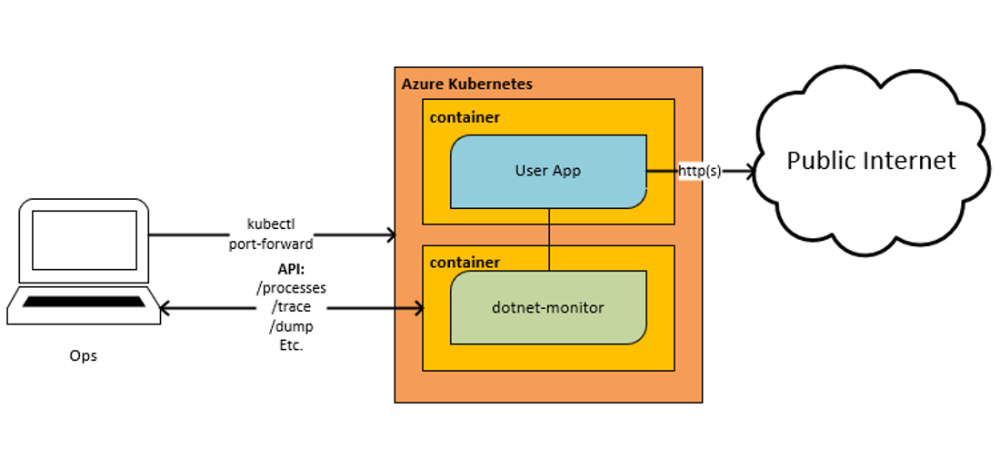
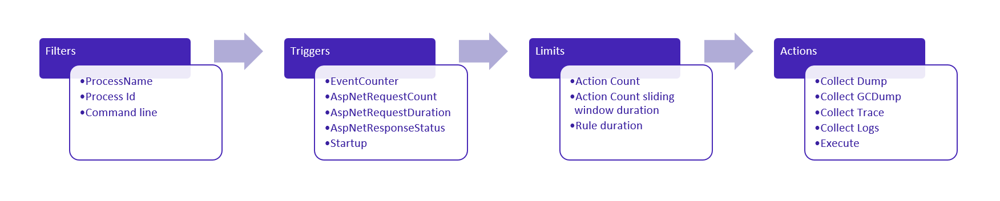

We first introduced `dotnet monitor` as an [experimental tool in June 2020](https://devblogs.microsoft.com/dotnet/introducing-dotnet-monitor/) and have been hard at work to turn it into a production grade tool [over the last year](https://devblogs.microsoft.com/dotnet/whats-new-in-dotnet-monitor/). Today I'm excited to announce the first supported release of `dotnet monitor` as part of .NET 6.

`dotnet monitor` already powers the [Diagnostic tools for .NET applications on Azure App Service on Linux](https://azure.github.io/AppService/2021/11/01/Diagnostic-Tools-for-ASP-NET-Core-Linux-apps-are-now-publicly-available), and we're excited to now see it used in even more environments with this release.

## What is `dotnet monitor`?

Running a .NET application in diverse environments can make collecting diagnostics artifacts (e.g., logs, traces, process dumps) challenging. `dotnet monitor` is a tool that provides an unified way to collect these diagnostic artifacts regardless of whether running you're running on your desktop machine or in a kubernetes cluster.

There are two different mechanisms for collection of these diagnostic artifacts:

- An **HTTP API** for on demand collection of artifacts. You can call these API endpoints when you already know your application is experiencing an issue and you are interested in gathering more information.
- **Triggers** for rule-based configuration for always-on collection of artifacts. You may configure rules to collect diagnostic artifacts when a desired condition is met, for example, collect a process dump when you have sustained high CPU.

## Getting Started

`dotnet monitor` is available via two different distribution mechanisms:

- As a .NET CLI tool; and
- As a container image available via the Microsoft Container Registry (MCR).

### .NET CLI Tool

The `dotnet monitor` CLI tool requires a .NET 6 SDK installed as a pre-requisite. If you do not have a new enough SDK, you can install a new one from the [Download .NET webpage](https://dotnet.microsoft.com/download).

You can download the latest version of `dotnet monitor` using the following command:

```cmd
dotnet tool install -g dotnet-monitor --version 6.0.0
```

If you already have `dotnet monitor` installed and want to update:

```cmd
dotnet tool update -g dotnet-monitor --version 6.0.0
```

### Container image

The `dotnet monitor` container image is available on MCR. You can pull the latest image using the following command:

```cmd
docker pull mcr.microsoft.com/dotnet/monitor:6.0.0
```

## HTTP API

`dotnet monitor` exposes an HTTP API to query available processes, collect diagnostics artifacts, and check on the status on the requested artifacts

The HTTP API exposed by dotnet monitor exposes [the following HTTP endpoints](https://github.com/dotnet/dotnet-monitor/tree/main/documentation/api#http-api-documentation):

- `/processes`- Gets detailed information about discoverable processes.
- `/dump`- Captures managed dumps of processes without using a debugger.
- `/gcdump`- Captures GC dumps of processes.
- `/trace`- Captures traces of processes without using a profiler.
- `/metrics`- Captures a snapshot of metrics of the default process in the Prometheus exposition format.
- `/livemetrics`- Captures live streaming metrics of a process.
- `/logs`- Captures logs of processes.
- `/info`- Gets info about dotnet monitor.
- `/operations`- Gets egress operation status or cancels operations.

The example below showcases the use of `dotnet monitor` to stream `Debug` level logs from `Microsoft.AspNetCore.Server.Kestrel.Connections` category for a duration of sixty seconds from the target process.

```powershell
PS> curl.exe -X POST "https://localhost:52323/logs?name=myWebApp&durationSeconds=60" `
    -H "Accept: application/x-ndjson" `
    -H "Content-Type: application/json" `
    --negotiate -u $(whoami)`
    -d '{\"filterSpecs\": {\"Microsoft.AspNetCore.Server.Kestrel.Connections\": \"Debug\"}}' 


{"Timestamp":"2021-11-05 08:12:54Z","LogLevel":"Debug","EventId":39,"EventName":"ConnectionAccepted","Category":"Microsoft.AspNetCore.Server.Kestrel.Connections","Message":"Connection id \u00220HMD06BUKL2CU\u0022 accepted.","State":{"Message":"Connection id \u00220HMD06BUKL2CU\u0022 accepted.","ConnectionId":"0HMD06BUKL2CU","{OriginalFormat}":"Connection id \u0022{ConnectionId}\u0022 accepted."}}
{"Timestamp":"2021-11-05 08:12:54Z","LogLevel":"Debug","EventId":1,"EventName":"ConnectionStart","Category":"Microsoft.AspNetCore.Server.Kestrel.Connections","Message":"Connection id \u00220HMD06BUKL2CU\u0022 started.","State":{"Message":"Connection id \u00220HMD06BUKL2CU\u0022 started.","ConnectionId":"0HMD06BUKL2CU","{OriginalFormat}":"Connection id \u0022{ConnectionId}\u0022 started."}}
{"Timestamp":"2021-11-05 08:12:54Z","LogLevel":"Debug","EventId":9,"EventName":"ConnectionKeepAlive","Category":"Microsoft.AspNetCore.Server.Kestrel.Connections","Message":"Connection id \u00220HMD06BUKL2CU\u0022 completed keep alive response.","State":{"Message":"Connection id \u00220HMD06BUKL2CU\u0022 completed keep alive response.","ConnectionId":"0HMD06BUKL2CU","{OriginalFormat}":"Connection id \u0022{ConnectionId}\u0022 completed keep alive response."},"Scopes":[{"ConnectionId":"0HMD06BUKL2CU"},{"RequestId":"0HMD06BUKL2CU:00000002","RequestPath":"/"}]}
```

As demonstrated in the example above you can use `dotnet monitor` to on-demand egress diagnostic artifacts from a target process. In addition to logs, you can also collect traces, memory dumps, GC dumps, and metrics from the target process.



## Triggers

`dotnet monitor` can be configured to automatically collect diagnostic artifacts based on conditions within the discovered processes. When a new process is discovered, `dotnet monitor` will attempt to apply conifgured rules if the process matches the filter on a rule. The applied rule will start monitoring the process for the condition that the trigger describes. If that condition is satisfied, the action list is executed assuming the specified limits have not yet been reached.



The example below showcases an example where `dotnet monitor` will collect no more than one triage dump every hour if it detects sustained high CPU usage of greater than 80% for a duration of greater than one minute.

```json
{
  "CollectionRules": {
    "HighCpuRule": {
      "Filters": [
        {
          "Key": "ProcessName",
          "Value": "MyApp",
          "MatchType": "Exact"
        }
      ],
      "Trigger": {
        "Type": "EventCounter",
        "Settings": {
          "ProviderName": "System.Runtime",
          "CounterName": "cpu-usage",
          "GreaterThan": 80,
          "SlidingWindowDuration": "00:01:00"
        }
      },
      "Limits": {
        "ActionCount": 1,
        "ActionCountSlidingWindowDuration": "1:00:00"
      },
      "Actions": [
        {
          "Type": "CollectDump",
          "Settings": {
            "Type": "Triage",
            "Egress": "myBlobStorageAccount"
          }
        }
      ]
    }
  }
}
```

As demonstrated in the example above, you can use `dotnet monitor` to customize the always-on collection of diagnostic artifacts based on heuristics you define for what is considered anomalous behavior for your application. To learn more about the various ways to customize collection, take a look at the docs on [Collection Rules](https://github.com/dotnet/dotnet-monitor/blob/main/documentation/collectionrules.md#collection-rules). We're excited to learn what problems you can solve in production with `dotnet monitor`!

## Feedback

Let us know what we can do to make it easier to diagnose what's wrong with your .NET application. You can [create issues](https://github.com/dotnet/dotnet-monitor/issues/new/choose) or just follow along with the progress of the project on our [GitHub repository](https://github.com/dotnet/dotnet-monitor).
