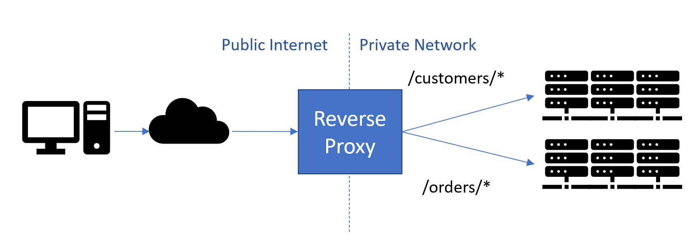
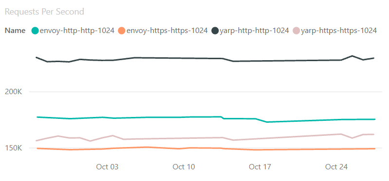

Today we announce the release of YARP 1.0, which can be downloaded from NuGet. YARP (Yet Another Reverse Proxy) is a highly customizable reverse proxy built using .NET. The biggest differentiator between YARP and other reverse proxies is how it is built and packaged – YARP is supplied as a library and samples showing how to create a proxy that is customized to the needs of your specific scenarios.

## What is a reverse proxy?

Reverse proxies are used to listen to incoming HTTP requests and to forward the requests to appropriate servers based on the contents of the request. Unlike a typical firewall/router which acts at layer 4 (TCP/IP), reverse proxies typically work at layer 7 so they understand http and work based on http fields.

When YARP proxies a request, it handles the HTTP connection from the client, and then creates its own connections to the destination server, and both sides can benefit from connection pooling.



Using a reverse proxy has a number of advantages:

- It acts as the public endpoint for a site or set of services, enabling the url-space exposed to be independent from the actual implementation
- Forwards calls to backend servers to perform real work, balancing load between them
- Can offload work from backend servers such as TLS Encryption, Auth<sup>2</sup>, Compression, Caching

## Introducing YARP

[YARP](https://github.com/microsoft/reverse-proxy) is a project to deliver an open-source reverse proxy server based on .NET. It started almost two years ago when we noticed a pattern of questions from teams at Microsoft who were either building a reverse proxy for their service or had been asking about APIs and technology for building one. We decided to get them all together to work on a common solution, which became YARP.

YARP is a reverse proxy toolkit for building fast proxy servers in .NET using the infrastructure from ASP.NET and .NET. The key differentiator for YARP is that it is being designed to be easily customized and tweaked to match the specific needs of each deployment scenario.

The thing we found from talking with teams creating Microsoft services is that each service is slightly off the beaten path, and they had all been building their own solutions, or trying to customize a 3rd party proxy. While they had solutions for HTTP/1.1, they needed HTTP/2 - commonly for gRPC, and HTTP/2 uses a binary framing format which is much more complicated to implement. YARP enables developers to have full control while leveraging the proven feature set of ASP.NET Core and .NET, with the productivity of C# (or other .NET languages).

YARP plugs into ASP.NET as middleware for handling incoming requests, and YARP offers two main paths for use & customization:

- As a full featured proxy - YARP uses configuration to define a set of routes based on URL patterns, these routes map to clusters of destination servers, each destination in a cluster should be able to handle requests for the routes the cluster is mapped to. The destination list is filtered based on session affinity, and server health, then uses a load balancing algorithm to choose between the remaining destinations.

  Each part of this can be customized through configuration and customers can add additional modules, or replace stock modules as needed. The configuration system is extensible so for example route and destination information can be pulled from a source such as Service Fabric.

- Alternatively, for full control the YARP request forwarder can be called directly, bypassing the routing, load-balancing modules etc. This is how YARP is being used by Azure App Service for routing requests to specific instances.

These can even be used together in the same process, switching between them based on the route.

## Getting started

Unlike other proxies that are supplied as an executable that you can extend, YARP reverses the model. You create a proxy using a template that calls into YARP, this makes it much easier to add your own customization and features to YARP.

The following sample is based on the new simplified templates for .NET 6. Examples are [available](https://github.com/microsoft/reverse-proxy/tree/main/samples/BasicYarpSample) for .NET Core 3.1 and .NET 5.

1. Install .NET 6 if not already installed from [https://dotnet.microsoft.com/download](https://dotnet.microsoft.com/download)

2. Create a new web project using

```console
dotnet new web --name MyYarpProxy
```

3. Add a reference to the YARP nuget package:

```console
dotnet add package MyYarpProxy Yarp.ReverseProxy 
```

4. Replace the code in program.cs with:

```c#
var builder = WebApplication.CreateBuilder(args);

builder.Services.AddReverseProxy()
    .LoadFromConfig(builder.Configuration.GetSection("ReverseProxy"));

var app = builder.Build();

app.MapReverseProxy();

app.Run();
```

5. Replace the configuration file in appsettings.json with:

```json
{
    "Urls": "http://localhost:5000;https://localhost:5001",
    "Logging": {
        "LogLevel": {
            "Default": "Information",
            "Microsoft.AspNetCore": "Warning"
        }
    },
    "AllowedHosts": "*",
    "ReverseProxy": {
        "Routes": {
            "minimumroute": {
                "ClusterId": "minimumcluster",
                "Match": {
                    "Path": "{**catch-all}"
                }
            }
        },

        "Clusters": {
            "minimumcluster": {
                "Destinations": {
                    "httpbin.org": {
                        "Address": "https://httpbin.org/"
                    }
                }
            }
        }
    }
}
```

This will create a proxy that will listen to [http://localhost:5000](http://localhost:5000/) and [https://localhost:5001](https://localhost:5001/) and route any requests to [https://httpbin.org](https://httpbin.org/) (a useful site for http debugging.) [Further details on what can be added through configuration](https://microsoft.github.io/reverse-proxy/articles/config-files.html).

## What is in YARP 1.0

This 1.0 release of YARP includes the following features:

### Configuration

- YARP configuration defines the routes and destinations. It can be supplied via:
  - [Static config files](https://microsoft.github.io/reverse-proxy/articles/config-files.html), with file change detection for dynamic updates
  - [Programatic configuration extensibility](https://microsoft.github.io/reverse-proxy/articles/config-providers.html) to interface with other sources
- For hyper-scale hosting, routing can be [fully dynamic and determined by app code](https://microsoft.github.io/reverse-proxy/articles/direct-forwarding.html) and handled by YARP on a per-request basis

### Routing & inbound connections

- YARP can front multiple sites and route based on SNI/Host
- Routing can be based on request URL & [header values](https://microsoft.github.io/reverse-proxy/articles/header-routing.html)
- [Active & passive health checks](https://microsoft.github.io/reverse-proxy/articles/dests-health-checks.html#active-health-checks) to confirm the availability of destinations, and filter out bad entries
- [Session Affinity](https://microsoft.github.io/reverse-proxy/articles/session-affinity.html) will route subsequent requests to the same destination if required
- Multiple algorithms for [load balancing](https://microsoft.github.io/reverse-proxy/articles/load-balancing.html) across destinations
- [Authentication, authorization](https://microsoft.github.io/reverse-proxy/articles/authn-authz.html) and CORS for specific routes

### Proxying & outbound connections

- Incoming request Url can be [transformed](https://microsoft.github.io/reverse-proxy/articles/transforms.html#request-transforms) before passing to destination(s)
- [Request](https://microsoft.github.io/reverse-proxy/articles/transforms.html#requestheaderscopy) and [response](https://microsoft.github.io/reverse-proxy/articles/transforms.html#response-and-response-trailers) headers can be transformed
- Http [Methods can be transformed](https://microsoft.github.io/reverse-proxy/articles/transforms.html#httpmethodchange) (eg POST to PUT)
- [Outbound http connections](https://microsoft.github.io/reverse-proxy/articles/http-client-config.html) to destinations are configurable
- Proxy [adds standard headers](https://microsoft.github.io/reverse-proxy/articles/transforms.html#defaults) related to request forwarding
- [gRPC](https://microsoft.github.io/reverse-proxy/articles/grpc.html) and web sockets traffic including streaming

### Diagnostics

- [Metrics](https://github.com/microsoft/reverse-proxy/tree/main/samples/ReverseProxy.Metrics.Sample) for monitoring performance
- Logging for detailed tracking of each request

### General

- Proxy has cloud scale performance
- [Documentation](https://microsoft.github.io/reverse-proxy/articles/index.html)
- Easy extensibility - Customers can add [middleware](https://microsoft.github.io/reverse-proxy/articles/middleware.html) to customize the proxy functionality such as routing, header manipulation
- [Support for .NET Core 3.1, .NET 5 & .NET 6](https://microsoft.github.io/reverse-proxy/articles/runtimes.html)

## Documentation

[YARP documentation](https://microsoft.github.io/reverse-proxy/articles/index.html).

## Performance

Performance of the proxy will depend on a number of factors:

- Version of http used by clients to the proxy
- Version of http used by the proxy to the destination
- Whether TLS encryption is used
- Size of request/response headers and content payloads

We have a set of benchmarks that get run daily against YARP and other proxy servers. This is measured in a lab using the "[citrine](https://www.techempower.com/benchmarks/#section=environment)" hardware definition created to measure the TechEmpower benchmarks. The results are presented using a PowerBI dashboard that can be used to compare against other proxies. For example, comparing YARP and Envoy for (incoming-outgoing protocol) http-http1.1 & https-https1.1  with results in October &#39;21 looks like:



The dashboard can be found at [https://aka.ms/aspnet/benchmarks](https://aka.ms/aspnet/benchmarks). Once there, at the bottom of the page is a widget to select the page. Proxy results are on page 16.

> **Hint:** Clicking the text "1 of 21" will bring up a menu of pages, where "Proxies" can be selected directly.

## Open Source

YARP is being developed and delivered as an open source project. It is hosted on github at [https://github.com/microsoft/reverse-proxy](https://github.com/microsoft/reverse-proxy). We welcome contributions, issues and discussions at the repo.

## Support

YARP support is provided by the product team - the engineers working on YARP - which is a combination of members from ASP.NET and the core libraries networking teams. We do not provide 24/7 support or &#39;carry pagers&#39;, but as we have team members located in Prague and Redmond we generally have good time zone coverage. Bugs should be reported in github using the issue [templates](https://github.com/microsoft/reverse-proxy/issues/new?assignees=&labels=Type%3A+Bug&template=bug.md) and will typically be responded to within 24hrs. If you find a security issue we ask you to [report it via the Microsoft Security Response Center (MSRC)](https://github.com/microsoft/reverse-proxy/blob/main/SECURITY.md).

We will service 1.0 for security or other significant issues. New features will be considered for future versions. We expect to start releasing preview builds of the next version in the next couple of months.

## Thank you to contributors

In addition to the contributions from Microsoft employees, we are very grateful to have received a number of PRs and issues from the community. Thank you to those who contributed PRs to make this release happen - @amweiss, @anorborg, @BennyM, @dpbevin, @epignosisx, @ericwj, @ganesanarun, @gustavopaes, @hughesjon, @ihvo, @Insomniak47, @isaacabraham, @jboelter, @jmezach, @jrunyen, @jtkech, @Marusyk, @MeladKamari, @MoienTajik, @NoahStahl, @rwkarg, @sharkAndshark, @sleemer, @stefanolsenn, @Tornhoof, @vdjuric, @WeihanLi, @William-Yeh.

I want to make a special call out to @Kahbazi who made an amazing 86 commits and was a more prolific contributor than many of the people assigned to the project.

## What&#39;s next

Work on the reverse proxy will continue. Items we have on our list to work on for the next version include:

- Support for HTTP/3 – initial testing shows that it mostly works, but we want to have a solid implementation in YARP [#1208](https://github.com/microsoft/reverse-proxy/issues/1208)
- More performance optimization – We will have another push on performance, and use YARP to drive additional performance features into .NET
- Use [LLHTTP](https://github.com/dotnet/runtimelab/tree/feature/LLHTTP2) to provide more control over outbound connections and more efficient processing of headers. LLHTTP is an experiment to develop a lower level HTTP API than HttpClient to enable much more control over how HTTP requests are made and handled.
- Support for Service Fabric – Early previews of YARP included a module for Service Fabric integration. That was insufficient for large scale site deployments typical of sites using Service Fabric. We are working with SF team members to implement a more robust and scalable solution for dynamically configuring the proxy based on SF data[ #257](https://github.com/microsoft/reverse-proxy/pull/257)
- @jkotalik wrote a prototype implementation for integration with Kubernetes. The Microsoft team members working on YARP are not experts in k8s deployments, so we are working with community members to further develop this integration.[ #200](https://github.com/microsoft/reverse-proxy/issues/200)
